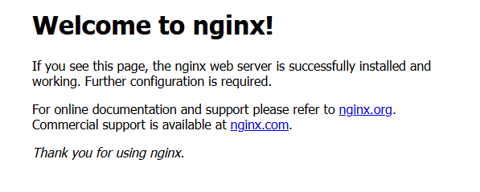

[toc]

# Nginx容器笔记

## 下载Nginx镜像

```shell
# 下载nginx镜像
docker pull nginx
```

## 部署Nginx容器

```shell

# 创建并后台启动nginx容器
# --name nginx01 容器名称为nginx01
# -p 38081:80 主机的38081端口映射到Nginx容器的80端口
# -d 后台运行，默认不会进入容器
# nginx 镜像名，指定生成该容器的镜像
docker run --name nginx01 -p 38081:80 -d nginx

# 进入到nginx容器的终端中
docker exec -it nginx01 /bin/bash

# 查询所有容器
docker ps

```

访问nginx首页 `http://localhost:38081`。若如图所示，则表示Nginx容器部署成功。 



如果是在云服务器上部署Nginx容器，记得在云服务器的防火墙上开通38081端口。

### 设置Nginx容器数据卷

Nginx容器中有三个目录需要设置数据卷。方便日后修改。

- /etc/nginx/conf.d 目录：nginx容器的配置文件
- /usr/share/nginx/html 目录：nginx容器的网页内容目录
- /var/log/nginx 目录：nginx容器的日志目录

① 先创建Nginx容器数据卷

在主机上创建一个目录作为数据卷目录
```sh
mkdir /xxx/nginx01
```

② 把上面部署的Nginx容器中的/etc/nginx目录中的文件复制到数据卷目录中

这一步的目的是拷贝配置,页面，日志文件，否则新的Nginx容器没有这些文件，会无法成功运行。

```sh
docker cp nginx01:/etc/nginx /xxx/nginx01/conf
docker cp nginx01:/usr/share/nginx/html /xxx/nginx01/html
docker cp nginx01:/var/log/nginx /xxx/nginx01/log
```

③ 删除之前的nginx容器

```sh
docker rm -f nginx01
```

④ 启动新的nginx容器，并设置容器数据卷目录

因此部署新的Nginx容器的启动命令可以修改为下面的。
```shell
docker run -d -p 38081:80 --name nginx01 -v /xxx/nginx01/conf:/etc/nginx -v /xxx/nginx01/html:/usr/share/nginx/html -v /xxx/nginx01/log:/var/log/nginx nginx

# `/xxx/nginx01` 是主机的某个目录，需要自己提前创建。
```

