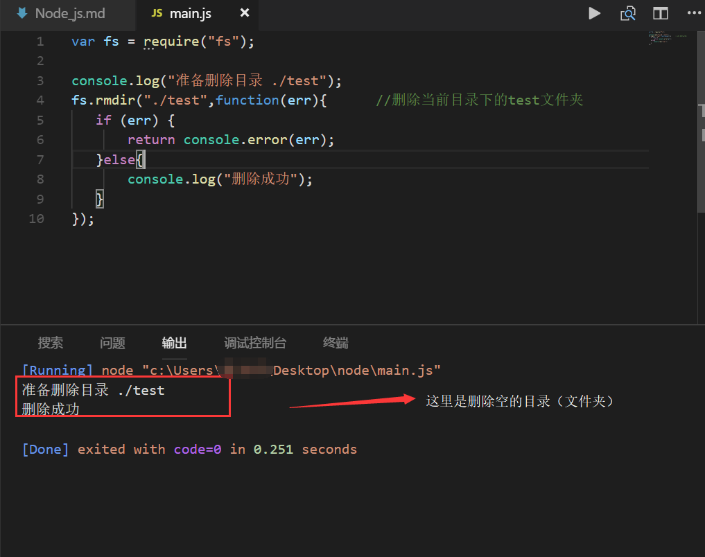

[toc]

# NodeJs基础

## 前言

> 为什么JavaScript可以在浏览器上运行？

因为浏览器中包含JavaScript引擎，JavaScript引擎专门用于解析JavaScript代码并执行。

不同的浏览器使用的JavaScript引擎不同。例如Chrome浏览器使用的JavaScript引擎是V8引擎。V8引擎在众多JavaScript引擎中性能非常好。

> 为什么JavaScript能操作浏览器中的DOM,BOM?
 
因为每个浏览器都内置了操作DOM,BOM的api函数。js代码通过调用这些api函数来操作浏览器中的DOM,BOM。

> 什么是Node.js?

Node.js是一个JavaScript运行环境，其内置了V8引擎。因此Node.js可以解析JavaScript代码并执行。


node.js中没有内置DOM,BOM的api函数。因此node.js无法操作DOM,BOM。


## 1.安装Node.js

1. 下载Node.js安装包:
[Node.js中文网](http://nodejs.cn/)
下载node.js安装包，一路默认即可

2. 安装node.js：
在Windows上安装时务必选择全部组件，包括勾选Add to Path

3. 执行语句：
Windows环境下，在cmd中输入node -v，出现版本号，表示安装正常。

```
>node -v
v8.11.1
```

4. 更换为cnpm,下载更快

```
npm install -g cnpm --registry=https://registry.npm.taobao.org
cnpm -v
```

5. 如何卸载node.js

Windows版本：
```
1.在控制面板-程序-程序和功能中卸载

2.文件夹中进行进一步的删除
C:\Program Files (x86)\Nodejs
C:\Program Files\Nodejs
C:\Users\Administrator\AppData\Roaming\npm
C:\Users\Administrator\AppData\Roaming\npm-cache

3.检查环境变量中Path中有没有,有的话 进行删除
4. 最后 重启一下 结束

```

## 2.NPM

### 1.认识NPM：

Node.js内置了npm包管理工具。安装了node.js就安装了npm

```
npm其实是Node.js的包管理工具（node.js package manager）。
当我们在Node.js上开发时，会用到很多别人写的JavaScript代码。
如果我们要使用别人写的某个包，每次都根据名称搜索一下官方网站，下载代码，解压，再使用，非常繁琐。
于是一个集中管理的工具应运而生：大家都把自己开发的模块打包后放到npm官网上，如果要使用，直接通过npm安装就可以直接用，不用管代码存在哪，应该从哪下载。
如果我们要使用模块A，而模块A又依赖于模块B，模块B又依赖于模块X和模块Y，npm可以根据依赖关系，把所有依赖的包都下载下来并管理起来。否则，靠我们自己手动管理，肯定既麻烦又容易出错。

常见的使用场景有以下几种：
①：允许用户从NPM服务器下载别人编写的三方包到本地使用。
②：允许用户从NPM服务器下载并安装别人编写的命令行程序到本地使用。
③：允许用户将自己编写的包或命令行程序上传到NPM服务器供别人使用。
```


查看npm的版本
```
C:\>npm -v
5.6.0
```

### 2.使用NPM：

[NPM官网https://www.npmjs.com/](https://www.npmjs.com/)


```js
//通过npm下载包
npm install 包名


```

<font color="red">
下载的第三方包就放在了工程目录下的node_modules目录中，之后在代码中只需要通过`require('包名')`的方式就可以引用，无需指定三方包路径。
</font>


## 3.命令行运行node程序：

1. 编写hello.js文件：
```js
'use strict';  //以严格模式运行JavaScript代码，避免各种潜在陷阱。
console.log('Hello, world');
```

2. 命令行运行该js文件：
```
C:\nodejs>node hello.js
Hello, world
```

## 4.严格模式

**严格模式通过在脚本或函数的头部添加 "use strict"; 表达式来声明。**

为什么使用严格模式:
1. 消除Javascript语法的一些不合理、不严谨之处，减少一些怪异行为;
2. 消除代码运行的一些不安全之处，保证代码运行的安全；
3. 提高编译器效率，增加运行速度；
4. 为未来新版本的Javascript做好铺垫。

使用严格模式：
1. 如果在JavaScript文件开头写上'use strict';，那么Node在执行该JavaScript时将使用严格模式。

## 5. Node.js开发环境

一般Node.js开发环境可以选择Visual Studio Code。  
Visual Studio Code 需要安装 Code Runner插件。  

## 6.模块
在Node环境中，一个.js文件就称之为一个模块（module）。

<font color="red">在编写每个模块时，都有require、exports、module三个预先定义好的变量可供使用。</font>

> 编写模块的好处：
> ①：当一个模块编写完毕，就可以被其他地方引用。我们在编写程序的时候，也经常引用其他模块，包括Node内置的模块和来自第三方的模块。
> ②：使用模块还可以避免函数名和变量名冲突。相同名字的函数和变量完全可以分别存在不同的模块中，因此，我们自己在编写模块时，不必考虑名字会与其他模块冲突。


例子：

①：编写hello.js模块
```js
'use strict';
var s = 'Hello';
console.info(s);
function greet(name) {
    console.log(s + ', ' + name + '!');
}
module.exports = greet; //将greet方法暴露出去
```

② 编写main.js模块，并调用hello.js模块：
```js
'use strict';
// 引入hello模块:
var greet = require('./hello');   
var s = 'Michael';
greet(s); // Hello, Michael!
```

### 1.require变量的用法

>1 加载模块（js文件）
require函数用于在当前模块中加载别的模块，传入一个模块名，返回一个模块导出对象。模块名可使用相对路径（以./开头），或者是绝对路径（以/或C:之类的盘符开头）。
另外，模块名中的.js扩展名可以省略。

```js
var he1 = require('./hello');
var he2 = require('./hello.js');
```

>2 加载json文件：
可以在js文件中加载json文件
`var jsonstr = require('./data.json');`

### 2. exports变量的用法

exports对象用于导出模块（js文件）中的公有方法和属性。别的模块通过require函数使用当前模块时得到的就是当前模块的exports对象。

<font color="red">module.exports 与 exports 具有相同功能。因为exports是module的属性之一。</font>

```js
function greet(name) {
    console.log(s + ', ' + name + '!');
}
module.exports = greet;   //导出一个函数

exports.hello = function () {     //导出一个匿名函数
    console.log('Hello World!');
};

var a="sss";
exports=a;      //导出一个变量
```

### 3.module变量的用法

通过module对象可以访问到当前模块的一些相关信息，但最多的用途是替换当前模块的导出对象。

```js
module.exports = function () {    //模块默认导出对象被替换为一个函数。
    console.log('Hello World!');
};
```


### 4.小结：

```
模块初始化:
一个模块中的JS代码仅在模块第一次被使用时执行一次，并在执行过程中初始化模块的导出对象。之后，缓存起来的导出对象被重复利用。

主模块:
通过命令行参数传递给NodeJS以启动程序的模块被称为主模块。主模块负责调度组成整个程序的其它模块完成工作。
```

## 7.包

模块的基本单位是单个JS文件，但复杂些的模块往往由多个子模块组成。为了便于管理和使用，可以把由多个子模块组成的大模块称做包，并把所有子模块放在同一个目录里。

<font color="red">在组成一个包的所有子模块中，需要有一个入口模块，入口模块的导出对象被作为包的导出对象。</font>

例如有以下目录结构(lib目录下有cat目录，该文件里有三个模块):
```
- /home/user/lib/
    - cat/
        head.js
        body.js
        main.js
```

main.js作为入口模块，其内容如下：

```js
var head = require('./head');     //导入head模块
var body = require('./body');     //导入body模块
exports.create = function (name) {    //把main模块的暴露出去
    return {
        name: name,
        head: head.create(),
        body: body.create()
    };
};
```

其他js文件中导入cat模块的入口main.js文件：
```js
require('/home/user/lib/cat/main')
```

## 8.标准工程目录：
一个标准的工程目录都看起来像下边这样:
```
- /home/user/workspace/node-echo/   # 工程目录
    - bin/                          # 存放命令行相关代码
        node-echo
    + doc/                          # 存放文档
    - lib/                          # 存放API相关代码
        echo.js
    - node_modules/                 # 存放三方包
        + argv/
    + tests/                        # 存放测试用例
    package.json                    # 元数据文件
    README.md                       # 说明文件
```

## 9. global全局对象，全局变量，process进程对象：

### global全局对象

在Node.js环境中，也有唯一的全局对象，叫global，这个对象的属性和方法和浏览器环境的window不同。进入Node.js交互环境，可以直接输入：

```
> global.console
Console {
  log: [Function: bound ],
  info: [Function: bound ],
  warn: [Function: bound ],
  error: [Function: bound ],
  dir: [Function: bound ],
  time: [Function: bound ],
  timeEnd: [Function: bound ],
  trace: [Function: bound trace],
  assert: [Function: bound ],
  Console: [Function: Console] }

```

### 全局变量

Node.js 中的全局对象是global，global对象的属性就是全局变量。

在 Node.js可以直接访问到global全局对象的属性，因此无需直接引入全局对象global。 

1. 全局变量 __filename，__dirname

```js
// __filename 表示当前正在执行的脚本的文件绝对路径。
console.log( __filename );
// __dirname 表示当前执行脚本所在的目录。
console.log( __dirname );
```

2. 全局函数setTimeout(cb, ms); 只执行一次的定时器。作用是在指定的毫秒(ms)数后执行指定函数(cb)。

```js
function printHello(){
   console.log( "Hello, World!");
}
// 两秒后执行以上函数
var t = setTimeout(printHello, 2000);  //t代表该定时器本身

// 运行结果：
// `Hello, World!`
```


3. 全局函数：clearTimeout(t);

用于停止setTimeout()函数创建的定时器。 参数 t 是通过 setTimeout() 函数创建的定时器的返回值，代表该定时器本身。

```JS
function printHello(){
   console.log( "Hello, World!");
}
// 两秒后执行以上函数
var t = setTimeout(printHello, 2000);
// 通过定时器的返回值t，来清除定时器t
clearTimeout(t);   
```

4. 全局函数：setInterval(cb, ms); 执行多次的定时器

作用是在指定的毫秒(ms)数后执行指定函数(cb)。返回一个代表定时器的句柄值。
etInterval() 方法会不停地调用函数，直到使用clearInterval()函数来清除或窗口被关闭。

```js
function printHello(){
   console.log( "Hello, World!");
}
// 每隔两秒执行以上函数,会永久执行下去，直到你按下 ctrl + c 按钮。
setInterval(printHello, 2000);
```


6. 全局函数 console  用于提供控制台标准输出.

```js
console.log("xxxxxxx")
console.info("xxxxxxx")
console.error("xxxxxxx")
console.warn("xxxxxxx")
```


### process进程对象

process也是Node.js提供的一个对象，它代表当前Node.js进程。通过process对象可以拿到许多有用信息：

```
> process === global.process;
true
> process.version;
'v5.2.0'
> process.platform;
'darwin'
> process.arch;
'x64'
> process.cwd();                   //返回当前工作目录
'/Users/michael'
> process.chdir('/private/tmp');   // 切换当前工作目录
undefined
> process.cwd();
'/private/tmp'
```

## 10. Node.js提供的官方模块

### fs模块---文件系统模块

fs模块是 Node.js官方提供的，用来操作文件的模块(读取/写入)。它提供了一些属性和方法，用来满足用户对文件的操作。

#### 1.读取文件数据

```js
//加载fs模块
var fs = require("fs"); 
// 异步读取
fs.readFile('1.txt', function (err, data) {
   if (err) {
       return console.error(err);
   }
   console.log("异步读取: " + data.toString());
});


// 同步读取
var data = fs.readFileSync('1.txt');
console.log("同步读取: " + data.toString());
console.log("程序执行完毕。");
```

③：运行结果：


#### 2.获取文件属性

```
获取文件信息的语法格式：
fs.stat(path, callback);

path: 文件路径。
callback ：回调函数。带有两个参数如：(err, stats), stats 是 fs.Stats 对象。
```

```js
var fs = require("fs");      //引入内置模块js
console.log("准备打开文件！");
fs.stat('./1.txt', function (err, stats) {
   if (err) {
       return console.error(err);
   }
   console.log(stats);
   console.log("读取文件信息成功！");
   // 检测文件类型
   console.log("是否为文件(isFile) ? " + stats.isFile());
   console.log("是否为目录(isDirectory) ? " + stats.isDirectory());    
});
```


#### 3.写入数据到文件中

```
写入文件的语法格式([...]表示参数可有可无)：
fs.writeFile(filename, data, [options], [callback(err)])

参数名称解析：
filename - (String) - 文件名称
data    - (String | Buffer) -  将要写入的内容，可以使字符串 或 buffer数据。
options  - (Object) -  option数组对象，包含：
----encoding - (string)  - 可选值，默认 ‘utf8′，当data使buffer时，该值应该为 ignored。
----mode  - (Number) - 文件读写权限，默认值 438
----flag - (String) - 默认值 ‘w'
callback -  {Function} - 回调，传递一个异常参数err。
```


**writeFile 直接写入文件默认是 w 模式，所以如果文件存在，该方法写入的内容会覆盖旧的文件内容。**

例子：
```js
var fs = require("fs");
console.log("准备写入文件");
fs.writeFile('./1.txt', '我是通过fs.writeFile 写入文件的内容',  function(err) {
   if (err) {
       return console.error(err);
   }
   console.log("数据写入成功！");
   console.log("--------我是分割线-------------");
   console.log("读取写入的数据！");
   fs.readFile('./1.txt', function (err, data) {
      if (err) {
         return console.error(err);
      }
      console.log("异步读取文件数据: " + data.toString());
   });
});
```

<font color="red">
ps:这里的写入文件数据是把之前的数据删除，在重新写入数据。因为options参数的flag的属性的默认值为 "w",如果文件存在，该方法写入的内容会覆盖旧的文件内容。
</font>

运行结果：


#### 4. 删除文件

```
以下为删除文件的语法格式：
fs.unlink(path, callback);

path - 文件路径。
callback - 回调函数，没有参数。
```

DEMO:
```js
var fs = require("fs");
console.log("准备删除文件！");
fs.unlink('./1.txt', function(err) {
   if (err) {
       return console.error(err);
   }
   console.log("文件删除成功！");
});
```


#### 5.创建目录

```
以下为创建目录的语法格式：
fs.mkdir(path,[mode], callback)

path - 文件路径。
mode - 设置目录权限，默认为 0777。
callback - 回调函数，没有参数。
```

DEMO：
```js
var fs = require("fs");
console.log("创建目录 ./testA/testB/");
fs.mkdir("./testA/testB/",function(err){
   if (err) {
       return console.error(err);
   }
   console.log("目录创建成功。");
});
```


#### 6.读取目录信息

```
以下为读取目录的语法格式：
fs.readdir(path, callback);

path - 文件路径。
callback - 回调函数,有两个参数(err, files)，err 为错误信息，files 为 目录下的文件数组列表。
```

DEMO:
```js
var fs = require("fs");
console.log("查看 /test 目录");
fs.readdir("./test/",function(err, files){     
   if (err) {
       return console.error(err);
   }
   files.forEach( function (file){     //循环输出文件信息列表
       console.log(file);
   });
});
```


#### 7.删除空目录

```
以下为删除空目录的语法格式：
fs.rmdir(path, callback);

path - 文件路径。
callback - 回调函数，没有参数。
```

DEMO:
```js
var fs = require("fs");
// 执行前创建一个空的 ./test 目录
console.log("准备删除空目录 ./test");
fs.rmdir("./test",function(err){      //删除当前目录下的test文件夹
   if (err) {
       return console.error(err);
   }else{
       console.log("删除成功");
   }
});
```




### util模块---提供常用函数的集合：

#### 1.util.inspect 返回对象的字符串形式

```
语法：
util.inspect(object,[showHidden],[depth],[colors]);

object: 即要转换的对象。
showHidden: 是一个可选参数，如果值为 true，将会输出更多隐藏信息。
depth 表示最大递归的层数.
如果color 值为 true，输出格式将会以ANSI 颜色编码，通常用于在终端显示更漂亮的效果。
```

DEMO:
```js
var util = require('util'); 
function Person() { 
    this.name = 'byvoid'; 
    this.toString = function() { 
    return this.name; 
    }; 
} 
var obj = new Person(); 
console.log("输出正常信息："+util.inspect(obj)); 
console.info("=================");
console.log("输出更多信息："+util.inspect(obj, true));   //这里的showHidden参数为true
```


#### 2.util.isArray(object);

如果参数 "object" 是一个数组返回true，否则返回false。

```js
var util = require('util');
util.isArray([]);
  // true
util.isArray(new Array);
  // true
util.isArray({});
  // false
```


#### 3.util.isRegExp(object);

如果参数 "object" 是一个正则表达式返回true，否则返回false。
```js
var util = require('util');
util.isRegExp(/some regexp/);
  // true
util.isRegExp(new RegExp('another regexp'));
  // true
util.isRegExp({});
  // false
```


#### 4.util.isDate(object)

如果参数 "object" 是一个日期返回true，否则返回false。
```js
var util = require('util');
util.isDate(new Date());
  // true
util.isDate({})
  // false
```

#### 5.util.isError(object);

如果给定的参数 "object" 是一个错误对象返回true，否则返回false。

```js
var util = require('util');
util.isError(new Error())
  // true
util.isError(new TypeError())
  // true
util.isError({ name: 'Error', message: 'an error occurred' })
  // false
```

## 11. Node.js 函数：

Node.js中函数的使用与Javascript类似。

### 1.把函数作为另一个函数的变量:

DEMO:
```js
function say(word) {     //定义一个say函数。
  console.log(word);
}

function execute(someFunction, value) {   
  someFunction(value);
}

execute(say, "Hello");   
```

运行结果：
```
Hello
```

### 2.匿名函数：

DEMO:
```JS
function execute(someFunction, value) {
  someFunction(value);
}

/*
在 execute 接受第一个参数的地方直接定义了我们准备传递给 execute 的函数。
这样的函数参数不用写函数名，称为匿名函数。
*/
execute(function(word){ console.log(word) }, "Hello");
```

