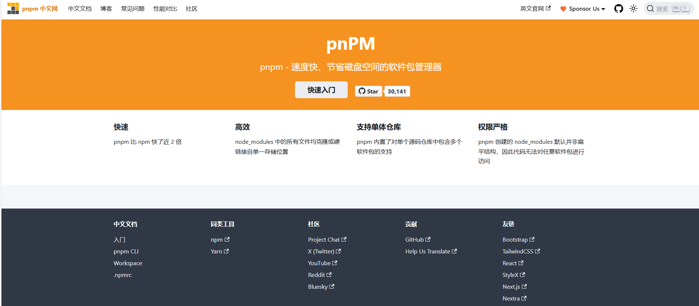

[toc]

# pnpm笔记

[pnpm中文官网 https://www.pnpm.cn/](https://www.pnpm.cn/)



pnpm 本质上就是一个包管理器，这一点跟 npm/yarn 没有区别，但它的优点在于:
- 包安装速度极快；
- 磁盘空间利用非常高效。

## pnpm的安装

```
# 先通过npm，全局安装 pnpm
npm i -g pnpm

# 验证安装
pnpm -v
```

## pnpm的使用

pnpm的使用与npm的使用大致相同。

### pnpm add

pnpm add 命令用于安装依赖包。默认会从 npm 仓库中安装最新的依赖包。

```
## 安装vue软件包
pnpm add vue
```

### pnpm install (别名 pnpm i)

pnpm install 用于安装项目中包含的所有依赖包。

```
pnpm install
```

### pnpm remove (别名 pnpm rm，pnpm uninstall)

pnpm remove 从 node_modules 和项目 package.json 中删除软件包。

```
# 删除项目中的vue软件包
pnpm remove vue

pnpm rm vue

pnpm uninstall vue
```

### pnpm update （别名 pnpm upgrade）

pnpm update 根据指定的范围更新软件包的最新版本。若在不带参数的情况下使用时，将更新所有软件包的版本。

```
# 更新vue软件包的版本
pnpm update vue
```

## pnpm 和 npm/yarn 的区别

[参考文章 https://www.cnblogs.com/cangqinglang/p/14448329.html](https://www.cnblogs.com/cangqinglang/p/14448329.html)