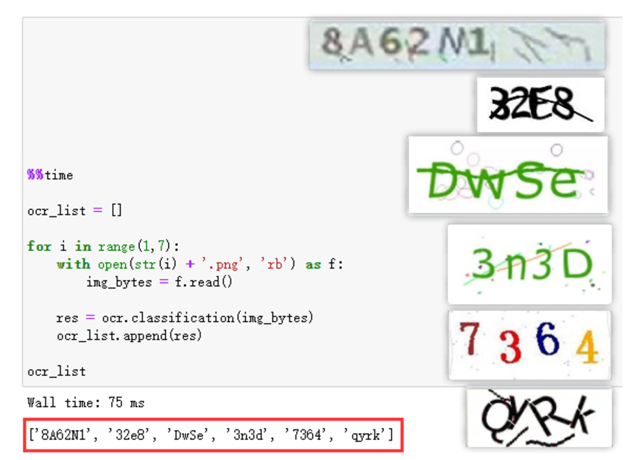

[toc]

# Python使用DdddOcr验证码识别库

DdddOcr，又名 带带弟弟OCR。是一个通用的验证码的本地离线OCR识别库。

DdddOcr，通过大批量生成随机数据后进行深度网络训练。

[DdddOcr项目地址](https://github.com/sml2h3/ddddocr)


## 安装DdddOcr库

```py
pip install ddddocr
```

## 例子

```py
import ddddocr

ocr = ddddocr.DdddOcr()
with open('1.png', 'rb') as f:
    img_bytes = f.read()
res = ocr.classification(img_bytes)

print(res)
```

## 其他网上例子

