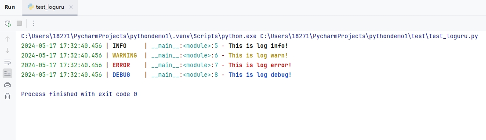

[toc]

# Python使用Loguru日志库笔记

Loguru是目前最流行的python第三方日志库。简单来说就是一个方便（且好看）的控制台+文件的日志库。

> Loguru 特点如下
1. 可以区分不同类型的日志：正常，警告，错误，严重等。
2. 可以配置指定的日志文件名称。
3. 可以配置指定的日志输出格式。
4. 可以把不同的日志类型写到不同的文件中。
5. 可以配置按照时间，文件大小等条件对日志文件进行滚动分割。
6. 支持异步写日志。
7. 支持线程安全和进程安全写入日志。
8. 可以方便的记录，支持python的string format格式。

## 安装

Loguru 仅支持 Python 3.5 及以上的版本，使用 pip 安装即可。

```bash
pip install loguru
```

## 默认使用

Loguru 的主要使用对象只有一个：logger

```py
# 导入loguru模块
from loguru import logger
# 打印各种级别的日志消息
logger.info("This is log info!")
logger.warning("This is log warn!")
logger.error("This is log error!")
logger.debug("This is log debug!")
```

控制台输入如下


Loguru 会提前配置一些基础信息，自动输出时间、日志级别、模块名、行号等信息，而且根据等级的不同，还自动设置了不同的颜色，方便观察，真正做到了开箱即用。

## 日志级别

Loguru提供了七层日志层级，或者说七种日志类型。  

每种类型的日志有一个整数值，表示日志层级。从小到大的日志级别排序如下
- TRACE (5): 用于记录程序执行路径的细节信息，以进行诊断。  
- DEBUG (10): 开发人员使用该工具记录调试信息。  
- INFO (20): 用于记录描述程序正常操作的信息消息。  
- SUCCESS (25): 类似于INFO，用于指示操作成功的情况。  
- WARNING (30): 警告类型，用于指示可能需要进一步调查的不寻常事件。  
- ERROR (40): 错误类型，用于记录影响特定操作的错误条件。  
- CRITICAL (50): 严重类型，用于记录阻止核心功能正常工作的错误条件

另外Loguru默认使用DEBUG作为其最低日志级别，因此任何严重性低于DEBUG的日志信息都会被忽略。

意思就是说只有 大于等于 DEBUG 级别的日志消息才会输出。小于 DEBUG 级别的日志消息不会输出。

## 自定义日志配置 add() 函数

除了Loguru提供的默认日志配置之外，我们还可以自定义日志配置。

通过 add() 函数，可以轻松定制 Loguru 的内部配置，该函数可处理从日志格式化到日志文件设置等一切配置操作。

下面是add()方法的完整参数：

```py
from loguru import logger

logger.add(sink, *, level='DEBUG', 
format='<green>{time:YYYY-MM-DD HH:mm:ss.SSS}</green> | <level>{level: <8}</level> | <cyan>{name}</cyan>:<cyan>{function}</cyan>:<cyan>{line}</cyan> - <level>{message}</level>', 
filter=None, colorize=None, serialize=False, backtrace=True, 
diagnose=True, enqueue=False, catch=True, **kwargs)
```

基本参数
- sink：默认情况下，它设置为 sys.stderr。 它可以是一个file对象，也可以是一个文件路径，也可以是一个方法名称。
    - 当sink是一个file对象的时候，日志信息会传输给该文件对象。
    - 当sink是一个文件路径的时候，loguru会根据这个文件路径，创建一个日志文件，然后将日志信息写入到日志文件中。
    - 当sink是一个方法的时候，日志信息会传递给方法参数。从而可以在方法中自定义日志输出方式。
- level：最低日志级别。
- format：日志格式模板。
- filter：一个可选的指令，用于确定一条记录是否应该被记录。 
- colorize: 采用布尔值并确定是否应启用终端是否显示颜色。 
- serialize：如果设置为 True，则日志记录以 JSON 格式呈现。 
- backtrace：显示生成错误的完整堆栈跟踪，以便于调试。
- diagnose：确定变量值是否应在异常跟踪中显示。在生产环境中应将其设置为 False，以避免泄露敏感信息。
- enqueue：启用此选项会将日志记录放入队列中，以避免多个进程记录到同一目的地时发生冲突。 
- catch：如果在记录到指定的接收器时发生意外错误，您可以通过将此选项设置为 True 来捕获该错误。错误将打印到标准错误。
- **kwargs：更多的附加参数（见下文）。


当且仅当 sink 是文件路径时，可以有以下附加参数：
- rotation：一种条件，指示何时关闭当前日志文件并开始使用新的日志文件。
    - 如果是整数，表示日志文件保留的最大字节数，如果超过则重新创建新的日志文件。
    - 如果是时间字符串，则表示当达到该时间的时候，重新创建新的日志文件。
- retention：日志文件保留条件。
- compression：日志文件在关闭时应转换为的压缩或存档格式。
- delay：是在配置 sink 后立即创建文件，还是延迟到第一条记录的消息时再创建。默认为 False。
- mode：内置 open() 函数的打开模式，默认为 a（以追加模式打开文件）。
- buffering：内置 open() 函数的缓冲策略，默认为1（行缓冲文件）。
- encoding：内置 open() 函数的文件编码，如果 None，则默认为 `locale.getpreferredencoding()`。
- \kwargs：其他传递给内置 open() 函数的参数。


当且仅当 sink 是函数时，可以有以下附加参数：
- loop：将在其中调度和执行异步日志记录任务的事件循环。如果为 None，将使用 asyncio.get_event_loop() 返回的循环。


## 自定义日志默认级别

自定义日志默认级别为INFO

```py
from loguru import logger

# 先去除Loguru提供的默认日志配置
logger.remove(0)
# 设置默认日志级别为INFO
logger.add(level="INFO")

```

- remove()方法被首先调用，以删除默认配置（其ID为0）。


## 自定义日志文件

自定义日志文件配置，从而将日志保存到文件上。

```py
# 导入loguru模块
from loguru import logger
# 设置日志文件为test01.log
logger.add('test01.log')

# 打印各种级别的日志消息
logger.info("This is log info!")
logger.warning("This is log warn!")
logger.error("This is log error!")
logger.debug("This is log debug!")
```

程序运行结束后，不光会在控制台上输出日志信息。同时也会在当前目录中创建一个test01.log日志文件，并把日志信息输出到日志文件中。


> 将不同类型的日志记录到不同的文件中

```py
from loguru import logger

# 设置不同级别的日志输出文件
logger.add("./logs/debug.log", level="DEBUG", rotation="10 MB", filter=lambda record: record["level"].name == "DEBUG")
logger.add("./logs/info.log", level="INFO", rotation="10 MB", filter=lambda record: record["level"].name == "INFO")
logger.add("./logs/warning.log", level="WARNING", rotation="10 MB", filter=lambda record: record["level"].name == "WARNING")
logger.add("./logs/error.log", level="ERROR", rotation="10 MB", filter=lambda record: record["level"].name == "ERROR")
logger.add("./logs/critical.log", level="CRITICAL", rotation="10 MB", filter=lambda record: record["level"].name == "CRITICAL")

# 输出不同级别的日志消息
logger.debug("This is a debug message")
logger.info("This is an info message")
logger.warning("This is a warning message")
logger.error("This is an error message")
logger.critical("This is a critical message")
```

### format 日志格式模板

在日常使用中，如果默认的输出内容不够，我们还可以自定义日志的输出内容和格式。  

可以通过add()方法中的格式选项对Loguru生成的日志记录进行重新格式化。 

注意：当我们自定义日志格式的时候，我们需要先移除默认的日志格式，然后再添加自定义的日志格式。

```py
from loguru import logger
import sys

# 移除默认配置
logger.remove(0)

# 自定义的日志输出格式 。 里面添加了process和thread记录，方便查看多进程和线程的信息
log_format= '<green>{time:YYYY-MM-DD HH:mm:ss.SSS}</green> | <level>{level}</level> ' \
            '| <magenta>{process}</magenta>:<yellow>{thread}</yellow> ' \
            '| <cyan>{name}</cyan>:<cyan>{function}</cyan>:<yellow>{line}</yellow> - <level>{message}</level>'

# 添加自定义的控制台日志输出格式
logger.add(sys.stdout,colorize=True,format=log_format)

# 设置不同级别日志文件中的自定义日志格式
# 分别是info级别的日志文件，和 waring级别的日志文件。并且每天7点进行日志文件分割
logger.add("./log/run_info_log_{time:YYYY-MM-DD}.log",format=log_format,level="INFO",rotation="07:00")
logger.add("./log/run_warning_log_{time:YYYY-MM-DD}.log",format=log_format,level="WARNING",rotation="07:00")
```

- {time:YYYY-MM-DD HH:mm:ss.SSS}：时间戳  
- {level}：日志级别  
- {message}：日志消息  
- {process} {thread} ： 进程信息 和 线程信息
- {line} 日志在代码中的行号信息


### rotation 日志文件分割

add() 函数的 rotation 参数，可以根据不同的方式来进行日志文件分割。

> 按时间分割日志文件

按照固定时间创建新的日志文件，比如设置每天 0 点新创建一个 log 文件。

```py
# 导入loguru模块
from loguru import logger
# 设置 rotation 参数 每天0点进行日志分割
logger.add('runtime_{time}.log', rotation='00:00')

```

> 按大小分割日志文件

设置超过 500 MB 新创建一个 log 文件

```py
logger.add('runtime_{time}.log', rotation="500 MB")
```

> 按日期分割日子文件

设置每隔一个周新创建一个 log 文件

```py
logger.add('runtime_{time}.log', rotation='1 week')
```

### retention 日志文件保留

add() 函数的 retention 参数，可以设置日志文件。

> 设置日志文件保留时间

```py
from loguru import logger
import datetime

# 设置日志文件最长保留 15 天
logger.add('runtime_{time}.log', retention='15 days')

# 设置日志文件最长保留 5 个小时
logger.add('runtime_{time}.log', retention=datetime.timedelta(hours=5))
```

> 设置日志文件保留个数

```py
# 设置日志文件最多保留 10 个
logger.add('runtime_{time}.log', retention=10)
```

### compression 日志压缩格式

add() 函数的 compression 参数，可以配置日志文件的压缩格式。

```py
# 设置使用 zip 文件格式保存
logger.add('runtime_{time}.log', compression='zip')
```

另外还支持的格式有：gz、bz2、xz、lzma、tar、tar.gz、tar.bz2、tar.xz

