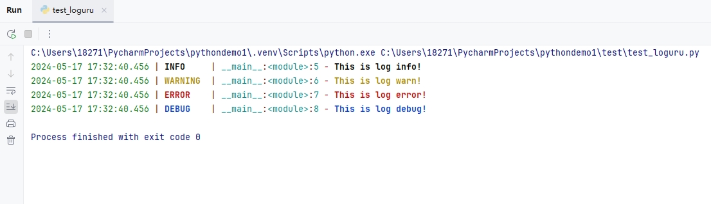

[toc]

# Python使用Loguru日志模块笔记

Loguru是目前最流行的python第三方日志模块。


## 安装

Loguru 仅支持 Python 3.5 及以上的版本，使用 pip 安装即可。

```bash
pip install loguru
```

## 默认使用

```py
# 导入loguru模块
from loguru import logger
# 打印各种级别的日志消息
logger.info("This is log info!")
logger.warning("This is log warn!")
logger.error("This is log error!")
logger.debug("This is log debug!")
```

控制台输入如下


Loguru 会提前配置一些基础信息，自动输出时间、日志级别、模块名、行号等信息，而且根据等级的不同，还自动设置了不同的颜色，方便观察，真正做到了开箱即用。

## 自定义日志文件

通过 add() 函数。我们可以将日志保存到文件上。

```py
# 导入loguru模块
from loguru import logger
logger.add('test01.log')

# 打印各种级别的日志消息
logger.info("This is log info!")
logger.warning("This is log warn!")
logger.error("This is log error!")
logger.debug("This is log debug!")
```

程序运行结束后，不光会在控制台上输出日志信息。同时也会在当前目录中创建一个test01.log日志文件，并把日志信息输出到日志文件中。

