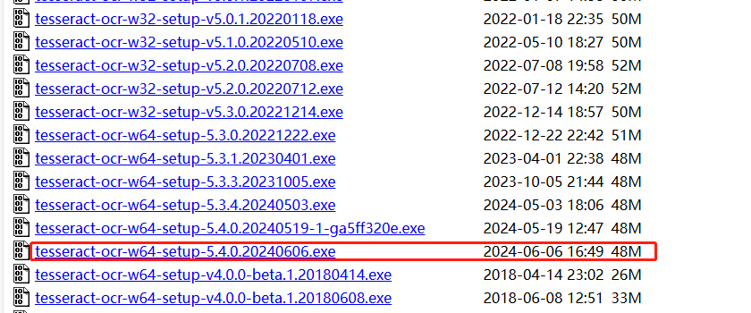
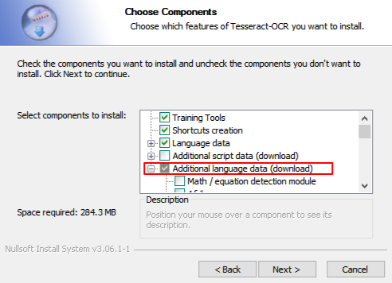

[toc]

# Python使用OCR工具库pytesseract笔记

pytesseract是基于Python的OCR工具库。其底层使用的是Google的Tesseract-OCR程序，支持识别图片中的文字，支持jpeg, png, gif, bmp, tiff等图片格式。

注意：如果要使用pytesseract库，我们需要先安装Tesseract-OCR程序

## 什么是OCR

OCR（Optical character recognition，光学字符识别）是一种将图像中的手写字符或印刷文本字符，转换为机器编码文本的技术。

OCR技术可以将图片，纸质文档中的文本转换为数字形式的文本。通过数字方式存储文本数据更容易保存和编辑，可以存储大量数据。

## windows安装Tesseract-OCR程序

1. Tesseract-OCR 下载地址： `https://digi.bib.uni-mannheim.de/tesseract/`
2. 下载最新版即可

3. 双击exe程序，进行安装。注意安装时可以选择需要的语言包。

4. 设置环境变量。将系统变量下的Path中添加Tesseract-OCR的安装地址。例如`C:\Program Files\Tesseract-OCR`。
5. 在windows命令行窗口中输入命令进行测试。

```sh
# 输入命令tesseract，如果出现下面则表示安装成功
> tesseract
Usage:
  tesseract --help | --help-extra | --version
  tesseract --list-langs
  tesseract imagename outputbase [options...] [configfile...]

OCR options:
  -l LANG[+LANG]        Specify language(s) used for OCR.
NOTE: These options must occur before any configfile.

Single options:
  --help                Show this help message.
  --help-extra          Show extra help for advanced users.
  --version             Show version information.
  --list-langs          List available languages for tesseract engine.

# 输入命令，查看tesseract下载的语言包
> tesseract --list-langs
List of available languages (3):
chi_sim
eng
osd

```


## 安装pytesseract库

```py
# Pillow库 用于加载图片，并对图片进行处理
pip install Pillow
# pytesseract库 用于对图片中的文本进行OCR识别
pip install pytesseract  
```

## 例子

如图为111.png


```py
import pytesseract
from PIL import Image

# 设置Tesseract可执行文件的路径
pytesseract.pytesseract.tesseract_cmd = 'C:\\Program Files\\Tesseract-OCR\\tesseract.exe'

if __name__ == '__main__':  
    # 加载图片
    image = Image.open('111.png')
    # 对图片文字进行OCR识别
    # chi_sim 表示使用简体中文语言包
    text = pytesseract.image_to_string(image, lang='chi_sim')
    print(text)

# 识别结果如下
# 1 （单选题）《移动式压力容器安全技术监察规程》规定: 移动式压力容器长期停用，是指停用 () 及以上。
```

## 多语言例子

若图片中包含了多种语言，则可以设置多语言。

```py
# chi_sim+eng 表示为简体中文+英文
text = pytesseract.image_to_string(image, lang='chi_sim+eng')
```