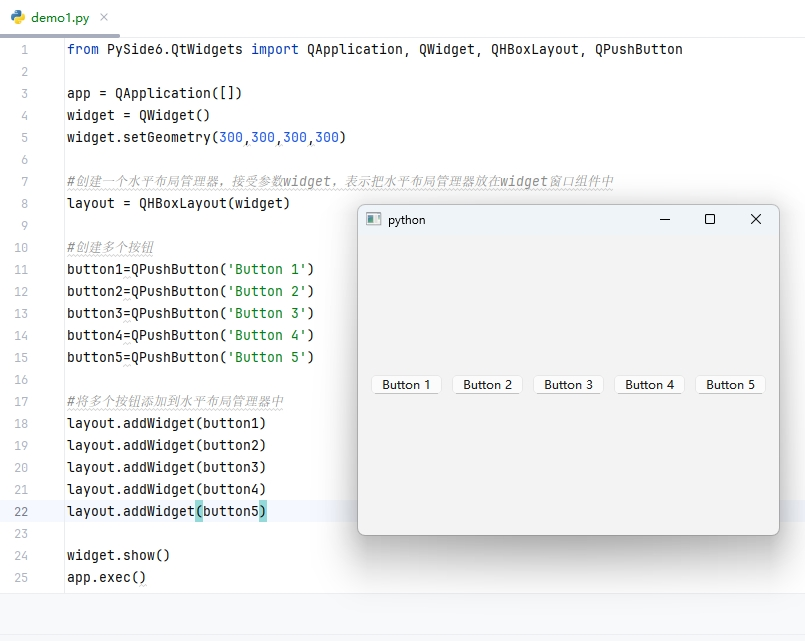
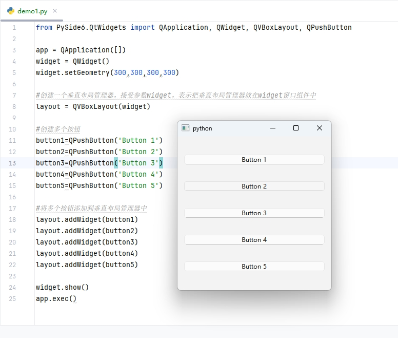

[toc]

# Python使用PySide6库笔记

当我们想要使用Python语言来开发桌面GUI程序工具的时候，我们往往有多个选择。
- Tkinter 是Python的标准GUI库，无需额外安装。但是可选的GUI组件和样式较少，功能相对较少。
- PyQt 提供了大量的GUI组件和功能，可用于构建复杂和精美的界面。
- PySide 提供了与PyQt类似的功能和GUI组件。
- wxPython 学习曲线较陡峭。

其中 PyQt和PySide都是基于Qt框架开发的，PyQt和PySide具有相似的API和功能，学习难度也都差不多；区别在于 PySide 是免费的，而 PyQt 需要付费使用。

并且 Qt公司 打算着力培养PySide，所以PySide是更有前途的，所以选择Pyside作为GUI程序开发的框架；

> PySide 的版本选择

目前最新的 PySide 版本是 PySide6

> Python 安装 PySide6

```bash
# 使用pip 安装 PySide6
pip install pyside6
```

## 第一个 PySide6 应用程序

```py
# 导入PySide6中的各个组件
from PySide6.QtWidgets import QApplication,QWidget

# 创建一个桌面应用app实例
app = QApplication([])

# 创建一个QWidget（通用窗口）实例
widget = QWidget()
# 设置窗口标题
widget.setWindowTitle('hello world')
# 设置窗口大小
widget.setGeometry(100, 100, 300, 300)
# 显示窗口
widget.show()

# 运行应用程序
app.exec()
```

执行程序后，运行结果如图所示。


## QApplication 应用程序

QApplication类 是QT应用程序中用来进行全局管理和程序流的。简而言之，一个QApplication类的实例对象代表一个QT应用程序本身。

因此一个QT应用程序应该只定义一个 QApplication类的实例对象。

## QWidget 窗口

QWidget是指一个基础通用的窗口组件，使用QWidget类可以创建一个窗口。如上面代码所示。

QWidget类具有很多属性，可以在实例化一个窗口时，对窗口进行各种各样的设置。

> geometry属性：窗口出现的位置和大小。

geometry 是一个包含 x、y、width 和 height 的 QRect 对象，表示窗口或组件在其父坐标系统中的位置和大小。

父坐标通常是显示屏幕的左上角。

```py
widget = QWidget()

# setGeometry(x, y, w, h)
# x是横坐标，y是纵坐标，w是窗口宽度，h是窗口高度
widget.setGeometry(100,100,300,200)
```

> WindowTitle属性：窗口左上角的标题

```py
widget = QWidget()
# 设置窗口标题
widget.setWindowTitle('hello world')
```

> maximized属性：检测窗口是否最大化

maximized 是 QWidget 类的一个只读属性，用于获取窗口是否被最大化。如果窗口当前处于最大化状态，则 maximized 返回 True，否则返回 False。

```py
widget = QWidget()
isMax = widget.isMaximized()
```

> minimized属性：检测窗口是否最小化

minimized 是 QWidget 类的一个只读属性，用于指示窗口是否被最小化。如果窗口当前处于最小化状态，则 minimized 返回 True，否则返回 False

```py
widget = QWidget()
isMin = widget.isMinimized()
```

> maximumSize属性，minimumSize属性：窗口最大和最小的宽度和高度

```py
widget = QWidget()
widget.setMaximumSize(400, 300)  # 设置最大宽度为 400，最大高度为 300
widget.setMinimumSize(200, 150)  # 设置最小宽度为 200，最小高度为 150
```

## 布局管理器

当我们创建一个窗口，我们希望在这个窗口中添加各种各样的组件。而布局管理器就是用来管理窗口的组件如何摆放的。

### QHBoxLayout 水平布局管理器

水平布局管理器中各个组件按照从左到右的顺序水平排列。

```py
from PySide6.QtWidgets import QApplication, QWidget, QHBoxLayout, QPushButton

app = QApplication([])
widget = QWidget()
widget.setGeometry(300,300,300,300)

#创建一个水平布局管理器，接受参数widget，表示把水平布局管理器放在widget窗口组件中
layout = QHBoxLayout(widget)

#创建多个按钮
button1=QPushButton('Button 1')
button2=QPushButton('Button 2')
button3=QPushButton('Button 3')
button4=QPushButton('Button 4')
button5=QPushButton('Button 5')

#将多个按钮添加到水平布局管理器中
layout.addWidget(button1)
layout.addWidget(button2)
layout.addWidget(button3)
layout.addWidget(button4)
layout.addWidget(button5)

widget.show()
app.exec()
```

运行结果如下



### QVBoxLayout 垂直布局管理器

垂直布局管理器中各个组件按照从上到下的顺序垂直排列。

```py
from PySide6.QtWidgets import QApplication, QWidget, QVBoxLayout, QPushButton

app = QApplication([])
widget = QWidget()
widget.setGeometry(300,300,300,300)

#创建一个垂直布局管理器，接受参数widget，表示把垂直布局管理器放在widget窗口组件中
layout = QVBoxLayout(widget)

#创建多个按钮
button1=QPushButton('Button 1')
button2=QPushButton('Button 2')
button3=QPushButton('Button 3')
button4=QPushButton('Button 4')
button5=QPushButton('Button 5')

#将多个按钮添加到垂直布局管理器中
layout.addWidget(button1)
layout.addWidget(button2)
layout.addWidget(button3)
layout.addWidget(button4)
layout.addWidget(button5)

widget.show()
app.exec()
```

运行结果如下



### QGridLayout 网格布局管理器

网格布局管理器，用于将子组件放置在一个网格中。每个子组件可以占据一个或多个网格单元。

网格布局管理器相当于把窗口划分成多个网格，就像excel表格那样，每个格子可以放一个子组件。

