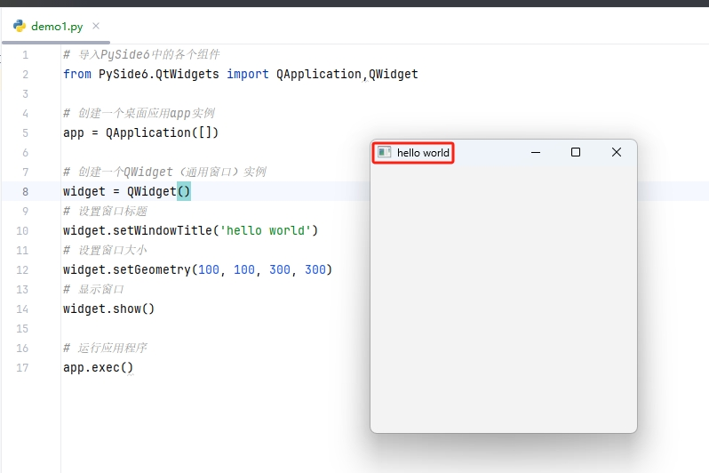

[toc]

# Python使用PySide6库笔记

当我们想要使用Python语言来开发桌面GUI程序工具的时候，我们往往有多个选择。
- Tkinter 是Python的标准GUI库，无需额外安装。但是可选的GUI组件和样式较少，功能相对较少。
- PyQt 提供了大量的GUI组件和功能，可用于构建复杂和精美的界面。
- PySide 提供了与PyQt类似的功能和GUI组件。
- wxPython 学习曲线较陡峭。

其中 PyQt和PySide都是基于Qt框架开发的，PyQt和PySide具有相似的API和功能，学习难度也都差不多；区别在于 PySide 是免费的，而 PyQt 需要付费使用。

并且 Qt公司 打算着力培养PySide，所以PySide是更有前途的，所以选择Pyside作为GUI程序开发的框架；

> PySide 的版本选择

目前最新的 PySide 版本是 PySide6

> Python 安装 PySide6

```bash
# 使用pip 安装 PySide6
pip install pyside6
```

## 第一个 PySide6 应用程序

```py
# 导入PySide6中的各个组件
from PySide6.QtWidgets import QApplication,QWidget

# 创建一个桌面应用app实例
app = QApplication([])

# 创建一个QWidget（通用窗口）实例
widget = QWidget()
# 设置窗口标题
widget.setWindowTitle('hello world')
# 设置窗口大小
widget.setGeometry(100, 100, 300, 300)
# 显示窗口
widget.show()

# 运行应用程序
app.exec()
```

执行程序后，运行结果如图所示。



## QApplication 应用程序

QApplication类 是QT应用程序中用来进行全局管理和程序流的。简而言之，一个QApplication类的实例对象代表一个QT应用程序本身。

因此一个QT应用程序应该只定义一个 QApplication类的实例对象。

## QWidget 窗口

QWidget是指一个基础通用的窗口组件，使用QWidget类可以创建一个窗口。如上面代码所示。

QWidget类具有很多属性，可以在实例化一个窗口时，对窗口进行各种各样的设置。

> geometry属性：窗口出现的位置和大小。

geometry 是一个包含 x、y、width 和 height 的 QRect 对象，表示窗口或组件在其父坐标系统中的位置和大小。

父坐标通常是显示屏幕的左上角。

```py
widget = QWidget()

# setGeometry(x, y, w, h)
# x是横坐标，y是纵坐标，w是窗口宽度，h是窗口高度
widget.setGeometry(100,100,300,200)
```

> WindowTitle属性：窗口左上角的标题

```py
widget = QWidget()
# 设置窗口标题
widget.setWindowTitle('hello world')
```

> maximized属性：检测窗口是否最大化

maximized 是 QWidget 类的一个只读属性，用于获取窗口是否被最大化。如果窗口当前处于最大化状态，则 maximized 返回 True，否则返回 False。

```py
widget = QWidget()
isMax = widget.isMaximized()
```

> minimized属性：检测窗口是否最小化

minimized 是 QWidget 类的一个只读属性，用于指示窗口是否被最小化。如果窗口当前处于最小化状态，则 minimized 返回 True，否则返回 False

```py
widget = QWidget()
isMin = widget.isMinimized()
```

> maximumSize属性，minimumSize属性：窗口最大和最小的宽度和高度

```py
widget = QWidget()
widget.setMaximumSize(400, 300)  # 设置最大宽度为 400，最大高度为 300
widget.setMinimumSize(200, 150)  # 设置最小宽度为 200，最小高度为 150
```

## 布局管理器

当我们创建一个窗口，我们希望在这个窗口中添加各种各样的组件。而布局管理器就是用来管理窗口的组件如何摆放的。

### QHBoxLayout 水平布局管理器

水平布局管理器中各个组件按照从左到右的顺序水平排列。

```py
from PySide6.QtWidgets import QApplication, QWidget, QHBoxLayout, QPushButton

app = QApplication([])
widget = QWidget()
widget.setGeometry(300,300,300,300)

#创建一个水平布局管理器，接受参数widget，表示把水平布局管理器放在widget窗口组件中
layout = QHBoxLayout(widget)

#创建多个按钮
button1=QPushButton('Button 1')
button2=QPushButton('Button 2')
button3=QPushButton('Button 3')
button4=QPushButton('Button 4')
button5=QPushButton('Button 5')

#将多个按钮添加到水平布局管理器中
layout.addWidget(button1)
layout.addWidget(button2)
layout.addWidget(button3)
layout.addWidget(button4)
layout.addWidget(button5)

widget.show()
app.exec()
```

运行结果如下


### QVBoxLayout 垂直布局管理器

垂直布局管理器中各个组件按照从上到下的顺序垂直排列。

```py
from PySide6.QtWidgets import QApplication, QWidget, QVBoxLayout, QPushButton

app = QApplication([])
widget = QWidget()
widget.setGeometry(300,300,300,300)

#创建一个垂直布局管理器，接受参数widget，表示把垂直布局管理器放在widget窗口组件中
layout = QVBoxLayout(widget)

#创建多个按钮
button1=QPushButton('Button 1')
button2=QPushButton('Button 2')
button3=QPushButton('Button 3')
button4=QPushButton('Button 4')
button5=QPushButton('Button 5')

#将多个按钮添加到垂直布局管理器中
layout.addWidget(button1)
layout.addWidget(button2)
layout.addWidget(button3)
layout.addWidget(button4)
layout.addWidget(button5)

widget.show()
app.exec()
```

运行结果如下


### QGridLayout 网格布局管理器

网格布局管理器，用于将子组件放置在一个网格中。每个子组件可以占据一个或多个网格单元。

网格布局管理器相当于把窗口划分成多个网格，就像excel表格那样，每个格子可以放一个子组件。

```py
from PySide6.QtWidgets import QApplication, QWidget, QGridLayout, QPushButton

app = QApplication([])
widget = QWidget()
widget.setGeometry(300,300,300,300)

#创建一个网格布局管理器，接受参数widget，表示放在widget窗口组件中
layout = QGridLayout(widget)

#创建多个按钮
button1=QPushButton('Button 1')
button2=QPushButton('Button 2')
button3=QPushButton('Button 3')
button4=QPushButton('Button 4')
button5=QPushButton('Button 5')

#将多个按钮添加到网格布局管理器中。第一个参数是组件，后面的参数是行和列的索引

## 按钮1，2在第一行的第 1，2 个单元格
layout.addWidget(button1,0,0)
layout.addWidget(button2,0,1)
## 按钮3，4，5 在第二行的第1，2，3 个单元格
layout.addWidget(button3,1,0)
layout.addWidget(button4,1,1)
layout.addWidget(button5,1,2)

widget.show()
app.exec()
```

运行结果如下


### QFormLayout 表单布局管理器

表单布局管理器，用于将标签和输入字段配对显示。适用于创建表单式的用户界面。

```PY
from PySide6.QtWidgets import QApplication, QWidget, QFormLayout, QLineEdit, QLabel,QPushButton

app = QApplication([])
widget = QWidget()

#创建表单布局管理器
layout = QFormLayout(widget)

#创建多个标签和单行文本框
label1 = QLabel('Name:')
line_edit1 = QLineEdit()

label2 = QLabel('Age:')
line_edit2 = QLineEdit()

#创建多个按钮
button1=QPushButton('Button 1')
button2=QPushButton('Button 2')
button3=QPushButton('Button 3')

#添加标签和字段对，每一对成为布局中的一行，还有相应设列的函数
layout.addRow(label1, line_edit1)
layout.addRow(label2, line_edit2)
#将多个按钮加入到表单布局中
layout.addRow(button1, button2)
layout.addRow(button3)

widget.show()
app.exec()
```

运行结果如下


## QLabel标签 QLineEdit单行文本框

QLabel用于显示文本或图像的标签。QLineEdit用于单行文本输入框，用于接受用户的文本输入。

基本用法如下
```py
from PySide6.QtWidgets import QApplication, QWidget, QFormLayout, QLineEdit, QLabel,QPushButton

app = QApplication([])
widget = QWidget()

#创建表单布局管理器
layout = QFormLayout(widget)

#创建多个标签和单行文本框
label1 = QLabel('Name:')
line_edit1 = QLineEdit()

label2 = QLabel('Age:')
line_edit2 = QLineEdit()

#添加标签和字段对，每一对成为布局中的一行，还有相应设列的函数
layout.addRow(label1, line_edit1)
layout.addRow(label2, line_edit2)

widget.show()
app.exec()
```

运行结果如下


> QLabel标签 常用属性和方法

```py
from PySide6.QtGui import QPixmap
from PySide6.QtWidgets import QLabel
from PySide6.QtCore import Qt

# ..... 省略部分代码

#创建标签
label = QLabel()

# 设置文本内容
label.setText("这是一个label")
# 设置对齐方式
label.setAlignment(Qt.AlignCenter)
# 设置缩进
label.setIndent(20)
# 设置边距
label.setMargin(10)
# 设置图片
pixmap = QPixmap("980.jpg")
label.setPixmap(pixmap)
# 设置文本格式
label.setTextFormat(Qt.RichText)
# 启用自动换行
label.setWordWrap(True)

```

注意：当QLabel同时设置了文本和图片，会优先显示图片。

> QLineEdit单行文本框 常用属性和方法

```py
# 创建单行文本框
line_edit = QLineEdit()

# 设置文本框的内容
line_edit.setText("New Text")
# 获取文本框的内容，将内容打印出来
line_edit.text() 

#设置占位符文本
line_edit.setPlaceholderText("this is 占位符文本")

# 限制用户输入的最大字符数
line_edit.setMaxLength(10)

# 设置为 True 可以将 QLineEdit 设置为只读模式，用户无法编辑其中的文本
line_edit.setReadOnly(True)

# 设置文本在 QLineEdit 中的对齐方式
line_edit.setAlignment(QtCore.Qt.AlignRight)

# 设置文本的显示方式，可以是正常显示、密码显示等
line_edit.setEchoMode(QLineEdit.Password)

# 设置输入掩码，限制用户输入的格式
line_edit.setInputMask("000-00-00")

# 启用或禁用清除按钮，允许用户一键清空输入内容
line_edit.setClearButtonEnabled(True)

```

## QPushButton按钮

```py
from PySide6.QtWidgets import QApplication, QVBoxLayout, QWidget, QPushButton
#定义的按钮函数
def on_button_click(self):
    # 打印日志
    print('Button clicked!')

# 创建应用实例
app = QApplication([])

#创建主窗口
widget = QWidget()
widget.setGeometry(100,100,200,200)

#创建布局管理器
layout = QVBoxLayout(widget)
#创建按钮
button = QPushButton('按钮')
#按钮加入到布局管理器中
layout.addWidget(button)

#将按钮的点击事件与函数进行绑定
button.clicked.connect(on_button_click)

widget.show()
app.exec()
```

上面代码中定义了函数，并将按钮的点击事件与函数进行绑定。

运行结果如下,点击按钮会触发函数，打印日志


> QQPushButton按钮 常用属性和方法

```py
#创建按钮
button = QPushButton('按钮')

# 设置按钮的背景色为红色
button.setStyleSheet('QPushButton { background-color: red; }')

# 设置按钮的图标
button.setIcon(QIcon('path/to/icon.png'))

# 设置按钮的状态是否启用，False为禁用
button.setEnabled(False)

# 设置按钮的快捷键
button.setShortcut('Ctrl+C')

# setAutoRepeat 方法用于启用或禁用按钮的自动重复功能。自动重复是指当用户按住按钮时，按钮会自动多次触发点击事件
## 启用按钮的自动重复功能
button.setAutoRepeat(True)
## 设置按钮的自动重复间隔（毫秒）
button.setAutoRepeatInterval(500)

```

## QTextEdit 多行文本输入框

多行文本输入框用于接受用户的多行文本输入。

```py
from PySide6.QtWidgets import QApplication, QTextEdit,  QVBoxLayout, QWidget
app = QApplication([])
window = QWidget()
window.setWindowTitle('QTextEdit 示例')
layout = QVBoxLayout()

# 创建 QTextEdit
text_edit = QTextEdit()
# 把 QTextEdit 添加到 布局中
layout.addWidget(text_edit)

window.setLayout(layout)
window.setGeometry(100, 100, 400, 300)
window.show()
# 运行应用事件循环
app.exec()
```

运行结果如下


## QFileDialog 文件目录对话框

QFileDialog 是 Qt 中用于显示文件对话框的部件，允许用户选择文件或目录。

```py
from PySide6.QtWidgets import QApplication, QWidget, QPushButton, QFormLayout, QFileDialog,QLabel

# 创建自定义MainQWidget类，继承QWidget类
class MainQWidget(QWidget):
    def __init__(self):
        super().__init__()

        # 创建表单布局
        self.layout = QFormLayout(self)

        # 创建按钮和label
        self.info_label = QLabel("No file selected")
        self.open_button = QPushButton("选择Excel文件")
        # 按钮的点击信号和槽函数进行绑定
        self.open_button.clicked.connect(self.choose_excel)

        # 创建按钮和label
        self.info_label2 = QLabel("No file selected")
        self.open_button2 = QPushButton("选择视频目录")
        self.open_button2.clicked.connect(self.choose_directory)

        # 设置各个组件的布局方式
        self.layout.addRow(self.open_button,self.info_label)
        self.layout.addRow(self.open_button2, self.info_label2)

    def choose_excel(self):
        # 创建文件对话框
        file_dialog = QFileDialog(self)
        # 设置文件对话框的标题
        file_dialog.setWindowTitle("Choose a File")
        # 设置对话框模式为打开文件
        file_dialog.setFileMode(QFileDialog.ExistingFile)
        # 显示文件对话框，并获取用户选择的文件路径
        file_path, _ = file_dialog.getOpenFileName(self, "Open File", "", "All Files (*);")

        # 如果用户选择了文件，将文件路径输出到控制台
        if file_path:
            print(f"excel文件路径为 {file_path}")
            self.info_label.setText(file_path)

    def choose_directory(self):
        # 创建文件对话框
        file_dialog = QFileDialog(self)
        # 设置文件对话框的标题
        file_dialog.setWindowTitle("Choose a Directory")
        # 设置对话框模式为打开文件
        file_dialog.setFileMode(QFileDialog.ExistingFile)
        # 显示文件对话框，并获取用户选择的文件路径
        directory_path  = file_dialog.getExistingDirectory(self, "Open Directory", "")

        # 如果用户选择了文件，将文件路径输出到控制台
        if directory_path:
            print(f"视频目录路径为 {directory_path}")
            self.info_label2.setText(directory_path)

if __name__ == "__main__":
    # 创建应用实例
    app = QApplication([])
    # 实例化MainQWidget
    example = MainQWidget()
    example.setGeometry(300,300,700,700)
    example.show()
    # 运行应用实例
    app.exec()

```

运行结果如下,点击按钮会弹出文件对话框，选择文件或目录。并把文件或目录的路径显示出来。


> QFileDialog 常用方法和属性如下

```py
# 打开文件对话框，返回用户选择的文件路径和文件过滤器。
getOpenFileName(parent, caption, directory, filter)
# 打开文件对话框，允许用户选择多个文件，返回文件路径列表和文件过滤器。
getOpenFileNames(parent, caption, directory, filter)
# 打开目录对话框，返回用户选择的目录路径。
getExistingDirectory(parent, caption, directory)
# 打开保存文件对话框，返回用户选择的文件路径和文件过滤器。
getSaveFileName(parent, caption, directory, filter)
```

