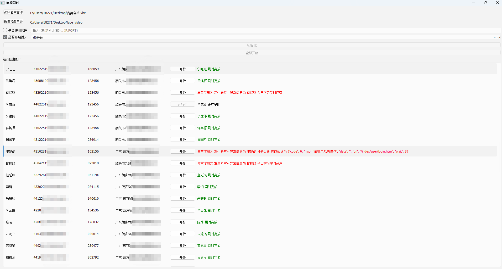

[toc]

# Python使用PySide6库笔记

当我们想要使用Python语言来开发桌面GUI程序工具的时候，我们往往有多个选择。
- Tkinter 是Python的标准GUI库，无需额外安装。但是可选的GUI组件和样式较少，功能相对较少。
- PyQt 提供了大量的GUI组件和功能，可用于构建复杂和精美的界面。
- PySide 提供了与PyQt类似的功能和GUI组件。
- wxPython 学习曲线较陡峭。

其中 PyQt和PySide都是基于Qt框架开发的，PyQt和PySide具有相似的API和功能，学习难度也都差不多；区别在于 PySide 是免费的，而 PyQt 需要付费使用。

并且 Qt公司 打算着力培养PySide，所以PySide是更有前途的，所以选择Pyside作为GUI程序开发的框架；

> PySide 的版本选择

目前最新的 PySide 版本是 PySide6

> Python 安装 PySide6

```bash
# 使用pip 安装 PySide6
pip install pyside6
```

## 第一个 PySide6 应用程序

```py
# 导入PySide6中的各个组件
from PySide6.QtWidgets import QApplication,QWidget

# 创建一个桌面应用app实例
app = QApplication([])

# 创建一个QWidget（通用窗口）实例
widget = QWidget()
# 设置窗口标题
widget.setWindowTitle('hello world')
# 设置窗口大小
widget.setGeometry(100, 100, 300, 300)
# 显示窗口
widget.show()

# 运行应用程序
app.exec()
```

执行程序后，运行结果如图所示。


## QApplication 应用程序

QApplication类 是QT应用程序中用来进行全局管理和程序流的。简而言之，一个QApplication类的实例对象代表一个QT应用程序本身。

因此一个QT应用程序应该只定义一个 QApplication类的实例对象。

## QWidget 窗口

QWidget是指一个基础通用的窗口组件，使用QWidget类可以创建一个窗口。如上面代码所示。

QWidget类具有很多属性，可以在实例化一个窗口时，对窗口进行各种各样的设置。

> geometry属性：窗口出现的位置和大小。

geometry 是一个包含 x、y、width 和 height 的 QRect 对象，表示窗口或组件在其父坐标系统中的位置和大小。

父坐标通常是显示屏幕的左上角。

```py
widget = QWidget()

# setGeometry(x, y, w, h)
# x是横坐标，y是纵坐标，w是窗口宽度，h是窗口高度
widget.setGeometry(100,100,300,200)
```

> WindowTitle属性：窗口左上角的标题

```py
widget = QWidget()
# 设置窗口标题
widget.setWindowTitle('hello world')
```

> maximized属性：检测窗口是否最大化

maximized 是 QWidget 类的一个只读属性，用于获取窗口是否被最大化。如果窗口当前处于最大化状态，则 maximized 返回 True，否则返回 False。

```py
widget = QWidget()
isMax = widget.isMaximized()
```

> minimized属性：检测窗口是否最小化

minimized 是 QWidget 类的一个只读属性，用于指示窗口是否被最小化。如果窗口当前处于最小化状态，则 minimized 返回 True，否则返回 False

```py
widget = QWidget()
isMin = widget.isMinimized()
```

> maximumSize属性，minimumSize属性：窗口最大和最小的宽度和高度

```py
widget = QWidget()
widget.setMaximumSize(400, 300)  # 设置最大宽度为 400，最大高度为 300
widget.setMinimumSize(200, 150)  # 设置最小宽度为 200，最小高度为 150
```

## 布局管理器

当我们创建一个窗口，我们希望在这个窗口中添加各种各样的组件。而布局管理器就是用来管理窗口的组件如何摆放的。

### QHBoxLayout 水平布局管理器

水平布局管理器中各个组件按照从左到右的顺序水平排列。

```py
from PySide6.QtWidgets import QApplication, QWidget, QHBoxLayout, QPushButton

app = QApplication([])
widget = QWidget()
widget.setGeometry(300,300,300,300)

#创建一个水平布局管理器，接受参数widget，表示把水平布局管理器放在widget窗口组件中
layout = QHBoxLayout(widget)

#创建多个按钮
button1=QPushButton('Button 1')
button2=QPushButton('Button 2')
button3=QPushButton('Button 3')
button4=QPushButton('Button 4')
button5=QPushButton('Button 5')

#将多个按钮添加到水平布局管理器中
layout.addWidget(button1)
layout.addWidget(button2)
layout.addWidget(button3)
layout.addWidget(button4)
layout.addWidget(button5)

widget.show()
app.exec()
```

运行结果如下


### QVBoxLayout 垂直布局管理器

垂直布局管理器中各个组件按照从上到下的顺序垂直排列。

```py
from PySide6.QtWidgets import QApplication, QWidget, QVBoxLayout, QPushButton

app = QApplication([])
widget = QWidget()
widget.setGeometry(300,300,300,300)

#创建一个垂直布局管理器，接受参数widget，表示把垂直布局管理器放在widget窗口组件中
layout = QVBoxLayout(widget)

#创建多个按钮
button1=QPushButton('Button 1')
button2=QPushButton('Button 2')
button3=QPushButton('Button 3')
button4=QPushButton('Button 4')
button5=QPushButton('Button 5')

#将多个按钮添加到垂直布局管理器中
layout.addWidget(button1)
layout.addWidget(button2)
layout.addWidget(button3)
layout.addWidget(button4)
layout.addWidget(button5)

widget.show()
app.exec()
```

运行结果如下


### QGridLayout 网格布局管理器

网格布局管理器，用于将子组件放置在一个网格中。每个子组件可以占据一个或多个网格单元。

网格布局管理器相当于把窗口划分成多个网格，就像excel表格那样，每个格子可以放一个子组件。

```py
from PySide6.QtWidgets import QApplication, QWidget, QGridLayout, QPushButton

app = QApplication([])
widget = QWidget()
widget.setGeometry(300,300,300,300)

#创建一个网格布局管理器，接受参数widget，表示放在widget窗口组件中
layout = QGridLayout(widget)

#创建多个按钮
button1=QPushButton('Button 1')
button2=QPushButton('Button 2')
button3=QPushButton('Button 3')
button4=QPushButton('Button 4')
button5=QPushButton('Button 5')

#将多个按钮添加到网格布局管理器中。第一个参数是组件，后面的参数是行和列的索引

## 按钮1，2在第一行的第 1，2 个单元格
layout.addWidget(button1,0,0)
layout.addWidget(button2,0,1)
## 按钮3，4，5 在第二行的第1，2，3 个单元格
layout.addWidget(button3,1,0)
layout.addWidget(button4,1,1)
layout.addWidget(button5,1,2)

widget.show()
app.exec()
```

运行结果如下


### QFormLayout 表单布局管理器

表单布局管理器，用于将标签和输入字段配对显示。适用于创建表单式的用户界面。

```PY
from PySide6.QtWidgets import QApplication, QWidget, QFormLayout, QLineEdit, QLabel,QPushButton

app = QApplication([])
widget = QWidget()

#创建表单布局管理器
layout = QFormLayout(widget)

#创建多个标签和单行文本框
label1 = QLabel('Name:')
line_edit1 = QLineEdit()

label2 = QLabel('Age:')
line_edit2 = QLineEdit()

#创建多个按钮
button1=QPushButton('Button 1')
button2=QPushButton('Button 2')
button3=QPushButton('Button 3')

#添加标签和字段对，每一对成为布局中的一行，还有相应设列的函数
layout.addRow(label1, line_edit1)
layout.addRow(label2, line_edit2)
#将多个按钮加入到表单布局中
layout.addRow(button1, button2)
layout.addRow(button3)

widget.show()
app.exec()
```

运行结果如下


## QLabel标签 QLineEdit单行文本框

QLabel用于显示文本或图像的标签。QLineEdit用于单行文本输入框，用于接受用户的文本输入。

基本用法如下
```py
from PySide6.QtWidgets import QApplication, QWidget, QFormLayout, QLineEdit, QLabel,QPushButton

app = QApplication([])
widget = QWidget()

#创建表单布局管理器
layout = QFormLayout(widget)

#创建多个标签和单行文本框
label1 = QLabel('Name:')
line_edit1 = QLineEdit()

label2 = QLabel('Age:')
line_edit2 = QLineEdit()

#添加标签和字段对，每一对成为布局中的一行，还有相应设列的函数
layout.addRow(label1, line_edit1)
layout.addRow(label2, line_edit2)

widget.show()
app.exec()
```

运行结果如下


> QLabel标签 常用属性和方法

```py
from PySide6.QtGui import QPixmap
from PySide6.QtWidgets import QLabel
from PySide6.QtCore import Qt

# ..... 省略部分代码

#创建标签
label = QLabel()

# 设置文本内容
label.setText("这是一个label")
# 设置对齐方式
label.setAlignment(Qt.AlignCenter)
# 设置缩进
label.setIndent(20)
# 设置边距
label.setMargin(10)
# 设置图片
pixmap = QPixmap("980.jpg")
label.setPixmap(pixmap)
# 设置文本格式
label.setTextFormat(Qt.RichText)
# 启用自动换行
label.setWordWrap(True)

```

注意：当QLabel同时设置了文本和图片，会优先显示图片。

> QLineEdit单行文本框 常用属性和方法

```py
# 创建单行文本框
line_edit = QLineEdit()

# 设置文本框的内容
line_edit.setText("New Text")
# 获取文本框的内容，将内容打印出来
line_edit.text() 

#设置占位符文本
line_edit.setPlaceholderText("this is 占位符文本")

# 限制用户输入的最大字符数
line_edit.setMaxLength(10)

# 设置为 True 可以将 QLineEdit 设置为只读模式，用户无法编辑其中的文本
line_edit.setReadOnly(True)

# 设置文本在 QLineEdit 中的对齐方式
line_edit.setAlignment(QtCore.Qt.AlignRight)

# 设置文本的显示方式，可以是正常显示、密码显示等
line_edit.setEchoMode(QLineEdit.Password)

# 设置输入掩码，限制用户输入的格式
line_edit.setInputMask("000-00-00")

# 启用或禁用清除按钮，允许用户一键清空输入内容
line_edit.setClearButtonEnabled(True)

```

## QPushButton按钮

```py
from PySide6.QtWidgets import QApplication, QVBoxLayout, QWidget, QPushButton
#定义的按钮函数
def on_button_click(self):
    # 打印日志
    print('Button clicked!')

# 创建应用实例
app = QApplication([])

#创建主窗口
widget = QWidget()
widget.setGeometry(100,100,200,200)

#创建布局管理器
layout = QVBoxLayout(widget)
#创建按钮
button = QPushButton('按钮')
#按钮加入到布局管理器中
layout.addWidget(button)

#将按钮的点击事件与函数进行绑定
button.clicked.connect(on_button_click)

widget.show()
app.exec()
```

上面代码中定义了函数，并将按钮的点击事件与函数进行绑定。

运行结果如下,点击按钮会触发函数，打印日志


> QQPushButton按钮 常用属性和方法

```py
#创建按钮
button = QPushButton('按钮')

# 设置按钮的背景色为红色
button.setStyleSheet('QPushButton { background-color: red; }')

# 设置按钮的图标
button.setIcon(QIcon('path/to/icon.png'))

# 设置按钮的状态是否启用，False为禁用
button.setEnabled(False)

# 设置按钮的快捷键
button.setShortcut('Ctrl+C')

# setAutoRepeat 方法用于启用或禁用按钮的自动重复功能。自动重复是指当用户按住按钮时，按钮会自动多次触发点击事件
## 启用按钮的自动重复功能
button.setAutoRepeat(True)
## 设置按钮的自动重复间隔（毫秒）
button.setAutoRepeatInterval(500)

```

## QTextEdit 多行文本输入框

多行文本输入框用于接受用户的多行文本输入。

```py
from PySide6.QtWidgets import QApplication, QTextEdit,  QVBoxLayout, QWidget
app = QApplication([])
window = QWidget()
window.setWindowTitle('QTextEdit 示例')
layout = QVBoxLayout()

# 创建 QTextEdit
text_edit = QTextEdit()
# 把 QTextEdit 添加到 布局中
layout.addWidget(text_edit)

window.setLayout(layout)
window.setGeometry(100, 100, 400, 300)
window.show()
# 运行应用事件循环
app.exec()
```

运行结果如下


## QFileDialog 文件目录对话框

QFileDialog 是 Qt 中用于显示文件对话框的部件，允许用户选择文件或目录。

```py
from PySide6.QtWidgets import QApplication, QWidget, QPushButton, QFormLayout, QFileDialog,QLabel

# 创建自定义MainQWidget类，继承QWidget类
class MainQWidget(QWidget):
    def __init__(self):
        super().__init__()

        # 创建表单布局
        self.layout = QFormLayout(self)

        # 创建按钮和label
        self.info_label = QLabel("No file selected")
        self.open_button = QPushButton("选择Excel文件")
        # 按钮的点击信号和槽函数进行绑定
        self.open_button.clicked.connect(self.choose_excel)

        # 创建按钮和label
        self.info_label2 = QLabel("No file selected")
        self.open_button2 = QPushButton("选择视频目录")
        self.open_button2.clicked.connect(self.choose_directory)

        # 设置各个组件的布局方式
        self.layout.addRow(self.open_button,self.info_label)
        self.layout.addRow(self.open_button2, self.info_label2)

    def choose_excel(self):
        # 创建文件对话框
        file_dialog = QFileDialog(self)
        # 设置文件对话框的标题
        file_dialog.setWindowTitle("Choose a File")
        # 设置对话框模式为打开文件
        file_dialog.setFileMode(QFileDialog.ExistingFile)
        # 显示文件对话框，并获取用户选择的文件路径
        file_path, _ = file_dialog.getOpenFileName(self, "Open File", "", "All Files (*);")

        # 如果用户选择了文件，将文件路径输出到控制台
        if file_path:
            print(f"excel文件路径为 {file_path}")
            self.info_label.setText(file_path)

    def choose_directory(self):
        # 创建文件对话框
        file_dialog = QFileDialog(self)
        # 设置文件对话框的标题
        file_dialog.setWindowTitle("Choose a Directory")
        # 设置对话框模式为打开文件
        file_dialog.setFileMode(QFileDialog.ExistingFile)
        # 显示文件对话框，并获取用户选择的文件路径
        directory_path  = file_dialog.getExistingDirectory(self, "Open Directory", "")

        # 如果用户选择了文件，将文件路径输出到控制台
        if directory_path:
            print(f"视频目录路径为 {directory_path}")
            self.info_label2.setText(directory_path)

if __name__ == "__main__":
    # 创建应用实例
    app = QApplication([])
    # 实例化MainQWidget
    example = MainQWidget()
    example.setGeometry(300,300,700,700)
    example.show()
    # 运行应用实例
    app.exec()

```

运行结果如下,点击按钮会弹出文件对话框，选择文件或目录。并把文件或目录的路径显示出来。


> QFileDialog 常用方法和属性如下

```py
# 打开文件对话框，返回用户选择的文件路径和文件过滤器。
getOpenFileName(parent, caption, directory, filter)
# 打开文件对话框，允许用户选择多个文件，返回文件路径列表和文件过滤器。
getOpenFileNames(parent, caption, directory, filter)
# 打开目录对话框，返回用户选择的目录路径。
getExistingDirectory(parent, caption, directory)
# 打开保存文件对话框，返回用户选择的文件路径和文件过滤器。
getSaveFileName(parent, caption, directory, filter)
```


## QTableWidget 表格组件

示例1
```py
from PySide6.QtWidgets import QApplication, QPushButton, QTableWidget,QTableWidgetItem

class MyTableWidget(QTableWidget):
    def __init__(self):
        super().__init__()

    def init(self,array_data):

        # 计算出数组的元素个数
        row_num = len(array_data)
        # 设置行数
        self.setRowCount(row_num)
        # 表头列
        header_cloumn = ["姓名", "身份证", "密码", "人脸视频路径", "备注","操作"]
        # 设置列数
        self.setColumnCount(len(header_cloumn))
        # 设置表头
        self.setHorizontalHeaderLabels(header_cloumn)

        # 遍历数组数据，添加到表格组件中
        for i,user in enumerate(array_data):
            self.setItem(i,0,QTableWidgetItem(user['name']))
            self.setItem(i, 1, QTableWidgetItem(user['idCard']))
            self.setItem(i, 2, QTableWidgetItem(user['pwd']))
            self.setItem(i, 3, QTableWidgetItem(user['video_path']))
            self.setItem(i, 4, QTableWidgetItem(user['remark']))

            # 创建按钮控件，设置文本并连接槽函数
            button = QPushButton("无效按钮", self)
            button.clicked.connect(self.button_clicked)  # 按钮点击事件处理函数
            # 将按钮控件添加到单元格中
            self.setCellWidget(i, 5, button)

    def button_clicked(self):
        # 按钮点击事件处理函数
        button = self.sender()  # 获取发送信号的按钮
        cell_widget = self.indexAt(button.pos())  # 获取按钮所在的单元格
        row = cell_widget.row()  # 获取单元格的行号
        col = cell_widget.column()  # 获取单元格的列号
        print(f"按钮位于第 {row + 1} 行，第 {col + 1} 列被点击")  # 打印按钮被点击的位置信息

# 单独运行，用于查看效果
if __name__ == '__main__':
    app = QApplication([])
    table = MyTableWidget()

    # 自定义数据
    current_user_list = [
        {'idCard': '1111111111', 'name': '蔡11', 'remark': '5月', 'pwd': 'Dp111111','video_path': 'C:/Users/18271/Desktop/face_video\\蔡11.mp4'},
        {'idCard': '2222222222', 'name': '曾22', 'remark': '5月', 'pwd': 'Dp111111','video_path': 'C:/Users/18271/Desktop/face_video\\曾22.mp4'}]

    # 把数据填充到表格组件中
    table.init(current_user_list)
    table.show()
    app.exec()
```

运行结果如下


示例2

```py
import sys
from PySide6.QtWidgets import (QApplication, QWidget, QVBoxLayout, QHBoxLayout, QPushButton, QTableWidget, QTableWidgetItem, QLabel, QFormLayout, QFileDialog, QFrame, QHeaderView,
                               QGroupBox, QSizePolicy, QMessageBox, QListWidget, QListWidgetItem, QAbstractItemView)

# 主窗口类
class MyMainWindow(QWidget):
    def __init__(self):
        super().__init__()
        # 初始化
        self.init_ui()
        # 设置MainWindow的大小
        self.resize(800,400)
        # 设置MainWindow的标题
        self.setWindowTitle("刷时")

    def init_ui(self):
        # 创建主布局（垂直布局）
        main_layout = QFormLayout()
        # 设置MainWindow的布局为主布局
        self.setLayout(main_layout)

        # 选择名单文件按钮
        self.btn_import_excel = QPushButton("选择名单文件")
        self.btn_import_excel.clicked.connect(self.choose_excel)
        # 标签
        self.file_info_label = QLabel("暂无文件")
        self.file_info_label.setFixedHeight(30)
        # 选择视频目录按钮
        self.btn_import_dir = QPushButton("选择视频目录")
        self.btn_import_dir.clicked.connect(self.choose_dir)
        # 标签
        self.dir_info_label = QLabel("暂无目录")
        self.dir_info_label.setFixedHeight(30)
        # 初始化按钮
        self.btn_init = QPushButton("初始化")
        self.btn_init.clicked.connect(self.init_table)
        # 开始按钮
        self.btn_start = QPushButton("开始")
        self.btn_start.clicked.connect(self.start_all_run)
        self.btn_start.setEnabled(False)
        # 标签
        self.run_info_label = QLabel("运行信息如下")
        # 表格组件
        self.tableWidget1 = QTableWidget()
        # 禁止编辑表格
        self.tableWidget1.setEditTriggers(QAbstractItemView.NoEditTriggers)

        # 将上面的各个组件添加到主布局中
        main_layout.addRow(self.btn_import_excel,self.file_info_label)
        main_layout.addRow(self.btn_import_dir, self.dir_info_label)
        main_layout.addRow(self.btn_init)
        main_layout.addRow(self.btn_start)
        main_layout.addRow(self.run_info_label)
        main_layout.addRow(self.tableWidget1)

    # 选择文件方法
    def choose_excel(self):
        # 创建文件对话框
        file_dialog = QFileDialog()
        file_path, _ = file_dialog.getOpenFileName(self, "选择名单文件")
        if file_path:
            print(f"excel文件路径为 {file_path}")
            self.file_info_label.setText(file_path)
    # 选择目录方法
    def choose_dir(self):
        # 创建文件对话框
        file_dialog = QFileDialog()
        directory_path = file_dialog.getExistingDirectory(self, "选择视频目录")
        if directory_path:
            print(f"目录路径为 {directory_path}")
            self.dir_info_label.setText(directory_path)

    # 初始化表格组件
    def init_table(self):
        # 测试路径
        self.file_info_label.setText("C:/Users/18271/Desktop/xdj_shangde_gui/尚德名单.xlsx")
        self.dir_info_label.setText("C:/Users/18271/Desktop/xdj_shangde_gui")

        if (self.file_info_label.text() != "暂无文件" and self.dir_info_label.text() != "暂无目录"):
            try:
                # 设置用户列表数据
                self.user_list = [{'name': '付法强', 'idCard': '11111', 'pwd': '264430', 'org': '广东xxx有限公司'},
                                  {'name': '邓田忠', 'idCard': '11111', 'pwd': '035639', 'org': '广东xxx有限公司'},
                                  {'name': '罗健华', 'idCard': '11111', 'pwd': '305414', 'org': '广东xxx有限公司'}]

                # 清空表格组件中数据
                self.tableWidget1.clearContents()
                # 遍历数据，填充到表格组件中
                for row, user in enumerate(self.user_list):
                    # 设置表头
                    header_cloumn = ["姓名", "身份证", "密码", "机构", "操作", "信息"]
                    self.tableWidget1.setHorizontalHeaderLabels(header_cloumn)
                    # 设置列数，行数
                    self.tableWidget1.setColumnCount(len(header_cloumn))
                    self.tableWidget1.setRowCount(len(self.user_list))

                    # setItem方法的第一个参数为行，第二个参数为列，第三个参数为具体数据
                    self.tableWidget1.setItem(row, 0, QTableWidgetItem(user['name']))
                    self.tableWidget1.setItem(row, 1, QTableWidgetItem(user['idCard']))
                    self.tableWidget1.setItem(row, 2, QTableWidgetItem(user['pwd']))
                    self.tableWidget1.setItem(row, 3, QTableWidgetItem(user['org']))

                    # 创建按钮控件，设置文本并连接槽函数
                    button = QPushButton()
                    button.setText("按钮")
                    # 按钮点击事件连接槽函数button_clicked。
                    # 直接使用传入参数row 会直接触发该函数。因此通过lambda表达式传入参数row。
                    button.clicked.connect(lambda _, r=row: self.button_clicked(r))  # 按钮点击事件处理函数
                    # 将按钮控件添加单元格中
                    self.tableWidget1.setCellWidget(row, 4, button)

            except Exception:
                QMessageBox.warning(None, "Title", "初始化错误")
            finally:
                # 初始化按钮禁用，开始按钮启用
                self.btn_init.setEnabled(False)
                self.btn_start.setEnabled(True)
        else:
            QMessageBox.warning(None, "Title", "请选择名单文件和视频目录")

    # 按钮点击事件
    def button_clicked(self, row):
        print(f"按钮位于第 {row} 行")
        name = self.tableWidget1.item(row, 0).text()
        idCard = self.tableWidget1.item(row, 1).text()
        pwd = self.tableWidget1.item(row, 2).text()
        org = self.tableWidget1.item(row, 3).text()
        print(name, idCard, pwd, org)
        self.tableWidget1.setItem(row, 5, QTableWidgetItem(f"{name}"))

    # 全部运行
    def start_all_run(self):
        # 禁用开始按钮
        self.btn_start.setEnabled(False)
        # ....其他逻辑

if __name__ == "__main__":
    app = QApplication(sys.argv)
    main_window = MyMainWindow()
    main_window.show()
    app.exec()

```

运行截图如下


## QTimer 定时器

QTimer是PySide6中提供的定时器类，它可以用来实现定时触发特定槽函数的功能。

定时器类提供了start()、stop()、setInterval()等方法，可以用来控制定时器的启动、停止和间隔时间设置。

在GUI应用程序中，定时器通常用来实现定时刷新界面、定时处理数据等功能。

> QTimer提供了一些定时器的常用方法

```py
# 启动定时器，并设置定时器触发的时间间隔为msec毫秒。
start(msec)
# 停止定时器，定时器不再触发。
stop()
# 设置定时器触发的时间间隔为msec毫秒。
setInterval(msec)
# 判断定时器是否处于活动状态。
isActive()
# 返回定时器还剩余多少时间才会触发，单位为毫秒。
remainingTime()

```

> 定时器的注意事项

在使用定时器时，需要注意以下几点
1. 定时器是单线程的，如果槽函数执行时间过长，可能会导致定时器信号的阻塞。
2. 定时器应该在主线程中使用，不要在子线程中创建和操作定时器。
3. 定时器需要手动启动，可以在构造函数中调用start()方法启动定时器。


> 基本示例

```py
from PySide6.QtWidgets import QApplication,QWidget
from PySide6.QtCore import QTimer

class MyWidget(QWidget):
    def __init__(self):
        super().__init__()

        # 创建一个定时器
        self.timer = QTimer()
        # 将定时器与函数绑定
        self.timer.timeout.connect(self.timer_task)
        # 设置定时器的触发时间，单位为毫秒。 1000毫秒为1秒
        self.timer.setInterval(1000)
        # 开始运行定时器
        self.timer.start()

    def timer_task(self):
        print(111)


    def stop(self):
        # 停止运行定时器
        self.timer.stop()
    

if __name__ == "__main__":
    app = QApplication([])
    example = MyWidget()
    example.show()
    app.exec()
```

1. 创建了一个MyWidget类，继承自QWidget类。
2. 在MyWidget类的构造函数中，创建了一个QTimer对象，并将其timeout信号连接到timer_task槽函数。
3. 最后设置了时间间隔为1000毫秒(即1秒)，并启动了定时器。
4. 运行结果如下，每隔1秒定时执行一次timer_task方法，在终端打印111


## QMessageBox 消息框

消息框，常用于显示普通、警告和错误消息。

```py
from PySide6.QtWidgets import QApplication, QMainWindow, QPushButton, QVBoxLayout, QWidget, QMessageBox

class MyQWidget(QWidget):
    def __init__(self):
        super().__init__()
        # 创建窗口标题
        self.setWindowTitle("MessageBox Example")

        # 设置窗口布局为垂直布局
        layout = QVBoxLayout()
        self.setLayout(layout)

        # 创建按钮
        self.show_info_button = QPushButton("Show Info Message")
        self.show_warning_button = QPushButton("Show Warning Message")
        self.ask_question_button = QPushButton("Ask Question")

        # 将按钮添加到布局
        layout.addWidget(self.show_info_button)
        layout.addWidget(self.show_warning_button)
        layout.addWidget(self.ask_question_button)

        # 连接按钮的点击信号到槽函数
        self.show_info_button.clicked.connect(self.show_info_message)
        self.show_warning_button.clicked.connect(self.show_warning_message)
        self.ask_question_button.clicked.connect(self.ask_question)

    def show_info_message(self):
        # 创建信息消息框
        QMessageBox.information(self, "Info", "This is an information message.")
        print("this is info message")

    def show_warning_message(self):
        # 创建警告消息框
        QMessageBox.warning(self, "Warning", "This is a warning message.")
        print("this is warning message")

    def ask_question(self):
        # 创建询问消息框
        result = QMessageBox.question(self, "Question", "Do you want to proceed?", QMessageBox.Yes | QMessageBox.No)

        if result == QMessageBox.Yes:
            print("User clicked Yes.")
        else:
            print("User clicked No.")

        print("this is question message")

if __name__ == "__main__":
    app = QApplication([])
    example = MyQWidget()
    example.show()
    app.exec()
```

运行效果如图所示


## Pyside6 信号（Signal）和槽（Slot）

在PySide6中，信号（Signal）和槽（Slot）机制用于组件之间的通信。信号是组件对象发出的事件通知，槽是接收到信号后执行的函数。

> 无参数信号与槽

```py
import sys
from PySide6.QtWidgets import QApplication, QWidget, QPushButton, QVBoxLayout

class MainWindow(QWidget):
    def __init__(self):
        super().__init__()
        self.button = QPushButton("点击我")
        # 按钮点击信号绑定槽函数button_clicked
        self.button.clicked.connect(self.button_clicked)
        self.layout = QVBoxLayout()
        self.layout.addWidget(self.button)
        self.setLayout(self.layout)
    def button_clicked(self):
        print("按钮被点击了")

if __name__ == "__main__":
    app = QApplication(sys.argv)
    window = MainWindow()
    window.show()
    app.exec()

```

> 有参数信号与槽

有时候，我们可能希望在槽函数中使用额外的参数，这些参数不是信号本身传递的。lambda表达式可以用于传递额外的参数给槽函数。

如果我们直接在槽函数中传递参数的话，在初始化组件的时候，就会触发一次槽函数。因此我们需要通过lambda表达式来连接按钮的clicked信号到button_clicked槽函数。

```py
import sys
from PySide6.QtWidgets import QApplication, QWidget, QPushButton, QVBoxLayout

class MainWindow(QWidget):
    def __init__(self):
        super().__init__()
        self.layout = QVBoxLayout()
        button1 = QPushButton("按钮1")
        # 按钮点击信号绑定槽函数button_clicked,并通过lambda表达式向槽函数传递参数
        button1.clicked.connect(lambda: self.button_clicked("按钮1"))
        button2 = QPushButton("按钮2")
        button2.clicked.connect(lambda: self.button_clicked("按钮2"))
        self.layout.addWidget(button1)
        self.layout.addWidget(button2)
        self.setLayout(self.layout)
        
    def button_clicked(self, button_name):
        print(f"{button_name}被点击了")

if __name__ == "__main__":
    app = QApplication(sys.argv)
    window = MainWindow()
    window.show()
    app.exec()

```


## PySide6 UI 组件库

记录几个比较好看的UI 组件库。

### QFluentWidgets

QFluentWidgets 是一个基于 C++ Qt/PyQt/PySide 的 Fluent Design 风格组件库，包含数以百计的流畅设计组件，为简化开发、提高效率而生。

[QFluentWidgets 官网地址https://qfluentwidgets.com/zh/](https://qfluentwidgets.com/zh/)


## 案例

下面是自己写的案例界面或者其他值得收藏的案例界面。

### 案例1 刷视频界面

刷视频界面的效果如图所示。



界面功能大致介绍：
1. 先选择excel文件和人脸视频目录
2. 勾选是否使用代理。勾选是否开启循环。
3. 点击初始化按钮。初始化会有以下操作。
    - 读取excel文件中的用户数据，转换为一个用户列表数据。
    - 如果使用代理。则将代理地址作为用户的一个属性，添加到用户数据中。
    - 如果使用循环，则将其作为用户的一个属性，添加到用户数据中。
    - 读取用户列表数据，将一个个用户数据，转化为对应的一个个自定义组件。并将自定义组件添加到运行信息列表框中。
    - 每一个自定义组件，包含了多个信息标签栏。以及一个按钮。按钮绑定了一个已经实例化的子线程对象。点击按钮就会运行这个子线程。
4. 点击全部开始按钮。
    - 点击全部开始按钮后，会遍历自定义组件，并依次点击自定义组件中的按钮，从而启动自定义组件中的子线程。
    - 当子线程开始运行后，会通过信号与槽函数，将日志的信息发送给自定义组件。从而可以在自定义组件中展示日志。
    - 当子线程正常运行结束后，会发送刷时完成信息给自定义组件。并且字体颜色设置为绿色
    - 当子线程异常结束后，可以捕获这个异常。发送异常信息给自定义组件。并且字体颜色设置为红色。
    - 若自定义组件接收到子线程发送的信号后，会根据不同的信号，执行不同的函数。


代码分为两部分。
- main_gui_ui.py 是Gui部分，Gui相关的代码，都在这个文件中。
- main_gui_code.py 是爬虫脚本部分，具体执行的爬虫脚本的代码，都在这个文件中。


> main_gui_ui.py

```py
import os
import sys
import time
import random
import re
from main_gui_code import main,read_excel
from PySide6.QtCore import QTimer, QRunnable, QThreadPool, QThread, Signal
from PySide6.QtWidgets import (QApplication, QWidget, QVBoxLayout, QHBoxLayout, QPushButton, QTableWidget, QTableWidgetItem, QLabel, QFormLayout, QFileDialog, QFrame, QHeaderView,
                               QGroupBox, QSizePolicy, QMessageBox, QListWidget, QListWidgetItem, QAbstractItemView, QScrollArea, QCheckBox, QLineEdit, QMenuBar, QSpinBox)

# 线程类
class MyThread(QThread):
    # 用户信息
    user = None
    # 用于发送日志信息的信号
    log_signal = Signal(str)
    # 线程运行状态的的信号(1为正常结束，0为异常结束)
    run_finished_signal = Signal(int)

    def __init__(self,user):
        super().__init__()
        # 初始化信息
        self.user = user

    # 线程主体
    def run(self):
        try:
            # 随机休眠.防止线程一起运行
            time.sleep(random.randint(2, 10))
            # 发送信号，开始刷时
            self.log_signal.emit(f"{self.user['name']} 正在刷时")
            main(self.user)
            self.log_signal.emit(f"{self.user['name']} 刷时完成")
            self.run_finished_signal.emit(1)
        except Exception as e:
            self.log_signal.emit(f"异常信息为 {e} ")
            self.run_finished_signal.emit(0)

# 自定义组件
class MyCustomWidget(QWidget):
    user = None
    def __init__(self,user):
        super().__init__()
        # 初始化用户信息和目录信息
        self.user = user

        # 创建水平布局对象
        self.hlayout = QHBoxLayout()
        # 标签
        self.label1 = QLabel(str(user['name']))
        self.label2 = QLabel(str(user['idCard']))
        self.label3 = QLabel(str(user['pwd']))
        self.label4 = QLabel(str(user['org']))
        # 标签宽度
        self.label1.setFixedWidth(100)
        self.label2.setFixedWidth(200)
        self.label3.setFixedWidth(100)
        self.label4.setFixedWidth(200)

        # 消息标签
        self.msg_label = QLabel()

        # 创建按钮控件，设置文本并连接槽函数
        self.button1 = QPushButton()
        self.button1.setFixedWidth(100)
        self.button1.setText("开始")
        # 按钮点击事件处理函数(通过lambd表达式传参)
        self.button1.clicked.connect(self.button_clicked)

        # 将组件依次添加到水平布局中
        self.hlayout.addWidget(self.label1)
        self.hlayout.addWidget(self.label2)
        self.hlayout.addWidget(self.label3)
        self.hlayout.addWidget(self.label4)
        self.hlayout.addWidget(self.button1)
        self.hlayout.addWidget(self.msg_label)

        # 设置水平布局为自定义组件的布局
        self.setLayout(self.hlayout)

    # 按钮点击事件
    def button_clicked(self):
        # 更新按钮
        self.button1.setText("运行中")
        self.button1.setEnabled(False)
        # 更新信息标签的样式
        self.msg_label.setStyleSheet("color: black;")

        # 创建线程。注意子线程对象必须是主界面的属性。此处必须是self.thread。不能是thread。否则启动子线程会导致主界面闪退
        self.thread = MyThread(self.user)
        # 连接信号和槽函数
        self.thread.log_signal.connect(lambda log: self.update_msg_info(log))
        self.thread.run_finished_signal.connect(lambda status: self.run_finished(status))
        self.thread.start()

    # 更新消息标签
    def update_msg_info(self, log):
        self.msg_label.setText(log)

    # 线程运行结束
    def run_finished(self,status):
        # 当接收到线程的完成信号时，设置按钮文本和启用按钮
        self.button1.setText("开始")
        self.button1.setEnabled(True)
        if status == 1:
            # 若是正常结束，则设置信息为绿色
            self.msg_label.setStyleSheet("color: green;")
        else:
            # 若是异常结束，则设置信息为红色
            self.msg_label.setStyleSheet("color: red;")

            # 若开启了循环刷时
            if self.user['loop_time'] != None:
                # 重新刷时
                self.restart_run(self.user['loop_time'])

    # 通过定时器重新刷时
    def restart_run(self,loop_time):
        # 创建一个定时器
        self.timer = QTimer(self)
        # 设置为单次触发
        self.timer.setSingleShot(True)
        # 定时器触发事件
        self.timer.timeout.connect(self.button_clicked)
        # 一段时间后触发，这里时间间隔单位是毫秒
        self.timer.start(loop_time)

# 主窗口类
class MyMainWindow(QWidget):
    def __init__(self):
        super().__init__()
        # 初始化
        self.init_ui()
        # 全局用户列表属性
        self.user_list = None
        # 设置MainWindow的大小
        self.resize(800,400)
        # 设置MainWindow的标题
        self.setWindowTitle("尚德刷时")
    def init_ui(self):
        # 创建主布局（垂直布局）
        self.main_layout = QFormLayout()
        # 设置MainWindow的布局为主布局
        self.setLayout(self.main_layout)

        # 选择名单文件按钮
        self.btn_import_excel = QPushButton("选择名单文件")
        self.btn_import_excel.clicked.connect(self.choose_excel)
        # 标签
        self.file_info_label = QLabel("暂无文件")
        self.file_info_label.setFixedHeight(30)
        # 选择视频目录按钮
        self.btn_import_dir = QPushButton("选择视频目录")
        self.btn_import_dir.clicked.connect(self.choose_dir)
        # 标签
        self.dir_info_label = QLabel("暂无目录")
        self.dir_info_label.setFixedHeight(30)

        # 单选框
        self.proxy_checkbox = QCheckBox("是否使用代理")
        # 输入框
        self.proxy_ip_input = QLineEdit()
        self.proxy_ip_input.setPlaceholderText("输入代理IP地址(格式: IP:PORT)")

        # 单选框
        self.loop_checkbox = QCheckBox("是否开启循环")
        # 数字输入框
        self.loop_input = QSpinBox()
        self.loop_input.setSuffix("分钟") # 设置后缀文本
        self.loop_input.setMinimum(60)  # 设置最小值

        # 初始化按钮
        self.btn_init = QPushButton("初始化")
        self.btn_init.clicked.connect(self.init_listitem)
        # 开始按钮
        self.btn_start = QPushButton("全部开始")
        self.btn_start.clicked.connect(self.start_all_run)
        self.btn_start.setEnabled(False)
        # 标签
        self.run_info_label = QLabel("运行信息如下")
        # 列表
        self.list_widget = QListWidget()

        # 将上面的各个组件添加到主布局中
        self.main_layout.addRow(self.btn_import_excel,self.file_info_label)
        self.main_layout.addRow(self.btn_import_dir, self.dir_info_label)
        self.main_layout.addRow(self.proxy_checkbox, self.proxy_ip_input)
        self.main_layout.addRow(self.loop_checkbox, self.loop_input)
        self.main_layout.addRow(self.btn_init)
        self.main_layout.addRow(self.btn_start)
        self.main_layout.addRow(self.run_info_label)
        self.main_layout.addRow(self.list_widget)

    # 展示注意事项
    def show_notice(self):
        # 弹出消息框显示注意事项
        QMessageBox.information(self, "注意事项", "这里是一些需要注意的内容。")

    # 选择文件方法
    def choose_excel(self):
        # 创建文件对话框
        file_dialog = QFileDialog()
        file_path, _ = file_dialog.getOpenFileName(self, "选择名单文件")
        if file_path:
            print(f"excel文件路径为 {file_path}")
            self.file_info_label.setText(file_path)

    # 选择目录方法
    def choose_dir(self):
        # 创建文件对话框
        file_dialog = QFileDialog()
        directory_path = file_dialog.getExistingDirectory(self, "选择视频目录")
        if directory_path:
            print(f"目录路径为 {directory_path}")
            self.dir_info_label.setText(directory_path)

    # 初始化列表组件
    def init_listitem(self):
        proxy_ip = None  # 代理ip地址默认为None
        loop_time = None # 循环时间默认为None

        # 若选择使用代理，检查代理ip输入框是否填写并且是否填写正确
        if self.proxy_checkbox.isChecked():
            # 获取输入框中的代理IP
            proxy_ip = self.proxy_ip_input.text()
            # 匹配ip加端口的正则表达式
            ip_port_pattern = re.compile(r"^((25[0-5]|2[0-4][0-9]|[01]?[0-9][0-9]?)\.){3}(25[0-5]|2[0-4][0-9]|[01]?[0-9][0-9]?):([0-9]{1,5})$")
            # 若输入代理ip不匹配
            if not ip_port_pattern.match(proxy_ip):
                QMessageBox.warning(None, "Title", "请输入正确的代理IP地址")
                return

        # 若选择开启循环刷时，检查循环时间是否填写正确
        if self.loop_checkbox.isChecked():
            # 获取数字输入框的数字（分钟为单位），并转换为毫秒单位
            loop_time = self.loop_input.value() * 60 * 1000

        if (self.file_info_label.text() != "暂无文件" and self.dir_info_label.text() != "暂无目录"):
            try:
                # 读取名单文件转换为用户列表数据
                self.user_list = read_excel(self.file_info_label.text())
                # 检测人脸目录中是否存在子目录img，若不存在则创建子目录img
                dir_path = os.path.dirname(self.dir_info_label.text()+"\\img\\")
                if not os.path.exists(dir_path):
                    os.makedirs(dir_path)

                # 遍历数据,创建自定义组件，添加到列表组件中
                for row, user in enumerate(self.user_list):
                    # 设置人脸视频目录路径
                    user['face_path'] = self.dir_info_label.text()
                    # 设置代理ip
                    user['proxy_ip'] = proxy_ip
                    # 设置循环时间（毫秒为单位）
                    user['loop_time'] = loop_time

                    # 创建自定义组件对象
                    custom_widget = MyCustomWidget(user)
                    item = QListWidgetItem(self.list_widget)
                    # 设置列表中的每一项自适应尺寸
                    item.setSizeHint(custom_widget.sizeHint())
                    self.list_widget.setItemWidget(item, custom_widget)

            except Exception as e:
                print(e)
                QMessageBox.warning(None, "Title", "初始化错误")
            finally:
                # 代理选择框禁用，代理输入框禁用，循环选择框禁用，循环输入框禁用，初始化按钮禁用,开始按钮启用
                self.proxy_checkbox.setEnabled(False)
                self.proxy_ip_input.setEnabled(False)
                self.loop_checkbox.setEnabled(False)
                self.loop_input.setEnabled(False)
                self.btn_init.setEnabled(False)
                self.btn_start.setEnabled(True)
        else:
            QMessageBox.warning(None, "Title", "请选择名单文件和视频目录")
            return

    # 全部开始（触发列表组件中的每一个自定义组件中的按钮点击事件）
    def start_all_run(self):
        for index in range(self.list_widget.count()):
            # 获取列表中的每一个自定义组件实例对象
            item = self.list_widget.item(index)
            custom_widget = self.list_widget.itemWidget(item)
            # 若自定义组件获取成功
            if custom_widget:
                # 触发自定义组件中的按钮点击事件
                custom_widget.button_clicked()
        # 禁用开始按钮
        self.btn_start.setEnabled(False)

# 主方法
if __name__ == "__main__":
    app = QApplication(sys.argv)
    main_window = MyMainWindow()
    main_window.show()
    app.exec()

```

> main_gui_code.py

1. main_gui_code.py 文件既可以作为单文件运行，也可以搭配main_gui_ui.py文件运行。
2. 下面是main_gui_code.py的简单示例。

```py
import requests
import json
import uaFile
from lxml import etree
from uuid import uuid1
from requests_toolbelt import MultipartEncoder
import math
import threading
from urllib.parse import urlparse, parse_qs
from bs4 import BeautifulSoup
from log_util import logger
import openpyxl
import re
import glob
import random
import cv2
import os
import time

# 主方法
def main(user):
    try:
        logger.info(f"{user['name']} 开始运行")

        """
        此处省略具体的爬虫方法。下面只是范例
        """

        # 登录方法
        login(user, headers)
        # 获取课程
        course_list = getCourse(user, cookie, headers, headers2)

        # 若今日学习学时已满，则抛出异常
        if "今日学习学时已满" in course_list['data']['status']:
            raise Exception(f"{user["name"]} 今日学习学时已满")
        
        # 去学习
        study_video(user, hreflist, cookie, headers, headers2)
                
                
        logger.success(f'{user["name"]} 刷时完成')
    except Exception as e:
        # 打印完整异常信息
        logger.exception(f"发生异常。异常信息为 {e}")

        # 如果脚本作为单文件运行时，想要循环刷的话，则直接休眠后重新开启线程即可。
        # time.sleep(7200)
        # main(user)

        # 如果脚本作为GUI的任务模块，则需要在此处抛出异常，将异常信息传递给gui界面的。让gui界面去处理这个异常
        raise Exception(f"发生异常。异常信息为 {e}")

# 单文件运行时
if __name__ == '__main__':

    user_list = [
        # {'name': 'xxx', 'pwd': '264430', 'idCard': '440232198xxx', 'org': 'xxx'},
    ]

    # 给用户创建子线程
    for user in user_list:
        # 休眠
        time.sleep(2)
        # 创建一个子线程
        t = threading.Thread(target=main, name=f"{user['name']}", args=(user,))
        # 运行该子线程
        t.start()

```
