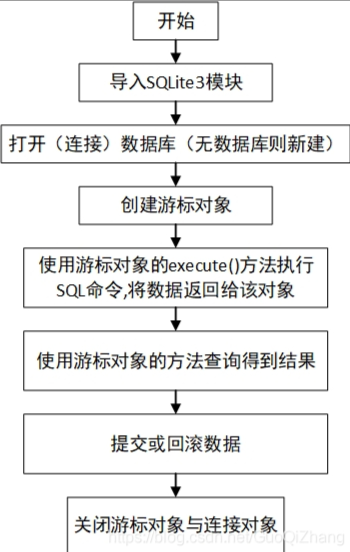

[toc]

# Python使用SQLite3库笔记

Python2.5以上的版本，都内置了SQLite3库。通过SQLite3库，python可以很方便的使用SQLite数据库。

> 使用SQLite3数据的步骤过程



- 查询操作不需要执行事务提交方法。
- 增删改操作需要执行事务提交方法。

## 创建/连接数据库

```py
#!/usr/bin/python

# 导入 sqlite3 库
import sqlite3

# 如果当前目录没有test.db文件，否则会在当前目录创建test.db文件。
# 然后程序连接test.db文件中的main数据库，并返回一个数据库连接对象
conn = sqlite3.connect('test.db')
print ("数据库打开成功")
```

sqlite3.connect 方法会在当前目录中，创建一个db文件。并且python会连接到这个db文件中的main数据库，并返回一个数据库连接对象。

> 数据库连接对象conn中包含了以下方法
- conn.cursor()	    创建一个游标对象
- conn.commit()	    处理事务提交
- conn.rollback()	处理事务回滚
- conn.close()	    关闭一个数据库连接

> 创建/连接数据库的其他写法

```py
# 在一个绝对路径下，创建或打开数据库
conn = sqlite3.connect("C:\\Test.db")

# 或者在内存中创建一个数据库
conn = sqlite3.connect("memory")
```

## 创建游标

游标对象有以下方法支持数据库操作。

```py
# 创建游标对象
cursor = conn.cursor()

# 用来执行sql语句
cursor.execute()	

# 用来执行多条sql语句
cursor.executemany()	

# 用来关闭游标
cursor.close()	

# 用来从结果中取一条记录，并将游标指向下一条记录
cursor.fetchone()	

# 用来从结果中取多条记录。
cursor.fetchmany()	

# 用来从结果中取出所以记录。
cursor.fetchall()	

# 用于游标滚动。
cursor.scroll()	

```

## 创建表

下面的代码，它会在 test.db 的main数据库中创建 t_user 表，

```py
#!/usr/bin/python

import sqlite3
# 连接test.db文件，并返回一个数据库对象
conn = sqlite3.connect('test.db')
print ("数据库打开成功")

# 创建一个游标对象
c = conn.cursor()

sql = '''
    CREATE TABLE t_user(
        ID INT PRIMARY KEY     NOT NULL,
        NAME           TEXT    NOT NULL,
        AGE            INT     NOT NULL,
        ADDRESS        CHAR(50) 
    );'''
# 游标执行SQL语句
c.execute(sql)

# 提交事务
conn.commit()
print ("数据表创建成功")
# 关闭数据库连接
conn.close()
```

- connection.cursor 方法会创建一个游标对象，游标对象用于执行SQL语句。
- cursor.execute方法用于执行SQL语句。
- connection.commit() 方法会提交当前的事务。如果未调用该方法，那么自上一次调用 commit() 以来所做的任何数据库操作对数据库连接来说是不可见的。
- connection.close() 该方法关闭数据库连接。请注意，这不会自动调用 commit()。如果您之前未调用 commit() 方法，就直接关闭数据库连接，您所做的所有更改将全部丢失。


## INSERT 操作

向t_user表中插入多条数据。

```py
#!/usr/bin/python
import sqlite3
conn = sqlite3.connect('test.db')
c = conn.cursor()
print ("数据库打开成功")

c.execute("INSERT INTO t_user (ID,NAME,AGE,ADDRESS) \
      VALUES (1, 'Paul', 32, 'California')")
c.execute("INSERT INTO t_user (ID,NAME,AGE,ADDRESS) \
      VALUES (2, 'Allen', 25, 'Texas')")

# 提交事务
conn.commit()
print ("数据插入成功")
# 关闭数据库连接
conn.close()
```

- cursor.execute方法用于执行SQL语句。该SQL语句中可以使用占位符代替 SQL 文本。

## SELECT 操作

```py
#!/usr/bin/python
import sqlite3
conn = sqlite3.connect('test.db')
c = conn.cursor()
print ("数据库打开成功")

sql = "SELECT id, name, address  from t_user"

results = c.execute(sql)
list_data = results.fetchall()

for row in list_data:
   print("ID = ", row[0])
   print("NAME = ", row[1])
   print("ADDRESS = ", row[2])

print ("数据操作成功")
conn.close()
```

- fetchall() 获取结果集中所有（剩余）的行，返回一个列表。当没有可用的行时，则返回一个空的列表。

## UPDATE 操作

```py
#!/usr/bin/python

import sqlite3
conn = sqlite3.connect('test.db')
c = conn.cursor()
print ("数据库打开成功")

c.execute("UPDATE t_user set address = 'beijing' where ID=1")
conn.commit()
conn.close()
```

## DELETE 操作

```py
#!/usr/bin/python
import sqlite3
conn = sqlite3.connect('test.db')
c = conn.cursor()
print ("数据库打开成功")

c.execute("DELETE from t_user where ID = 2;")
conn.commit()
conn.close()
```

## python 操作sqlite3模块 返回字典形式的查询结果

当我们使用python执行查询语句的时候，查询结果有可能是元组的形式。通常情况下我们会将元组类型的查询结果，转换为字典类型。


解决办法：需要进行配置

```py
import sqlite3

# 该方法将元组转化为字典
def dict_factory(cursor, row):
    d = {}
    for idx, col in enumerate(cursor.description):
        d[col[0]] = row[idx]
    return d

con = sqlite3.connect("test.db")
# 设置row_factory
con.row_factory = dict_factory

cursor = conn.cursor()
sql = "SELECT * FROM t_user"
results = cursor.execute(sql)
list_data = results.fetchall()
print("查询结果列表为：",list_data)

```

