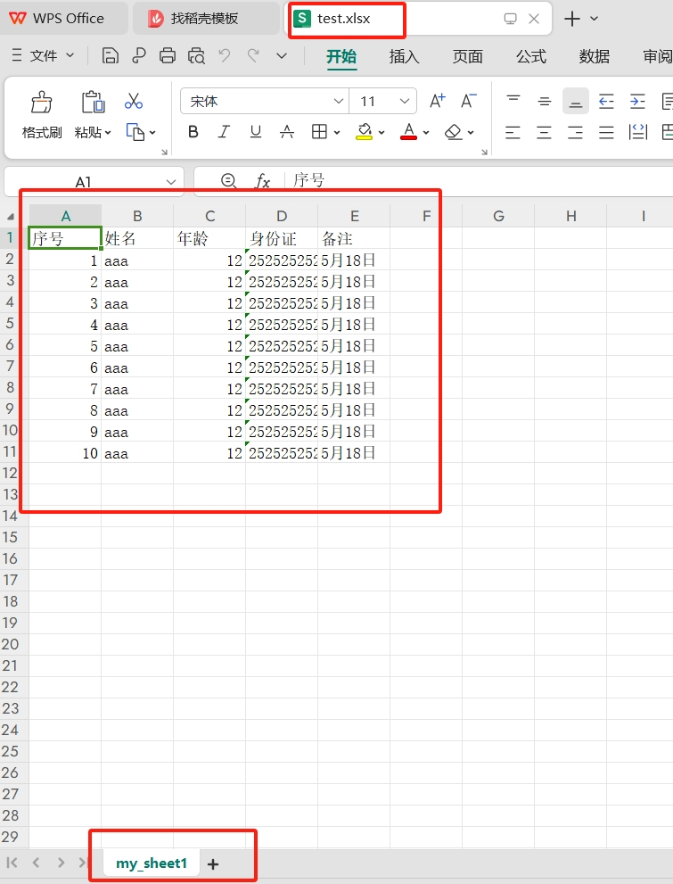
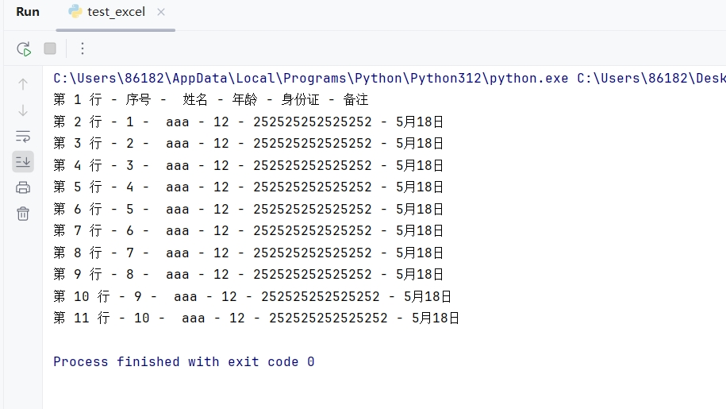
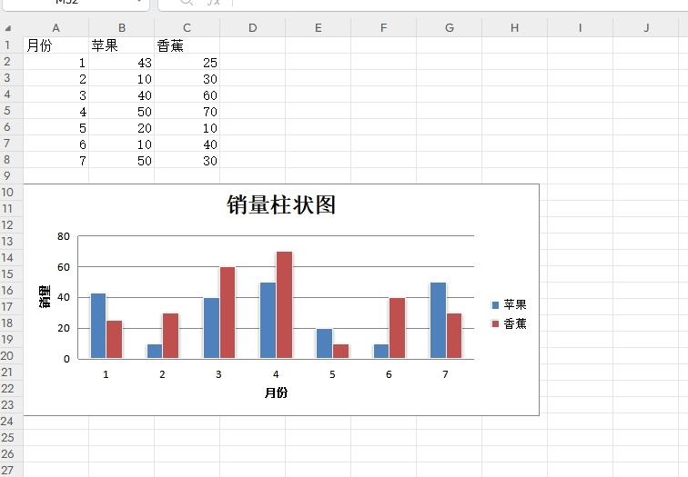
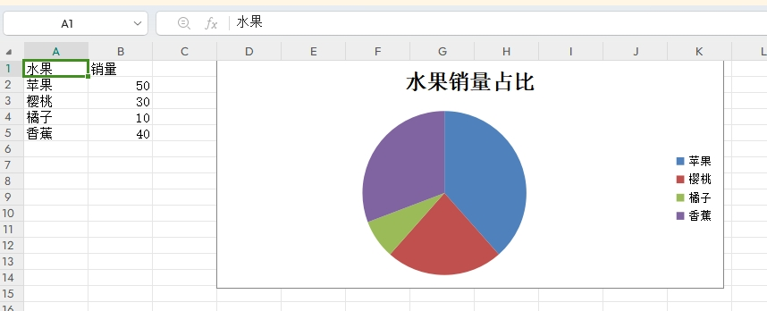

[toc]

# Python使用openpyxl库笔记

openpyxl 是一个用于读写 Excel 文件（.xlsx）的 Python 库。

openpyxl 提供了一种方便的方式来操作 Excel 文件，包括读取和写入单元格数据、创建和修改工作表、设置样式以及执行其他与 Excel 相关的操作。


openyyxl 的特点
- 支持 .xlsx 格式。
- 读写 Excel 文件，操作工作表，单元格。
- 图表和公式：你可以通过 openpyxl 创建图表、添加公式等。
- 样式设置：openpyxl 允许你设置单元格的字体、颜色、边框等样式。


## 安装

通过pip安装openpyxl库

```bash
pip install openpyxl
```

> 基本概念

- workbook 相当于一个 Excel 文件。一个被创建和打开的 Excel 文件都是一个 workbook 对象。
- sheet 是指 Excel 文档中的表单，每个 Excel 文档都有一个自带的sheet1。
- cell 是指单元格，是不可分割的基本数据存储单元。


## 基本用法

### 创建和打开excel文件

打开一个excel文件
```py
# 导入openpyxl库
import openpyxl

# excel文件的所在路径
excel_file_path = "C:\\Users\\86182\\Desktop\\test.xlsx";
# 加载excel文件
old_workbook= openpyxl.load_workbook(excel_file_path)
# 获取excel文件的活动sheet（默认为sheet1）
old_sheet1 = old_workbook.active
# 关闭excel文件
old_workbook.close()
```

创建一个excel文件
```py
# 导入openpyxl库
import openpyxl
# 新建一个workbook(新建一个excel文件)
new_workbook = openpyxl.Workbook()
# 打开新建excel文件的默认sheet1
new_sheet1 = new_workbook.active
# 给sheet1重命名
new_sheet1.title = 'my_sheet1'

# 新的excel文件的所在路径
excel_file_path = "C:\\Users\\86182\\Desktop\\test.xlsx";
# 保存excel文件
new_workbook.save(excel_file_path)
# 关闭excel文件
new_workbook.close()
```


### 操作 sheet 表单

```py
import openpyxl
# 加载一个excel文件
workbook= openpyxl.load_workbook("C:\\Users\\86182\\Desktop\\test.xlsx")

# 创建sheet
ws1  = workbook.create_sheet("ws1")  #创建一个 sheet 名为 ws1
ws1.title = "新表单1"  # 设置标题

ws2 = wb.create_sheet("ws2", 0) # 创建一个 sheet，插入到最前面。不填参数就默认插在最后面
ws2.title = "新表单2"  # 设置标题


# 根据名称获取对应的sheet
ws3 = wb.get_sheet_by_name("新表单1")
ws4 = wb['新表单2']

# 复制名为 ws1 的sheet，返回新创建的sheet对象 ws5
ws5 = wb.copy_worksheet(ws1)

# 删除workbook中的某一个sheet
workbook.remove(ws1)
```

- 每个 Workbook 中都有一个被激活的 sheet （默认为sheet1），一般都是第一个。可以通过 active 直接获取。


### 操作单元格

单元格（cell）是 Excel 中存放数据的最小单元，就是图形界面中的一个个小格子。

OpenPyXl 可以操作单个单元格，也可以批量操作单元格。

> 单独操作单元格

```py
import openpyxl

# 新建一个workbook
new_workbook = openpyxl.Workbook()
# 打开默认sheet1
new_sheet1 = new_workbook.active
# 给sheet1重命名
new_sheet1.title = 'my_sheet1'

# 通过单元格的名称 给A1,B2单元格赋值
new_sheet1["A1"]=123.11
wsnew_sheet11["B2"]="你好"

# 通过单元格的坐标 给第四行，第2列的单元格赋值为10
d = ws1.cell(row=4, column=2, value=10)

# 也可以提前准备好整行的数据，然后添加到sheet中
new_sheet1.append((1,2,3))

```

- 可以通过单元格名称给单元格赋值。
- 也可以通过单元格的行列坐标，来给单元格赋值。


> 批量操作单元格

```py
# 操作单列
for cell in ws["A"]:
    print(cell.value)

# 操作单行
for cell in ws["1"]:
    print(cell.value)

# 操作多列
for column in ws['A:C']:
    for cell in column:
        print(cell.value)

# 操作多行
for row in ws['1:3']:
    for cell in row:
        print(cell.value)

# 操作指定范围的单元格
for row in ws['A1:C3']:
    for cell in row:
        print(cell.value)

# 操作所有行
for row in ws.iter_rows():
    for cell in row:
        print(cell.value)

# 操作所有列
for column in ws.iter_cols():
    for cell in column:
        print(cell.value)

```


> 修改单元格的格式

OpenPyXl 用6种类来设置单元格的样式
- NumberFormat 数字
- Alignment 对齐
- Font 字体
- Border 边框
- PatternFill 填充
- Protection 保护


```py
from openpyxl.styles import Font, PatternFill, Border, Side, Alignment, Protection
from openpyxl.styles import numbers

wb = Workbook()
ws = wb.active
# 给单元格设置字体为宋体
ws.cell(row=1, column=1, value='宋体').font = Font(name=u'宋体', size=12, bold=True, color='FF0000')
# 给单元格设置为右对齐
ws.cell(row=2, column=2, value='右对齐').alignment = Alignment(horizontal='right')
# 给单元格设置为填充渐变色
ws.cell(row=3, column=3, value='填充渐变色').fill = PatternFill(fill_type='solid', start_color='FF0000')
# 给单元格设置边线
ws.cell(row=4, column=4, value='设置边线').border = Border(left=Side(border_style='thin', color='FF0000'), right= Side(border_style='thin', color='FF0000'))
# 给单元格设置为受保护的
ws.cell(row=5, column=5, value='受保护的').protection = Protection(locked=True, hidden=True)
ws.cell(row=6, column=6, value=0.54).number_format =numbers.FORMAT_PERCENTAGE

```

## 例子

### 写入excel文件

1. 创建workbook，即创建excel文件
2. 打开workbook中的sheet
3. 写入数据到sheet中
4. 保存workbook，并关闭

```py
# 导入openpyxl库
import openpyxl

"""
workbook 工作簿 就是 excel文件。
worksheet 工作表 就是 excel文件中的sheet
"""

# 新建一个workbook(新建一个excel文件)
new_workbook = openpyxl.Workbook()
# 打开新建excel文件的默认sheet1
new_sheet1 = new_workbook.active
# 给sheet1重命名
new_sheet1.title = 'my_sheet1'

# 首行数据
row = ["序号","姓名","年龄","身份证","备注"]
# 把首行数据加入到new_sheet1中
new_sheet1.append(row)

# 遍历数据，并添加到excel文件中
for i in range(10):
    row = [i + 1,"aaa",12,"252525252525252","5月18日"]
    new_sheet1.append(row)

# 新的excel文件的所在路径
excel_file_path = "C:\\Users\\86182\\Desktop\\test.xlsx";
# 保存excel文件
new_workbook.save(excel_file_path)
# 关闭excel文件
new_workbook.close()

```





### 读取excel文件

```py
# 导入openpyxl库
import openpyxl

"""
workbook 工作簿 就是 excel文件。
worksheet 工作表 就是 excel文件中的sheet
"""

# excel文件的所在路径
excel_file_path = "C:\\Users\\86182\\Desktop\\test.xlsx";

# 加载excel文件
old_workbook= openpyxl.load_workbook(excel_file_path)
# 获取excel文件的活动sheet（默认为sheet1）
old_sheet1 = old_workbook.active

# 遍历读取excel的数据
for row in range(1, old_sheet1.max_row + 1):
    # 如果某一行的序号列的数据为空，则表示该行没有数据。直接跳过这次循环即可
    if (old_sheet1.cell(row, 1).value == None):
        continue

    # 输出excel中的这一行数据
    print(f'第 {row} 行 - {old_sheet1.cell(row, 1).value} -  {old_sheet1.cell(row, 2).value} - {old_sheet1.cell(row, 3).value} - {old_sheet1.cell(row, 4).value} - {old_sheet1.cell(row, 5).value}')

# 关闭excel文件
old_workbook.close()

```



### 生成柱状图

```py
from openpyxl import Workbook
from openpyxl.chart import BarChart, Reference

# 创建 Workbook
wb = Workbook()
ws = wb.active

rows = [
    ('月份', '苹果', '香蕉'),
    (1, 43, 25),
    (2, 10, 30),
    (3, 40, 60),
    (4, 50, 70),
    (5, 20, 10),
    (6, 10, 40),
    (7, 50, 30),
]

# 为活动 Sheet 添加数据
for row in rows:
    ws.append(row)

# 创建柱状图对象，设置图表属性，type 为 col 为列状图，bar 为水平图
chart1 = BarChart()
chart1.type = "col"
chart1.style = 10
chart1.title = "销量柱状图"
chart1.y_axis.title = '销量'
chart1.x_axis.title = '月份'

# 创建数据引用对象，指定 sheet 以及数据范围
data = Reference(ws, min_col=2, min_row=1, max_row=8, max_col=3)
# 创建系列数据引用对象
series = Reference(ws, min_col=1, min_row=2, max_row=8)
# 将数据和系列加入到图表对象中
chart1.add_data(data, titles_from_data=True)
chart1.set_categories(series)
# 最后将图表对象用 add_chart 添加到 sheet 里
ws.add_chart(chart1, "A10")

# 保存excel文件
wb.save("C:\\Users\\18271\\Desktop\\test.xlsx")
# 关闭excel文件
wb.close()

```

程序运行后，会在桌面创建一个test.xlsx文件。打开如下所示。



### 生成饼状图

```py
from openpyxl import Workbook
from openpyxl.chart import PieChart, Reference

data = [
    ['水果', '销量'],
    ['苹果', 50],
    ['樱桃', 30],
    ['橘子', 10],
    ['香蕉', 40],
]
# 创建 Workbook
wb = Workbook()
ws = wb.active
# 为活动 Sheet 添加数据
for row in data:
    ws.append(row)

# 创建图表对象，设置图表标题
pie = PieChart()
pie.title = "水果销量占比"
# 定义标签数据引用和数据引用，并将其加入到图表
labels = Reference(ws, min_col=1, min_row=2, max_row=5)
data = Reference(ws, min_col=2, min_row=1, max_row=5)
pie.add_data(data, titles_from_data=True)
pie.set_categories(labels)
# 将图表对象添加到 sheet 的指定位置
ws.add_chart(pie, "D1")

# 保存excel文件
wb.save("C:\\Users\\18271\\Desktop\\test.xlsx")
# 关闭excel文件
wb.close()
```

程序运行后，会在桌面创建一个test.xlsx文件。打开如下所示。



### 读取每一行的D到J列的单元格

```py
from openpyxl import load_workbook

# 加载现有的 Excel 文件
wb = load_workbook('example.xlsx')

# 选择要操作的工作表
ws = wb.active  # 或者通过名称选择工作表： ws = wb['Sheet1']

# 获取每一行的 D 到 J 列的单元格值
for row in ws.iter_rows(min_row=1, min_col=4, max_col=10, values_only=True):
    cell_values = row  # row 是一个元组，包含了 D 到 J 列的值
    print(f'Values in D to J: {cell_values}')
    print(f"""
    A、{cell_values[0]}
    B、{cell_values[1]}
    C、{cell_values[2]}
    D、{cell_values[3]}
    E、{cell_values[4]}
    F、{cell_values[5]}
    G、{cell_values[6]}""")


# 如果要获取除了标题行之外的数据，可以从第二行开始迭代
for row in ws.iter_rows(min_row=2, min_col=4, max_col=10, values_only=True):
    cell_values = row  # row 是一个元组，包含了 D 到 J 列的值
    print(f'Values in D to J: {cell_values}')
    
```