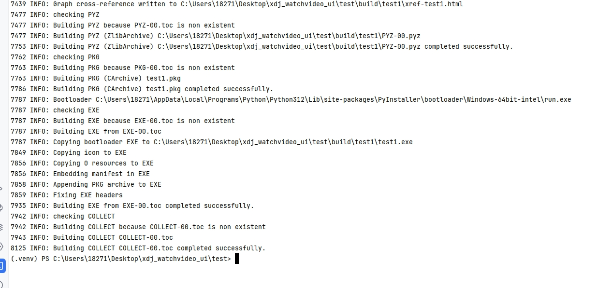
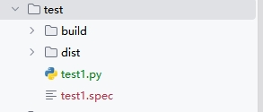
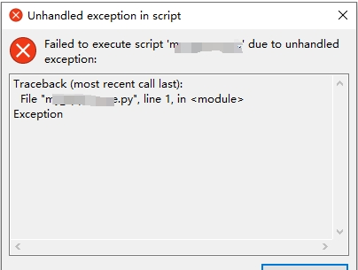
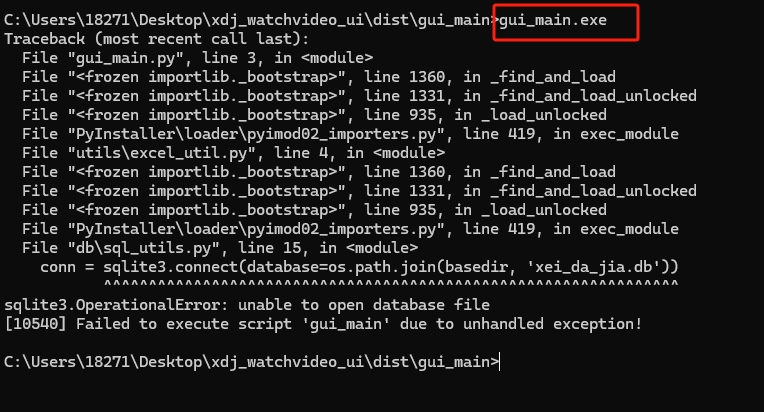

[toc]

# Python使用pyinstaller库笔记

[pyinstaller官网：https://pyinstaller.org/](https://pyinstaller.org/)

pyinstaller 是一个第三方库，专用于python程序的exe打包。 pyinstaller可以将普通的*.py程序文件编译（打包）成exe应用。

exe文件是可执行文件，打包后的*.exe 应用可以不用依赖python环境，直接在他人的电脑上运行。

python有多种方法用于将普通的*.py程序文件编译（打包）成exe应用。其中pyinstaller打包最强大而且好用。


## 安装

使用 pip 安装 pyinstaller 即可。

```bash
pip install pyinstaller
# 查看版本
pyinstaller --version
```

## 编译打包原理介绍

pyinstaller编译打包的大致过程是
1. pyinstaller先读取你需要打包的python文件，然后搜索这个python文件中使用的模块。
2. 然后将所需的模块以及Python解释器放到一起，并通过一些操作构建exe，最终形成你的应用程序。

### pyinstaller如何搜索模块?

pyinstaller会读取文件中的import语句，然后根据import语句来找到对应的模块。

如果文件中使用了一些特殊的导入方式，比如使用__import__()函数，使用importlib里面的导入函数。那么pyinstaller很可能找不到对应的模块。

### pyinstaller编译打包的两种方式

pyinstaller编译打包的方式有两种，一种是打包后形成一个单个文件夹。另一种是打包后会形成一个单个 *.exe 应用文件。

> 打包成单个文件夹

pyinstaller编译打包后会产生一个文件夹。文件夹中包含一个exe文件，以及其他一些依赖文件（比如一些dll文件，图片等）。后面你只要把该文件夹发给别人运行即可。

当你运行文件夹里面的exe文件后，pyinstaller其实是启动了解释器，然后通过解释器运行你的python程序。

优点：
1. 便于调试，因为可以看到pyinstaller将哪些模块文件放到了文件夹中。
2. 便于更新，当前要更新程序的时候，可以只替换文件夹中对应的部分即可。

缺点：
1. 打包产生的文件夹，体积相比打包产生的exe文件，体积更大。因为文件夹中的文件都是没有压缩的。

> 打包成单个exe文件

pyinstaller编译打包后会产生单个exe文件。所有的依赖文件都会被压缩到exe文件中。

优点：
1. 在经过压缩后，这个exe文件的文件会大大减小。

缺点：
1. 单个exe文件的启动速度比较慢

### pyinstaller编译打包后的运行效果

例如你要打包 first.py 程序文件，那么pyinstaller编译打包后会产生一个 first.exe 文件，双击运行exe程序文件。

默认情况下，运行这个exe程序文件会开启一个黑色的控制台（即cmd）。

这个控制台用于为python提供标准输入(stdin)，标准输出(stdout)，标准错误(stderr)。也就是说，这个控制台会显示程序中的 print函数的输出信息，input函数的输入信息，还会输出python的异常信息。

python文件有一种后缀名*.pyw，这样的程序在经过编译打包后，产生的exe文件。执行这个exe文件默认会隐藏控制台。如果将文件后缀命名为pyw，那么pyinstaller也会认为它默认隐藏控制台。


## 编译打包

> 编译打包步骤

1. 先进入到主程序文件的目录中。
2. 输入上面的命令，对程序进行编译打包。
3. pyinstaller会生成一个spec文件将一些打包参数放到里面，然后进行打包。
4. 打包完成后，会在目录下创建一个dist文件夹，里面存储了打包后的结果。还会创建一个build文件夹并写入一些日志信息。

> 基本语法

```
# test1.py 就是你要打包的主程序文件
pyinstaller test1.py
```

运行结果如图所示。如果没有错误消息，那么编译打包就成功了。




打包后，会在当前目录下创建了build和dist文件夹，以及一个spec文件。
- dist文件夹包含打包结果文件，即exe文件和依赖文件。
- build文件夹中是一些打包过程中产生的日志信息
- spec文件里面是用于打包的配置信息。

> pyinstaller 命令可选参数

```bash
# （默认） 文件夹模式。在打包完成后生成一个文件夹，其中包含exe文件和依赖文件。
-D    

# 单文件模式。在打包完成后只会生成一个单独的exe文件。
-F    

# 这三个参数都是相同的作用。（默认）打包程序运行后出现一个黑色的控制台窗口
-c
--console
--nowindowed  

# 这三个参数也都是相同的作用。打包程序运行后隐藏控制台窗口
-w
--windowed
--noconsole   

# 设置打包后的exe程序的图标（只能在Windows和macOS上使用）
-i "icon.ico"
--icon "icon.ico"  

#  添加一个启动画面（图片文件）路径，在程序运行前显示指定的启动图片，起到加载提示的效果。
--splash img_file_path  

# 指定一个文件夹或文件（非二进制），将其嵌入到exe中。
--add-data <SRC;DEST or SRC:DEST>	

# 和--add-data类似，不过指定的文件夹或文件是二进制的
--add-binary <SRC;DEST or SRC:DEST>	

# 提供一个路径进行搜索并且导入里面的模块
# 这可以解决有时候第三方模块找不到的问题。
-p DIR
--paths DIR

# 当pyinstaller在程序中找不到一些模块时，需要你额外指定。
# 这个参数可以多次使用，可以解决一些模块找不到的问题。
--hidden-import MODULENAME
--hiddenimport MODULENAME  

# 禁用异常提示（只能在Windows和macOS上使用）
--disable-windowed-traceback 

# 打印pyinstaller的帮助信息
--help
-h          

```

例子
```py
# 编译打包first.py程序，编译打包为单exe文件，隐藏控制台，设置exe图标为icon.ico
pyinstaller -F -w -i "icon.ico" first.py
```

### 更改图标

python程序文件打包成exe文件后，默认的程序图标是一个“蛇”形，但我们也可以进行更改。（该功能只能在Windows和macOS上使用）

假设程序目录结构如下
```
- my_demo1
    - test1.py
    - icon.ico
```

那么更改图标的打包命令如下所示
```
pyinstaller -i icon.ico test1.py
```

### 启动画面

在有些情况下，我们在双击运行程序的时候，可以需要一个启动画面（闪屏）进行过渡，提示用户正在进行加载。这个启动画面可以是单张图片。

设置启动画面，需要先准备一张图片，必须是PNG格式。然后在打包时加上--splash参数，并传入图片路径，这张图片就会作为程序的启动画面。

```
pyinstaller --splash aaa.png test1.py
```

另外在代码中，控制启动画面可以通过pyi_splash模块。该模块在pyinstaller打包成exe之前是不起作用的，所以必须带上try...except...代码。

在程序开头部分添加以下代码。pyi_splash.close()方法用于关闭启动画面。一般放在程序开头即可，因为只要运行到程序开头，说明exe文件的加载就基本完成了。

```py
try:
    import pyi_splash
    pyi_splash.close()
except ImportError:
    pass
```

如果不用这段代码关闭启动画面，那么启动画面将一直显示。

### 禁用异常提示

`--disable-windowed-traceback` 参数用于禁用异常提示。

如果不添加这个参数，当程序代码中报错的时候，会弹出一个窗口报告异常信息（注意：仅在隐藏控制台模式下弹出异常报告窗口）。




## 编译打包的问题

### 闪退问题

当编译打包后，双击exe文件。却发现程序闪退。

> 解决方法

1. 先进入到exe文件的目录，打开终端。输入exe文件的全称。

可以看到该exe文件运行闪退的原因。


2. 如果提示缺少模块，可能是你的项目文件中的虚拟环境中有模块，但是你安装在本机的python环境，却没有这个模块。那么就直接安装即可。

可以用 pip list 命令查询你本机安装的python模块。

### python虚拟环境，缺少模块的问题

python项目是区分本地环境和虚拟环境。

当对某个python项目，在本地的终端中，使用pyinstaller进行打包。并且这个python项目是使用的虚拟环境的模块库。

那么打包后的exe文件可能缺少模块，因为缺少的模块库在虚拟环境存在，但是在本地环境不存在。

> 解决方法

1. 在这个python项目使用的虚拟环境中，安装 pyinstaller 打包工具。
2. 安装完毕后,虚拟环境中的 scripte文件夹下会增加一个pyinstaller.exe程序
3. 然后在这个python项目的终端中，再次运行打包命令。

