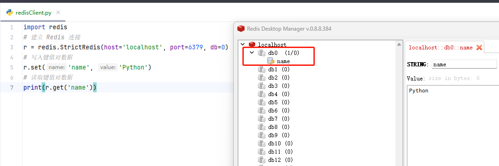

[toc]

# Python使用redis-py库笔记

redis-py 是 Redis 官方提供的操作redis数据库的 Python 客户端，提供了 Redis 的多种数据结构的基本操作，如 set / get / incr / decr / rpush / lpush / llen / lrange / ltrim 等。


## 安装

```py
# 使用pip安装
pip install redis  
```

## Redis类 和 StrictRedis类

redis-py 库提供两个类Redis和StrictRedis来实现对redis的命令操作。

StrictRedis类实现了绝大部分官方的命令，参数也一一对应，比如set()方法就对应Redis命令的set方法。

Redis类是StrictRedis的子类，它的主要功能是用于向后兼容旧版本库里的几个方法。为了做兼容，它将方法做了改写，比如lrem()方法就将value和num参数的位置互换，这和Redis命令行的命令参数不一致。

官方推荐使用StrictRedis类，所以笔记中使用StrictRedis类。


## 基本用法

### 连接Redis数据库

注意:需要先安装好redis数据库。

```py
# 导入redis依赖库
import redis

# 建立 Redis数据库 连接
# 如果redis没有密码，则设置password=None
r = redis.StrictRedis(host='localhost', port=6379, db=0,password=None)
# 写入键值对数据
r.set('name', 'Python')
# 读取键值对数据
print(r.get('name'))
# 运行结果
# b'Python'
```

运行截图


### 连接池

redis-py库 提供 connection pool 来管理对一个 redis server 的所有连接，避免每次建立、释放连接的开销。

每个Redis实例都会维护一个自己的连接池。可以直接建立一个连接池，然后作为参数，这样就可以实现多个 Redis 实例共享一个连接池。

```py
import redis    # 导入redis-py库

# 设置连接池
pool = redis.ConnectionPool(host='localhost', port=6379, db=0, password=None)
# 连接redis
r = redis.StrictRedis(connection_pool=pool) 
# 写入键值对数据  
r.set('name', 'python') 
# 读取键值对数据
print(r.get('name')) 

```

### key操作

下面是关于key的一些操作方法的示例。更多的方法，请查询官方文档。

```py
# 判断key是否存在，传入key名称
a = r.exists("name")
print(a) # 1

# 判断key的类型
a = r.type("name")
print(a) # b'string'

# 设定key的过期时间,传入key名称，秒数
a = r.expire("name",1800)
print(a) # True

# 获取键的过期时间
a = r.ttl("name")
print(a)

# 获取随机的一个键
a = r.randomkey()
print(a)

# 删除一个键
a = r.delete("name")
print(a)

# 删除当前选择数据库中的所有键
a = r.flushdb()
print(a)

```

### value操作 - String字符串类型数据

下面是关于value操作的示例。更多的方法，请查询官方文档。

```py
# 写入键值对数据
a = r.set('name', '小明')
print(a)

# 读取键值对数据
a = r.get('name')
print(a)

# 返回多个键对应的value
a = r.mget(['name', 'nickname'])
print(a)

# 批量赋值
a = r.mset({'name1': 'Durant', 'name2': 'James'})
print(a)

# 返回多个键对应的value
a = r.mget(['name', 'nickname'])
print(a)

# 如果不存在这个键值对，则更新value，否则不变
a = r.setnx('newname', 'James')
print(a)
```

### value操作 - list列表类型数据

更多的方法，请查询官方文档。

```py
# 向键为list的列表尾添加1、2、3
a = r.rpush('list', 1, 2, 3)
print(a)

# 向键为list的列表头部添加0
a = r.lpush('list', 0)
print(a)

# 返回键为list的列表的长度
a = r.llen('list')
print(a)

# 返回起始索引为1终止索引为3的索引范围对应的列表
a = r.lrange('list', 1, 3)
print(a)

# 返回键为list的列表索引为1的元素
a = r.lindex('list', 1)
print(a)

# 将键为list的列表中索引为1的位置赋值为5
a = r.lset('list', 1, 5)
print(a)

# 返回并删除名为list的列表中的第一个元素
a = r.lpop('list')
print(a)

# 返回并删除名为list的列表中的最后一个元素
a = r.rpop('list')
print(a)
```

### value操作 - hash散列类型数据

更多的方法，请查询官方文档。

```py
# 向键为price的散列表中添加映射关系，cake的值为5
a = r.hset('price', 'cake', 5)
print(a)

# 向键为price的散列表中添加映射关系，book的值为6
a = r.hsetnx('price', 'book', 6)
print(a)

# 获取键为price的散列表中键名为cake的值
a = r.hget('price', 'cake')
print(a)

# 获取键为price的散列表中apple和orange的值
a = r.hmget('price', ['apple', 'orange'])
print(a)

# 向键为price的散列表中批量添加映射
a = r.hmset('price', {'banana': 2, 'pear': 6})
print(a)

# 键为price的散列表中banana的值是否存在
a = r.hexists('price', 'banana')
print(a)

# 从键为price的散列表中删除键名为banana的映射
a = r.hdel('price', 'banana')
print(a)

# 从键为price的散列表中获取映射个数
a = r.hlen('price')
print(a)

```

### value操作 - set集合类型数据

更多的方法，请查询官方文档。

```py
# 向键为tags的集合中添加Book、Tea和Coffee这3个内容
a = r.sadd('tags', 'Book', 'Tea', 'Coffee')
print(a)

# 从键为tags的集合中随机删除并返回该元素
a = r.spop('tags')
print(a)

# 获取键为tags的集合中的元素个数
a = r.scard('tags')

# 判断Book是否是键为tags的集合元素
a = r.sismember('tags', 'Book')
print(a)

# 返回键为tags的集合和键为tags2的集合的差集
a = r.sdiff(['tags', 'tags2'])
print(a)

# 返回键为tags的集合的所有元素
a = r.smembers('tags')
print(a)

# 返回键为tags的集合和键为tags2的集合的并集
a = r.sunion(['tags', 'tags2'])
print(a)

# 返回键为tags的集合和键为tags2的集合的交集
a = r.sinter(['tags', 'tags2'])
print(a)

```


### value操作 - zset有序集合类型数据

更多的方法，请查询官方文档。

```py
# 向键为grade的zset中添加Bob（其score为100），并添加Mike（其score为98）
a = r.zadd('grade', 100, 'Bob', 98, 'Mike')
print(a)

# 从键为grade的zset中删除Mike
a = r.zrem('grade', 'Mike')
print(a)

# 得到键为grade的zset中Amy的排名
a = r.zrank('grade', 'Amy')
print(a)

# 返回键为grade的zset中score在80和95之间的元素
a = r.zrangebyscore('grade', 80, 95)
print(a)

# 返回键为grade的zset中score在80到95的元素个数
a = r.zcount('grade', 80, 95)
print(a)

# 获取键为grade的zset中元素的个数
a = r.zcard('grade')
print(a)

```