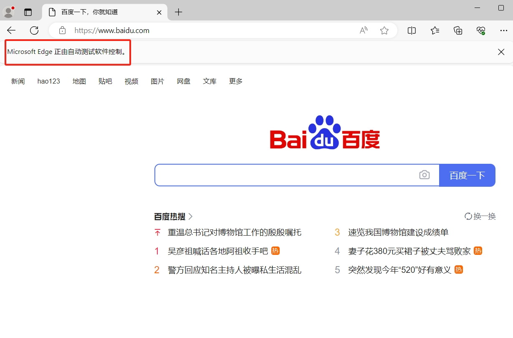
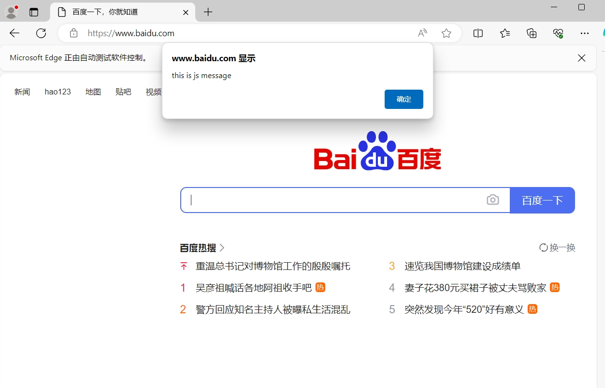

[toc]

# Python使用selenium库笔记

selenium 是一个用于 Web 应用程序的自动化测试工具 , 能够通过代码完全模拟人使用浏览器自动访问目标站点并操作。常用于网站的自动化测试。

selenium 本质上是通过驱动浏览器，彻底模拟浏览器的操作，好比跳转、输入、点击、下拉等，然后拿到网页渲染之后的结果。

python有一个 selenium 第三方库。从而可以很方便的通过python语言来使用selenium。

## 安装

安装 selenium 库

```bash
pip install selenium
```

## Selenium的基本使用

```py
# 导入selenium库的webdriver类
from selenium import webdriver
# 创建Edge浏览器操作对象
browser = webdriver.Edge()
# 网站链接
url = 'https://www.baidu.com'
# 访问网站
browser.get(url)
# 关闭浏览器
browser.close()
```

运行代码，得到下面的效果。



## Selenium的元素操作

如何通过selenium来操作HTML文件中的某个元素。

1. 首先需要找到该元素，进行元素定位
2. 获取元素的各个属性数据
3. 对元素进行交互(模拟操作)

### Selenium的进行元素定位

> 根据标签 id 获取元素

```py
from selenium import webdriver
from selenium.webdriver.common.by import By
browser = webdriver.Edge()
url = 'https://www.baidu.com'
browser.get(url)

# 根据标签 id 获取元素
button = browser.find_element(By.ID, 'head')
print(button)

# 通过标签id属性进行定位
button = browser.find_element_by_id('head')
print(button)
```

> 根据标签 name 属性的值获取元素

```py
button = browser.find_element(By.NAME, 'bsToken')
print(button)

# 通过标签name属性进行定位
button = browser.find_element_by_name('bsToken')
print(button)
```

> 根据 class 属性获取元素

```py
button = browser.find_element(By.CLASS_NAME, 'wrapper_new')
print(button)

# 通过class名称进行定位
button = browser.find_elements_by_class_name('wrapper_new')
print(button)
```

> 根据标签名获取元素

```py
button = browser.find_elements(By.TAG_NAME, 'input')
print(button)

# 通过标签名称进行定位
button = browser.find_element_by_tag_name('input')
print(button)
```

> 根据标签的文本获取元素（精确定位）

```py
button = browser.find_elements(By.LINK_TEXT, '地图')
print(button)

# 通过搜索 页面中 链接进行定位
browser.find_element_by_link_text("地图")
```

> 根据标签的文本获取元素（模糊定位）

```py
button = browser.find_elements(By.PARTIAL_LINK_TEXT, '地')
print(button)
```

### Selenium的获取元素的各种信息

当我们定位到元素之后，我们还需要获取元素的属性之后，才能进行元素操作。

selenium 给我们提供了获取元素不同信息的方法。

> 获取元素的属性

```py
from selenium import webdriver
from selenium.webdriver.common.by import By
browser = webdriver.Edge()
url = 'https://www.baidu.com'
browser.get(url)

# 获取元素的class属性
button = browser.find_element(By.ID, 'su')
print(button.get_attribute('class'))

```

> 获取元素标签名

```py
input = browser.find_element(By.ID, 'su')
print(input.tag_name)
```

> 获取元素文本值

```py
input = browser.find_element(By.ID, 'su')
print(input.text)
```

> 获取元素位置

```py
input = browser.find_element(By.ID, 'su')
print(input.location)
```

> 获取元素大小

```py
input = browser.find_element(By.ID, 'su')
print(input.size)
```

### Selenium元素交互

交互指的是我们平时在浏览器上的各种操作，比如输入文本、点击链接、回车、下拉框等。

> 输入文本和清除文本

```py
import time
from selenium import webdriver
from selenium.webdriver.common.by import By
browser = webdriver.Edge()
url = 'https://www.baidu.com'
browser.get(url)

# 定位到输入框元素
input = browser.find_element(By.ID, 'kw')
# 给输入框输入文本值
input.send_keys('selenium')

# 暂停5秒
time.sleep(5)

# 清除输入框的文本值
input.clear()

# 关闭浏览器
browser.close()

```

> 模拟点击

```py
# 定位到百度一下的按钮元素
button = browser.find_element(By.ID, 'su')
# 点击按钮
button.click()
```

> 回车确认

```py
# 定位到输入框元素
input = browser.find_element(By.ID, 'kw')
# 给输入框输入文本值
input.send_keys('selenium')
# 回车查询
input.submit()
```

## Selenium 执行JS代码

我们也可以通过selenium来执行js代码。

```py
import time
from selenium import webdriver
browser = webdriver.Edge()
url = 'https://www.baidu.com'
browser.get(url)

# js代码
js_bottom = "alert('this is js message')"
# 执行这段js代码，实现消息弹窗
browser.execute_script(js_bottom)

# 休眠5秒，从而能看到消息弹窗。否则程序结束，浏览器就自动关闭了
time.sleep(5)
```




## selenium加载本地的html文件

在上面的例子中，我们可以通过网址来加载网页。我们也可以通过本地的html文件，来加载本地的网页。

```py
import time
from selenium import webdriver
browser = webdriver.Edge()
html_file_path = "C:\\Users\\86182\\Desktop\\a.html"
browser.get(html_file_path)

# js代码
js_bottom = "alert('this is js message')"
# 执行这段js代码，实现下拉进度条，页面滑动的效果
browser.execute_script(js_bottom)

# 执行html文件中的decode方法，并传入参数 data_info
data_info = "aaaa"
browser.execute_script("return decode(" + data_info + ");")

time.sleep(5)
```

