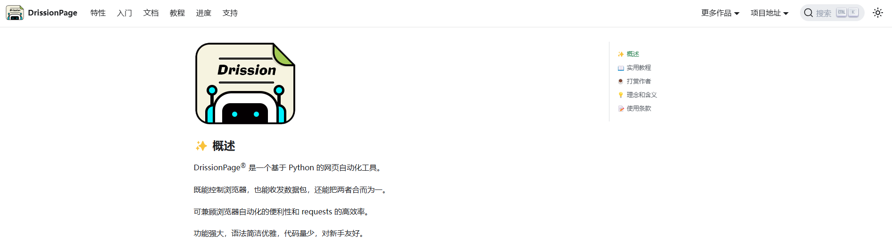

[toc]

# Python的DrissionPage网页自动化工具库笔记

DrissionPage 是一个基于 Python 的网页自动化工具。既能控制浏览器，也能收发数据包，还能把两者合而为一。类似Selenium自动化测试工具。

[DrissionPage官网](https://drissionpage.cn/) 目前最新版本为DrissionPage 4.1.0.17



## 安装

支持的运行环境
- 操作系统：Windows、Linux 和 Mac。
- python 版本：3.6 及以上
- 支持浏览器：Chromium 内核（如 Chrome 和 Edge）

```py
# 使用 pip 安装 DrissionPage
pip install DrissionPage

# 升级命令
pip install DrissionPage --upgrade

# 升级指定版本
pip install DrissionPage==4.0.0b17
```

## 示范例子

控制浏览器，打开网页。

代码逻辑如下
1. 创建浏览器对象，用于启动或接管浏览器
2. 获取一个 Tab 标签页对象
3. 使用 Tab 标签页对象访问网址
4. 使用 Tab 标签页对象获取标签页内需要的元素对象
5. 使用元素对象进行交互操作。

```py
# 导入
from DrissionPage import Chromium,ChromiumOptions

# 浏览器设置
def getBrowser():
    # 浏览器的可执行文件路径
    path = r'C:\Program Files (x86)\Microsoft\Edge\Application\msedge.exe'  
    # 浏览器启动设置对象
    co = ChromiumOptions()
    # 设置浏览器路径
    co.set_browser_path(path)
    # 自动获取空闲端口，从而启动一个全新浏览器
    co.auto_port()
    # 开启无头模式
    # co.headless(True)
    # 来宾模式
    co.set_argument('--guest')
    # 无痕模式
    co.incognito()
    # 设置浏览器的窗口大小
    co.set_argument('--window-size', '390,844')
    # 阻止“自动保存密码”的提示气泡
    co.set_pref('credentials_enable_service', False)
    # 阻止“要恢复页面吗？Chrome未正确关闭”的提示气泡
    co.set_argument('--hide-crash-restore-bubble')
    # 设置浏览器的UA，UA可选择设置为手机或者电脑的UA。
    co.set_user_agent(user_agent='Mozilla/5.0 (iPhone; CPU iPhone OS 10_2_1 like Mac OS X) AppleWebKit/602.4.6 (KHTML, like Gecko) Mobile/14D27 MicroMessenger/6.5.5 NetType/WIFI Language/zh_CN')
    # 浏览器静音
    co.mute(True)
    # 传入浏览器配置，创建浏览器对象
    browser = Chromium(addr_or_opts=co)
    return browser

if __name__ == '__main__':
    # 连接浏览器
    browser = getBrowser()
    # 获取最后激活的标签页对象
    tab = browser.latest_tab
    # 标签页访问一个网址
    tab.get('https://www.baidu.com')
    # 获取文本框元素对象
    ele = tab.ele('#kw')
    # 向文本框元素对象输入文本
    ele.input('DrissionPage')  
    # 点击按钮，上两行的代码可以缩写成这样
    tab('#su').click()  
    # 获取所有<h3>元素
    links = tab.eles('tag:h3')  
    # 遍历并打印结果
    for link in links:  
        print(link.text)

```

## 创建浏览器

Chromium对象，用于管理浏览器整体相关的操作。如标签页管理、获取浏览器信息、设置浏览器的运行参数等。

注意：每个浏览器只能有一个Chromium对象（同一进程中）。对同一个浏览器重复使用Chromium()获取的都是同一个对象。

默认情况下，程序会使用 9222 端口来启动一个浏览器。

> 创建浏览器对象的方式

```py
from DrissionPage import Chromium, ChromiumOptions

# 方式1 默认创建
browser = Chromium()

# 方式2 指定端口或地址
browser = Chromium(9333)
browser = Chromium('127.0.0.1:9333')

# 方式3 通过配置信息
# 浏览器启动设置对象
co = ChromiumOptions()
# 设置浏览器路径
co.set_browser_path(r'D:\chrome.exe')
# 传入浏览器配置，创建浏览器对象
browser = Chromium(addr_or_opts=co)

```

更多的用法请自行在官网中查询。

### 浏览器启动设置类 ChromiumOptions

ChromiumOptions类是浏览器的启动配置。

```py
from DrissionPage import Chromium,ChromiumOptions
# 创建浏览器启动配置对象
co = ChromiumOptions()

# 设置浏览器路径
co.set_browser_path("XXXXX")
# 自动获取空闲端口，从而启动一个全新浏览器
co.auto_port()
# 开启无头模式
co.headless(True)
# 来宾模式
co.set_argument('--guest')
# 无痕模式
co.incognito()
# 设置浏览器的窗口大小
co.set_argument('--window-size', '390,844')
# 阻止“自动保存密码”的提示气泡
co.set_pref('credentials_enable_service', False)
# 阻止“要恢复页面吗？Chrome未正确关闭”的提示气泡
co.set_argument('--hide-crash-restore-bubble')
# 设置浏览器的UA
co.set_user_agent(user_agent='Mozilla/5.0 (iPhone; CPU iPhone OS 10_2_1 like Mac OS X) AppleWebKit/602.4.6 (KHTML, like Gecko) Mobile/14D27 MicroMessenger/6.5.5 NetType/WIFI Language/zh_CN')
# 浏览器静音
co.mute(True)
# 传入浏览器配置，创建浏览器对象
browser = Chromium(addr_or_opts=co)

```

更多的用法请自行在官网中查询。

> 多浏览器共存

如果想要同时操作多个浏览器，或者自己在使用其中一个上网，同时控制另外几个跑自动化，就需要给这些被程序控制的浏览器设置单独的 端口 和 用户文件夹，否则会造成冲突。

使用ChromiumOptions对象的auto_port()方法，可以指定程序每次使用空闲的端口和临时用户文件夹创建浏览器。并且使用auto_port()的配置对象可由多个Chromium对象共用，不会出现冲突。

这种方式创建的浏览器是全新不带任何数据的，并且运行完毕后数据会自动清除。

注意：auto_port()支持多线程，多进程使用时由小概率出现端口冲突。多进程使用时，可用scope参数指定每个进程使用的端口范围，以免发生冲突。

```py
# 导入 
from DrissionPage import Chromium, ChromiumOptions

# ChromiumOptions对象的auto_port()方法
co = ChromiumOptions().auto_port()

# 创建多个浏览器对象
tab1 = Chromium(addr_or_opts=co).latest_tab
tab2 = Chromium(addr_or_opts=co).latest_tab

tab2.get('https://DrissionPage.cn')
tab1.get('https://www.baidu.com')
```

## 浏览器对象

更多的用法请自行在官网中查询。

```py
# 导入
from DrissionPage import Chromium
# 创建浏览器对象
browser = Chromium()  
```

> 标签页操作

```py
# get_tab() 获取一个标签页对象或它的 id
tab = browser.get_tab()
# get_tabs() 获取多个符合条件的标签页对象
tabs = browser.get_tabs()
# latest_tab获取最新的标签页对象
l_tab = browser.latest_tab
# new_tab() 新建一个标签页对象
a_tab = browser.new_tab()
# .....
```

> 浏览器运行参数

```py
# 设置一个或多个 cookie
browser.set.cookies()
# 用于清除浏览器所有 cookies
browser.set.cookies.clear()
# 设置是否启用自动处理 alert 弹窗
browser.set.auto_handle_alert()

# 返回浏览器所有域名的 cookies
browser.cookies()
# 清除浏览器的缓存
browser.clear_cache()
# 关闭浏览器
browser.quit()
```


## 标签页对象Tab

- Tab 对象从浏览器对象获取，每个 Tab 对象对应浏览器上一个实际的标签页。
- 大部分操作都使用 Tab 对象进行，如访问网页、调整窗口大小、监听网络等。
- 默认情况下每个标签页只有一个 Tab 对象，关闭单例模式后可用多个 Tab 对象同时控制一个标签页。

```py
from DrissionPage import Chromium
# 创建标签页对象
tab = Chromium().latest_tab
```

### 网页交互

标签页对象控制浏览器的标签页，是页面控制的主要单位。

更多的用法请自行在官网中查询。

> 页面跳转

```py
# get()方法用于跳转到一个网址。可指定本地文件路径。
tab.get('https://DrissionPage.cn')

# back() 此方法用于在浏览历史中后退若干步
tab.back(2)  # 后退两个网页

# refresh() 用于刷新当前页面
tab.refresh() 
```

> 设置cookies及缓存

```py
# 给页面设置一个或多个 cookie
tab.set.cookies()
# 用于清除页面所有 cookie
tab.set.cookies.clear()
# 删除页面中的一个cookie
tab.set.cookies.remove(name="xxxx")

# 设置某项 sessionStorage
tab.set.session_storage(item='abc', value='123')
# 设置某项 localStorage 信息
tab.set.local_storage(item='abc', value='123')
```

> 页面窗口管理

```py
# 窗口最大化
tab.set.window.max()
# 窗口最小化
tab.set.window.mini()
# 设置窗口大小
tab.set.window.size(500, 500)
```

> 关闭及重连

```py
# 关闭标签页
tab.close()
# 用于页面对象断开与页面的连接，但不关闭标签页。断开后，对象不能对标签页进行操作。
tab.disconnect()
# 用于关闭与页面连接，然后重建一个新连接。wait是等待重连时间
tab.reconnect(wait=10)
```

- reconnect() 主要用于应付长期运行导致内存占用过高，断开连接可释放内存，然后重连继续控制浏览器。

### 获取网页信息

成功访问网页后，可使用 Tab 对象属性和方法获取页面信息。

```py
from DrissionPage import Chromium

tab = Chromium().latest_tab
tab.get('https://www.baidu.com')

# 返回当前页面 html 文本
tab.html
# 返回当前页面title文本
tab.title
# 返回当前页面 user agent 信息
tab.user_agent
# 返回当前访问的 url
tab.url
# 返回cookies
tab.cookies()
# 返回sessionStorage 信息
tab.session_storage()
# 返回localStorage 信息
tab.local_storage()
```

## 定位元素

当我们获取到页面的html时，如何准确的定位元素是自动化重中之重的技能。

假设有这样一个页面
```html
<html>
<body>
<div id="one">
    <p class="p_cls" name="row1">第一行</p>
    <p class="p_cls" name="row2">第二行</p>
    <p class="p_cls">第三行</p>
</div>
<div id="two">
    第二个div
</div>
</body>
</html>
```

### 定位语法

> 基本定位语法

元素属性包括以下三种
- 标签名 @tag() 即`<div id="one">`中的div
- 标签体中的属性 @**** 如`<div id="one">`中的id，写作'@id'
- 元素文本 @text() 即`<p class="p_cls">第三行</p>`中的第三行

例子
```py
tab.ele('@id=one')  # 获取第一个id为one的元素
tab.ele('@tag()=div')  # 获取第一个div元素
tab.ele('@text()=第一行')  # 获取第一个文本为“第一行”的元素

# 查找class为p_cls且文本为“第三行”的元素
ele = tab.ele('@@class=p_cls@@text()=第三行')  
```

> 匹配模式

匹配模式指某个查询中匹配条件的方式，有精确匹配、模糊匹配、匹配开头、匹配结尾四种。
- 精确匹配 =
- 模糊匹配 :
- 匹配开头 ^
- 匹配结尾 $

例子
```py
ele = tab.ele('@id=row1')  # 获取id属性为'row1'的元素
ele = tab.ele('@id:ow')  # 获取id属性包含'ow'的元素
```
