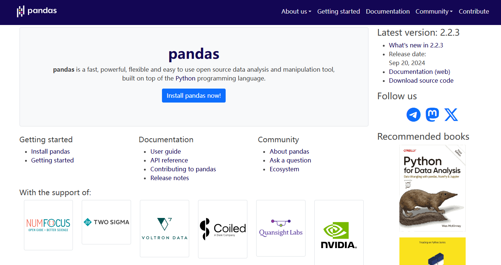

[toc]

# Python的Pandas数据分析库笔记

Pandas 是一个强大的 Python 库，主要用于数据处理和分析。它为 Python 提供了高效、灵活、便捷的数据结构和操作工具，特别适合处理表格数据（例如：Excel、CSV 文件、SQL 数据库等格式的数据）。

Pandas 名字衍生自术语 "panel data"（面板数据）和 "Python data analysis"（Python 数据分析）。

[Pandas官网 https://pandas.pydata.org](https://pandas.pydata.org/)



> Pandas库的应用场景

- Pandas 可以从各种文件格式比如 CSV、JSON、SQL、Microsoft Excel 导入数据。
- Pandas 可以对各种数据进行运算操作，比如归并、再成形、选择，还有数据清洗和数据加工特征。
- Pandas 广泛应用在学术、金融、统计学等各个数据分析领域。
- 通过与 Matplotlib 和其他可视化工具的集成，Pandas 可以快速生成折线图、柱状图、散点图等常见图表。

## Pandas 安装

```py
# 通过 Python 的包管理工具 pip 安装 Pandas
pip install pandas
```

## Pandas 数据结构 Series

Series 是 Pandas 中的一个核心数据结构，类似于一个一维的数组，具有数据和索引。

Series 可以存储任何类型（整数、浮点数、字符串等）的数据，并通过标签（索引）来访问数据。

如图所示


> Series的特点：
- 一维数组：Series 中的每个元素都有一个对应的索引值。
- 索引： 每个数据元素都可以通过标签（索引）来访问，默认情况下索引是从 0 开始的整数，但你也可以自定义索引。
- 数据类型： Series 可以容纳不同数据类型的元素，包括整数、浮点数、字符串、Python 对象等。
- 大小不变性：Series 的大小在创建后是不变的，但可以通过某些操作（如 append 或 delete）来改变。
- 操作：Series 支持各种操作，如数学运算、统计分析、字符串处理等。
- 缺失数据：Series 可以包含缺失数据，Pandas 使用NaN（Not a Number）来表示缺失或无值。
- 自动对齐：当对多个 Series 进行运算时，Pandas 会自动根据索引对齐数据，这使得数据处理更加高效。

### 创建Series

使用 pd.Series() 构造函数创建一个 Series 对象，传递一个数据数组（可以是列表、NumPy 数组等）和一个可选的索引数组。

```py
# 语法如下
pandas.Series(data=None, index=None, dtype=None, name=None, copy=False, fastpath=False)
```

参数说明：
- data：Series 的数据部分，可以是列表、数组、字典、标量值等类型的数据。如果不提供此参数，则创建一个空的 Series。
- index：Series 的索引部分，用于对数据进行标记。可以是列表、数组、索引对象等。如果不提供此参数，则创建一个默认的整数索引。
- dtype：指定 Series 的数据类型。可以是 NumPy 的数据类型，例如 np.int64、np.float64 等。如果不提供此参数，则自动推断数据类型。
- name：Series 的名称，用于标识 Series 对象。如果提供了此参数，则创建的 Series 对象将具有指定的名称。
- copy：是否复制数据。默认为 False，表示不复制数据。如果设置为 True，则复制输入的数据。
- fastpath：是否启用快速路径。默认为 False。启用快速路径可能会在某些情况下提高性能。


> 示例代码如下

```py
import pandas as pd

# 创建一个Series对象，指定名称为'A'，值分别为1, 2, 3, 4
# 默认索引为0, 1, 2, 3
series = pd.Series([1, 2, 3, 4], name='A')

# 打印Series对象
print(series)
# 根据索引值读取数据
print("访问索引为2的元素："+series[2])

# 输出结果如下
# 0    1
# 1    2
# 2    3
# 3    4
# Name: A, dtype: int64
# 访问索引为2的元素：3

# 如果你想要显式地设置索引，可以这样做：
custom_index = [1, 2, 3, 4]  # 自定义索引
series_with_index = pd.Series([1, 2, 3, 4], index=custom_index, name='B')

# 打印带有自定义索引的Series对象
print(series_with_index)
# 输出结果如下
# 1    1
# 2    2
# 3    3
# 4    4
# Name: B, dtype: int64

```

也可以使用 key-value 等键值对数据，来创建 Series对象。此时键值对数据的key会自动变成Series对象的索引，键值对数据的value会自动变成Series对象的data，

```py
import pandas as pd
sites = {1: "Google", 2: "Runoob", 3: "Wiki"}
myvar = pd.Series(sites,name="C")
print(myvar)
# 输出结果如下
# 1    Google
# 2    Runoob
# 3    Wiki
# Name: C, dtype: object
```

### Series对象的常用方法

下面是 Series 中一些常用的方法:
```py
# index	获取 Series 的索引
# values	获取 Series 的数据部分（返回 NumPy 数组）
# head(n)	返回 Series 的前 n 行（默认为 5）
# tail(n)	返回 Series 的后 n 行（默认为 5）
# dtype	返回 Series 中数据的类型
# shape	返回 Series 的形状（行数）
# describe()	返回 Series 的统计描述（如均值、标准差、最小值等）
# isnull()	返回一个布尔 Series，表示每个元素是否为 NaN
# notnull()	返回一个布尔 Series，表示每个元素是否不是 NaN
# unique()	返回 Series 中的唯一值（去重）
# value_counts()	返回 Series 中每个唯一值的出现次数
# map(func)	将指定函数应用于 Series 中的每个元素
# apply(func)	将指定函数应用于 Series 中的每个元素，常用于自定义操作
# astype(dtype)	将 Series 转换为指定的类型
# sort_values()	对 Series 中的元素进行排序（按值排序）
# sort_index()	对 Series 的索引进行排序
# dropna()	删除 Series 中的缺失值（NaN）
# fillna(value)	填充 Series 中的缺失值（NaN）
# replace(to_replace, value)	替换 Series 中指定的值
# cumsum()	返回 Series 的累计求和
# cumprod()	返回 Series 的累计乘积
# shift(periods)	将 Series 中的元素按指定的步数进行位移
# rank()	返回 Series 中元素的排名
# corr(other)	计算 Series 与另一个 Series 的相关性（皮尔逊相关系数）
# cov(other)	计算 Series 与另一个 Series 的协方差
# to_list()	将 Series 转换为 Python 列表
# to_frame()	将 Series 转换为 DataFrame
# iloc[]	通过位置索引来选择数据
# loc[]	通过标签索引来选择数据

# 示例代码
import pandas as pd

# 创建 Series
data = [1, 2, 3, 4, 5, 6]
index = ['a', 'b', 'c', 'd', 'e', 'f']
s = pd.Series(data, index=index)

# 查看基本信息
print("索引：", s.index)  
print("数据：", s.values)
print("数据类型：", s.dtype)
print("前两行数据：", s.head(2))

# 打印结果如下：
# 索引： Index(['a', 'b', 'c', 'd', 'e', 'f'], dtype='object')
# 数据： [1 2 3 4 5 6]
# 数据类型： int64
# 前两行数据：   a    1
#               b    2
#               dtype: int64

# 使用 map 函数将每个元素加倍
s_doubled = s.map(lambda x: x * 2)
print("元素加倍后：", s_doubled)
# 打印结果如下：
# 元素加倍后： a     2
# b     4
# c     6
# d     8
# e    10
# f    12
# dtype: int64

# 排序
sorted_s = s.sort_values()
print("排序后的 Series：", sorted_s)
# 打印结果如下：
# 排序后的 Series： a    1
# b    2
# c    3
# d    4
# e    5
# f    6
# dtype: int64

```

## Pandas 数据结构 DataFrame

DataFrame 是 Pandas 中的另一个核心数据结构，类似于数据库中的数据表，包含 rows（行） 和 columns（列）。


DataFrame 既有行索引也有列索引，它可以被看做由 多个Series 组成的数据结构（共同用一个索引）。

如图所示：


> DataFrame的特点：

- 索引：DataFrame 可以拥有行索引和列索引，类似于 Excel 中的行号和列标。可以将其视为多个 Series 对象组成的字典。
- 自动对齐：在进行算术运算或数据对齐操作时，DataFrame 会自动对齐索引。
- 处理缺失数据：DataFrame 可以包含缺失数据，Pandas 使用 NaN（Not a Number）来表示缺失数据。
- 高效的数据输入输出：可以方便地读取和写入数据，支持多种格式，如 CSV、Excel、SQL 数据库和 HDF5 格式。

> DataFrame 构造方法

```py
pandas.DataFrame(data=None, index=None, columns=None, dtype=None, copy=False)
```

参数说明：
- data：DataFrame 的数据部分，可以是字典、二维数组、Series、DataFrame 或其他可转换为 DataFrame 的对象。如果不提供此参数，则创建一个空的 DataFrame。
- index：DataFrame 的行索引，用于标识每行数据。可以是列表、数组、索引对象等。如果不提供此参数，则创建一个默认的整数索引。
- columns：DataFrame 的列索引，用于标识每列数据。可以是列表、数组、索引对象等。如果不提供此参数，则创建一个默认的整数索引。
- dtype：指定 DataFrame 的数据类型。如果不提供此参数，则自动推断数据类型。
- copy：是否复制数据。默认为 False，表示不复制数据。如果设置为 True，则复制输入的数据。

### 创建DataFrame

> 使用字典数据创建DataFrame，字典的键成为列名，值成为列数据。

```py
import pandas as pd

# 使用字典数据创建DataFrame
data2 = {'Column1':['Google', 'Runoob', 'Wiki'], 'Column2':[10, 12, 13]}
df2 = pd.DataFrame(data2)
print (df2)
# 输出结果为
#      Column1   Column2
# 0  Google     10
# 1  Runoob     12
# 2    Wiki     13
```

> 使用多个列表数据创建DataFrame,外层列表代表行，内层列表代表列。

```py
import pandas as pd
# 使用列表创建,创建DataFrame
custom_data = [['Google', 10], ['Runoob', 12], ['Wiki', 13]]
# 设置DataFrame的列索引为['Site', 'Age']
df = pd.DataFrame(data=custom_data, columns=['Column1', 'Column2'])
print(df)
# 输出结果为
#      Column1   Column2
# 0  Google     10
# 1  Runoob     12
# 2    Wiki     13
```

> 使用多个字典数据创建DataFrame

```py
import pandas as pd
data = [{'a': 1, 'b': 2},{'a': 5, 'b': 10, 'c': 20}]
df = pd.DataFrame(data)
print (df)
# 输出结果为
#    a   b     c
# 0  1   2   NaN
# 1  5  10  20.0
```

> 使用 Series 创建 DataFrame，通过 pd.Series() 创建。

```py
# 从 Series 创建 DataFrame
s1 = pd.Series(['Alice', 'Bob', 'Charlie'])
s2 = pd.Series([25, 30, 35])
df = pd.DataFrame({'Name': s1, 'Age': s2})

# 输出结果
#    Name   Age
# 0  Alice   25
# 1  Bob     30
# 2  Charlie  35
```

### 部分DataFrame常用方法

```py
# head(n)	返回 DataFrame 的前 n 行数据（默认前 5 行）
# tail(n)	返回 DataFrame 的后 n 行数据（默认后 5 行）
# info()	显示 DataFrame 的简要信息，包括列名、数据类型、非空值数量等
# describe()	返回 DataFrame 数值列的统计信息，如均值、标准差、最小值等
# shape	返回 DataFrame 的行数和列数（行数, 列数）
# columns	返回 DataFrame 的所有列名
# index	返回 DataFrame 的行索引
# dtypes	返回每一列的数值数据类型
# sort_values(by)	按照指定列排序
# sort_index()	按行索引排序
# dropna()	删除含有缺失值（NaN）的行或列
# fillna(value)	用指定的值填充缺失值
# isnull()	判断缺失值，返回一个布尔值 DataFrame
# notnull()	判断非缺失值，返回一个布尔值 DataFrame
# loc[]	    按标签索引选择数据
# iloc[]	按位置索引选择数据
# at[]	访问 DataFrame 中单个元素（比 loc[] 更高效）
# iat[]	访问 DataFrame 中单个元素（比 iloc[] 更高效）
# apply(func)	对 DataFrame 或 Series 应用一个函数
# applymap(func)	对 DataFrame 的每个元素应用函数（仅对 DataFrame）
# groupby(by)	分组操作，用于按某一列分组进行汇总统计
# pivot_table()	创建透视表
# merge()	合并多个 DataFrame（类似 SQL 的 JOIN 操作）
# concat()	按行或按列连接多个 DataFrame
# to_csv()	将 DataFrame 导出为 CSV 文件
# to_excel()	将 DataFrame 导出为 Excel 文件
# to_json()	将 DataFrame 导出为 JSON 格式
# to_sql()	将 DataFrame 导出为 SQL 数据库
# query()	使用 SQL 风格的语法查询 DataFrame
# duplicated()	返回布尔值 DataFrame，指示每行是否是重复的
# drop_duplicates()	删除重复的行
# set_index()	设置 DataFrame 的索引
# reset_index()	重置 DataFrame 的索引
# transpose()	转置 DataFrame（行列交换）
```

> 访问 DataFrame 元素

Pandas 还可以使用 loc 属性返回指定行的数据，如果没有设置索引，默认索引从0开始，以此类推。返回的数据其实就是一个 Pandas Series。

```py
import pandas as pd
data = [{'a': 1, 'b': 2},{'a': 5, 'b': 10, 'c': 20}]
df = pd.DataFrame(data)
print (df)
# 输出结果为
#    a   b     c
# 0  1   2   NaN
# 1  5  10  20.0

# 通过列名访问
print(df['a'])

# 访问单个元素
print(df['a'][0])

# 通过属性访问
print(df.Name)    
   
# 访问第二到第三行（按标签）
print(df.loc[0:1])

# 按索引选择行
print(df.iloc[0:1])  # 选择第二到第三行（按位置）

# 查看前两行数据
print(df.head(2))

```

> 修改 DataFrame 元素

```py
# 可以直接对列进行赋值。
df['Column1'] = [10, 11, 12]

# 也可以直接增加新列
df['NewColumn'] = [100, 200, 300]

# 也可以使用 concat() 方法添加新行
# 创建一个只包含新行的DataFrame
new_row = pd.DataFrame([[4, 7]], columns=['Column1', 'Column2'])  
# 将两个DataFrame进行concat合并
df = pd.concat([df, new_row], ignore_index=True)  
```

> 删除 DataFrame 元素

```py
#  drop 方法删除某一列
df_dropped = df.drop('Column1', axis=1)

# drop 方法删除某一行
df_dropped = df.drop(0)  # 删除索引为 0 的行

```

## Pandas CSV 文件

### CSV文件介绍

CSV 全称为 Comma-Separated Values，逗号分隔值，有时也称为字符分隔值，因为分隔字符也可以不是逗号。

CSV 是一种通用的、相对简单的文件格式。以纯文本形式存储表格数据，每一行代表一条记录，列之间由逗号（或其他分隔符，如制表符）隔开。被用户、商业和科学广泛应用。

> CSV文件的常见特点：
- 结构简单：数据以行和列的形式组织，每行表示一条记录，每列表示记录的一个字段。
- 兼容性好：几乎所有的表格处理软件（如Excel、Google Sheets）、编程语言（如Python、R）都能轻松读取和处理CSV文件。
- 易于编辑：由于其纯文本格式，用户可以使用任何文本编辑器（如Notepad、Sublime Text）查看和编辑CSV文件。

> CSV文件的示例内容如下

```
姓名,年龄,城市
张三,25,北京
李四,30,上海
王五,22,广州
赵六,28,深圳
```


### 处理 CSV 文件

> 读取 CSV 文件 pd.read_csv() 

read_csv() 是从 CSV 文件中读取数据的主要方法，将数据加载为一个 DataFrame。

read_csv() 常用参数如下:
```py
# filepath_or_buffer 必填参数，CSV文件路径或文件对象
# sep	定义字段分隔符，默认是逗号（,） 可以改为其他字符，如制表符（\t）
# header 指定行号作为列标题，默认为 0（表示第一行），或者设置为 None 没有标题
# names	自定义列名，传入列名列表 默认为None
# index_col	用作行索引的列的列号或列名	默认为None
# usecols	读取指定的列，可以是列的名称或列的索引	默认为None
# dtype	强制将列转换为指定的数据类型	默认为None
# skiprows	跳过文件开头的指定行数，或者传入一个行号的列表	默认为None
# nrows	读取前 N 行数据	默认为None
# na_values	指定哪些值应视为缺失值（NaN）	默认为None
# skipfooter 跳过文件结尾的指定行数	默认为0
# encoding	文件的编码格式（如 utf-8，latin1 等） 默认为None
```

```py
import pandas as pd
# 读取 CSV 文件
df = pd.read_csv('nba.csv')
print(df.to_string())
```

> 写入 CSV 文件 df.to_csv() 

to_csv() 是将 DataFrame 写入 CSV 文件的方法，支持自定义分隔符、列名、是否包含索引等设置。

to_csv() 常用参数如下:
```py
# path_or_buffer CSV 文件的路径或文件对象 必需参数
# sep	定义字段分隔符，默认是逗号（,），可以改为其他字符，如制表符（\t）
# index	是否写入行索引，默认 True 表示写入索引
# columns	指定写入的列，可以是列的名称列表	默认为None
# header	是否写入列名，默认 True 表示写入列名，设置为 False 表示不写列名	默认为None
# mode	写入文件的模式，默认是 w（写模式），可以设置为 a（追加模式）	'w'
# encoding	文件的编码格式，如 utf-8，latin1 等	默认为None
# line_terminator	定义行结束符，默认为 \n	默认为None
# quoting	设置如何对文件中的数据进行引号处理（0-3，具体引用方式可查文档）	默认为None
# quotechar	设置用于引用的字符，默认为双引号 "	'"'
# date_format	自定义日期格式，如果列包含日期数据，则可以使用此参数指定日期格式 默认为None
```

示例代码
```py
import pandas as pd 
   
# 三个字段 name, site, age
nme = ["Google", "Runoob", "Taobao", "Wiki"]
st = ["www.google.com", "www.runoob.com", "www.taobao.com", "www.wikipedia.org"]
ag = [90, 40, 80, 98]
   
# 字典
dict = {'name': nme, 'site': st, 'age': ag} 
# 将字典转换为DataFrame数据
df = pd.DataFrame(dict)
# 保存 dataframe 到CSV文件中
df.to_csv('aaa.csv')


```

### 操作 CSV 文件中的数据

> head( n ) 读取前面的 n 行数据,默认返回5行数据

```py
import pandas as pd
df = pd.read_csv('aaa.csv')
# 返回前5行数据
print(df.head())
# 返回前100行数据
print(df.head(100))
```

> tail( n ) 方法用于读取尾部的n行数据。默认返回 5 行，空行各个字段的值返回 NaN。

```py
import pandas as pd
df = pd.read_csv('aaa.csv')
# 返回后5行数据
print(df.tail())
# 返回后100行数据
print(df.tail(100))
```

## Pandas JSON 文件

Pandas 提供了强大的方法来处理 JSON 格式的数据，支持从 JSON 文件或字符串中读取数据并将其转换为 DataFrame，以及将 DataFrame 转换回 JSON 格式。

### 从 JSON 文件/字符串加载数据

> pd.read_json() 读取 JSON 数据

read_json() 用于从 JSON 格式的数据中读取并加载为一个 DataFrame。它支持从 JSON 文件、JSON 字符串或 JSON 网址中加载数据。

```py
import pandas as pd
# read_json() 语法格式如下
df = pd.read_json(
    path_or_buffer,      # JSON 文件路径、JSON 字符串或 URL
    orient=None,         # JSON 文件中数据的结构方式，默认是 'columns'
    dtype=None,          # 强制指定列的数据类型
    convert_axes=True,   # 是否转换行列索引 默认为True
    convert_dates=True,  # 是否将日期解析为日期类型 默认为True
    keep_default_na=True # 是否保留默认的缺失值标记（如 NaN） 默认为True
)
```

orient参数 是指定 JSON 文件中的数据格式方式。常见值有 split、records、index、columns、values。会根据文件自动推断。


> 示例代码

```py
import pandas as pd
# 根据普通json数据转换为DataFrame
data =[
    {
      "id": "A001",
      "name": "aaaa",
      "url": "www.aaaa.com",
      "likes": 61
    }
]
df = pd.DataFrame(data)
print(df)
# 输出结果如下
#      id    name   url     likes
# 0  A001    aaaa  www.aaaa.com     61


# 将字典格式的json数据转换为DataFrame
s = {
    "col1":{"row1":1,"row2":2,"row3":3},
    "col2":{"row1":"x","row2":"y","row3":"z"}
}
# 读取 JSON 转为 DataFrame                                                                                          
df = pd.DataFrame(s)
print(df)
# 输出结果如下
#       col1 col2
# row1     1    x
# row2     2    y
# row3     3    z

# 从 URL 中读取 JSON 数据
URL = 'https://static.jyshare.com/download/sites.json'
df = pd.read_json(URL)
print(df)


# 从 JSON 字符串加载数据
# JSON 字符串
json_data = '''
[
  {"Name": "Alice", "Age": 25, "City": "New York"},
  {"Name": "Bob", "Age": 30, "City": "Los Angeles"},
  {"Name": "Charlie", "Age": 35, "City": "Chicago"}
]
'''
df = pd.read_json(json_data)
print(df)

```

## Pandas 数据清洗

数据清洗是对一些没有用的数据进行处理的过程。

很多数据集存在数据缺失、数据格式错误、错误数据或重复数据的情况，如果要使数据分析更加准确，就需要对这些没有用的数据进行处理。

数据清洗的常用方式如下：
- 缺失值处理：识别并填补缺失值，或删除含缺失值的行/列。
- 重复数据处理：检查并删除重复数据，确保每条数据唯一。
- 异常值处理：识别并处理异常值，如极端值、错误值。
- 数据格式转换：转换数据类型或进行单位转换，如日期格式转换。
- 标准化与归一化：对数值型数据进行标准化（如 Z-score）或归一化（如 Min-Max）。
- 文本处理：对文本数据进行清洗，如去除停用词、词干化、分词等。
- 数据抽样：从数据集中抽取样本，或通过过采样/欠采样处理类别不平衡。

### 清洗空值

如果我们要删除包含空字段的行，可以使用 dropna() 方法，语法格式如下：

```py
DataFrame.dropna(axis=0, how='any', thresh=None, subset=None, inplace=False)

# 参数说明
# axis：默认为 0，表示逢空值剔除整行，如果设置参数 axis＝1 表示逢空值去掉整列。
# how：默认为 'any' 如果一行（或一列）里任何一个数据有出现 NA 就去掉整行，如果设置 how='all' 一行（或列）都是 NA 才去掉这整行。
# thresh：设置需要多少非空值的数据才可以保留下来的。
# subset：设置想要检查的列。如果是多个列，可以使用列名的 list 作为参数。
# inplace：如果设置 True，将计算得到的值直接覆盖之前的值并返回 None，修改的是源数据。


import pandas as pd
# 读取csv文件中的数据，转换为DataFrame对象
df = pd.read_csv('property-data.csv')
# 清洗空值，返回一个新的 DataFrame
new_df = df.dropna()
print(new_df.to_string())

```

### 清洗重复数据

如果我们要清洗重复数据，可以使用 duplicated() 和 drop_duplicates() 方法。

- duplicated()可用判断数据是否重复。会返回 True，否则返回 False。
- 删除重复数据，可以直接使用drop_duplicates() 方法

```py
import pandas as pd
person = {
  "name": ['Google', 'Runoob', 'Runoob', 'Taobao'],
  "age": [50, 40, 40, 23]  
}

# 判断重复数据
df = pd.DataFrame(person)
print(df.duplicated())
# 输出结果
# 0    False
# 1    False
# 2     True
# 3    False
# dtype: bool

# 删除重复数据
df.drop_duplicates(inplace = True)
print(df)
```

### 数据清洗与预处理的常见方法

- 使用指定的值（如均值、中位数、众数等）填充缺失值。	df.fillna(value)
- 删除包含缺失值的行或列。	df.dropna()
- 删除重复数据	df.drop_duplicates()
- 将数据类型从一个类型转换为另一个类型。 df.astype()
- 日期时间格式转换（转换字符串或数字为日期时间类型） pd.to_datetime()
- 数据抽样（随机抽样，从数据中随机抽取一定比例的样本）	df.sample()
- 数据合并与连接（合并数据，将多个 DataFrame 按照某些列合并在一起）	pd.merge()
- 连接数据（将多个 DataFrame 进行行或列拼接）	pd.concat()
- 数据类型转换与处理（字符串处理，对字符串数据进行处理，如去除空格、转换大小写等）	str.replace() 、 str.upper() 等
- 分组计算（按照某个特征分组后进行聚合计算）	df.groupby()
- 数据转换与映射（数据映射与替换，将数据中的某些值替换为其他值）	df.replace()


## Pandas 常用函数及使用实例

### 读取数据

- pd.read_csv(filename)	读取 CSV 文件；
- pd.read_excel(filename)	读取 Excel 文件；
- pd.read_sql(query, connection_object)	从 SQL 数据库读取数据；
- pd.read_json(json_string)	从 JSON 字符串中读取数据；
- pd.read_html(url)	从 HTML 页面中读取数据。

```py
import pandas as pd
# 从 CSV 文件中读取数据
df = pd.read_csv('data.csv')
# 从 Excel 文件中读取数据
df = pd.read_excel('data.xlsx')
# 从 SQL 数据库中读取数据
import sqlite3
conn = sqlite3.connect('database.db')
df = pd.read_sql('SELECT * FROM table_name', conn)
# 从 JSON 字符串中读取数据
json_string = '{"name": "John", "age": 30, "city": "New York"}'
df = pd.read_json(json_string)
# 从 HTML 页面中读取数据
url = 'https://www.runoob.com'
dfs = pd.read_html(url)
df = dfs[0] # 选择第一个数据框
```

### 查看数据

- df.head(n)	显示前 n 行数据；
- df.tail(n)	显示后 n 行数据；
- df.info()	显示数据的信息，包括列名、数据类型、缺失值等；
- df.describe()	显示数据的基本统计信息，包括均值、方差、最大值、最小值等；
- df.shape	显示数据的行数和列数。

```py
import pandas as pd
data = [
    {"name": "Google", "likes": 25, "url": "https://www.google.com"},
    {"name": "Runoob", "likes": 30, "url": "https://www.runoob.com"},
    {"name": "Taobao", "likes": 35, "url": "https://www.taobao.com"}
]
df = pd.DataFrame(data)

# 显示前五行数据
df.head()
# 显示后五行数据
df.tail()
# 显示数据信息
df.info()
# 显示基本统计信息
df.describe()
# 显示数据的行数和列数
df.shape
```

### 数据清洗

- df.dropna()	删除包含缺失值的行或列；
- df.fillna(value)	将缺失值替换为指定的值；
- df.replace(old_value, new_value)	将指定值替换为新值；
- df.duplicated()	检查是否有重复的数据；
- df.drop_duplicates()	删除重复的数据。

```py
# 删除包含缺失值的行或列
df.dropna()
# 将缺失值替换为指定的值
df.fillna(0)
# 将指定值替换为新值
df.replace('old_value', 'new_value')
# 检查是否有重复的数据
df.duplicated()
# 删除重复的数据
df.drop_duplicates()
```

### 数据选择和切片

- df[column_name]	选择指定的列；
- df.loc[row_index, column_name]	通过标签选择数据；
- df.iloc[row_index, column_index]	通过位置选择数据；
- df.ix[row_index, column_name]	通过标签或位置选择数据；
- df.filter(items=[column_name1, column_name2])	选择指定的列；
- df.filter(regex='regex')	选择列名匹配正则表达式的列；
- df.sample(n)	随机选择 n 行数据。

```py
# 选择指定的列
df['column_name']
# 通过标签选择数据
df.loc[row_index, column_name]
# 通过位置选择数据
df.iloc[row_index, column_index]
# 通过标签或位置选择数据
df.ix[row_index, column_name]
# 选择指定的列
df.filter(items=['column_name1', 'column_name2'])
# 选择列名匹配正则表达式的列
df.filter(regex='regex')
# 随机选择 n 行数据
df.sample(n=5)
```

### 数据排序

- df.sort_values(column_name)	按照指定列的值排序；
- df.sort_values([column_name1, column_name2], ascending=[True, False])	按照多个列的值排序；
- df.sort_index()	按照索引排序。

```py
# 按照指定列的值排序
df.sort_values('column_name')
# 按照多个列的值排序
df.sort_values(['column_name1', 'column_name2'], ascending=[True, False])
# 按照索引排序
df.sort_index()
```

### 数据分组和聚合

- df.groupby(column_name)	按照指定列进行分组；
- df.aggregate(function_name)	对分组后的数据进行聚合操作；
- df.pivot_table(values, index, columns, aggfunc)	生成透视表。

```py
# 按照指定列进行分组
df.groupby('column_name')
# 对分组后的数据进行聚合操作
df.aggregate('function_name')
# 生成透视表
df.pivot_table(values='value', index='index_column', columns='column_name', aggfunc='function_name')
```

### 数据合并

- pd.concat([df1, df2])	将多个数据框按照行或列进行合并；
- pd.merge(df1, df2, on=column_name)	按照指定列将两个数据框进行合并。

```py
# 将多个数据框按照行或列进行合并
df = pd.concat([df1, df2])
# 按照指定列将两个数据框进行合并
df = pd.merge(df1, df2, on='column_name')
```

### 数据选择和过滤

- df.loc[row_indexer, column_indexer]	按标签选择行和列。
- df.iloc[row_indexer, column_indexer]	按位置选择行和列。
- df[df['column_name'] > value]	选择列中满足条件的行。
- df.query('column_name > value')	使用字符串表达式选择列中满足条件的行。

### 数据统计和描述

- df.describe()	计算基本统计信息，如均值、标准差、最小值、最大值等。
- df.mean()	计算每列的平均值。
- df.median()	计算每列的中位数。
- df.mode()	计算每列的众数。
- df.count()	计算每列非缺失值的数量。


## Pandas 数据可视化

Pandas 提供了与 Matplotlib 和 Seaborn 等可视化库的集成，使得数据的可视化变得简单而高效。

在 Pandas 中，数据可视化功能主要通过 DataFrame.plot() 和 Series.plot() 方法实现，这些方法实际上是对 Matplotlib 库的封装，简化了图表的绘制过程。

> plot() 方法

plot() 方法参数说明：
- kind	图表类型，支持 'line', 'bar', 'barh', 'hist', 'box', 'kde', 'density', 'area', 'pie' 等类型
- x	设置 x 轴的数据列
- y	设置 y 轴的数据列
- title	图表的标题
- xlabel	x 轴的标签
- ylabel	y 轴的标签
- color	设置图表的颜色
- figsize	设置图表的大小（宽, 高）
- legend	是否显示图例

> 常用的图标类型

- 折线图	用于显示随时间变化的数据趋势	    df.plot(kind='line')
- 柱状图	用于显示类别之间的比较数据	      df.plot(kind='bar')
- 水平柱状图	与柱状图类似，但柱子是水平的	df.plot(kind='barh')
- 直方图	用于显示数据的分布（频率分布）	  df.plot(kind='hist')
- 散点图	用于显示两个数值变量之间的关系	  df.plot(kind='scatter', x='col1', y='col2')
- 箱线图	用于显示数据的分布、异常值及四分位数	df.plot(kind='box')
- 密度图	用于显示数据的密度分布	            df.plot(kind='kde')
- 饼图	用于显示各部分占总体的比例	          df.plot(kind='pie')
- 区域图	用于显示累计数值的图表（类似于折线图，但填充了颜色）	df.plot(kind='area')
