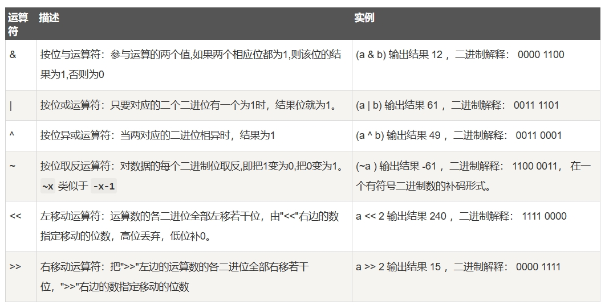

[toc]

# Python笔记1

此笔记初次更新于2021-03-30。现在对该笔记进行重新编写。

目前此笔记中的Python版本为3.12.3

## Python简介

Python 是由 Guido van Rossum 在八十年代末和九十年代初，在荷兰国家数学和计算机科学研究所设计出来的。

Python 2.0 于 2000 年 10 月 16 日发布，增加了实现完整的垃圾回收，并且支持 Unicode。

Python 3.0 于 2008 年 12 月 3 日发布，3.0版不完全兼容之前的 Python 源代码。不过，很多新特性后来也被移植到旧的Python 2.6/2.7版本。

Python 是一种解释型语言，这意味着开发过程中没有了编译这个环节。类似于PHP和JS语言。同样 Python 也是面向对象语言,这意味着Python支持面向对象的风格或代码封装在对象的编程技术。

> Python的特点

- 易于学习，易于阅读，易于维护
- 广泛的标准库：Python的最大的优势之一是丰富的库，跨平台的，在UNIX，Windows兼容很好。
- 可移植，可扩展，可嵌入。
- GUI编程：Python支持GUI可以创建和移植到许多系统调用。
- 3D建模绘图：Python作为建模工具与GUI语言的开源3D绘图软件Blender 
- Inkscape - 一个开源的SVG矢量图形编辑器。

## Python安装

### window环境安装Python

1. 访问python官方。[python官方网站](https://www.python.org/)
2. 下载window安装包，运行即可。
3. 注意在安装过程中，记得勾选 `Add python.exe to PATH。`

<font color="red">Add python.exe to PATH 是把python添加到环境变量中。</font>

### vscode 搭配 Python

我们可以通过vscode来编写Python的代码。

1. 在vscode的插件市场中下载python插件。
2. 创建demo1.py文件，并编写python代码。

```python
# 代码如下
print("welcome python")
```

3. 右键运行即可。


或者我们可以直接在命令行终端中通过命令来运行demo1.py文件。


### Python终端（Python交互式解释器）

当你安装好Python后，也同样好安装了Python终端。Python终端可以在不创建脚本文件的情况下直接执行Python代码。

window系统进入Python终端的方法。
1. 直接打开CMD命令行窗口
2. 输入Python即可。

如图进入到Python终端，并执行了打印命令。


## 基础语法

### 变量

1. 在 Python 中，变量就是变量，它没有类型，我们所说的"类型"是变量所指的内存中对象的类型。
1. Python 中的变量不需要声明，每个变量在使用前都必须赋值，变量赋值以后该变量才会被创建。
2. Python可以把任意数据类型赋值给变量，同一个变量可以被反复赋值，而且可以是不同类型的变量。类似于JS
3. 等号（=）用来给变量赋值。等号（=）运算符左边是一个变量名,等号（=）运算符右边是存储在变量中的值。
4. Python允许你同时为多个变量赋值。

```python
counter = 100          # 整型变量
miles   = 1000.0       # 浮点型变量
name    = "runoob"     # 字符串

a = b = c = 1       # 同时对变量a,b,c 赋值 1
a, b, c = 1, 2, "runoob"  # 分别为变量a,b,c 赋值 1, 2, "runoob"
```

> 标识符

标识符就是变量的名称。

1. 标识符可以由字母、数字和下划线组成。并且第一个字符必须是字母或下划线_
2. Python的标识符对大小写敏感。

> 关键字

Python中有些关键字不能当作标识符。

Python的标准库提供了一个 keyword 模块，可以查询当前版本的所有关键字

```python
>>> import keyword
>>> keyword.kwlist
['False', 'None', 'True', 'and', 'as', 'assert', 'break', 'class', 'continue', 'def', 'del', 'elif', 'else', 'except', 'finally', 'for', 'from', 'global', 'if', 'import', 'in', 'is', 'lambda', 'nonlocal', 'not', 'or', 'pass', 'raise', 'return', 'try', 'while', 'with', 'yield']
```

### 注释

在 Python3 中，注释不会影响程序的执行，但是会使代码更易于阅读和理解。

1. Python 中单行注释以 `# `开头
2. 多行注释可以用多个 `#` 号，或者 ''' 和 """ （三个单引号 ''' 或三个双引号 """ 包围的文本块）

```python
# 这是一个单行注释
# 这是一个单行注释

'''
这是多行注释，用三个单引号
这是多行注释，用三个单引号 
这是多行注释，用三个单引号
'''
 
"""
这是多行注释，用三个双引号
这是多行注释，用三个双引号 
这是多行注释，用三个双引号
"""

print ("Hello, Python!")
```

上面代码的输出结果：`Hello, Python!`。


### 行与缩进

python最具特色的就是使用缩进来表示代码块，不需要使用大括号 {} 。

1. 同一个代码块的语句必须包含相同的缩进空格数。
2. 如果最后一行语句缩进数的空格数不一致，会导致程序运行错误.

```python
if True:
    print ("Answer")
    print ("True")
else:
    print ("Answer")
  print ("False")    # 这里的缩进不一致，会导致运行错误
```

### 拼接和分割多行语句

1. 如果一条语句很长，可以使用反斜杠 \ 来实现多行语句。
2. 使用分号(;)分割多条语句。
3. 在 [], {}, 或 () 中的多行语句，不需要使用反斜杠 \。

```python
# \ 来拼接多行语句
total = item_one + \
        item_two + \
        item_three

# 使用分号，分割语句
import sys; x = 'runoob'; sys.stdout.write(x + '\n')

# 特殊的多行语句，无需\来拼接
total = ['item_one', 'item_two', 'item_three',
        'item_four', 'item_five']
object = {1,2,3,
            4}
```


### print 输出

print默认是换行输出的，如果要实现不换行需要在变量末尾加上 `end=""`

```python
x="a"
y="b"
# 换行输出
print( x )
print( y )
 
print('---------')
# 不换行输出
print( x, end=" " )
print( y, end=" " )
```

执行结果如下
```
a
b
---------
a b
```

### import 与 from...import 导入模块

在 python 中可以用 import 或者 from...import 来导入相应的模块。

- 例如将整个模块(somemodule)导入，格式为： `import somemodule`
- 例如从某个模块中导入某个函数,格式为： `from somemodule import somefunction`
- 例如从某个模块中导入多个函数,格式为： `from somemodule import firstfunc, secondfunc, thirdfunc`
- 例如将某个模块中的全部函数导入，格式为： `from somemodule import *`

```python
import sys                  # 完整导入sys模块
from sys import argv,path  #  导入sys模块的argv,path函数
```

### end关键字

关键字end可以用于将结果输出到同一行，或者在输出结果的末尾添加不同的字符。

```python
a, b = 0, 1
while b < 1000:
    print(b, end=',')
    a, b = b, a+b

#=========输出结果如下
1,1,2,3,5,8,13,21,34,55,89,144,233,377,610,987,
```

### del语句

可以用 del 语句从列表中删除一个元素，或清空整个列表

```python
# 设置变量a,并赋值
a=[-1,1,66.25,333,333,1234.5]
# 删除数组的第一个元素
del a[0]
# 打印变量a
print(a)

# 输入结果是 [1, 66.25, 333, 333, 1234.5]

del a[2:4]   # 删除第3-4个元素
print(a)
# 输入结果是[1, 66.25, 1234.5]

del a[:]
print(a)
# 输入结果是 []

### 也可以用 del 删除实体变量
del a
```

## 基本数据类型

在 Python 中，变量就是变量，它没有类型，我们所说的"类型"是变量所指的内存中对象的类型。

```python
counter = 100          # 整型变量
miles   = 1000.0       # 浮点型变量
name    = "runoob"     # 字符串类型变量
```

Python3 中的基本数据类型如下：
- Number（数字）    不可变
- String（字符串）  不可变
- bool（布尔类型） 
- List（列表）      可变
- Tuple（元组）     不可变
- Set（集合）       可变
- Dictionary（字典）可变

### Number 数字类型

Python 数字数据类型用于存储数值。

数据类型本身是不允许改变的，这就意味着如果改变数字数据类型的值，将重新分配内存空间。

Python 支持三种不同的数值类型。
- 整型(int) ：通常被称为是整型或整数，是正或负整数，不带小数点。
- 浮点型(float) ： 浮点型由整数部分与小数部分组成。
- 复数(complex) : 复数由实数部分和虚数部分构成，可以用a + bj,或者complex(a,b)表示，复数的实部a和虚部b都是浮点型。

```python
# 给变量a,b,c,d分别赋值
a, b, c, d = 20, 5.5, True, 4+3j
print(type(a), type(b), type(c), type(d))

# 输出结果如下
# <class 'int'> <class 'float'> <class 'bool'> <class 'complex'>
```

> 数字类型强制转换

- int(x) 将x转换为一个整数。
- float(x) 将x转换到一个浮点数。
- complex(x) 将x转换到一个复数，实数部分为 x，虚数部分为 0。
- complex(x, y) 将 x 和 y 转换为一个复数。实数部分为 x，虚数部分为 y。

> 算术运算符


> 数学常量

```python
# 数学常量 pi（圆周率，一般以π来表示）
pi	
# 数学常量 e，e即自然常数（自然常数）。
e	
```

> 数学函数

```python
# 返回数字的绝对值，如abs(-10) 返回 10
abs(x)	
# 返回数字的上入整数，如math.ceil(4.1) 返回 5
ceil(x)	
# 以浮点数形式返回数字的绝对值，如math.fabs(-10) 返回10.0
fabs(x)	
# 返回数字的下舍整数，如math.floor(4.9)返回 4
floor(x)	
# 如math.log(math.e)返回1.0,math.log(100,10)返回2.0
log(x)
# 返回以10为基数的x的对数，如math.log10(100)返回 2.0
log10(x)	
# 返回给定参数的最大值，参数可以为序列。
max(x1, x2,...)	
# 返回给定参数的最小值，参数可以为序列。
min(x1, x2,...)	
# 返回x的整数部分与小数部分，两部分的数值符号与x相同，整数部分以浮点型表示。
modf(x)	
# x**y 运算后的值。
pow(x, y)	
# 返回浮点数 x 的四舍五入值，如给出 n 值，则代表舍入到小数点后的位数。
# 其实准确的说是保留值将保留到离上一位更近的一端。
round(x [,n])	
# 返回数字x的平方根。
sqrt(x)	

# 返回x的反余弦弧度值。
acos(x)	
# 返回x的反正弦弧度值。
asin(x)	
# 返回x的反正切弧度值。
atan(x)	
# 返回给定的 X 及 Y 坐标值的反正切值。
atan2(y, x)	
# 返回x的弧度的余弦值。
cos(x)	
# 返回欧几里德范数 sqrt(x*x + y*y)。
hypot(x, y)	
# 返回的x弧度的正弦值。
sin(x)	
# 返回x弧度的正切值。
tan(x)	
# 将弧度转换为角度,如degrees(math.pi/2) ， 返回90.0
degrees(x)	
# 将角度转换为弧度
radians(x)	

```

> 随机数函数

```python
# 从序列的元素中随机挑选一个元素，比如random.choice(range(10))，从0到9中随机挑选一个整数。
choice(seq)	
# 从指定范围内，按指定基数递增的集合中获取一个随机数，基数默认值为 1
randrange ([start,] stop [,step])	
# 随机生成下一个实数，它在[0,1)范围内。
random()	
# 改变随机数生成器的种子seed。
seed([x])	
# 将序列的所有元素随机排序
shuffle(lst)	
# 随机生成下一个实数，它在[x,y]范围内。
uniform(x, y)	
```


### String字符串类型

字符串是 Python 中最常用的数据类型。

Python中的字符串需要用单引号 ' 或双引号 " 括起来，也可以在字符串中使用特殊字符。

```python
str = 'Python'       # 定义一个字符串变量str
print(str)           # 输出Python
print(str[0])        # 输出P
```

另外，String字符串类型是不可变数据。字符串变量一旦被赋值了，便无法再次改变该字符串变量指向的字符串的内容了。

<font color="red">例如，对字符串的一个索引位置赋值，比如str[0] = 'm'会导致错误。</font>

> 用法1：len() 会返回字符串长度

```python
# python终端
# len() 返回字符串长度
>>> len('ABC')
3
>>> len('中文')
2
```

> 用法2：字符串截取

```python
# 字符串的截取的语法格式如下
# 字符串的截取从头下标开始，不包含尾下标
字符串变量[头下标:尾下标]
```


```python
str = 'Runoob'

print (str)          # 输出字符串
print (str[0:-1])    # 输出第一个到倒数第二个的所有字符，-1 为从末尾的开始位置
print (str[0])       # 输出字符串第一个字符
print (str[2:5])     # 输出从第三个开始到第五个的字符
print (str[2:])      # 输出从第三个开始的后的所有字符
print (str * 2)      # * 表示复制当前字符串
print (str + "TEST") # 加号 + 是字符串的连接符

#-------------执行结果如下
Runoob
Runoo
R
noo
noob
RunoobRunoob
RunoobTEST
```

> 用法3：特殊字符

如果需要在字符中使用特殊字符时，Python 使用反斜杠 `\` 来转义特殊字符。

如果你不想让反斜杠发生转义，可以在字符串前面添加一个 r，表示原始字符串。

```python
# python终端

# \(在行尾时) 表示续行符
>>> print("line1 \
... line2 \
... line3")
line1 line2 line3

# \\ 反斜杠符号
>>> print("\\")
\
# \' 单引号
>>> print('\'')
'
# \" 双引号
>>> print("\"")
"
# \n 表示换行
>>> print('Ru\noob')
Ru
oob
# r 表示原始字符串
print(r'Ru\noob')
Ru\noob
```

> 字符串运算符


> f-string

f-string 是 python3.6 之后版本添加的语法，称之为格式化字符串。

f-string 格式化字符串以 f 开头，后面跟着字符串，字符串中的表达式用大括号 {} 包起来，它会将变量或表达式计算后的值替换进字符串中。

```python
# python终端
>>> name = 'Runoob'
>>> f'Hello {name}'  # 替换变量
'Hello Runoob'
>>> f'{1+2}'         # 使用表达式
'3'

>>> w = {'name': 'Runoob', 'url': 'www.runoob.com'}
>>> f'{w["name"]}: {w["url"]}'
'Runoob: www.runoob.com'
```

> 三重引号

在Python中，可以使用三重引号（""" """）来创建多行字符串。这种语法允许您在三重引号之间书写多行文本，包括换行符和其他特殊字符，而无需使用转义字符。

这个形式是以三重引号开始（单引号和双引号都可以），并紧跟任意行数的文本，以开始时同样的三重引号结尾。

```py
# 用三重引号来定义SQL字符串
sql = """
INSERT INTO t_user_watch_info(
name,pwd,idCard,video_path,remark) 
VALUES(?,?,?,?,?);
"""
print(sql)

multi_line_string = """
这是一个
多行字符串的
示例。
它可以包含换行符和特殊字符。
"""
print(multi_line_string)

```

另外，三重引号的另一个常见用途是创建函数的文档注释，这对于编写函数的说明和文档非常有帮助。

### bool 布尔类型

在 Python 中，True 和 False 都是关键字，表示布尔值。其中True代表1，False代表0。

> bool类型的特点
1. 布尔类型可以和其他数据类型进行比较，比如数字、字符串等。在比较时True 视为 1，False 视为 0。
3. 布尔类型可以和逻辑运算符一起使用，包括 and、or 和 not。这些运算符可以用来组合多个布尔表达式，生成一个新的布尔值。
4. 布尔类型也可以被转换成其他数据类型，比如整数、浮点数和字符串。在转换时，True 会被转换成 1，False 会被转换成 0。

```python
a = True
b = False

# 比较运算符
print(2 < 3)   # True
print(2 == 3)  # False

# 逻辑运算符
print(a and b)  # False
print(a or b)   # True
print(not a)    # False

# 类型转换
print(int(a))   # 1
print(float(b)) # 0.0
print(str(a))   # "True"
```

<font color="red">
注意: 在 Python 中，所有非零的数字和非空的字符串、列表、元组等数据类型都被视为 True。只有 0、空字符串、空列表、空元组等被视为 False。
</font>


### list 列表类型 

List（列表） 是 Python 中使用最频繁的数据类型。
- List（列表）是写在方括号 [ ] 之间、元素之间用逗号分隔开的列表。
- List（列表）中元素的类型可以不相同，它支持数字，字符串甚至可以是子列表。
- List（列表）同样可以被索引和截取，列表被截取后返回一个包含所需元素的新列表。
- List（列表）中的元素是可以改变的。

```python
list1 = ['Google', 'Runoob', 1997, 2000]
list2 = [1, 2, 3, 4, 5 ]
list3 = ["a", "b", "c", "d"]
list4 = ['red', 'green', 'blue', 'yellow', 'white', 'black']
```

> 用法1 列表元素获取与截取

```python
# 列表元素获取格式
列表变量[下标]

# 列表截取格式
列表变量[头下标:尾下标]
```

下标的索引值以 0 为开始值，-1 为从末尾的开始位置。


```python
# 定义一个列表
list = [ 'abcd', 786 , 2.23, 'runoob', 70.2 ]

print (list)            # 打印整个列表
print (list[0])         # 打印列表的第一个元素
print (list[-1])         # 打印列表的最后一个元素
print (list[1:3])       # 打印列表第二到第三个元素（不包含第三个元素）
print (list[2:])        # 打印列表从第三个元素开始到末尾
print (list * 2)    # 打印tinylist列表两次
print (list + list)  # 打印两个列表拼接在一起的结果

# 替换列表中指定索引的元素
list[1] = 'Sarah'

# 通过append方法来追加元素到列表末尾
list.append('Adam')  
# 通过insert方法来把元素插入到指定的位置
list.insert(1, 'Jack')
# 用pop()方法，删除列表末尾的元素
list.pop()
#删除指定位置的元素，用pop(i)方法
list.pop(1)

# 列表中可以包含另一个列表
new_list = ['python', 'java', ['asp', 'php'], 'scheme']
print(new_list[2][1])

```

> 用法2 列表函数和列表方法

```python
# 列表元素个数
len(list)
# 返回列表元素最大值
max(list)
# 返回列表元素最小值
min(list)
# 将元组转换为列表
list(seq)

# 在列表末尾添加新的对象
list.append(obj)
# 统计某个元素在列表中出现的次数
list.count(obj)
# 在列表末尾一次性追加另一个序列中的多个值（用新列表扩展原来的列表）
list.extend(seq)
# 从列表中找出某个值第一个匹配项的索引位置
list.index(obj)
# 将对象插入列表
list.insert(index, obj)
# 移除列表中的一个元素（默认最后一个元素），并且返回该元素的值
list.pop([index=-1])
# 移除列表中某个值的第一个匹配项
list.remove(obj)
# 反向列表中元素
list.reverse()
# 对原列表进行排序
list.sort( key=None, reverse=False)
# 清空列表
list.clear()
# 复制列表
list.copy()
```


### Tuple 元组类型

<font color="red">元组即元素的组合。</font>

<font color="red">元组是写在方括号( )之间、用逗号分隔开的不能修改元素列表。简而言之元组就是一旦初始化就不能修改的列表。</font>


- 元组可以被索引，也可以进行截取。
- 元组的不可变指的是元素指向的地址不可变，而不是元素的值不可变。例如元组的元素可以是列表,那么该列表中的元素就可以改变。
- 创建只有一个元素的元组，需要注意在元素后面添加一个逗号，以区分它是一个元组而不是一个普通的值。
- 元组一旦初始化后是不允许被删除的，但可以使用del语句来删除整个元组。

> 元组索引和截取

元组也是一个序列，所以可以访问元组中的指定位置的元素，也可以截取索引中的一段元素。


```python
# python终端

tuple = ( 'abcd', 786 , 2.23, 'runoob', 70.2  )
tuple2 = "a", "b", "c", "d"   #  不需要括号也可以
tuple3 = (123, 'runoob')

print (tuple)             # 输出完整元组
print (tuple[0])          # 输出元组的第一个元素
print (tuple[1:3])        # 输出从第二个元素开始到第三个元素
print (tuple[2:])         # 输出从第三个元素开始的所有元素
print (tuple3 * 2)          # 输出两次元组
print (tuple + tuple3)      # 连接两个元组

# 定义0个元素的tuple
a = ()
# 定义1个元素的tuple,需要加上逗号，表示这是一个元素
new_tuple = (1,)

# 元组t的第三个元素的地址没变，但是通过改变值来使元组变化
t = ('a', 'b', ['A', 'B'])
t[2][0] = 'X'
t[2][1] = 'Y'
print(t)            # 输出结果：('a', 'b', ['X', 'Y'])

## 删除元组
tup = ('Google', 'Runoob', 1997, 2000)
del tup

```

> 元组相关函数

```python
# python终端

# len(tuple) 计算元组元素个数。
>>> tuple1 = ('Google', 'Runoob', 'Taobao')
>>> len(tuple1)
3

# max(tuple) 返回元组中元素最大值。
# min(tuple) 返回元组中元素最小值。
>>> tuple2 = ('5', '4', '8')
>>> max(tuple2)
'8'
>>> min(tuple2)
'4'

# tuple(iterable) 将列表转换为元组。
>>> list1= ['Google', 'Taobao', 'Runoob', 'Baidu']
>>> tuple1=tuple(list1)
>>> tuple1
('Google', 'Taobao', 'Runoob', 'Baidu')

```

### set 集合类型

集合（set）是一个无序的不重复元素序列。

- 集合中的元素不会重复，并且可以进行交集、并集、差集等常见的集合操作。
- 可使用 { } 或者 set()构造函数来创建集合。
- 元组中元素的顺序与添加元素到元组的顺序不同。

<font color="red">注意：创建一个空集合必须用 set()构造函数，而不是 {}。因为 {} 是用来创建一个空字典</font>

```python
# 创建集合
sites = {'Google', 'Taobao', 'Runoob', 'Facebook', 'Zhihu', 'Baidu'}
print(sites)   # 输出集合，重复的元素会被自动去掉

# 或者
new_sites = set({'Google','Taobao'})
print(new_sites)
```

> 常用用法如下

```python
# add方法添加元素到集合中
>>> thisset = {"Google", "Runoob", "Taobao"}
>>> thisset.add("Facebook")
>>> print(thisset)
# 注意：集合中元素的顺序与添加顺序不同。
{'Taobao', 'Facebook', 'Google', 'Runoob'}

# update方法更新集合中的元素
>>> site2 = {"Google", "Runoob", "Taobao"}
>>> site2.update([1,4],[5,6])  
>>> print(site2)
{1, 3, 4, 5, 6, 'Google', 'Taobao', 'Runoob'}

# remove移除元素。如果元素不存在，则会发生错误。
>>> site3 = {"Google", "Runoob", "Taobao"}
>>> site3.remove("Taobao")
>>> print(site3)
{'Google', 'Runoob'}

# discard移除元素。如果元素不存在，不会发生错误。
>>> site4 = {"Google", "Runoob", "Taobao"}
>>> site4.discard("Facebook") 
>>> print(site4)
{'Taobao', 'Google', 'Runoob'}

# pop方法随机删除一个元素
#  pop 方法会对集合进行无序的排列，然后将这个无序排列集合的左面第一个元素进行删除。
>>> site5 = {"Google", "Runoob", "Taobao"}
>>> site5.pop()

# len方法计算集合元素个数
>>> site6 = set(("Google", "Runoob", "Taobao"))
>>> len(site6)
3

# clear方法清空集合
>>> site7 = set(("Google", "Runoob", "Taobao"))
>>> site7.clear()

# in 判断元素是否在集合中
site8 = set(("Google", "Runoob", "Taobao"))
if 'Google' in site8 :
    print('Google 在集合中')
else :
    print('Google 不在集合中')

# 集合运算
a = set('abracadabra')
b = set('alacazam')
print(a - b)     # a 和 b 的差集
print(a | b)     # a 和 b 的并集
print(a & b)     # a 和 b 的交集
print(a ^ b)     # a 和 b 中不同时存在的元素

```

更多集合用法，自行百度。

### dictionary 字典类型

字典是一种映射类型，字典用 `{} `标识，它是一个无序的键(key) : 值(value) 的集合。键(key)必须是唯一的。

字典格式：`{key1 : value1, key2 : value2, key3 : value3 }`

- 字典的key必须是不可变对象,即字符串、整数。
- 字典的一个key只能对应一个value。多次对一个key赋值value，后面的值会把前面的值代替。
- 字典也可以用构造函数dict()来初始化。


> 字典常用用法如下

```python
# 创建一个空字典
a = {}

#用构造函数dict()来初始化字典
dict([('Runoob', 1), ('Google', 2), ('Taobao', 3)])
# 输出 {'Runoob': 1, 'Google': 2, 'Taobao': 3}
dict(Runoob=1, Google=2, Taobao=3)
# 输出 {'Runoob': 1, 'Google': 2, 'Taobao': 3}

# 创建一个字典并访问字典的值
d = {'Michael': 95, 'Bob': 75, 'Tracy': 85}
d['Michael']

# 修改字典中的元素
d['Michael'] = 8      # 更新键Michael

# 删除字典元素，可使用del 或 pop方法
dt = {'Name': 'Runoob', 'Age': 7, 'Class': 'First'}
del dt['Name'] # 删除键 'Name'
dt.pop('Name')    # 删除键 'Name'
dt.clear()     # 清空字典
del dt         # 删除整个字典

# 判断key是否在字典中
d = {'Michael': 95, 'Bob': 75, 'Tracy': 85}
print('Thomas' in d) # 输出False
print(d.get('Thomas')) # 输出None

```

> 字典相关函数和方法

```python
# len(dict) 计算字典元素个数，即键的总数。
>>> tinydict = {'Name': 'Runoob', 'Age': 7, 'Class': 'First'}
>>> len(tinydict)
3

# str(dict) 打印字典，以字符串形式。
>>> tinydict = {'Name': 'Runoob', 'Age': 7, 'Class': 'First'}
>>> str(tinydict)
"{'Name': 'Runoob', 'Class': 'First', 'Age': 7}"

# type(variable) 返回输入的变量类型，如果变量是字典就返回字典类型。
>>> tinydict = {'Name': 'Runoob', 'Age': 7, 'Class': 'First'}
>>> type(tinydict)
<class 'dict'>

#用values()方法输出所有值
>>> d = {'Michael': 95, 'Tracy': 85}
>>> d.values()
dict_values([95,85])

#用keys()方法输出所有的key
>>> d = {'Michael': 95, 'Tracy': 85}
>>> d.keys()
dict_keys(['Michael', 'Tracy'])

# 删除字典内所有元素
dict.clear()
# 返回一个字典的浅复制
dict.copy()
# 创建一个新字典，以序列seq中元素做字典的键，val为字典所有键对应的初始值
dict.fromkeys()
# 返回指定键的值，如果键不在字典中返回 default 设置的默认值
dict.get(key, default=None)
# 如果键在字典dict里返回true，否则返回false
key in dict
# 以列表返回一个视图对象
dict.items()
# 和get()类似, 但如果键不存在于字典中，将会添加键并将值设为default
dict.setdefault(key, default=None)
# 把字典dict2的键/值对更新到dict里
dict.update(dict2)
# 返回一个视图对象
dict.values()
# 删除字典 key（键）所对应的值，并返回被删除的值。
dict.pop(key[,default])
# 返回并删除字典中的最后一对键和值。
dict.popitem()

```


### bytes 类型

bytes 类型表示的是不可变的二进制序列。

bytes 类型通常用于处理二进制数据，比如图像文件、音频文件、视频文件等等。在网络编程中，也经常使用 bytes 类型来传输二进制数据。

由于 bytes 类型是不可变的，因此对 bytes 对象进行修改操作时会创建一个新的 bytes 对象。

> 创建 bytes 对象的方式
- 最常见的方式是使用 b 前缀：
- 可以使用 bytes() 函数将其他类型的对象转换为 bytes 类型。bytes() 函数的第一个参数是要转换的对象，第二个参数是编码方式，如果省略第二个参数，则默认使用 UTF-8 编码：

```python
# 创建bytes类型变量
x = bytes("hello", encoding="utf-8")

# 使用b 前缀来创建一个bytes类型变量x
x = b"hello"
```

> bytes 类型常用用法

```python
x = b"hello"
y = x[1:3]          # 切片操作，得到 b"el"
z = x + b"world"    # 拼接操作，得到 b"helloworld"
```

## 数据类型转换

Python 数据类型转换可以分为两种
- 隐式类型转换 : 自动完成，Python 会将较小的数据类型转换为较大的数据类型，以避免数据丢失。
- 显式类型转换 - 强制将某个类型转换成需要的类型。

显示类型转换的例子
```python
# int() 强制转换为整型
x = int(1)   # x 输出结果为 1
y = int(2.8) # y 输出结果为 2
z = int("3") # z 输出结果为 3

# float() 强制转换为浮点型
x = float(1)     # x 输出结果为 1.0
y = float(2.8)   # y 输出结果为 2.8
z = float("3")   # z 输出结果为 3.0
w = float("4.2") # w 输出结果为 4.2

# str() 强制转换为字符串类型
x = str("s1") # x 输出结果为 's1'
y = str(2)    # y 输出结果为 '2'
z = str(3.0)  # z 输出结果为 '3.0'

# type() 输出对象的类型
num_int = 123
num_str = "456"
print(type(num_int)) # 输出 <class 'int'>
print(type(num_str)) # 输出 <class 'str'>

```

更多用法，自行百度。

## 运算符

> 算术运算符


> 比较运算符


> 赋值运算符


> 位运算符

按位运算符是把数字看作二进制来进行计算的。



> 逻辑运算符


> 成员运算符


> 身份运算符


