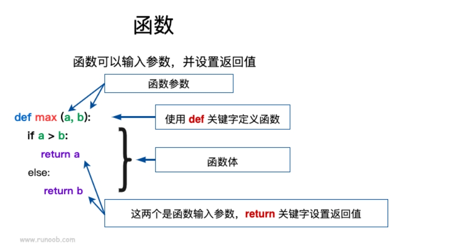

[toc]

# Python笔记2

此笔记初次更新于2021-03-30。现在对该笔记进行重新编写。

目前此笔记中的Python版本为3.12.3

## 条件语句

条件语句是通过表达式的结果（True 或者 False）来决定执行的代码块。

### if 条件语句

Python中if语句的一般形式如下

```python
if condition_1:
    statement_block_1
elif condition_2:
    statement_block_2
else:
    statement_block_3
```

注意：
- 每个条件后面要使用冒号: ,表示接下来是满足条件后要执行的语句块。
- Python 使用缩进来划分语句块，相同缩进数的语句在一起组成一个语句块。
- Python 中用 elif 代替了 else if，所以条件语句的关键字为：if – elif – else

> if嵌套语句

在Python中，可以把 if...elif...else 语句放在另外一个 if...elif...else 语句中。

```python
if 表达式1:
    语句
    if 表达式2:
        语句
    elif 表达式3:
        语句
    else:
        语句
elif 表达式4:
    语句
else:
    语句
```

### match...case 条件语句

Python 3.10 增加了 match...case 的条件语句。

match...case 条件语句，语法格式如下。
```python
# 根据表达式的结果不同，从而指向不同的语句。
# 如果结果没有匹配上，那么会匹配到case _ 这条结果。
match 表达式:
    case 结果1:
        语句
    case 结果2:
        语句
    case 结果3 | 结果4:
        语句
    case _:
       语句
```

- match 后的对象会依次与 case 后的内容进行匹配，如果匹配成功，则执行匹配到的表达式，否则直接跳过。 注意 `_` 可以匹配一切。
- 一个 case 也可以设置多个匹配条件，条件使用 ｜ 隔开。
- `case _`: 类似于 C 和 Java 中的 default:，当其他 case 都无法匹配时，匹配这条，保证永远会匹配成功。

## 循环语句

Python 中的循环语句有两种。分别是 for 循环语句 和 while 循环语句。

### while循环语句

Python 中 while 语句的一般形式如下
```python
# 若判断条件为true,则一直循环执行代码块。直到判断条件为false为止。
while 判断条件(condition)：
        代码块
```

- 注意：在 Python 中没有 do..while 循环。


> 用法：无限循环

可以通过设置表达式永远不为 false 来实现无限循环

```python
var = 1
while var == 1 :  # 表达式永远为 true
   print ("程序运行中")
```


> 用法：while ... else 语句

while ... else 语句一般用于在while循环结束后执行一段代码。

```python
# 语法格式如下
# 当 while 的表达式为 false 时，则执行 else 的语句块。
while <expr>:
    语句块1
else:
    语句块2
```

- expr 条件语句为 true 则执行 语句块1，如果为 false，则执行语句块2。

```python
# while 循环可以搭配 else 语句
count = 0
while count < 5:
   print (count, " 小于 5")
   count = count + 1
else:
   print (count, " 大于或等于 5")

# 执行结果
0  小于 5
1  小于 5
2  小于 5
3  小于 5
4  小于 5
5  大于或等于 5
```

### for循环语句

for 循环语句可以遍历任何可迭代对象，如一个列表或者一个字符串。

for循环语句的格式如下
```python
# 注意是 for in : 有一个分号
for <variable> in <sequence>:
    <statements>
else:
    <statements>
```

- break 语句用于跳出当前循环体

```python
sites = ["Baidu", "Google","Runoob","Taobao"]
for site in sites:
    if site == "Runoob":
        print("菜鸟教程!")
        break
    print("循环数据 " + site)
else:
    print("没有循环数据!")
print("完成循环!")

# 输出结果
循环数据 Baidu
循环数据 Google
菜鸟教程!
完成循环!
```

> for...else 语句

在 Python 中，for...else 语句用于在循环结束后执行一段代码。

```python
# 语法格式如下
for item in iterable:
    # 循环主体
else:
    # 循环结束后执行的代码

# 例子如下
for x in range(6):
  print(x)
else:
  print("finished!")
```

- 注意如果在循环过程中遇到了 break 语句，则会中断循环，此时不会执行 else 子句。


> break 语句 和 continue 语句

- break 语句可以跳出 for 和 while 的循环体。如果你从 for 或 while 循环中执行 break 语句。此时循环终止。
- continue 语句被用来跳过当前循环块中的剩余语句，然后继续进行下一轮循环。

break 语句例子如下
```python
n = 5
while n > 0:
    n -= 1
    if n == 2:
        break
    print(n)
print('循环结束。')
# 输出结果如下
# 4
# 3
# 循环结束。
```

continue 语句例子如下
```python
n = 5
while n > 0:
    n -= 1
    if n == 2:
        continue
    print(n)
print('循环结束。')
# 输出结果如下
# 4
# 3
# 1
# 0
# 循环结束。
```

## 推导式

推导式是一种独特的数据处理方式，可以快速的把一个序列转换为另一个新的序列。

Python 支持各种数据结构的推导式：
- 列表(list)推导式
- 字典(dict)推导式
- 集合(set)推导式
- 元组(tuple)推导式

### 列表推导式

列表推导式主要用于把一个列表转换为一个新列表。

列表推导式格式如下
```python
# 遍历列表，将列表中的变量，逐个加入到res结果中
[结果 for 变量 in 列表] 
[res for value in list]

# 或者 

# 遍历列表，将列表中符合条件的变量，逐个加入到res结果中
[结果 for 变量 in 列表 if 条件]
[res for value in list if condition]
```

- res：推导式的返回结果。
- for value in list：遍历 list列表 将 value 变量加入到 res 结果中。
- if condition：条件语句，可以过滤列表中不符合条件的值。

例子
```python
# 过滤掉长度小于或等于3的字符串列表names
# 并将符合条件的元素加入到new列表中,最后推导式的结果new 赋值给 new_names变量
>>> names = ['Bob','Tom','alice','Jerry','Wendy','Smith']
>>> new_names = [new for name in names if len(name)>3]
>>> print(new_names)
['ALICE', 'JERRY', 'WENDY', 'SMITH']
```

### 字典推导式

字典推导式主要用于把一个序列转换为一个字典。

字典推导式格式如下
```python
# 遍历序列，将序列中的变量，逐个加入到res_key和res_value中
{ res_key: res_value for value in collection }
# 或
# 遍历序列，将序列中符合条件的变量，逐个加入到res_key和res_value中
{ res_key: res_value for value in collection if condition }
```

例子
```python
# 将列表中各字符串值为键，各字符串的长度为值，组成键值对,最终组成一个字典。
listdemo = ['Google','Runoob', 'Taobao']
>>> newdict = {key:len(key) for key in listdemo}
>>> newdict
{'Google': 6, 'Runoob': 6, 'Taobao': 6}
```

### 集合推导式

集合推导式主要用于把一个序列转换为一个集合。

集合推导式格式
```python
{ expression for item in Sequence }
或
{ expression for item in Sequence if conditional }
```

例子
```python
# 计算元组 (1,2,3) 中的元素的平方并返回，最终组成一个集合
>>> setnew = {i**2 for i in (1,2,3)}
>>> setnew
{1, 4, 9}
```

### 元组推导式

集合推导式主要用于把一个元组转换为一个新元组。

注意：元组推导式返回的结果是一个生成器对象。

元组推导式基本格式
```python
(expression for item in Sequence )
或
(expression for item in Sequence if conditional )
```

例子
```python
# 生成一个包含数字 1~9 的元组
>>> a = (x for x in range(1,10))
>>> a
<generator object <genexpr> at 0x7faf6ee20a50>  # 返回的是生成器对象

>>> tuple(a)       # 使用 tuple() 函数，可以把生成器对象转换成元组
(1, 2, 3, 4, 5, 6, 7, 8, 9)
```

## 函数

函数是可重复使用的，用来实现单一功能的代码段。

Python提供了许多内建函数，比如print()。但你也可以自己创建函数，这被叫做自定义函数。

### 定义函数

1. 定义一个函数需要使用 def 关键字开头，后接函数名称和圆括号()。
1. 函数内容以冒号 : 起始，并且缩进。
2. 函数参数必须放在圆括号中间，圆括号之间可以用于定义函数参数。
3. 函数返回值如果有多个，那么多个返回值会合并为一个tuple元组返回。
4. 函数一旦执行到return时，函数就执行完毕。
5. 若函数没有return语句，也会返回结果，只是返回结果为None。即return None可以简写为return



定义函数的语法如下

```python
def 函数名（参数列表）:
    函数体
```

> 例子
```python
# 定义函数max
def max(a, b):
    if a > b:
        return a
    else:
        return b

# 定义变量a,b
a = 4
b = 5
# 调用函数max
print(max(a, b))  # 输出结果 5

```

> 多个返回值的函数

```python
## 多个返回值的函数 ================
def get(x,y):
    return x,y

# 函数的多个返回值可以被多个变量接收
a, b = get(100,200)
print(a, b)  # 输出结果 100,200

# 函数的多个返回值会默认转换为一个元组
r = get(100,200)
print(r) # 输出结果 (100,200)
```

### 调用函数

<font color="red">当调用函数时，若传入的参数个数错误，类型错误。会出现错误提示。</font>

```python
# python终端
# 定义函数
def printme( str ):
   # 打印传入的字符串
   print (str)
   # 返回None，即不返回
   return
 
# 调用函数
printme("123")  # 输出结果 123
printme("456")  # 输出结果 456

```

### return 语句

return 语句用于退出函数，return 语句可以向调用方返回一个表达式。不带参数值的 return 语句返回的是 None。


```python
# 函数
def sum( arg1, arg2 ):
   # 返回2个参数的和."
   total = arg1 + arg2
   print ("函数内 : ", total)
   return total
 
# 调用sum函数
total = sum( 10, 20 )
print ("函数外 : ", total) # 输出结果 30
```


### 参数传递

在 python 中，数据类型属于对象的。对象有不同数据类型的区分，变量是没有类数据类型区分的。

```python
# 变量a是没有数据类型的。变量a仅仅是指向对象的指针。
# 真正具有数据类型的对象。例如 列表对象[1,2,3]，字符串对象"Wellcome"
a=[1,2,3]
a="Wellcome"
```

在 python 中，strings, tuples, 和 numbers 是不可更改的对象，而 list,dict 等则是可以修改的对象。

不可变对象是指，该对象的内容无法改变。例如变量赋值 a=5 后再赋值 a=10，这里实际是新生成一个对象 10，然后改变了变量a指向的地址，从原本指向对象5，改为了指向对象10，最后对象 5 被丢弃了。

可变对象是指，该对象的内容是可以改变的。变量赋值 a=`[1,2,3,4]`,后再赋值 a[2]=5 则是将a指向的对象的第三个元素值更改，本身变量a指向的地址没有改动。


对于Python函数的参数传递。根据参数的不同，有不同的作用。
- 若参数是可变对象。类似 C++ 的引用传递，如 列表，字典。如函数fun(params)，则是将 实参params 真正的传过去，修改后函数外部的 params 也会受影响。简而言之就是改动函数内的形参，也会影响到函数外的实参。
- 若参数是不可变对象。类似 C++ 的值传递，如整数、字符串、元组。如函数fun(a)，传递的只是 实参a 的值，没有影响 实参a 对象本身。如果在函数内部修改 a 的值，则是新生成一个 a 的对象。简而言之就是改动函数内的形参，不会影响到函数外的实参。


> 函数传不可变对象例子

若不可变对象传入函数内，则对形参的改变不会影响到实参。

```python
# id() 函数可以查看变量指向的内存地址
def change(a):
    print(id(a))   # 指向的是同一个对象
    a=10
    print(id(a))   # 一个新对象

# 变量a指向的是数值型对象，该对象不可变。
a=1
print(id(a))
change(a)

# 输出结果如下
# 4379369136
# 4379369136
# 4379369424

```

> 函数传可变对象例子

若可变对象传入函数内，则对形参的改变会影响到实参。

```python
# 可写函数说明
def changeme( mylist ):
   mylist.append([1,2,3,4])
   print ("函数内mylist: ", mylist)
   return
 
# 调用changeme函数
mylist = [10,20,30]
changeme( mylist )
print ("函数外mylist: ", mylist)

# 输出结果如下
# 函数内mylist:  [10, 20, 30, [1, 2, 3, 4]]
# 函数外mylist:  [10, 20, 30, [1, 2, 3, 4]]
```

### 函数参数种类

当我们定义和调用函数的时候，可以使用各种函数参数。
- 必需参数
- 关键字参数
- 默认参数
- 不定长参数

> 必需参数

必需参数必须以正确的顺序传入函数。调用函数的是否不传入必须参数，则python会报错。

```python
#定义函数printme ，形参为str
def printme( str ):
   print (str)
   return
 
# 调用 printme 函数，不加参数会报错
printme()
```

> 关键字参数

使用关键字参数允许函数调用时参数的顺序与声明时不一致

```python
#函数printinfo
def printinfo( name, age ):
   print ("名字: ", name)
   print ("年龄: ", age)
   return
 
#调用printinfo函数
printinfo( age=50, name="runoob" )
```

> 默认参数

调用函数时，如果没有传递参数，则会使用默认参数。

```python
#函数
def printinfo( name, age = 35 ):
   print ("名字: ", name)
   print ("年龄: ", age)
   return
 
#调用printinfo函数
printinfo( age=50, name="runoob" )
printinfo( name="runoob" )
```


## lambda 匿名函数

lambda 函数是一种小型、匿名的、内联函数，它可以具有任意数量的参数，但只能有一个表达式。

- lambda 匿名函数不需要使用 def 关键字定义完整函数。
- lambda 函数是匿名的，它们没有函数名称，可以通过赋值给变量或作为参数传递给其他函数来使用。
- lambda 函数通常只包含一行代码，这使得它们适用于编写简单的函数。

lambda 语法格式
```python
# lambda是 Python 的关键字，用于定义 lambda 函数。
# arguments 是参数列表，可以包含零个或多个参数，但必须在冒号(:)前指定。
# expression 是一个表达式。这个表达式就是函数体，用于计算并返回函数的结果。
lambda arguments: expression
```

例子
```python
# 无参lambda 匿名函数
f = lambda: "Hello, world!"
print(f())  # 输出: Hello, world!

# 有参lambda 匿名函数
# 函数参数是a,函数体计算参数 a 加 10，并返回结果
x = lambda a : a + 10
print(x(5))

# lambda 函数也可以设置多个参数，参数使用逗号 , 隔开
x = lambda a, b : a * b
print(x(5, 6))
```


## 装饰器

待定
