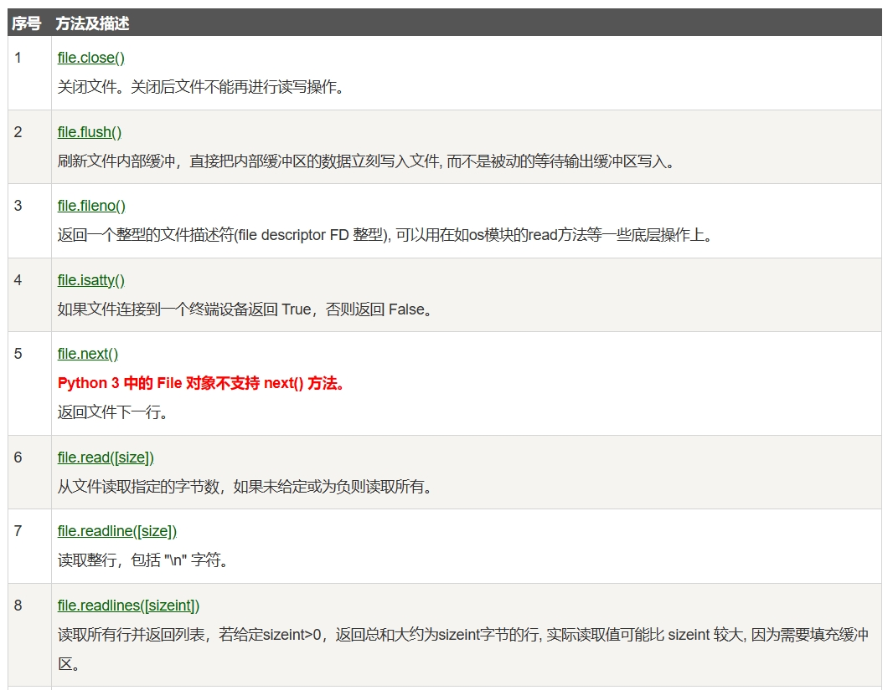
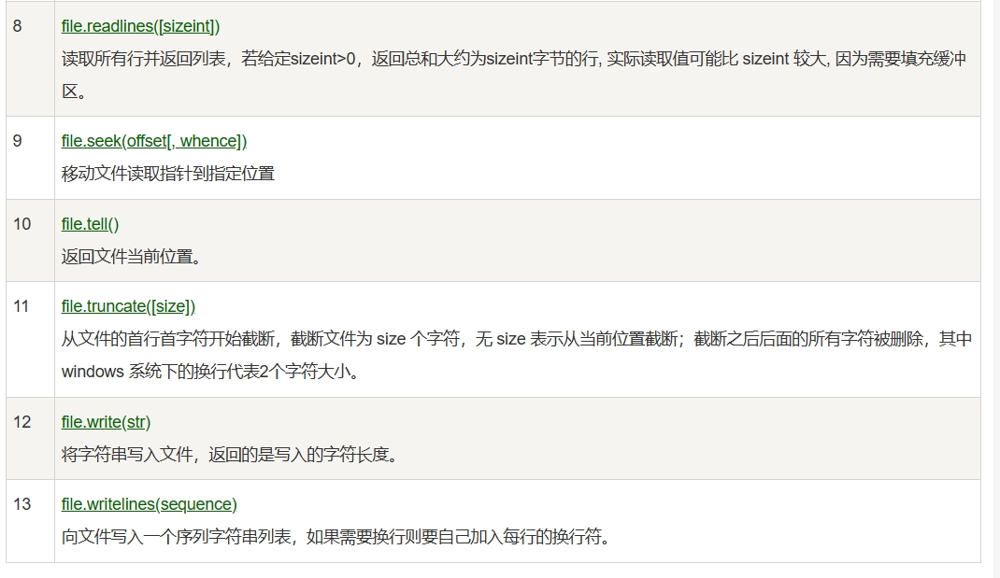
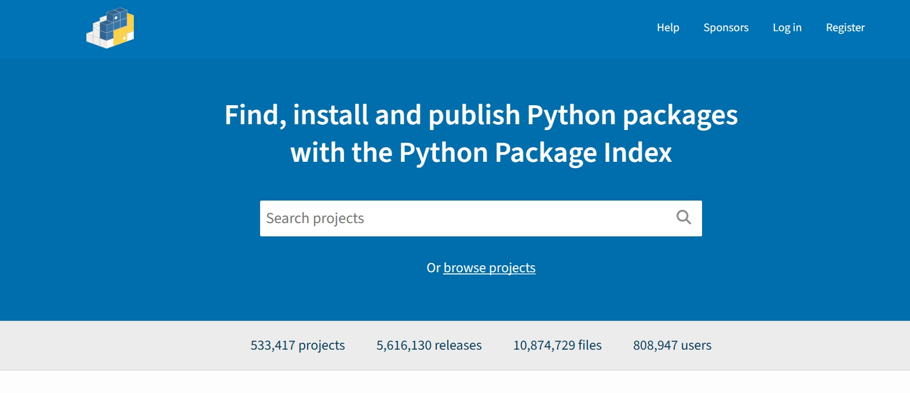

[toc]

# Python笔记2

此笔记初次更新于2021-03-30。现在对该笔记进行重新编写。

目前此笔记中的Python版本为3.12.3

## 条件语句

条件语句是通过表达式的结果（True 或者 False）来决定执行的代码块。

### if 条件语句

Python中if语句的一般形式如下

```python
if condition_1:
    statement_block_1
elif condition_2:
    statement_block_2
else:
    statement_block_3
```

注意：
- 每个条件后面要使用冒号: ,表示接下来是满足条件后要执行的语句块。
- Python 使用缩进来划分语句块，相同缩进数的语句在一起组成一个语句块。
- Python 中用 elif 代替了 else if，所以条件语句的关键字为：if – elif – else

> if嵌套语句

在Python中，可以把 if...elif...else 语句放在另外一个 if...elif...else 语句中。

```python
if 表达式1:
    语句
    if 表达式2:
        语句
    elif 表达式3:
        语句
    else:
        语句
elif 表达式4:
    语句
else:
    语句
```

### match...case 条件语句

Python 3.10 增加了 match...case 的条件语句。

match...case 条件语句，语法格式如下。
```python
# 根据表达式的结果不同，从而指向不同的语句。
# 如果结果没有匹配上，那么会匹配到case _ 这条结果。
match 表达式:
    case 结果1:
        语句
    case 结果2:
        语句
    case 结果3 | 结果4:
        语句
    case _:
       语句
```

- match 后的对象会依次与 case 后的内容进行匹配，如果匹配成功，则执行匹配到的表达式，否则直接跳过。 注意 `_` 可以匹配一切。
- 一个 case 也可以设置多个匹配条件，条件使用 ｜ 隔开。
- `case _`: 类似于 C 和 Java 中的 default:，当其他 case 都无法匹配时，匹配这条，保证永远会匹配成功。

## 循环语句

Python 中的循环语句有两种。分别是 for 循环语句 和 while 循环语句。

### while循环语句

Python 中 while 语句的一般形式如下
```python
# 若判断条件为true,则一直循环执行代码块。直到判断条件为false为止。
while 判断条件(condition)：
        代码块
```

- 注意：在 Python 中没有 do..while 循环。


> 用法：无限循环

可以通过设置表达式永远不为 false 来实现无限循环

```python
var = 1
while var == 1 :  # 表达式永远为 true
   print ("程序运行中")
```


> 用法：while ... else 语句

while ... else 语句一般用于在while循环结束后执行一段代码。

```python
# 语法格式如下
# 当 while 的表达式为 false 时，则执行 else 的语句块。
while <expr>:
    语句块1
else:
    语句块2
```

- expr 条件语句为 true 则执行 语句块1，如果为 false，则执行语句块2。

```python
# while 循环可以搭配 else 语句
count = 0
while count < 5:
   print (count, " 小于 5")
   count = count + 1
else:
   print (count, " 大于或等于 5")

# 执行结果
0  小于 5
1  小于 5
2  小于 5
3  小于 5
4  小于 5
5  大于或等于 5
```

### for循环语句

for 循环语句可以遍历任何可迭代对象，如一个列表或者一个字符串。

for循环语句的格式如下
```python
# 注意是 for in : 有一个分号
for <variable> in <sequence>:
    <statements>
else:
    <statements>
```

- break 语句用于跳出当前循环体

```python
sites = ["Baidu", "Google","Runoob","Taobao"]
for site in sites:
    if site == "Runoob":
        print("菜鸟教程!")
        break
    print("循环数据 " + site)
else:
    print("没有循环数据!")
print("完成循环!")

# 输出结果
循环数据 Baidu
循环数据 Google
菜鸟教程!
完成循环!
```

> for...else 语句

在 Python 中，for...else 语句用于在循环结束后执行一段代码。

```python
# 语法格式如下
for item in iterable:
    # 循环主体
else:
    # 循环结束后执行的代码

# 例子如下
for x in range(6):
  print(x)
else:
  print("finished!")
```

- 注意如果在循环过程中遇到了 break 语句，则会中断循环，此时不会执行 else 子句。


> break 语句 和 continue 语句

- break 语句可以跳出 for 和 while 的循环体。如果你从 for 或 while 循环中执行 break 语句。此时循环终止。
- continue 语句被用来跳过当前循环块中的剩余语句，然后继续进行下一轮循环。

break 语句例子如下
```python
n = 5
while n > 0:
    n -= 1
    if n == 2:
        break
    print(n)
print('循环结束。')
# 输出结果如下
# 4
# 3
# 循环结束。
```

continue 语句例子如下
```python
n = 5
while n > 0:
    n -= 1
    if n == 2:
        continue
    print(n)
print('循环结束。')
# 输出结果如下
# 4
# 3
# 1
# 0
# 循环结束。
```

## 推导式

推导式是一种独特的数据处理方式，可以快速的把一个序列转换为另一个新的序列。

Python 支持各种数据结构的推导式：
- 列表(list)推导式
- 字典(dict)推导式
- 集合(set)推导式
- 元组(tuple)推导式

### 列表推导式

列表推导式主要用于把一个列表转换为一个新列表。

列表推导式格式如下
```python
# 遍历列表，将列表中的变量，逐个加入到res结果中
[结果 for 变量 in 列表] 
[res for value in list]

# 或者 

# 遍历列表，将列表中符合条件的变量，逐个加入到res结果中
[结果 for 变量 in 列表 if 条件]
[res for value in list if condition]
```

- res：推导式的返回结果。
- for value in list：遍历 list列表 将 value 变量加入到 res 结果中。
- if condition：条件语句，可以过滤列表中不符合条件的值。

例子
```python
# 过滤掉长度小于或等于3的字符串列表names
# 并将符合条件的元素加入到new列表中,最后推导式的结果new 赋值给 new_names变量
>>> names = ['Bob','Tom','alice','Jerry','Wendy','Smith']
>>> new_names = [new for name in names if len(name)>3]
>>> print(new_names)
['ALICE', 'JERRY', 'WENDY', 'SMITH']
```

### 字典推导式

字典推导式主要用于把一个序列转换为一个字典。

字典推导式格式如下
```python
# 遍历序列，将序列中的变量，逐个加入到res_key和res_value中
{ res_key: res_value for value in collection }
# 或
# 遍历序列，将序列中符合条件的变量，逐个加入到res_key和res_value中
{ res_key: res_value for value in collection if condition }
```

例子
```python
# 将列表中各字符串值为键，各字符串的长度为值，组成键值对,最终组成一个字典。
listdemo = ['Google','Runoob', 'Taobao']
>>> newdict = {key:len(key) for key in listdemo}
>>> newdict
{'Google': 6, 'Runoob': 6, 'Taobao': 6}
```

### 集合推导式

集合推导式主要用于把一个序列转换为一个集合。

集合推导式格式
```python
{ expression for item in Sequence }
或
{ expression for item in Sequence if conditional }
```

例子
```python
# 计算元组 (1,2,3) 中的元素的平方并返回，最终组成一个集合
>>> setnew = {i**2 for i in (1,2,3)}
>>> setnew
{1, 4, 9}
```

### 元组推导式

集合推导式主要用于把一个元组转换为一个新元组。

注意：元组推导式返回的结果是一个生成器对象。

元组推导式基本格式
```python
(expression for item in Sequence )
或
(expression for item in Sequence if conditional )
```

例子
```python
# 生成一个包含数字 1~9 的元组
>>> a = (x for x in range(1,10))
>>> a
<generator object <genexpr> at 0x7faf6ee20a50>  # 返回的是生成器对象

>>> tuple(a)       # 使用 tuple() 函数，可以把生成器对象转换成元组
(1, 2, 3, 4, 5, 6, 7, 8, 9)
```

## 函数

函数是可重复使用的，用来实现单一功能的代码段。

Python提供了许多内建函数，比如print()。但你也可以自己创建函数，这被叫做自定义函数。

### 定义函数

1. 定义一个函数需要使用 def 关键字开头，后接函数名称和圆括号()。
1. 函数内容以冒号 : 起始，并且缩进。
2. 函数参数必须放在圆括号中间，圆括号之间可以用于定义函数参数。
3. 函数返回值如果有多个，那么多个返回值会合并为一个tuple元组返回。
4. 函数一旦执行到return时，函数就执行完毕。
5. 若函数没有return语句，也会返回结果，只是返回结果为None。即return None可以简写为return


定义函数的语法如下

```python
def 函数名（参数列表）:
    函数体
```

> 例子
```python
# 定义函数max
def max(a, b):
    if a > b:
        return a
    else:
        return b

# 定义变量a,b
a = 4
b = 5
# 调用函数max
print(max(a, b))  # 输出结果 5

```

> 多个返回值的函数

```python
## 多个返回值的函数 ================
def get(x,y):
    return x,y

# 函数的多个返回值可以被多个变量接收
a, b = get(100,200)
print(a, b)  # 输出结果 100,200

# 函数的多个返回值会默认转换为一个元组
r = get(100,200)
print(r) # 输出结果 (100,200)
```

### 调用函数

<font color="red">当调用函数时，若传入的参数个数错误，类型错误。会出现错误提示。</font>

```python
# python终端
# 定义函数
def printme( str ):
   # 打印传入的字符串
   print (str)
   # 返回None，即不返回
   return
 
# 调用函数
printme("123")  # 输出结果 123
printme("456")  # 输出结果 456

```

### return 语句

return 语句用于退出函数，return 语句可以向调用方返回一个表达式。不带参数值的 return 语句返回的是 None。


```python
# 函数
def sum( arg1, arg2 ):
   # 返回2个参数的和."
   total = arg1 + arg2
   print ("函数内 : ", total)
   return total
 
# 调用sum函数
total = sum( 10, 20 )
print ("函数外 : ", total) # 输出结果 30
```


### 参数传递

在 python 中，数据类型属于对象的。对象有不同数据类型的区分，变量是没有类数据类型区分的。

```python
# 变量a是没有数据类型的。变量a仅仅是指向对象的指针。
# 真正具有数据类型的对象。例如 列表对象[1,2,3]，字符串对象"Wellcome"
a=[1,2,3]
a="Wellcome"
```

在 python 中，strings, tuples, 和 numbers 是不可更改的对象，而 list,dict 等则是可以修改的对象。

不可变对象是指，该对象的内容无法改变。例如变量赋值 a=5 后再赋值 a=10，这里实际是新生成一个对象 10，然后改变了变量a指向的地址，从原本指向对象5，改为了指向对象10，最后对象 5 被丢弃了。

可变对象是指，该对象的内容是可以改变的。变量赋值 a=`[1,2,3,4]`,后再赋值 a[2]=5 则是将a指向的对象的第三个元素值更改，本身变量a指向的地址没有改动。


对于Python函数的参数传递。根据参数的不同，有不同的作用。
- 若参数是可变对象。类似 C++ 的引用传递，如 列表，字典。如函数fun(params)，则是将 实参params 真正的传过去，修改后函数外部的 params 也会受影响。简而言之就是改动函数内的形参，也会影响到函数外的实参。
- 若参数是不可变对象。类似 C++ 的值传递，如整数、字符串、元组。如函数fun(a)，传递的只是 实参a 的值，没有影响 实参a 对象本身。如果在函数内部修改 a 的值，则是新生成一个 a 的对象。简而言之就是改动函数内的形参，不会影响到函数外的实参。


> 函数传不可变对象例子

若不可变对象传入函数内，则对形参的改变不会影响到实参。

```python
# id() 函数可以查看变量指向的内存地址
def change(a):
    print(id(a))   # 指向的是同一个对象
    a=10
    print(id(a))   # 一个新对象

# 变量a指向的是数值型对象，该对象不可变。
a=1
print(id(a))
change(a)

# 输出结果如下
# 4379369136
# 4379369136
# 4379369424

```

> 函数传可变对象例子

若可变对象传入函数内，则对形参的改变会影响到实参。

```python
# 可写函数说明
def changeme( mylist ):
   mylist.append([1,2,3,4])
   print ("函数内mylist: ", mylist)
   return
 
# 调用changeme函数
mylist = [10,20,30]
changeme( mylist )
print ("函数外mylist: ", mylist)

# 输出结果如下
# 函数内mylist:  [10, 20, 30, [1, 2, 3, 4]]
# 函数外mylist:  [10, 20, 30, [1, 2, 3, 4]]
```

### 函数参数种类

当我们定义和调用函数的时候，可以使用各种函数参数。
- 必需参数
- 关键字参数
- 默认参数
- 不定长参数

> 必需参数

必需参数必须以正确的顺序传入函数。调用函数的是否不传入必须参数，则python会报错。

```python
#定义函数printme ，形参为str
def printme( str ):
   print (str)
   return
 
# 调用 printme 函数，不加参数会报错
printme()
```

> 关键字参数

使用关键字参数允许函数调用时参数的顺序与声明时不一致

```python
#函数printinfo
def printinfo( name, age ):
   print ("名字: ", name)
   print ("年龄: ", age)
   return
 
#调用printinfo函数
printinfo( age=50, name="runoob" )
```

> 默认参数

调用函数时，如果没有传递参数，则会使用默认参数。

```python
#函数
def printinfo( name, age = 35 ):
   print ("名字: ", name)
   print ("年龄: ", age)
   return
 
#调用printinfo函数
printinfo( age=50, name="runoob" )
printinfo( name="runoob" )
```


## lambda 匿名函数

lambda 函数是一种小型、匿名的、内联函数，它可以具有任意数量的参数，但只能有一个表达式。

- lambda 匿名函数不需要使用 def 关键字定义完整函数。
- lambda 函数是匿名的，它们没有函数名称，可以通过赋值给变量或作为参数传递给其他函数来使用。
- lambda 函数通常只包含一行代码，这使得它们适用于编写简单的函数。

lambda 语法格式
```python
# lambda是 Python 的关键字，用于定义 lambda 函数。
# arguments 是参数列表，可以包含零个或多个参数，但必须在冒号(:)前指定。
# expression 是一个表达式。这个表达式就是函数体，用于计算并返回函数的结果。
lambda arguments: expression
```

例子
```python
# 无参lambda 匿名函数
f = lambda: "Hello, world!"
print(f())  # 输出: Hello, world!

# 有参lambda 匿名函数
# 函数参数是a,函数体计算参数 a 加 10，并返回结果
x = lambda a : a + 10
print(x(5))

# lambda 函数也可以设置多个参数，参数使用逗号 , 隔开
x = lambda a, b : a * b
print(x(5, 6))
```

## 模块

在Python中，模块就是一个包含所有你定义的函数和变量的文件，其后缀名是`.py`。模块可以被别的程序引入，从而使用该模块中的函数等功能。


> 运行代码时Python解释器是怎样找到代码中引入的模块文件？

<font color="red">注意：当代码运行的时候，Python解释器会在当前目录或者一些特定目录中找寻这些模块文件。从而将这些模块文件引入到代码中。</font>

这些特定目录的路径存储在 sys 模块中的 path 变量中。不同的操作系统，这些目录的路径也不同。

```python
>>> import sys
>>> sys.path
# linux系统下的路径。''代表当前目录
['', '/usr/lib/python3.4', '/usr/lib/python3.4/plat-x86_64-linux-gnu', '/usr/lib/python3.4/lib-dynload', '/usr/local/lib/python3.4/dist-packages', '/usr/lib/python3/dist-packages']
```

### import 语句

可以使用 import 语句 来导入模块到代码中。

1. 创建 a.py文件，该文件包含一个函数。
```python
def print_func( par ):
    print ("Hello : ", par)
    return
```

2. 在当前目录中，再创建test.py来导入a.py文件 
```python
# 导入当前目录中的模块a.py
import a
 
# 调用模块里包含的函数了
a.print_func("Wellcome")
# 输出结果 Hello : Wellcome
```

### from … import 语句

> 情况一

```python
# 把一个模块的所有内容全都导入到当前的命名空间。
from modname import *

# 导入模块a的特定方法f1,f2
from a import f1, f2
```

> 情况二。 使用相对路径导入模块

在同一个目录中，同时存在 a.py 和 b.py。在b.py文件中导入a.py文件中某一个特定的方法或类。

```py
# 在b.py文件中导入a.py文件中某一个特定的方法或类。
from .a import method_a2
```

在上面的代码中，`.a` 表示从当前目录中导入 a 模块。


### __name__属性

由于模块本身就是一个.py文件。.py文件本身能够自己执行的，执行的就是.py文件中的主程序（非函数代码）。

那么当模块被另一个程序引入时,模块中的主程序代码就会开始自动运行。如果想要模块中主程序代码不自动运行。则可以用`__name__`属性来使该某些程序块仅在该模块自身运行时执行。

当`__name__`属性为`__main__`的时候，模块自身的主程序代码才会执行。

```python
# 该代码自己运行时，会打印上面部分
# 该代码作为模块运行时，会打印下面部分
if __name__ == '__main__':
   print('该代码文件程序自身在运行')
else:
   print('该代码文件作为模块被导入')
```

测试例子

1. 创建test.py文件，代码如下
```python
if __name__ == '__main__':
   print('test.py文件程序自身在运行')
else:
   print('test.py文件被当作模块导入到其他文件中了')
```

2. 测试

```python
# python终端
# 运行test.py文件
>>> python test.py
test.py文件程序自身在运行

# 导入test模块
>>> import test
test.py文件被当作模块导入到其他文件中了
```

<font color="red">
注意：每个模块都有一个__name__属性，当其值是'__main__'时，表明该模块自身在运行，否则是被引入。

另外 `__name__` 与 `__main__` 底下是双下划线， `_ _ `是这样去掉中间的那个空格。

</font>

### dir() 函数

函数 dir() 可以找到模块内定义的所有名称。以一个字符串列表的形式返回。

例如当我们导入一个模块的时候，可以使用dir()函数来获取模块中所以变量和函数的名称，从而方便我们使用。

```python
# 导入模块fibo,sys
>>> import fibo
# 打印fibo模块中定义的属性列表
>>> dir(fibo)
['__name__', 'fib', 'fib2']
```

### 标准模块

Python 本身带着一些标准的模块库，即Python官方提供的模块库。

在 Python 库参考文档中有详细描述。


## 输入与输出

### 读取键盘输入

Python 提供了 input() 内置函数读取键盘的输入。

```python
str = input("请输入：")
print ("你输入的内容是: ", str)

# 运行结果：
# 请输入：aaa
# 你输入的内容是:  aaa
```

### 输出

Python有两种输出的方式: 表达式语句和 print() 函数。

- 使用 str.format() 函数可以来格式化输出值。
- 使用 repr() 或 str() 函数可以实现将输出的值转成字符串。

```python
# python终端
>>> s = 'Hello, Runoob'
>>> str(s)
'Hello, Runoob'
>>> repr(s)
"'Hello, Runoob'"
>>> str(1/7)
'0.14285714285714285'

## {} 会被format() 中的参数替换
>>> print('{}网址： "{}!"'.format('菜鸟教程', 'www.runoob.com'))
菜鸟教程网址： "www.runoob.com!"

## {}符号中的数字，对应参数的位置
>>> print('{1} 和 {0}'.format('Google', 'Runoob'))
Runoob 和 Google

## {}中的关键字可以与format中的参数关键字一一对应
>>> print('站点列表 {0}, {1}, 和 {other}。'.format('Google', 'Runoob', other='Taobao'))
站点列表 Google, Runoob, 和 Taobao。

## str输出
>>> s = 'Hello, Runoob'
>>> str(s)
'Hello, Runoob'

## repr输出
>>> repr(s)
"'Hello, Runoob'"
# repr() 的参数可以是 Python 的任何对象
>>> repr((x, y, ('Google', 'Runoob'))) 
"(32.5, 40000, ('Google', 'Runoob'))"

```


## 文件

Python提供了操作文件的方式。

### open() 方法，返回一个文件对象

Python提供open()方法来操作文件。open()方法将会返回一个 file 对象。

<font color="red">注意：在对文件进行处理之前都需要使用到这个函数。通过该方法获取到文件对象。</font>

```python
#  open() 函数常用形式是接收两个参数：文件名(file)和模式(mode)。
# filename  文件名称及其路径
# mode      打开文件的模式：只读，写入，追加等
open(filename, mode)

# open()方法的完整语法格式为
open(file, mode='r', buffering=-1, encoding=None, errors=None, newline=None, closefd=True, opener=None)
```

参数说明:
- file: 必需，文件路径（相对或者绝对路径）。
- mode: 可选，文件打开模式
- buffering: 设置缓冲
- encoding: 一般使用utf8
- errors: 报错级别
- newline: 区分换行符
- closefd: 传入的file参数类型
- opener: 设置自定义开启器，开启器的返回值必须是一个打开的文件描述符。


> mode参数的部分取值

模式    | 介绍 
------ | ------
r      | 默认模式。以只读方式打开文件。文件的指针将会放在文件的开头     
rb     | 以二进制格式打开一个文件用于只读。文件指针将会放在文件的开头。
r+     | 打开一个文件用于读写。文件指针将会放在文件的开头
rb+    | 以二进制格式打开一个文件用于读写。文件指针将会放在文件的开头。
w      | 打开一个文件只用于写入。如果该文件已存在则打开文件，并从开头开始编辑，即原有内容会被删除。如果该文件不存在，创建新文件。
w+     | 打开一个文件用于读写。如果该文件已存在则打开文件，并从开头开始编辑，即原有内容会被删除。如果该文件不存在，创建新文件。
a      | 打开一个文件用于追加。如果该文件已存在，文件指针将会放在文件的结尾。也就是说，新的内容将会被写入到已有内容之后。如果该文件不存在，创建新文件进行写入。
a+     | 打开一个文件用于读写。如果该文件已存在，文件指针将会放在文件的结尾。文件打开时会是追加模式。如果该文件不存在，创建新文件用于读写。

> 例子：将字符串写入到文件 foo.txt 中

```python
# 写入模式打开一个文件foo.txt。返回一个文件对象
f = open("/tmp/foo.txt", "w")
# 写入内容到文件对象
f.write( "Python 是一个非常好的语言。\n是的，的确非常好!!\n" )
# 关闭文件对象
f.close()
```

运行结果
```shell
# 打印foo.txt 文件内容
$ cat /tmp/foo.txt 
Python 是一个非常好的语言。
是的，的确非常好!!
```


### 文件对象的方法

我们可以通过open()方法，来创建一个文件对象。对于文件对象，Python提供了一些方法，去操作文件对象。

file 对象使用 open 函数来创建，下图列出了 file 对象常用的函数。




> f.read()

read()方法读取文件对象的内容,然后作为字符串或字节对象返回。

`f.read(size)`也可以读取一定大小的文件数据, 然后作为字符串或字节对象返回。注意：当 size 被忽略了或者为负, 那么该文件的所有内容都将被读取并且返回。

```python
# 只读模式，打开文件foo.txt
f = open("/tmp/foo.txt", "r")
# 读取文件内容
str = f.read()
# 打印文件内容
print(str)
# 关闭打开的文件
f.close()

# 运行结果
# Python 是一个非常好的语言。
# 是的，的确非常好!!

```

> f.readline()

f.readline() 会从文件中读取单独的一行。换行符为 '\n'。f.readline() 如果返回一个空字符串, 说明已经已经读取到最后一行。

```python
# 只读模式，打开文件foo.txt
f = open("/tmp/foo.txt", "r")

str = f.readline()
print(str)

# 关闭打开的文件
f.close()

```


> f.write()

f.write(string) 将 string 写入到文件中, 然后返回写入的字符数。

```python
# 写入模式，打开文件foo.txt
f = open("/tmp/foo.txt", "w")
# 写入文件内容，并返回写入字符数
num = f.write( "Python 是一个非常好的语言。\n是的，的确非常好!!\n" )
# 打印写入的字符数
print(num)
# 关闭打开的文件
f.close()

```


>f.close()

当你处理完一个文件对象后, 调用 f.close() 来关闭文件对象并释放系统的资源，如果尝试再调用该文件对象则会抛出异常。

```python
# 打开一个文件
f = open("/tmp/foo.txt", "r")
# 读取文件全部内容
str = f.read()
# 打印
print(str)
# 写入文件数据
f.write( "Python 是一个非常好的语言。\n是的，的确非常好!!\n" )
# 关闭文件
f.close()
```


## 包

在某些情况下，为了实现一个大功能，往往需要多个模块.py文件互相搭配使用,并且这些模块.py文件通常会存储在同一个目录中。

这种实现相同功能的一些模块.py文件组成的目录，可以称为包。

包的目录结构如下：
```
packageA/            顶层包
      __init__.py    初始化代码文件
      demo1.py       功能文件1
      demo2.py       功能文件2          
      demo3.py       功能文件3
      demo4.py       功能文件4
      ...
```

目录只有包含一个叫做`__init__.py` 的文件。Python才会认作该目录是一个包。


## pip

pip 是 Python 包管理工具，该工具提供了对 Python 包的查找、下载、安装、卸载的功能。

Python官方的包下载网站 [https://pypi.org/](https://pypi.org/)。



<font color="red">

注意
1. pip类似于JavaScript中的NPM包管理工具。
2. 目前最新的 Python 版本已经预装了 pip。

</font>


> 查看是否已经安装 pip 可以使用以下命令。

```shell
pip --version
```

> 常用命令

```shell
# 下载软件包语法
pip install 包名

# 卸载软件包语法
pip uninstall 包名

# 查看已经安装的软件包语法
pip list

```

> 导出当前 Python 环境的配置

我们可以通过 pip freeze 命令。来导出当前 Python 环境的配置。

```shell
# pip freeze 命令列出当前环境中已安装的所有 Python 包及其版本信息 并保存到 py_eviorment.txt 中
pip freeze > py_eviorment.txt
```

然后可以在其他地方使用该文件来重新创建相同的Python环境。

```shell
# 读取文件中的信息，重新安装所有必需的包，从而重建相同的环境
pip install -r py_eviorment.txt
```


