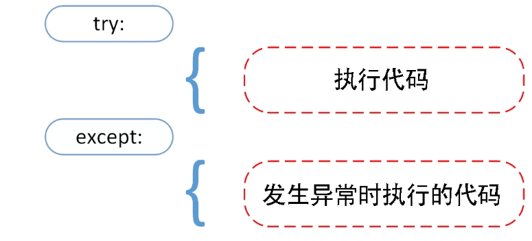
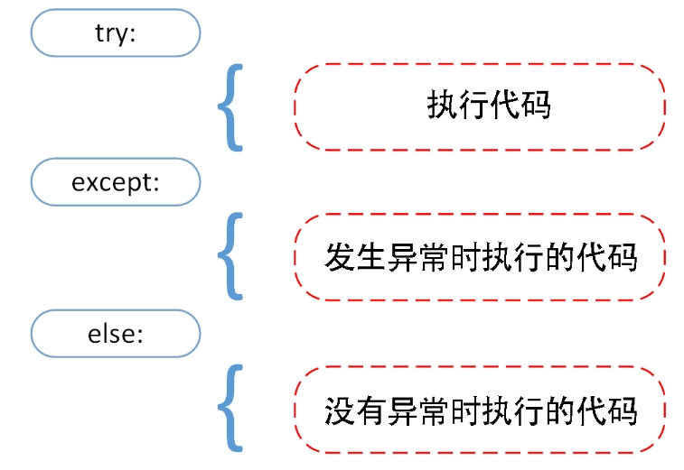
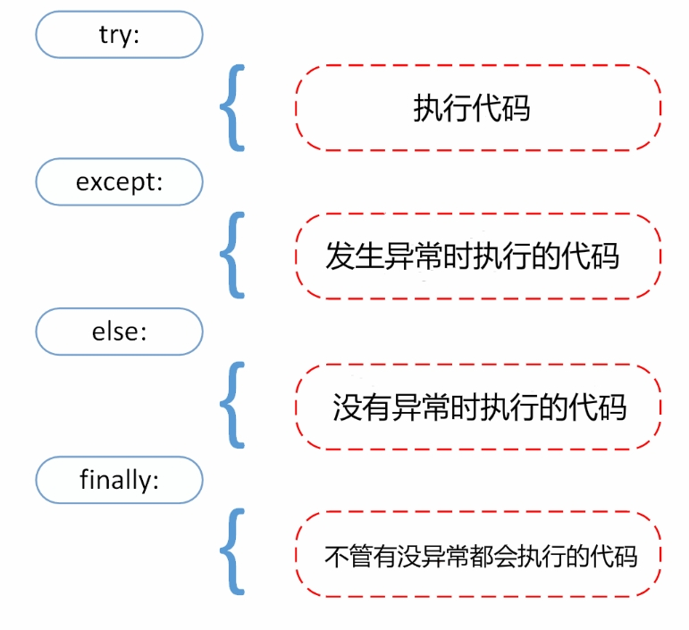
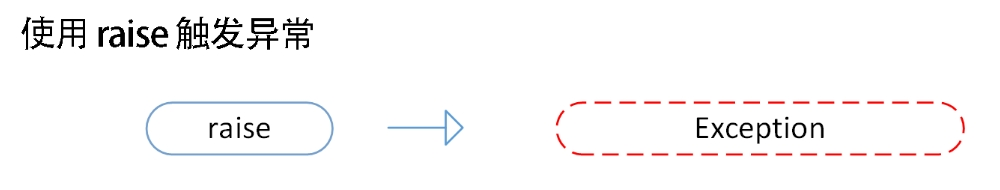

[toc]

# Python笔记3

此笔记初次更新于2021-03-30。现在对该笔记进行重新编写。

目前此笔记中的Python版本为3.12.3

Python从设计之初就已经是一门面向对象的语言，正因为如此，在Python中创建一个类和对象是很容易的。

面向对象常用名词解释
- 类(Class): 一个描述属性和方法的集合。它定义了该集合中每个对象所共有的属性和方法。
- 方法：类中定义的函数。
- 类变量（公共类属性）：类变量在整个实例化的对象中是公用的。类变量定义在类中且在函数体之外。类变量通常不作为实例变量使用。
- 实例变量（普通类属性）：在类的声明中，属性是用变量来表示的，这种变量就称为实例变量，实例变量就是一个用 self 修饰的变量。
- 局部变量：定义在方法中的变量。
- 继承：Python允许一个派生类（derived class）继承基类（base class）的字段和方法。
- 实例化对象：创建一个类的实例，类的具体对象。
- 对象：通过类定义的数据结构实例。对象包括两个数据成员（类变量和实例变量）和方法。


## 类

类语法格式
```python
class 类名:
    代码块1
    代码块2
    .....
```

### 类的属性

在类中，我们可以定义变量。这些变量就是类的属性。类的属性分为两种：基本属性和私有属性。

基本属性就是类中的普通变量，基本属性可以在类外部被直接访问。

私有属性的特点
- 私有属性的属性名称以两个下划线`_ _`开头。这样python会将该属性声明为私有属性。
- 私有属性不能在类的外部被其他代码使用或直接访问。

```python
# people 类定义
class people:
    # 定义基本属性name,age
    name = ''
    age = 0
    # 定义私有属性weight
    # 私有属性在类外部无法直接进行访问
    __weight = 0

```


### 类的方法

在类中，我们可以定义函数。这些函数就是类的方法。

在类的内部，使用 def 关键字来定义一个方法，与一般函数定义不同，类方法必须包含参数 self, 且为第一个参数。self 代表的是类的实例。

<font color="red">self 的名字并不是规定死的，也可以使用 this，但是最好还是按照约定使用 self。</font>


> 普通方法

```python
# people类定义
class people:
    name = ''
    age = 0
    # 定义普通方法speak
    def speak(self,n,a):
        self.name = n
        self.age = a
        print(self.name,self.age)
 
# 实例化类
p = people(10,30)
# 调用普通方法speak
p.speak()
```

> 私有方法

私有方法的特点
- 私有方法的方法名称以两个下划线`_ _`开头。这样python会将该方法声明为私有方法。
- 私有方法只能在类的内部调用 ，不能在类的外部调用。

```python
# people 类定义
class people:
      # 定义私有方法__foo
    def __foo(self):          
        print('这是私有方法')
 
x = people()
x.__foo()      # 外部调用类的私有方法，会直接报错
```

> 类的构造方法

类中可以有一个名为`__init__()` 的特殊方法（构造方法），该方法在类实例化为对象的时候会自动调用一次。

```python
class people:
    name = ""
    age = 0
    # 定义people类的构造方法
    def __init__(self, name, age):
        self.name = name
        self.age = age

# 实例化people类对象x。
x = people("bob",10)
print(x.name, x.age)   # 输出结果："bob",10
```


## 类对象

当我们创建好一个类的时候，我们可以实例化类，将该类变为一个类对象。

类对象可以访问类中的属性和方法。

```python
# 定义MyClass类
class MyClass:
    i = 12345
    def f(self):
        return 'hello world'
 
# 实例化MyClass类，将其转换为类对象x
x = MyClass()
 
# 类对象x可以访问类的属性和方法
print("MyClass 类的属性 i 为：", x.i)
print("MyClass 类的方法 f 输出为：", x.f())

```

## 继承

Python 同样支持类的继承。子类会继承父类的属性和方法。

### 单继承

继承的语法格式如下
```python
class 子类名称(父类名称):
    代码块1
    代码块2
    ....
```

例子
```python
# people类定义
class people:
    name = ''
    age = 0
    #定义构造方法
    def __init__(self,n,a):
        self.name = n
        self.age = a
 
#单继承示例
# student类继承people类
class student(people):
    grade = ''
    # 定义构造方法
    def __init__(self,n,a,g):
        #调用父类的构造方法
        people.__init__(self,n,a)
        self.grade = g

# 实例化student类
s = student('ken',10,60,3)
```

### 多继承

Python同样支持多继承形式。

多继承的语法格式如下
```python
class 子类名称(父类名称1,父类名称2,父类名称3):
    代码块1
    代码块2
    ....
```

例子
```python
# people类定义
class people:
    name = ''
    age = 0
    #定义构造方法
    def __init__(self,n,a):
        self.name = n
        self.age = a
 
#另一个类，多继承之前的准备
class speaker:
    topic = ''
    name = ''
    def __init__(self,n,t):
        self.name = n
        self.topic = t

#多继承示例
class sample(speaker,people):
    def __init__(self,n,a,w,g,t):
        people.__init__(self,n,a)
        speaker.__init__(self,n,t)
 
# 实例化类sample
test = sample("Tim",25,80,4,"Python")
```

### 方法重写

如果你的父类方法的功能不能满足你的需求，你可以在子类重写你父类的方法。

```python
# 定义父类
class Parent:        
   def myMethod(self):
      print ('调用父类方法')

# 定义子类
class Child(Parent): 
   def myMethod(self):
      print ('调用子类方法')

# 实例Child类对象c
c = Child()          
c.myMethod()               # 调用子类的重写方法
super(Child,c).myMethod()  # 用子类对象调用父类已被覆盖的方法

# 输出结果
# 调用子类方法
# 调用父类方法

```

super() 函数是用于调用父类的一个方法。

## 异常和错误

Python assert（断言）用于判断一个表达式，在表达式条件为 false 的时候触发异常。

### 语法错误

```python
# while语句，此处有语法错误
>>> while True print('Hello world')
# 报错信息
  File "<stdin>", line 1, in ?
    while True print('Hello world')
                   ^
SyntaxError: invalid syntax
```

此处while语句没有冒号`:`，有语法错误。

### 异常

假如 Python 程序的语法是正确的，在运行它的时候，也有可能发生错误。这种语法没有错误，但是运行会出现的错误被称为异常。

异常例子
```python
# python终端
>>> 10 * (1/0)             # 0 不能作为除数，触发异常
Traceback (most recent call last):
  File "<stdin>", line 1, in ?
ZeroDivisionError: division by zero
>>> 4 + spam*3             # spam变量未定义，触发异常
Traceback (most recent call last):
  File "<stdin>", line 1, in ?
NameError: name 'spam' is not defined
>>> '2' + 2               # int 不能与 str 相加，触发异常
Traceback (most recent call last):
  File "<stdin>", line 1, in <module>
TypeError: can only concatenate str (not "int") to str
```

### 异常处理

> `try/except` 语句

对于代码中可能会发生异常的地方。我们可以通过 `try/except` 语句对可能出现的异常进行处理。




`try/except` 语句格式。
```python
try:
   print("开始。。。。")
   ## 此处是可能发生异常的代码
   print("结束。。。。")
except ValueError:
   # 当代码发生异常的时候，会执行except中的代码块
   print("发生ValueError异常！")
except RuntimeError:
   print("发生RuntimeError异常！")
except (IOError, NameError):
   print("发生NameError和IOError异常！")
```

<font color="red">一个 try 语句可能包含多个except子句，分别来处理不同的特定的异常。最多只有一个分支会被执行。</font>

`try/except` 语句处理流程：
1. 首先执行 try 语句块
2. 如果没有异常发生，忽略 except 子句，try 子句执行后结束。
3. 如果在执行 try 子句的过程中发生了异常，那么 try 子句余下的部分将被忽略。如果异常的类型和 except 之后的名称相符，那么对应的 except 子句将被执行。
4. 如果一个异常没有与任何的 except 匹配，那么这个异常将会传递给上层的 try 中。


> `try/except...else` 语句

else 子句将在 try 子句没有发生任何异常的时候执行。

这样的好处是避免一些意想不到，而 except 又无法捕获的异常。



`try/except...else` 语句格式。

```python
try:
   print("开始。。。。")
   ## 此处是可能发生异常的代码
   print("结束。。。。")
except ValueError:
   # 当代码发生异常的时候，会执行except中的代码块
   print("发生ValueError异常！")
except (IOError, NameError):
   print("发生NameError和IOError异常！")
else:
   print("无异常时，执行else语句代码。")
```


> `try-finally` 语句

try-finally 语句无论是否发生异常都将执行最后的代码。



`try-finally` 语句格式。

```python
try:
   print("开始。。。。")
   ## 此处是可能发生异常的代码
   print("结束。。。。")
except ValueError:
   # 当代码发生异常的时候，会执行except中的代码块
   print("发生ValueError异常！")
else:
   print("无异常时，执行else语句代码。")
finally:
    print('无论异常是否发生都会执行finally子句。')
```


### 抛出异常

Python 中可以使用 raise 语句手动抛出一个指定的异常。



例子
```python
x = 10
if x > 5:
    # raise手动抛出一个异常
    raise Exception('x 不能大于 5。')
```

### 用户自定义异常

我们可以通过创建一个新的异常类来拥有自己的异常处理方式。异常类继承自 Exception 类，可以直接继承，或者间接继承。

```python
# 定义MyError类，继承Exception类
class MyError(Exception):
   # 构造方法
   def __init__(self, value):
      self.value = value
   

# 测试例子，手动抛出MyError异常
try:
   raise MyError(2*2)
except MyError as e:
   print('My exception occurred, value:', e.value)

# 输出结果
# My exception occurred, value: 4
```
