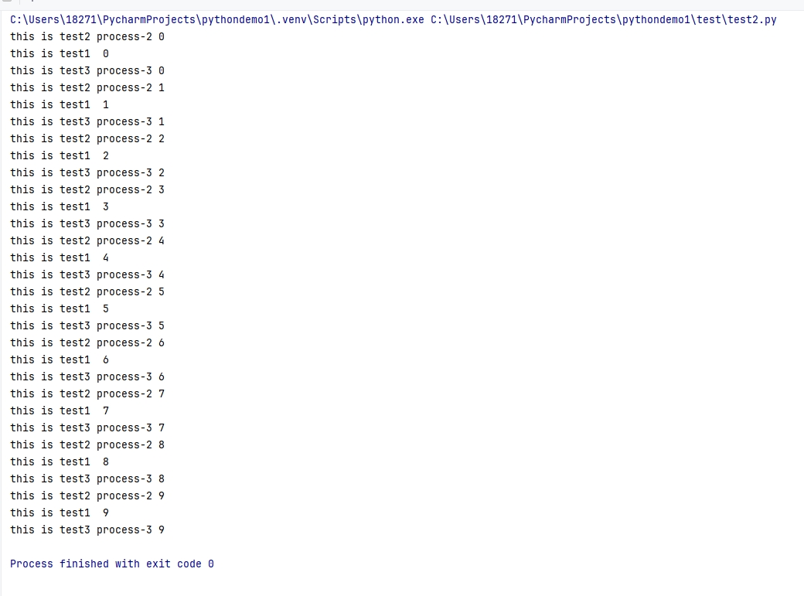

[toc]

# Python笔记4

此笔记初次更新于2021-03-30。现在对该笔记进行重新编写。

目前此笔记中的Python版本为3.12.3

## 进程

进程（Process）是资源分配的最小单位，它是操作系统进行资源分配和调度运行的基本单位。

通俗理解，一个正在运行的程序就是一个进程，例如电脑上运行的一个QQ程序，一个网易云音乐程序...等。

每个进程都有自己的地址空间，内存，等数据。进程与进程之间的数据是各自独立的。

### 多进程介绍

通常情况下，一个正在运行的程序代码就是一个进程。但是有的时候，我们在代码中需要同时运行多个不同的任务。

这种情况下，我们可以通过创建多个子进程，让不同的子进程去执行不同的任务。

注意此处的程序代码是指主进程，在代码中创建子进程，然后通过子进程来执行不同的任务。子进程之间的数据不共享。


> 子进程的创建步骤

```
① 导入进程模块
   import multiprocessing
② 通过进程类创建子进程对象。
   子进程对象 = multiprocessing.Process(target=任务名)
③启动子进程执行任务。
   子进程对象.start()
```

当我们在主进程中（即程序代码中）创建多个子进程的时候，当多个子进程都执行结束后，主进程才会运行结束。


### 多进程例子

```py
# 导入进程模块
import multiprocessing
import time


# 任务1
def test1():
    for i in range(10):
        print(f"this is test1 ", i)
        time.sleep(1)

# 任务2
def test2(processName):
    for i in range(10):
        print(f"this is test2 {processName}", i)
        time.sleep(1)

# 任务3
def test3(processName):
    for i in range(10):
        print(f"this is test3 {processName}", i)
        time.sleep(1)

if __name__ == '__main__':
    # 使用进程类创建进程对象
    # target ：指定进程执行的函数名，不加括号
    test1_process = multiprocessing.Process(target=test1)
    test2_process = multiprocessing.Process(target=test2,args=("process-2",))
    test3_process = multiprocessing.Process(target=test3, kwargs={"processName":"process-3"})

    # 启动子进程对象
    test1_process.start()
    test2_process.start()
    test3_process.start()
```

运行结果如下


在上面的代码中创建了三个子进程。每个子进程执行不同的任务。

- `target=test1` target是指进程要执行的目标方法名称。
- `args=("process-2",)` 如果目标方法有参数，args参数通过接受一个元组的数据，然后把元组数据传参给目标方法。
- `kwargs={"processName":"process-3"}` 如果目标方法有参数，kwargs参数通过接受一个字典的数据，然后把字典数据传参给目标方法，注意字典的键要和目标方法的参数同名。


## 线程

线程是程序执行的最小单元，实际上进程只负责分配资源，而利用这些资源执行程序的是线程，也就是说进程是线程的容器，一个进程中最少有一个线程来负责执行程序。

注意线程自己不拥有系统资源，但可与同属一个进程的其他线程共享进程所拥有的全部资源。

例如一个QQ程序可以一边聊天，一边听音乐，一边看视频。这代表一个进程中存在三个线程，分别执行聊天，听音乐，看视频任务。


### 子线程介绍

有些情况下，我们需要在代码中需要同时批量运行同一个任务，只不过参入任务的参数有区别而已。

这种情况下，我们可以通过创建多个子线程，让不同的子线程去携带不同的参数，从而实现批量执行任务的效果。

注意此处的程序代码是指主线程，在代码中创建子进程，然后多个子进程来批量执行同一个任务。子线程之间携带的参数不同。


> 子线程的创建步骤

```
①导入线程模块
   import threading
②通过线程类创建子线程对象
   子线程对象 = threading.Thread(target = 任务名)
③启动子线程
   子线程对象.start()
```

主线程会等待所有的子线程执行结束后再结束（同进程一样）

### 多线程例子

```py
# 导入线程模块
import threading
import time

# 任务
def test(threadName,name,age):
    for i in range(10):
        print(f"this is test {threadName} {name} {age}", i)
        time.sleep(1)

if __name__ == '__main__':
    thread1 = threading.Thread(target=test,args=("thred-1","xiaoming",10))
    thread2 = threading.Thread(target=test,kwargs={"threadName":"thred-2","name":"xiaohong","age":12})

    # 启动子线程对象
    thread1.start()
    thread2.start()

```

运行结果如下


在上面的代码中创建了三个子线程。每个子线程执行同一个任务，但是每个线程携带不同的参数。

- `target=test` target是指进程要执行的目标方法名称。
- `args=("thred-1","xiaoming",10)` 如果目标方法有参数，args参数通过接受一个元组的数据，然后把元组数据传参给目标方法。
- `kwargs={"threadName":"thred-2","name":"xiaohong","age":12}` 如果目标方法有参数，kwargs参数通过接受一个字典的数据，然后把字典数据传参给目标方法，注意字典的键要和目标方法的参数同名。


### 关闭子线程

当多个子线程同时运行同一个任务的时候，某些情况下，我们可能会关闭某个子线程。

但是 Threading 模块并没有提供关闭线程的方法。如果要关闭子线程，只有通过关闭主线程的方式。即关闭主线程，子线程也会关闭。

> 为什么要关闭子线程?

在某些情况下，当多个子线程同时执行的是一个耗时很长的任务。但是当我们通过日志发现某一个子线程的执行结果有问题，我们不可能等待这一个子线程执行结束。

因此我们希望只关闭这一个子线程，并且不会影响到其他子线程的执行状态。

例如 我们有多个子线程同时执行爬虫任务，爬虫任务每次执行的时候很长。一般情况下，有的子线程能够爬取数据成功，有的子线程爬取数据失败。我们希望爬取数据成功的子线程能够继续爬行数据，爬取数据失败的子线程能够自动结束运行。并且后续可以重新启动这些失败的子线程，从而继续爬取数据。

> 解决方式

在方法中，通过主动抛出异常的方式。让执行该方法的子线程结束执行。

> 例子

```py
# 导入线程模块
import threading
import time

# 任务
def test(threadName):
    for i in range(10):
        if (threadName == "thred-2" and i == 5):
            # 主动抛出异常
            raise Exception(f"test方法抛出一个异常! 当前子线程由于抛出异常，从而会终止运行")

        print(f"this is test {threadName} ", i)
        time.sleep(1)

if __name__ == '__main__':
    thread1 = threading.Thread(target=test,args=("thred-1",))
    thread2 = threading.Thread(target=test,kwargs={"threadName":"thred-2"})

    # 启动子线程对象
    thread1.start()
    thread2.start()
```


如图所示在抛出异常后，thread-2子线程就已经运行结束了。


## 线程池

从Python3.2开始，Python标准库为我们提供了 concurrent.futures 模块，它提供了 ThreadPoolExecutor (线程池)和ProcessPoolExecutor (进程池)两个类。

concurrent.futures 模块相比  threading 模块。主要的区别在于 future 对象。通过 future 对象，可以做到如下事情。
- 主线程可以获取某一个子线程（或者任务的）的状态，以及返回值。
- 当一个子线程完成的时候，主线程能够立即知道。

### 线程池的基本使用

```py
from concurrent.futures import ThreadPoolExecutor
import time

def test(threadName,name):
    for i in range(10):
        print(f" 线程 {threadName} 正在运行， name 为 {name} , i 为 {i}")
        time.sleep(1)

# 创建一个最大容纳数量为3的线程池
with ThreadPoolExecutor(max_workers=3) as threadPool:
    # 通过submit提交执行的函数到线程池中
    task1 = threadPool.submit(test,"thread-1","xiaoming")
    task2 = threadPool.submit(test,"thread-2","xiaoqiang")
    task3 = threadPool.submit(test,"thread-3","xiaohong")

    # 通过done来判断线程是否完成
    print(f"task1: {task1.done()}")
    print(f"task2: {task2.done()}")
    print(f"task3: {task3.done()}")

    # 主线程休眠20秒
    time.sleep(20)

    # 再次通过done来判断线程是否完成,这里是因为子线程基本10秒后就执行结束了
    print(f"task1: {task1.done()}")
    print(f"task2: {task2.done()}")
    print(f"task3: {task3.done()}")

    # 通过result来获取返回值
    print(task1.result())  
    print(task2.result()) 
    print(task3.result()) 
```

- 使用with语句，当线程池中线程都运行结束后，会自动关闭线程池，回收资源。
- 使用 submit 函数来提交线程需要执行的任务到线程池中，注意 submit() 不是阻塞的，而是立即返回。
- 通过使用 done() 方法判断该子线程的任务是否结束。任务没完成返回False,任务完成返回True
- 使用 result() 方法可以获取子线程执行任务的返回值。


## 定时器 Timer类

Timer（定时器）是Thread的派生类，用于在指定时间后调用一个方法。

我们可以通过Timer类来实现定时器的效果。本质上是通过创建子线程来定时运行目标方法。

```py
# 导入threading
import threading

def schedule_task1():
    print(f"=============== 执行schedule_task方法。 ===============")
    # 设置每隔10秒触发一次定时任务schedule_task1
    timer1 = threading.Timer(10, schedule_task1)
    # 运行定时任务
    timer1.start()

def schedule_task2(name,age):
    print(f"=============== 执行schedule_task2方法。{name} {age} ===============")
    # 设置每隔15秒触发一次定时任务schedule_task2
    timer2 = threading.Timer(15, schedule_task2, args=(name,age))
    timer2.start()

def schedule_task3(name,age):
    print(f"=============== 执行schedule_task3方法。{name} {age} ===============")
    # 设置每隔20秒触发一次定时任务schedule_task3
    timer3 = threading.Timer(20, schedule_task3, kwargs={"name": name, "age": age})
    timer3.start()

if __name__ == '__main__':
    schedule_task1()
    schedule_task2("xiaohong",15)
    schedule_task2("xiaoming", 20)

```

函数 threading.Timer(interval, function, args=[], kwargs={})
- interval: 定时时间，即函数每隔多少秒执行一次。
- function: 要进行定时执行的函数
- args: 传递给方法的参数，元组类型
- kwargs：传递给方法的参数，字典类型

