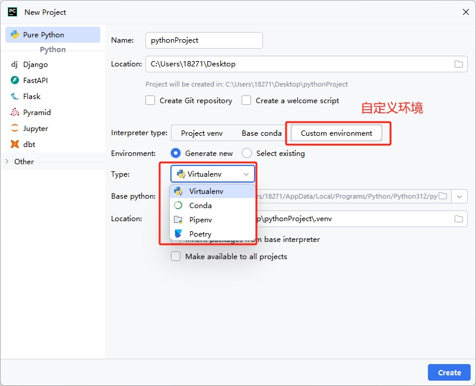

[toc]

# Python虚拟环境笔记

> 为什么需要python虚拟环境？

在编写Python程序的时候，一般是通过pip（pip3）来安装程序中的第三方包。

由于pip的特性，操作系统（windows,linux等）中只能安装每个包的一个版本。这导致本地的python开发环境中的每个包都只有一个版本。

但是在实际的python项目开发中，不同python项目可能需要不同版本的第三方包。如果不同的python项目都依赖本地的python开发环境，会导致两个后果。
1. 会导致本地的python开发环境中的第三方包相当混乱而不易管理。
2. 会导致这些python项目无法同时启动。

这时候我们就需要开辟一个独立干净的空间进行开发和部署python项目，即每一个python项目都拥有自己的python环境，这些环境互不影响。python虚拟环境就孕育而生。

> 什么是python虚拟环境？

python虚拟环境可以认为是python本地环境的多个副本，只是在不同的副本中安装了不同的包。

python虚拟环境中一般不包含标准库, 不包含python解释器运行时所需的依赖文件.python 虚拟环境的可执行文件全部放于Scripts目录等。

python 虚拟环境的本质就是修改了 sys.path 的值。不同python项目的虚拟环境的 sys.path 的值是不同的，从而各个python项目的第三方包的安装位置也不同。

## Python虚拟环境的管理工具

下图是Pycham 创建新项目时候，可以选择的各个Python虚拟环境的管理工具

### venv

Python 从3.3 版本开始，自带了一个虚拟环境模块 venv。

venv 的很多操作都和 virtualenv 类似。如果你使用的是python3.3之前版本的，则不能使用该功能，需要使用virtualenv进行虚拟环境管理。

### Virtualenv

Virtualenv 是目前最流行的 Python 虚拟环境配置工具，同时支持Python2和Python3，也可以为每个虚拟环境指定不同版本的Python解释器。

但是跨平台的使用不太一致，且有时候处理包之间的依赖总存在问题。

### Pipenv

pipenv 是Kenneth Reitz(requests的作者)大神的作品。它结合了 Pipfile，pip，和virtualenv，能够有效管理Python多个环境，各种包。并且windows视为一等公民。

-  Pipfile是依赖管理文件，用于替代过于简陋的 requirements.txt 文件。

### Conda

支持Python、R、Java、JavaScript、C等多种开发语言的包、依赖和环境管理工具，能运行在Windows、MacOS、Linux多个平台，可以在本地轻松创建、保存、切换环境。当安装anaconda时，会自动安装conda工具。

