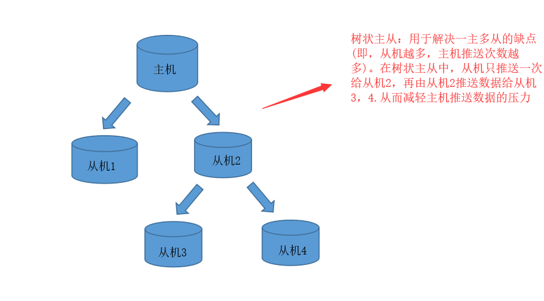

[toc]

# Redis基础

## 1. NOSQL

**nosql一般指非关系型数据库。nosql数据库就是为了解决大规模数据集合的存储问题。**

NOSQL数据库相比传统的关系型数据库有许多优点：
1. 易扩展，nosql数据库中数据与数据之间无关系，导致为数据库添加新的数据时，容易扩展。
2. 大数据量高性能：nosql数据库由于数据之间的无关系性，因此在大数据量的情况下有非常高的读写性能。
3. 灵活的数据模型：nosql无须为存储的数据建立字段。随时可以定义新的数据格式。

## 2.Redis的介绍

Redis: Remote Dictionary Server (远程字典服务器)
Redis是一个开源的、使用C语言编写的、支持网络交互的、可基于内存也可持久化的Key-Value数据库，是NOsql数据库之一。

Redis的特点：
1. 支持数据持久化，把内存的数据保存在磁盘中，重启的时候可以再次加载出来。
2. 不仅仅支持 key-value类型的数据，还支持list,set,zset,hash等数据结构的存储。
3. redis支持数据备份，即主从模式的数据备份。

## 3.Redis的安装

1. 从redis官网中下载的redis源码包 “redis-5.0.4.tar.gz”
2. 把源码包放到linux系统下的专门存放第三方应用程序的文件夹 /usr 或 /opt 下。
3. 解压源码包后会出现文件夹redis-5.0.4。
4. 进入到解压后的redis-5.0.4文件后，打开终端，**在redis-5.0.4文件目录下运行 make 命令,开始编译redis-5.0.4文件，把它编译为二进制数据包。**
5. 接着执行 make install 命令，一般编译后的redis文件会放在 /usr/local 目录下。
6. 新建一个myredis文件，并把redis-5.0.4 文件中的redis.conf 拷贝到myredis文件中。
7. 用Vim文本编辑器修改myredis文件中redis.conf。命令：“ vim redis.conf ”。
注意，该redis.conf可能为只读文件，需要用sudo命令来打开vim进行编辑
" sudo vim redis.conf "
8. 把配置文件中的 daemonize no 改为 daemonize yes
9. 退出vim编辑器，并保存文件。命令“ ：wq ”

<h4>Redis 的启动：</h4>

进入先前编译的redis-5.0.4/bin/ 目录下

<h5>前端启动：</h5>

直接输入命令：“ ./redis-server ”,启动效果如下。


前端启动的缺点是启动完成之后，不能再进行其他操作，如果操作必须使用ctrl+c，同时redis-server程序结束，不推荐这种开启方式。

<h5>后端启动：</h5>

执行命令“ ./redis-server ../myredis/redis.conf”，即可启动redis服务端.
然后输入命令" ./redis-cli " 即可进入客户端进行操作。
再输入命令" ping ",如果redis 回应 " pong ",表示redis启动成功

<font color="red">../myredis/redis.conf 是存放备份的redis配置文件，尽量不要动原有的配置文件。</font>


<h4>退出redis</h4>

从客户端进入redis之后，输入exit退出


## 4.Redis 基础

### 1.Redis基础知识

1. redis的默认端口是6379
2. 默认有16个数据库（0-15），初试默认使用0号数据库
3. 16个数据库的密码相同。
4. 应用场景：缓存，取最新N个数据的操作，排行榜应用,取TOP N 操作等

### 2.Redis基础命令

1. set 命令：在当前数据库中设置一个键值对。之前有的会覆盖
> set k1 hello
>//设置一个 key="k1",value="hello"的键值对
2. get 命令：通过key值，获取当前数据库的对于的value值。
>get k1
>"hello"
3. select 命令：切换数据库。一共有16个数据库（0-15）
>select 2
>//切换到2号数据库
4. dbsize 命令：查看当前数据库的key的数量。
>dbsize
>1
>//表示当前这个数据库只有一个键值对
5. flushdb 命令：删除当前数据库的所以key-value
>flushdb
6. flushdb 命令：删除所以（16个）数据库的所以key-value
>flushall
7. keys * 命令：查询当前数据库的所以键值对
>keys *
>"ks"
>"k1"
>"k2"
>"qwe"
>//表示当前数据库的键值对有"ks"。
8. keys ？ 命令：通过占位符查询特定的key
>keys k?
>"ks"
>"k1"
>"k2"
>//查询当前数据库的以k为首字符的key

**其他基础命令**

命令 | 功能
---- | ---- 
DEL key | 此命令删除一个指定键(如果存在)。
DUMP key | 此命令返回存储在指定键的值的序列化版本。
EXISTS key | 此命令检查键是否存在。
TTL key | 以秒为单位，返回给定 key 的剩余生存时间(TTL, time to live)。-1表示永不过期，-2表示已经过期。
TYPE key | 返回存储在键中的值的数据类型
KEYS pattern | 查找与指定模式匹配的所有键。
MOVE key db | 将键移动到另一个数据库。
PERSIST key | 删除指定键的过期时间，得永生。
RANDOMKEY | 从Redis返回一个随机的键。
RENAME key newkey  | 更改键的名称。
PTTL key | 以毫秒为单位返回 key 的剩余的过期时间。
RENAMENX key newkey | 如果新键不存在，重命名键。
EXPIRE key seconds | 设置键在指定时间秒数之后到期/过期。
EXPIREAT key timestamp | 设置在指定时间戳之后键到期/过期。这里的时间是Unix时间戳格式。
PEXPIRE key milliseconds | 设置键的到期时间(以毫秒为单位)。
PEXPIREAT key milliseconds-timestamp | 以Unix时间戳形式来设置键的到期时间(以毫秒为单位)。


## 5.五大数据类型

### 1.string(字符串)---(K,V)

string类型是redis支持的最基本的数据类型。redis的string数据类型可以存储图片或序列化对象。并且redis的每个字符串的value最多可以存储512M.

<h4>redis字符串命令</h4>

命令 | 功能
---- | ---- 
append key value | 如果 key 已经存在并且是一个字符串，该命令将指定的 value 追加到该 key 原来值（value）的末尾。
strlen key | 返回 key 所储存的字符串值的长度。
getset key value | 先get返回key的旧值,再覆盖 key 的值为 value。
incr key | 将 key 中储存的数字值增一。(注意必须是数字才能进行加减)
incrby key num | 将 key 所储存的值加上给定的num值。(注意必须是数字才能进行加减)
decr key | 将 key 中储存的数字值减一。(注意必须是数字才能进行加减)
decrby key num | key 所储存的值减去给定的num值 。 (注意必须是数字才能进行加减)
getrange key num1 num2 | 获取指定区间范围（num1-num2）的值
setrange key offset value | 从偏移量 offset 开始,重新设置key的值（会覆盖）。 
setex key seconds value | 设置键值对 ，并将 key 的过期时间设为 seconds (以秒为单位)。
setnx key value | 当key不存在时，设置键值对。用于避免set命令导致的覆盖
mget key1 [key2..] | 返回(一个或多个) key 的值。
mset key value [key value ...] | 同时设置一个或多个 key-value。
msetnx key value [key value ...] | 同时设置一个或多个 key-value 对，当且仅当所有给定 key 都不存在。

```
127.0.0.1:6379> set k1 qwe
127.0.0.1:6379> append k1 rt
127.0.0.1:6379> get k1
"qwert"

127.0.0.1:6379> strlen k1
(integer) 5

127.0.0.1:6379> getset k1 abc
"qwert"
127.0.0.1:6379> get k1
"abc"

127.0.0.1:6379> getrange k1 0 1
"ab"

127.0.0.1:6379> setrange k1 0 xx
127.0.0.1:6379> get k1
"xxc"

127.0.0.1:6379> mset k2 v2 k3 v3
OK
127.0.0.1:6379> mget k1 k2 k3
1) "xxc"
2) "v2"
3) "v3"

127.0.0.1:6379> set k4 10
OK
127.0.0.1:6379> incr k4
(integer) 11
127.0.0.1:6379> incr k4
(integer) 12
127.0.0.1:6379> decr k4
(integer) 11

127.0.0.1:6379> incrby k4 5
(integer) 16
127.0.0.1:6379> decrby k4 5
(integer) 11

```

### 2.list 列表---(K,V)

Redis列表是简单的字符串列表，按照插入顺序排序。你可以添加一个元素到**列表的头部（左边）或者尾部（右边）。**

redis中list的特点：
1. 若键不存在，则新创建list
2. 若键存在，则修改list
3. 若列表中的内容全部移除，则对于的键就消失了。

<h4>关于list的命令</h4>

命令      | 功能
----     | ---- 
lpush key value1 [value2] | 将多个值插入到列表头部
lpushx key value | 将一个值插入到已存在的列表头部
rpush key value1 [value2] | 在列表中添加多个值
rpushx key value | 为已存在的列表添加一个值
lindex key index | 通过索引获取列表中的元素
lrange key start stop | 获取列表范围内(start-stop)的元素，从0~-1表示全部
linsert key before/after pivot value | 在列表的pivot元素前（后）插入value元素
llen key | 获取列表长度
lpop key | 移除并返回栈顶元素
rpop key | 移除并返回栈底元素
lrem key count value | 移除列表中的count个value值
ltrim key start stop | 对列表进行修剪(trim)，让列表只保留指定区间内的元素，其余元素删除。
rpoplpush source target | 移除source列表的栈底元素，并将该元素添加到target列表的栈顶
lset key index value  | 重新设置列表索引元素的值
blpop key1 [key2] timeout | 移出并获取列表的第一个元素， 如果列表没有元素会阻塞列表直到等待超时或发现可弹出元素为止。
brpop key1 [key2] timeout | 移出并获取列表的最后一个元素， 如果列表没有元素会阻塞列表直到等待超时或发现可弹出元素为止。
brpoplpush source target timeout | 从source列表中弹出一个值，将弹出的元素插入到target列表中并返回它； 如果列表没有元素会阻塞列表直到等待超时或发现可弹出元素为止。

<font color="red">

lrange k1 0 -1 
//表示显示k1列表的全部元素，从0~-1表示全部

lpush k1 1 2 3 4 5 
//表示从从左到右开始进栈。 进栈顺序：1-2-3-4-5.所以下面代码中是 1 为栈底

rpush k2 1 2 3 4 5
//表示从右到左开始进栈。进栈顺序：5-4-3-2-1。所以下面代码中是 5为栈底

</font>

```
127.0.0.1:6379> lpush k1 1 2 3 4 5
(integer) 5
127.0.0.1:6379> lrange k1 0 -1
1) "5"
2) "4"
3) "3"
4) "2"
5) "1"
127.0.0.1:6379> lrange k1 0 1
1) "5"
2) "4"
127.0.0.1:6379> lindex k1 0
"5"
127.0.0.1:6379> llen k1
(integer) 5
127.0.0.1:6379> lpop k1
"5"

-------------------

127.0.0.1:6379> rpush k2 1 2 3 4 5
(integer) 5
127.0.0.1:6379> lrange k2 0 -1
1) "1"
2) "2"
3) "3"
4) "4"
5) "5"
127.0.0.1:6379> lpop k2
"1"
127.0.0.1:6379> rpop k2 
"5"
127.0.0.1:6379> lrange k2 0 -1
1) "2"
2) "3"
3) "4"
127.0.0.1:6379> lrem k2 1 2     //删除k2列表中的 1 个 2 元素
(integer) 1
127.0.0.1:6379> lrange k2 0 -1
1) "3"
2) "4"

--------------------------

127.0.0.1:6379> del k1   //删除之前的k1列表
(integer) 1
127.0.0.1:6379> lpush k1 1 2 3 4 5 6 7 8   //重新设置k1列表
(integer) 8
127.0.0.1:6379> ltrim k1 0 4      //截取k1列表中从栈顶开始计算的 0-4 个元素
OK
127.0.0.1:6379> lrange k1 0 -1
1) "8"
2) "7"
3) "6"
4) "5"
5) "4"

127.0.0.1:6379> rpoplpush k2 k1     //从k2列表中取出栈底元素，放到k1列表的栈顶上
"4"
127.0.0.1:6379> lrange k1 0 -1
1) "4"
2) "8"
3) "7"
4) "6"
5) "5"
6) "4" 

127.0.0.1:6379> lset k1 0 9     //重新设置k1列表栈顶元素为9
OK
127.0.0.1:6379> lrange k1 0 -1
1) "9"
2) "8"
3) "7"
4) "6"
5) "5"
6) "4"

127.0.0.1:6379> linsert k1 before 8 p    //在k1列表的8元素前插入p元素
(integer) 7
127.0.0.1:6379> lrange k1 0 -1
1) "9"
2) "p"
3) "8"
4) "7"
5) "6"
6) "5"
7) "4"

```


### 3.set 集合---(K,V)

Redis 的 Set 是 String 类型的无序集合。集合成员是唯一的，即不能出现重复的数据。

<h4>关于set的命令</h4>

命令      | 功能
----     | ---- 
sadd key member1 [member2] | 向集合添加多个成员
smembers key | 返回集合中的所有成员
sismember key member | 判断集合key中是否有 member 元素
srandmember key [count] | 随机返回集合中多个随机数
scard key | 获取集合中的元素个数
srem key member1 [member2] | 移除集合中多个成员
spop key | 随机取出集合中的一个元素
smove s1 s2 member | 把s1集合中的member元素移到s2集合中
sdiff key1 [key2] | 返回在key1集合不在key2集合中的元素（差集）
sdiffstore target key1 [key2] | 把key1,key2集合的差集存储在target集合中
sinter key1 [key2] | 返回key1集合与key2集合的交集元素
sinterstore target key1 [key2] | 把交集并存储在target集合中
sunion key1 [key2] | 返回所有给定集合的并集
sunionstore target key1 [key2] | 把并集存储在target集合中

```
127.0.0.1:6379> sadd set1 1 2 3 4 5    //添加元素到set1集合中
(integer) 5    
127.0.0.1:6379> smembers set1      //返回set1集合中的所有元素
1) "1"
2) "2"
3) "3"
4) "4"
5) "5"
127.0.0.1:6379> sadd set1 1 2 6    //再往集合set1中添加元素 1 2 6
(integer) 1                        //结果显示添加成功1次
127.0.0.1:6379> smembers set1      //只有6添加进去，1 2 元素重复
1) "1"
2) "2"
3) "3"
4) "4"
5) "5"
6) "6"
127.0.0.1:6379> sismember set1 2     //判断 set1集合中是否有2元素
(integer) 1
127.0.0.1:6379> sismember set1 7     //判断 set1集合中是否有7元素
(integer) 0

127.0.0.1:6379> srandmember set1    //返回集合中的一个随机数
"5"
127.0.0.1:6379> srandmember set1 2
1) "6"
2) "2"

-----------------------

127.0.0.1:6379> sadd set2 5 6 7 8 9
(integer) 5
127.0.0.1:6379> smembers set2
1) "5"
2) "6"
3) "7"
4) "8"
5) "9"
127.0.0.1:6379> smembers set1
1) "1"
2) "2"
3) "3"
4) "4"
5) "5"
6) "6"
127.0.0.1:6379> sdiff set1 set2  //返回在set1集合中，不再set2集合中的元素
1) "1"
2) "2"
3) "3"
4) "4"

127.0.0.1:6379> sdiffstore set3 set1 set2   //把set1 与set2的插集的元素，存储在set3中
(integer) 4
127.0.0.1:6379> smembers set3
1) "1"
2) "2"
3) "3"
4) "4"

127.0.0.1:6379> sinter set1 set2    //返回set1集合与set2集合中的交集元素
1) "5"
2) "6"
127.0.0.1:6379> sunion set1 set2   //返回set1集合与set2集合中的并集元素
1) "1"
2) "2"
3) "3"
4) "4"
5) "5"
6) "6"
7) "7"
8) "8"
9) "9"

```

### 4.哈希(Hash)---(K,(K,V))

Redis hash 是一个string类型的field和value的映射表，hash特别适合用于存储对象。

<font color="red">
在redis的hash中，key 是键，value 是另一个键值对。即value是一个map
</font>

<h4>关于Hash的命令</h4>

命令  | 功能
----  | ---- 
hset key field value | 将哈希表 key 中的字段 field 的值设为 value 。
hget key field | 获取哈希表key中field字段的值。
hmset key field1 value1 [field2 value2 ] | 同时设置多个field-value到哈希表 key 中。
hmget key field1 [field2] | 获取所有给定字段的值
hgetall key | 获取在哈希表中的所有字段和值
hdel key field1 [field2] | 删除多个哈希表字段
hkeys key | 获取哈希表中的字所有字段
hvals key | 获取哈希表中所有值
hlen key | 获取哈希表中字段的数量 
hexists key field | 查看哈希表key中指定的字段是否存在。
hincrby key field num | 为表key中的指定字段的整数值加上增量num。
hincrbyfloat key field num | 为表key中的指定字段的浮点数值加上增量num 。
hsetnx key field value | 只有在字段 field 不存在时，设置哈希表字段的值。


```
127.0.0.1:6379> hset user id 1    //设置一个user的hash表，表中有id字段，且id字段的值为1
(integer) 1
127.0.0.1:6379> hget user id     //返回user这个hash表中id的字段的值
"1"
127.0.0.1:6379> hgetall user    //返回user这个hash表的所有内容
1) "id"
2) "1"

127.0.0.1:6379> hmset user id 1 name shu age 12    //设置hash表user的字段有id,name,age
OK
127.0.0.1:6379> hmget user id name age
1) "1"
2) "shu"
3) "12"
127.0.0.1:6379> hgetall user         //获取所有hash表user的内容
1) "id"
2) "1"
3) "name"
4) "shu"
5) "age"
6) "12"
127.0.0.1:6379> hdel user age    //删除hash表user中age字段
(integer) 1
127.0.0.1:6379> hgetall user
1) "id"
2) "1"
3) "name"
4) "shu"

127.0.0.1:6379> hkeys user   //获取表中所有字段
1) "id" 
2) "name"
127.0.0.1:6379> hvals user   //获取表中所有值
1) "1"
2) "shu"

127.0.0.1:6379> hexists user age     //判断表中是否有指定的字段
(integer) 0                          //0表示没有，1表示有
127.0.0.1:6379> hexists user name
(integer) 1

127.0.0.1:6379> hset user age 10      //在表中设置age字段，值为10
(integer) 1
127.0.0.1:6379> hincrby user age 5      //给age字段的值加上5
(integer) 15

```

### 5.Zset,有序集合(sorted set)

Redis 有序集合和集合一样也是string类型元素的集合,且不允许重复的成员。
有序集合中每个元素都会关联一个double类型的分数（score）。redis正是通过分数来为集合中的成员进行从小到大的排序。
有序集合的成员是唯一的,但分数(score)却可以重复。

<font color="red">

有序集合在集合set的基础上，给每个元素都关联了一个score值。
之前的set是(K,(v1,v2,v3,...))
现在的有序集合是(K,((score1,v1),(score2,v2),(score3,v3)....) ,其中(score1,v1)是键值对
 
</font>    

<h4>关于有序集合的命令</h4>

 命令  | 功能 
----  | ---- 
zadd key score1 member1 [score2 member2] | 向有序集合添加多个成员，或者更新已存在成员的分数
zcard key | 获取有序集合的成员数
zcount key min max | 计算在有序集合中指定区间分数的成员数
zscore key member | 返回有序集合中member成员的分数值
zrank key member | 返回指定成员的下标值（索引），从0开始
zrevrank key member | 逆序获得下标值。
zrange key start stop [withscores] | 返回有序集合中指定区间内的成员
zrangebyscore key min max [withscores] [limit] | 通过分数返回有序集合指定区间内的成员
zrevrange key start stop | 逆序返回指定区间内的成员
zrevrangebyscore key max min | 逆序返回指定分数区间内的成员（通过分数从高到低排序）
zrem key member [member ...] | 移除有序集合的多个成员
zremrangebyrank key start stop | 移除有序集合中给定索引的所有成员
zremrangebyscore key min max | 移除有序集合中给定分数区间的所有成员
zincrby key num member | 有序集合中对指定成员的分数加上增量 num
zinterscore target numkeys key [key ...] | 计算给定的多个有序集的交集并存储在新的有序集合target中
zunionstore target numkeys key [key ...] | 计算给定的多个有序集的并集，并存储在新的target中
```

127.0.0.1:6379> zadd zset1 10 user1 20 user2 40 user4   //设置有序集合zset1,其中10分的是user1,....
(integer) 3
127.0.0.1:6379> zrange zset1 0 -1    //返回指定范围的有序集合的内容
1) "user1"
2) "user2"
3) "user4"
127.0.0.1:6379> zrange zset1 0 -1 withscores    //返回指定范围的有序集合的内容，带分数
1) "user1"
2) "10"
3) "user2"
4) "20"
5) "user4"
6) "40"

127.0.0.1:6379> zrangebyscore zset1 10 40     //找出10分到40分的元素成员
1) "user1"
2) "user2"
3) "user4"
127.0.0.1:6379> zrangebyscore zset1 10 40 limit 0 2      //找出10分到40分的，从第0个开始选2个元素出来
1) "user1"
2) "user2"

127.0.0.1:6379> zcard zset1     //返回有序集合的成员数
(integer) 3
127.0.0.1:6379> zcount zset1 10 40   //返回有序集合中的10-40分的成员数
(integer) 3

```

## 6.Redis配置文件(redis.conf)

<h4>通用配置文件：</h4>

配置项 | 说明
---- | ---- 
daemonize no | Redis 默认为no，使用 yes 启用守护进程运行（Windows 不支持守护线程的配置为 no ） 
pidfile /var/run/redis.pid | 当 Redis 以守护进程方式运行时，Redis 默认会把 pid 写入 /var/run/redis.pid 文件，可以通过 pidfile 指定 
port 6379 | Redis默认端口为 6379.
databases 16 | 设置数据库的数量.
bind 127.0.0.1 | 绑定的主机地址 
timeout 300 | 当客户端闲置多长时间后关闭连接，如果指定为 0，表示关闭该功能 
loglevel notice | 指定日志记录级别，Redis 总共支持四个级别：debug、verbose、notice、warning，默认为 notice 
logfile stdout | 日志记录方式，默认为标准输出，如果配置 Redis 为守护进程方式运行，而这里又配置为日志记录方式为标准输出，则日志将会发送给 /dev/null 
save seconds changes | Redis 默认配置文件中提供了三个条件save 900 1,save 300 10,save 60 10000指定在多长时间内，有多少次更新操作，就将数据同步到数据文件，可以多个条件配合.
rdbcompression yes | 指定存储至本地数据库时是否压缩数据，默认为yes，关闭该选项可能会导致数据库文件变的巨大
dbfilename dump.rdb | 指定本地数据库文件名，默认值为 dump.rdb 
dir ./ | 指定本地数据库存放目录 
slaveof masterip masterport | 设置当本机为slav服务时，设置 master 服务的 IP 地址及端口，在 Redis 启动时，它会自动从 master 进行数据同步 
masterauth master-password | 当 master 服务设置了密码保护时，slav 服务连接 master 的密码 
requirepass foobared | 设置连接密码，如果配置了连接密码，客户端在连接 Redis 时需要通过 AUTH password 命令提供密码，默认关闭 
maxclients 128 | 设置同一时间最大客户端连接数，默认无限制，如果设置 maxclients 0，表示不作限制。当客户端连接数到达限制时，Redis 会关闭新的连接并向客户端返回 max number of clients reached 错误信息
maxmemory bytes | 指定最大内存限制，Redis 会把数据加载到内存中，达到最大内存后，Redis 会先尝试清除已到期或即将到期的 Key，当此方法处理 后，仍然到达最大内存设置，将无法再进行写入操作，但仍然可以进行读取操作。
appendonly no | 指定是否在每次更新操作后进行日志记录。默认为 no。
appendfilename appendonly.aof | 指定更新日志文件名，默认为 appendonly.aof。

## 7.Redis的持久化

redis的持久化就是把Reid存储在内存的数据放到硬盘上。

Redis提供了两种将数据定期自动持久化至硬盘的方法，包括RDB和AOF两种方法。

### 1.RDB持久化

RDB持久化是指在指定的时间间隔内将内存中的数据集快照写入磁盘。其也是默认的持久化方式，这种方式是就是将内存中数据以快照的方式写入到二进制文件中,文件名为dump.rdb。

>配置redis进行间隔时间内持久化的方式：（<font color="red">在redis.conf配置文件中</font>）

```
save 900 1     #表示900秒内如果超过1个key被修改，则发起数据快照保存
save 300 10    #表示300秒内容如超过10个key被修改，则发起数据快照保存
```

<h4>RDB持久化的优点与缺点</h4>

>优点：
1. 一旦采用该方式，你的整个Redis数据库将只包含一个文件，方便进行备份。
2. 使用RDB文件进行数据恢复比使用AOF要快很多。
3. RDB 可以最大化 Redis 的性能：父进程在保存 rdb 文件时唯一要做的就是 fork 出一个子进程，然后这个子进程就会处理接下来的所有保存工作，父进程无须执行任何磁盘 I/O 操作。

>缺点：
1. 快照是定期生成的，并且一次快照时间较长。所以在Redis 崩溃时或多或少会丢失一部分数据。
2. 如果数据集非常大，Redis在fork子进程，并进行快照时可能会消耗相对较长的时间，影响Redis对外提供服务的能力。


### 2.AOF持久化

采用AOF持久方式时，Redis会把每一个写的请求都记录在一个aof日志文件(默认是 appendonly.aof)里。在Redis重启时，会把aof文件中记录的所有写操作顺序执行一遍，确保数据恢复到最新。AOF默认是关闭的.

>配置redis打开AOF持久化方式（在redis.conf 配置文件中）： appendonly yes

在AOF持久化方式中，可以通过配置文件中的fsync函数强制os写入到磁盘的时机。fsync函数有三种方式如下：

```
appendonly yes           //启用aof持久化方式

appendfsync everysec     //交由后台线程每秒fsync一次，在性能和持久化方面做了很好的折中，默认推荐

# appendfsync always     //每写入一条日志就进行一次fsync操作，数据安全性最高，但速度最慢

# appendfsync no        //将flush文件的时机交给OS决定，性能最好,持久化没保证

```

随着AOF不断地记录写操作日志，因为所有的操作都会记录，所以必定会出现一些无用的日志。
Redis提供了AOF rewrite功能，可以重写AOF文件，只保留能够把数据恢复到最新状态的最小写操作集。

>auto-aof-rewrite-percentage 100auto-aof-rewrite-min-size 64mb

上面含义是，Redis在每次AOF rewrite时，会记录完成rewrite后的AOF日志大小，当AOF日志大小在该基础上增长了100%后，自动进行AOF rewrite。同时如果增长的大小没有达到64mb，则不会进行rewrite。

<h4>AOF持久化的优点与缺点</h4>

>优点：
1. AOF文件在发生断电等问题时也不会损坏，即使出现了某条日志只写入了一半的情况，也可以使用redis-check-aof工具轻松修复。
2. AOF文件易读，可修改，在进行了某些错误的数据清除操作后，只要AOF文件没有rewrite，就可以把AOF文件备份出来，把错误的命令删除，然后恢复数据。

>缺点：
1. AOF文件通常比RDB文件更大
2. 性能消耗比RDB高
3. 数据恢复速度比RDB慢


---

## 8.Redis事务

>redis事务从开始到执行会经历三个阶段：事务开始（以MULTI为标志）-> 命令入队-> 事务执行（通过EXEC执行）

<h4>事务命令</h4>

命令 | 描述
---- | ---- 
multi | 标记一个事务块的开始。
exec | 执行所有事务块内的命令。
discard | 取消事务，放弃执行事务块内的所有命令。
unwatch | 取消 watch 命令对所有 key 的监视。
watch key [key ...] | 监视多个key ，如果在事务执行之前这些key有所改动，则事务将被打断。

<font color="red">
注意：当在事务中，编写命令过程中出错，则整个事务就已经无法执行了。
</font>

```
127.0.0.1:6379> multi    //标志事务的开始
OK
127.0.0.1:6379> set k1 xiaoming
QUEUED
127.0.0.1:6379> set k2 xiaohei
QUEUED
127.0.0.1:6379> set k3 xiaohong
QUEUED
127.0.0.1:6379> mget k1 k2 k3
QUEUED
127.0.0.1:6379> exec    //执行事务，下面是执行结果
1) OK
2) OK
3) OK
4) 1) "xiaoming"
   2) "xiaohei"
   3) "xiaohong"

---------------------------

127.0.0.1:6379> multi
OK
127.0.0.1:6379> set k3 v3
QUEUED
127.0.0.1:6379> set k4 v4
QUEUED
127.0.0.1:6379> getset k5    
(error) ERR wrong number of arguments for 'getset' command     //由于这个命令在编写过程中出现错误，因此整个事务都无法执行了
127.0.0.1:6379> set k5 v5
QUEUED
127.0.0.1:6379> exec
(error) EXECABORT Transaction discarded because of previous errors.   //exec事务执行命令失败

```

## 9.发布订阅

Redis 发布订阅(pub/sub)是一种消息通信模式：发送者(pub)发送消息，订阅者(sub)接收消息。Redis 客户端可以订阅任意数量的频道。

<h4>发布订阅命令</h4>

命令 | 描述
---- | ---- 
pubsub subcommand [argument [argument ...]] | 查看订阅与发布系统状态。
subscribe channel [channel ...] | 订阅多个频道。
publish channel message | 将信息发送到指定的频道。
unsubscribe [channel [channel ...]] | 退订给定的频道。
psubscribe pattern [pattern ...] | 订阅多个符合给定模式的频道
punsubscribe [pattern [pattern ...]] | 退订所有给定模式的频道。

> 1.我们先订阅一个c1 频道

```
127.0.0.1:6379> subscribe c1
Reading messages... (press Ctrl-C to quit)
1) "subscribe"
2) "c1"
3) (integer) 1
```

> 2.再重新开启个redis客户端，然后在c1频道发布消息，订阅者就能接收到消息。

```
127.0.0.1:6379> publish c1 "hello c1"
(integer) 1

```

> <font color="red">3.再回到之前的订阅c1频道的redis客户端,会发现多出了几行信息。</font>

```
127.0.0.1:6379> subscribe c1
Reading messages... (press Ctrl-C to quit)
1) "subscribe"
2) "c1"
3) (integer) 1
1) "message"      //从这里开始就是另一个客户端向c1频道发布的信息
2) "c1"
3) "hello c1"
```


---

## 10.Redis主从复制

主从复制：即主机数据进行更新后，根据配置和策略。自动将主机的数据同步到从机上的master/slaver机制。其中主机以写入数据为主，从机以读取数据为主。

主从复制的几种方式：





<font color="blue">
以一主两从的方式为举例：

1. 当主机死了，这是两个从机还是slave的身份。若主机又活力，从机还是slave身份。
2. 当从机死了，当重启从机时，从机会变成 master身份。需要重新与主机建立主从联系。
   除非之前已经把主机信息，写进了从机的配置文件中。

</font>


<h3>主从reids的配置：</h3>

> 1. 主机redis 配置

无需特殊配置。默认为6379端口。

> 2. 从机redis配置

1. 复制两个redis.conf文件，并命名为redis6380.conf和redis6381.conf。这是两个从机的配置文件。
2. 设置daemonize，和pid文件。
3. 更改从配置文件的指定端口，分别为6380，6381
4. 更改log文件。
5. 更改从机的备份文件

```
#这是6380从机的配置文件更改
daemonize yes
pidfile /var/run/redis6380.pid
port 6380
logfile 6380.log
dbfilename dump6380.rdb
```

> 3. 建立从机与主机的关联

方式①：

在从机的配置文件（redis6380.conf和redis6381.conf）中配置这一行。

```
slaveof 主机IP 主机端口

#例如：slaveof 127.0.0.1 6379。
#说明当前该从 redis 服务器所对应的主 redis 是127.0.0.1，端口是6379。
```


方式②：打开从机的redis 命令行，输入 slaveof host port 命令，然后同步就会开始：

```
127.0.0.1:6380> slaveof 127.0.0.1 6379
ok
```

主从复制建立后，从节点默认使用”slave-read-only=yes”配置为只读模式，如果修改从节点的只读配置，会导致主从数据不一致。==


> 4. 查看redis的的主从复制信息。输入命令```info replication```

```
#主机查看信息
127.0.0.1:6379> info replication
# Replication
role:master
...

#从机6380查看信息
127.0.0.1:6380> info replication
# Replication
role:slave
...

#从机6381查看信息
127.0.0.1:6381> info replication
# Replication
role:slave
...

```

> 5. 主从联系断开

在从机命令窗口中输入命令：
```
127.0.0.1:6380> slaveof no one
#就可以端口这个6380从机与主机的关联
```

<font color="red">

1. 若主节点故障，从节点执行 slaveof no one 后将会变成新主节点；
2. 这时其它的节点成为新主节点的从节点，并从新节点复制数据；

</font>


 
> 6. 主从复制中切主操作

在从机命令窗口中输入命令：
```
127.0.0.1:6380> slave newMasterIP newMmasterPort
# slave 127.0.0.1 6381
# 切换6381为新主redis
```

主从复制切主命令同建立主从复制的命令一样，切主后从节点会清空之前所有的数据。在生产生谨慎使用。
