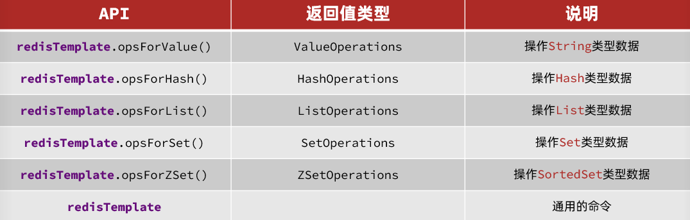

[toc]

# Redis基础

## 7.Redis的持久化

redis的持久化就是把Reid存储在内存的数据放到硬盘上。

Redis提供了两种将数据定期自动持久化至硬盘的方法，包括RDB和AOF两种方法。

### 1.RDB持久化

RDB持久化是指在指定的时间间隔内将内存中的数据集快照写入磁盘。其也是默认的持久化方式，这种方式是就是将内存中数据以快照的方式写入到二进制文件中,文件名为dump.rdb。

>配置redis进行间隔时间内持久化的方式：（<font color="red">在redis.conf配置文件中</font>）

```
save 900 1     #表示900秒内如果超过1个key被修改，则发起数据快照保存
save 300 10    #表示300秒内容如超过10个key被修改，则发起数据快照保存
```

<h4>RDB持久化的优点与缺点</h4>

>优点：
1. 一旦采用该方式，你的整个Redis数据库将只包含一个文件，方便进行备份。
2. 使用RDB文件进行数据恢复比使用AOF要快很多。
3. RDB 可以最大化 Redis 的性能：父进程在保存 rdb 文件时唯一要做的就是 fork 出一个子进程，然后这个子进程就会处理接下来的所有保存工作，父进程无须执行任何磁盘 I/O 操作。

>缺点：
1. 快照是定期生成的，并且一次快照时间较长。所以在Redis 崩溃时或多或少会丢失一部分数据。
2. 如果数据集非常大，Redis在fork子进程，并进行快照时可能会消耗相对较长的时间，影响Redis对外提供服务的能力。


### 2.AOF持久化

采用AOF持久方式时，Redis会把每一个写的请求都记录在一个aof日志文件(默认是 appendonly.aof)里。在Redis重启时，会把aof文件中记录的所有写操作顺序执行一遍，确保数据恢复到最新。AOF默认是关闭的.

>配置redis打开AOF持久化方式（在redis.conf 配置文件中）： appendonly yes

在AOF持久化方式中，可以通过配置文件中的fsync函数强制os写入到磁盘的时机。fsync函数有三种方式如下：

```
appendonly yes           //启用aof持久化方式

appendfsync everysec     //交由后台线程每秒fsync一次，在性能和持久化方面做了很好的折中，默认推荐

# appendfsync always     //每写入一条日志就进行一次fsync操作，数据安全性最高，但速度最慢

# appendfsync no        //将flush文件的时机交给OS决定，性能最好,持久化没保证

```

随着AOF不断地记录写操作日志，因为所有的操作都会记录，所以必定会出现一些无用的日志。
Redis提供了AOF rewrite功能，可以重写AOF文件，只保留能够把数据恢复到最新状态的最小写操作集。

>auto-aof-rewrite-percentage 100auto-aof-rewrite-min-size 64mb

上面含义是，Redis在每次AOF rewrite时，会记录完成rewrite后的AOF日志大小，当AOF日志大小在该基础上增长了100%后，自动进行AOF rewrite。同时如果增长的大小没有达到64mb，则不会进行rewrite。

<h4>AOF持久化的优点与缺点</h4>

>优点：
1. AOF文件在发生断电等问题时也不会损坏，即使出现了某条日志只写入了一半的情况，也可以使用redis-check-aof工具轻松修复。
2. AOF文件易读，可修改，在进行了某些错误的数据清除操作后，只要AOF文件没有rewrite，就可以把AOF文件备份出来，把错误的命令删除，然后恢复数据。

>缺点：
1. AOF文件通常比RDB文件更大
2. 性能消耗比RDB高
3. 数据恢复速度比RDB慢


---

## 8.Redis事务

>redis事务从开始到执行会经历三个阶段：事务开始（以MULTI为标志）-> 命令入队-> 事务执行（通过EXEC执行）

<h4>事务命令</h4>

命令 | 描述
---- | ---- 
multi | 标记一个事务块的开始。
exec | 执行所有事务块内的命令。
discard | 取消事务，放弃执行事务块内的所有命令。
unwatch | 取消 watch 命令对所有 key 的监视。
watch key [key ...] | 监视多个key ，如果在事务执行之前这些key有所改动，则事务将被打断。

<font color="red">
注意：当在事务中，编写命令过程中出错，则整个事务就已经无法执行了。
</font>

```
127.0.0.1:6379> multi    //标志事务的开始
OK
127.0.0.1:6379> set k1 xiaoming
QUEUED
127.0.0.1:6379> set k2 xiaohei
QUEUED
127.0.0.1:6379> set k3 xiaohong
QUEUED
127.0.0.1:6379> mget k1 k2 k3
QUEUED
127.0.0.1:6379> exec    //执行事务，下面是执行结果
1) OK
2) OK
3) OK
4) 1) "xiaoming"
   2) "xiaohei"
   3) "xiaohong"

---------------------------

127.0.0.1:6379> multi
OK
127.0.0.1:6379> set k3 v3
QUEUED
127.0.0.1:6379> set k4 v4
QUEUED
127.0.0.1:6379> getset k5    
(error) ERR wrong number of arguments for 'getset' command     //由于这个命令在编写过程中出现错误，因此整个事务都无法执行了
127.0.0.1:6379> set k5 v5
QUEUED
127.0.0.1:6379> exec
(error) EXECABORT Transaction discarded because of previous errors.   //exec事务执行命令失败

```

## 9.发布订阅

Redis 发布订阅(pub/sub)是一种消息通信模式：发送者(pub)发送消息，订阅者(sub)接收消息。Redis 客户端可以订阅任意数量的频道。

<h4>发布订阅命令</h4>

命令 | 描述
---- | ---- 
pubsub subcommand [argument [argument ...]] | 查看订阅与发布系统状态。
subscribe channel [channel ...] | 订阅多个频道。
publish channel message | 将信息发送到指定的频道。
unsubscribe [channel [channel ...]] | 退订给定的频道。
psubscribe pattern [pattern ...] | 订阅多个符合给定模式的频道
punsubscribe [pattern [pattern ...]] | 退订所有给定模式的频道。

> 1.我们先订阅一个c1 频道

```
127.0.0.1:6379> subscribe c1
Reading messages... (press Ctrl-C to quit)
1) "subscribe"
2) "c1"
3) (integer) 1
```

> 2.再重新开启个redis客户端，然后在c1频道发布消息，订阅者就能接收到消息。

```
127.0.0.1:6379> publish c1 "hello c1"
(integer) 1

```

> <font color="red">3.再回到之前的订阅c1频道的redis客户端,会发现多出了几行信息。</font>

```
127.0.0.1:6379> subscribe c1
Reading messages... (press Ctrl-C to quit)
1) "subscribe"
2) "c1"
3) (integer) 1
1) "message"      //从这里开始就是另一个客户端向c1频道发布的信息
2) "c1"
3) "hello c1"
```


---

## 10.Redis主从复制

主从复制：即主机数据进行更新后，根据配置和策略。自动将主机的数据同步到从机上的master/slaver机制。其中主机以写入数据为主，从机以读取数据为主。

主从复制的几种方式：


<font color="blue">
以一主两从的方式为举例：

1. 当主机死了，这是两个从机还是slave的身份。若主机又活力，从机还是slave身份。
2. 当从机死了，当重启从机时，从机会变成 master身份。需要重新与主机建立主从联系。
   除非之前已经把主机信息，写进了从机的配置文件中。

</font>


<h3>主从reids的配置：</h3>

> 1. 主机redis 配置

无需特殊配置。默认为6379端口。

> 2. 从机redis配置

1. 复制两个redis.conf文件，并命名为redis6380.conf和redis6381.conf。这是两个从机的配置文件。
2. 设置daemonize，和pid文件。
3. 更改从配置文件的指定端口，分别为6380，6381
4. 更改log文件。
5. 更改从机的备份文件

```
#这是6380从机的配置文件更改
daemonize yes
pidfile /var/run/redis6380.pid
port 6380
logfile 6380.log
dbfilename dump6380.rdb
```

> 3. 建立从机与主机的关联

方式①：

在从机的配置文件（redis6380.conf和redis6381.conf）中配置这一行。

```
slaveof 主机IP 主机端口

#例如：slaveof 127.0.0.1 6379。
#说明当前该从 redis 服务器所对应的主 redis 是127.0.0.1，端口是6379。
```


方式②：打开从机的redis 命令行，输入 slaveof host port 命令，然后同步就会开始：

```
127.0.0.1:6380> slaveof 127.0.0.1 6379
ok
```

主从复制建立后，从节点默认使用”slave-read-only=yes”配置为只读模式，如果修改从节点的只读配置，会导致主从数据不一致。==


> 4. 查看redis的的主从复制信息。输入命令```info replication```

```
#主机查看信息
127.0.0.1:6379> info replication
# Replication
role:master
...

#从机6380查看信息
127.0.0.1:6380> info replication
# Replication
role:slave
...

#从机6381查看信息
127.0.0.1:6381> info replication
# Replication
role:slave
...

```

> 5. 主从联系断开

在从机命令窗口中输入命令：
```
127.0.0.1:6380> slaveof no one
#就可以端口这个6380从机与主机的关联
```

<font color="red">

1. 若主节点故障，从节点执行 slaveof no one 后将会变成新主节点；
2. 这时其它的节点成为新主节点的从节点，并从新节点复制数据；

</font>


 
> 6. 主从复制中切主操作

在从机命令窗口中输入命令：
```
127.0.0.1:6380> slave newMasterIP newMmasterPort
# slave 127.0.0.1 6381
# 切换6381为新主redis
```

主从复制切主命令同建立主从复制的命令一样，切主后从节点会清空之前所有的数据。在生产生谨慎使用。


# SpringDataRedis

SpringData是Spring中数据操作的模块，包含对各种数据库的集成，其中对Redis的集成模块就叫做SpringDataRedis。

- 提供了对不同Redis客户端的整合（Lettuce和Jedis）
- 提供了RedisTemplate统一API来操作Redis
- 支持Redis的发布订阅模型
- 支持Redis哨兵和Redis集群
- 支持基于Lettuce的响应式编程
- 支持基于JDK、JSON、字符串、Spring对象的数据序列化及反序列化
- 支持基于Redis的JDKCollection实现

SpringDataRedis中提供了RedisTemplate工具类，其中封装了各种对Redis的操作。并且将不同数据类型的操作API封装到了不同的类型中：



## 快速入门

① 创建springboot项目

② 引入SpringDataRedis依赖

```xml
<dependencies>
    <!-- SpringDataRedis依赖 -->
    <dependency>
        <groupId>org.springframework.boot</groupId>
        <artifactId>spring-boot-starter-data-redis</artifactId>
    </dependency>
    <!-- web依赖 -->
    <dependency>
        <groupId>org.springframework.boot</groupId>
        <artifactId>spring-boot-starter-web</artifactId>
    </dependency>
</dependencies>
```

③ 配置redis

```yaml
spring:
  redis:
    host: localhost
    port: 6379
    password: 123456
    lettuce:
      pool:
        max-active: 8
        max-idle: 8
        min-idle: 0
        max-wait: 100ms
```

④ 测试

```java
@RestController
@RequestMapping("/redis")
public class redisController {
    @Autowired
    private RedisTemplate redisTemplate;

    //StringRedisTemplate专门用于处理String类型的key和value
    @Autowired
    private StringRedisTemplate stringRedisTemplate;

    @RequestMapping("/testGet")
    public Object testGet(){
        // 获取String数据
        Object obj = stringRedisTemplate.opsForValue().get("project1:order:3");
        System.out.println("obj = " + obj);
        return obj;
    }
    @RequestMapping("/testSet")
    public void testSet(){
        System.out.println("testSet----");
        // 写入一条String数据
        stringRedisTemplate.opsForValue().set("project1:order:3","order3333");
    }
}
```

## 乱码问题

RedisTemplate向写入Redis数据时，由于默认是采用JDK序列化，得到的结果是这样的：


① 解决方式1：自定义RedisTemplate的序列化方式。下面用JSON序列化代替默认的JDK序列化

```java
@Configuration
public class RedisConfig {
    @Bean
    public RedisTemplate<String, Object> redisTemplate(RedisConnectionFactory connectionFactory){
        // 创建RedisTemplate对象
        RedisTemplate<String, Object> template = new RedisTemplate<>();
        // 设置连接工厂
        template.setConnectionFactory(connectionFactory);
        // 创建JSON序列化工具
        GenericJackson2JsonRedisSerializer jsonRedisSerializer = new GenericJackson2JsonRedisSerializer();
        // 设置Key的序列化
        template.setKeySerializer(RedisSerializer.string());
        template.setHashKeySerializer(RedisSerializer.string());
        // 设置Value的序列化
        template.setValueSerializer(jsonRedisSerializer);
        template.setHashValueSerializer(jsonRedisSerializer);
        // 返回
        return template;
    }
}
```

② 解决方式2：直接使用StringRedisTemplate，它的key和value的序列化方式默认就是String方式。

优点：不需要自定义RedisTemplate的序列化方式。
缺点：StringRedisTemplate只能处理String类型的key和value。

