[toc]

# Redis入门篇 当前版本6.2.6

# 什么是NoSql数据库?

**NoSql**可以翻译做Not Only Sql（不仅仅是SQL），或者是No Sql（非Sql的）数据库。是相对于传统关系型数据库而言，有很大区别的一种特殊的数据库，因此也称之为**非关系型数据库**。

> 区别1：结构化与非结构化

传统关系型数据库是结构化数据，每一张表都有严格的约束信息：字段名.字段数据类型.字段约束等等信息，插入的数据必须遵守这些约束。而NoSql则对数据库格式没有严格约束，往往形式松散，自由。可以是键值型,文档型,图类型的等等。

> 区别2：关联和非关联

传统数据库的表与表之间往往存在关联，例如外键。而非关系型数据库不存在关联关系，要维护数据之间的关系要么靠代码中的业务逻辑，要么靠数据之间的耦合。

> 区别3：查询方式

传统关系型数据库会基于Sql语句做查询，语法有统一标准。而不同的非关系数据库查询语法差异极大，五花八门各种各样。

> 区别4：事务

传统关系型数据库能满足事务ACID的原则。而非关系型数据库往往不支持事务，或者不能严格保证ACID的特性，只能实现基本的一致性。

> 区别5：存储方式

关系型数据库基于磁盘进行存储，会有大量的磁盘IO，对性能有一定影响。非关系型数据库，更多的是依赖于内存来进行存储，内存的读写速度会非常快，性能自然会好一些。

> 区别6：扩展性

关系型数据库集群模式一般是主从，主从数据一致，起到数据备份的作用，称为垂直扩展。非关系型数据库可以将数据拆分，存储在不同机器上，可以保存海量数据，解决内存大小有限的问题。称为水平扩展。

<font color="red">关系型数据库因为表之间存在关联关系，如果做水平扩展会给数据查询带来很多麻烦。</font>

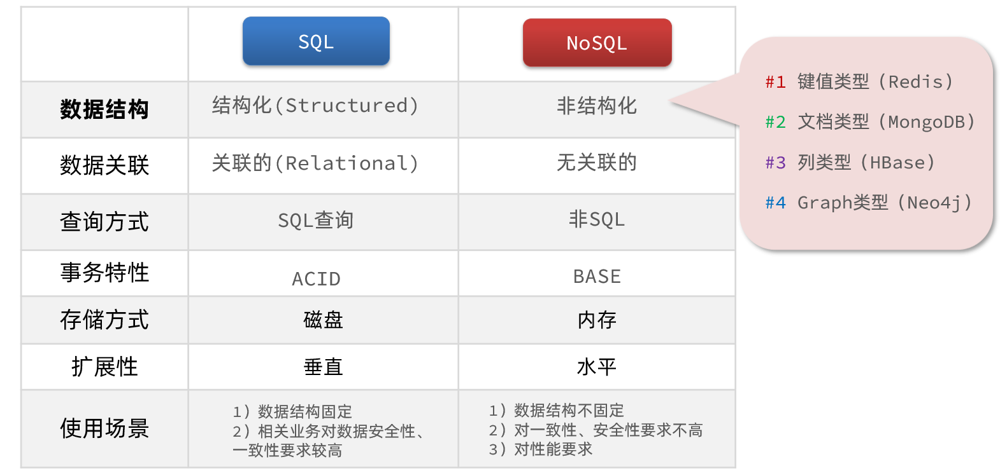

# Redis介绍

Redis诞生于2009年全称是**Re**mote  **D**ictionary **S**erver 远程词典服务器，是一个基于内存的键值型NoSQL数据库。

特征：
- 键值（key-value）型，value支持多种不同数据结构，功能丰富
- 单线程，每个命令具备原子性
- 低延迟，速度快（基于内存.IO多路复用.良好的编码）。
- 支持数据持久化
- 支持主从集群.分片集群
- 支持多语言客户端

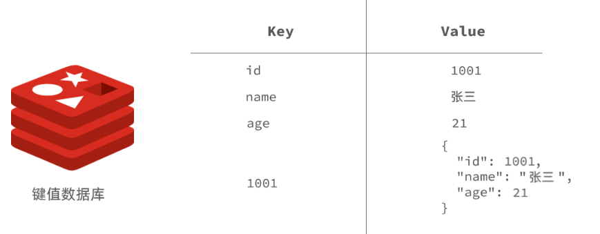

## 安装Redis

大多数企业都是基于Linux服务器来部署项目，而且Redis官方也没有提供Windows版本的安装包。因此都会基于Linux系统来安装Redis。此处选择的Linux版本为CentOS 7。

Redis是基于C语言编写的，因此首先需要安装Redis所需要的gcc依赖：
`yum install -y gcc tcl`

### linux环境下

① 下载redis安装包redis-6.2.6.tar.gz

② 将其放到/usr/local/src目录，并解压安装包。

`tar -xzf redis-6.2.6.tar.gz`

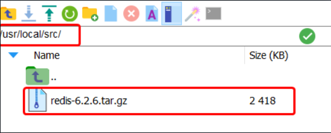

③ 解压后会出现redis-6.2.6目录，进入到该目录中，运行编译命令。

`make && make install`

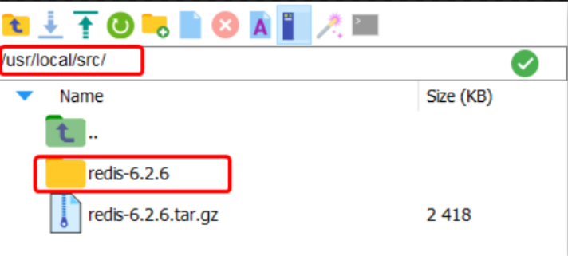

④ 编译完成后，redis会默认安装在/usr/local/bin目录下。

该目录已经默认配置到环境变量中，因此可以在任意目录下运行这些命令。其中：
- redis-cli：是redis提供的命令行客户端
- redis-server：是redis的服务端启动脚本
- redis-sentinel：是redis的哨兵启动脚本


## Redis的启动

redis的启动方式有很多种，例如：
- 默认启动
- 指定配置启动
- 开机自启

### 默认启动

在任意目录下打开命令行,输入redis-server命令即可启动Redis：
`redis-server`

如图:
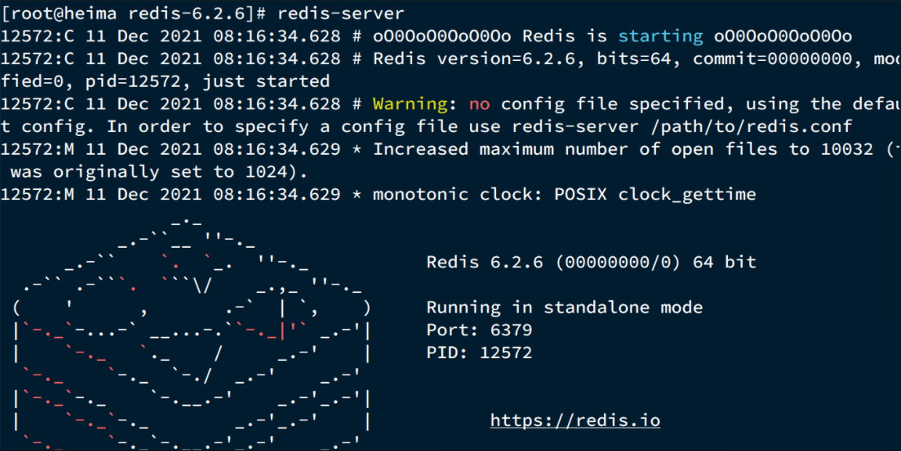

默认启动，会阻塞整个会话窗口，窗口关闭或者按下CTRL + C则Redis停止。不推荐使用。

### 指定配置启动

在redis安装包下（/usr/local/src/redis-6.2.6），有redis配置文件redis.conf：

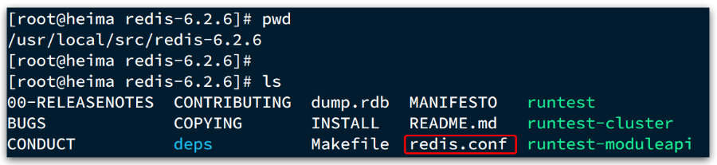

① 将redis.con配置文件备份一份，用于还原。

`cp redis.conf redis.conf.bck`


② 然后修改redis.conf文件中的一些配置：

```properties
# 允许访问的地址，默认是127.0.0.1，会导致只能在本地访问。修改为0.0.0.0则可以在任意IP访问，生产环境不要设置为0.0.0.0
bind 0.0.0.0
# 守护进程，修改为yes后即可后台运行
daemonize yes 
# 密码，设置后访问Redis必须输入密码
requirepass 123456
# 监听的端口
port 6379
# 数据库数量，设置为1，代表只使用1个库，默认有16个库，编号0~15
databases 1
# 设置redis能够使用的最大内存
maxmemory 512mb
# 工作目录，默认是当前目录，也就是运行redis-server时的命令，日志、持久化等文件会保存在这个目录
dir .
# 日志文件，默认为空(即不记录日志)，可以指定日志文件名
logfile "redis.log"
```

③ 启动Redis：

```sh
# 进入redis安装目录 
cd /usr/local/src/redis-6.2.6
# 指定配置文件启动
redis-server redis.conf
```

停止服务：
```sh
# 利用redis-cli来执行 shutdown 命令，即可停止 Redis 服务，
# 因为之前配置了密码，因此需要通过 -u 来指定密码
redis-cli -u 123456 shutdown
```

### 开机自启

可以通过配置来实现开机自启。

① 新建一个系统服务文件：
```sh
vi /etc/systemd/system/redis.service
```

redis.service内容如下：
```conf
[Unit]
Description=redis-server
After=network.target

[Service]
Type=forking
ExecStart=/usr/local/bin/redis-server /usr/local/src/redis-6.2.6/redis.conf
PrivateTmp=true

[Install]
WantedBy=multi-user.target
```

② 然后重新加载系统服务：
```sh
systemctl daemon-reload
```

③ 现在可以用下面这组命令来操作redis：
```sh
# 启动
systemctl start redis
# 停止
systemctl stop redis
# 重启
systemctl restart redis
# 查看状态
systemctl status redis
# 让redis开机自启
systemctl enable redis
```

## Redis的图形化桌面客户端

在下面这个仓库可以找到Redis图形化桌面客户端安装包：https://github.com/lework/RedisDesktopManager-Windows/releases


① 安装redis图形化桌面客户端

② 运行该客户端，填写redis配置信息。链接redis服务器。

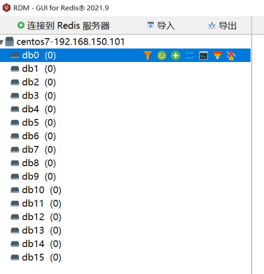

Redis默认有16个仓库，编号从0至15. 通过配置文件可以设置仓库数量，但是不超过16，并且不能自定义仓库名称。

# Redis通用命令

通用指令是部分数据类型的，都可以使用的指令，常见的有：

- KEYS：查看符合模板的所有key
- DEL：删除一个指定的key
- EXISTS：判断key是否存在
- EXPIRE：给一个key设置有效期，有效期到期时该key会被自动删除
- TTL：查看一个KEY的剩余有效期

通过help [command] 可以查看一个命令的具体用法，例如：

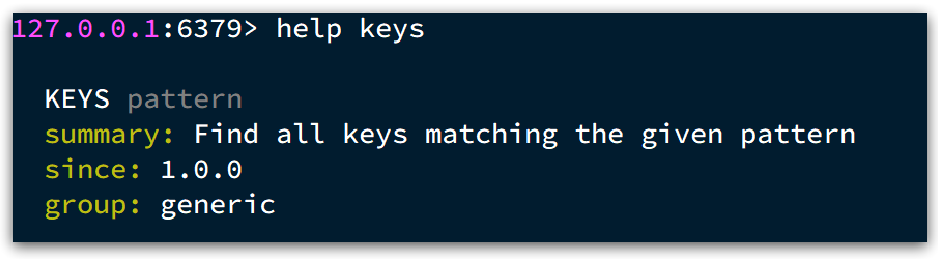

# Redis中针对key的命令

1. select 命令：切换数据库。一共有16个数据库（0-15）
```
>select 2  //切换到2号数据库
```
2. dbsize 命令：查看当前数据库的key的数量。
```
>dbsize  
>1     //表示当前这个数据库只有一个键值对
```
3. flushdb 命令：删除当前数据库的所以key-value
```
>flushdb
```
4. flushdb 命令：删除所以（16个）数据库的所以key-value
```
>flushall
```
5. keys * 命令：查询当前数据库的所有键值对。在生产环境下，不推荐使用keys命令，因为在key过多的情况下，效率不高。
```
>keys *
>"ks"
>"k1"
>"k2"
>"qwe"
```
6. keys ? 命令：通过占位符查询特定的key
```
>keys k?   //查询当前数据库的以k为首字符的key
>"ks"
>"k1"
>"k2"
```
7. EXPIRE 指定某个key的过期时间
```
>EXPIRE key1 10   //设置key1键10秒后过期
```
8. type 查询键对应value的数据类型
```
>type list1   //查询list1对应的value的数据类型
"list"
```

**其他针对key的命令：**

命令 | 功能
---- | ---- 
DEL key | 此命令删除一个指定键(如果存在)。
DUMP key | 此命令返回存储在指定键的值的序列化版本。
EXISTS key | 此命令检查键是否存在。
TTL key | 以秒为单位，返回给定 key 的剩余生存时间(TTL, time to live)。-1表示永不过期，-2表示已经过期。
TYPE key | 返回存储在键中的值的数据类型
KEYS pattern | 查找与指定模式匹配的所有键。
MOVE key db | 将键移动到另一个数据库。
PERSIST key | 删除指定键的过期时间，得永生。
RANDOMKEY | 从Redis返回一个随机的键。
RENAME key newkey  | 更改键的名称。
PTTL key | 以毫秒为单位返回 key 的剩余的过期时间。
RENAMENX key newkey | 如果新键不存在，重命名键。
EXPIRE key seconds | 设置键在指定时间秒数之后到期/过期。
EXPIREAT key timestamp | 设置在指定时间戳之后键到期/过期。这里的时间是Unix时间戳格式。
PEXPIRE key milliseconds | 设置键的到期时间(以毫秒为单位)。
PEXPIREAT key milliseconds-timestamp | 以Unix时间戳形式来设置键的到期时间(以毫秒为单位)。

# Redis的Key层次结构

Redis没有类似MySQL中的Table的概念，我们该如何区分不同类型的key呢？

例如，需要存储用户、商品信息到redis，有一个用户id是1，有一个商品id恰好也是1，此时如果使用id作为key，那就会冲突了，该怎么办？

答：可以通过给key添加前缀加以区分，不过这个前缀不是随便加的，有一定的规范：Redis的key允许有多个单词形成层级结构，多个单词之间用':'隔开，格式如下：
```
项目名:业务名:id
```

例如我们的项目名称叫project1，有user和product两种不同类型的数据，我们可以这样定义key：
- user相关的key：**project1:user:1**
- product相关的key：**project1:product:1**

如果Value是一个Java对象，则可以将对象序列化为JSON字符串后存储：

| **KEY**         | **VALUE**                                  |
| --------------- | ------------------------------------------ |
| project1:user:1    | {"id":1,  "name": "Jack", "age": 21}       |
| project1:product:1 | {"id":1,  "name": "小米11", "price": 4999} |

并且在Redis的桌面客户端中，还会以相同前缀作为层级结构，让数据看起来层次分明，关系清晰：

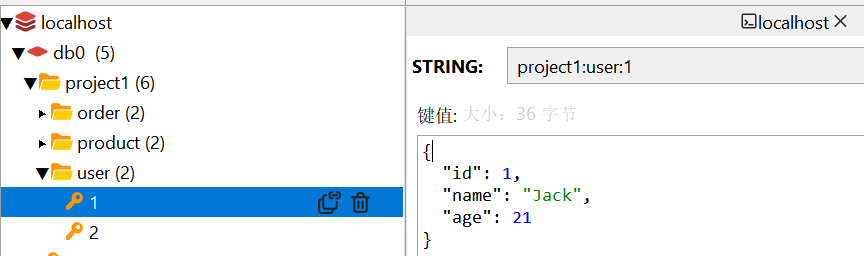

# Redis的Value数据类型

Redis是典型的key-value数据库，key一般是字符串，而value包含很多不同的数据类型。
如下图所示：
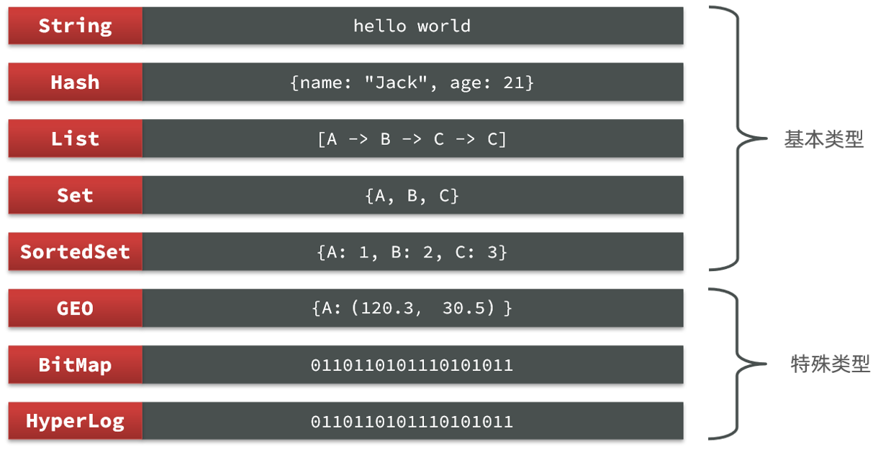

基本数据类型有5种：String,Hash,List,Set,SortedSet
特殊数据类型有3种：GEO,BitMap,HyperLog

## 1.String类型

String类型，也就是字符串类型，是Redis中最简单的存储类型。其value是字符串，不过根据字符串的格式不同，又可以分为3类：
- string：普通字符串
- int：整数类型，可以做自增、自减操作
- float：浮点类型，可以做自增、自减操作

不管是哪种格式，底层都是字节数组形式存储，只不过是编码方式不同。字符串类型的最大空间不能超过512m.


如图是String类型value的存储形式：
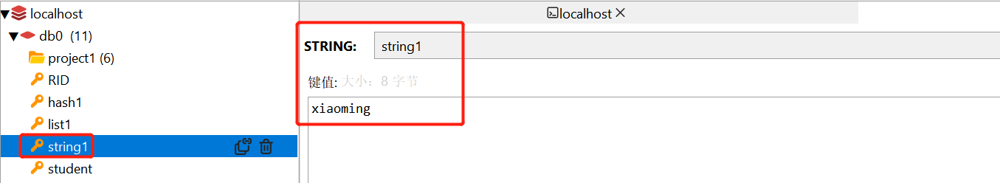

### 针对String类型value的命令

针对String类型value的常见命令有：

命令 | 功能
---- | ---- 
set key value | 添加或者修改已经存在的一个String类型的键值对
get key | 根据key获取String类型的value,注意只能返回string类型的value。其他类型无法返回。
append key value | 如果 key 已经存在并且是一个字符串，该命令将指定的 value 追加到该 key 原来值（value）的末尾。
strlen key | 返回 key 所储存的字符串值的长度。
getset key value | 先get返回key的旧值,再覆盖 key 的值为 value。
incr key | 将 key 中储存的数字值自增一。(注意必须是数字才能进行加减)
incrby key num | 将 key 所储存的值加上给定的num值。(注意必须是整型数字才能进行加减)
incrbyfloat key num | 将 key 所储存的值加上给定的num值。(注意必须是浮点型数字才能进行加减)
decr key | 将 key 中储存的数字值减一。(注意必须是数字才能进行加减)
decrby key num | key 所储存的值减去给定的num值 。 (注意必须是数字才能进行加减)
getrange key num1 num2 | 获取指定区间范围（num1-num2）的值
setrange key offset value | 从偏移量 offset 开始,重新设置key的值（会覆盖）。 
setex key seconds value | 设置键值对 ，并将 key 的过期时间设为 seconds (以秒为单位)。
setnx key value | 当key不存在时，设置键值对。用于避免set命令导致的覆盖
mget key1 [key2..] | 返回(一个或多个) key 的值。
mset key value [key value ...] | 同时设置一个或多个 key-value。
msetnx key value [key value ...] | 同时设置一个或多个 key-value 对，当且仅当所有给定 key 都不存在。

例子

* SET 和GET: 如果key不存在则是新增，如果存在则是修改
```java
127.0.0.1:6379> set name Rose  //原来不存在
OK
127.0.0.1:6379> get name 
"Rose"
127.0.0.1:6379> set name Jack //原来存在，就是修改
OK
127.0.0.1:6379> get name
"Jack"
```

* MSET和MGET
```java
127.0.0.1:6379> MSET k1 v1 k2 v2 k3 v3
OK
127.0.0.1:6379> MGET name age k1 k2 k3
1) "Jack" //之前存在的name
2) "10"   //之前存在的age
3) "v1"
4) "v2"
5) "v3"
```

* INCR和INCRBY和DECY
```java
127.0.0.1:6379> get age 
"10"
127.0.0.1:6379> incr age //增加1
(integer) 11
127.0.0.1:6379> get age //获得age
"11"
127.0.0.1:6379> incrby age 2 //一次增加2
(integer) 13 //返回目前的age的值
127.0.0.1:6379> incrby age 2
(integer) 15
127.0.0.1:6379> incrby age -1 //也可以增加负数，相当于减
(integer) 14
127.0.0.1:6379> incrby age -2 //一次减少2个
(integer) 12
127.0.0.1:6379> DECR age //相当于 incr 负数，减少正常用法
(integer) 11
127.0.0.1:6379> get age 
"11"
```

* SETNX
```java
127.0.0.1:6379> set name Jack  //设置名称
OK
127.0.0.1:6379> setnx name lisi //如果key不存在，则添加成功
(integer) 0
127.0.0.1:6379> get name //由于name已经存在，所以lisi的操作失败
"Jack"
127.0.0.1:6379> setnx name2 lisi //name2 不存在，所以操作成功
(integer) 1
127.0.0.1:6379> get name2 
"lisi"
```

* SETEX
```sh
127.0.0.1:6379> setex name 10 jack
OK
127.0.0.1:6379> ttl name
(integer) 8
127.0.0.1:6379> ttl name
(integer) 7
127.0.0.1:6379> ttl name
(integer) 5
```

## 2.List类型

Redis中的List类型与Java中的LinkedList类似，可以看做是一个双向链表结构。既可以支持正向检索和也可以支持反向检索。你可以添加一个元素到**列表的头部（左边）或者尾部（右边）。按照插入顺序排序。**

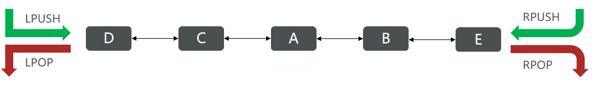

特征也与LinkedList类似：
- 保证元素的插入顺序
- 元素可以重复
- 插入和删除快
- 查询速度一般

List类型常用来存储一个有序数据，例如：朋友圈点赞列表，评论列表等。

如图是List类型value的存储形式：
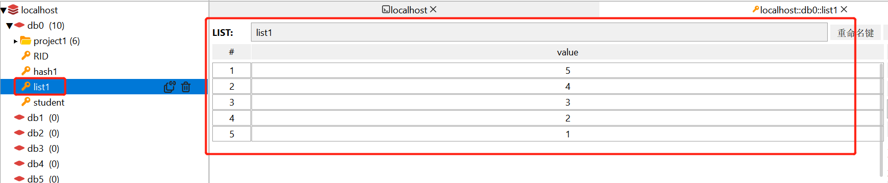

###  针对List类型value的命令

命令      | 功能
----     | ---- 
lpush key value1 [value2] | 将一个或多个值插入到列表头部。注意是头插法
lpushx key value | 将一个值插入到已存在的列表头部
rpush key value1 [value2] | 在列表尾部中添加多个值
rpushx key value | 为已存在的列表尾部添加一个值
lindex key index | 通过索引获取列表中的元素
lrange key start stop | 获取列表范围内(start-stop)的元素，从0~-1表示全部
linsert key before/after pivot value | 在列表的pivot元素前（后）插入value元素
llen key | 获取列表长度
lpop key | 移除并返回栈顶元素
rpop key | 移除并返回栈底元素
lrem key count value | 移除列表中的count个value值
ltrim key start stop | 对列表进行修剪(trim)，让列表只保留指定区间内的元素，其余元素删除。
rpoplpush source target | 移除source列表的栈底元素，并将该元素添加到target列表的栈顶
lset key index value  | 重新设置列表索引元素的值
blpop key1 [key2] timeout | 移出并获取列表的第一个元素， 如果列表没有元素会阻塞列表直到等待超时或发现可弹出元素为止。
brpop key1 [key2] timeout | 移出并获取列表的最后一个元素， 如果列表没有元素会阻塞列表直到等待超时或发现可弹出元素为止。
brpoplpush source target timeout | 从source列表中弹出一个值，将弹出的元素插入到target列表中并返回它； 如果列表没有元素会阻塞列表直到等待超时或发现可弹出元素为止。

例子：
```
127.0.0.1:6379> lpush k1 1 2 3 4 5  //创建k1列表，头插法存储1 2 3 4 5元素。
(integer) 5
127.0.0.1:6379> lrange k1 0 -1     //显示k1列表的全部元素，从0~-1表示全部
1) "5"
2) "4"
3) "3"
4) "2"
5) "1"
127.0.0.1:6379> lrange k1 0 1     //显示k1列表，0-1索引范围的元素
1) "5"
2) "4"
127.0.0.1:6379> lindex k1 0      //获取k1列表索引0的元素
"5"
127.0.0.1:6379> llen k1          //获取k1列表的长度
(integer) 5
127.0.0.1:6379> lpop k1         //移除k1列表的栈顶元素并返回
"5"
 
127.0.0.1:6379> rpush k2 1 2 3 4 5   //创建k2列表，尾插法存储1 2 3 4 5元素
(integer) 5
127.0.0.1:6379> lrange k2 0 -1
1) "1"
2) "2"
3) "3"
4) "4"
5) "5"
127.0.0.1:6379> lpop k2
"1"
127.0.0.1:6379> rpop k2 
"5"
127.0.0.1:6379> lrange k2 0 -1
1) "2"
2) "3"
3) "4"
127.0.0.1:6379> lrem k2 1 2     //删除k2列表中的1个value为2的元素
(integer) 1
127.0.0.1:6379> lrange k2 0 -1
1) "3"
2) "4"


127.0.0.1:6379> del k1   //删除之前的k1列表
(integer) 1
127.0.0.1:6379> lpush k1 1 2 3 4 5 6 7 8   //重新设置k1列表
(integer) 8
127.0.0.1:6379> ltrim k1 0 4      //截取k1列表中从栈顶开始计算的 0-4 个元素
OK
127.0.0.1:6379> lrange k1 0 -1
1) "8"
2) "7"
3) "6"
4) "5"
5) "4"
127.0.0.1:6379> rpoplpush k2 k1     //从k2列表中取出栈底元素，放到k1列表的栈顶上
"4"
127.0.0.1:6379> lrange k1 0 -1
1) "4"
2) "8"
3) "7"
4) "6"
5) "5"
6) "4" 
127.0.0.1:6379> lset k1 0 9     //重新设置k1列表栈顶元素为9
OK
127.0.0.1:6379> lrange k1 0 -1
1) "9"
2) "8"
3) "7"
4) "6"
5) "5"
6) "4"
127.0.0.1:6379> linsert k1 before 8 p    //在k1列表的8元素前插入p元素
(integer) 7
127.0.0.1:6379> lrange k1 0 -1
1) "9"
2) "p"
3) "8"
4) "7"
5) "6"
6) "5"
7) "4"
```

## 3.Set类型

Redis的Set结构与Java中的HashSet类似，可以看做是String类型的无序集合。集合成员是唯一的，即不能出现重复的数据。

因为也是一个hash表，因此具备与HashSet类似的特征：
- 无序
- 元素不可重复
- 查找快
- 支持交集、并集、差集等功能

如图是Set类型value的存储形式：


### 针对Set类型value的命令

命令      | 功能
----     | ---- 
sadd key member1 [member2] | 向集合添加一个或多个元素
smembers key | 返回集合中的所有元素
sismember key member | 判断集合key中是否有 member 元素
srandmember key [count] | 随机返回集合中多个随机数
scard key | 获取集合中的元素个数
srem key member1 [member2] | 移除集合中多个成员
spop key | 随机取出集合中的一个元素
smove s1 s2 member | 把s1集合中的member元素移到s2集合中
sdiff key1 [key2] | 返回在key1集合不在key2集合中的元素（差集）
sdiffstore target key1 [key2] | 把key1,key2集合的差集存储在target集合中
sinter key1 [key2] | 返回key1集合与key2集合的交集元素
sinterstore target key1 [key2] | 把交集并存储在target集合中
sunion key1 [key2] | 返回所有给定集合的并集
sunionstore target key1 [key2] | 把并集存储在target集合中

例子：
```
127.0.0.1:6379> sadd set1 1 2 3 4 5    //添加元素到set1集合中
(integer) 5    
127.0.0.1:6379> smembers set1      //返回set1集合中的所有元素
1) "1"
2) "2"
3) "3"
4) "4"
5) "5"
127.0.0.1:6379> sadd set1 1 2 6    //再往集合set1中添加元素 1 2 6
(integer) 1                        //结果显示添加成功1次
127.0.0.1:6379> smembers set1      //只有6添加进去，1 2 元素重复
1) "1"
2) "2"
3) "3"
4) "4"
5) "5"
6) "6"
127.0.0.1:6379> sismember set1 2     //判断 set1集合中是否有2元素
(integer) 1
127.0.0.1:6379> sismember set1 7     //判断 set1集合中是否有7元素
(integer) 0

127.0.0.1:6379> srandmember set1    //返回集合中的一个随机数
"5"
127.0.0.1:6379> srandmember set1 2
1) "6"
2) "2"

127.0.0.1:6379> sadd set2 5 6 7 8 9
(integer) 5
127.0.0.1:6379> smembers set2
1) "5"
2) "6"
3) "7"
4) "8"
5) "9"
127.0.0.1:6379> smembers set1
1) "1"
2) "2"
3) "3"
4) "4"
5) "5"
6) "6"
127.0.0.1:6379> sdiff set1 set2  //返回在set1集合中，不再set2集合中的元素
1) "1"
2) "2"
3) "3"
4) "4"
127.0.0.1:6379> sdiffstore set3 set1 set2   //把set1 与set2的插集的元素，存储在set3中
(integer) 4
127.0.0.1:6379> smembers set3
1) "1"
2) "2"
3) "3"
4) "4"
127.0.0.1:6379> sinter set1 set2    //返回set1集合与set2集合中的交集元素
1) "5"
2) "6"
127.0.0.1:6379> sunion set1 set2   //返回set1集合与set2集合中的并集元素
1) "1"
2) "2"
3) "3"
4) "4"
5) "5"
6) "6"
7) "7"
8) "8"
9) "9"
```

## 4.Hash类型

Hash类型（key是键，value是另一个键值对。即value是一个map),hash类型特别适合用于存储对象。类似于Java中的HashMap结构。

Hash结构可以将对象中的每个字段独立存储，可以针对单个字段做CRUD：
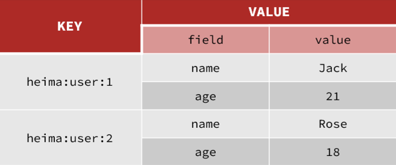

如图是Hash类型value的存储形式：
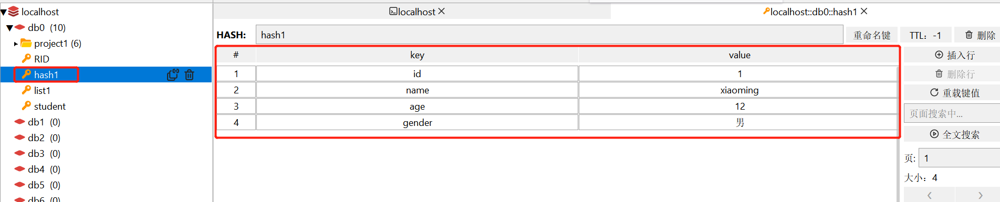

### 针对Hash类型value的命令

命令  | 功能
----  | ---- 
hset key field value | 添加或者修改hash类型key的field的value值 。
hget key field | 获取哈希表key中field字段的value值。
hmset key field1 value1 [field2 value2 ] | 批量添加多个field-value到哈希表 key 中。
hmget key field1 [field2] | 批量获取多个哈希表key的field的值
hgetall key | 获取哈希表key中的所有字段和值
hdel key field1 [field2] | 删除多个哈希表字段
hkeys key | 获取哈希表key中的所有字段field
hvals key | 获取哈希表key中所有字段field对应所有value值
hlen key | 获取哈希表中字段的数量 
hexists key field | 查看哈希表key中指定的字段是否存在。
hincrby key field num | 为哈希表key中的指定字段的整数值加上增量num。
hincrbyfloat key field num | 为哈希表key中的指定字段的浮点数值加上增量num 。
hsetnx key field value | 只有在字段 field 不存在时，设置哈希表key中field字段的值。

例子：
* HSET和HGET
```java
127.0.0.1:6379> HSET heima:user:3 name Lucy//大key是 heima:user:3 小key是name，小value是Lucy
(integer) 1
127.0.0.1:6379> HSET heima:user:3 age 21// 如果操作不存在的数据，则是新增
(integer) 1
127.0.0.1:6379> HSET heima:user:3 age 17 //如果操作存在的数据，则是修改
(integer) 0
127.0.0.1:6379> HGET heima:user:3 name 
"Lucy"
127.0.0.1:6379> HGET heima:user:3 age
"17"
```

* HMSET和HMGET
```java
127.0.0.1:6379> HMSET heima:user:4 name HanMeiMei
OK
127.0.0.1:6379> HMSET heima:user:4 name LiLei age 20 sex man
OK
127.0.0.1:6379> HMGET heima:user:4 name age sex
1) "LiLei"
2) "20"
3) "man"
```

* HGETALL
```java
127.0.0.1:6379> HGETALL heima:user:4
1) "name"
2) "LiLei"
3) "age"
4) "20"
5) "sex"
6) "man"
```

* HKEYS和HVALS
```java
127.0.0.1:6379> HKEYS heima:user:4
1) "name"
2) "age"
3) "sex"
127.0.0.1:6379> HVALS heima:user:4
1) "LiLei"
2) "20"
3) "man"
```

* HINCRBY
```java
127.0.0.1:6379> HINCRBY  heima:user:4 age 2
(integer) 22
127.0.0.1:6379> HVALS heima:user:4
1) "LiLei"
2) "22"
3) "man"
127.0.0.1:6379> HINCRBY  heima:user:4 age -2
(integer) 20
```

* HSETNX
```java
127.0.0.1:6379> HSETNX heima:user4 sex woman
(integer) 1
127.0.0.1:6379> HGETALL heima:user:3
1) "name"
2) "Lucy"
3) "age"
4) "17"
127.0.0.1:6379> HSETNX heima:user:3 sex woman
(integer) 1
127.0.0.1:6379> HGETALL heima:user:3
1) "name"
2) "Lucy"
3) "age"
4) "17"
5) "sex"
6) "woman"
```

## 5.SortedSet类型

Redis的SortedSet是一个有序的set集合，与Java中的TreeSet有些类似，但底层数据结构却差别很大。SortedSet中的每一个元素都带有一个score属性，可以基于score属性对元素排序，底层的实现是一个跳表（SkipList）加 hash表。

<font color="red">

有序集合SortedSet在集合set的基础上，给每个元素都关联了一个score值。
之前的set是(K,(v1,v2,v3,...))
现在的有序集合是(K,((score1,v1),(score2,v2),(score3,v3)....) ,其中(score1,v1)是键值对。

</font> 

SortedSet具备下列特性：
- 可排序
- 元素不重复
- 查询速度快

因为SortedSet的可排序特性，经常用来实现排行榜这样的功能。

如图是SortedSet类型value的存储形式：
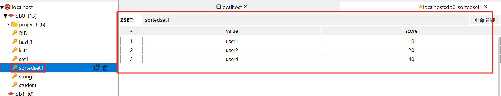

### 针对SortedSet类型value的命令
 命令  | 功能 
----  | ---- 
zadd key score1 member1 [score2 member2] | 向有序集合添加多个成员，或者更新已存在成员的分数
zcard key | 获取有序集合的成员数
zcount key min max | 计算在有序集合中指定区间分数的成员数
zscore key member | 返回有序集合中member成员的分数值
zrank key member | 返回指定成员的下标值（索引），从0开始
zrevrank key member | 逆序获得下标值。
zrange key start stop [withscores] | 返回有序集合中指定区间内的成员
zrangebyscore key min max [withscores] [limit] | 通过分数返回有序集合指定区间内的成员
zrevrange key start stop | 逆序返回指定区间内的成员
zrevrangebyscore key max min | 逆序返回指定分数区间内的成员（通过分数从高到低排序）
zrem key member [member ...] | 移除有序集合的多个成员
zremrangebyrank key start stop | 移除有序集合中给定索引的所有成员
zremrangebyscore key min max | 移除有序集合中给定分数区间的所有成员
zincrby key num member | 有序集合中对指定成员的分数加上增量 num
zinterscore target numkeys key [key ...] | 计算给定的多个有序集的交集并存储在新的有序集合target中
zunionstore target numkeys key [key ...] | 计算给定的多个有序集的并集，并存储在新的target中

例子：
```
127.0.0.1:6379> zadd zset1 10 user1 20 user2 40 user4   //设置有序集合zset1,其中10分的是user1,....
(integer) 3
127.0.0.1:6379> zrange zset1 0 -1    //返回指定范围的有序集合的内容
1) "user1"
2) "user2"
3) "user4"
127.0.0.1:6379> zrange zset1 0 -1 withscores    //返回指定范围的有序集合的内容，带分数
1) "user1"
2) "10"
3) "user2"
4) "20"
5) "user4"
6) "40"
127.0.0.1:6379> zrangebyscore zset1 10 40     //找出10分到40分的元素成员
1) "user1"
2) "user2"
3) "user4"
127.0.0.1:6379> zrangebyscore zset1 10 40 limit 0 2      //找出10分到40分的，从第0个开始选2个元素出来
1) "user1"
2) "user2"
127.0.0.1:6379> zcard zset1     //返回有序集合的成员数
(integer) 3
127.0.0.1:6379> zcount zset1 10 40   //返回有序集合中的10-40分的成员数
(integer) 3
```

# SpringDataRedis

SpringData是Spring中数据操作的模块，包含对各种数据库的集成，其中对Redis的集成模块就叫做SpringDataRedis。

- 提供了对不同Redis客户端的整合（Lettuce和Jedis）
- 提供了RedisTemplate统一API来操作Redis
- 支持Redis的发布订阅模型
- 支持Redis哨兵和Redis集群
- 支持基于Lettuce的响应式编程
- 支持基于JDK、JSON、字符串、Spring对象的数据序列化及反序列化
- 支持基于Redis的JDKCollection实现

SpringDataRedis中提供了RedisTemplate工具类，其中封装了各种对Redis的操作。并且将不同数据类型的操作API封装到了不同的类型中：


## 快速入门

① 创建springboot项目

② 引入SpringDataRedis依赖

```xml
<dependencies>
    <!-- SpringDataRedis依赖 -->
    <dependency>
        <groupId>org.springframework.boot</groupId>
        <artifactId>spring-boot-starter-data-redis</artifactId>
    </dependency>
    <!-- web依赖 -->
    <dependency>
        <groupId>org.springframework.boot</groupId>
        <artifactId>spring-boot-starter-web</artifactId>
    </dependency>
</dependencies>
```

③ 配置redis

```yaml
spring:
  redis:
    host: localhost
    port: 6379
    password: 123456
    lettuce:
      pool:
        max-active: 8
        max-idle: 8
        min-idle: 0
        max-wait: 100ms
```

④ 测试

```java
@RestController
@RequestMapping("/redis")
public class redisController {
    @Autowired
    private RedisTemplate redisTemplate;

    //StringRedisTemplate专门用于处理String类型的key和value
    @Autowired
    private StringRedisTemplate stringRedisTemplate;

    @RequestMapping("/testGet")
    public Object testGet(){
        // 获取String数据
        Object obj = stringRedisTemplate.opsForValue().get("project1:order:3");
        System.out.println("obj = " + obj);
        return obj;
    }
    @RequestMapping("/testSet")
    public void testSet(){
        System.out.println("testSet----");
        // 写入一条String数据
        stringRedisTemplate.opsForValue().set("project1:order:3","order3333");
    }
}
```

## 乱码问题

RedisTemplate向写入Redis数据时，由于默认是采用JDK序列化，得到的结果是这样的：


① 解决方式1：自定义RedisTemplate的序列化方式。下面用JSON序列化代替默认的JDK序列化

```java
@Configuration
public class RedisConfig {
    @Bean
    public RedisTemplate<String, Object> redisTemplate(RedisConnectionFactory connectionFactory){
        // 创建RedisTemplate对象
        RedisTemplate<String, Object> template = new RedisTemplate<>();
        // 设置连接工厂
        template.setConnectionFactory(connectionFactory);
        // 创建JSON序列化工具
        GenericJackson2JsonRedisSerializer jsonRedisSerializer = new GenericJackson2JsonRedisSerializer();
        // 设置Key的序列化
        template.setKeySerializer(RedisSerializer.string());
        template.setHashKeySerializer(RedisSerializer.string());
        // 设置Value的序列化
        template.setValueSerializer(jsonRedisSerializer);
        template.setHashValueSerializer(jsonRedisSerializer);
        // 返回
        return template;
    }
}
```

② 解决方式2：直接使用StringRedisTemplate，它的key和value的序列化方式默认就是String方式。

优点：不需要自定义RedisTemplate的序列化方式。
缺点：StringRedisTemplate只能处理String类型的key和value。

