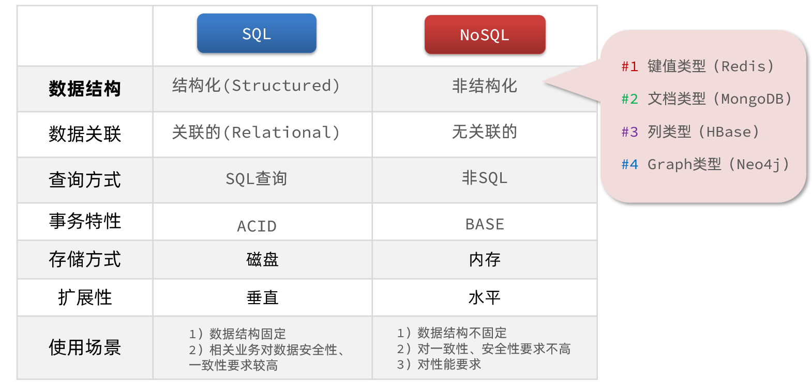
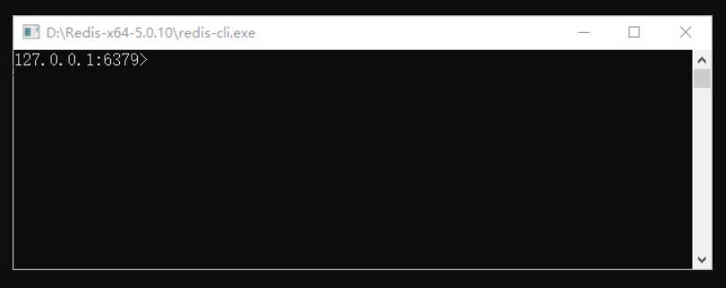
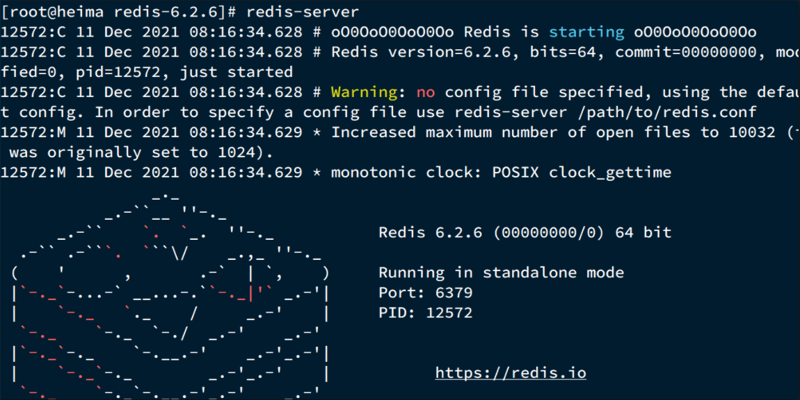

[toc]

# Redis笔记1

## 什么是NoSql数据库?

**NoSql**可以翻译做Not Only Sql（不仅仅是SQL），或者是No Sql（非Sql的）数据库。是相对于传统关系型数据库而言，有很大区别的一种特殊的数据库，因此也称之为**非关系型数据库**。

> 传统关系型数据库与NoSql数据库的区别：
```
* 结构化与非结构化
传统关系型数据库是结构化数据，每一张表都有严格的约束信息：字段名.字段数据类型.字段约束等等信息，插入的数据必须遵守这些约束。而NoSql则对数据库格式没有严格约束，往往形式松散，自由。可以是键值型,文档型,图类型的等等。

* 关联和非关联
传统数据库的表与表之间往往存在关联，例如外键。而非关系型数据库不存在关联关系，要维护数据之间的关系要么靠代码中的业务逻辑，要么靠数据之间的耦合。

* 查询方式
传统关系型数据库会基于Sql语句做查询，语法有统一标准。而不同的非关系数据库查询语法差异极大，五花八门各种各样。

* 事务
传统关系型数据库能满足事务ACID的原则。而非关系型数据库往往不支持事务，或者不能严格保证ACID的特性，只能实现基本的一致性。

* 存储方式
关系型数据库基于磁盘进行存储，会有大量的磁盘IO，对性能有一定影响。非关系型数据库，更多的是依赖于内存来进行存储，内存的读写速度会非常快，性能自然会好一些。

* 扩展性
关系型数据库集群模式一般是主从，主从数据一致，起到数据备份的作用，称为垂直扩展。非关系型数据库可以将数据拆分，存储在不同机器上，可以保存海量数据，解决内存大小有限的问题。称为水平扩展。

```



## Redis介绍

Redis: Remote Dictionary Server (远程字典服务器)
Redis是一个基于内存的键值型NoSQL数据库。


> 与其他内存型数据库相比，Redis的特点：
```
1. Redis 不仅可以将数据完全保存在内存中，还可以通过磁盘实现数据的持久存储；
2. Redis 支持丰富的数据类型，包括 string、list、set、zset、hash 等多种数据类型；
3. Redis 支持主从同步，即 master-slave 主从复制模式。数据可以从主服务器向任意数量的从服务器上同步，有效地保证数据的安全性；
4. Redis 支持多种编程语言，包括 C、C++、Python、Java、PHP、Ruby、Lua 等语言。
```

> Redis的使用场景

Redis 用来缓存一些经常被访问的热点数据、或者需要耗费大量资源的内容，通过把这些内容放到 Redis 中，可以让应用程序快速地读取它们。例如，网站的首页需要经常被访问，并且在创建首页的过程中会消耗的较多的资源，此时就可以使用 Redis 将整个首页缓存起来，从而降低网站的压力，减少页面访问的延迟时间。


## Redis的安装与启动

大多数企业都是基于Linux系统来部署项目，而且Redis官方也没有提供Windows版本的安装包。因此都会基于Linux系统来安装Redis。

### windows系统下安装启动redis

Redis官方没有提供 Windows 版的安装包，但可以通过 GitHub 来下载 Windows 版 Redis安装包。

[Windows 版 Redis安装包下载地址](https://github.com/tporadowski/redis/releases)

<font color="red">注意：Windows 安装包是某位民间“大神”根据 Redis 源码改造的，并非 Redis 官方网站提供。</font>

1. 下载redis安装包


* redis.windwos.conf是配置文件
* redis.cli.exe 是redis客户端程序
* redis-server.exe 是redis服务端程序

2. 启动服务端程序，双击redis-server.exe。会看到如下界面

注意，请您保持服务端始终处于开启状态，否则客户端无法正常工作。 

3. 启动客户端程序，双击客户端启动程序redis-cli.exe。如图所示，表示redis客户端与服务端连接成功。

4. 将redis安装路径配置到环境变量中。这样可以在终端的任何位置运行redis的命令。

5. 还可以通过命令行来启动redis.

```
开启服务端：redis-server --service-start
停止服务端：redis-server --service-stop
启动客户端：redis-cli
```

### ubuntu系统下安装启动redis

相比于 Windows 系统而言，Redis 更适合于在 Linux 系统上使用，这是由 Redis 的底层机制决定的。

> 命令行在线安装

```bash
## 在 Ubuntu 终端执行相应的命令即可在线安装 Redis
sudo apt-get update
sudo apt-get install redis-server

## 启动Redis服务端
redis-server

## 启动Redis客户端
#简单格式
redis-cli
#若设置了密码，使用如下格式启动
redis-cli -h [ip] -p [port] -a [password] 
```

> 源代码安装

```bash
# 1.首先从redis官网下载redis源代码。

# 将安装包放到/usr/local/src目录，并解压安装包。
tar xzf redis-5.0.4.tar.gz

# 编译并安装源代码包
cd redis-5.0.4
make && make install

# 安装完成后，redis会默认安装在/usr/local/bin目录下。

cd /usr/local/bin       # 进入安装目录中
./redis-server          # 启动服务端
./redis-cli             # 启动客户端
```



## Redis配置文件

windows系统中 Redis 的安装目录中有一个名为 redis.windows.conf 的配置文件，Linux 系统中则为 redis.conf。


### 查看配置信息

以使用Redis的`CONFIG`命令来查看或者更改Redis的配置信息。

```bash
# 语法如下
127.0.0.1:6379> CONFIG GET 配置名称

# 获取日志配置信息
127.0.0.1:6379> CONFIG GET 配置名称
1) "loglevel"
2) "notice"

# 获取所有配置信息
127.0.0.1:6379> CONFIG GET *
1) "dbfilename"
2) "dump.rdb"
......

```

### 修改配置信息

如果我们需要修改redis配置文件的时候，一般是将原配置文件进行备份，然后再修改。

1. 将redis.conf原配置文件复制重命名为redis.conf.backup
2. 修改配置

```properties
# 允许访问的地址，默认是127.0.0.1，会导致只能在本地访问。修改为0.0.0.0则可以在任意IP访问，生产环境不要设置为0.0.0.0
bind 0.0.0.0
# 守护进程，修改为yes后就默认为后台运行
daemonize yes 
# 密码，设置后访问Redis必须输入密码
requirepass 123456
# Redis默认端口为 6379.
port 6379
# 数据库数量，设置为16，代表使用16个数据库，默认有16个库，编号0~15
databases 16
# 设置redis能够使用的最大内存
maxmemory 512mb
# 工作目录，默认是当前目录，也就是运行redis-server时的命令，日志、持久化等文件会保存在这个目录
dir .
# 日志文件，默认为空(即不记录日志)，可以指定日志文件名
logfile "redis.log"
```

3. 重新启动Redis

```sh
# 进入redis安装目录 
cd /usr/local/src/redis-6.2.6
# 指定配置文件启动
redis-server redis.conf
```

### 配置文件配置项


## Redis开机自启

可以通过配置来实现Redis开机自启。

1. 新建一个systemctl服务文件：
```sh
vi /etc/systemd/system/redis.service

# redis.service内容如下：
[Unit]
Description=redis-server
After=network.target

[Service]
Type=forking
ExecStart=/usr/local/bin/redis-server /usr/local/src/redis-6.2.6/redis.conf
PrivateTmp=true

[Install]
WantedBy=multi-user.target
```

2. 然后重新加载systemctl服务：
```sh
systemctl daemon-reload
```

3. 现在可以用下面这组命令来操作redis：
```sh
# 启动
systemctl start redis
# 停止
systemctl stop redis
# 重启
systemctl restart redis
# 查看状态
systemctl status redis
# 让redis开机自启
systemctl enable redis
```

## Redis图形化客户端

在这个github仓库可以找到Redis图形化桌面客户端安装包：[下载链接](https://github.com/lework/RedisDesktopManager-Windows/releases)

1. 安装redis图形化桌面客户端
2. 运行该客户端，填写redis配置信息。链接redis服务器。


Redis默认有16个仓库，编号从0至15. 通过配置文件可以设置仓库数量，但是不超过16，并且不能自定义仓库名称。
