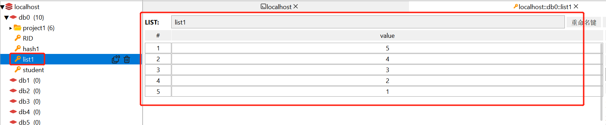
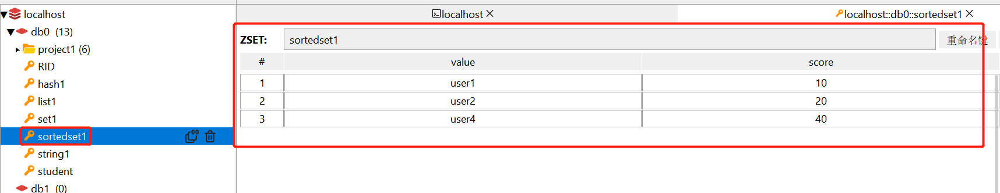
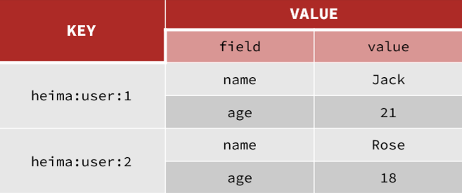
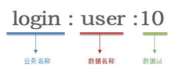

[toc]

# Redis笔记2

## 基础命令

* set命令：设置键值对。
* get命令：通过key值，获取键值对。
* select 命令：切换数据库。
* dbsize 命令：查看当前数据库的键值对的数量。
* flushdb 和 flushall 命令
* keys命令
* expire命令：指定某个key的过期时间

```bash
## 设置一个 key="k1",value="hello"的键值对,之前有的会覆盖
> set k1 hello

## 通过key值，获取当前数据库的对于的value值。
> get k1
> "hello"

## redis一共有16个数据库（0-15）。这里是切换到2号数据库
> select 2

> dbsize
## 表示当前数据库只有一个键值对
> 1

## flushdb 删除当前数据库的所有key-value
> flushdb

## flushall 命令：删除所有（16个）数据库的所有key-value
> flushall

## keys * 命令：查询当前数据库的所有key
> keys *
> "ks"
> "k1"
> "k2"
> "qwe"

## keys ？ 命令：通过占位符查询特定的key
## 查询当前数据库的以k为首字符的key
> keys k?
> "ks"
> "k1"
> "k2"

## 设置key1键10秒后过期
> EXPIRE key1 10
```

**其他基础命令**

命令 | 功能
---- | ---- 
DEL key | 此命令删除一个指定键(如果存在)。
DUMP key | 此命令返回存储在指定键的值的序列化版本。
EXISTS key | 此命令检查键是否存在。
TTL key | 以秒为单位，返回给定 key 的剩余生存时间(TTL, time to live)。-1表示永不过期，-2表示已经过期。
TYPE key | 返回存储在键中的值的数据类型
KEYS pattern | 查找与指定模式匹配的所有键。
MOVE key db | 将键移动到另一个数据库。
PERSIST key | 删除指定键的过期时间，得永生。
RANDOMKEY | 从Redis返回一个随机的键。
RENAME key newkey  | 更改键的名称。
PTTL key | 以毫秒为单位返回 key 的剩余的过期时间。
RENAMENX key newkey | 如果新键不存在，重命名键。
EXPIRE key seconds | 设置键在指定时间秒数之后到期/过期。
EXPIREAT key timestamp | 设置在指定时间戳之后键到期/过期。这里的时间是Unix时间戳格式。
PEXPIRE key milliseconds | 设置键的到期时间(以毫秒为单位)。
PEXPIREAT key milliseconds-timestamp | 以Unix时间戳形式来设置键的到期时间(以毫秒为单位)。


## 五种基础数据类型（value值的数据类型）

Redis是典型的key-value数据库，key一般是字符串，而value可以包含很多不同的数据类型。

如图所示


* 基本数据类型有5种：String（字符串）,Hash（哈希散列）,List（列表）,Set（集合）,Zset（有序集合，又名Sortedset）
* 特殊数据类型有3种：GEO,BitMap,HyperLog

<font color="red">注意：这里指的数据类型是 Value（值） 的数据类型。</font>

### String 字符串类型

String类型，也就是字符串类型。根据字符串的格式不同，又可以分为3类：

```
string：普通字符串
int：整数类型，可以做自增、自减操作
float：浮点类型，可以做自增、自减操作
```

不管是哪种格式，底层都是字节数组形式存储，只不过是编码方式不同。字符串类型的最大空间不能超过512m。如图是String类型value的存储形式。


> 针对String类型value的常见命令有：

命令 | 功能
---- | ---- 
append key value | 如果 key 已经存在并且是一个字符串，该命令将指定的 value 追加到该 key 原来值（value）的末尾。
strlen key | 返回 key 所储存的字符串值的长度。
getset key value | 先get返回key的旧值,再覆盖 key 的值为 value。
incr key | 将 key 中储存的数字值自增一。(注意必须是数字才能进行加减)
incrby key num | 将 key 所储存的值加上给定的num值。(注意必须是整型数字才能进行加减)
incrbyfloat key num | 将 key 所储存的值加上给定的num值。(注意必须是浮点型数字才能进行加减)
decr key | 将 key 中储存的数字值减一。(注意必须是数字才能进行加减)
decrby key num | key 所储存的值减去给定的num值 。 (注意必须是数字才能进行加减)
getrange key num1 num2 | 获取指定区间范围（num1-num2）的值
setrange key offset value | 从偏移量 offset 开始,重新设置key的值（会覆盖）。 
setex key seconds value | 设置键值对 ，并将 key 的过期时间设为 seconds (以秒为单位)。
setnx key value | 当key不存在时，设置键值对。用于避免set命令导致的覆盖
mget key1 [key2..] | 返回(一个或多个) key 的值。
mset key value [key value ...] | 同时设置一个或多个 key-value。
msetnx key value [key value ...] | 同时设置一个或多个 key-value 对，当且仅当所有给定 key 都不存在。

> 例子

```bash
## INCR和INCRBY和DECY
127.0.0.1:6379> set age 10
127.0.0.1:6379> get age 
"10"
127.0.0.1:6379> incr age        ##增加1
(integer) 11
127.0.0.1:6379> get age         ##获得age
"11"
127.0.0.1:6379> incrby age 2    ##一次增加2
(integer) 13 
127.0.0.1:6379> incrby age 2
(integer) 15
127.0.0.1:6379> incrby age -1   ##也可以增加负数，相当于减
(integer) 14
127.0.0.1:6379> incrby age -2   ##一次减少2个
(integer) 12
127.0.0.1:6379> DECR age        ##相当于 incr 负数，减少正常用法
(integer) 11
127.0.0.1:6379> get age 
"11"

## SETNX
127.0.0.1:6379> set name Jack       ##设置名称
OK
127.0.0.1:6379> setnx name lisi     ##如果key不存在，则添加成功
(integer) 0
127.0.0.1:6379> get name            ##由于name已经存在，所以lisi的操作失败
"Jack"
127.0.0.1:6379> setnx name2 lisi    ##name2 不存在，所以操作成功
(integer) 1
127.0.0.1:6379> get name2 
"lisi"

## SETEX
127.0.0.1:6379> setex name 10 jack
OK
127.0.0.1:6379> ttl name    ## ttl查询剩余时间
(integer) 8
127.0.0.1:6379> ttl name
(integer) 5
```


### List 列表类型

Redis中的List类型与Java中的LinkedList类似，可以看做是一个双向链表结构。既可以支持正向检索和也可以支持反向检索。你可以添加一个元素到**列表的头部（左边）或者尾部（右边）。列表中的元素按照插入顺序排序。**

如图所示，list类型的存储结构。


List类型常用来存储一个有序数据，例如：朋友圈点赞列表，评论列表等。如图是List类型value的存储形式.


> List类型的特点：
1. 保证元素的顺序
2. 元素可以重复
3. 插入和删除快
4. 查询速度一般


> 针对List类型value的命令

命令      | 功能
----     | ---- 
lpush key value1 [value2] | 将一个或多个值插入到列表头部。注意是头插法
lpushx key value | 将一个值插入到已存在的列表头部
rpush key value1 [value2] | 在列表尾部中添加多个值
rpushx key value | 为已存在的列表尾部添加一个值
lindex key index | 通过索引获取列表中的元素
lrange key start stop | 获取列表范围内(start-stop)的元素，0~-1表示全部
linsert key before/after pivot value | 在列表的pivot元素前（后）插入value元素
llen key | 获取列表长度
lpop key | 移除并返回栈顶元素
rpop key | 移除并返回栈底元素
lrem key count value | 移除列表中的count个value值
ltrim key start stop | 对列表进行修剪(trim)，让列表只保留指定区间内的元素，其余元素删除。
rpoplpush source target | 移除source列表的栈底元素，并将该元素添加到target列表的栈顶
lset key index value  | 重新设置列表索引元素的值
blpop key1 [key2] timeout | 移出并获取列表的第一个元素， 如果列表没有元素会阻塞列表直到等待超时或发现可弹出元素为止。
brpop key1 [key2] timeout | 移出并获取列表的最后一个元素， 如果列表没有元素会阻塞列表直到等待超时或发现可弹出元素为止。
brpoplpush source target timeout | 从source列表中弹出一个值，将弹出的元素插入到target列表中并返回它； 如果列表没有元素会阻塞列表直到等待超时或发现可弹出元素为止。

> 例子

```bash
##创建k1列表，头插法存储1 2 3 4 5元素。
127.0.0.1:6379> lpush k1 1 2 3 4 5  
(integer) 5
127.0.0.1:6379> lrange k1 0 -1     ##显示k1列表的全部元素，从0~-1表示全部
1) "5"
2) "4"
3) "3"
4) "2"
5) "1"
127.0.0.1:6379> lrange k1 0 1     ##显示k1列表，0-1索引范围的元素
1) "5"
2) "4"
127.0.0.1:6379> lindex k1 0      ##获取k1列表索引0的元素
"5"
127.0.0.1:6379> llen k1          ##获取k1列表的长度
(integer) 5
127.0.0.1:6379> lpop k1         ##移除k1列表的栈顶元素并返回
"5"
 
127.0.0.1:6379> rpush k2 1 2 3 4 5   ##创建k2列表，尾插法存储1 2 3 4 5元素
(integer) 5
127.0.0.1:6379> lrange k2 0 -1
1) "1"
2) "2"
3) "3"
4) "4"
5) "5"
127.0.0.1:6379> lpop k2
"1"
127.0.0.1:6379> rpop k2 
"5"
127.0.0.1:6379> lrange k2 0 -1
1) "2"
2) "3"
3) "4"
127.0.0.1:6379> lrem k2 1 2     ##删除k2列表中的1个value为2的元素
(integer) 1
127.0.0.1:6379> lrange k2 0 -1
1) "3"
2) "4"


127.0.0.1:6379> del k1   ##删除之前的k1列表
(integer) 1
127.0.0.1:6379> lpush k1 1 2 3 4 5 6 7 8   ##重新设置k1列表
(integer) 8
127.0.0.1:6379> ltrim k1 0 4      ##截取k1列表中从栈顶开始计算的 0-4 个元素
OK
127.0.0.1:6379> lrange k1 0 -1
1) "8"
2) "7"
3) "6"
4) "5"
5) "4"
127.0.0.1:6379> rpoplpush k2 k1     ##从k2列表中取出栈底元素，放到k1列表的栈顶上
"4"
127.0.0.1:6379> lrange k1 0 -1
1) "4"
2) "8"
3) "7"
4) "6"
5) "5"
6) "4" 
127.0.0.1:6379> lset k1 0 9     ##重新设置k1列表栈顶元素为9
OK
127.0.0.1:6379> lrange k1 0 -1
1) "9"
2) "8"
3) "7"
4) "6"
5) "5"
6) "4"
127.0.0.1:6379> linsert k1 before 8 p    ##在k1列表的8元素前插入p元素
(integer) 7
127.0.0.1:6379> lrange k1 0 -1
1) "9"
2) "p"
3) "8"
4) "7"
5) "6"
6) "5"
7) "4"
```


   
### Set 集合类型

Redis的Set结构与Java中的HashSet类似，可以看做是无序集合，集合中的元素是String类型。集合成员是唯一的，即没有重复的数据。

如图是Set类型value的存储形式：


> Set 集合类型的特点：
1. 元素无序,即不按照插入顺序进行排序。
2. 元素不可重复
3. 查找快


> 针对Set类型value的命令

命令      | 功能
----     | ---- 
sadd key member1 [member2] | 向集合添加一个或多个元素
smembers key | 返回集合中的所有元素
sismember key member | 判断集合key中是否有 member 元素
srandmember key [count] | 随机返回集合中多个随机数
scard key | 获取集合中的元素个数
srem key member1 [member2] | 移除集合中多个成员
spop key | 随机取出集合中的一个元素
smove s1 s2 member | 把s1集合中的member元素移到s2集合中
sdiff key1 [key2] | 返回在key1集合不在key2集合中的元素（差集）
sdiffstore target key1 [key2] | 把key1,key2集合的差集存储在target集合中
sinter key1 [key2] | 返回key1集合与key2集合的交集元素
sinterstore target key1 [key2] | 把交集并存储在target集合中
sunion key1 [key2] | 返回所有给定集合的并集
sunionstore target key1 [key2] | 把并集存储在target集合中

> 例子

```bash
127.0.0.1:6379> sadd set1 1 2 3 4 5    ##添加元素到set1集合中
(integer) 5    
127.0.0.1:6379> smembers set1      ##返回set1集合中的所有元素
1) "1"
2) "2"
3) "3"
4) "4"
5) "5"
127.0.0.1:6379> sadd set1 1 2 6    ##再往集合set1中添加元素 1 2 6
(integer) 1                        ##结果显示添加成功1次
127.0.0.1:6379> smembers set1      ##只有6添加进去，1 2 元素重复
1) "1"
2) "2"
3) "3"
4) "4"
5) "5"
6) "6"
127.0.0.1:6379> sismember set1 2     ##判断 set1集合中是否有2元素
(integer) 1
127.0.0.1:6379> sismember set1 7     ##判断 set1集合中是否有7元素
(integer) 0

127.0.0.1:6379> srandmember set1    ##返回集合中的一个随机数
"5"
127.0.0.1:6379> srandmember set1 2
1) "6"
2) "2"

127.0.0.1:6379> sadd set2 5 6 7 8 9
(integer) 5
127.0.0.1:6379> smembers set2
1) "5"
2) "6"
3) "7"
4) "8"
5) "9"
127.0.0.1:6379> smembers set1
1) "1"
2) "2"
3) "3"
4) "4"
5) "5"
6) "6"
127.0.0.1:6379> sdiff set1 set2  ##返回在set1集合中，不再set2集合中的元素
1) "1"
2) "2"
3) "3"
4) "4"
127.0.0.1:6379> sdiffstore set3 set1 set2   ##把set1 与set2的插集的元素，存储在set3中
(integer) 4
127.0.0.1:6379> smembers set3
1) "1"
2) "2"
3) "3"
4) "4"
127.0.0.1:6379> sinter set1 set2    ##返回set1集合与set2集合中的交集元素
1) "5"
2) "6"
127.0.0.1:6379> sunion set1 set2   ##返回set1集合与set2集合中的并集元素
1) "1"
2) "2"
3) "3"
4) "4"
5) "5"
6) "6"
7) "7"
8) "8"
9) "9"
```


### Zset 有序集合类型(又名 SortedSet)

Redis中Zset和set一样也是string类型元素的集合,并且不允许重复的成员。

但底层数据结构却差别很大。Zset中的每一个元素都会关联一个score属性，redis正是通过score属性来为Zset中的成员进行排序。Zset底层的实现是一个跳表+hash表。

<font color="red">例如：Zset在集合set的基础上，给每个元素都关联了一个score值。之前的set是(K,(v1,v2,v3,...))。现在的Zset是(K,((score1,v1),(score2,v2),(score3,v3)....) ,其中(score1,v1)是键值对。
</font> 

> Zset(SortedSet)的特点
- 可排序
- 元素不重复
- 查询速度快


> 如图是SortedSet类型value的存储形式



> 针对SortedSet类型value的命令

 命令  | 功能 
----  | ---- 
zadd key score1 member1 [score2 member2] | 向有序集合添加多个成员，或者更新已存在成员的分数
zcard key | 获取有序集合的成员数
zcount key min max | 计算在有序集合中指定区间分数的成员数
zscore key member | 返回有序集合中member成员的分数值
zrank key member | 返回指定成员的下标值（索引），从0开始
zrevrank key member | 逆序获得下标值。
zrange key start stop [withscores] | 返回有序集合中指定区间内的成员
zrangebyscore key min max [withscores] [limit] | 通过分数返回有序集合指定区间内的成员
zrevrange key start stop | 逆序返回指定区间内的成员
zrevrangebyscore key max min | 逆序返回指定分数区间内的成员（通过分数从高到低排序）
zrem key member [member ...] | 移除有序集合的多个成员
zremrangebyrank key start stop | 移除有序集合中给定索引的所有成员
zremrangebyscore key min max | 移除有序集合中给定分数区间的所有成员
zincrby key num member | 有序集合中对指定成员的分数加上增量 num
zinterscore target numkeys key [key ...] | 计算给定的多个有序集的交集并存储在新的有序集合target中
zunionstore target numkeys key [key ...] | 计算给定的多个有序集的并集，并存储在新的target中

> 例子

```bash
127.0.0.1:6379> zadd zset1 10 user1 20 user2 40 user4   ##设置有序集合zset1,其中10分的是user1,....
(integer) 3
127.0.0.1:6379> zrange zset1 0 -1    ##返回指定范围的有序集合的内容
1) "user1"
2) "user2"
3) "user4"
127.0.0.1:6379> zrange zset1 0 -1 withscores    ##返回指定范围的有序集合的内容，带分数
1) "user1"
2) "10"
3) "user2"
4) "20"
5) "user4"
6) "40"
127.0.0.1:6379> zrangebyscore zset1 10 40     ##找出10分到40分的元素成员
1) "user1"
2) "user2"
3) "user4"
127.0.0.1:6379> zrangebyscore zset1 10 40 limit 0 2      ##找出10分到40分的，从第0个开始选2个元素出来
1) "user1"
2) "user2"
127.0.0.1:6379> zcard zset1     ##返回有序集合的成员数
(integer) 3
127.0.0.1:6379> zcount zset1 10 40   ##返回有序集合中的10-40分的成员数
(integer) 3
```


### Hash 哈希散列类型

Hash 哈希散列类型（key是键，value是一个map,value可以存储多个键值对）,hash类型特别适合用于存储对象。类似于Java中的HashMap结构。

Hash结构可以将对象中的每个字段独立存储，可以针对单个字段做CRUD。如图是Hash类型value的存储形式



<font color="red">注意：一个key中最多包含 2^32-1 个键值对。</font>

> 针对Hash类型value的命令

命令  | 功能
----  | ---- 
hset key field value | 添加或者修改hash类型key的field的value值 。
hget key field | 获取哈希表key中field字段的value值。
hmset key field1 value1 [field2 value2 ] | 批量添加多个field-value到哈希表 key 中。
hmget key field1 [field2] | 批量获取多个哈希表key的field的值
hgetall key | 获取哈希表key中的所有字段和值
hdel key field1 [field2] | 删除多个哈希表字段
hkeys key | 获取哈希表key中的所有字段field
hvals key | 获取哈希表key中所有字段field对应所有value值
hlen key | 获取哈希表中字段的数量 
hexists key field | 查看哈希表key中指定的字段是否存在。
hincrby key field num | 为哈希表key中的指定字段的整数值加上增量num。
hincrbyfloat key field num | 为哈希表key中的指定字段的浮点数值加上增量num 。
hsetnx key field value | 只有在字段 field 不存在时，设置哈希表key中field字段的值。

> 例子

```bash
## HSET和HGET
127.0.0.1:6379> HSET heima:user:3 name Lucy   ##大key是 heima:user:3 小key是name，小value是Lucy
(integer) 1
127.0.0.1:6379> HSET heima:user:3 age 21      ## 如果操作不存在的数据，则是新增
(integer) 1
127.0.0.1:6379> HSET heima:user:3 age 17      ## 如果操作存在的数据，则是修改
(integer) 0
127.0.0.1:6379> HGET heima:user:3 name 
"Lucy"
127.0.0.1:6379> HGET heima:user:3 age
"17"

## HMSET和HMGET
127.0.0.1:6379> HMSET heima:user:4 name HanMeiMei
OK
127.0.0.1:6379> HMSET heima:user:4 name LiLei age 20 sex man
OK
127.0.0.1:6379> HMGET heima:user:4 name age sex
1) "LiLei"
2) "20"
3) "man"

## HGETALL
127.0.0.1:6379> HGETALL heima:user:4
1) "name"
2) "LiLei"
3) "age"
4) "20"
5) "sex"
6) "man"

## HKEYS和HVALS
127.0.0.1:6379> HKEYS heima:user:4
1) "name"
2) "age"
3) "sex"
127.0.0.1:6379> HVALS heima:user:4
1) "LiLei"
2) "20"
3) "man"

## HINCRBY
127.0.0.1:6379> HINCRBY  heima:user:4 age 2
(integer) 22
127.0.0.1:6379> HVALS heima:user:4
1) "LiLei"
2) "22"
3) "man"
127.0.0.1:6379> HINCRBY  heima:user:4 age -2
(integer) 20

## HSETNX
127.0.0.1:6379> HSETNX heima:user4 sex woman
(integer) 1
127.0.0.1:6379> HGETALL heima:user:3
1) "name"
2) "Lucy"
3) "age"
4) "17"
127.0.0.1:6379> HSETNX heima:user:3 sex woman
(integer) 1
127.0.0.1:6379> HGETALL heima:user:3
1) "name"
2) "Lucy"
3) "age"
4) "17"
5) "sex"
6) "woman"
```

## 三种特殊数据类型

### bitmap 位图类型

在平时开发过程中，经常会有一些 bool 类型数据需要存取。比如记录用户一年内签到的次数，签了是 1，没签是 0。如果使用 key-value 来存储，那么每个用户都要记录 365 次，当用户成百上亿时，需要的存储空间将非常巨大。为了解决这个问题，Redis 提供了位图结构。

位图（bitmap）同样属于 string 数据类型。Redis 中一个字符串类型的值最多能存储 512 MB 的内容，每个字符串由多个字节组成，每个字节又由 8 个 Bit 位组成。位图结构正是使用“位”来实现存储的，它通过将比特位设置为 0 或 1来达到数据存取的目的，这大大增加了 value 存储数量，它存储上限为2^32 。

位图本质上就是一个普通的字节串，也就是 bytes 数组。位图的结构如下所示：


位图适用于一些特定的应用场景，比如用户签到次数、或者登录次数等。上图是表示一位用户 10 天内来网站的签到次数，1 代表签到，0 代表未签到，这样可以很轻松地统计出用户的活跃程度。相比于直接使用字符串而言，位图中的每一条记录仅占用一个 bit 位，从而大大降低了内存空间使用率。

> 位图的特点
* 相比于字符串而言，它不仅效率高，而且还非常的节省空间。

如果某网站要统计一个用户一年的签到记录，若用 sring 类型存储，则需要 365 个键值对。若使用位图存储，用户签到就存 1，否则存 0。最后会生成 11010101... 这样的存储结果，其中每天的记录只占一位，一年就是 365 位，约为 46 个字节。如果只想统计用户签到的天数，那么统计 1 的个数即可。


### HyperLoglog基数统计

Redis 2.8.9 版本中新增了 HyperLogLog 数据类型。HyperLogLog 类型非常适用于海量数据的计算、统计，其特点是占用空间小，计算速度快。

HyperLoglog 不会储存元素值本身，因此，它不能像 set 那样，可以返回具体的元素值。HyperLoglog 只记录元素的数量，并使用基数估计算法，快速地计算出集合的基数是多少。

> 什么是基数？

基数定义：一个集合中不重复的元素个数就表示该集合的基数，比如集合 {1,2,3,1,2} ，它的基数集合为 {1,2,3} ，所以基数为 3。HyperLogLog 正是通过基数估计算法来统计输入元素的基数。

> 常用命令


> 场景应用

HyperLogLog 也有一些特定的使用场景，它最典型的应用场景就是统计网站用户月活量，或者网站页面的 UV(网站独立访客)数据等。

UV 与 PV(页面浏览量) 不同，UV 需要去重，同一个用户一天之内的多次访问只能计数一次。这就要求用户的每一次访问都要带上自身的用户 ID，无论是登陆用户还是未登陆用户都需要一个唯一 ID 来标识。

当一个网站拥有巨大的用户访问量时，我们可以使用 Redis 的 HyperLogLog 来统计网站的 UV （网站独立访客）数据，它提供的去重计数方案，虽说不精确，但 0.81% 的误差足以满足 UV 统计的需求。

> 例子:有6个用户(user01-user06)，他们分别在上午 8 与 9 点访问了网站。

```bash
#向指定的key中添加用户
127.0.0.1:6379> PFADD user:uv:2021011308 user01 user02 user03
(integer) 1
#向指定的key中添加用户
127.0.0.1:6379> PFADD user:uv:2021011309 user04 user05
(integer) 1
#统计基数值
127.0.0.1:6379> PFCOUNT user:uv:2021011308
(integer) 3
#重复元素不能添加成功，其基数仍然为3
127.0.0.1:6379> PFADD user:uv:2021011308 user01 user02
(integer) 0
127.0.0.1:6379> PFCOUNT user:uv:2021011308
(integer) 3
#添加新元素值
127.0.0.1:6379> PFADD user:uv:2021011308 user06
(integer) 1
#基数值变为4
127.0.0.1:6379> PFCOUNT user:uv:2021011308
(integer) 4
#统计两个key的基数值
127.0.0.1:6379> PFCOUNT user:uv:2021011308 user:uv:2021011309
(integer) 6
#将两个key值合并为一个
127.0.0.1:6379> PFMERGE user:uv:2021011308-09 user:uv:2021011308 user:uv:2021011309
OK
#使用合并后key统计基数值
127.0.0.1:6379> PFCOUNT user:uv:2021011308-09
(integer) 6
```

### GEO 地理位置类型

在 Redis 3.2 版本中，新增了存储地理位置信息的功能，即 GEO（英文全称 geographic），它的底层通过 Redis 有序集合（zset）实现。

> 使用场景

点当你点外卖，或者用过打车软件，在这种 APP上会显示“店家距离你有多少米”或者“司机师傅距离你有多远”，类似这种功能就可以使用 Redis GEO 实现。数据库中存放着商家所处的经纬度，你的位置则由手机定位获取，这样 APP 就计算出了最终的距离。再比如微信中附近的人、摇一摇、实时定位等功能都依赖地理位置实现。

> 常用命令


> geoadd命令

将指定的地理空间位置（纬度、经度、名称）添加到指定的 key 中

```bash
# 语法如下
GEOADD key longitude latitude member [longitude latitude member ...]    

* longitude：位置地点所处的经度；
* latitude：位置地点所处的纬度；
* member：位置名称。

## 例子
# 添加城市地理位置
127.0.0.1:6379> geoadd city 116.20 39.56 beijing 120.52 30.40 shanghai
(integer) 2
# 查询城市地理位置
127.0.0.1:6379> GEOPOS city beijing shanghai
1) 1) "116.19999736547470093"
   2) "39.56000019952067248"
2) 1) "120.52000075578689575"
   2) "30.39999952668997452"

```

> geodist命令

获取两个地理位置间的距离。

```bash
# 语法如下
GEODIST key member1 member2 [unit]

参数 unit 是表示距离单位，取值如下所示,默认为m
* m 表示单位为米；
* km 表示单位为千米；
* mi 表示单位为英里；
* ft 表示单位为英尺。

## 例子
127.0.0.1:6379> GEODIST city beijing shanghai
"1091868.8970"
127.0.0.1:6379> GEODIST city beijing shanghai km
"1091.8689"
127.0.0.1:6379> GEODIST city beijing shanghai mi
"678.4576"

```

> georadius命令

以给定的经纬度为中心，计算出 key 包含的地理位置元素与中心的距离不超过给定最大距离的所有位置元素，并将其返回。

```bash
# 语法如下
GEORADIUS key longitude latitude radius m|km|ft|mi [WITHCOORD] [WITHDIST] [WITHHASH] [COUNT count] [ASC|DESC]

* WITHDIST ：在返回位置元素的同时， 将位置元素与中心之间的距离也一并返回。
* WITHCOORD ：返回位置元素的经度和维度。
* WITHHASH ：采用 GEOHASH 对位置元素进行编码，以 52 位有符号整数的形式返回有序集合的分值，该选项主要用于底层调试，实际作用不大。
* COUNT：指定返回位置元素的数量，在数据量非常大时，可以使用此参数限制元素的返回数量，从而加快计算速度。

## 例子
#添加几个地理位置元素
127.0.0.1:6379> GEOADD city 106.45 29.56 chongqing 120.33 36.06 qingdao 103.73 36.03 lanzhou
(integer) 3
127.0.0.1:6379> GEOADD city 106.71 26.56 guiyang
(integer) 1
#以首都的坐标为中心，计算各个城市距离首都的距离，最大范围设置为1500km
#同时返回距离，与位置元素的经纬度
127.0.0.1:6379> GEORADIUS city 116.41 39.91 1500 km WITHCOORD WITHDIST
1) 1) "chongqing"
   2) "1465.5618"
   3) 1) "106.4500012993812561"
      2) "29.56000053864853072"
2) 1) "lanzhou"
   2) "1191.2793"
   3) 1) "103.72999995946884155"
      2) "36.03000049919800318"
3) 1) "shanghai"
   2) "1121.4882"
   3) 1) "120.52000075578689575"
      2) "30.39999952668997452"
4) 1) "qingdao"
   2) "548.9304"
   3) 1) "120.3299984335899353"
      2) "36.05999892411877994"
5) 1) "beijing"
   2) "42.8734"
   3) 1) "116.19999736547470093"
      2) "39.56000019952067248"

```


> GEORADIUSBYMEMBER命令

根据给定的地理位置坐标（即经纬度）获取指定范围内的位置元素集合。

```bash
# 语法如下
GEORADIUSBYMEMBER key member radius m|km|ft|mi [WITHCOORD] [WITHDIST] [WITHHASH] [COUNT count] [ASC|DES]

* m ：米，默认单位；
* km ：千米（可选）；
* mi ：英里（可选）；
* ft ：英尺（可选）；
* ASC：根据距离将查找结果从近到远排序；
* DESC：根据距离将查找结果从远到近排序。

## 例子
#以贵阳为中心，最大距离不超过900km
127.0.0.1:6379> GEORADIUSBYMEMBER city guiyang 900 km WITHCOORD WITHDIST
1) 1) "guiyang"
   2) "0.0000"
   3) 1) "106.70999854803085327"
      2) "26.56000089385899798"
#只有重庆符合条件
2) 1) "chongqing"
   2) "334.6529"
   3) 1) "106.4500012993812561"
      2) "29.56000053864853072"

```

> GEOHASH命令

返回一个或多个位置元素的哈希字符串，该字符串具有唯一 ID 标识，它与给定的位置元素一一对应。

```bash
127.0.0.1:6379> GEOHASH city lanzhou beijing shanghai
1) "wq3ubrjcun0"
2) "wx49h1wm8n0"
3) "wtmsyqpuzd0"
```


> ZREM命令

删除指定的地理位置元素

```bash
127.0.0.1:6379> zrem city beijing shanghai
(integer) 2
```


## Redis的key键

在Redis中可以把 key 看成 value 的变量，通过 key 就可以找到对应的 value 值。


### key键的数据类型

key 的数据类型 对应着 value 的数据类型，同样也有五种（string、list、hash、set、zset）。如果 value 是一个字符串类型的值，那么 对应的 key 也是字符串类型。

TYPE命令查询key的数据类型。
```bash
# 字符串
redis> SET weather "sunny"
OK
redis> TYPE weather
string

# 列表
redis> LPUSH book_list "programming in scala"
(integer) 1
redis> TYPE book_list
list

# 集合
redis> SADD pat "dog"
(integer) 1
redis> TYPE pat
set

```


### key键的命名规范

Redis没有类似MySQL中的Table的概念，我们该如何命名不同类型的key呢？

例如，需要存储用户、商品信息到redis，有一个用户id是1，有一个商品id恰好也是1，此时如果使用id作为key，那就会冲突了，该怎么办？

答：可以通过给key添加前缀加以区分，不过这个前缀不是随便加的，有一定的规范：Redis的key允许有多个单词形成层级结构，多个单词之间用':'隔开，格式如下：

> 层级结构的基本格式

```bash
# [业务名称]:[数据名]:[id]
项目名:业务名:id
```



> 这种层级结构的好处
- 可读性强
- 避免key冲突
- 方便管理
- 更节省内存


例如我们的项目名称叫project1，有user和product两种不同类型的数据，它们都有key为1的数据，此时我们可以这样定义key1

```
user相关的key：     project1:user:1
product相关的key：  project1:product:1
```

如果Value是一个Java对象，则可以将对象序列化为JSON字符串后存储：

| **KEY** | **VALUE** |
| ----| ----|
| project1:user:1    | {"id":1,  "name": "Jack", "age": 21}       |
| project1:product:1 | {"id":1,  "name": "小米11", "price": 4999} |

并且在Redis的图形客户端中，以相同前缀作为层级结构的key，让数据看起来层次分明，关系清晰：


### key键的过期时间

Redis 允许你为key设置一个过期时间。

Redis 会把每个设置了过期时间的 key 存放到一个独立的字典中，并且会定时遍历这个字典来删除到期的 key。除了定时遍历之外，它还会使用“惰性策略”来删除过期的 key。即当客户端访问这个 key 的时候，Redis再对 key 的过期时间进行检查，如果过期了就立即删除。Redis 使用两种方式相结合的方法来处理过期的 key。 

过期时间在实际业务中是非常有用的，一是它可以避免使用频率不高的 key 长期存在，从而占用内存资源；二是可以主动控制缓存的失效时间。

```bash
## 设置key1键10秒后过期
EXPIRE key1 10
```

### 关于key键的常用命令


> 例子
```bash
# DEL命令用于删除key
127.0.0.1:6379> SET www.biancheng.net "11111"
OK
#删除key
127.0.0.1:6379> DEL  www.biancheng.net
(integer) 1
#若key不存在，则删除失败
127.0.0.1:6379> DEL age
(integer) 0

# EXPIRE 设置key的过期时间
127.0.0.1:6379> set www.biancheng.net Python
OK
127.0.0.1:6379> EXPIRE www.biancheng.net 120
(integer) 1

# PEXPIREAT以时间戳格式设置过期时间，并以毫秒为单位
127.0.0.1:6379> set www.biancheng.net Python
OK
127.0.0.1:6379> PEXPIREAT www.biancheng.net 12000000000
(integer) 1

# KEYS命令查找指定模式的key
# 查询course开头的key
127.0.0.1:6379> keys course*
1) "course1"
2) "course2"
3) "course3"
# 查询所有的key
127.0.0.1:6379> keys *
1) "course1"
2) "course2"
3) "course3"
4) "www.biancheng.net"

# TTL命令检查 key 剩余的过期时间
# 当键没有设置过期时间，表示是永久有效时，TTL 命令返回 -1；
# 当键过期或者被删除时，TTL 命令返回 -2。
127.0.0.1:6379> SET www.biancheng.net hello
OK
127.0.0.1:6379> ttl www.biancheng.net
(integer) -1
127.0.0.1:6379> SET user:1 Jack 120
OK
127.0.0.1:6379> TTL user:1
(integer) 108
127.0.0.1:6379> DEL user:1
(integer) 1
127.0.0.1:6379> TTL user:1
(integer) -2

```
