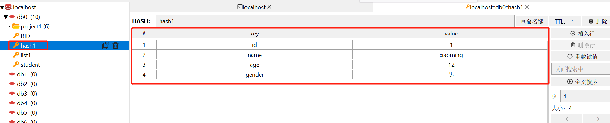
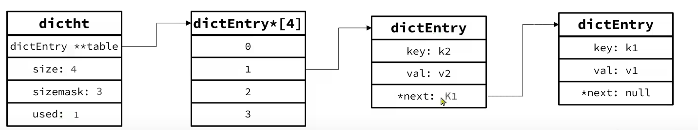
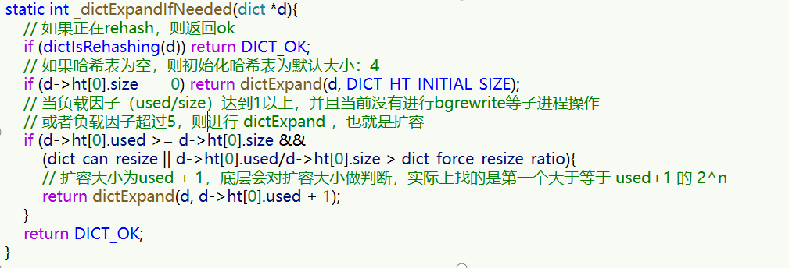
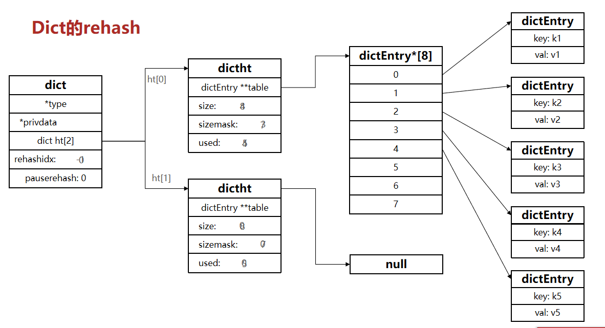
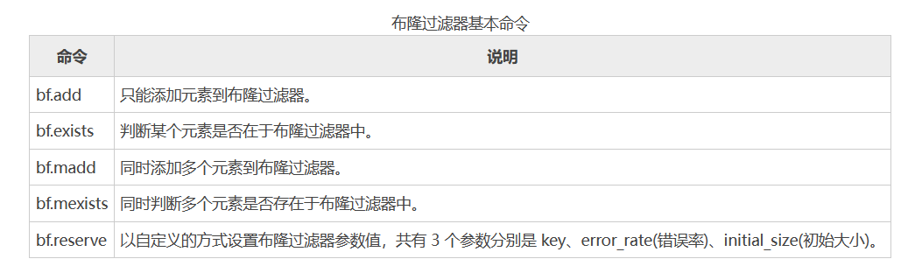
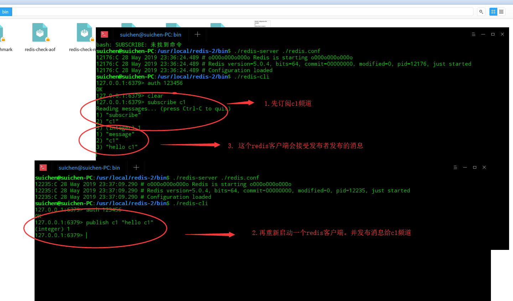

[toc]

# Redis笔记3

Redis 存在多种数据类型，比如字符串、列表、哈希散列等。不同数据类型的 value, 它们的底层结构也不相同。接下来介绍各个数据类型的底层原理。

## Redis数据结构-RedisObject

Redis中的任意数据类型的键和值都会被封装为一个RedisObject，也叫做Redis对象，源码如下：


> 什么是redisObject？

从Redis的使用者的角度来看，⼀个Redis节点包含多个database，而一个database维护了从key-value的映射关系。这个映射关系的key是string类型，⽽value可以是多种数据类型，比如：string, list, hash、set、sorted set等。我们可以看到，key的类型固定是string，而value可能的类型是多个。
⽽从Redis内部实现的⾓度来看，key固定用⼀种数据结构来表达就够了，这就是动态字符串sds。而value则比较复杂，为了能够存储不同类型的value，这就需要⼀个通⽤的数据结构，这个通用的数据结构就是robj，全名是redisObject。

> Redis的底层存储结构

Redis中会根据存储的数据类型不同，选择不同的底层存储结构，共包含11种不同类型：

| **编号** | **底层存储结构**            | **说明**               |
| -------- | ----------------------- | ---------------------- |
| 0        | OBJ_ENCODING_RAW        | raw编码动态字符串      |
| 1        | OBJ_ENCODING_INT        | long类型的整数的字符串 |
| 2        | OBJ_ENCODING_HT         | hash表（字典dict）     |
| 3        | OBJ_ENCODING_ZIPMAP     | 已废弃                 |
| 4        | OBJ_ENCODING_LINKEDLIST | 双端链表               |
| 5        | OBJ_ENCODING_ZIPLIST    | 压缩列表               |
| 6        | OBJ_ENCODING_INTSET     | 整数集合               |
| 7        | OBJ_ENCODING_SKIPLIST   | 跳表                   |
| 8        | OBJ_ENCODING_EMBSTR     | embstr的动态字符串     |
| 9        | OBJ_ENCODING_QUICKLIST  | 快速列表               |
| 10       | OBJ_ENCODING_STREAM     | Stream流               |


> 五种数据类型

Redis中会根据存储的数据类型不同，选择不同的底层存储结构。每种数据类型的使用的底层存储结构如下：

| **数据类型** | **底层存储结构**                                       |
| ------------ | -------------------------------------------------- |
| OBJ_STRING   | int、embstr、raw                                   |
| OBJ_LIST     | LinkedList和ZipList(3.2以前)、QuickList（3.2以后） |
| OBJ_SET      | intset、HT                                         |
| OBJ_ZSET     | ZipList、HT、SkipList                              |
| OBJ_HASH     | ZipList、HT                                        |


## 五种基础数据类型的存储结构

### string 字符串类型

Redis 使用标准C语言编写，但在存储字符串的时候，Redis并未使用C语言的字符类型，而是自定义了一个名为 SDS（Simple Dynamic  String，简单动态字符串）的结构来存储字符串。

> 新建一个string类型的键值对，发生了什么？

```bash
127.0.0.1:6379> set name java
```

当你执行上面代码时。Redis将在底层创建两个SDS，其中一个是包含“name”的SDS，另一个是包含“java”的SDS。然后将这两个SDS关联起来。

> SDS的源码如下

```c
struct sdshdr{
     //记录buf数组中已使用字符的数量，等于 SDS 保存字符串的长度
     int len;
     //记录 buf 数组中未使用的字符数量
     int free;
     //字符数组，用于保存字符串
     char buf[];
}
```


由源码可知，Redis的 string 类型是将字符串存储到字符数组buf[]中，并使用 len、free对buf[]数组的长度和未使用的字符数进行描述。

> SDS的特点？
* 获取字符串长度的时间复杂度为o(1)
* 支持动态扩容


> SDS如何扩容？

SDS之所以叫做动态字符串，是因为它具备动态扩容的能力。Redis 字符串允许的最大值字节数是 512 MB。

例如一个内容为“hi”的SDS：


如果要给“hi”追加一段字符串“,Amy”，首先判断字符串中的未使用空间能够存储追加的字符串，如果不能则会申请新内存空间：
- 如果新字符串小于1M，则新空间为扩展后字符串长度的两倍+1；
- 如果新字符串大于1M，则新空间为扩展后字符串长度+1M+1。称为内存预分配。

扩容后，如图所示。


### list 列表类型

Redis中的 list（列表数据类型）相当于 Java 语言中的 LinkedList 结构，是一个链表而非数组，其插入、删除元素的时间复杂度为 O(1)，但是查询速度欠佳，时间复杂度为 O(n)。

> 底层存储结构

Redis 列表的底层存储结构，其实是一个被称为快速链表（quicklist）的结构。
- 当存储的元素较少时，Redis 会使用一块连续的内存来存储这些元素，这个连续的内存结构被称为 ziplist（压缩列表），它将所有的元素紧挨着一起存储。
- 当存储的元素较多时，Redis 列表就会是用 quicklist（快速链表）存储元素。quicklist是一个双端链表，只不过链表中的每个节点都是一个ziplist。

<font color="red">redis在3.2版本之后，统一采用quicklist存储结构来实现List</font>

简而言之，quicklist就是将多个 ziplist 使用双向指针串联起来，这样既能满足快速插入、删除的特性，又节省了一部分存储空间。quicklist结构如图所示。


#### ziplist (压缩列表)

ziplist 是一种特殊的“双端链表” ，由一系列特殊编码的连续内存块组成。可以在任意一端进行压入/弹出操作, 并且该操作的时间复杂度为 O(1)。

> ziplist 存储结构如图所示


* zlbytes : 记录整个压缩列表占用的内存字节数
* zltail : 记录压缩列表表尾节点距离压缩列表的起始地址有多少字节，通过这个偏移量，可以确定表尾节点的地址。
* zllen : 记录了压缩列表包含的节点数量。
* entry : 压缩列表包含的各个节点，节点的长度由节点保存的内容决定。 
* zlend : 用于标记压缩列表的末端。


> zipList中的entry节点

entry节点采用了下图的存储结构


* previous_entry_length：前一节点的长度，占1个或5个字节。
  * 如果前一节点的长度小于254字节，则采用1个字节来保存这个长度值
  * 如果前一节点的长度大于254字节，则采用5个字节来保存这个长度值，第一个字节为0xfe，后四个字节才是真实长度数据
* encoding：编码属性，记录content的数据类型（字符串还是整数）以及长度，占用1个、2个或5个字节
* contents：保存节点中存储的数据，可以是字符串或整数

> entry节点中的encoding编码

entry中的encoding编码分为字符串和整数两种。如果encoding是以“00”、“01”或者“10”开头，则证明content是字符串。否则是整数

例如保存字符串：“ab”和 “bc”


> entry节点中的previous_entry_length

每个entry都包含previous_entry_length来记录上一个节点的大小，长度是1个或5个字节：
- 如果前一节点的长度小于254字节，则采用1个字节来保存这个长度值
- 如果前一节点的长度大于等于254字节，则采用5个字节来保存这个长度值，第一个字节为0xfe，后四个字节才是真实长度数据。

> zipList的连续更新问题

现在，假设我们有N个连续的、长度为250~253字节之间的entry，因此entry的previous_entry_length属性用1个字节即可表示，如图所示：


zipList在这种特殊情况下产生的连续多次空间扩展操作称之为连锁更新（Cascade Update）。新增、删除都可能导致连锁更新的发生。

> 总结：zipList特性
* zipList压缩列表的可以看做一种连续内存空间的"双向链表"
* 列表的节点之间不是通过指针连接，而是记录上一节点和本节点长度来寻址，内存占用较低
* 如果列表数据过多，导致链表过长，可能影响查询性能
* 增或删较大数据时有可能发生连续更新问题


#### quicklist

当list存储的数据量过多，超出了zipList存储结构的最佳上限时，就容易触发ziplist的连续更新问题。我们可以将ziplist中的数据进行拆分。但是拆分又不方便管理和查找。于是为了解决上述种种问题，quicklist就出现了。

quicklist就是将多个ziplist使用双向指针串联起来的双向链表，quicklist的每个节点都是一个zipList。这样既能满足快速插入、删除的特性，又节省了一部分存储空间。

<font color="red">redis在3.2版本之后，统一采用quicklist存储结构来实现List</font>

> quicklist的和quicklistNode的源码如图所示


> quicklist的存储结构如图所示


> quicklist的节点限制

为了避免quickList中的每个zipList中entry节点过多，Redis提供了一个配置项：list-max-ziplist-size来限制。其默认值为-2。
- 如果值为正，则代表zipList的允许的entry个数的最大值
- 如果值为负，则代表zipList的最大内存大小，分5种情况：
  * -1：每个ZipList的内存占用不能超过4kb
  * -2：每个ZipList的内存占用不能超过8kb
  * -3：每个ZipList的内存占用不能超过16kb
  * -4：每个ZipList的内存占用不能超过32kb
  * -5：每个ZipList的内存占用不能超过64kb


> quicklist的特点
* 是一个节点为ZipList的双端链表
* 节点采用ZipList，解决了传统链表的内存占用问题
* 控制了ZipList大小，解决连续内存空间申请效率问题
* 中间节点可以压缩，进一步节省了内存


### set 集合类型

set 集合类型遵循无序，唯一的规则，集合中的每一个成员都是字符串类型，并且不可重复。

set 集合类型采用了两种方式相结合的底层存储结构，分别是 intset（整型数组）与 hash table（哈希表），
* 当 set 存储的数据满足以下要求时，使用 intset 结构：
  * 集合内保存的所有成员都是整数值；
  * 集合内保存的成员数量不超过 512 个。
* 当不满足上述要求时，则使用 hash table 结构。

#### intset 存储结构

> intset 的结构体定义如下
```c
typedf struct inset{
    uint32_t encoding;  //指定编码方式，默认为INSET_ENC_INT16
    uint32_t length;    //集合内成员的总个数
    int8_t contents[];  //实际存储成员的数组，并且数组中的数值从小到大依次排列
}inset;
```

* encoding：指定编码格式，共有三种，分别是 INTSET_ENC_INT16、INSET_ENC_INT32 和 INSET_ENC_INT64，它们对应不同的数值范围。它会根据插入数据的大小来选择不同的编码格式。
* length：集合内成员的数量，记录 contents 数组中共有多少个成员。
* contents：存储成员的数组，数组中的成员从小到大依次排列，且不允许重复。

> intset 存储结构如图所示


> Intset的特点：
* Redis会确保Intset中的元素唯一、有序
* Intset类型升级机制，可以节省内存空间
* 底层采用二分查找方式来查询


### zset 有序集合类型

zset（有序集合类型）中的成员是有序排列的，集合中的每一个成员都是字符串类型，并且不允许重复；zset是有序的，这是因为zset中每个成员都会关联一个score (分数值)，正是通过 score 实现了对zset中成员的排序。

zset中score可以重复。


zset（有序集合）使用了两种不同的底层存储结构，分别是 zipList（压缩列表）和 skipList（跳跃列表）。

当 zset 满足以下两个条件时使用zipList，否则使用skiplist作为存储结构。
* 成员的数量小于128 个；
* 每个 member （成员）的字符串长度都小于 64 个字节。

#### zipList（压缩列表）

>zipList存储结构如图所示


* zlbytes : 记录整个压缩列表占用的内存字节数
* zltail : 记录压缩列表表尾节点距离压缩列表的起始地址有多少字节，通过这个偏移量，可以确定表尾节点的地址。
* zllen : 记录了压缩列表包含的节点数量。
* entry : 压缩列表包含的各个节点，节点的长度由节点保存的内容决定。 
* zlend : 用于标记压缩列表的末端。

> 例如 ZADD命令添加两个成员：xh（小红） 的工资是 3500.0；xm（小明） 的工资是 3200.0。

```bash
ZADD salary 3500.0 xh 3200.0 xm
```


当添加完两个成员后，存储如图所示，zipList中的所有成员最终会按照 score 从小到大排列。

#### skipList（跳跃列表）

当zset不满足使用压缩列表的条件时，就会使用 skipList 结构来存储数据。

SkipList（跳表）首先是链表，但与传统链表相比有几点差异：
- 元素按照升序排列存储
- 节点可能包含多个指针，指针跨度不同。

> 跳表的源码如图所示


* header：指向 skiplist 的头节点指针，通过它可以直接找到跳表的头节点，时间复杂度为 O(1)；
* tail：指向 skiplist 的尾节点指针，通过它可以直接找到跳表的尾节点，时间复杂度为 O(1)；
* length：记录 skiplist 的长度，也就跳表中有多少个元素，但不包括头节点；
* level：记录当前跳表内所有节点中的最大层数（level）；


跳跃列表的每一层都是一个有序的链表，链表中每个节点都包含两个指针，一个指向同一层的下了一个节点，另一个指向下一层的同一个节点。最低层的链表将包含 zset 中的所有元素。如果说一个元素出现在了某一层，那么低于该层的所有层都将包含这个元素，也就说高层是底层的子集。 

> 跳表的查询节点的过程


跳跃列表中的每个节点都存储着 S:V（即 score/value），示意图显示了使用跳跃列表查找 S:V 节点的过程。跳跃列表的层数由高到低依次排列，最低层是 L0 层，最高层是 L3 层，共有 4 层。

图 1 所示，首先从最高层开始遍历找到第一个S:V节点，然后从此节点开始，逐层下降，通过遍历的方式找出每一层的 S:V 节点，直至降至最底层（L0）才停止。在这个过程中找到所有 S:V 节点被称为期望的节点。跳跃列表把上述搜索一系列期望节点的过程称为“搜索路径”，这个“搜索路径”由搜索到的每一层的期望节点组成，其本质是一个列表。

> 跳表的存储结构如图所示


> skipList的特点
* 跳跃表是一个双向链表，每个节点都包含score和ele值
* 节点按照score值排序，score值一样则按照ele字典排序
* 每个节点都可以包含多层指针，层数是1到32之间的随机数
* 不同层指针到下一个节点的跨度不同，层级越高，跨度越大
* 增删改查效率与红黑树基本一致，实现却更简单


### hash 哈希散列类型

hash（哈希散列）是由字符类型的 field（字段）和 value 组成的哈希映射表结构（也称散列表），它非常类似于表格结构。在 hash 类型中，field 与 value 一一对应，且不允许重复。

hash 特别适合于存储对象。一个 filed/value 可以看做是表格中一条数据记录；而一个 key 可以对应多条记录。

当 hash 类型移除最后一个元素后，该存储结构就会被自动删除，其占用内存也会被系统回收。





hash 类型底层存储结构有两种实现方式。
- 第一种，hash 采用 ziplist 作为底层存储结构，此时要求符合以下两个条件：
  - 哈希对象保存的所有键值对（键和值）的字符串长度总和小于 64 个字节。
  - 哈希对象保存的键值对数量要小于 512 个。
- 当无法满足第一种的两个条件时，hash 就会采用 dict（字典结构）来存储数据，该结构类似于 Java 的 HashMap，是一个无序的字典，并采用了数组和链表相结合的方式存储数据。


#### dict（字典结构）

Dict由三部分组成，分别是：哈希表（DictHashTable）、哈希节点（DictEntry）、字典（Dict）


当我们向Dict添加键值对时，Redis首先根据key计算出hash值（h），然后利用 h & sizemask来计算元素应该存储到数组中的哪个索引位置。我们存储k1=v1，假设k1的哈希值h =1，则1&3 =1，因此k1=v1要存储到数组角标1位置。




> Dict的扩容

Dict中的HashTable就是数组结合单向链表的实现，当集合中元素较多时，必然导致哈希冲突增多，链表过长，则查询效率会大大降低。
Dict在每次新增键值对时都会检查负载因子（LoadFactor = used/size） ，满足以下两种情况时会触发哈希表扩容：
哈希表的 LoadFactor >= 1，并且服务器没有执行 BGSAVE 或者 BGREWRITEAOF 等后台进程；
哈希表的 LoadFactor > 5 ；




> Dict的rehash

不管是扩容还是收缩，必定会创建新的哈希表，导致哈希表的size和sizemask变化，而key的查询与sizemask有关。因此必须对哈希表中的每一个key重新计算索引，插入新的哈希表，这个过程称为rehash。过程是这样的：

* 计算新hash表的realeSize，值取决于当前要做的是扩容还是收缩：
  * 如果是扩容，则新size为第一个大于等于dict.ht[0].used + 1的2^n
  * 如果是收缩，则新size为第一个大于等于dict.ht[0].used的2^n （不得小于4）
* 按照新的realeSize申请内存空间，创建dictht，并赋值给dict.ht[1]
* 设置dict.rehashidx = 0，标示开始rehash
* 将dict.ht[0]中的每一个dictEntry都rehash到dict.ht[1]
* 将dict.ht[1]赋值给dict.ht[0]，给dict.ht[1]初始化为空哈希表，释放原来的dict.ht[0]的内存
* 将rehashidx赋值为-1，代表rehash结束
* 在rehash过程中，新增操作，则直接写入ht[1]，查询、修改和删除则会在dict.ht[0]和dict.ht[1]依次查找并执行。这样可以确保ht[0]的数据只减不增，随着rehash最终为空

整个过程可以描述成：


> Dict的结构：
* 类似java的HashTable，底层是数组加链表来解决哈希冲突
* Dict包含两个哈希表，ht[0]平常用，ht[1]用来rehash

> Dict的伸缩：
* 当LoadFactor大于5或者LoadFactor大于1并且没有子进程任务时，Dict扩容
* 当LoadFactor小于0.1时，Dict收缩
* 扩容大小为第一个大于等于used + 1的2^n
* 收缩大小为第一个大于等于used 的2^n
* Dict采用渐进式rehash，每次访问Dict时执行一次rehash
* rehash时ht[0]只减不增，新增操作只在ht[1]执行，其它操作在两个哈希表


## 布隆过滤器

布隆过滤器（Bloom Filter）是 Redis 4.0 版本提供的新功能，它被作为插件加载到 Redis 服务器中，给 Redis 提供强大的去重功能。

> set集合和布隆过滤器的区别
* 两者都能对数据进行去重。
* 布隆过滤器相比set集合，在空间利用上节省90%以上。
* 布隆过滤器的去重率在99%以上，有1%左右的误判率。这种误差是由布隆过滤器的自身结构决定的。在某些场景下，

> 应用场景

布隆过滤器是 Redis 的高级功能，虽然这种结构的去重率并不完全精确，但和其他结构一样都有特定的应用场景，比如当处理海量数据时，就可以使用布隆过滤器实现去重。

例如垃圾邮件过滤功能也采用了布隆过滤器。虽然在过滤的过程中，布隆过滤器会存在一定的误判，但比较于牺牲宝贵的性能和空间来说，这一点误判是微不足道的。

### 工作原理

布隆过滤器（Bloom Filter）是一个高空间利用率的概率性数据结构，由二进制向量（即位数组）和一系列随机映射函数（即哈希函数）两部分组成。

布隆过滤器使用exists()方法来判断某个元素是否存在于自身结构中。当布隆过滤器判定某个值存在时，其实这个值只是有可能存在；当它说某个值不存在时，那这个值肯定不存在，这个误判概率大约在 1% 左右。

> 添加元素到布隆过滤器中

布隆过滤器主要由位数组和一系列 hash 函数构成，其中位数组的初始状态都为 0。

当使用布隆过滤器添加 key 时，会使用不同的 hash 函数对 key 存储的元素值进行哈希计算，从而会得到多个哈希值。根据哈希值计算出一个整数索引值，将该索引值与位数组长度做取余运算，最终得到一个位数组位置，并将该位置的值变为 1。每个 hash 函数都会计算出一个不同的位置，然后把数组中与之对应的位置变为 1。通过上述过程就完成了元素添加(add)操作。


> 判断元素是否存在

当判断布隆过滤器中的一个元素是否存时，其流程如下：首先对给定元素再次执行哈希计算，得到与添加元素时相同的位数组位置，判断所得位置是否都为 1，如果其中有一个为 0，那么说明元素不存在，若都为 1，则说明元素有可能存在。

> 为什么是可能“存在”

为什么判断某个元素是有可能存在的？其实原因很简单，那些被置为 1 的位置也可能是由于其他元素的操作而改变的。比如，元素1 和 元素2，这两个元素同时将一个位置变为了 1（图1所示）。在这种情况下，我们就不能判定“元素 1”一定存在，这是布隆过滤器存在误判的根本原因。

### 安装布隆过滤器

在 Redis 4.0 版本之后，布隆过滤器才作为插件被正式使用。布隆过滤器需要单独安装到redis上才能使用。

> docker安装

```bash
docker pull redislabs/rebloom:latest
docker run -p 6379:6379 --name redis-redisbloom redislabs/rebloom:latest
docker exec -it redis-redisbloom bash
redis-cli
# 测试是否安装成功
127.0.0.1:6379> bf.add www.biancheng.net hello
```

> 安装包安装

```bash
# 下载地址：
https://github.com/RedisBloom/RedisBloom
# 解压文件：
unzip RedisBloom-master.zip
# 进入目录：
cd RedisBloom-master
# 执行编译命令，生成redisbloom.so 文件：
make
# 拷贝至指定目录：
cp redisbloom.so /usr/local/redis/bin/redisbloom.so
# 在redis配置文件里加入以下配置：
loadmodule /usr/local/redis/bin/redisbloom.so
# 配置完成后重启redis服务：
sudo /etc/init.d/redis-server restart
# 测试是否安装成功
127.0.0.1:6379> bf.add www.biancheng.net hello
```

### 使用布隆过滤器

> 布隆过滤器常用命令



```bash
127.0.0.1:6379> bf.add spider:url www.biancheng.net
(integer) 1
127.0.0.1:6379> bf.exists spider:url www.biancheng.net
(integer) 1
127.0.0.1:6379> bf.madd spider:url www.taobao.com www.123qq.com
1) (integer) 1
2) (integer) 1
127.0.0.1:6379> bf.mexists spider:url www.jd.com www.taobao.com
1) (integer) 0
2) (integer) 1
```

## Redis事务

Redis事务的目的是方便用户一次执行多个命令。可以把Redis的事务可以理解为一个批量执行Redis命令的脚本，但这个操作并非原子性操作，也就是说，如果中间某条命令执行失败，并不会导致前面已执行命令的回滚，同时也不会中断后续命令的执行（不包含监听 key 的情况）。

执行 Redis 事务可分为三个阶段：开始事务-》命令入队-》执行事务

> Redis事务的特征
* 事务在执行过的程中，不会被其他命令打断。
* Redis事务，如果存在命令执行失败的情况，那么其他命令依然会被执行，不支持事务回滚机制。


> 事务命令


```bash
## 开启事务
127.0.0.1:6379> MULTI
OK
127.0.0.1:6379> INCR 1
QUEUED ## 命令入队成功
127.0.0.1:6379> SET num 10
QUEUED
## 批量执行命令
127.0.0.1:6379> EXEC
1) (integer) 1
2) OK


## 开启事务之前设置key/value，并监听
127.0.0.1:6379> set www.biancheng.net hello
OK
127.0.0.1:6379> WATCH www.biancheng.net
OK
127.0.0.1:6379> get www.biancheng.net
"hello"
## 开启事务
127.0.0.1:6379> MULTI
OK
## 更改key的value值
127.0.0.1:6379> set www.biancheng.net HELLO
QUEUED
127.0.0.1:6379> GET www.biancheng.net
QUEUED
## 命令执行失败
127.0.0.1:6379> EXEC
(error) EXECABORT Transaction discarded because of previous errors.
## 取消监听key
127.0.0.1:6379> UNWATCH 
OK 

```

## Redis发布订阅

Redis 发布订阅(pub/sub)是一种消息通信模式：发送者(pub)发送消息，订阅者(sub)接收消息。用来传递消息的链路则被称为 channel。Redis客户端可以订阅任意数量的 channel（可译为频道）。

> 发布订阅流程


> 发布订阅命令


> 例子

1. 打开一个 Redis 客户端，订阅一个c1频道。订阅频道后，客户端会处于等待接收消息的阻塞状态。
2. 重新开启另一个redis客户端，在c1频道发布消息，订阅者就能接收到消息。
3. 回到之前的订阅频道的客户端，会发现该客户端接受了消息。

```bash
## 先订阅一个c1 频道
127.0.0.1:6379> subscribe c1
Reading messages... (press Ctrl-C to quit)
1) "subscribe"
2) "c1"
3) (integer) 1

## 再重新开启个redis客户端，然后在c1频道发布消息，订阅者就能接收到消息。
127.0.0.1:6379> publish c1 "hello c1"
(integer) 1

### 再回到之前的订阅c1频道的redis客户端,会发现多出了几行信息。
127.0.0.1:6379> subscribe c1
Reading messages... (press Ctrl-C to quit)
1) "subscribe"
2) "c1"
3) (integer) 1
1) "message"      ## 从这里开始就是另一个客户端向c1频道发布的信息
2) "c1"
3) "hello c1"
```




## Redis消息队列

### 消息队列介绍

消息队列字面意思就是存放消息的队列。最简单的消息队列模型包括3个角色：

* 队列：用于存储和管理消息的队列。
* 生产者：发送消息到消息队列
* 消费者：从消息队列获取消息并处理消息


> 消息队列的好处

举一个生活中的例子就是：快递员(生产者)把快递放到快递柜里边(消息队列)去，我们(消费者)从快递柜里边去拿东西。消息队列的存在将生产者和消费者分离开来。让它们不会互相影响，这就叫解耦。

虽然有许多现成的消息队列工具，比如kafka，rabbitmq等等，但是也可以直接使用redis提供的消息队列方案，降低部署和学习成本。

### Stream 消息队列介绍

Redis Stream 是 Redis 5.0 版本引入的一种新数据类型。实际上是一个具有消息发布/订阅功能的消息队列。

> stream消息队列结构如图所示

Stream 消息队列主要由四部分组成，分别是：消息本身、生产者、消费者和消费组。


Stream 消息队列中可以拥有多个消费组，每个消费组中又包含了多个消费者，组内消费者之间存在竞争关系。当某个消费者消费了一条消息时，同组消费者，都不会再次消费这条消息。被消费的消息 ID 会被放入等待处理的 Pending_ids 中。每消费完一条信息，消费组的游标就会向前移动一位，组内消费者就继续去争抢下消息。

> 名词解释
* Stream direction：表示数据流，它是一个消息链，将所有的消息都串起来，每个消息都有一个唯一标识 ID 和对应的消息内容。
* Consumer Group ：表示消费组，使用 XGROUP CREATE 命令创建。一个 Stream 消息链上可以有多个消费组，一个消费组内拥有多个消费者，每一个消费者也有一个唯一的 ID 标识。
* last_delivered_id ：表示消费组游标，每个消费组都会有一个游标 last_delivered_id，任意一个消费者读取了消息都会使游标 last_delivered_id 往前移动。
* pending_ids ：表示消费者的状态变量，它记录了当前已经被客户端读取的消息 ID，但是这些消息没有被 ACK(确认字符)。如果客户端没有 ACK，那么这个变量中的消息 ID 会越来越多，一旦被某个消息被 ACK，它就开始减少。
* ACK：即确认字符，接收方传递给发送方的一种传输类控制字符。表示发来的数据已确认接收无误。如果接收方成功的接收到数据，那么会回复一个 ACK 数据。


> stream的优点

Stream 除了拥有很高的性能和内存利用率外, 它最大的特点就是提供了消息的持久化存储，以及主从复制功能，从而解决了网络断开、Redis 宕机情况下，消息丢失的问题，即便是重启 Redis，存储的内容也会存在。


> stream常用命令


### 使用 stream 消息队列


发送消息的命令如图

例如

读取消息的方式之一：XREAD

例如，使用XREAD读取第一个消息

XREAD阻塞方式，读取最新的消息


