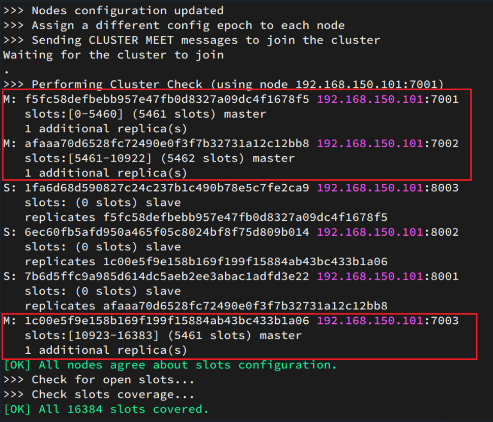

[toc]

# Redis笔记4

## Redis的持久化

Redis 是一款基于内存的非关系型数据库，它会将数据全部存储在内存中。但是如果 Redis 服务器出现某些意外情况，比如宕机或者断电等，那么内存中的数据就会全部丢失。因此必须有一种机制能够保证 Redis 储存的数据不会因故障而丢失，这就是 Redis 的数据持久化机制。

持久化会把存储在内存的数据放到硬盘上。即使在服务器发生故障之后，也能通过本地磁盘对数据进行恢复。

Redis 提供了两种持久化方案：第一种是 RDB，又称快照（snapshot）模式，第二种是 AOF 日志，也就追加模式。

### RDB快照模式持久化

RDB （全称Redis Database Backup ）即快照模式，它是 Redis 默认的数据持久化方式，简单来说就是把内存中的数据都存储到dump.rdb文件中。当Redis实例故障重启后，就从磁盘读取dump.rdb文件，恢复数据。

#### RDB持久化的使用

在redis中，有两种方式来触发RDB持久化。一种是手动触发，另一种是自动触发。

<font color="red">注意：Redis在停机时会自动执行一次save命令，实现RDB持久化。</font>

> 手动触发

手动触发是通过SAVAE命令或者BGSAVE命令将内存数据保存到磁盘中。命令执行后，将在Redis安装目录中创建dump.rdb文件。

```bash
# 对当前数据库进行数据备份
127.0.0.1:6379> SAVE
OK

# BGSAVE命令，在后台进行数据备份
127.0.0.1:6379> BGSAVE
Background saving started
```

* SAVE 命令会阻塞 Redis 服务器进程，直到 dump.rdb 文件创建完毕为止，在这个过程中，服务器不能处理任何的命令请求。
* BGSAVE命令是非阻塞式的，在该命令执行的过程中，并不影响 Redis 服务器处理客户端的其他请求。

> 自动触发

自动触发策略，是指Redis在指定的时间内，数据发生了多少次变化时，会自动执行BGSAVE命令。自动触发的条件需要配置在Redis配置文件。

redis.windows.conf配置文件
```
save 900 1     #表示900秒内如果超过1个key被修改，则执行BGSAVE命令
save 300 10    #表示300秒内容如超过10个key被修改，则执行BGSAVE命令
```

> 数据还原

1. 先通过save或bgsave命令将当前数据库进行备份。
2. 然后把dump.rdb 移动到其它地方
3. 需要数据还原的时候 把dump.rdb放到redis安装目录下
4. 重新启动redis 即可

#### RDB持久化的优缺点

1. 优点：适合于大规模的数据恢复，并且还原速度快。
1. 缺点：快照是定期生成的，并且一次快照时间较长。所以在Redis崩溃时或多或少会丢失一部分数据。
2. 缺点：不能过于频繁地创建 rdb 文件，否则会严重影响服务器的性能。

#### bgSave命令为什么是非阻塞式的？

bgsave命令开始运行的时候，首先会fork主进程得到子进程，子进程共享主进程的内存数据。完成fork后读取内存数据并写入到RDB文件中。

bgsave命令的流程
- 首先fork主进程得到一个子进程，共享内存空间
- 子进程读取内存数据并写入新的RDB文件
- 用新RDB文件替换旧的RDB文件


### AOF追加模式持久化

AOF全称为Append Only File（追加文件）,被称为追加模式，是 Redis 提供的另一种持久化策略。它能够存储 Redis 服务器已经执行过的的命令，并且只记录对内存有过修改的命令，这种数据记录方法，被叫做“增量复制”，其默认存储文件为appendonly.aof。

在Redis重启时，会把appendonly.aof文件中记录的所有写操作顺序执行一遍，确保数据恢复到最新。


#### 开启AOF持久化

AOF 机制默认处于未开启状态，可以通过修改 Redis 配置文件开启 AOF。


> Windows系统下
```bash
# 先找到redis的配置文件
#修改配置文件，把no改为 yes
appendonly yes
#确定存储文件名是否正确
appendfilename "appendonly.aof"

#重启服务器
redis-server --service-stop
redis-server --service-start
```

> linux系统下
```bash
#修改配置文件：
vim /etc/redis/redis.conf
appendonly yes # 把 no 改为 yes
#确定存储文件名是否正确
appendfilename "appendonly.aof"
#重启服务：
sudo /etc/init.d/redis-server restart
```

#### AOF持久化机制

AOF持久化机制：每当有一个修改数据库的命令被执行时，服务器就将命令写入到 appendonly.aof 文件中，该文件存储了服务器执行过的所有修改命令，因此当服务器重新执行一次 .aof 文件，就可以实现还原数据的目的。

#### AOF持久化策略

AOF持久化策略有如下几种。

```bash
## 先开启用aof持久化方式
appendonly yes           

## 默认推荐
# 写命令执行完先放入AOF缓冲区，然后表示每隔1秒将缓冲区数据写到AOF文件
appendfsync everysec

# 表示每执行一次写命令，立即记录到AOF文件
appendfsync always

# 写命令执行完先放入AOF缓冲区，由操作系统决定何时将缓冲区内容写回磁盘
appendfsync no

```

* Always：服务器每写入一个命令，就调用一次 fsync 函数，将缓冲区里面的命令写入到硬盘。这种模式下，服务器出现故障，也不会丢失任何已经成功执行的命令数据，但是其执行速度较慢；
* Everysec（默认）：服务器每一秒调用一次 fsync 函数，将缓冲区里面的命令写入到硬盘。这种模式下，服务器出现故障，最多只丢失一秒钟内的执行的命令数据，通常都使用它作为 AOF 配置策略；
* No：服务器不主动调用 fsync 函数，由操作系统决定何时将缓冲区里面的命令写入到硬盘。这种模式下，服务器遭遇意外停机时，丢失命令的数量是不确定的，所以这种策略，不确定性较大，不安全。


三种策略对比


#### AOF持久化优缺点
1. 优点：AOF文件在发生断电等问题时也不会损坏，即使出现了某条日志只写入了一半的情况，也可以使用redis-check-aof工具轻松修复。
2. 优点：AOF文件易读，可修改，在进行了某些错误的数据清除操作后，只要AOF文件没有rewrite，就可以把AOF文件备份出来，把错误的命令删除，然后恢复数据。
3. 缺点：AOF文件通常比RDB文件更大
4. 缺点：性能消耗比RDB高
5. 缺点：数据恢复速度比RDB慢

#### AOF文件重写

aof文件会随着时间越变越大。当长时间下来，如果机器重启，读取aof文件会非常耗时，导致长时间Redis无法对外提供服务。因此就需要对 aof 文件进行重写。通过执行 bgrewriteaof 命令，可以让AOF文件执行重写功能，用最少的命令达到相同效果。


如图，AOF原本有三个命令，`set num 123 和 set num 666`都是对num的操作，第二次会覆盖第一次的值，因此第一个命令记录下来没有意义。所以重写命令后，AOF文件内容就是：`mset name jack num 666`

> AOF文件重写有两种方式：手动执行和自动配置

```bash
## 手动对aof文件进行重写
127.0.0.1:6379> BGREWRITEAOF
Background append only file rewriting started

## 自动对aof文件进行重写，需要在redis配置文件进行配置
# AOF文件比上次文件 增长超过多少百分比则触发重写
auto-aof-rewrite-percentage 100
# AOF文件体积最小多大以上才触发重写 
auto-aof-rewrite-min-size 64mb 
```

该配置项表示：触发重写所需要的 aof 文件体积百分比，只有当 aof 文件的增量大于 100% 时才进行重写，也就是大一倍。比如，第一次重写时文件大小为 64M，那么第二次触发重写的文件体积为 128M，第三次重写为 256M，以此类推。如果将百分比值设置为 0 就表示关闭 AOF 自动重写功能。


### RDB与AOF对比

RDB和AOF各有自己的优缺点，如果对数据安全性要求较高，在实际开发中往往会结合两者来使用。


## Redis主从模式

单节点Redis的并发能力是有上限的，要进一步提高Redis的并发能力，就需要搭建主从模式的redis，实现读写分离。

在软件的架构中，主从模式（Master-Slave）是使用较多的一种架构。主（Master）和从（Slave）分别部署在不同的服务器上，当主节点服务器写入数据时，同时也会将数据同步至从节点服务器，通常情况下，主节点负责写入数据，而从节点负责读取数据。


在主从模式中 master 主机只执行写命令，其他 salve 从机只执行读命令，这种读写分离的模式可以大大减轻 Redis 主机的数据读取压力，从而提高了Redis 的效率，并同时提供了多个数据备份。主从模式是搭建 Redis Cluster 集群最简单的一种方式。

> 主从模式的3种方式


### 搭建主从模式

安装3个redis，用来搭建主从集群，信息如下
|       IP        | PORT |  角色  |
| :-------------: | :--: | :----: |
| 192.168.150.101 | 6379 | master |
| 192.168.150.101 | 6380 | slave  |
| 192.168.150.101 | 6381 | slave  |

将redis的安装包复制成3份，一份作为主机redis的，其余两份作为从机redis的。

> 1 主机redis配置

无需特殊配置。默认为6379端口。

> 2 从机redis配置

修改从机的redis.conf配置文件

```bash
# 这是6380从机的配置文件更改
# 开启后台运行
daemonize yes
# 修改端口
port 6380
# 指定主机ip端口
slaveof 192.168.150.101 6379

# 这是6381从机的配置文件更改
# 开启后台运行
daemonize yes
# 修改端口
port 6381
# 指定主机ip端口
slaveof 192.168.150.101 6379
```

> 3 启动主机从机

```bash
# 启动主机从机的redis
# windows中的启动命令如下
redis-server --service-start
```

主从模式建立后，从机默认为只读配置，如果修改从节点的只读配置，会导致主从数据不一致。

> 4 查看redis的的主从信息。

`info replication`可以查询当前reids是主机还是从机

```bash
# 主机查看信息
127.0.0.1:6379> info replication
# Replication
role:master
...

#从机6380查看信息
127.0.0.1:6380> info replication
# Replication
role:slave
...

#从机6381查看信息
127.0.0.1:6381> info replication
# Replication
role:slave
...

```

### 主从模式的不足

1. Redis主从模式不具备自动容错和恢复功能，如果主节点宕机，Redis 集群将无法工作，此时需要人为干预，将从节点提升为主节点。
2. 如果主机宕机前有一部分数据未能及时同步到从机，即使切换主机后也会造成数据不一致的问题，从而降低了系统的可用性。
3. 因为只有一个主节点，所以其写入能力和存储能力都受到一定程度地限制。
4. 在进行主从机的数据全量同步时，若同步的数据量较大可能会造卡顿的现象。


### 主从模式的数据同步

主从第一次建立连接时，会执行全量同步，将主机的所有数据都拷贝给从机。在其余时间，主从之间都是进行增量同步。

#### 全量同步

全量同步的流程如图所示


> master如何得知salve是第一次来连接呢?
- Replication Id：简称replid，是数据集的标记，id一致则说明是同一数据集。每一个master都有唯一的replid，slave则会继承master节点的replid
- offset：偏移量，随着记录在repl_baklog中的数据增多而逐渐增大。slave完成同步时也会记录master的offset。如果slave的offset小于master的offset，说明slave数据落后于master，需要更新。

1. 如果slave要进行数据同步，必须向master声明自己的replid和offset，master才可以判断到底需要同步哪些数据。
2. 因为slave原本也是一个master，有自己的replid和offset，当第一次变成slave时，发送的replid和offset是自己的replid和offset。
3. master判断发现slave发送来的replid与自己的不一致，说明这是一个全新的slave，就知道要做全量同步了。
4. master会将自己的replid和offset都发送给这个slave，slave保存这些信息。以后slave的replid就与master的replid就一致了。

因此，master判断一个节点是否是第一次同步的依据，就是看主机和从机的replid和offset是否一致。

#### 增量同步

除了主机从机第一次连接时做全量同步，其它大多数时候slave与master都是增量同步。

增量同步：就是只更新slave与master存在差异的部分数据。

增量同步的流程如图所示


> master怎么知道slave与自己的数据差异?

主要是通过repl_baklog文件来判断数据差异。

repl_baklog文件是一个固定大小的数组，只不过数组是环形，也就是到达数组末尾后，会再次从0开始读写，这样数组头部的数据就会被覆盖。

repl_baklog文件中会记录Redis处理过的命令日志及offset，包括master当前的offset，和slave已经拷贝到的offset。

> 判断数据差异的流程

1. slave与master的offset之间的差异，就是salve需要增量拷贝的数据了。

2. 随着不断有数据写入，master的offset逐渐变大，slave也不断的拷贝，追赶master的offset，直到数组被填满。


3. 此时如果有新的数据写入，就会覆盖数组中的旧数据。不过，旧的数据只要是绿色的，说明是已经被同步到slave的数据，即便被覆盖了也没什么影响。因为未同步的仅仅是红色部分。
4. 当slave出现网络阻塞，导致master的offset远远超过了slave的offset。如果master继续写入新数据，其offset就会覆盖旧的数据，直到将slave现在的offset也覆盖。


棕色框中的红色部分，就是尚未同步，但是却已经被覆盖的数据。此时如果slave恢复，需要同步，却发现自己的offset都没有了，无法完成增量同步了。只能做全量同步。


## Redis哨兵模式

在 Redis 主从复制模式中，因为系统不具备自动恢复的功能，所以当主服务器（master）宕机后，需要手动把一台从服务器（slave）切换为主服务器。在这个过程中，不仅需要人为干预，而且还会造成一段时间内服务器处于不可用状态，同时数据安全性也得不到保障，因此主从模式的可用性较低，不适用于线上生产环境。

Redis 官方推荐一种高可用方案，也就是 Redis Sentinel 哨兵模式，它弥补了主从模式的不足。保证了系统的高可用性。
* 在哨兵模式中，Redis客户端会首先连接 Sentinel，通过 Sentinel 来查询主节点的地址，然后再去连接主节点进行数据交互。
* 在哨兵模式中，Sentinel 负责监控主从节点的状态。当主节点挂掉时，自动选择一个最优的从节点切换为主节点。
* 在哨兵模式中，当主节点发生故障后，Redis客户端会重新向 Sentinel 要主节点的地址，Sentinel 会将最新的主节点地址告诉客户端。因此应用程序无需重启即可自动完成主从节点切换。


> 哨兵模式结构图


> 多哨兵模式结构图

在实际生产情况中，为避免 Sentinel 发生意外，它一般是由 3～5 个节点组成，这样就算挂了个别节点，该 Sentinel 集群仍然可以正常运转。


### 哨兵的作用

哨兵的作用如下
- 监控：哨兵节点会以每秒一次的频率对每个 Redis 节点发送PING命令，并通过 Redis 节点的回复来判断其运行状态。
- 自动故障恢复：如果master故障，Sentinel会将一个slave提升为master。当故障实例恢复后也以新的master为主节点。
- 通知：Sentinel充当Redis客户端的服务发现来源，当集群发生故障转移时，会将最新信息推送给Redis的客户端

#### 哨兵监控redis节点

哨兵节点会以每秒一次的频率对每个 Redis 节点发送PING命令，并通过 Redis 节点的回复来判断其运行状态。

判断分为2种情况：
1. 主观下线：如果哨兵发现某个redis节点未在规定时间响应，则认为该redis节点主观下线。
2. 客观下线：如果超过半数以上的哨兵都认为该redis节点主观下线，则该redis节点客观下线。

#### 哨兵自动故障恢复redis节点

Sentinel哨兵监控主从节点的状态。当主节点挂掉时，自动选择一个最优的从节点切换为主节点。

> 哨兵如何切换主从节点，流程如下
1. sentinel给选中的slave节点发送slaveof no one命令，让该节点成为master节点。
2. sentinel给所有其它slave节点发送 slaveof 命令，指定新master节点的地址端口。让这些slave节点成为新master节点的从节点，开始从新的master节点上同步数据。
3. 最后，sentinel将故障节点标记为slave节点，当故障节点恢复后会自动成为新的master的slave节点


### 搭建哨兵

1. 搭建哨兵模式，需要先搭建主从模式。

例如,6379端口的redis为主节点。6380，6381端口的redis为从节点。

2. 安装sentinel

```bash
sudo apt install redis-sentinel
```

3. 修改sentinel配置文件sentinel.conf

```bash
# 默认端口，可修改
port 26379

# sentinel monitor <master-name> <ip> <redis-port> <quorum>
Sentinel monitor ABC 127.0.0.1 6379 1
```

第二个配置项表示，让 sentinel 去监控一个地址为 ip:port 的主服务器，master-name 可以自定义；quorum是一个数字，表示当有多少个 sentinel 认为主服务器宕机时，它才算真正的宕机掉。

4. 启动sentinel哨兵

```bash
# 方式一
redis-sentinel sentinel.conf
# 方式二 
redis-server sentinel.conf --sentinel
```

5. sentinel配置文件其他配置项


## Redis分片集群模式

主从模式和哨兵模式可以解决高可用、高并发读的问题。但是依然有两个问题没有解决：海量数据存储问题和高并发写的问题。

使用分片集群模式可以解决上述两个问题，如图所示


> 分片集群的特征
- 分片集群模式中有多个master，每个master保存不同数据
- 每个master都可以有多个slave节点
- master与master之间通过ping监测彼此健康状态
- 客户端请求可以访问集群任意节点，最终都会被转发到正确节点

### 搭建分片集群

分片集群需要的节点数量较多，这里搭建一个最小的分片集群，包含3个master节点，每个master包含一个slave节点，结构如下


这里会在同一台虚拟机中开启6个redis实例，模拟分片集群，信息如下
|       IP        | PORT |  角色  |
| :-------------: | :--: | :----: |
| 192.168.150.101 | 7001 | master |
| 192.168.150.102 | 7002 | master |
| 192.168.150.103 | 7003 | master |
| 192.168.150.104 | 8001 | slave  |
| 192.168.150.105 | 8002 | slave  |
| 192.168.150.106 | 8003 | slave  |

> 准备实例和配置

将redis安装目录复制为6份。每一份作为一个redis实例。修改配置如下。

除了端口不同，其他配置相同
```bash
# 监听端口
port 7001
# 开启集群功能
cluster-enabled yes
# 节点心跳失败的超时时间
cluster-node-timeout 5000
# 让redis后台运行
daemonize yes
# 数据库数量
databases 1
```

> 启动6个redis实例

```bash
# 启动redis
# windows中的启动命令如下
redis-server --service-start
```

> 创建集群

虽然6个redis服务启动了，但是目前每个redis服务之间都是独立的，没有任何关联。我们需要执行命令来创建集群，集群管理命令目前都集成到redis-cli中。

集群管理命令，格式如下：
```sh
redis-cli --cluster create --cluster-replicas 1 192.168.150.101:7001 192.168.150.101:7002 192.168.150.101:7003 192.168.150.101:8001 192.168.150.101:8002 192.168.150.101:8003
```

说明：
- `redis-cli --cluster`：代表集群操作命令
- `create`：代表是创建集群
- `--cluster-replicas 1` ：指定集群中每个master的副本个数为1，此时`节点总数 ÷ (replicas + 1)` 得到的就是master的数量。因此节点列表中的前n个就是master，其它节点都是slave节点，随机分配到不同master

集群管理命令运行后的样子

这里输入yes，则集群开始创建

通过命令可以查看集群状态


> 测试

集群操作时，需要给`redis-cli`加上`-c`参数才可以。

如图连接7001节点，存储一个数据，然后在7003节点查询出数据。


