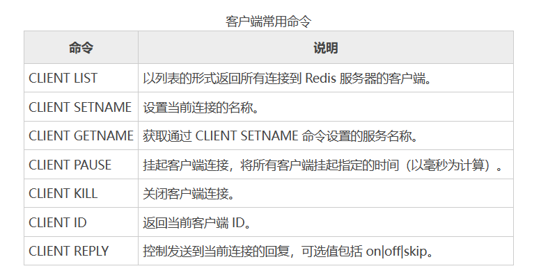
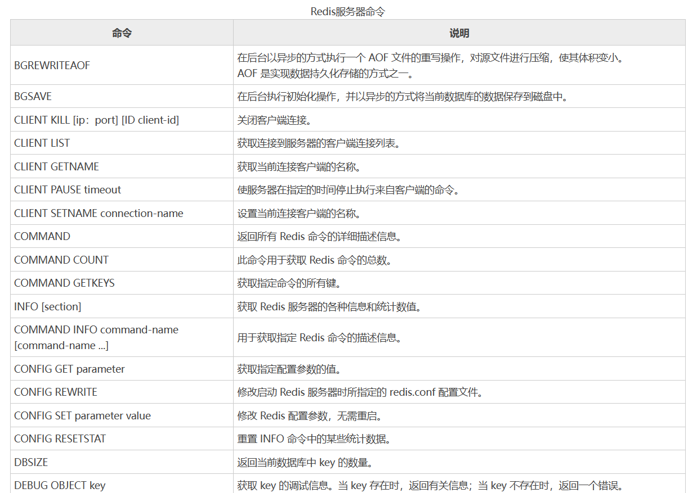
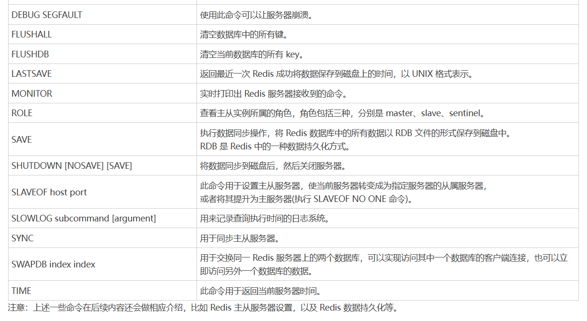
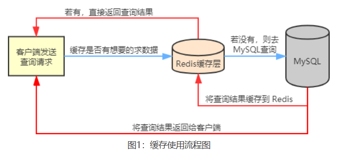
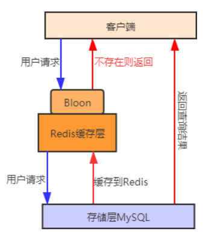
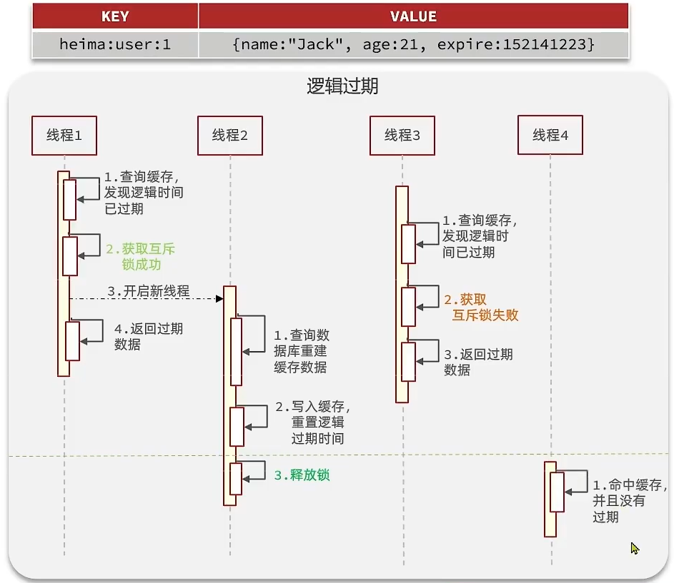
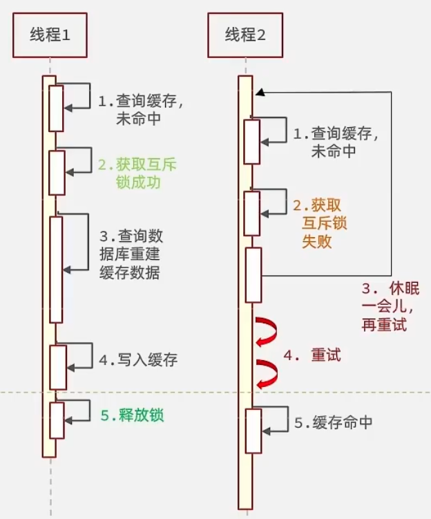
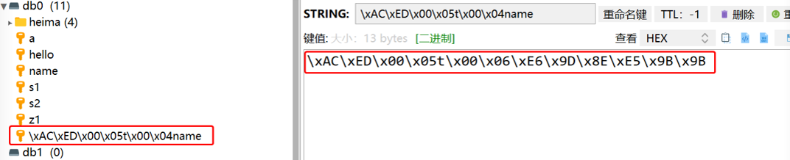

[toc]

# Redis笔记5

## redis 客户端命令

Redis 提供了一些操作客户端（client）的命令，比如查询所有已连接到服务器的客户端数量，控制客户端的连接状态（关闭或者挂起）等。通过客户端命令可以轻松的实现对客户端的管理、控制。

> 设置客户端最大连接数

在 Redis 配置文件中，有一个maxclients的配置项，它指定了连接到 Redis 服务器的最大客户端数量。其默认值是 10000。

```bash
127.0.0.1:6379> config get maxclients
1) "maxclients"
2) "10000"
#更改最大连接数量
127.0.0.1:6379> config set maxclients 20000
OK
127.0.0.1:6379> config get maxclients
1) "maxclients"
2) "20000"
```

> 常用命令



```bash
127.0.0.1:6379> CLIENT ID
(integer) 2557
127.0.0.1:6379> CLIENT LIST
id=2556 addr=127.0.0.1:64684 fd=30 name= age=2422 idle=339 flags=N db=0 sub=0 psub=0 multi=-1 qbuf=0 qbuf-free=0 obl=0 oll=0 omem=0 events=r cmd=client
id=2557 addr=127.0.0.1:49502 fd=43 name= age=537 idle=0 flags=N db=0 sub=0 psub=0 multi=-1 qbuf=26 qbuf-free=32742 obl=0 oll=0 omem=0 events=r cmd=client
127.0.0.1:6379> CLIENT REPLY ON
OK
127.0.0.1:6379> CLIENT SETNAME "www.biancheng.net"
OK
127.0.0.1:6379> CLIENT GETNAME
"www.biancheng.net"
127.0.0.1:6379> CLIENT KILL 127.0.0.1:49502
OK
```

## redis 服务端命令

Redis 提供了诸多操作服务器的命令。




```bash
#查看redis命令的描述信息
127.0.0.1:6379> COMMAND INFO SET GET ZADD
1) 1) "set"
   2) (integer) -3
   3) 1) write
      2) denyoom
   4) (integer) 1
   5) (integer) 1
   6) (integer) 1
2) 1) "get"
   2) (integer) 2
   3) 1) readonly
      2) fast
   4) (integer) 1
   5) (integer) 1
   6) (integer) 1
3) 1) "zadd"
   2) (integer) -4
   3) 1) write
      2) denyoom
      3) fast
   4) (integer) 1
   5) (integer) 1
   6) (integer) 1
#最近一次执行数据持久化存储的时间
127.0.0.1:6379> LASTSAVE
(integer) 1610717455
127.0.0.1:6379> LASTSAVE
(integer) 1610717455
#实时打印redis服务器接收的命令
127.0.0.1:6379> MONITOR
OK
1610951376.523762 [0 127.0.0.1:60257] "COMMAND"
^C
#查看前两条日志信息
127.0.0.1:6379> SLOWLOG get 2
1) 1) (integer) 13
   2) (integer) 1610950258
   3) (integer) 46499
   4) 1) "info"
   5) "127.0.0.1:58561"
   6) ""
2) 1) (integer) 12
   2) (integer) 1610950201
   3) (integer) 19917
   4) 1) "COMMAND"
   5) "127.0.0.1:58561"
   6) ""
#共有多少条日志记录
127.0.0.1:6379> SLOWLOG len
(integer) 14
#清空所有日志记录
127.0.0.1:6379> SLOWLOG reset
OK
127.0.0.1:6379> SLOWLOG len
(integer) 0
#用于同步主从服务器数据
127.0.0.1:6379> SYNC
Entering replica output mode...  (press Ctrl-C to quit)
SYNC with master, discarding 1719 bytes of bulk transfer...
SYNC done. Logging commands from master.
"PING"
"PING"
"PING"
"PING"
"PING"
^C
C:\Users\Administrator>redis-cli
#查看当前服务器时间
#第一个字符串是当前时间以 UNIX 时间戳格式表示
#第二个字符串表示：当前这一秒钟已经逝去的微秒数
127.0.0.1:6379> TIME
1) "1610953086"
2) "17499"
```

## redis的安全策略

Redis 提供了诸多安全策略，比如为了保证数据安全，提供了设置密码的功能。

### 设置redis密码

> 命令行设置密码

```bash
# 查询redis是否设置了密码
# requirepass 参数值为空，表示没有设置密码
127.0.0.1:6379> CONFIG get requirepass
1) "requirepass"
2) ""

# 设置密码为111111
127.0.0.1:6379> CONFIG set requirepass "111111"
OK
127.0.0.1:6379> CONFIG get requirepass
1) "requirepass"
2) "111111"
```

<font color="red">注意：通过命令行设置的密码并非永久有效，当您重启服务后密码就会失效。</font>

> 配置文件设置密码

1. 在 Redis 的安装目录中找到 redis.windows.conf 配置文件。修改密码配置。

```bash
# requirepass foobared
requirepass 111111      ##配置自己的密码
```

2. 重新redis，让配置生效。

```bash
#首先停止服务：
C:\Users\Administrator>redis-server.exe --service-stop
#重启服务器
C:\Users\Administrator>redis-server.exe --service-start
#重新登陆
C:\Users\Administrator>redis-cli.exe -h 127.0.0.1 -p 6379 -a 111111
#命令执行成功
127.0.0.1:6379>config get requirepass
1)"requirepass"
2)"111111"
```

### 限制外部ip

如果 Redis 的服务地址一旦可以被外网直接访问，其内部数据就彻底丧失了安全性。因此务必在 Redis 的配置文件中绑定要监听的 IP 地址。

```
bind 193.168.1.1 #绑定外网ip地址
```


## Redis缓存问题

在实际的业务场景中，Redis 一般和其他数据库搭配使用，用来减轻后端数据库的压力，比如和关系型数据库 MySQL 配合使用。

Redis 会把 MySQL 中经常被查询的数据缓存起来，比如热点数据，这样当用户来访问的时候，就不需要到 MySQL 中去查询了，而是直接获取 Redis 中的缓存数据，从而降低了后端数据库的读取压力。如果说用户查询的数据 Redis 没有，此时用户的查询请求就会转到 MySQL 数据库，当 MySQL 将数据返回给客户端时，同时会将数据缓存到 Redis 中，这样用户再次读取时，就可以直接从 Redis 中获取数据。

流程如图所示



在使用 Redis 作为缓存数据库的过程中，会遇见缓存穿透、缓存击穿和缓存雪崩等问题。

### 缓存穿透

缓存穿透是指当用户查询某个数据时，Redis 中不存在该数据，也就是缓存没有命中，此时查询请求就会转向持久层数据库 MySQL，结果发现 MySQL 中也不存在该数据，MySQL 只能返回一个空对象，代表此次查询失败。如果这种类请求非常多，或者用户利用这种请求进行恶意攻击，就会给redis 和 MySQL 数据库造成很大压力，甚至于崩溃，这种现象就叫缓存穿透。

简而言之，缓存穿透是指客户端请求的数据在缓存中和数据库中都不存在，这样缓存永远不会生效，这些请求都会请求到数据库，如果这种请求很多就会加大数据库的压力。

> 缓存穿透的两种解决方案
* 缓存空对象
* 布隆过滤器


#### 缓存空对象

当 MySQL 返回空对象时，Redis 将该空对象缓存起来，同时为其设置一个过期时间。当用户再次发起相同请求时，就会从缓存中拿到空对象，用户的请求被阻断在了缓存层，从而保护了后端数据库，但是这种做法也存在一些问题，虽然请求进不了 MSQL，但是这种策略会占用 Redis 的缓存空间。

例如：如果一个查询返回的数据为空（不管是数据不存在，还是系统故障），我们仍然把这个空结果进行缓存，但它的过期时间会很短，最长不超过五分钟。通过这个直接设置的默认值存放到缓存，这样第二次到缓冲中获取就有值了，而不会继续访问数据库，这种办法最简单粗暴。


#### 布隆过滤器

使用布隆过滤器的特性来防止缓存穿透。

* 首先将可能会访问的热点数据存储在布隆过滤器中（缓存预热）。
* 当有一个用户请求到来时会先经过布隆过滤器，如果请求的数据，布隆过滤器中不存在，那么该请求将直接被拒绝，否则将继续执行查询。

相较于第一种方法，用布隆过滤器方法更为高效、实用。




### 缓存击穿

缓存击穿是指用户查询的数据缓存中不存在，但是后端数据库却存在，这种现象出现的原因是一般是由缓存中 key 过期导致的。比如一个热点数据 key，它无时无刻都在接受大量的并发访问，如果某一时刻这个 key 突然失效了，就致使大量的并发请求进入后端数据库，导致其压力瞬间增大。这种现象被称为缓存击穿。

简而言之，就是一个被高并发访问的key突然失效了，无数的请求访问会在瞬间给数据库带来巨大的冲击。

>缓存击穿的两种解决方案
* 逻辑过期
* 分布式锁

#### 逻辑过期

给热点数据设置永不过期，就不会有缓存击穿的问题。但是不设置过期时间，数据会一直占用内存。因此可以采用逻辑过期方案。

逻辑过期就是把过期时间设置在 redis的value中，注意：这个过期时间并不会直接作用于redis，而是需要后续通过逻辑去处理。

假设线程1去查询缓存，然后从value中判断出来当前的数据已经过期了，此时线程1去获得互斥锁，那么其他线程会进行阻塞，获得了锁的线程他会开启一个线程去进行以前的重构数据的逻辑，直到新开的线程完成这个逻辑后，才释放锁， 而线程1直接进行返回，假设现在线程3过来访问，由于线程线程2持有着锁，所以线程3无法获得锁，线程3也直接返回数据，只有等到新开的线程2把重建数据构建完后，其他线程才能走返回正确的数据。

如图所示


#### 分布式锁

给热点数据上分布式锁，利用锁的互斥性防止并发访问热点数据，从而避免缓存击穿问题。

当查询热点数据时，首先查询缓存，如果没有，就通过分布式锁进行加锁，第一个获取锁的进程进入后端数据库查询，并将查询结果缓到Redis 中。
当其他进程发现锁被某个进程占用时，就进入等待状态，直至解锁后，其余进程再依次访问被缓存的key。

如图所示


#### 逻辑过期与分布式锁对比

**互斥锁方案：** 由于保证了互斥性，所以数据一致，且实现简单，因为仅仅只需要加一把锁而已，也没其他的事情需要操心，所以没有额外的内存消耗，缺点在于有锁就有死锁问题的发生，且只能串行执行性能肯定受到影响

**逻辑过期方案：** 线程读取过程中不需要等待，性能好，有一个额外的线程持有锁去进行重构数据，但是在重构数据完成前，其他的线程只能返回之前的数据，且实现起来麻烦


### 缓存雪崩

缓存雪崩是指缓存中大批量的 key 同时过期，而此时数据访问量又非常大，从而导致后端数据库压力突然暴增，甚至会挂掉，这种现象被称为缓存雪崩。它和缓存击穿不同，缓存击穿是在并发量特别大时，某一个热点 key 突然过期，而缓存雪崩则是大量的 key 同时过期，因此它们根本不是一个量级。

简而言之，缓存雪崩是指在同一时段大量的缓存key同时失效或者Redis服务宕机，导致大量请求到达数据库，带来巨大压力。


> ​解决方案

缓存雪崩和缓存击穿有相似之处，可以给不同的 key 设置随机过期时间，避免 key 集中过期。


## Java使用Redis

首先需要安装Redis服务。

> 导入Redi maven驱动包

```xml
<dependency>
    <groupId>redis.clients</groupId>
    <artifactId>jedis</artifactId>
    <version>2.9.0</version>
</dependency>
```

> java程序中使用redis

```java
//引入Redis驱动程序
import redis.clients.jedis.Jedis;
public class RedisJava {
    public static void main(String[] args) {
        //连接本地的 Redis 服务
        Jedis jedis = new Jedis("localhost");
        // 如果设置 Redis 服务的密码，需要进行验证，若没有则可以省去
        jedis.auth("123456");
        System.out.println("连接成功");
        //查看服务是否运行
        System.out.println("服务正在运行: "+jedis.ping());

        //设置 redis 字符串数据
        jedis.set("webkey", "www.biancheng.net");
        // 获取存储的数据并输出
        System.out.println("redis 存储的字符串为: "+ jedis.get("webkey"));

        //存储数据到列表中
        jedis.lpush("website_list", "www.biancheng.net");
        jedis.lpush("website_list", "www.baidu.com");
        jedis.lpush("website_list", "c.biancheng.net");
        // 获取存储的数据并输出
        List<String> list = jedis.lrange("website_list", 0 ,2);
        for(int i=0; i<list.size(); i++) {
            System.out.println("列表元素为: "+list.get(i));
        }
    }
}
```

## SpringBoot 使用 Redis

目前大部分的微服务项目，都是基于 SpringBoot 框架进行快速开发，在  SpringBoot 项目中我们应该如何使用 Redis。

① 创建springboot项目
② 添加springboot的redis启动包。

```xml
<dependency>
    <groupId>org.springframework.boot</groupId>
    <artifactId>spring-boot-starter-data-redis</artifactId>
</dependency>
```

springboot项目默认继承一个父工程，而这个redis依赖的版本继承自父工程。


③ 在配置文件中配置redis

```properties
# Redis数据库索引（默认为0）
spring.redis.database=0
# Redis服务器地址
spring.redis.host=127.0.0.1
# Redis服务器连接端口
spring.redis.port=6379
# Redis服务器连接密码（默认为空）
spring.redis.password=
# 连接池最大连接数（使用负值表示没有限制） 默认 8
spring.redis.lettuce.pool.max-active=8
# 连接池最大阻塞等待时间（使用负值表示没有限制） 默认 -1
spring.redis.lettuce.pool.max-wait=-1
# 连接池中的最大空闲连接 默认 8
spring.redis.lettuce.pool.max-idle=8
# 连接池中的最小空闲连接 默认 0
spring.redis.lettuce.pool.min-idle=0
```

注意从SpringBoot 2.x开始，spring-boot-starter-data-redis默认集成的java客户端是Lettuce。

④ 测试代码

SpringBoot提供了一个高度封装的RedisTemplate类来操作redis的各个命令，通过RedisTemplate提供的方法，就可以操作redis。

> RedisTemplate工具类常用方法


```java
@RestController
@RequestMapping("/redis")
public class redisController {

    @Autowired
    private RedisTemplate redisTemplate;

    //StringRedisTemplate是RedisTemplate的子类
    //StringRedisTemplate专门用于处理String类型的key和value
    @Autowired
    private StringRedisTemplate stringRedisTemplate;

    @RequestMapping("/testGet")
    public Object testGet(){
        // 获取String数据
        Object obj = stringRedisTemplate.opsForValue().get("project1:order:3");
        System.out.println("obj = " + obj);
        return obj;
    }
    @RequestMapping("/testSet")
    public void testSet(){
        System.out.println("testSet----");
        // 写入一条String数据
        stringRedisTemplate.opsForValue().set("project1:order:3","order3333");
    }
}
```

### RedisTemplate的乱码问题

RedisTemplate向写入Redis数据时，由于默认是采用JDK序列化，因此得到的结果是这样的：



> 解决方式1：自定义RedisTemplate的序列化方式。下面用JSON序列化代替默认的JDK序列化

```java
@Configuration
public class RedisTemplateConfig {
    @Bean
    public RedisTemplate<String, Object> redisTemplate(RedisConnectionFactory connectionFactory){
        // 创建RedisTemplate对象
        RedisTemplate<String, Object> template = new RedisTemplate<>();
        // 设置连接工厂
        template.setConnectionFactory(connectionFactory);
        // 创建JSON序列化工具
        GenericJackson2JsonRedisSerializer jsonRedisSerializer = new GenericJackson2JsonRedisSerializer();
        // 设置Key的序列化
        template.setKeySerializer(RedisSerializer.string());
        template.setHashKeySerializer(RedisSerializer.string());
        // 设置Value的序列化
        template.setValueSerializer(jsonRedisSerializer);
        template.setHashValueSerializer(jsonRedisSerializer);
        // 返回
        return template;
    }
}
```

> 解决方式2：直接使用StringRedisTemplate，它的key和value的序列化方式默认就是String。

- 优点：不需要自定义RedisTemplate的序列化方式。
- 缺点：StringRedisTemplate只能处理String类型的key和value。对于其他类型的数据还是需要自定义RedisTemplate的序列化方式。
