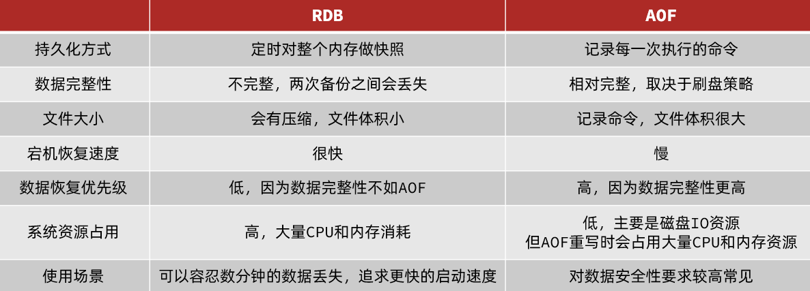
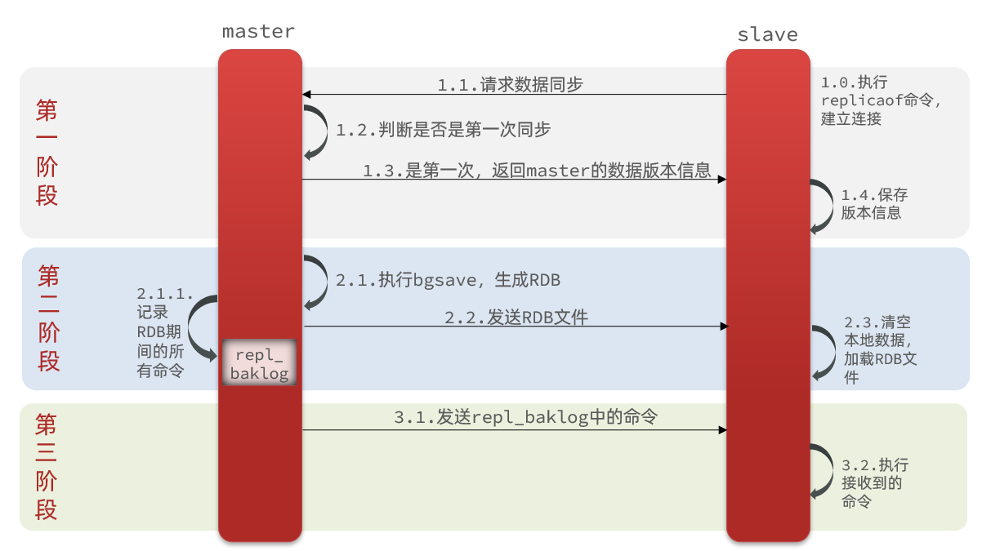
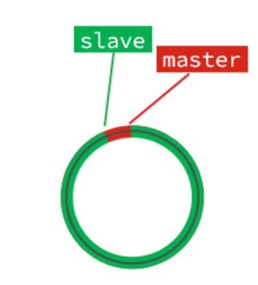
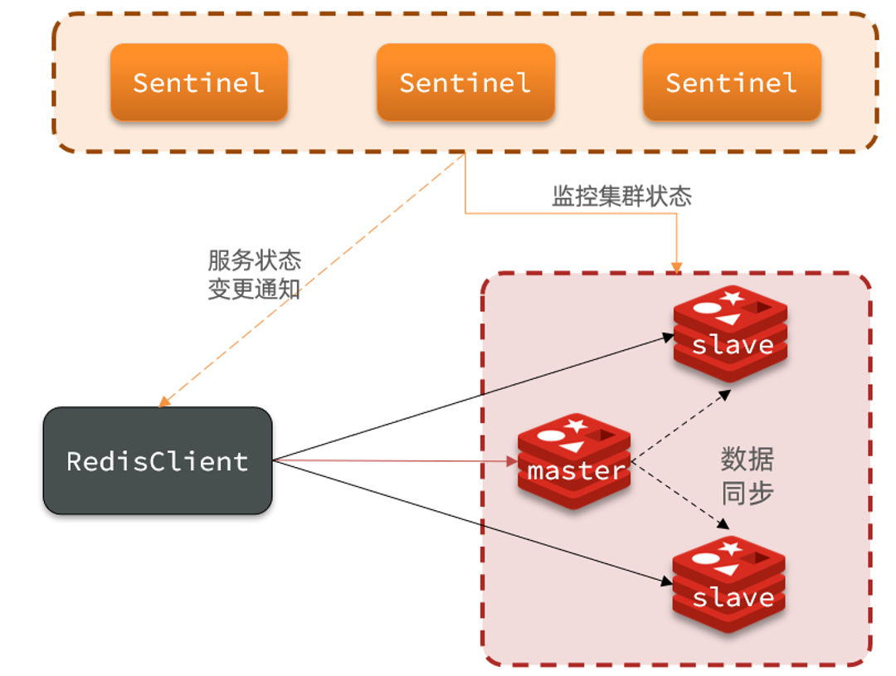
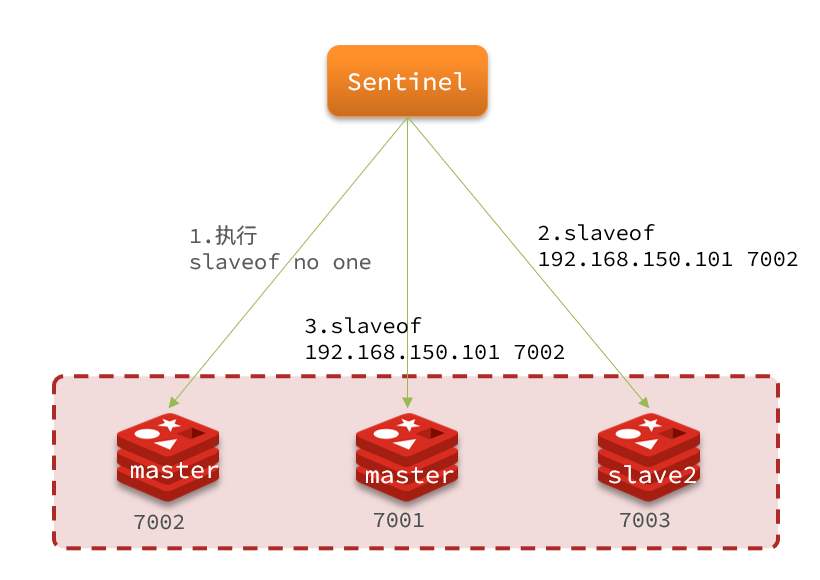
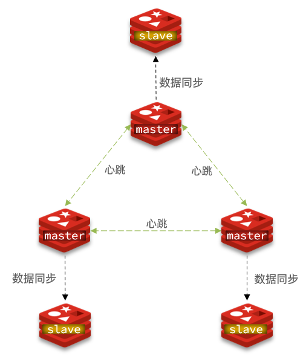
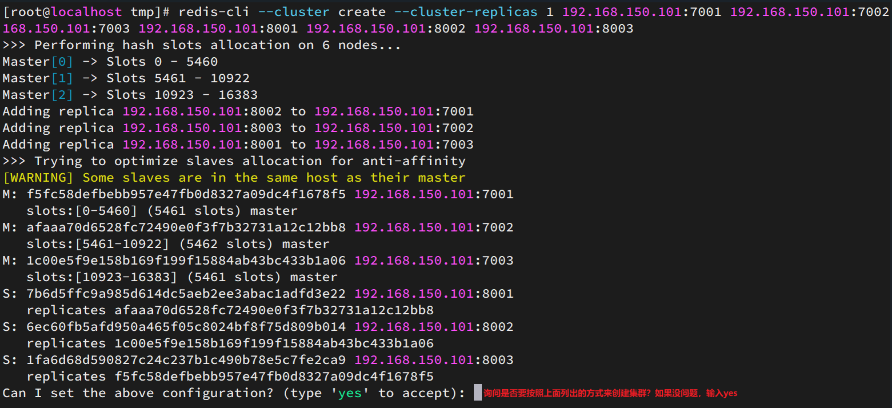
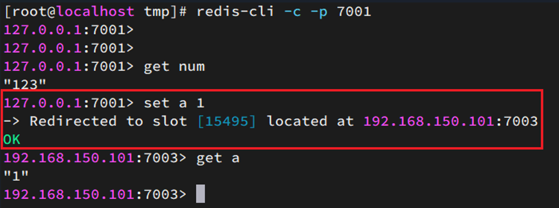

[toc]

# Redis高级篇 当前版本6.2.6

# Redis持久化

Redis有两种持久化方案：
- RDB持久化
- AOF持久化

## 1.RDB持久化:

RDB全称Redis Database Backup file（Redis数据备份文件），也被叫做Redis数据快照。简单来说就是把内存中的所有数据都记录到磁盘中。当Redis实例故障重启后，从磁盘读取快照文件，恢复数据。快照文件称为RDB文件，默认是保存在当前redis运行目录。

### 执行RDB持久化

RDB持久化在四种情况下会执行：
- 执行save命令
- 执行bgsave命令
- Redis停机时
- 触发RDB条件时

**1）save命令**

执行下面的命令，可以立即执行一次RDB：


save命令会导致主进程执行RDB，这个过程中其它所有命令都会被阻塞。只有在数据迁移时可能用到。

**2）bgsave命令**

下面的命令可以异步执行RDB：


这个命令执行后会开启独立进程完成RDB，主进程可以持续处理用户请求，不受影响。

**3）停机时**

Redis停机时会执行一次save命令，实现RDB持久化。

**4）触发RDB条件**

Redis内部有触发RDB的机制，可以在redis.conf文件中找到，格式如下：

```properties
# 900秒内，如果至少有1个key被修改，则执行bgsave
# 如果是 save "" 则表示禁用RDB
save 900 1  
save 300 10  
save 60 10000 
```

### RDB原理

bgsave命令开始的时候会fork主进程得到子进程，子进程共享主进程的内存数据。完成fork后读取内存数据并写入 RDB 文件。

fork采用的是copy-on-write技术：

- 当主进程执行读操作时，访问共享内存；
- 当主进程执行写操作时，则会拷贝一份数据，执行写操作。


### RDB小结

RDB方式bgsave的基本流程？
- fork主进程得到一个子进程，共享内存空间
- 子进程读取内存数据并写入新的RDB文件
- 用新RDB文件替换旧的RDB文件

RDB会在什么时候执行？
- 默认是服务停止时

save 60 1000代表什么含义？
- 代表60秒内至少执行1000次修改则触发RDB

RDB的缺点？
- RDB执行间隔时间长，两次RDB之间写入数据有丢失的风险
- fork子进程、压缩、写出RDB文件都比较耗时

## 2.AOF持久化

### AOF原理

AOF全称为Append Only File（追加文件）。Redis处理的每一个写命令都会记录在AOF文件，可以看做是命令日志文件。


### AOF配置

AOF默认是关闭的，需要修改redis.conf配置文件来开启AOF：
```properties
# 是否开启AOF功能，默认是no
appendonly yes
# AOF文件的名称
appendfilename "appendonly.aof"
```

AOF的命令记录的频率也可以通过redis.conf文件来配：
```properties
# 表示每执行一次写命令，立即记录到AOF文件
appendfsync always 
# 写命令执行完先放入AOF缓冲区，然后表示每隔1秒将缓冲区数据写到AOF文件，是默认方案
appendfsync everysec 
# 写命令执行完先放入AOF缓冲区，由操作系统决定何时将缓冲区内容写回磁盘
appendfsync no
```

appendfsync的三种方式对比：


### AOF文件重写

因为是记录命令，AOF文件会比RDB文件大的多。而且AOF会记录对同一个key的多次写操作，但因为只有最后一次写操作才有意义。通过执行bgrewriteaof命令，可以让AOF文件执行重写功能，用最少的命令达到相同效果。


如图，AOF原本有三个命令，`set num 123 和 set num 666`都是对num的操作，第二次会覆盖第一次的值，因此第一个命令记录下来没有意义。所以重写命令后，AOF文件内容就是：`mset name jack num 666`

Redis也会在触发阈值时自动去重写AOF文件。阈值也可以在redis.conf中配置：
```properties
# AOF文件比上次文件 增长超过多少百分比则触发重写
auto-aof-rewrite-percentage 100
# AOF文件体积最小多大以上才触发重写 
auto-aof-rewrite-min-size 64mb 
```

## 3.RDB与AOF对比

RDB和AOF各有自己的优缺点，如果对数据安全性要求较高，在实际开发中往往会**结合**两者来使用。




# Redis主从

## 1.搭建Redis主从集群

### 1.主从集群结构

单节点Redis的并发能力是有上限的，要进一步提高Redis的并发能力，就需要搭建主从集群，实现读写分离。


上图中共包含三个节点，一个主节点，两个从节点。这里开启3个redis实例，模拟主从集群，信息如下：
|       IP        | PORT |  角色  |
| :-------------: | :--: | :----: |
| 192.168.150.101 | 7001 | master |
| 192.168.150.101 | 7002 | slave  |
| 192.168.150.101 | 7003 | slave  |

### 2.准备实例和配置

在同一台虚拟机开启3个实例，必须准备三份不同的配置文件和目录。

1）创建三个目录,名字分别叫7001、7002、7003：

```sh
# 进入/tmp目录
cd /tmp
# 创建目录
mkdir 7001 7002 7003
```

如图：


2）恢复原始配置
修改redis-6.2.4/redis.conf文件，将其中的持久化模式改为默认的RDB模式，AOF保持关闭状态。

```properties
# 开启RDB
# save ""
save 3600 1
save 300 100
save 60 10000

# 关闭AOF
appendonly no
```

3）拷贝配置文件到每个实例目录

然后将redis-6.2.4/redis.conf文件拷贝到三个目录中（在/tmp目录执行下列命令）：

```sh
# 方式一：逐个拷贝
cp redis-6.2.4/redis.conf 7001
cp redis-6.2.4/redis.conf 7002
cp redis-6.2.4/redis.conf 7003

# 方式二：管道组合命令，一键拷贝
echo 7001 7002 7003 | xargs -t -n 1 cp redis-6.2.4/redis.conf
```

4）修改每个实例的端口、工作目录

修改每个文件夹内的配置文件，将端口分别修改为7001、7002、7003，将rdb文件保存位置都修改为自己所在目录（在/tmp目录执行下列命令）：

```sh
sed -i -e 's/6379/7001/g' -e 's/dir .\//dir \/tmp\/7001\//g' 7001/redis.conf
sed -i -e 's/6379/7002/g' -e 's/dir .\//dir \/tmp\/7002\//g' 7002/redis.conf
sed -i -e 's/6379/7003/g' -e 's/dir .\//dir \/tmp\/7003\//g' 7003/redis.conf
```

5）修改每个实例的声明IP

虚拟机本身有多个IP，为了避免将来混乱，我们需要在redis.conf文件中指定每一个实例的绑定ip信息，格式如下：

```properties
# redis实例的声明 IP
replica-announce-ip 192.168.150.101
```

每个目录都要改，我们一键完成修改（在/tmp目录执行下列命令）：
```sh
# 逐一执行
sed -i '1a replica-announce-ip 192.168.150.101' 7001/redis.conf
sed -i '1a replica-announce-ip 192.168.150.101' 7002/redis.conf
sed -i '1a replica-announce-ip 192.168.150.101' 7003/redis.conf

# 或者一键修改
printf '%s\n' 7001 7002 7003 | xargs -I{} -t sed -i '1a replica-announce-ip 192.168.150.101' {}/redis.conf
```

### 3.启动

为了方便查看日志，我们打开3个ssh窗口，分别启动3个redis实例，启动命令：
```sh
# 第1个
redis-server 7001/redis.conf
# 第2个
redis-server 7002/redis.conf
# 第3个
redis-server 7003/redis.conf
```

启动后：


如果要一键停止，可以运行下面命令：
```sh
printf '%s\n' 7001 7002 7003 | xargs -I{} -t redis-cli -p {} shutdown
```

### 4.开启主从关系

现在三个实例之间还没有任何关系，要配置主从。可以使用replicaof 或者slaveof（5.0以前）命令。

有临时和永久两种模式：
- 修改配置文件（永久生效）
    - 在redis.conf中添加一行配置：`slaveof <masterip> <masterport>`
- 使用redis-cli客户端连接到redis服务，执行slaveof命令（重启后失效）：

```sh
slaveof <masterip> <masterport>
```

<font color='red'>注意</font>：在5.0以后新增命令replicaof，与salveof效果一致。

这里我们为了演示方便，使用方式二。

通过redis-cli命令连接7002，执行下面命令：
```sh
# 连接 7002
redis-cli -p 7002
# 执行slaveof
slaveof 192.168.150.101 7001
```

通过redis-cli命令连接7003，执行下面命令：
```sh
# 连接 7003
redis-cli -p 7003
# 执行slaveof
slaveof 192.168.150.101 7001
```

然后连接 7001节点，查看集群状态：
```sh
# 连接 7001
redis-cli -p 7001
# 查看状态
info replication
```

结果：


### 5.测试

执行下列操作以测试：
- 利用redis-cli连接7001，执行```set num 123```
- 利用redis-cli连接7002，执行```get num```，再执行```set num 666```
- 利用redis-cli连接7003，执行```get num```，再执行```set num 888```

可以发现，只有在7001这个master节点上可以执行写操作，7002和7003这两个slave节点只能执行读操作。


## 2 主从数据同步原理

### 1.全量同步

主从第一次建立连接时，会执行**全量同步**，将master节点的所有数据都拷贝给slave节点，流程：



这里有一个问题，master如何得知salve是第一次来连接呢?

有几个概念，可以作为判断依据：
- **Replication Id**：简称replid，是数据集的标记，id一致则说明是同一数据集。每一个master都有唯一的replid，slave则会继承master节点的replid
- **offset**：偏移量，随着记录在repl_baklog中的数据增多而逐渐增大。slave完成同步时也会记录当前同步的offset。如果slave的offset小于master的offset，说明slave数据落后于master，需要更新。

1. 因此slave做数据同步，必须向master声明自己的replication id 和offset，master才可以判断到底需要同步哪些数据。
2. 因为slave原本也是一个master，有自己的replid和offset，当第一次变成slave，与master建立连接时，发送的replid和offset是自己的replid和offset。
3. master判断发现slave发送来的replid与自己的不一致，说明这是一个全新的slave，就知道要做全量同步了。
4. master会将自己的replid和offset都发送给这个slave，slave保存这些信息。以后slave的replid就与master一致了。

因此，**master判断一个节点是否是第一次同步的依据，就是看replid是否一致**。

如图：


完整流程描述：
- slave节点请求增量同步
- master节点判断replid，发现不一致，拒绝增量同步
- master将完整内存数据生成RDB，发送RDB到slave
- slave清空本地数据，加载master的RDB
- master将RDB期间的命令记录在repl_baklog，并持续将log中的命令发送给slave
- slave执行接收到的命令，保持与master之间的同步

### 2 增量同步

全量同步需要先做RDB，然后将RDB文件通过网络传输个slave，成本太高了。因此除了第一次做全量同步，其它大多数时候slave与master都是做**增量同步**。

什么是增量同步？就是只更新slave与master存在差异的部分数据。如图：


那么master怎么知道slave与自己的数据差异在哪里呢?

### 3 repl_backlog原理

master怎么知道slave与自己的数据差异在哪里呢?

这就要说到全量同步时的repl_baklog文件了。

这个文件是一个固定大小的数组，只不过数组是环形，也就是说**角标到达数组末尾后，会再次从0开始读写**，这样数组头部的数据就会被覆盖。

repl_baklog中会记录Redis处理过的命令日志及offset，包括master当前的offset，和slave已经拷贝到的offset：

 

slave与master的offset之间的差异，就是salve需要增量拷贝的数据了。

随着不断有数据写入，master的offset逐渐变大，slave也不断的拷贝，追赶master的offset：

 

直到数组被填满：

 

此时，如果有新的数据写入，就会覆盖数组中的旧数据。不过，旧的数据只要是绿色的，说明是已经被同步到slave的数据，即便被覆盖了也没什么影响。因为未同步的仅仅是红色部分。

但是，如果slave出现网络阻塞，导致master的offset远远超过了slave的offset： 

 

如果master继续写入新数据，其offset就会覆盖旧的数据，直到将slave现在的offset也覆盖：

 

棕色框中的红色部分，就是尚未同步，但是却已经被覆盖的数据。此时如果slave恢复，需要同步，却发现自己的offset都没有了，无法完成增量同步了。只能做全量同步。


## 3 主从同步优化

主从同步可以保证主从数据的一致性，非常重要。

可以从以下几个方面来优化Redis主从集群：
- 在master中配置repl-diskless-sync yes启用无磁盘复制，避免全量同步时的磁盘IO。
- Redis单节点上的内存占用不要太大，减少RDB导致的过多磁盘IO
- 适当提高repl_baklog的大小，发现slave宕机时尽快实现故障恢复，尽可能避免全量同步
- 限制一个master上的slave节点数量，如果实在是太多slave，则可以采用主-从-从链式结构，减少master压力

主从从架构图：


## 4.小结
简述全量同步和增量同步区别？
- 全量同步：master将完整内存数据生成RDB，发送RDB到slave。后续命令则记录在repl_baklog，逐个发送给slave。
- 增量同步：slave提交自己的offset到master，master获取repl_baklog中从offset之后的命令给slave

什么时候执行全量同步？
- slave节点第一次连接master节点时
- slave节点断开时间太久，repl_baklog中的offset已经被覆盖时

什么时候执行增量同步？
- slave节点断开又恢复，并且在repl_baklog中能找到offset时


# Redis哨兵

Redis提供了哨兵（Sentinel）机制来实现主从集群的自动故障恢复。

## 1.哨兵原理

### 1.集群结构和作用

哨兵的结构如图：


哨兵的作用如下：
- **监控**：Sentinel会不断检查您的master和slave是否按预期工作
- **自动故障恢复**：如果master故障，Sentinel会将一个slave提升为master。当故障实例恢复后也以新的master为主
- **通知**：Sentinel充当Redis客户端的服务发现来源，当集群发生故障转移时，会将最新信息推送给Redis的客户端

### 2.集群监控原理
Sentinel基于心跳机制监测服务状态，每隔1秒向集群的每个实例发送ping命令：

* 主观下线：如果某sentinel节点发现某实例未在规定时间响应，则认为该实例主观下线。
* 客观下线：若超过指定数量（quorum）的sentinel都认为该实例主观下线，则该实例客观下线。quorum值最好超过Sentinel实例数量的一半。


### 3.集群故障恢复原理

一旦发现master故障，sentinel需要在salve中选择一个作为新的master，选择依据是这样的：

- 首先会判断slave节点与master节点断开时间长短，如果超过指定值（down-after-milliseconds * 10）则会排除该slave节点
- 然后判断slave节点的slave-priority值，越小优先级越高，如果是0则永不参与选举
- 如果slave-prority一样，则判断slave节点的offset值，越大说明数据越新，优先级越高
- 最后是判断slave节点的运行id大小，越小优先级越高。

当选出一个新的master后，该如何实现切换呢？

流程如下：
- sentinel给备选的slave1节点发送slaveof no one命令，让该节点成为master
- sentinel给所有其它slave发送slaveof 192.168.150.101 7002 命令，让这些slave成为新master的从节点，开始从新的master上同步数据。
- 最后，sentinel将故障节点标记为slave，当故障节点恢复后会自动成为新的master的slave节点



### 4.小结

Sentinel的三个作用是什么？
- 监控
- 故障转移
- 通知

Sentinel如何判断一个redis实例是否健康？
- 每隔1秒发送一次ping命令，如果超过一定时间没有相向则认为是主观下线
- 如果大多数sentinel都认为实例主观下线，则判定服务下线

故障转移步骤有哪些？
- 首先选定一个slave作为新的master，执行slaveof no one
- 然后让所有节点都执行slaveof 新master
- 修改故障节点配置，添加slaveof 新master


## 2.搭建Redis哨兵集群

### 1.集群结构

这里我们搭建一个三节点形成的Sentinel集群，来监管之前的Redis主从集群。如图：


三个sentinel实例信息如下：
| 节点 |       IP        | PORT  |
| ---- | :-------------: | :---: |
| s1   | 192.168.150.101 | 27001 |
| s2   | 192.168.150.101 | 27002 |
| s3   | 192.168.150.101 | 27003 |

### 2.准备实例和配置

要在同一台虚拟机开启3个实例，必须准备三份不同的配置文件和目录，配置文件所在目录也就是工作目录。

创建三个文件夹，名字分别叫s1、s2、s3：
```sh
# 进入/tmp目录
cd /tmp
# 创建目录
mkdir s1 s2 s3
```

如图：


然后我们在s1目录创建一个sentinel.conf文件，添加下面的内容：
```ini
port 27001
sentinel announce-ip 192.168.150.101
sentinel monitor mymaster 192.168.150.101 7001 2
sentinel down-after-milliseconds mymaster 5000
sentinel failover-timeout mymaster 60000
dir "/tmp/s1"
```

解读：
- `port 27001`：是当前sentinel实例的端口
- `sentinel monitor mymaster 192.168.150.101 7001 2`：指定主节点信息
  - `mymaster`：主节点名称，自定义，任意写
  - `192.168.150.101 7001`：主节点的ip和端口
  - `2`：选举master时的quorum值

然后将s1/sentinel.conf文件拷贝到s2、s3两个目录中（在/tmp目录执行下列命令）：
```sh
# 方式一：逐个拷贝
cp s1/sentinel.conf s2
cp s1/sentinel.conf s3
# 方式二：管道组合命令，一键拷贝
echo s2 s3 | xargs -t -n 1 cp s1/sentinel.conf
```

修改s2、s3两个文件夹内的配置文件，将端口分别修改为27002、27003：
```sh
sed -i -e 's/27001/27002/g' -e 's/s1/s2/g' s2/sentinel.conf
sed -i -e 's/27001/27003/g' -e 's/s1/s3/g' s3/sentinel.conf
```

### 3.启动

为了方便查看日志，我们打开3个ssh窗口，分别启动3个redis实例，启动命令：
```sh
# 第1个
redis-sentinel s1/sentinel.conf
# 第2个
redis-sentinel s2/sentinel.conf
# 第3个
redis-sentinel s3/sentinel.conf
```

启动后：


### 4.测试

尝试让master节点7001宕机，查看sentinel日志：

查看7003的日志：

查看7002的日志：


## 3 RedisTemplate集成哨兵机制

在Sentinel集群监管下的Redis主从集群，其节点会因为自动故障转移而发生变化，Redis的客户端必须感知这种变化，及时更新连接信息。Spring的RedisTemplate底层利用lettuce实现了节点的感知和自动切换。

下面，我们通过一个测试来实现RedisTemplate集成哨兵机制。

① 引入依赖

在项目的pom文件中引入spring data redis依赖：

```xml
<dependency>
    <groupId>org.springframework.boot</groupId>
    <artifactId>spring-boot-starter-data-redis</artifactId>
</dependency>
```

② 配置Redis地址

然后在配置文件application.yml中指定redis的sentinel相关信息：
```java
spring:
  redis:
    sentinel:
      master: mymaster
      nodes:
        - 192.168.150.101:27001
        - 192.168.150.101:27002
        - 192.168.150.101:27003
```

③ 配置读写分离

在项目的启动类中，添加一个新的bean：

```java
@Bean
public LettuceClientConfigurationBuilderCustomizer clientConfigurationBuilderCustomizer(){
    return clientConfigurationBuilder -> clientConfigurationBuilder.readFrom(ReadFrom.REPLICA_PREFERRED);
}
```

这个bean中配置的就是读写策略，包括四种：
- MASTER：从主节点读取
- MASTER_PREFERRED：优先从master节点读取，master不可用才读取replica
- REPLICA：从slave（replica）节点读取
- REPLICA _PREFERRED：优先从slave（replica）节点读取，所有的slave都不可用才读取master


# Redis分片集群

主从和哨兵可以解决高可用、高并发读的问题。但是依然有两个问题没有解决：
- 海量数据存储问题
- 高并发写的问题

使用分片集群可以解决上述问题，如图:


分片集群特征：
- 集群中有多个master，每个master保存不同数据
- 每个master都可以有多个slave节点
- master之间通过ping监测彼此健康状态
- 客户端请求可以访问集群任意节点，最终都会被转发到正确节点


## 1.搭建分片集群

### 1.集群结构

分片集群需要的节点数量较多，这里我们搭建一个最小的分片集群，包含3个master节点，每个master包含一个slave节点，结构如下：



这里我们会在同一台虚拟机中开启6个redis实例，模拟分片集群，信息如下：
|       IP        | PORT |  角色  |
| :-------------: | :--: | :----: |
| 192.168.150.101 | 7001 | master |
| 192.168.150.101 | 7002 | master |
| 192.168.150.101 | 7003 | master |
| 192.168.150.101 | 8001 | slave  |
| 192.168.150.101 | 8002 | slave  |
| 192.168.150.101 | 8003 | slave  |


### 2.准备实例和配置

删除之前的7001、7002、7003这几个目录，重新创建出7001、7002、7003、8001、8002、8003目录：

```sh
# 进入/tmp目录
cd /tmp
# 删除旧的，避免配置干扰
rm -rf 7001 7002 7003
# 创建目录
mkdir 7001 7002 7003 8001 8002 8003
```

在/tmp下准备一个新的redis.conf文件，内容如下：

```ini
port 6379
# 开启集群功能
cluster-enabled yes
# 集群的配置文件名称，不需要我们创建，由redis自己维护
cluster-config-file /tmp/6379/nodes.conf
# 节点心跳失败的超时时间
cluster-node-timeout 5000
# 持久化文件存放目录
dir /tmp/6379
# 绑定地址
bind 0.0.0.0
# 让redis后台运行
daemonize yes
# 注册的实例ip
replica-announce-ip 192.168.150.101
# 保护模式
protected-mode no
# 数据库数量
databases 1
# 日志
logfile /tmp/6379/run.log
```

将这个文件拷贝到每个目录下：
```sh
# 进入/tmp目录
cd /tmp
# 执行拷贝
echo 7001 7002 7003 8001 8002 8003 | xargs -t -n 1 cp redis.conf
```

修改每个目录下的redis.conf，将其中的6379修改为与所在目录一致：
```sh
# 进入/tmp目录
cd /tmp
# 修改配置文件
printf '%s\n' 7001 7002 7003 8001 8002 8003 | xargs -I{} -t sed -i 's/6379/{}/g' {}/redis.conf
```

### 3.启动

因为已经配置了后台启动模式，所以可以直接启动服务：
```sh
# 进入/tmp目录
cd /tmp
# 一键启动所有服务
printf '%s\n' 7001 7002 7003 8001 8002 8003 | xargs -I{} -t redis-server {}/redis.conf
```

通过ps查看状态：
```sh
ps -ef | grep redis
```

发现服务都已经正常启动：


如果要关闭所有进程，可以执行命令：

```sh
ps -ef | grep redis | awk '{print $2}' | xargs kill
```

或者（推荐这种方式）：

```sh
printf '%s\n' 7001 7002 7003 8001 8002 8003 | xargs -I{} -t redis-cli -p {} shutdown
```

### 4.创建集群

虽然服务启动了，但是目前每个服务之间都是独立的，没有任何关联。

我们需要执行命令来创建集群，在Redis5.0之前创建集群比较麻烦，5.0之后集群管理命令都集成到了redis-cli中。

1）Redis5.0之前

Redis5.0之前集群命令都是用redis安装包下的src/redis-trib.rb来实现的。因为redis-trib.rb是有ruby语言编写的所以需要安装ruby环境。
```sh
# 安装依赖
yum -y install zlib ruby rubygems
gem install redis
```

然后通过命令来管理集群：
```sh
# 进入redis的src目录
cd /tmp/redis-6.2.4/src
# 创建集群
./redis-trib.rb create --replicas 1 192.168.150.101:7001 192.168.150.101:7002 192.168.150.101:7003 192.168.150.101:8001 192.168.150.101:8002 192.168.150.101:8003
```

2）Redis5.0以后

我们使用的是Redis6.2.4版本，集群管理以及集成到了redis-cli中，格式如下：
```sh
redis-cli --cluster create --cluster-replicas 1 192.168.150.101:7001 192.168.150.101:7002 192.168.150.101:7003 192.168.150.101:8001 192.168.150.101:8002 192.168.150.101:8003
```

命令说明：
- `redis-cli --cluster`或者`./redis-trib.rb`：代表集群操作命令
- `create`：代表是创建集群
- `--replicas 1`或者`--cluster-replicas 1` ：指定集群中每个master的副本个数为1，此时`节点总数 ÷ (replicas + 1)` 得到的就是master的数量。因此节点列表中的前n个就是master，其它节点都是slave节点，随机分配到不同master

运行后的样子：


这里输入yes，则集群开始创建：


通过命令可以查看集群状态：
```sh
redis-cli -p 7001 cluster nodes
```


### 5.测试

尝试连接7001节点，存储一个数据：
```sh
# 连接
redis-cli -p 7001
# 存储数据
set num 123
# 读取数据
get num
# 再次存储
set a 1
```

结果悲剧了：


集群操作时，需要给`redis-cli`加上`-c`参数才可以：
```sh
redis-cli -c -p 7001
```

这次可以了：



## 2.散列插槽

### 1.插槽原理

Redis会把每一个master节点映射到0~16383共16384个插槽（hash slot）上，查看集群信息时就能看到：


数据key不是与节点绑定，而是与插槽绑定。redis会根据key的有效部分计算插槽值，分两种情况：
- key中包含"{}"，且“{}”中至少包含1个字符，“{}”中的部分是有效部分
- key中不包含“{}”，整个key都是有效部分

例如：key是num，那么就根据num计算，如果是{itcast}num，则根据itcast计算。计算方式是利用CRC16算法得到一个hash值，然后对16384取余，得到的结果就是slot值。

 

如图，在7001这个节点执行set a 1时，对a做hash运算，对16384取余，得到的结果是15495，因此要存储到103节点。到了7003后，执行`get num`时，对num做hash运算，对16384取余，得到的结果是2765，因此需要切换到7001节点

### 2.小结

Redis如何判断某个key应该在哪个实例？
- 将16384个插槽分配到不同的实例
- 根据key的有效部分计算哈希值，对16384取余
- 余数作为插槽，寻找插槽所在实例即可

如何将同一类数据固定的保存在同一个Redis实例？
- 这一类数据使用相同的有效部分，例如key都以{typeId}为前缀。


## 3.集群伸缩

redis-cli --cluster提供了很多操作集群的命令，可以通过下面方式查看：


比如，添加节点的命令：


### 1.需求分析

需求：向集群中添加一个新的master节点，并向其中存储 num = 10
- 启动一个新的redis实例，端口为7004
- 添加7004到之前的集群，并作为一个master节点
- 给7004节点分配插槽，使得num这个key可以存储到7004实例

这里需要两个新的功能：
- 添加一个节点到集群中
- 将部分插槽分配到新插槽

### 2.创建新的redis实例

创建一个文件夹：
```sh
mkdir 7004
```

拷贝配置文件：
```sh
cp redis.conf /7004
```

修改配置文件：
```sh
sed /s/6379/7004/g 7004/redis.conf
```

启动
```sh
redis-server 7004/redis.conf
```

### 3.添加新节点到redis
添加节点的语法如下：


执行命令：
```sh
redis-cli --cluster add-node  192.168.150.101:7004 192.168.150.101:7001
```

通过命令查看集群状态：
```sh
redis-cli -p 7001 cluster nodes
```

如图，7004加入了集群，并且默认是一个master节点：


但是，可以看到7004节点的插槽数量为0，因此没有任何数据可以存储到7004上

### 4.转移插槽

我们要将num存储到7004节点，因此需要先看看num的插槽是多少：


如上图所示，num的插槽为2765.

我们可以将0~3000的插槽从7001转移到7004，命令格式如下：


具体命令如下：
建立连接：


得到下面的反馈：


询问要移动多少个插槽，我们计划是3000个：

新的问题来了：


那个node来接收这些插槽？？

显然是7004，那么7004节点的id是多少呢？


复制这个id，然后拷贝到刚才的控制台后：


这里询问，你的插槽是从哪里移动过来的？
- all：代表全部，也就是三个节点各转移一部分
- 具体的id：目标节点的id
- done：没有了

这里我们要从7001获取，因此填写7001的id：


填完后，点击done，这样插槽转移就准备好了：


确认要转移吗？输入yes：

然后，通过命令查看结果：
 

可以看到： 


目的达成。

## 4 故障转移

集群初识状态是这样的：


其中7001、7002、7003都是master，我们计划让7002宕机。

### 1.自动故障转移

当集群中有一个master宕机会发生什么呢？

直接停止一个redis实例，例如7002：

```sh
redis-cli -p 7002 shutdown
```

1）首先是该实例与其它实例失去连接

2）然后是疑似宕机：


3）最后是确定下线，自动提升一个slave为新的master：


4）当7002再次启动，就会变为一个slave节点了：


### 2.手动故障转移

利用cluster failover命令可以手动让集群中的某个master宕机，切换到执行cluster failover命令的这个slave节点，实现无感知的数据迁移。其流程如下：


这种failover命令可以指定三种模式：
- 缺省：默认的流程，如图1~6歩
- force：省略了对offset的一致性校验
- takeover：直接执行第5歩，忽略数据一致性、忽略master状态和其它master的意见

**案例需求**：在7002这个slave节点执行手动故障转移，重新夺回master地位

步骤如下：
1）利用redis-cli连接7002这个节点
2）执行cluster failover命令

如图：


效果：


## 5.RedisTemplate访问分片集群

RedisTemplate底层同样基于lettuce实现了分片集群的支持，而使用的步骤与哨兵模式基本一致：

1）引入redis的starter依赖
2）配置分片集群地址
3）配置读写分离

与哨兵模式相比，其中只有分片集群的配置方式略有差异，如下：
```yaml
spring:
  redis:
    cluster:
      nodes:
        - 192.168.150.101:7001
        - 192.168.150.101:7002
        - 192.168.150.101:7003
        - 192.168.150.101:8001
        - 192.168.150.101:8002
        - 192.168.150.101:8003
```


