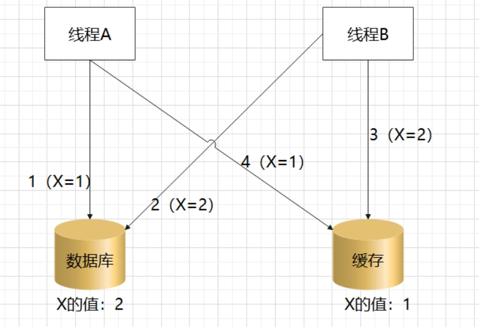
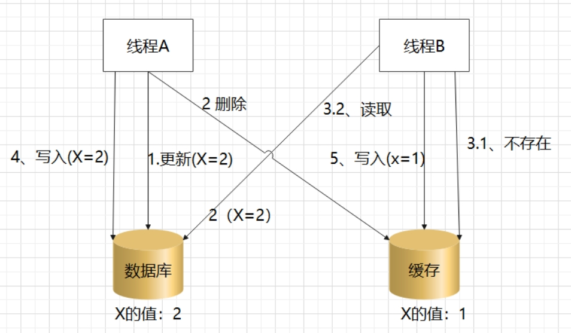
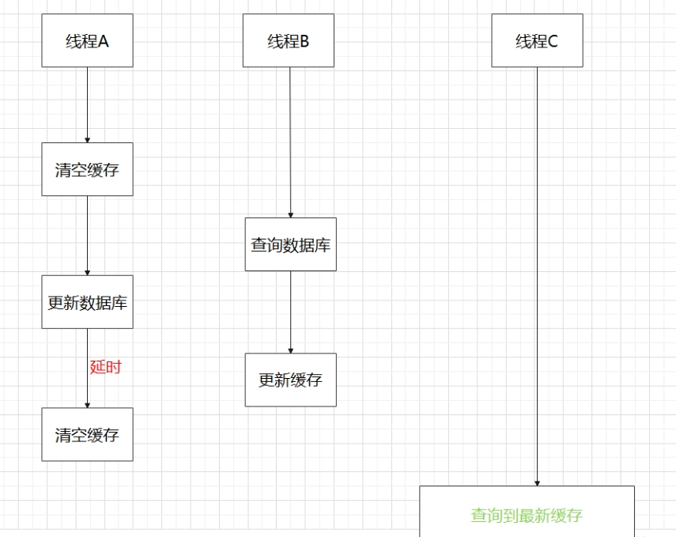
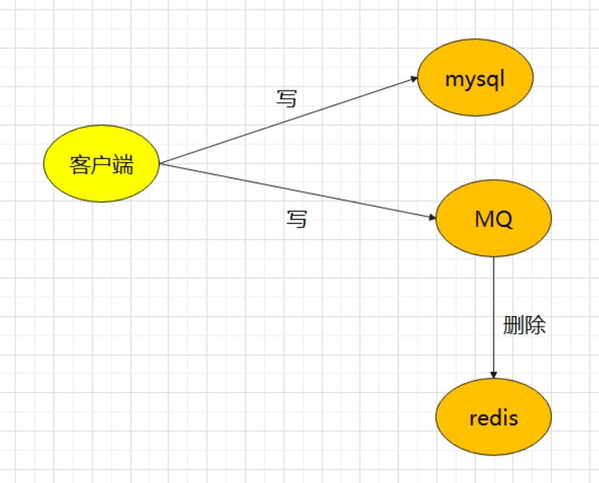
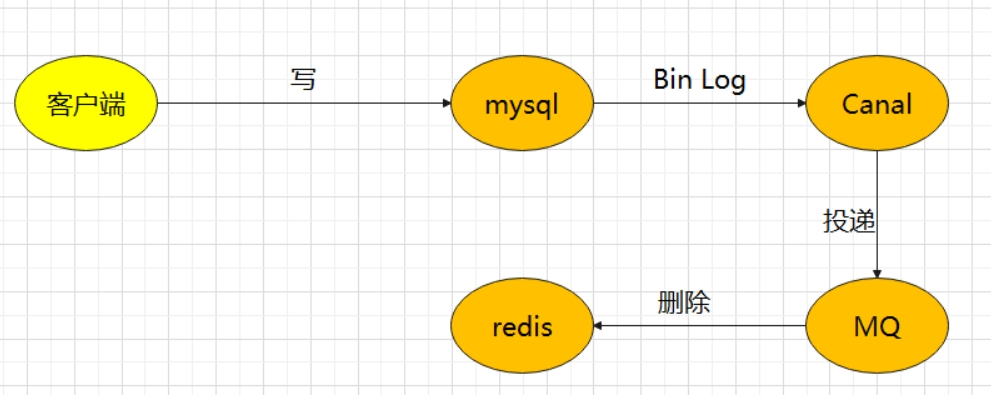

[toc]

# 如何保障Redis和Mysql的数据一致性

[参考链接](https://blog.csdn.net/wuhuayangs/article/details/121971205)

当我们的系统中同时使用Redis和Mysql的时候。由于Redis中的数据是从Mysql中查询出来并存储的。

那么当我们需要更新数据库中的数据的时候。我们不仅要操作数据库，还要一并操作Redis缓存。

那么如何保障Redis和Mysql中的同一个数据是一致的。

## 程序正常的情况下，如何保障缓存和数据库的数据一致性

假设程序正常执行的情况下。

### 方案1：更新数据库和更新缓存

如果缓存和数据库都更新的话，就会存在一个先后顺序的问题。
- 是先更新数据库后更新缓存
- 还是先更新缓存后更新数据库

> 先更新数据库，后更新缓存

若先更新数据库成功了，但是后更新缓存失败。那么此时数据库中是最新的值，而缓存中还是旧的数据值。

这时后续的请求查询的数据就是旧数据，无法查询到数据库中的新数据。只有当缓存过期失效后，才能重新在数据库中缓存新数据。

> 先更新缓存，后更新数据库

若先更新缓存成功了，但是后更新数据库失败了。这时缓存中是最新的值，数据库中是旧数据。

这时后续的请求查询的数据都是新数据。但是缓存过期失效以后就会从数据库中读取到旧值。

> 线程并发的情况下的数据安全问题。

当多线程并发更新同一条数据的时候，会出现数据安全问题。

例如采用先更新数据库，再更新缓存的方案。线程 A 和线程 B 同时更新一条数据，可能会发生如下问题。

1. 线程 A 更新数据库（X = 1）
2. 线程 B 更新数据库（X = 2）
3. 线程 B 更新缓存（X = 2）
4. 线程 A 更新缓存（X = 1）

同样地，采用先更新缓存，再更新数据库的方案，在线程并发的情况下，也会有类似问题，这里不再详述。

### 方案2：更新数据库和删除缓存

方案2也有2种方式。
- 先删除缓存，后更新数据库
- 先更新数据库，后删除缓存

> 先删除缓存，后更新数据库

如果有 2 个线程 A 和 B 要并发读写数据，可能会发生如下问题。

1. 线程 A 要更新 X = 2（原值 X = 1）
2. 线程 A 先删除缓存
3. 线程 B 读缓存，发现不存在，从数据库中读取到旧值（X = 1）
4. 线程 A 将新值写入数据库（X = 2）
5. 线程 B 将旧值写入缓存（X = 1）

最终 X 的值在缓存中是旧值 1，在数据库中是新值 2，X在数据库和缓存中的数据任然是不一致的。

> 先更新数据库，后删除缓存

依旧是 2 个线程 A 和 B 并发读写数据。

1. 缓存中 X 不存在（数据库 X = 1）
2. 线程 A 读取数据库，得到旧值（X = 1）
3. 线程 B 更新数据库（X = 2）
4. 线程 B 删除缓存
5. 线程 A 将旧值写入缓存（X = 1）

最终 X 的值在缓存中是旧值 1，在数据库中是新值 2，也发生不一致。

但是这种情况理论上来讲是可能发生的，但是概率很低，因为必须满足 3 个条件。

- 缓存刚好已失效
- 读请求 + 写请求并发
- 更新数据库 + 删除缓存的时间（步骤 3-4），要比读数据库 + 写缓存时间短（步骤 2 和 5）

一般情况下，写数据库通常是要比读数据库的时间更长的。这样看来，先更新数据库 + 再删除缓存的方案是可以保证数据一致性的。

### 方案3：更新数据库和删除缓存 + 延迟双删

先更新数据库 + 再删除缓存的方案是可以保证数据一致性的。但是在极小概率的情况会发生缓存和数据库的数据不一致的情况。

为了保证不出现数据不一致情况，额外提出了延迟双删的操作。

> 什么是延迟双删？

延迟双删就是删除缓存两次的意思。只不过在两次删除缓存之间，延迟一会。

例如当线程A更新数据库后，然后删除缓存。等待1-2秒后，再次删除缓存。这时为了防止其他线程把旧数据更新到缓存中。所有线程A需要删除2次缓存。

## 程序异常的情况下，如何保障缓存和数据库的数据一致性

上面的方案，都是讨论在程序正常的情况，如何保障数据库和缓存的数据一致性。

最终得出结论：在程序正常执行的情况，应该使用先更新数据库 + 再删除缓存的方案是可以保证数据一致性的。

但是如果程序发生异常，那么如何保障缓存和数据库的数据一致性。

### 方案1：异步重试

执行步骤：先更新数据库 + 后删除缓存。

若更新数据库后，程序发生异常，但是无法删除缓存。我们可以通过重试的方式来进行补救。例如我们可以通过RocketMq消息队列的方式。把删除缓存的方式用消息队列来完成。

总的来说就是： 先更新数据库（直接请求） + 后删除缓存（消息队列）

执行流程如下

### 方案2：订阅数据库变更日志来操作缓存

这个方案只需要修改数据库，不用操作缓存，而操作缓存是交给数据库的变更日志实现。

例如 在MySQL中修改一条数据，MySQL就会产生一条变更日志（binlog），我们可以订阅这个日志，获取到具体的操作数据，然后再根据这条日志数据，去删除对应的缓存。

执行流程如下

订阅变更日志比较比较成熟的开源中间件，比如阿里的 canal，这种方案的优点如下：
- 无需考虑写消息队列失败情况：只要写 MySQL 成功，Binlog 肯定会有
- 自动投递到消费队列：canal 自动把数据库变更日志投递给消费的消息队列

## 结论

为了保证缓存和数据库的数据一致性。

若程序执行正常的情况下。先更新数据库 + 删除缓存 + 延迟双删的方案中。可以很好的保证缓存和数据库的数据一致性。

若程序执行可能发生异常的情况下。在更新数据库 + 删除缓存 + 延迟双删的方案的基础上加上消息队列或订阅数据库变更日志的方案。

最终的方案就是： 先更新数据库 + 后删除缓存（通过消息队列或者订阅数据库变更日志的方式） + 延迟双删

