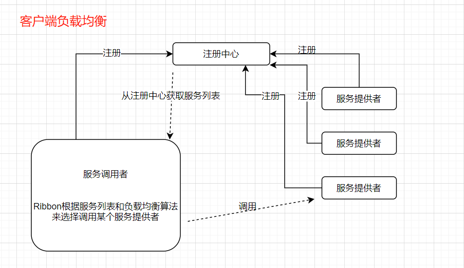
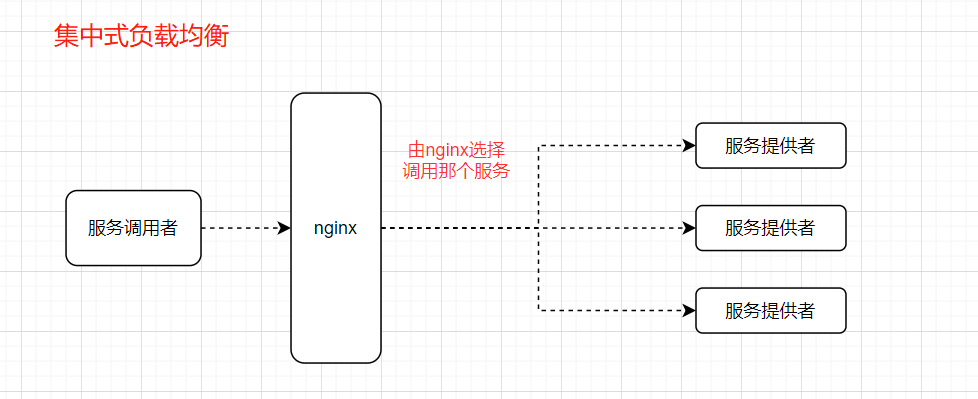
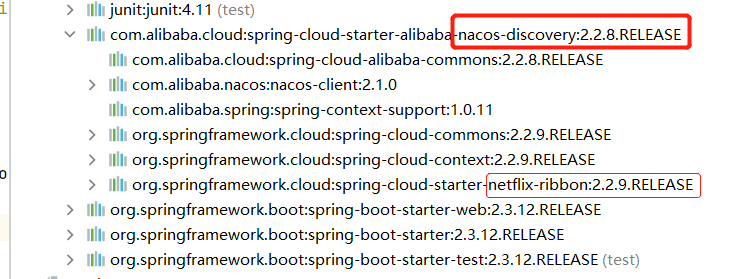

[toc]

# 微服务负载均衡器Ribbon

当前使用Ribbon版本为2.3.0。

下图为微服务架构图


目前主流有两种负载均衡方案：
* 集中式负载均衡：在客户端和服务端中间使用独立的代理方式进行负载，有硬件的（比如 F5），也有软件的（比如Nginx）。
* 客户端负载均衡：即在客户端就进行负载均衡算法来选择服务端。Ribbon就属于客户端负载均衡。

SpringCloud Ribbon是基于Netflix Ribbon 实现的一套客户端的负载均衡工具。Ribbon先获取到提供的所有服务实例，之后Ribbon会自动基于某种规则(轮询，随机)去调用这些服务。

> 什么是客户端负载均衡？
客户端会有一个服务器地址列表，在发送请求前通过负载均衡算法选择一个服务器，然后进行访问。即在客户端就进行负载均衡算法分配。



> 什么是集中式负载均衡？
例如通过Nginx进行负载均衡，先发送请求，然后通过负载均衡算法，在多个服务器之间选择一个进行访问；即在服务器端再进行负载均衡算法分配。




## 1.常见的负载均衡算法

* 随机：通过随机选择服务进行执行，一般这种方式使用较少;
* 轮询：负载均衡默认实现方式，请求进来之后排队处理;
* 加权轮询：通过对服务器性能的分型，给高配置，低负载的服务器分配更高的权重，均衡各个服务器的压力;
* 最小链接数：根据服务器的情况，比如请求积压数等参数，将请求分配到当前压力最小的服务器上。

## 2.Spring Cloud Alibaba 引入ribbon

<font color="red">ribbon的负载均衡方案主要是客户端负载均衡，即当客户端调用多个同名服务端集群时，可以通过ribbon来负载均衡。</font>

① 引入ribbon:Nacos2.2.8版本内置了ribbon。当引入nacos依赖时，可不引入ribbon依赖。



②：修改服务调用者的配置文件，注意这个配置idea没有提示。

```
# 针对某个这个服务提供者，ribbon使用的负载策略
# user-service是注册中心中某个服务提供者的服务名
# com.alibaba.cloud.nacos.ribbon.NacosRule 这个是基于权重&随机的负载策略算法
user-service.ribbon.NFLoadBalancerRuleClassName=com.alibaba.cloud.nacos.ribbon.NacosRule
```

③：运行服务，之后多次调用服务提供者user-service的某个接口，观察端口的变化。可以看出负载均衡生效。


```java
//order和order2两个服务都在注册中心的注册名为user-service
//这两个服务的都有下面的接口。区别是各自占用的端口不同。
@RestController
@RequestMapping("/order")
public class orderController {
    @Value("${server.port}")
    private String port;
    @RequestMapping("/get")
    public String getOrder(){
        return "order "+port;
    }
}
```

## 3.LoadBalancer和Ribbon的区别？

Spring Cloud LoadBalancer是Spring Cloud官方自己提供的客户端负载均衡器，用来替代已经闭源的Ribbon。

目前由于LoadBalancer只支持轮询的负载均衡策略，没有Ribbon强大，所以暂时不建议用LoadBalancer去替换Ribbon。