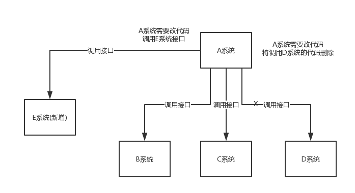

[toc]

# RocketMQ笔记1

RocketMQ 当前版本5.0.0

## 消息队列介绍

> 什么是消息队列？

消息队列从结构上是一种“先进先出”的数据结构。从功能上可以将大量的请求消息存储在消息队列中。


> 消息队列的使用场景

1. 应用解耦：在微服务系统中，每个服务之间都是互相调用的关系。如果某个业务中的某个微服务发送了故障，则该业务相关的其他微服务就暂时无法使用。这种情况可以说是服务与服务之间太过耦合。但是如果使用消息队列可以对服务之间进行解耦。比如物流系统发生故障，需要几分钟才能来修复，在这段时间内，物流系统要处理的数据被缓存到消息队列中，用户的下单操作正常完成。当物流系统回复后，补充处理存在消息队列中的订单消息即可，终端系统感知不到物流系统发生过几分钟故障。

不使用消息队列的情况

使用消息队列的情况


2. 流量削峰：如果系统遇到请求流量的瞬间猛增，有可能会将系统压垮。有了消息队列可以将大量请求缓存起来，分散到很长一段时间处理，这样可以大大提到系统的稳定性和用户体验。

不使用消息队列的情况

使用消息队列的情况


3. 数据分发：通过消息队列可以让数据在多个系统更加之间进行流通。数据的产生方不需要关心谁来使用数据，只需要将数据发送到消息队列，数据使用方直接在消息队列中直接获取数据即可。

不使用消息队列的情况

使用消息队列的情况


> 消息队列的优点
1. 应用解耦、流量削峰、数据分发。

> 消息队列的缺点
1. 系统稳定性降低：系统引入的外部依赖越多，系统稳定性越差。一旦MQ宕机，就会对业务造成影响。
2. 系统复杂度提高：MQ的加入增加了系统的复杂度，以前系统间是同步的远程调用，现在是通过MQ进行异步调用。
3. 消息一致性问题。


> 各种MQ产品的比较

常见的MQ产品包括Kafka、ActiveMQ、RabbitMQ、RocketMQ。 


## RocketMQ介绍

RocketMQ是阿里巴巴2016开发的MQ中间件，使用Java语言开发，在阿里内部，RocketMQ承接了例如“双11”等高并发场景的消息流转，能够处理万亿级别的消息。

RocketMQ当前最新版本：5.0.0

[RocketMQ官网：https://rocketmq.apache.org/zh/](https://rocketmq.apache.org/zh/)


## RocketMQ的基本概念

RocketMQ有几个基本概念需要先了解一下。
* Producer：消息的发送者；举例：发信者
* Consumer：消息接收者；举例：收信者
* Broker：暂存和传输消息；举例：邮局
* NameServer：管理Broker；举例：各个邮局的管理机构
* Topic：用来区分消息的种类；例如一个发送者可以发送消息给一个或者多个Topic；一个消息的接收者可以订阅一个或者多个Topic消息
* Message Queue：相当于是Topic的分区；用于并行发送和接收消息

> RocketMQ的结构图如下。


> RocketMQ的运行流程如下
1. 首先启动NameServer,它相当于RocketMQ的控制中心。
2. 然后启动Broker，启动后Broker会向NameServer发送自己的ip地址和路由。注册到NameServer中。
3. 当发送消息的时候，Producer会先从NameServer获取Broker的信息，然后将消息发送给Broker。
4. 当接收消息的时候，Consumer会先从NameServer获取Broker的信息，然后从Broker哪里接收消息。

### NameServer

NameServer 主要负责Broker的动态注册与发现。简单来说是一个服务发现与注册中心，类似于Nacos。也是整个 RocketMQ 的“大脑”，所以 RocketMQ 需要先启动 NameServer 再启动 Broker。

NameServer 可以集群部署，但是集群节点之间无任何信息同步。

### Broker

消息服务器（Broker）是消息存储中心，主要作用是接收来自 Producer 的消息并存储，让 Consumer 从这里取得消息。

除此之外 Broker 还存储与消息相关的元数据，包括用户组、消费进度偏移量、队列信息等。

从结构图中可以看出 Broker 有 Master 和 Slave 两种类型， Master 既可以写又可以读，Slave 不可以写只可以读。

### Producer

Producer 也称为消息发布者(生产者)，负责向 broker 发送由业务应用程序系统生成的消息。RocketMQ 提供了发送：同步、异步和单向（one-way）的多种范例。

### Consumer

Consumer也称为消息订阅者，负责从 brokers 那里拉取信息并将其输入给目标应用程序。


## RocketMQ的安装

### linux环境下的安装

1. 下载已经编译好的RocketMq二进制包。

[RocketMq的下载地址](https://rocketmq.apache.org/zh/download)


- 二进制包中有windows和linux两个环境的各种执行文件。
- bin目录中主要存放windows和linux两个环境的各种脚本文件。
- conf目录存放配置文件 ，包括broker配置文件、logback配置文件等
- lib目录存放各种依赖jar包，包括Netty、commons-lang、FastJSON等

2. 创建一个目录，用来存放下载的二进制包

```bash
# 解压二进制压缩包到指定目录
unzip rocketmq-all-5.1.3-bin-release.zip /usr/local/rocketmq
```

3. 修改配置文件

RocketMQ启动需要的内存较大，很容易因为内存不足而启动失败，因此需要编辑如下配置文件，修改JVM内存大小。

`runserver.sh`
```bash
JAVA_OPT="${JAVA_OPT} -server -Xms256m -Xmx256m -Xmn512m -XX:MetaspaceSize=128m -XX:MaxMetaspaceSize=320m"
```

`runbroker.sh`
```shell
JAVA_OPT="${JAVA_OPT} -server -Xms256m -Xmx256m -Xmn128m"
```

4. 启动RocketMQ

进入RocketMQ安装目录下的 /usr/local/rocketmq/rocketmq-all-5.1.3-bin-release 目录进行操作

先启动NameServer
```shell
# 1.启动NameServer
nohup sh bin/mqnamesrv &
# 2.查看启动日志
tail -f ~/logs/rocketmqlogs/namesrv.log
```

再启动Broker
```shell
# 1.启动Broker
nohup sh bin/mqbroker -n localhost:9876 &
# 2.查看启动日志
tail -f ~/logs/rocketmqlogs/broker.log 
```

5. 测试

当NameServer和Broker都启动成功后，可以使用RocketMq提供的测试文件进行测试。

测试发送消息
```sh
# 1.设置环境变量
export NAMESRV_ADDR=localhost:9876
# 2.使用安装包的Demo发送消息
sh bin/tools.sh org.apache.rocketmq.example.quickstart.Producer
```

测试接收消息
```shell
# 1.设置环境变量
export NAMESRV_ADDR=localhost:9876
# 2.接收消息
sh bin/tools.sh org.apache.rocketmq.example.quickstart.Consumer
```

6. 关闭RocketMQ

```shell
# 1.关闭NameServer
sh bin/mqshutdown namesrv
# 2.关闭Broker
sh bin/mqshutdown broker
```