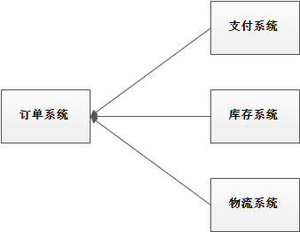
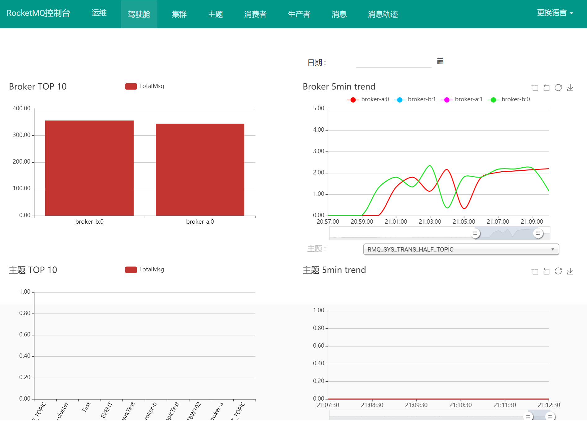

[toc]

# RocketMQ笔记1

RocketMQ 当前版本5.x

## 消息队列

> 什么是消息队列？

消息队列本质上是一种“先进先出”的队列数据结构。


> 消息队列的使用场景

① 应用解耦：在微服务系统中服务之间是互相调用的关系。这种情况下服务与服务之间太过耦合。如果使用消息队列可以对服务之间进行解耦。

不使用消息队列的情况

使用消息队列的情况


② 流量削峰：当服务遇到高并发请求的时候，服务可能会被压垮。但是有了消息队列，就可以将大量请求缓存起来，后续慢慢处理，这样可以大大提到系统的稳定性和用户体验。

不使用消息队列的情况

使用消息队列的情况


③ 数据分发：数据的产生方不需要关心谁来使用数据，只需要将数据发送到消息队列，数据使用方直接在消息队列中直接获取数据即可。

不使用消息队列的情况

使用消息队列的情况


> 消息队列的优缺点

- 优点：应用解耦、流量削峰、数据分发。
- 缺点：系统稳定性降低。一旦MQ宕机，就会对业务造成影响。
- 缺点：系统复杂度提高：MQ的加入增加了系统的复杂度。
- 缺点：如何保证消息一致性：通过MQ给多个系统发消息数据，如果有一个系统接收消息失败。那么如何解救？

> 各种消息队列产品的比较

常见的MQ产品包括Kafka、ActiveMQ、RabbitMQ、RocketMQ。 


## RocketMQ介绍

RocketMQ是阿里巴巴2016开发的MQ中间件，使用Java语言开发，在阿里内部，RocketMQ承接了例如“双11”等高并发场景的消息流转，能够处理万亿级别的消息。

RocketMQ当前最新版本：5.x

[RocketMQ官网](https://rocketmq.apache.org/zh/)


## RocketMQ的结构图


## RocketMQ的基本概念

这些概念分为消息生产、消息管理、消息消费三部分。

消息生产
- Producer：消息的生产者，需要先从NameServer中与Broker建立连接，才能向Broker发送消息。
- Producer Group (生产者组): 多个发送同一类消息的生产者。

消息消费
- Consumer：消息的消费者，需要先从NameServer中与Broker建立连接，才能获取Broker中的消息。
- Consumer Group (消费者组): 多个消费同一类消息的消费者。

消息管理
- Broker：RocketMQ的核心，负责接收，存储，传递消息等功能。
- NameServer：RocketMQ的管理者，用于管理Broker中的消息数据，相当于注册中心。
- Topic (主题)：用于区分Broker中不同类型的消息；发送和接收消息前，需要先创建Topic。
- Message Queue (消息队列)：是消息的存储单元。一个Topic中可以设置多个Message Queue。
- Message (消息)：即消息本身，主要存储在Message Queue中。

## RocketMQ的工作流程

1. 首先启动NameServer,它相当于RocketMQ的注册中心。
2. 然后启动Broker，启动后Broker会向NameServer发送自己的ip地址和路由。注册到NameServer中。
3. 当生产者发送消息的时候，Producer会先从NameServer获取Broker的信息，然后将消息发送给某个Broker。
4. 当接收消息的时候，Consumer会先从NameServer获取Broker的信息，然后从Broker哪里接收消息。


## RocketMQ的安装

RocketMQ运行需要依赖两个服务。一个是NameServer服务，另一个是Broker服务。当这个两个服务都运行之后，RocketMQ搭建完成了。

如果需要RocketMQ的图形控制界面，那么额外需要运行rocketmq-console服务。

### windows环境下的安装与启动

① 先下载已经编译好的RocketMq二进制包。

[RocketMq的下载地址](https://rocketmq.apache.org/zh/download)


- 二进制包中有windows和linux两个环境的各种执行文件。
- bin目录中主要存放windows和linux两个环境的各种脚本文件。
- conf目录存放配置文件,包括broker配置文件、logback配置文件等
- lib目录存放各种依赖jar包，包括Netty、commons-lang、FastJSON等

② 将下载的二进制包存放在一个目录中。

③ 创建ROCKETMQ_HOME环境变量。


④ 进入到bin目录中,打开CMD终端。先启动NameServer服务

```shell
start mqnamesrv.cmd
```

NameServer服务运行成功的窗口。注意：不能关闭这个窗口。


⑤ 再启动Broker服务

```shell
# Broker服务需要指定NameServer服务的ip地址。
start mqbroker.cmd -n 127.0.0.1:9876 autoCreateTopicEnable=true
```

Broker服务运行成功的窗口。注意：不能关闭这个窗口。


⑥ 如何运行RocketMQ的图形控制界面服务，继续看下文即可。

### linux环境下的安装与启动

① 下载RocketMq二进制包。

② 创建一个目录，用来存放下载的二进制包

```bash
# 解压二进制压缩包到指定目录
unzip rocketmq-all-5.1.3-bin-release.zip /usr/local/rocketmq
```

③ 修改配置文件

由于RocketMQ启动需要的内存较大，因此需要先在配置文件中修改JVM内存大小。

```bash
# 编辑runbroker.sh和runserver.sh修改默认JVM内存大小
# runserver.sh配置文件中
vi runserver.sh
JAVA_OPT="${JAVA_OPT} -server -Xms256m -Xmx256m -Xmn128m -XX:MetaspaceSize=128m -XX:MaxMetaspaceSize=320m"

# runbroker.sh配置文件中
vi runbroker.sh
JAVA_OPT="${JAVA_OPT} -server -Xms256m -Xmx256m -Xmn128m"
```

④ 启动RocketMQ

在RocketMQ的安装目录下进行操作。

1. 先启动NameServer
```shell
# 1.启动NameServer
nohup sh bin/mqnamesrv &
# 2.查看启动日志
tail -f ~/logs/rocketmqlogs/namesrv.log

# 在namesrv.log文件中看到`The Name Server boot success..`，表示NameServer 已成功启动。
```

NameServer默认占用的端口就是9876

2. 再启动Broker,需要指定NameServer的地址
```shell
# 1.启动Broker
nohup sh bin/mqbroker -n localhost:9876 --enable-proxy &
# 2.查看启动日志
tail -f ~/logs/rocketmqlogs/proxy.log

# 在 proxy.log 中看到“The broker[brokerName,ip:port] boot success..”，这表明 broker 已成功启动。。
```

⑤ 关闭RocketMQ

```shell
# 1.先关闭Broker
sh bin/mqshutdown broker
# 2.再关闭NameServer
sh bin/mqshutdown namesrv
```

### RocketMQ控制台安装

RocketMQ有一个管理控制台项目rocketmq-console，我们需要先将该项目下载到本地，对其编译打包为jar包，然后执行jar包即可。

① 下载RocketMQ控制台,并解压。

下载地址`https://github.com/apache/rocketmq-externals/tags`


② 修改application.properties配置文件

```
# 项目启动端口
server.port=8888
# 配置NameServer地址，注意防火墙要开启9876端口
rocketmq.config.namesrvAddr=localhost:9876
```

③ 将项目打包为jar包，并启动

```sh
# 进入项目目录
cd rocketmq-console
# macen编译打包
mvn clean package -Dmaven.test.skip=true
# 运行jar包
java -jar rocketmq-console-ng-1.0.0.jar
```

④ 访问控制台

通过浏览器访问`http://localhost:8888`进入控制台界面了，如下图所示。




### docker环境下的安装与启动

RocketMQ单机部署在docker中，一般需要部署3个容器。第一个容器是NameServer容器，第二个容器是Broker容器，第三个是控制台容器。

#### 部署RocketMQ的NameServer容器

① 下载RocketMQ官方镜像

```shell
docker pull apache/rocketmq:5.1.0
```

② 创建NameServer容器映射目录

```shell
# 这是linux系统上创建目录的命令
# 如果是windows系统，请自行创建
mkdir -m 777 -p /usr/local/rocketmq/nameserver/logs
mkdir -m 777 -p /usr/local/rocketmq/nameserver/store
```

③ 创建并启动NameServer容器

```shell
docker run -d --privileged=true --name my_rocketmq_nameserver -p 9876:9876 -v /d/DockerVolumes/rocketmq/nameserver/logs:/home/rocketmq/logs -v /d/DockerVolumes/rocketmq/nameserver/store:/root/store -e "MAX_HEAP_SIZE=256M" -e "HEAP_NEWSIZE=128M" -e "MAX_POSSIBLE_HEAP=100000000" apache/rocketmq:5.1.0 sh mqnamesrv
```

/d/DockerVolumes/rocketmq/.. 这是我windows环境上创建的容器映射目录。如果宿主机是linux环境，请自行更改。

#### 部署RocketMQ的Broker容器

① 下载RocketMQ官方镜像

```shell
docker pull apache/rocketmq:5.1.0
```

② 创建Broker容器映射目录

```shell
# 这是linux系统上创建目录的命令
# 如果是windows系统，请自行创建
mkdir -m 777 -p /usr/local/rocketmq/broker/logs
mkdir -m 777 -p /usr/local/rocketmq/broker/data
mkdir -m 777 -p /usr/local/rocketmq/broker/store
mkdir -m 777 -p /usr/local/rocketmq/broker/conf
```

③ 创建并修改broker.conf

在/usr/local/rocketmq/broker/conf中创建并配置broker.conf

```shell
# nameServer的IP地址。多个地址可以用;隔开
# 例：172.17.0.2:6666;172.17.0.2:8888 
namesrvAddr = 172.17.0.2:9876
# 集群名称，单机配置可以随意填写
brokerClusterName = DefaultCluster
# 节点名称，单机配置可以随意填写
brokerName = broker-a
# broker id节点ID， 0 表示 master, 其他的正整数表示 slave，不能小于0 
brokerId = 0
# Broker服务地址。内部使用填内网ip，如果是需要给外部使用填公网ip
# 172.17.0.3是 broker容器ip。
brokerIP1 = 172.17.0.3
# Broker角色
brokerRole = ASYNC_MASTER
# 刷盘方式
flushDiskType = ASYNC_FLUSH
# 在每天的什么时间删除已经超过文件保留时间的 commit log，默认值04
deleteWhen = 04
# 以小时计算的文件保留时间 默认值72小时
fileReservedTime = 72
# 是否允许Broker 自动创建Topic，建议线下开启，线上关闭
autoCreateTopicEnable=true
# 是否允许Broker自动创建订阅组，建议线下开启，线上关闭
autoCreateSubscriptionGroup=true
```

注意
- namesrvAddr：是填NameServer容器的IP地址。不要填localhost:9876，这是指向自己容器的IP地址。
- brokerIP1：一般broker容器是提供给NameServer容器和dashboard容器使用的，要填broker容器的外网IP，不是填localhost。
- 可以在容器的Inspect信息上查询容器自身的外网IP是多少。


④ 创建并启动Broker容器

```shell
docker run -d --privileged=true --name my_rocketmq_broker -p 10911:10911 -p 10909:10909 -v /d/DockerVolumes/rocketmq/broker/logs:/root/logs -v /d/DockerVolumes/rocketmq/broker/store:/root/store -v /d/DockerVolumes/rocketmq/broker/conf/broker.conf:/home/rocketmq/broker.conf -e "MAX_HEAP_SIZE=512M" -e "HEAP_NEWSIZE=256M" -e "MAX_POSSIBLE_HEAP=200000000" apache/rocketmq:5.1.0 sh mqbroker -c /home/rocketmq/broker.conf
```

/d/DockerVolumes/rocketmq/.. 这是我windows环境上创建的容器映射目录。如果宿主机是linux环境，请自行更改。


#### 部署RocketMQ控制台容器

① 下载控制台镜像

```shell
docker pull apacherocketmq/rocketmq-dashboard:latest
```

② 创建并启动控制台容器

```shell
docker run -d --name my_rocketmq_dashboard -p 9888:8080 -e "JAVA_OPTS=-Drocketmq.namesrv.addr=172.17.0.2:9876" apacherocketmq/rocketmq-dashboard
```

`namesrv.addr=172.17.0.2:9876`这是指向NameServer容器的IP地址。不要填localhost:9876，这是指向自己容器的IP地址。

