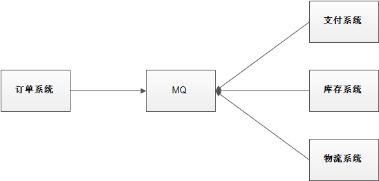
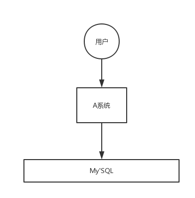
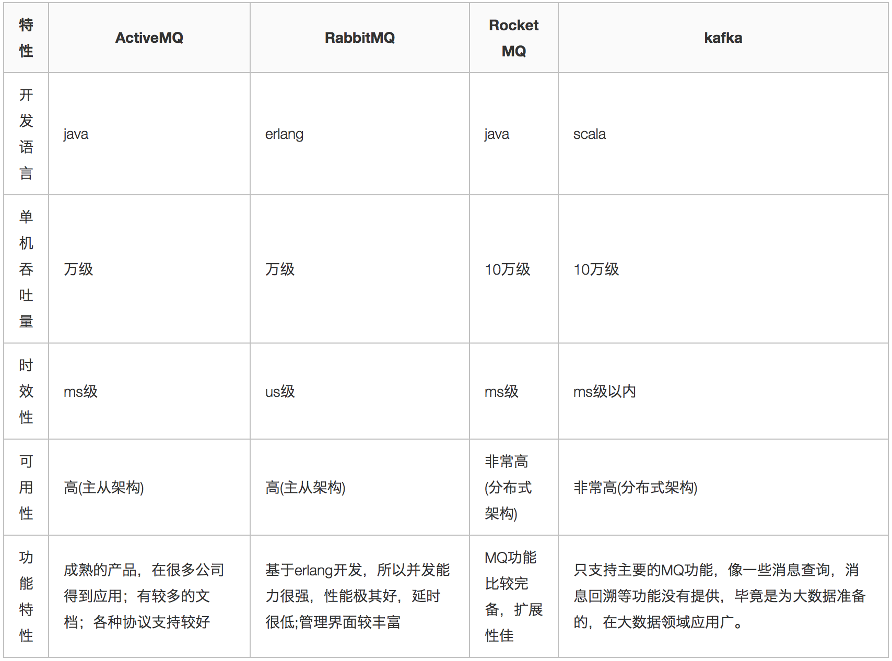

[toc]

# RocketMQ笔记1

RocketMQ 当前版本5.0.0

# 消息队列介绍

> 什么是消息队列？

消息队列从结构上是一种“先进先出”的数据结构。从功能上可以将大量的请求消息存储在消息队列中。

> 消息队列的使用场景

1. 应用解耦：在微服务系统中，每个服务之间都是互相调用的关系。如果某个业务中的某个微服务发送了故障，则该业务相关的其他微服务就暂时无法使用。这种情况可以说是服务与服务之间太过耦合。但是如果使用消息队列可以对服务之间进行解耦。比如物流系统发生故障，需要几分钟才能来修复，在这段时间内，物流系统要处理的数据被缓存到消息队列中，用户的下单操作正常完成。当物流系统回复后，补充处理存在消息队列中的订单消息即可，终端系统感知不到物流系统发生过几分钟故障。

不使用消息队列的情况

使用消息队列的情况

2. 流量削峰：如果系统遇到请求流量的瞬间猛增，有可能会将系统压垮。有了消息队列可以将大量请求缓存起来，分散到很长一段时间处理，这样可以大大提到系统的稳定性和用户体验。

不使用消息队列的情况

使用消息队列的情况

3. 数据分发：通过消息队列可以让数据在多个系统更加之间进行流通。数据的产生方不需要关心谁来使用数据，只需要将数据发送到消息队列，数据使用方直接在消息队列中直接获取数据即可。

不使用消息队列的情况

使用消息队列的情况

> 消息队列的优点
1. 应用解耦、流量削峰、数据分发。

> 消息队列的缺点
1. 系统稳定性降低：系统引入的外部依赖越多，系统稳定性越差。一旦MQ宕机，就会对业务造成影响。
2. 系统复杂度提高：MQ的加入增加了系统的复杂度，以前系统间是同步的远程调用，现在是通过MQ进行异步调用。
3. 消息一致性问题。

> 各种MQ产品的比较

常见的MQ产品包括Kafka、ActiveMQ、RabbitMQ、RocketMQ。 

# RocketMQ介绍

RocketMQ是阿里巴巴2016开发的MQ中间件，使用Java语言开发，在阿里内部，RocketMQ承接了例如“双11”等高并发场景的消息流转，能够处理万亿级别的消息。

RocketMQ当前最新版本：5.0.0

[RocketMQ官网：https://rocketmq.apache.org/zh/](https://rocketmq.apache.org/zh/)

