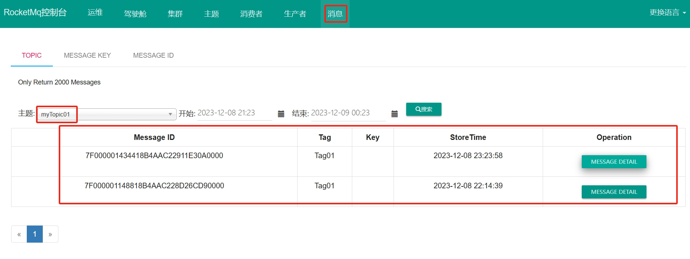
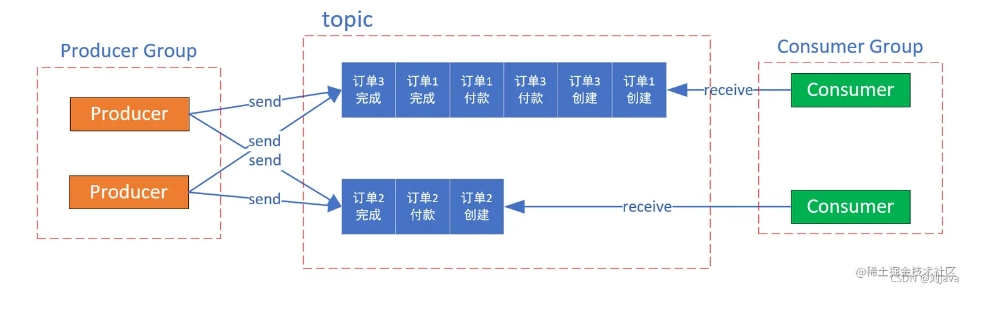

[toc]

# RocketMQ笔记2

RocketMQ 当前版本5.x

## RocketMQ的使用

### 生产者发送消息

生产者发送消息的步骤
```
1.创建消息生产者producer，并设置生产者组名
2.指定Nameserver地址
3.启动生产者producer
4.创建消息对象，指定消息的主题Topic、Tag和消息体
5.发送消息对象
6.关闭生产者producer
```

#### 发送同步消息

同步消息是指，发送消息后需要等待服务器的响应结果后，程序才能执行下去。

同步消息主要用于实时性要求高的场景。比如：重要的消息通知，短信通知等。

```java
public class TEST1 {
    public static void main(String[] args) throws MQClientException, MQBrokerException, RemotingException, InterruptedException {
        // 1. 实例化生产者Producer，并设置生产者所属的生产者组名
        DefaultMQProducer producer = new DefaultMQProducer("myProducer-group01");
        // 2. 为生产者设置Nameserver的地址
        producer.setNamesrvAddr("127.0.0.1:9876");
        // 3. 启动生产者Producer
        producer.start();
        // 4. 创建消息对象。主要设置消息的主题topic,标签tag,消息内容
        Message msg = new Message("myTopic01","Tag01",("this is a RocketMq Message").getBytes());
        // 5. 发送同步消息到一个Broker
        SendResult sendResult = producer.send(msg,10000);
        // 通过sendResult判断消息是否成功送达
        System.out.println("sendResult = "+sendResult);
        // 6. 如果不再发送消息，关闭生产者
        producer.shutdown();
    }
}
```

控制台上可以看到生产者发送的消息。



#### 发送异步消息

异步消息是指，发送消息后不用等待RocktetMQ的响应结果，程序直接继续执行下去。

异步消息通常用在响应时间有些长的业务场景，即程序本身不能容忍长时间地等待响应结果。例如，上传大文件等

```java
public class TEST1 {
    public static void main(String[] args) throws MQClientException, MQBrokerException, RemotingException, InterruptedException {
        // 1. 实例化生产者Producer，并设置生产者所属的生产者组名
        DefaultMQProducer producer = new DefaultMQProducer("myProducer-group01");
        // 2. 为生产者设置Nameserver的地址
        producer.setNamesrvAddr("127.0.0.1:9876");
        // 3. 启动生产者Producer
        producer.start();
        // 非必须。指定异步消息发送失败后不进行重试发送，发送0次
        producer.setRetryTimesWhenSendAsyncFailed(0);
        // 4. 创建消息对象。主要设置消息的主题topic,标签tag,消息内容
        Message msg = new Message("myTopic01","Tag01",("Hello world").getBytes());
        // 5. 发送异步消息到一个Broker,
        // 这里有两个回调函数，成功回调和失败回调。
        producer.send(msg, new SendCallback() {
            @Override
            public void onSuccess(SendResult sendResult) {
                System.out.println("异步消息发送成功。sendResult = "+sendResult);
            }
            @Override
            public void onException(Throwable e) {
                System.out.println("异步消息发送失败。");
                e.printStackTrace();
            }
        });
        //程序暂停2s,防止异步消息发送之前就把生产者关闭了，从而导致异步消息发送失败。
        Thread.sleep(2000);
        // 6. 如果不再发送消息，关闭生产者
        producer.shutdown();
    }
}
```

#### 发送单向消息

单向消息是指，发送消息后不关心消息发送结果的场景。通常用在耗时短，且重要性不高的场景。例如日志发送等

```java
public class TEST1 {
    public static void main(String[] args) throws MQClientException, MQBrokerException, RemotingException, InterruptedException {
        // 1. 实例化生产者Producer，并设置生产者所属的生产者组名
        DefaultMQProducer producer = new DefaultMQProducer("myProducer-group01");
        // 2. 为生产者设置Nameserver的地址
        producer.setNamesrvAddr("127.0.0.1:9876");
        // 3. 启动生产者Producer
        producer.start();
        // 4. 创建消息对象。主要设置消息的主题topic,标签tag,消息内容
        Message msg = new Message("myTopic01","Tag01",("Hello world2").getBytes());
        // 5. 发送单向消息，没有任何返回结果
        producer.sendOneway(msg);
        // 6. 如果不再发送消息，关闭生产者
        producer.shutdown();
    }
}
```

### 消费者消费消息

消费者消费消息的步骤
```
1. 创建消费者Consumer，制定消费者组名
2. 指定Nameserver地址
3. 订阅消息Topic和消息Tag
4. 设置回调函数，编写如何处理消息
5. 启动消费者consumer，来消费消息。
```

消费者基本上都是以监听的方式来实时监听消息队列中的消息。一旦有符合的消息，那么消费者就会去消费它。

代码如下：
```java
public class TEST2 {
    public static void main(String[] args) throws Exception {
        // 1. 实例化消息消费者,设置消费者所属的组名
        DefaultMQPushConsumer consumer = new DefaultMQPushConsumer("myConsumer-group01");
        // 2. 指定Namesrv地址信息.
        consumer.setNamesrvAddr("127.0.0.1:9876");
        // 3. 指定消费者订阅的消息Topic和消息Tag,*表示所有Tag
        consumer.subscribe("myTopic01", "*");
        // 4. 设置回调函数，在其中创建一个监听器，用来实时监听并处理消息
        consumer.registerMessageListener(new MessageListenerConcurrently() {
            //在监听器的方法中处理消息。该方法返回处理消息的结果
            @Override
            public ConsumeConcurrentlyStatus consumeMessage(List<MessageExt> msgs,ConsumeConcurrentlyContext context) {
                System.out.println("====开始消费消息====");
                System.out.println("消息列表msgs = "+msgs);
                //返回处理消息成功的状态
                return ConsumeConcurrentlyStatus.CONSUME_SUCCESS;
            }
        });
        //5. 启动消息者
        consumer.start();
    }
}
```

#### 消费消息的模式

消费者消费消息的方式有多种。可以通过setMessageModel方法来设置消费者的消费方式。

> 负载均衡模式（默认的模式）

同一个消费组中的消费者采用负载均衡的方式来消费消息，这种模式下每个消费者处理的消息都是不同的，并且每个消息只会被消费一次。

设置消费者的消费模式为负载均衡模式
```java
// 创建消息生产者,指定组名,topic,tag
DefaultMQPushConsumer consumer = new DefaultMQPushConsumer("myConsumer-group01");
consumer.setNamesrvAddr("127.0.0.1:9876");
consumer.subscribe("myTopic01", "*");
//负载均衡模式消费
consumer.setMessageModel(MessageModel.CLUSTERING);
```

> 广播模式

同一个消费组中的消费者采用广播的方式消费消息，这种模式下每个消费者消费的消息都是相同的。

设置消费者的消费模式为广播模式
```java
//广播模式消费
consumer.setMessageModel(MessageModel.BROADCASTING);
```

### 顺序消息

顺序消息通常用于业务上有先后顺序要求的场景，比如主从数据同步，订单流程操作等。这些必须按照一定的顺序执行，否则会导致错误的结果。

> 顺序消息的原理


普通发送消息的模式下，生产者会采用Round Robin轮询的方式将消息均匀的分发到Topic中的不同队列中，然后消费者会从Topic中的多个队列上进行消息消费。因为生产者和消费者同时对Topic中的多个队列操作，因此RocketMQ 就无法使用队列有序特性来保证消息有序性了。

但是如果控制生产者发送的消息有序发送到同一个queue中，消费者只从这个queue上依次消费消息，那么就保证了消息的顺序性。

> 顺序消息一般分为全局顺序消息和局部顺序消息。
- 全局顺序消息: 是指某个Topic下的所有消息都要保证顺序。如果要实现全局顺序消息，那么只能使用一个队列，以及一个生产者，这是会严重影响性能。
- 局部顺序消息：是保证Topic中的每一个队列中的消息能顺序发送和顺序消费。

由于全局顺序消息是会严重影响性能。所以大部分情况下，都是用局部顺序消息。

#### 消息的顺序发送和顺序消费

通常情况下，一个Topic中有多个消息队列，生产者发送的消息轮询存储在不同队列中。

如果我们要将消息顺序发送，那么我们必须将一组相同的消息按照顺序存入同一个队列中，就能保证消息有序发送。

例如：一组订单消息，包括订单创建消息，订单支付消息，订单完成消息。这一组订单消息都包含相同的订单ID号。我们可以通过对订单ID号进行Hash取模，来保证同一组订单消息都存放在同一个队列中。



生产者代码如下
```java
public class Producer {
    private DefaultMQProducer producer;
    //初始化生产者
    public Producer() throws MQClientException {
        producer = new DefaultMQProducer("myConsumer-group02");
        producer.setNamesrvAddr("localhost:9876");
        producer.start();
    }
    //发送消息
    public void sendMessage(Order order) throws MQClientException, InterruptedException, RemotingException, MQBrokerException {
        //创建消息对象，将Order对象传入其中
        Message message = new Message("OrderTopic", "orderTAG", JSON.toJSONBytes(order));
        //发送消息，通过消息选择器MessageQueueSelector，来选择具体的队列
        
        producer.send(message, new MessageQueueSelector() {
            //选择消息队列的select方法
            @Override
            public MessageQueue select(List<MessageQueue> mqs, Message msg, Object arg) {
                //对订单ID%队列数量。来选择队列
                Integer id = (Integer) arg;
                int index = id % mqs.size();
                return mqs.get(index);
            }
        }, order.getId());
    }
    //关闭生产者
    public void shutdown() {
        producer.shutdown();
    }
}
```

RocketMQ提供了一个MessageQueueSelector接口来选择消息队列，我们需要实现这个接口来选择正确的队列。在上面的代码中，我们使用了order.getId()作为参数来选择消息队列。

消费者代码如下：
```java
public class Consumer {
    private DefaultMQPushConsumer consumer;
    //初始化消费者
    public Consumer() throws MQClientException {
        //设置消费者的组名
        consumer = new DefaultMQPushConsumer("myConsumer-group02");
        //设置消费者连接的NameServer
        consumer.setNamesrvAddr("localhost:9876");
        //设置消费者订阅的topic，tag
        consumer.subscribe("OrderTopic", "*");
        //注册消费者的监听方法
        consumer.registerMessageListener(new MessageListenerOrderly() {
            @Override
            public ConsumeConcurrentlyStatus consumeMessage(List<MessageExt> msgs, ConsumeConcurrentlyContext context) {
                //打印消息
                for (MessageExt msg : msgs) {
                    System.out.println(new String(msg.getBody()));
                }
                //返回消费成功状态
                return ConsumeConcurrentlyStatus.CONSUME_SUCCESS;
            }
        });
        //启动消费者
        consumer.start();
    }
    //关闭消费者
    public void shutdown() {
        consumer.shutdown();
    }
}
```

RocketMQ提供了一个MessageListenerOrderly接口来保证消息的顺序消费，我们只需要实现这个接口即可。

MessageListenerOrderly接口是一种高级的消费方式，可以确保一个线程只消费一个队列中的消息，并且消息按照发送的顺序被消费。


测试代码如下
```java
public static void main(String[] args) {
    //创建多个订单
    Order order1 = new Order(1, "order1");
    Order order2 = new Order(2, "order2");
    Order order3 = new Order(3, "order3");
    //创建生产者
    Producer producer = new Producer();
    //生产者发送消息
    producer.sendMessage(order1);
    producer.sendMessage(order2);
    producer.sendMessage(order3);
    //暂停
    Thread.sleep(1000);
    //创建消费者
    Consumer consumer = new Consumer();
    //暂停
    Thread.sleep(5000);
    //关闭生产者和消费者
    producer.shutdown();
    consumer.shutdown();
}
```

因为发送和消费是异步的，所以我们需要等待一段时间，以便消息被正确地发送和消费。

#### 总结

消息顺序发送和顺序消费的条件：
- 发送消息：保证同一类消息能都有序发送到同一条队列中。
- 消费消息：保证同一个消费者，只消息这一个队列中的消息。


### 定时/延时消息

定时/延时消息：是指消息不会马上发送到消息队列中，而是到达某个时间之后才发送给消息队列，让消费者消费。

例如，订单下单后用户可能不会立即支付。通常需要30分钟后，服务端检查订单状态后，才决定是否取消订单。

从程序的角度，就是生产者创建一个订单取消的延时消息。30分钟后若订单支付了，则删除这个消息。若订单没有支付，则将这个消息发送到消息队列，让消费者消费。即让消费者将这个订单取消。

定时/延时消息的原理：即消息发送之后，不会直接存入到队列中，而是临时存入到一个位置，这个位置会被实时监听。当时间到了，就把消息从这个位置再次存入到队列中。

代码如下
```java
Message message = new Message("myTopic01","Tag01",("Hello world3").getBytes());
// 延时消息 10s 后投递
message.setDelayTimeSec(10);
// 延时消息 10000ms 后投递
message.setDelayTimeMs(10_000L);
// 延时消息，定时时间为当前时间 + 10000ms
message.setDeliverTimeMs(System.currentTimeMillis() + 10_000L);
// 直接发送消息即可
SendResult result = producer.send(message);
```

除此之外，还有更多的方法提供了延时和定时消息的方式。自行查询源码。


## SpringBoot整合RocketMQ

① 在springboot项目中添加RocketMQ依赖

```xml
<dependencies>
    <dependency>
        <groupId>org.apache.rocketmq</groupId>
        <artifactId>rocketmq-spring-boot-starter</artifactId>
        <version>2.0.3</version>
    </dependency>
</dependencies>
```

② 配置RocketMQ

在配置文件中配置RocketMQ的NameServer和生产者组

```properties
rocketmq.name-server=192.168.25.135:9876;192.168.25.138:9876
rocketmq.producer.group=myProducer-group01
```

③ 发送消息测试

通过RocketMQTemplate工具类，可以用来发送消息。

```java
public class ProducerTest {
    @Autowired
    private RocketMQTemplate rocketMQTemplate;

    //convertAndSend方法可以将参数转换为消息对象，并发送出去
    public void test1(){
        //指定topic和消息内容
        rocketMQTemplate.convertAndSend("myTopic","hello springboot rocketmq");
    }
}
```

④ 消费消息测试

创建一个类，用来作为消费者消息消息的。这个类需要添加@RocketMQMessageListener注解和实现RocketMQListener接口。

```java
//该注解用于设置消费者所属的消费组和订阅的topic
@RocketMQMessageListener(topic = "myTopic",consumerGroup = "myConsumer-group02")
public class Consumer implements RocketMQListener<String> {
    //重写接口的监听方法，用来消费消息
    @Override
    public void onMessage(String message) {
        //消费消息的具体业务逻辑
        log.info("消费了一个消息。message = "+message);
    }
}
```

### RocketMQTemplate的使用

RocketMQTemplate的使用例子：
```java
@Slf4j
@Service
public class TEST {
    @Autowired
    private RocketMQTemplate template;

    /**
     * 发送普通消息
     *
     * @param topic   topic
     * @param message 消息体
     */
    public void sendMessage(String topic, Object message) {
        template.convertAndSend(topic, message);
        log.info("普通消息发送完成：message = {}", message);
    }

    /**
     * 发送同步消息
     *
     * @param topic   topic
     * @param message 消息体
     */
    public void syncSendMessage(String topic, Object message) {
        SendResult sendResult = template.syncSend(topic, message);
        log.info("同步发送消息完成：message = {}, sendResult = {}", message, sendResult);
    }

     /**
     * 发送携带 tag 的消息（过滤消息）
     *
     * @param topic   topic，RocketMQTemplate将 topic 和 tag 合二为一了，底层会进行
     *                拆分再组装。只要在指定 topic 时跟上 {:tags} 就可以指定tag
     *                例如 test-topic:tagA
     * @param message 消息体
     */
    public void syncSendMessageWithTag(String topic, Object message) {
        template.syncSend(topic, message);
        log.info("发送带 tag 的消息完成：message = {}", message);
    }

    /**
     * 发送异步消息
     *
     * @param topic   topic
     * @param message 消息体
     */
    public void asyncSendMessage(String topic, Object message) {
        template.asyncSend(topic, message, new SendCallback() {
            //回调成功函数
            @Override
            public void onSuccess(SendResult sendResult) {
                log.info("异步消息发送成功，message = {}, SendStatus = {}", message, sendResult.getSendStatus());
            }
            //回调失败函数
            @Override
            public void onException(Throwable e) {
                log.info("异步消息发送异常，exception = {}", e.getMessage());
            }
        });
    }

    /**
     * 发送单向消息
     *
     * @param topic   topic
     * @param message 消息体
     */
    public void sendOneWayMessage(String topic, Object message) {
        template.sendOneWay(topic, message);
        log.info("单向发送消息完成：message = {}", message);
    }

    /**
     * 同步发送批量消息
     *
     * @param topic       topic
     * @param messageList 消息集合
     * @param timeout     超时时间（毫秒）
     */
    public void syncSendMessages(String topic, List<Message<?>> messageList, long timeout) {
        template.syncSend(topic, messageList, timeout);
        log.info("同步发送批量消息完成：message = {}", JSON.toJSONString(messageList));
    }

    /**
     * 发送事务消息
     *
     * @param topic   topic
     * @param message 消息对象
     */
    public void sendMessageInTransaction(String topic, SysUserDto message) {
        //随机创建事务ID
        String transactionId = UUID.randomUUID().toString();
        //发送事务消息
        TransactionSendResult result = template.sendMessageInTransaction(topic, MessageBuilder.withPayload(message)
                .setHeader(RocketMQHeaders.TRANSACTION_ID, transactionId)
                .build(), message);
        log.info("发送事务消息（半消息）完成：result = {}", result);
    }

   

    /**
     * 同步发送延时消息
     *
     * @param topic      topic
     * @param message    消息体
     * @param timeout    超时
     * @param delayLevel 延时等级：
     *                   从1s到2h分别对应着等级 1 到 18，消息消费失败会进入延时消息队列
     *                   "1s 5s 10s 30s 1m 2m 3m 4m 5m 6m 7m 8m 9m 10m 20m 30m 1h 2h";
     */
    public void syncSendDelay(String topic, Object message, long timeout, int delayLevel) {
        template.syncSend(topic, MessageBuilder.withPayload(message).build(), timeout, delayLevel);
        log.info("已同步发送延时消息 message = {}", message);
    }

    /**
     * 异步发送延时消息
     *
     * @param topic      topic
     * @param message    消息对象
     * @param timeout    超时时间
     * @param delayLevel 延时等级
     */
    public void asyncSendDelay(String topic, Object message, long timeout, int delayLevel) {
        template.asyncSend(topic, MessageBuilder.withPayload(message).build(), new SendCallback() {
            @Override
            public void onSuccess(SendResult sendResult) {
                log.info("异步发送延时消息成功，message = {}", message);
            }

            @Override
            public void onException(Throwable throwable) {
                log.error("异步发送延时消息发生异常，exception = {}", throwable.getMessage());
            }
        }, timeout, delayLevel);
        log.info("已异步发送延时消息 message = {}", message);
    }

    /**
     * 发送单向顺序消息
     *
     * @param topic topic
     */
    public void sendOneWayOrderly(String topic) {
        for (int i = 0; i < 30; i++) {
            template.sendOneWayOrderly(topic, MessageBuilder.withPayload("message - " + i).build(), "topic");
            log.info("单向顺序发送消息完成：message = {}", "message - " + i);
        }
    }

    /**
     * 同步发送顺序消息
     *
     * @param topic topic
     */
    public void syncSendOrderly(String topic) {
        for (int i = 0; i < 30; i++) {
            SendResult sendResult = template.syncSendOrderly(topic, MessageBuilder.withPayload("message - " + i).build(), "syncOrderlyKey");
            log.info("同步顺序发送消息完成：message = {}, sendResult = {}", "message - " + i, sendResult);
        }
    }
}

```