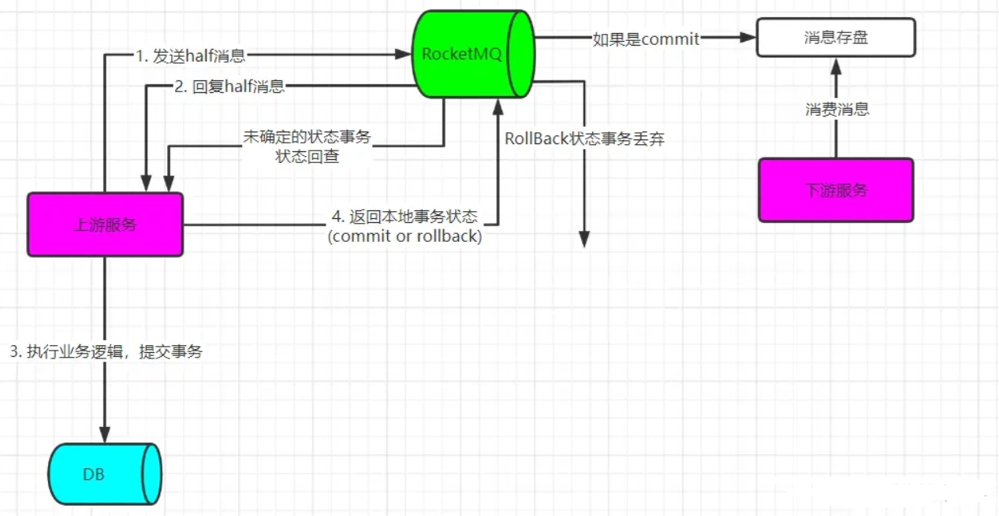

[toc]

# RocketMQ笔记3

## 事务消息

RocketMQ的事务消息是用来保证消息与事务的一致性。

### 什么是消息与事务的一致性？

假如一个本地事务A，这个本地事务A中要完成一些业务逻辑操作（向数据库插入几条记录，向消息队列发送消息）。

当本地事务A需要回滚的时候，我们希望本地事务A中的写库操作和发送消息操作也能够回滚。那么我们该如何做呢？

> 方式1：先写库，后发消息。

```java
//伪代码
public void test(){
    //写库操作，向表中插入几条数据
    //注意，暂时不要进行数据库事务提交
    orderService.insert("xxx01");
    orderService.insert("xxx02");
    orderService.insert("xxx03");

    //后发送消息
    SendResult sendResult = producer.send("xxxx");
    //判断消息是否发送成功
    if(sendResult.getState().equals("OK")){
        //进行数据库事务提交
        connection.commit()
    }else{
        //进行数据库事务回滚
        connection.commit()
    }
}
```

方式1的执行过程如下：
1. 先写库，暂时不要提交数据库事务。
2. 后发送消息。
3. 若消息发送成功，则提交数据库事务。否则回滚数据库事务。


方式1有一个问题。即生产者发送消息之后，需要等待消息发送结果之后，才提交/回滚数据库事务。

如果由于网络问题，导致需要等待一段时间后，生产者才能接收到消息发送结果。那么这一段时间内，数据库事务需要一直等待。这样会导致数据库连接资源很容易就耗尽。最终导致其他业务无法进行数据库操作。


> 方式2：先发消息，后写库。

```java
//伪代码
public void test(){
    //先发送消息
    SendResult sendResult = producer.send("xxxx");
    //判断消息是否发送成功
    if(sendResult.getState().equals("OK")){
        //写库操作，向表中插入几条数据
        orderService.insert("xxx01");
        orderService.insert("xxx02");
        orderService.insert("xxx03");
        //进行数据库事务提交
        connection.commit()
    }
}
```

方式2的执行过程如下：
1. 先发送消息
2. 若消息发送成功，则进行写库。否则，不写库。

方式2有一个问题。如果消息发送成功后，写库操作失败了。那么我们如何撤回发送成功的消息。

> 方式3: RocketMQ提供了事务消息。

事务消息可以让本地事务和消息保持一致性，即一个业务功能中的本地事务操作和消息发送操作，要么全都完成，要么全都不完成。

### 事务消息的实现流程

再次说明，事务消息是让本地事务和消息保持一致性。即一个业务功能中的本地事务操作和消息发送操作，要么全都完成，要么全都不完成。

如图所示


事务消息实现流程如下：
1. 上游服务通过生产者，向MQ发送一条half消息。MQ收到half消息后，会返回一个响应给上游服务。
2. 上游服务的生产者接收MQ发送的响应。
   1. 如果生产者接收到SUCCESS响应，表明half消息发送成功。此时上游服务开始执行本地事务。
   2. 如果生产者接收到FAIL响应，则尝试重发half消息。此时上游服务不会执行本地事务。
3. 如果上游服务的本地事务提交成功/失败，上游服务通过生产者向MQ发送commit/rollback事务状态消息。
4. MQ会接收到生产者发送的commit/rollback事务状态消息。
   1. 如果接收到commit，则MQ会把half消息提交（即half消息变为真正的消息，并持久化到磁盘上）。
   2. 如果接收到rollback，则MQ会把half消息删除。
5. 如果由于网络问题，导致MQ长时间未接收到针对这个half消息的commit/rollback。那么MQ会调用上游服务提供的一个接口，通过这个接口来判断本地事务是否完成以及判断half消息的状态。
   1. 如果接口中判断本地事务完成，则发送commit
   2. 如果接口中判断本地事务失败，则发送rollback

当本地事务提交完成，并且消息也发送成功后（即half消息变为真正的消息）。则下游服务可以通过消费者来对这个消息进行消费。

> 什么是half消息？

half其实也是一个消息。只不过half消息在 RocketMQ 中不会被消费者消费，除非这个half消息被commit了。

half消息在被commit之前，MQ会先放在一个内部队列中。只有half消息被commit了,那么half消息会被放在消费者能读取到的 topic 队列中。

一般情况下，若本地事务提交成功，则生产者commit half消息。若本地事务提交失败，需要进行事务回滚。则生产者rollback half消息。

### 事务消息的问题

事务消息只能保证本地事务和消息的一致性。即一个业务功能中的本地事务操作和消息发送操作，要么全都完成，要么全都不完成。

对于分布式事务，RocketMQ的事务消息只能保证整个分布式事务和消息一致性的一半。即保证的是上游服务的本地事务和消息发送的一致性，而对下游服务的本地事务和消费消息的一致性无法保证。

通常情况下，可以将事务与消息分开操作。即在事务外执行发送消息的操作。通过MQ的消息补偿和重发机制，来保证消息的发送成功。

### 事务消息的代码实现

更新RocketMQ配置类。确保TransactionListenerImpl被正确注册到RocketMQTemplate中。

代码实现过程如下：
1. 我们需要将手写事务监听器TransactionListener接口，并实现其中的两个方法。executeLocalTransaction方法和checkLocalTransaction方法。
2. 然后将监听器实现类注册到RocketMQTemplate中。
3. 然后我们先发送 half 消息。当 half 消息发送成功后，会自动触发监听器实现类的executeLocalTransaction方法，该方法用于执行本地事务。并返回事务提交状态。
4. 若MQ长时间未收到本地事务提交状态，则MQ会调用监听器实现类的checkLocalTransaction方法，对本地事务进行检查。并返回事务提交状态


```java
// RocketMQ配置类
@Configuration
public class MQConfig {
    @Bean
    public TransactionListener transactionListener(TransactionalService transactionalService) {
        return transactionalService.new TransactionListenerImpl();
    }

    @Bean
    public RocketMQTemplate rocketMQTemplate(RocketMQTemplate template, TransactionListener transactionListener) {
        // 设置事务监听器
        template.setTransactionListener(transactionListener);
        return template;
    }
}
```

业务代码实现
```java
@Service
public class testService {

    @Autowired
    private RocketMQTemplate rocketMQTemplate;

    // 这个方法用于执行实际的业务逻辑
    @Transactional
    public void runBusinessLogic(String msg) {
        // 执行本地事务（比如数据库操作）
        // 如果本地事务执行失败，可以抛出异常
    }

    // 该方法用于发送half消息
    // 当half消息发送成功后，会自动触发监听器的executeLocalTransaction方法，该方法用于执行本地事务。并返回事务提交状态
    // 若MQ长时间未收到事务提交状态，则MQ会调用监听器的checkLocalTransaction方法，对本地事务进行检查。并返回事务提交状态
    public void sendHalfMessage(String msg) {
        rocketMQTemplate.sendMessageInTransaction("test-topic", MessageBuilder.withPayload(msg).build(), null);
    }

    // 事务监听器，需要自己手动实现。
    private class TransactionListenerImpl implements TransactionListener {
        //执行本地事务方法
        @Override
        public LocalTransactionState executeLocalTransaction(org.springframework.messaging.Message msg, Object arg) {
            try {
                //执行本地事务
                runBusinessLogic(msg.getPayload().toString());
                //若本地事务执行成功，则返回COMMIT状态
                return LocalTransactionState.COMMIT_MESSAGE;
            } catch (Exception e) {
                //若本地事务执行异常，则返回ROLLBACK状态
                return LocalTransactionState.ROLLBACK_MESSAGE;
            }
        }

        //本地事务检测方法
        @Override
        public LocalTransactionState checkLocalTransaction(org.springframework.messaging.Message msg) {
            // 查询本地事务是否完成。若完成，则返回COMMIT状态。否则返回ROLLBACK状态
            if("xxxx"){
                return LocalTransactionState.COMMIT_MESSAGE;
            }          
            return LocalTransactionState.ROLLBACK_MESSAGE;
        }
    }
}
```


## 消息持久化

消息队列因为有高可靠性的要求，所以消息数据要进行持久化存储。


消息持久化的步骤
1. 生产者发送消息
2. MQ收到消息后，将消息进行持久化存储。
3. MQ存储消息之后，返回ACK给生产者。
4. MQ push消息给对应的消费者，然后等待消费者返回ACK
5. 如果消费者在指定时间内成功返回ack，那么MQ认为消息消费成功，在存储中删除持久化的消息，即执行第6步；如果MQ在指定时间内没有收到ACK，则认为消息消费失败，会尝试重新push消息,重复执行4、5、6步骤
6. MQ删除持久化存储的消息。

### 消息持久化的方式

RocketMQ的消息是持久化存储到磁盘上的，这样既能保证断电后恢复，又可以让存储的消息量超出内存的限制。

RocketMQ为了提高持久化的性能，会尽可能地保证磁盘的顺序写。生产者发送消息到RocketMQ的时候。有两种写磁盘方式，同步刷盘和异步刷盘。


> 同步刷盘

具体流程是，消息写入内存后，立刻通知刷盘线程刷盘。然后等待刷盘完成，刷盘线程执行完成后唤醒等待的线程，返回消息写成功的状态。

> 异步刷盘

具体流程是，消息写入内存后，会返回写成功状态。这时的消息会被暂时存储在内存中。当内存里的消息数量积累到一定程度时，统一触发写磁盘动作，快速写入。

> 如何配置写磁盘的方式

同步刷盘还是异步刷盘，都是通过Broker配置文件里的flushDiskType 参数设置的，这个参数被配置成SYNC_FLUSH(同步刷盘)、ASYNC_FLUSH(异步刷盘)。

## RocketMQ如何保证消息不被重复消费？消息幂等性问题？

RocketMQ 消息重复的场景，有三种情况：

1. 发送时消息重复

生产者成功发送消息给MQ的时候。由于网络故障，生产者没有收到发送成功的结果。因此生产者会再次发送消息给MQ。

2. 消费时消息重复

当消费组成功消费一条消息的时候。由于网络故障，MQ没有收到成功回应。因此MQ再次投递一条消息给消费者。导致消费者多次消费同一条消息。

> 解决思路

即使MQ重复发送了消息，消费者拿到了消息之后，要判断是否已经消费过，如果已经消费，直接丢弃。

> 解决方法

1. 如果从MQ拿到数据是要存到数据库，那么可以维护一个消息表。当消费消息的时候，插入一条记录到消息表中。当消费同样的消息的时候，先从消息表中查询这个消息是否存在。如果存在，就不消费。如果不存在就消费。

2. 生产者发送消息时，每条消息加一个全局的唯一id，然后消费时，将该id保存到redis里面。消费时先去redis里面查一下有么有，没有再消费。

3. 如果拿到的数据是直接放到redis的set中的话，那就不用考虑了，因为set集合就是自动有去重的。