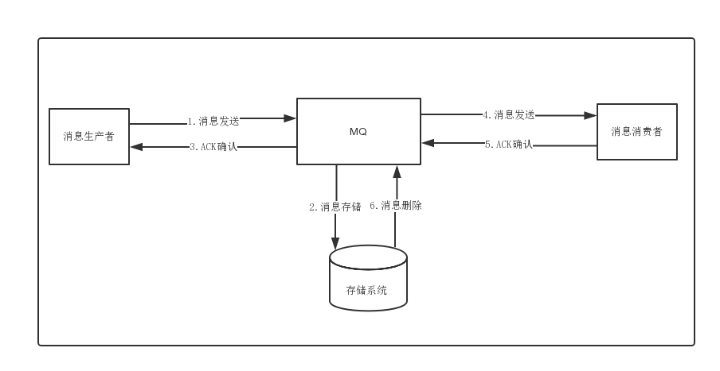

[toc]

# RocketMQ笔记3

## 消息持久化

消息队列因为有高可靠性的要求，所以消息数据要进行持久化存储。

消息持久化的步骤
1. 生产者发送消息
2. MQ收到消息后，将消息进行持久化存储。
3. MQ存储消息之后，返回ACK给生产者。
4. MQ push消息给对应的消费者，然后等待消费者返回ACK
5. 如果消费者在指定时间内成功返回ack，那么MQ认为消息消费成功，在存储中删除持久化的消息，即执行第6步；如果MQ在指定时间内没有收到ACK，则认为消息消费失败，会尝试重新push消息,重复执行4、5、6步骤
6. MQ删除持久化存储的消息。

### 消息持久化的方式

RocketMQ的消息是持久化存储到磁盘上的，这样既能保证断电后恢复，又可以让存储的消息量超出内存的限制。

RocketMQ为了提高持久化的性能，会尽可能地保证磁盘的顺序写。生产者发送消息到RocketMQ的时候。有两种写磁盘方式，同步刷盘和异步刷盘。

> 同步刷盘

具体流程是，消息写入内存后，立刻通知刷盘线程刷盘。然后等待刷盘完成，刷盘线程执行完成后唤醒等待的线程，返回消息写成功的状态。

> 异步刷盘

具体流程是，消息写入内存后，会返回写成功状态。这时的消息会被暂时存储在内存中。当内存里的消息数量积累到一定程度时，统一触发写磁盘动作，快速写入。

> 如何配置写磁盘的方式

同步刷盘还是异步刷盘，都是通过Broker配置文件里的flushDiskType 参数设置的，这个参数被配置成SYNC_FLUSH(同步刷盘)、ASYNC_FLUSH(异步刷盘)。

## RocketMQ如何保证消息不被重复消费？消息幂等性问题？

RocketMQ 消息重复的场景，有三种情况：

1. 发送时消息重复

生产者成功发送消息给MQ的时候。由于网络故障，生产者没有收到发送成功的结果。因此生产者会再次发送消息给MQ。

2. 消费时消息重复

当消费组成功消费一条消息的时候。由于网络故障，MQ没有收到成功回应。因此MQ再次投递一条消息给消费者。导致消费者多次消费同一条消息。

> 解决思路

即使MQ重复发送了消息，消费者拿到了消息之后，要判断是否已经消费过，如果已经消费，直接丢弃。

> 解决方法

1. 如果从MQ拿到数据是要存到数据库，那么可以维护一个消息表。当消费消息的时候，插入一条记录到消息表中。当消费同样的消息的时候，先从消息表中查询这个消息是否存在。如果存在，就不消费。如果不存在就消费。

2. 生产者发送消息时，每条消息加一个全局的唯一id，然后消费时，将该id保存到redis里面。消费时先去redis里面查一下有么有，没有再消费。

3. 如果拿到的数据是直接放到redis的set中的话，那就不用考虑了，因为set集合就是自动有去重的。

