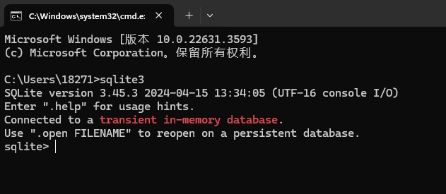

[toc]

# SQLite笔记1

当前日期为2024-05-16。当前SQLite的版本为3.45.3

## SQLite介绍

SQLite是一个实现了自给自足的、无服务器的、零配置的、事务性的 SQL 数据库引擎。

SQLite是一个零配置的数据库，这意味着与其他数据库不一样，您不需要在系统中配置。

> 为什么要用 SQLite？
- SQLite是无服务器的、零配置的，即不需要一个单独的服务器，不需要安装或管理。
- SQLite 是自给自足的，这意味着不需要任何外部的依赖。
- SQLite 是非常小的，是轻量级的，完全配置时小于 400KiB。一个完整的 SQLite 数据库就是存储在一个单一的跨平台的磁盘文件。
- SQLite 事务是完全兼容 ACID 的，允许从多个进程或线程安全访问。

[SQLite官网地址：https://www.sqlite.org/index.html](https://www.sqlite.org/index.html)

## SQLite安装

> 在 Windows 上安装 SQLite

1. 先在SQLite官网下载SQLite相关文件。如sqlite-tools-win32-*.zip 和 sqlite-dll-win32-*.zip 压缩文件。
2. 然后可以在桌面创建文件夹 sqlite3 , 在该文件夹中解压上面两个下载文件。将得到 sqlite3.def、sqlite3.dll 和 sqlite3.exe 等文件。
3. 然后把sqlite3文件夹的路径 `C:\Users\18271\Desktop\sqlite3`，添加到windows系统的环境变量中。
4. 最后在windows的终端中，使用 sqlite3 命令，将显示如下结果。



## SQLite 点命令

之前我们可以在windows终端中输入sqlite3 命令，从而进入到sqlite 终端中。

现在在sqlite 终端中，我们可以使用sqlite提供的命令，来对sqlite进行各种操作。这些命令称为 SQLite 的点命令，因为这些命令的不同之处在于它们不以分号 ; 结束。

sqlite中一些常用的点命令如下所示
```bash
.help	            # 显示帮助消息。
.databases	        # 列出数据库的名称及其所依附的文件。
.tables             # 列出表
.echo ON|OFF	    # 开启或关闭 echo 命令。
.exit	            # 退出 SQLite 终端
.quit	            # 退出 SQLite 提示符。
.explain ON|OFF	    # 开启或关闭适合于 EXPLAIN 的输出模式。如果没有带参数，则为 EXPLAIN on，即开启 EXPLAIN。
.show	            # 显示各种设置的当前值。
.stats ON|OFF	    # 开启或关闭统计。
.schema table_name  # 显示表 CREATE 语句


.import FILE TABLE	# 导入来自 FILE 文件的数据到 TABLE 表中。
.log FILE|off	    # 开启或关闭日志。FILE 文件可以是 stderr（标准错误）/stdout（标准输出）。

# 设置输出模式，MODE 可以是下列之一：
# csv 逗号分隔的值
# column 左对齐的列
# html HTML 的 <table> 代码
# insert TABLE 表的 SQL 插入（insert）语句
# line 每行一个值
# list 由 .separator 字符串分隔的值
# tabs 由 Tab 分隔的值
# tcl TCL 列表元素
.mode MODE

.output FILENAME	# 发送输出到 FILENAME 文件。
.output stdout	    # 发送输出到屏幕。

```


## SQLite 数据类型

在 SQLite 中，值的数据类型与值本身是相关的，而不是与它的容器相关。相比其他数据库的数据类型，SQLite的数据类型更为动态。

SQLite有如下的5种数据类型。
```
NULL	    值是一个 NULL 值。
INTEGER	    值是一个带符号的整数，根据值的大小存储在 1、2、3、4、6 或 8 字节中。
REAL	    值是一个浮点值，存储为 8 字节的 IEEE 浮点数字。
TEXT	    值是一个文本字符串，使用数据库编码（UTF-8、UTF-16BE 或 UTF-16LE）存储。
BLOB	    值是一个 blob 数据，完全根据它的输入存储。
```

SQLite的数据类型相比其他数据库的数据类型更加动态。SQLite的一种数据类型相当于其他数据库的多种数据类型。 例如 INTEGER 数据类型，代表整数。可以包含6 种不同的不同长度的整数数据类型。


下面是其他数据库的数据类型 和 SQLite数据类型的对比。
```bash
# 其他数据库的多个整数数据类型，相当于SQLite的一种整数数据类型
INT                     vs      INTEGER
INTEGER
TINYINT
SMALLINT
MEDIUMINT
BIGINT

# 文本字符串数据类型对比
CHARACTER(20)           vs      TEXT
VARCHAR(255)
VARYING CHARACTER(255)
NCHAR(55)
TEXT

# 浮点数类型对比
REAL                 vs      REAL
DOUBLE
FLOAT

```


> Boolean 数据类型

SQLite 没有单独的 Boolean 数据类型。布尔值会被存储为整数 0（false）和 1（true）。

> Date 与 Time 数据类型

SQLite 没有一个单独的用于存储日期和/或时间的存储类，但 SQLite 能够把日期和时间设置为 TEXT、REAL 或 INTEGER 数据类型。

```
若TEXT数据类型 存储日期时间数据，则数据格式会为"YYYY-MM-DD HH:MM:SS.SSS"
若REAL数据类型 存储日期时间数据，则数据会是从公元前 4714 年 11 月 24 日格林尼治时间的正午开始算起的天数。
若INTEGER数据类型 存储日期时间数据，则数据会是从 1970-01-01 00:00:00 UTC 算起的秒数。
```

## 数据库

### 创建数据库

在SQLite中，我们可以使用 sqlite3 命令来用来创建新的 SQLite 数据库文件。

语法如下
```sql
# 在当前目录下创建一个db文件
sqlite3 DatabaseName.db
```

例子
```bash
# 此处是windows系统终端。在桌面创建一个test1.db的文件
C:\Users\18271\Desktop> sqlite3 test1.db
SQLite version 3.45.3 2024-04-15 13:34:05 (UTF-16 console I/O)
Enter ".help" for usage hints.

# 然后在sqlite终端中通过点命名 .databases 查看db文件的信息
sqlite> .databases
# 显示test1.db文件里有一个数据库，名称为main,拥有读写权限
main: C:\Users\18271\Desktop\test1.db r/w
```

总结：在SQLite中，我们创建数据库，需要先创建一个载体，即db文件。这个db文件里面包含了所有的数据，包含数据库，表，表中数据，配置数据等。并且默认的数据库名称就是main。


### 附加数据库

通常情况下,我们创建的db文件中，都会包含一个默认的数据库，该数据库名称为main。

但是如果我们想在一个db文件中创建多个数据库，我们可以通过 SQLite 的 ATTACH DATABASE 语句来创建一个附加数据库。

> 什么是附加数据库?

db文件中的main数据库就是主数据库，除了主数据库之外的数据库都是附加数据库。


> 语法

SQLite 的 ATTACH DATABASE 语句的基本语法如下

```sql
# 创建一个db文件，如果db文件已存在，则把db文件名称与附加数据库 'attach_database_name' 绑定在一起。
ATTACH DATABASE db_file_name AS attach_database_name;
```

> 例子

```bash
# 在sqlite终端中使用 ATTACH DATABASE 语句
sqlite> ATTACH DATABASE 'test1.db' as 'demo';
# 点命名 .databases 查看db文件的信息
sqlite> .databases
main: C:\Users\18271\Desktop\test1.db r/w
demo: C:\Users\18271\Desktop\test1.db r/w
```

可以看到test1.db文件中除了main主数据库之外，还多了一个附加数据库demo。


## 表

### 创建表

SQLite 的 CREATE TABLE 语句用于在任何给定的数据库创建一个新表。

CREATE TABLE 语句的基本语法如下
```sql
CREATE TABLE table_name(
   column1 datatype PRIMARY KEY,
   column2 datatype,
   column3 datatype,
   .....
   columnN datatype,
);

```

> 例子

```bash
# 先与test1.db文件建立链接，从而进入到sqlite终端中
C:\Users\18271\Desktop> sqlite3 test1.db
SQLite version 3.45.3 2024-04-15 13:34:05 (UTF-16 console I/O)
Enter ".help" for usage hints.

# 此处是sqlite终端,创建t_user表
sqlite> CREATE TABLE t_user(
   id             INT     PRIMARY KEY     NOT NULL,
   name           TEXT    NOT NULL,
   age            INT     NOT NULL,
   address        CHAR(50)
);

# 通过点命名.tables 显示数据库中的表
sqlite> .tables
t_user

# 通过点命名.schema 显示t_user表的create语句
sqlite> .schema t_user
CREATE TABLE t_user(
   id             INT     PRIMARY KEY     NOT NULL,
   name           TEXT    NOT NULL,
   age            INT     NOT NULL,
   address        CHAR(50)
);
```

### 删除表

可以使用 SQLite 的 DROP TABLE 语句用来删除表定义及其所有相关数据。

DROP TABLE 语句语法如下
```sql
# 语法1：直接删除db文件中的某个表
DROP TABLE database_name.table_name;

# 语法2: 删除某个表，这种方式需要先进入到db文件中
DROP TABLE table_name;
```

> 例子

```bash
# 先与test1.db文件建立链接
C:\Users\18271\Desktop> sqlite3 test1.db
# 先查询文件中有那些表
sqlite> .tables
t_user
# 删除文件中的t_user表
sqlite> DROP TABLE t_user;
```


## 表中数据

### insert 语句

SQLite 的 INSERT INTO 语句用于向数据库的某个表中添加新的数据行。

INSERT INTO 语句如下所示
```sql
# 语法1 向表中所有列进行赋值
INSERT INTO TABLE_NAME VALUES ( value1,value2,value3,...valueN );

# 语法2 向表中指定列进行赋值
INSERT INTO TABLE_NAME [( column1, column2, column3,...columnN )]  VALUES (value1, value2, value3,...valueN);

```

> 例子

```bash
# 使用insert语句向表中插入两条记录
sqlite> INSERT INTO t_user VALUES ( 1, 'bob', 11, 'beijing' );
sqlite> INSERT INTO t_user (id,name,age,address) VALUES ( 2, 'Paul', 32, 'beijing' );
```

### select 语句

SELECT 语句用于从 SQLite 数据库表中获取数据，以结果集的形式返回数据。

SELECT 语句语法如下
```sql
# 语法1 从表中获取所有数据的所有列信息
SELECT * FROM table_name;

# 语法2 从表中获取所有数据的指定列信息
SELECT column1, column2, columnN FROM table_name;
```

> 例子

```bash
# 前两个命令被用来设置正确格式化的输出方式。
sqlite>.header on
sqlite>.mode column
# 获取表中所有记录数据
sqlite> SELECT * FROM t_user;
id  name  age  address
--  ----  ---  -------
1   bob   11   beijing
2   Paul  32   beijing
```

### where 语句

WHERE 子句用于对一个表或多个表的数据进行条件筛选。

WHERE 子句语法如下
```sql
## 从表中获取指定条件的记录数据
SELECT column1, column2, columnN FROM table_name WHERE [condition]

```

> 例子

```bash
# 获取age在 25-50 之间的记录
sqlite> SELECT * FROM t_user WHERE AGE >= 25 AND AGE <= 50;

# 获取name不为null的记录,并且记录只包含name和age列
sqlite> SELECT name,age FROM t_user WHERE name IS NOT NULL;

```


### update 语句

UPDATE 语句用于修改表中已有的记录。可以使用带有 WHERE 子句的 UPDATE 语句来更新选定行记录，否则所有的行记录都会被更新。

update 语句语法如下
```sql
## 更新指定条件的行记录中的某些列的数据
UPDATE table_name SET column1 = value1, column2 = value2...., columnN = valueN WHERE [condition];

```

> 例子

```bash
# 如果您想修改 t_user 表中 所有行记录中的 address ，则不需要使用 WHERE 子句
sqlite> UPDATE t_user SET address = 'Texas';

# 它会更新 ID 为 6 的行记录的地址为Texas
sqlite> UPDATE t_user SET address = 'Texas' WHERE id = 6;

```


### delete 语句

DELETE 语句用于删除表中已有的行记录。可以使用带有 WHERE 子句的 DELETE 语句来删除选定行记录，否则所有的记录都会被删除。

delete 语句语法如下
```sql
# 删除表中指定条的行记录
DELETE FROM table_name WHERE [condition];
```

> 例子

```bash
# 删除 ID 为 7 的行记录
sqlite> DELETE FROM t_user WHERE ID = 7;

# 删除 t_user表 所有的行记录
sqlite> DELETE FROM t_user;
```

### like 子句

like 子句主要是通过通配符来匹配文本值。like 子句通常会与 where 语句搭配使用。

> like 子句语法如下
```sql
# 从表中查询出 column 字段的数据匹配文本的行记录
SELECT column_list  FROM table_name WHERE column LIKE 通配符表达式
```

> like 子句使用的通配符如下：
- 百分号 （%） ：代表零个、一个或多个数字或字符。
- 下划线 （_） ：代表一个单一的数字或字符。


> 通配符具体用法如下
```bash
WHERE SALARY LIKE '200%'	#查找以 200 开头的任意值
WHERE SALARY LIKE '%200%'	#查找任意位置包含 200 的任意值
WHERE SALARY LIKE '_00%'	#查找第二位和第三位为 00 的任意值
WHERE SALARY LIKE '2_%_%'	#查找以 2 开头，且长度至少为 3 个字符的任意值
WHERE SALARY LIKE '%2'	    #查找以 2 结尾的任意值
WHERE SALARY LIKE '_2%3'	#查找第二位为 2，且以 3 结尾的任意值
WHERE SALARY LIKE '2___3'	#查找长度为 5 位数，且以 2 开头以 3 结尾的任意值
```


> 例子

```bash
# 查询表中 AGE 以 2 开头的所有记录：
sqlite> SELECT * FROM t_user WHERE age LIKE '2%';
# 查询表中 address 中包含一个连字符（-）的所有记录
sqlite> SELECT * FROM t_user WHERE address  LIKE '%-%';

```


### glob 子句

glob 子句也是用来匹配通配符指定模式的文本值。glob 子句 与 like 子句的功能相同，但是glob 子句是大小写敏感的。

> glob 子句语法如下
```sql
# 从表中查询出 column 字段的数据匹配文本的行记录
SELECT column_list  FROM table_name WHERE column GLOB 通配符表达式
```

> glob 子句使用的通配符如下：
- *：匹配零个、一个或多个数字或字符。
- ?：代表一个单一的数字或字符。
- `[...]`：匹配方括号内指定的字符之一。例如，[abc] 匹配 "a"、"b" 或 "c" 中的任何一个字符。
- `[^...]`：匹配不在方括号内指定的字符之一。例如，[^abc] 匹配不是 "a"、"b" 或 "c" 中的任何一个字符的字符。

> 通配符具体用法如下
```bash
WHERE SALARY GLOB '200*'	# 查找以 200 开头的任意值
WHERE SALARY GLOB '*200*'	# 查找任意位置包含 200 的任意值
WHERE SALARY GLOB '?00*'	# 查找第二位和第三位为 00 的任意值
WHERE SALARY GLOB '2??'	    # 查找以 2 开头，且长度为 3 个字符的任意值，例如，它可能匹配 "200"、"2A1"、"2B2" 等值。
WHERE SALARY GLOB '*2'	    # 查找以 2 结尾的任意值
WHERE SALARY GLOB '?2*3'	# 查找第二位为 2，且以 3 结尾的任意值
WHERE SALARY GLOB '2???3'	# 查找长度为 5 位数，且以 2 开头以 3 结尾的任意值
```


> 例子

```bash
# 查询表中 AGE 以 2 开头的所有记录：
sqlite> SELECT * FROM t_user WHERE age GLOB '2*';
# 查询表中 address 中包含一个连字符（-）的所有记录
sqlite> SELECT * FROM t_user WHERE address  GLOB '*-*';


sqlite> SELECT * FROM products WHERE product_name LIKE '[AB]%';

```


