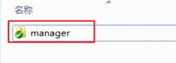
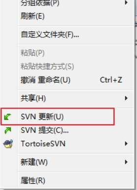
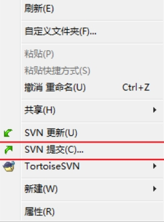

[toc]

# SVN笔记

## SVN 安装

安装过程，自行百度

## SVN 操作

SVN有三大指令: 
- checkout 检出
- update 更新
- commit 提交

### checkout 检出操作

我们第一次需要从SVN服务器上下载项目文件到本地。此时需要进行checkout 检出操作。

它有如下两个作用:
1. 链接本机到SVN服务器
2. 从SVN服务器上下载数据到本机。

注意:checkout 检出操作只在第一次下载文件的时候操作一次,以后如果需要从SVN服务器上进行文件同步更新操作,请使用 update 指令。

当checkout 检出操作成功之后,我们会发现下载的文件夹上有一个绿色的小勾.表示该文件夹现在与SVN服务器已同步。

### update 更新操作 

作用是从SVN服务器上下载最新的文件到本地目录中。从而让本地项目的版本与SVN服务器的版本同步。

右键项目，选择SVN更新即可。

### commit 提交操作

作用是把本地目录中修改过文件，提交到SVN服务器中。从而更新SVN服务器中对应的文件数据。

其他人也可以通过update操作，来下载你的修改。
