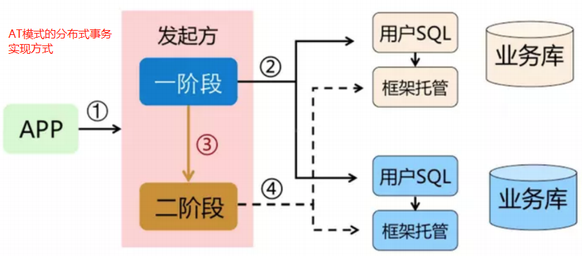
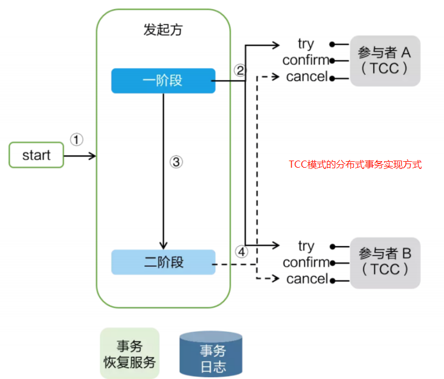

[toc]

# 微服务分布式事务组件Seata，版本1.5.1


下图为微服务架构图


目前SpringCloudAlibaba中各个组件的版本搭配

|  Spring Cloud Alibaba Version | Sentinel Version | Nacos Version | RocketMQ Version | Dubbo Version | Seata Version | 
|  ----  | ----  | ----  | ----  | ----  | ----  |
| 2.2.8.RELEASE  | 1.8.4 | 2.1.0 | 4.9.3 | ~ | 1.5.1 |


## 1.事务简介

### 事务的ACID特性

事务是访问并可能更新数据库中各种数据项的一个程序执行单元。在关系数据库中，一个事务由一组SQL语句组成。事务应该具有4个属性：原子性、一致性、隔离性、持久性。这四个属性通常称为ACID特性。

*  原子性（atomicity）：单个事务是一个不可分割的工作单位，事务中包括的诸操作要么都做，要么都不做。
*  一致性（consistency）：事务必须是使数据库从一个一致性状态变到另一个一致性状态，事务的中间状态不能被观察到的。
*  隔离性（isolation）：一个事务的执行不能被其他事务干扰。即一个事务内部的操作及使用的数据对并发的其他事务是隔离的，并发执行的各个事务之间不能互相干扰。隔离性又分为四个级别：读未提交(read uncommitted)、读已提交(read committed，解决脏读)、可重复读(repeatable read，解决虚读)、串行化(serializable，解决幻读)。
* 持久性（durability）：持久性也称永久性（permanence），指一个事务一旦提交，它对数据库中数据的改变就应该是永久性的。接下来的其他操作或故障不应该对其有任何影响。

### 事务的分类

* 本地事务：
    单一服务访问单一数据库。这种情况下的事务就是本地事务。本地事务的ACID特性是数据库直接提供支持。


<font color="red">在spirng中对服务实现类添加@Transational注解，会使该服务得到事务管理功能</font>

* 分布式事务:
    由于微服务的发展,完成某一个业务功能可能需要横跨多个服务，操作多个数据库,这就涉及到到了分布式事务。分布式事务需要保证对于多个服务器的多个数据库的操作，要么全部成功，要么全部失败。

### 分布式事务使用场景

1. 跨库事务: 跨库事务指的是一个应用中的某个功能需要操作多个库，不同的库中存储不同的业务数据。


2. 分库分表: 通常一个库数据量比较大或者预期未来的数据量比较大的时候，都会进行水平拆分，也就是分库分表。若对于sql：insert into user(id,name) values (1,"张三"),(2,"李四")。这条sql是操作单库的语法，单库情况下，可以保证事务的一致性.但是对于分库分表的情况，若希望将1号记录插入分库1，2号记录插入分库2。则要分别插入两个不同的分库，此时要保证两个数据库要不都成功，要不都失败，因此分库分表的情况下通常都会面临着分布式事务的问题。


3. 微服务情况: 若Service A完成某个功能需要直接操作数据库，同时需要调用Service B和Service C，而Service B又同时操作了2个数据库，Service C也操作了一个库。需要保证这些跨服务的对多个数据库的操作要不都成功，要不都失败.


### 分布式事务理论基础

解决分布式事务有相应的规范和协议。解决分布式事务相关的协议有2PC、3PC。由于三阶段提交协议3PC非常难实现，目前主流的分布式事务解决方案都是2PC协议.

* 2PC两阶段提交协议: 
    阶段1(Prepare预处理阶段)：提交事务请求
    阶段2(Commit提交阶段)：执行事务提交。分为两种情况，正常提交和回退。

协调者:相当于分布式事务管理器,用于管理多个事务.
参与者:可以是数据库,也可以是单个服务.


阶段1:
1. 协调者向所有参与者发送事务请求，询问是否可执行事务操作，然后等待各个参与者的响应。
2. 各个参与者接收到协调者事务请求后，执行事务操作(例如更新一个关系型数据库表中的记录)，并将Undo 和 Redo 信息记录事务日志中。
3. 如果参与者成功执行了事务并写入 Undo 和 Redo 信息，则向协调者返回 YES 响应，否则返回 NO 响应。当然，参与者也可能宕机，从而不会返回响应。

<font color="red">注意:在阶段1过程中,如果某些参与者执行事务失败等原因.导致协调者就无法收到所有参与者的YES响应，或者某个参与者返回了No响应，此时协调者就会进入回退流程，对事务进行回退(将Commit请求替换为红色的Rollback请求)。如下下图 </font>


阶段2(正常情况下)
1. 协调者向所有参与者发送 Commit 请求。
2. 参与者收到 Commit 请求后，执行事务提交，提交完成后释放事务执行期占用的所有资源。
3. 参与者执行事务提交后向协调者发送 Ack 响应。
4. 接收到所有参与者的 Ack 响应后，完成事务提交。


中断事务并回退:
1. 协调者向所有参与者发送 Rollback 请求。
2. 参与者收到 Rollback 后，使用 Prepare 阶段1的 Undo 日志执行事务回滚，完成后释放事务执行期占用的所有资源。
3. 参与者执行事务回滚后向协调者发送 Ack 响应。
4. 接收到所有参与者的 Ack 响应后，完成事务中断。

> 2PC协议的问题:
①: 若参与者与协调者之间网络异常导致参与者一直收不到协调者信息，那么会导致参与者一直阻塞下去。
②: 如果协调者宕机，那么就会使参与者一直阻塞并一直占用事务资源。
③: 如果协调者是分布式，那么在一个协调者挂掉后，可以选取另一个协调者继续后续的服务。但是，新协调者无法知道上一个事务的全部状态信息(例如已等待 Prepare 响应的时长等)，所以也无法顺利处理上一个事务。
④: 阶段2过程中 Commit 请求/Rollback 请求可能因为协调者宕机或协调者与参与者网络问题丢失，导致部分参与者没有收到 Commit/Rollback 请求，而其他参与者则正常收到执行了 Commit/Rollback 操作，没有收到请求的参与者则继续阻塞。这时，参与者之间的数据就不再一致了。

### 常见分布式事务解决方案

分布式事务的解决方案有4种:
①seata阿里分布式事务框架
②消息队列
③saga
④XA

实际上，这四种分布式事务解决方案，分别对应着分布式事务的四种模式：AT、TCC、Saga、XA；<font color="red">这四种模式都是在2PC协议上形成的。</font>


## 2. 4种模式（AT、TCC、Saga、XA）的分布式事务实现

### AT模式(auto transcation)

阿里seata分布式事务框架实现了AT模式。在AT模式下，用户只需关注自己的“业务 SQL”，用户的 “业务 SQL” 作为一阶段，Seata 框架会自动生成事务的二阶段提交和回滚操作。



一阶段：
    在一阶段，Seata 会拦截“业务 SQL”，首先解析 SQL 语义，找到“业务 SQL”要更新的业务数据，在业务数据被更新前，将其保存成“before image（before快照）”，然后执行“业务 SQL”更新业务数据，在业务数据更新之后，再将其保存成“after image（after快照）”，最后生成行锁。以上操作全部在一个数据库事务内完成，这样保证了一阶段操作的原子性。


二阶段提交的情况：
    二阶段如果是提交的话，因为“业务 SQL”在一阶段已经提交至数据库， 所以 Seata 框架只需将一阶段保存的快照数据和行锁删掉，完成数据清理即可。


二阶段回滚的情况：
    二阶段如果是回滚的话，Seata 就需要回滚一阶段已经执行的“业务 SQL”，还原业务数据。回滚方式便是用“before image”还原业务数据；但在还原前要首先要校验脏写，对比“数据库当前业务数据”和 “after image”，如果两份数据完全一致就说明没有脏写，可以还原业务数据，如果不一致就说明有脏写，出现脏写就需要转人工处理。


<font color="red">AT 模式的一阶段、二阶段提交和回滚均由 Seata 框架自动生成，用户只需编写“业务 SQL”，便能轻松接入分布式事务，AT 模式是一种对业务无任何侵入的分布式事务解决方案。</font>


### TCC模式(Try、Confirm 和 Cancel)

TCC 模式需要用户根据自己的业务场景实现 Try、Confirm 和 Cancel 三个操作；事务发起方在一阶段执行 Try 方式，在二阶段提交执行 Confirm 方法，二阶段回滚执行 Cancel 方法。

TCC 模式：
    优点：在整个分布式事务的过程中基本没有锁，性能更强。
    缺点：侵入性比较强， 并且得自己实现相关事务控制逻辑。



Try：用来进行资源的检测和预留；
Confirm：执行的业务操作提交；要求 Try 成功 Confirm 一定要能成功；
Cancel：预留资源释放

### Saga模式

在 Saga 模式下，分布式事务内有多个参与者，每一个参与者都有一个对应的冲正补偿服务，需要用户根据业务场景实现其正向操作和逆向回滚操作。<font color="red">Saga正向服务与补偿服务需要业务开发者实现。因此是业务入侵的。</font>


上图T1-T3都是正向的业务流程，都对应着一个冲正逆向操作C1-C3。若在分布式事务执行过程中，依次执行各参与者的正向操作，如果所有正向操作均执行成功，那么分布式事务提交。如果任何一个正向操作执行失败，那么分布式事务会退回去执行前面参与者的逆向回滚操作，回滚已提交的参与者，使分布式事务回到初始状态。

Saga模式的优点是：
1. 一阶段提交本地数据库事务，无锁，高性能；
2. 参与者可以采用事务驱动异步执行，高吞吐；
3. 补偿服务即正向服务的“反向”，易于理解，易于实现；

Saga模式的缺点是：
由于一阶段已经提交本地数据库事务，且没有进行“预留”动作，所以不能保证隔离性。需要专门对隔离性采取额外应对措施。

### XA模式

XA模式缺点：事务粒度大。高并发下，系统可用性低。因此很少使用。

### 4种分布式事务模式的使用场景和分析

* AT 模式是无侵入的分布式事务解决方案，适用于不希望对业务进行改造的场景，几乎0学习成本。
* TCC 模式是高性能分布式事务解决方案，适用于核心系统等对性能有很高要求的场景。
* Saga 模式是长事务解决方案，适用于业务流程长且需要保证事务最终一致性的业务系统。
* XA模式是分布式强一致性的解决方案，但性能低而使用较少

<font color="red">总结：在微服务开发过程中，分布式事务会大大的提高流程的复杂度，会带来很多额外的开销工作，因此能不使用分布式事务就不使用。</font>


## 3. 分布式事务组件Seata介绍

Seata是一款开源的分布式事务解决方案，致力于提供高性能和简单易用的分布式事务服务。Seata将为用户提供了 AT、TCC、SAGA 和 XA 事务模式，为用户打造一站式的分布式解决方案。AT模式是阿里首推的模式。


> 在 Seata 的架构中，一共有三个角色：

* TC (Transaction Coordinator) - 事务协调者
    维护全局和分支事务的状态，驱动全局事务提交或回滚。

* TM (Transaction Manager) - 事务管理器
    定义全局事务的范围：开始全局事务、提交或回滚全局事务。

* RM (Resource Manager) - 资源管理器
    管理分支事务处理的资源，与TC交谈以注册分支事务和报告分支事务的状态，并驱动分支事务提交或回滚。

<font color="red">其中TC为单独部署的Server服务端，TM和RM为嵌入到应用中的Client客户端。</font>

## 4. 分布式事务组件Seata的使用,当前Seata版本为1.5.1


### Seata服务端（TC角色）部署

①下载安装包，注意Seata的版本要与SpringCloudAlibaba的版本搭配

下载地址：https://github.com/seata/seata/releases

② Seata服务端存储模式（store.mode）支持三种
* file：(默认单机模式)本地文件模式，全局事务会话信息内存中读写并持久化本地文件/bin/sessionStore/root.data，性能较高。
* db：数据库模式（可为集群模式），全局事务会话信息通过db共享，性能差些。（mysql数据库仅支持5.7+版本）
* redis： redis模式，性能较高,存在事务信息丢失风险,需要提前配置redis持久化配置。

③ 运行/bin/seata-server.bat,启动Seata服务端。

<font color="red">file模式下可以直接启动，无须数据源配置。</font>

④ 访问seata服务端界面。localhost:7091/#/login。账号密码都是seata


#### 配置Seata服务端存储模式为db

1. 修改Seata服务端配置文件/conf/application.yml,修改为store.mode="db"
2. 将application.example.yml中的数据库db配置信息，复制到application.yml中,修改store.db相关属性。

```yml
seata:
  config:
    type: file
  registry:
    type: file
  store:
    mode: db  ## 模式改为db
    #### 从application.example.yml中复制数据库连接信息到application.yml的
    db:
      datasource: druid
      db-type: mysql
      driver-class-name: com.mysql.jdbc.Driver
      url: jdbc:mysql://127.0.0.1:3306/seata-mysql?rewriteBatchedStatements=true
      user: root
      password: root
      min-conn: 5
      max-conn: 100
      global-table: global_table
      branch-table: branch_table
      lock-table: lock_table
      distributed-lock-table: distributed_lock
      query-limit: 100
      max-wait: 5000
```
3. 在数据库中创建表

Seata建表脚本地址：https://github.com/seata/seata/blob/1.5.0/script/server/db/mysql.sql

创建对应数据库，执行下面脚本建表。数据库名称为上面配置文件中的url名称，即seata-mysql

```sql
-- -------------------------------- The script used when storeMode is 'db' --------------------------------
-- the table to store GlobalSession data
CREATE TABLE IF NOT EXISTS `global_table`
(
    `xid`                       VARCHAR(128) NOT NULL,
    `transaction_id`            BIGINT,
    `status`                    TINYINT      NOT NULL,
    `application_id`            VARCHAR(32),
    `transaction_service_group` VARCHAR(32),
    `transaction_name`          VARCHAR(128),
    `timeout`                   INT,
    `begin_time`                BIGINT,
    `application_data`          VARCHAR(2000),
    `gmt_create`                DATETIME,
    `gmt_modified`              DATETIME,
    PRIMARY KEY (`xid`),
    KEY `idx_status_gmt_modified` (`status` , `gmt_modified`),
    KEY `idx_transaction_id` (`transaction_id`)
) ENGINE = InnoDB
  DEFAULT CHARSET = utf8mb4;

-- the table to store BranchSession data
CREATE TABLE IF NOT EXISTS `branch_table`
(
    `branch_id`         BIGINT       NOT NULL,
    `xid`               VARCHAR(128) NOT NULL,
    `transaction_id`    BIGINT,
    `resource_group_id` VARCHAR(32),
    `resource_id`       VARCHAR(256),
    `branch_type`       VARCHAR(8),
    `status`            TINYINT,
    `client_id`         VARCHAR(64),
    `application_data`  VARCHAR(2000),
    `gmt_create`        DATETIME(6),
    `gmt_modified`      DATETIME(6),
    PRIMARY KEY (`branch_id`),
    KEY `idx_xid` (`xid`)
) ENGINE = InnoDB
  DEFAULT CHARSET = utf8mb4;

-- the table to store lock data
CREATE TABLE IF NOT EXISTS `lock_table`
(
    `row_key`        VARCHAR(128) NOT NULL,
    `xid`            VARCHAR(128),
    `transaction_id` BIGINT,
    `branch_id`      BIGINT       NOT NULL,
    `resource_id`    VARCHAR(256),
    `table_name`     VARCHAR(32),
    `pk`             VARCHAR(36),
    `status`         TINYINT      NOT NULL DEFAULT '0' COMMENT '0:locked ,1:rollbacking',
    `gmt_create`     DATETIME,
    `gmt_modified`   DATETIME,
    PRIMARY KEY (`row_key`),
    KEY `idx_status` (`status`),
    KEY `idx_branch_id` (`branch_id`),
    KEY `idx_xid_and_branch_id` (`xid` , `branch_id`)
) ENGINE = InnoDB
  DEFAULT CHARSET = utf8mb4;

CREATE TABLE IF NOT EXISTS `distributed_lock`
(
    `lock_key`       CHAR(20) NOT NULL,
    `lock_value`     VARCHAR(20) NOT NULL,
    `expire`         BIGINT,
    primary key (`lock_key`)
) ENGINE = InnoDB
  DEFAULT CHARSET = utf8mb4;

INSERT INTO `distributed_lock` (lock_key, lock_value, expire) VALUES ('AsyncCommitting', ' ', 0);
INSERT INTO `distributed_lock` (lock_key, lock_value, expire) VALUES ('RetryCommitting', ' ', 0);
INSERT INTO `distributed_lock` (lock_key, lock_value, expire) VALUES ('RetryRollbacking', ' ', 0);
INSERT INTO `distributed_lock` (lock_key, lock_value, expire) VALUES ('TxTimeoutCheck', ' ', 0);
```

#### 配置Seata服务端，注入到nacos注册中心

从application.example.yml中复制注册中心连接信息到application.yml中。编辑registry.type属性和registry.nacos属性。

```yml
seata:
  registry:
    type: nacos   ### 设置注册中心为nacos
    preferred-networks: 30.240.*
    nacos:
      application: seata-server     ### seata服务名称
      server-addr: 127.0.0.1:7070   ### nacos注册中心地址
      group: SEATA_GROUP
      namespace:
      cluster: default              ### nacos注册中心默认为集群模式
      username: nacos               ### nacos账户
      password: nacos               ### nacos密码
```


#### 配置Seata服务端连接nacos配置中心，读取配置中心数据

① 从application.example.yml中复制配置中心连接信息到application.yml中。编辑registry.type属性和registry.nacos属性。

```yml
seata:
  config:
    type: nacos  ##设置nacos为配置中心
    nacos:
      server-addr: 127.0.0.1:7070       ##配置中心地址
      namespace:
      group: SEATA_GROUP             
      username: nacos                   ### nacos账户
      password: nacos                   ### nacos密码
      data-id: seataServer.properties   ### 配置文件的名称
```

② 在nacos配置中心中创建对应的配置文件。可以把seata的存储模式等相关配置放在nacos配置中心中编辑，然后由seata来读取。


#### 解决Seata服务端启动seata-server.bat闪退

当Seata服务端启动失败后，windows命令窗口会闪退，导致无法看到失败原因。

解放方式：编辑seata-server.bat

```
cmd    # 在最后一行前加上这段代码，防止闪退。
exit /B %ERROR_CODE%
```

### Seata客户端部署

暂无