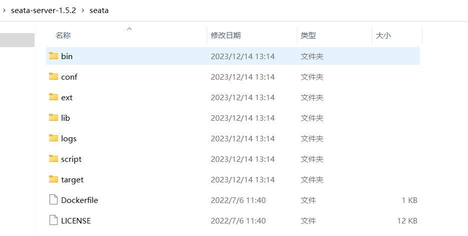

[toc]

# 微服务分布式事务组件Seata

Seata是分布式事务的当前解决方案。当前Seata版本为1.5.1

下图为微服务架构图


目前SpringCloudAlibaba中各个组件的版本搭配

|  Spring Cloud Alibaba Version | Sentinel Version | Nacos Version | RocketMQ Version | Dubbo Version | Seata Version | 
|  ----  | ----  | ----  | ----  | ----  | ----  |
| 2.2.8.RELEASE  | 1.8.4 | 2.1.0 | 4.9.3 | ~ | 1.5.1 |


## 分布式事务

### 事务的分类

事务本质上就是一组逻辑操作。事务的原子性要求事务内的所有逻辑操作要么全部完成，要么全部失败。

事务主要分为本地事务和分布式事务两种。

> 本地事务

本地事务一般是指服务自身的逻辑操作。并且只涉及到一个服务，一个数据库。

本地事务的ACID特性是由数据库直接提供支持。


> 分布式事务

分布式事务一般是指多个服务共同组成的逻辑操作。并且会涉及到多个服务，多个数据库。

简而言之，分布式事务可以理解为多个本地事务组合为一个大事务。


由于分布式事务涉及到多个数据库，那么分布式事务的ACID特性就无法单纯由数据库的事务机制来提供了。

### 分布式事务的问题

由于分布式事务是由多个本地事务组成的。而每个本地事务都有自己的业务逻辑操作和数据库操作。

当分布式事务中的某个操作失败了，那么为了保证分布式事务的原子性，分布式事务中的其他读写操作也要进行失败处理。只有当分布式事务中的所有操作都成功了，那么这个分布式事务才算成功。

即分布式事务中的所有操作，要么全部成功，要么全部失败。

### 分布式事务的使用场景

通常情况下，事务的ACID特性都是由数据库来实现。例如Spring事务的底层就是调用各个数据库的事务实现的。

由于分布式事务涉及到多个服务，多个数据库。那么分布式事务的ACID特性就无法单纯由数据库的事务来提供了。

分布式事务的使用场景如下：
1. 跨库事务: 跨库事务指的是一个业务功能需要操作多个数据库。这种情况下会面临着分布式事务的问题。


2. 分库分表: 当数据库分库分表之后，一个业务功能也会涉及到操作多个数据库的情况。此时要保证多个数据库的操作要么都成功，要么都失败，因此分库分表的情况下也会面临着分布式事务的问题。


3. 微服务: 在微服务架构下，一个业务功需要调用多个服务，多个数据库。那么也会面临着分布式事务的问题。


### 解决分布式事务问题的理论基础

由于分布式事务，涉及到多个事务，多个数据库。那么如何保证分布式事务中的操作要么全部完成，要么全部失败。

目前解决分布式事务问题的理论基础，有2PC和3PC协议。

#### 2PC协议

2PC协议，全称2阶段提交协议。2PC协议将分布式事务划分为2个阶段来完成。
 
> 阶段1(准备阶段):
1. 事务协调者向所有的事务参与者发送准备请求。
2. 各个参与者接收到准备请求后，执行各自的事务操作，但不提交事务。
3. 各个参与者将事务操作完成后，将操作结果告诉给事务协调者。
4. 事务协调者收到各个参与者的事务操作结果后。如果所有参与者的事务操作都完成了，那么进入到阶段2。否则就进入到回退阶段。


- 协调者:用于管理分布式事务中的所有事务.
- 参与者:可以是数据库,也可以是单个服务.

> 阶段1（准备阶段。错误情况下）

1. 如果在阶段1中，协调者没有收到所有参与者的成功响应。
2. 那么协调者会给所有参与者发送回退请求。让所有参与者进行回退操作。
3. 由于阶段1的参与者都没有事务提交，因此阶段1的参与者都可以进行事务回退操作。

> 阶段2(提交阶段。正常情况下)
1. 当阶段1完成后，即协调者收到所有参与者的成功响应后。开始进行阶段2。
2. 协调者会向所有参与者发送 Commit 提交请求。
3. 参与者收到 Commit 提交请求后，进行事务提交。事务提交完成后，释放事务占用的所有资源。
4. 参与者在事务提交完成之后向协调者发送成功响应。
5. 协调者接收到所有参与者的 YES 响应后，那么分布式事务就完成了。


> 阶段2(提交阶段。错误情况下)

中断事务并回退:
1. 当参与者的事务提交失败。会向协调者发送 NO 响应。
2. 当协调者收到参与者的 NO 响应后，表示有某个事务执行失败了。
3. 此时协调者会向所有参与者发送 Rollback 回退请求。
3. 参与者收到 Rollback 回退请求后，参与者会使用阶段1生成的 Undo 日志执行事务回滚，然后释放事务占用的所有资源。
4. 参与者执行完事务回滚后，向协调者发送 Ack 响应。
5. 协调者接收到所有参与者的 Ack 响应后，完成分布式事务的回退操作。


#### 2PC协议的问题

1. 若网络异常，导致参与者收不到协调者信息，那么参与者会一直阻塞下去。
2. 如果协调者宕机，那么参与者会一直阻塞下去。并一直占用资源。
3. 在阶段2中，如果网络异常，导致部分参与者没有收到协同者的 Commit/Rollback 请求，而其他参与者则正常收到 Commit/Rollback 操作。那么没有收到请求的参与者则继续阻塞。这时，参与者之间的数据就不再一致了。


## Seata介绍

Seata是一款阿里巴巴开源的分布式事务解决方案，致力于提供高性能和简单易用的分布式事务服务。

[Seata官网](https://seata.io/zh-cn/)

> 在 Seata 的架构中，有三个重要的角色。
- TC 事务协调者(Transaction Coordinator) ：用于维护全局和分支事务的状态，驱动全局事务提交或回滚。
- TM 事务管理器(Transaction Manager) ：用于定义全局事务的范围：开始全局事务、提交或回滚全局事务。
- RM 资源管理器(Resource Manager) ：用于管理分支事务处理的资源，与TC交谈以注册分支事务和报告分支事务的状态，并驱动分支事务提交或回滚。

<font color="red">其中TC为单独部署的Seata Server服务端，TM和RM为嵌入到服务应用中的Seata Client客户端。</font>


如图所示，三个角色在分布式事务中的作用。其中Business服务需要调用Stock服务，Order服务，Account服务。


##  Seata 服务端（TC角色）部署

① 先下载Seata 服务端的安装包，注意Seata的版本要与SpringCloudAlibaba的版本要搭配。

[下载地址 https://github.com/seata/seata/releases](https://github.com/seata/seata/releases)


Seata 服务端安装包目录


② Seata服务端有3种持久化模式（store.mode）

* file：(默认单机模式)本地文件模式，全局事务会话信息读写在内存中,并持久化到本地文件/bin/sessionStore/root.data，性能较高。
* db：数据库模式（集群模式），全局事务会话信息通过db共享，性能差些。（mysql数据库仅支持5.7+版本）
* redis：redis模式，性能较高,存在事务信息丢失风险,需要提前配置redis持久化配置。

③ 启动Seata服务端

- 如果是windows环境，则运行/bin/seata-server.bat
- 如果是linux环境，则运行/bin/seata-server.sh

④ 访问seata服务端界面。默认访问地址：localhost:7091/#/login。账号密码是seata/seata


#### 配置Seata服务端存持久化模式为db

1. 修改Seata服务端配置文件/conf/application.yml,修改为store.mode="db"
2. 将application.example.yml中的数据库db配置信息，复制到application.yml中,修改store.db相关属性。

```yml
seata:
  config:
    type: file
  registry:
    type: file
  store:
    mode: db  ## 模式改为db
    #### 下面是从application.example.yml中复制数据库连接信息到application.yml的
    db:
      datasource: druid
      db-type: mysql
      driver-class-name: com.mysql.jdbc.Driver
      url: jdbc:mysql://127.0.0.1:3306/seata-mysql?rewriteBatchedStatements=true
      user: root
      password: root
      min-conn: 5
      max-conn: 100
      global-table: global_table
      branch-table: branch_table
      lock-table: lock_table
      distributed-lock-table: distributed_lock
      query-limit: 100
      max-wait: 5000
```

3. 在数据库中创建库和表。

先创建数据库seata-mysql。然后创建相关表。然后创建表的脚本可通过下面的链接获取。

[Seata建表脚本链接：https://github.com/seata/seata/blob/1.5.0/script/server/db/mysql.sql](https://github.com/seata/seata/blob/1.5.0/script/server/db/mysql.sql)

具体的建表脚本。要注意版本，后续版本可能会变。
```sql
-- -------------------------------- The script used when storeMode is 'db' --------------------------------
-- the table to store GlobalSession data
CREATE TABLE IF NOT EXISTS `global_table`
(
    `xid`                       VARCHAR(128) NOT NULL,
    `transaction_id`            BIGINT,
    `status`                    TINYINT      NOT NULL,
    `application_id`            VARCHAR(32),
    `transaction_service_group` VARCHAR(32),
    `transaction_name`          VARCHAR(128),
    `timeout`                   INT,
    `begin_time`                BIGINT,
    `application_data`          VARCHAR(2000),
    `gmt_create`                DATETIME,
    `gmt_modified`              DATETIME,
    PRIMARY KEY (`xid`),
    KEY `idx_status_gmt_modified` (`status` , `gmt_modified`),
    KEY `idx_transaction_id` (`transaction_id`)
) ENGINE = InnoDB
  DEFAULT CHARSET = utf8mb4;

-- the table to store BranchSession data
CREATE TABLE IF NOT EXISTS `branch_table`
(
    `branch_id`         BIGINT       NOT NULL,
    `xid`               VARCHAR(128) NOT NULL,
    `transaction_id`    BIGINT,
    `resource_group_id` VARCHAR(32),
    `resource_id`       VARCHAR(256),
    `branch_type`       VARCHAR(8),
    `status`            TINYINT,
    `client_id`         VARCHAR(64),
    `application_data`  VARCHAR(2000),
    `gmt_create`        DATETIME(6),
    `gmt_modified`      DATETIME(6),
    PRIMARY KEY (`branch_id`),
    KEY `idx_xid` (`xid`)
) ENGINE = InnoDB
  DEFAULT CHARSET = utf8mb4;

-- the table to store lock data
CREATE TABLE IF NOT EXISTS `lock_table`
(
    `row_key`        VARCHAR(128) NOT NULL,
    `xid`            VARCHAR(128),
    `transaction_id` BIGINT,
    `branch_id`      BIGINT       NOT NULL,
    `resource_id`    VARCHAR(256),
    `table_name`     VARCHAR(32),
    `pk`             VARCHAR(36),
    `status`         TINYINT      NOT NULL DEFAULT '0' COMMENT '0:locked ,1:rollbacking',
    `gmt_create`     DATETIME,
    `gmt_modified`   DATETIME,
    PRIMARY KEY (`row_key`),
    KEY `idx_status` (`status`),
    KEY `idx_branch_id` (`branch_id`),
    KEY `idx_xid_and_branch_id` (`xid` , `branch_id`)
) ENGINE = InnoDB
  DEFAULT CHARSET = utf8mb4;

CREATE TABLE IF NOT EXISTS `distributed_lock`
(
    `lock_key`       CHAR(20) NOT NULL,
    `lock_value`     VARCHAR(20) NOT NULL,
    `expire`         BIGINT,
    primary key (`lock_key`)
) ENGINE = InnoDB
  DEFAULT CHARSET = utf8mb4;

INSERT INTO `distributed_lock` (lock_key, lock_value, expire) VALUES ('AsyncCommitting', ' ', 0);
INSERT INTO `distributed_lock` (lock_key, lock_value, expire) VALUES ('RetryCommitting', ' ', 0);
INSERT INTO `distributed_lock` (lock_key, lock_value, expire) VALUES ('RetryRollbacking', ' ', 0);
INSERT INTO `distributed_lock` (lock_key, lock_value, expire) VALUES ('TxTimeoutCheck', ' ', 0);
```


#### 配置Seata服务端连接到nacos注册中心

1. 从application.example.yml中复制注册中心连接信息到application.yml中。
2. 编辑registry.type属性和registry.nacos属性。

```yml
seata:
  registry:
    type: nacos   # 设置registry.type属性为nacos
    preferred-networks: 30.240.*
    nacos:
      application: seata-server     ### seata服务名称
      server-addr: 127.0.0.1:7070   ### nacos注册中心地址
      group: SEATA_GROUP
      namespace:
      cluster: default              ### nacos注册中心默认为集群模式
      username: nacos               ### nacos账户
      password: nacos               ### nacos密码
```

如图所示，成功把Seata服务端注册到Nacos中


#### 配置Seata服务端连接nacos配置中心

1. 从application.example.yml中复制配置中心连接信息到application.yml中。
2. 编辑config.type属性和config.nacos属性。

```yml
seata:
  config:
    type: nacos  # 设置config.type属性为nacos配置中心
    nacos:
      server-addr: 127.0.0.1:7070       ### 配置中心地址
      namespace:
      group: SEATA_GROUP             
      username: nacos                   ### nacos账户
      password: nacos                   ### nacos密码
      data-id: seataServer.properties   ### 配置文件的名称
```

3. 在nacos配置中心中创建对应的配置文件。可以把seata的持久化模式等相关配置放在nacos配置中心中编辑，然后由seata来读取。


#### 解决Seata服务端启动seata-server.bat闪退

运行/bin/seata-server.bat,启动Seata服务端。如果Seata服务端启动失败后，windows命令窗口会闪退，导致无法看到失败原因。

解决方式：编辑seata-server.bat

```shell
cmd    # 在最后一行前加上这段代码，防止闪退。
exit /B %ERROR_CODE%
```

## SpringCloudAlibaba 集成 Seata客户端

Seata客户端一般是集成到微服务中的某个具体的服务。

① 导入Seata客户端依赖

不用写具体的Seata版本号，具体的Seata版本号由父pom中的SpringCloudAlibaba依赖来决定。

```xml
<dependency>
    <groupId>com.alibaba.cloud</groupId>
    <artifactId>spring-cloud-starter-alibaba-seata</artifactId>
</dependency>
```

② 在服务的application.yaml配置文件中添加配置

还需要在Seat客户端中再次配置Seata服务端的信息。从而让Seat客户端找到Seat服务端。

```yaml
seata:
  # seata服务端的nacos注册中心信息。参考seata服务端的配置
  registry:
    type: nacos
    nacos:
      server-addr: 127.0.0.1:8848
      # namespace默认为public
      namespace: ""
      # seata服务端在nacos注册中心的应用名称
      application: seata-server
      group: SEATA_GROUP
      username: nacos
      password: nacos
  # seata服务端的nacos配置中心信息。参考seata服务端的配置
  config:
    type: nacos
    nacos:
      server-addr: 127.0.0.1:8848
      namespace: ""
      group: SEATA_GROUP
      username: nacos
      password: nacos
  # seata服务端的事务组 
  tx-service-group: default_tx_group
```

## Seata的4种模式（XA，AT，TCC，Saga）

Seata提供了四种模式来解决分布式事务
- AT模式：Seata的默认模式。是最终一致性的分阶段事务模式，无业务侵入。
- XA模式：强一致性分阶段事务模式，弱可用性，无业务侵入。
- TCC模式：最终一致性的分阶段事务模式，有业务侵入。
- SAGA模式：长事务模式，有业务侵入。

其中AT模式是Seata的默认模式，也是阿里巴巴推荐的模式。

实际上，这四种模式都是2PC协议的不同实现方式，每种模式都有自己的侧重点。

### XA模式

XA模式是2PC协议的一种实现方式，下图是XA模式的流程图。


阶段1：
1. 事务管理器TM 向事务协调者TC 注册一个全局事务。
2. TM向TC注册一个分支事务。一个分支事务代表一个微服务。
3. 然后各个分支事务（服务）执行各自的业务操作。并将事务操作结果报告给TC。

阶段2：
1. TC检查各个分支事务的事务操作结果。
2. 如果所有分支事务都成功完成事务操作，那么TC发送提交请求给所有分支事务。否则TC发送回滚请求给所有分支事务。
3. 各个分支事务接收TC发送的请求，来执行事务的提交/回滚操作。

> XA模式的优点

优点：满足ACID特性。实现简单，没有侵入性。

> XA模式的缺点

阶段1的分支事务会锁定数据库资源。只有等到阶段2分支事务才会释放资源。如果阶段1的完成时间较长，那么会导致数据库资源的长期占用。即XA模式下分布式事务的耗时长，性能差。

另外XA模式本质上使用数据库的事务机制来完成的。如果数据库不支持事务，那么XA模式就无法实现。

#### Seata使用XA模式

① 在服务的配置文件中添加配置

```yaml
# 开启seata的XA模式
seata:
  data-source-proxy-mode: XA 
```

② 给分布式事务的入口方法添加@GlobalTransactional注解即可。

```java
//buy方法就是分布式事务的入口方法。该方法需要调用多个服务，多个数据库。
@GlobalTransactional
public void buy(){
  //调用订单服务，创建订单
  orderService.create();
  //调用支付服务，进行支付
  payService.toPay();
  //调用库存服务，扣减库存
  //......
}
```

### AT模式

AT模式是2PC协议的一种实现方式。不过AT模式解决了XA模式中事务资源锁定时间长的问题。

AT模式的流程图如下。


阶段1：
1. 事务管理器TM 向事务协调者TC 注册一个全局事务。
2. TM向TC注册一个分支事务。一个分支事务代表一个微服务。
3. 各个分支事务执行业务操作并提交事务，然后记录业务操作前后的信息，生成快照。
4. 分支事务向TC发送执行结果。

阶段2：
1. TC检查各个分支事务的事务操作结果。
2. 如果所有分支事务都成功完成事务操作，那么TC发送提交请求给所有分支事务。否则TC发送回滚请求给所有分支事务。
3. 各个分支事务接收TC发送的请求。如果是提交请求，那么分支事务直接删除快照。如果是回滚请求，分支事务根据快照恢复数据。

#### AT模式中的读写隔离问题

> 什么是AT模式中的读写隔离问题？

例如有一个分布式事务，里面包含事务A,B,C。有一个数据库记录R1。

在AT模式的阶段1和阶段2的中间过程中，如果有一个分布式事务之外的事务D。也修改了数据库记录R1，并提交了事务D。

那么当分布式事务在阶段2的时候进行了回滚，这样会导致事务D的修改无效。即事务D产生了脏写问题。

> 解决方式
 
通过全局锁机制+前后快照机制

全局锁是指：TC来记录分布式事务的执行过程中，分支事务修改了那条数据记录。然后将分支事务与数据库记录绑定。让这条数据库记录只能被某个分支事务修改。

前后快照机制是指：事务在提交的时候，将修改前的数据保存为before-image。将修改后的数据保存为after-image。

当阶段2需要回滚的时候，通过将现有数据记录与after-image进行对比，若一致，说明这条数据没有被其他事务修改。那么阶段2就可以回滚了。如果不一致，说明有其他事务修改了这条数据记录。那么此时需要人工干预。


#### AT模式的阶段1详细过程

AT模式的阶段1：
1. Seata首先会拦截业务SQL
2. 在业务数据被更新前，将其保存成before-image（before快照）
3. 执行业务SQL,更新业务数据
4. 在业务数据更新之后，将其保存成after-image（after快照）
5. 然后对这条业务数据记录，加上行锁。
6. 以上操作全部在一个数据库事务内完成，这样保证了阶段1的原子性。


#### AT模式的阶段2详细过程

AT模式的阶段2：（正常情况下）
1. 由于事务在阶段1就已经提交了。
2. 因此阶段2，只是将before-image和after-image和行锁删除即可。


AT模式的阶段2：（回滚情况下）
1. 由于事务在阶段1就已经提交了。如果阶段2要回滚。
2. 首先要校验脏写情况，对比当前业务数据和after-image。
   1. 如果一致就说明没有脏写，可以通过before-image来回滚到之前的业务数据。
   2. 如果不一致就说明有脏写，出现脏写就需要通过人工处理。
3. 回滚完成后，最后把before-image和after-image和行锁删除即可。


#### AT模式和XA模式的区别

1. XA模式阶段1不提交事务，会一直锁定资源。AT模式阶段1提交事务，事务提交后释放资源。
2. XA模式的实现依赖数据库的事务来实现回滚。AT模式通过快照来实现数据回滚。
3. XA模式是强一致性。AT模式是最终一致性。

#### Seata使用AT模式

如果要使用Seata的AT模式，要满足以下条件:
1. Seata的服务端的存储模式要设置为db。参考上面的文章内容来设置。
2. Seata的客户端（服务）中要新增一张undo_log表。即涉及到分布式事务的服务都需要关联undo_log表。

undo_log表的建表脚本如下。要注意版本，后续版本可能会变。
```sql
create table undo_log
(
	branch_id bigint not null comment 'branch transaction id',
	xid varchar(100) not null comment 'global transaction id',
	context varchar(128) not null comment 'undo_log context,such as serialization',
	rollback_info longblob not null comment 'rollback info',
	log_status int not null comment '0:normal status,1:defense status',
	log_created datetime(6) not null comment 'create datetime',
	log_modified datetime(6) not null comment 'modify datetime',
	constraint ux_undo_log
		unique (xid, branch_id)
)
comment 'AT transaction mode undo table' charset=utf8;
```


3. 修改Seata的客户端的配置文件。

```yaml
# 开启seata的AT模式
seata:
  data-source-proxy-mode: AT 
```

4. 给分布式事务的入口方法添加@GlobalTransactional注解即可。

```java
//buy方法就是分布式事务的入口方法。该方法需要调用多个服务，多个数据库。
@GlobalTransactional
public void buy(){
  //调用订单服务，创建订单
  orderService.create();
  //调用支付服务，进行支付
  payService.toPay();
  //调用库存服务，扣减库存
  //......
}
```


### TCC模式(Try、Confirm 和 Cancel)

TCC模式需要用户根据自己的业务场景实现 Try、Confirm 和 Cancel 三个方法。

- Try：用来进行资源的检测和预留；
- Confirm：执行的业务操作提交；
- Cancel：预留资源释放；

分支事务在一阶段执行 Try 方法。在二阶段提交执行 Confirm 方法。如果一阶段错误，那么二阶段回滚执行 Cancel 方法。


> TCC的优点
1. 阶段1就提交了事务。不占用数据库资源，性能好。
2. 相比AT模型，没有生成快照，全局锁，性能好。
3. 不依赖数据库的事务机制。可以适用非关系型数据库。

> TCC的缺点
1. 有代码侵入，需要额外编写Try、Confirm 和 Cancel 三个方法。


#### TCC模式中的空回滚和业务悬挂问题

> 空回滚

空回滚是指：当某个分支事务A阻塞的时候。可能导致这个分支事务A超时，从而触发整个分布式事务的回滚。

由于分支事务A超时，其并没有执行业务逻辑操作。如果分支事务A执行了回滚操作，那么这个回滚操作就是空回滚。


总结：空回滚是指某个分支事务没有执行try方法的情况下，执行了cancel方法。

> 业务悬挂

当分布式事务结束的情况下。对于进入阻塞状态的分支事务，突然不阻塞了，又开始执行try方法。由于分布式事务已经结束，并且又执行了一次try方法。那么这种情况下就是业务悬挂。

因此应当避免分支事务在空回滚后的try操作。避免这个分支事务产生业务悬挂。 

### Saga模式

Saga模式是Seata提供的长分布式事务的解决方案。
- 阶段1：直接提交事务。
- 阶段2：如果事务都提交成功了，则什么都不做。如果提交失败了，则通过人工编码来进行业务回滚。

Saga模式的流程图


上图T1-T3都是正向的业务流程，都对应着一个逆向操作C1-C3。在分布式事务执行过程中，依次执行正向操作，如果所有正向操作均执行成功，那么分布式事务提交。如果任何一个正向操作执行失败，那么分布式事务会退回去执行前面参与者的逆向回滚操作，回滚已提交的参与者，使分布式事务回到初始状态。

> Saga模式的优点
1. 阶段1就进行事务提交，无锁，高性能；
2. 分支事务可以异步执行逆向回滚操作，高性能。
3. 补偿服务即正向服务的“反向”，易于理解，易于实现；

> Saga模式的缺点
1. 由于阶段1就提交了事务，因此没有锁，没有事务隔离，会有脏写问题。

### 4种模式的对比


