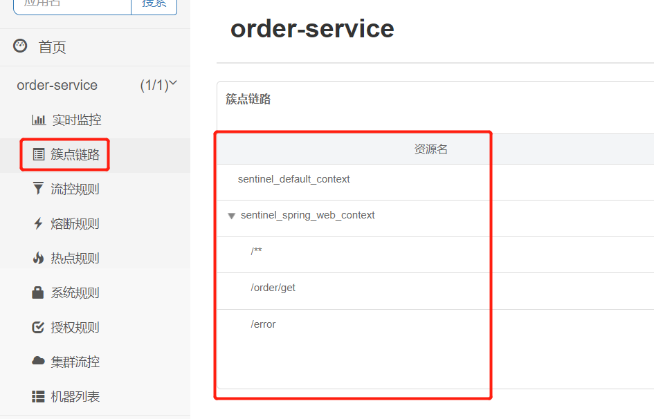
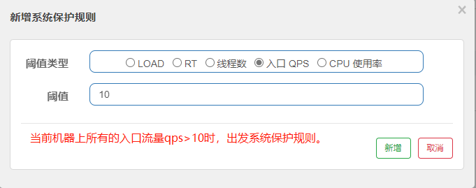

[toc]


# 微服务流量控制组件Sentinel

当前Sentinel使用版本为1.8.4

下图为微服务架构图


目前SpringCloudAlibaba中各个组件的版本搭配

|  Spring Cloud Alibaba Version | Sentinel Version | Nacos Version | RocketMQ Version | Dubbo Version | Seata Version | 
|  ----  | ----  | ----  | ----  | ----  | ----  |
| 2.2.8.RELEASE  | 1.8.4 | 2.1.0 | 4.9.3 | ~ | 1.5.1 |

## 1.介绍

随着微服务的流行，服务和服务之间的稳定性变得越来越重要。在一个高度服务化的系统中,任意一个服务通常会依赖多个服务。如果其中的某个服务不可用, 就会出现线程池里所有线程都因等待响应而被阻塞, 从而造成整个服务链路不可用，进而导致整个系统的服务雪崩。

* 服务雪崩效应：因服务提供者的不可用导致服务调用者的不可用,并将不可用逐渐放大的过程，就叫服务雪崩效应。
* 导致服务不可用的原因：流量激增，消息处理过慢，sql查询过慢，第三方服务突然不可用等。

>常见针对服务不可用的解决方案：

* 超时机制：服务提供者不可用会导致消费者请求线程强制等待，而造成系统资源耗尽。加入超时机制，一旦超时，就释放资源。由于释放资源速度较快，一定程度上可以抑制资源耗尽的问题。
* 服务限流：若某个服务最多能承受500QPS。当有800QPS流量进来时，该服务只处理500QPS请求，其余300QPS请求直接进行限流处理。例如返回友好的提示信息。
* 服务熔断：实时监测应用，如果发现在一定时间内失败次数/失败率达到一定阈值，就“跳闸”，断路器打开——此时，请求直接返回，而不去调用原本调用的逻辑。跳闸一段时间后（例如10秒），断路器会进入半开状态，这是一个瞬间态，此时允许一次请求调用该调的逻辑，如果成功，则断路器关闭，应用正常调用；如果调用依然不成功，断路器继续回到打开状态，过段时间再进入半开状态尝试——通过”跳闸“，应用可以保护自己，而且避免浪费资源；而通过半开的设计，可实现应用的“自我修复“。
* 服务降级：就是当某个服务熔断之后，服务将不再被调用，此时客户端可以自己准备一个本地的fallback（回退）回调，返回一个缺省值。 例如：(备用接口/缓存/mock数据) 。这样做，虽然服务水平下降，但好歹可用，比直接挂掉要强。

## 1.2 什么是吞吐量（TPS）、QPS、并发数、响应时间（RT）?

* 响应时间(RT)
  响应时间是指系统对请求作出响应的时间。由于一个系统通常会提供许多功能，而不同功能的处理逻辑也千差万别，因而不同功能的响应时间也不尽相同，甚至同一功能在不同输入数据的情况下响应时间也不相同。所以，响应时间(RT)通常是指该系统所有功能的平均时间或者所有功能的最大响应时间。

* 吞吐量（TPS）
  吞吐量是指系统在单位时间内处理请求的数量。对于无并发的应用系统而言，吞吐量与响应时间成严格的反比关系，即吞吐量是响应时间的倒数。但对于并发系统，通常需要用吞吐量作为性能指标。

* 并发用户数
  并发用户数是指系统可以同时承载的正常使用系统功能的用户的数量。

* QPS每秒查询率(Query Per Second)
  每秒查询率QPS是对一个特定的查询服务器在规定时间内所处理流量多少的衡量标准，即服务器每秒的响应请求数，也即是最大吞吐能力。

## 1.3 什么是Sentinel?

Sentinel是面向分布式服务架构的流量控制组件，主要以流量为切入点，从限流、流量整形、熔断降级、系统负载保护、热点防护等多个维度来保障服务与服务之间的稳定性。

Sentinel可以分为两个部分:
* 核心库（客户端）：不依赖任何框架/库，能够运行于Java8及以上的版本的运行时环境，同时对Dubbo/SpringCloud等框架也有较好的支持。核心库可以不依赖的控制台，可以独自使用核心库来使用sentinel的所有功能。
* 控制台（Dashboard）：控制台可视化界面主要负责管理推送规则、监控、集群限流分配管理、机器发现等。基于SpringBoot开发，打包后可以直接运行，不需要额外的Tomcat等应用容器。

> 什么是资源？

资源是Sentinel的关键概念。它可以是Java应用程序中的任何内容，例如，由应用程序提供的服务，或由应用程序调用的其它应用提供的服务，RPC接口方法，甚至可以是一段代码。sentinel通过在资源上定义各种流量控制规则。从而保护资源。

## 2 Spring Cloud Alibaba中使用Sentinel

### 1.使用sentinel核心库来定义资源和规则

① 微服务引入 alibaba-sentinel 依赖

具体的版本号，由父pom的SpringCloudAlibaba依赖来决定。

```xml
<dependency>
    <groupId>com.alibaba.cloud</groupId>
    <artifactId>spring-cloud-starter-alibaba-sentinel</artifactId>
</dependency>
```

② 定义sentinel要控制的资源

@SentinelResource注解
* value: 资源名称
* blockHandler: 当资源内部发生了BlockException时，可被blockHandler方法处理。（例如被保护的资源被限流或者降级了，就会抛出BlockException）。blockHandler方法默认需要和被保护资源方法在同一个类中。若希望使用其他类的blockHandler方法，则可以指定 blockHandlerClass 为对应的类的 Class 对象，此时注意对应的blockHandler方法必需为static函数，否则无法解析。
* fallback: 当资源内部发生异常，可被fallback方法处理。同时可以指定fallbackClass。
* defaultFallback：默认的 fallback 函数名称，若同时配置了 fallback 和 defaultFallback，则只有 fallback 会生效。

<font color="red">注：blockHandler和fallback处理方法中参数和返回值都需与受保护的资源方法保持一致。</font>

```java
@RestController
@RequestMapping("/userSentinel")
public class UserSentinelController {

    @SentinelResource(value = "/userSentinel/get",blockHandler = "getblockHandlerMethod",fallback = "getfallbackMethod")
    @RequestMapping("/get/{id}")
    public String get(@PathVariable("id") String id){
        return "/userSentinel/get,id="+id;
    }

    //资源限流或降级时的处理逻辑，注意: 方法参数、返回值要与原函数保持一致
    public String getblockHandlerMethod(String id,BlockException e) {
        e.printStackTrace();
        return "资源已限流或降级,id="+id;
    }
    //方法异常时提供的fallback处理，注意: 方法参数、返回值要与原函数保持一致
    public String getfallbackMethod(String id,Throwable e) {
        return "资源发生异常,id="+id;
    }
}

```

③ 定义规则
在当前资源所属类下定义规则
```java
//@PostConstruct。在spring容器启动的时候执行，用作数据的常规化加载。
@PostConstruct
private static void initFlowRules(){
    //设置规则容器
    List<FlowRule> rules = new ArrayList<>();
    //创建流控规则
    FlowRule rule = new FlowRule();
    //设置规则所属的资源
    rule.setResource("/userSentinel/get");
    //设置规则模式，为QPS
    rule.setGrade(RuleConstant.FLOW_GRADE_QPS);
    //设置规则触发阈值，即一秒内只能连续调用接口3次之内
    rule.setCount(3);
    rules.add(rule);
    //加载规则到管理器中
    FlowRuleManager.loadRules(rules);
}
```

④：重启服务，不断调用资源接口，若一秒内连续调用3次以上，就会触发sentinel流控规则，执行blockHandler参数指向的方法。

### 2.使用Sentineldashboard控制台来定义资源和规则

<font color="red">资源和规则的配置主要通过控制台的方式来进行。PS:核心库和控制台是独立的，核心库能做到的，控制台同样能够做到。</font>

① 下载Sentinel控制台jar包 sentinel-dashboard-1.8.4.jar。注意版本

② 运行Sentinel控制台jar包，有多种启动方式。
```
启动方式1：默认端口为8080 默认账号密码为sentinel/sentinel
java -jar C:\CodeEnviroment\sentinel-dashboard-1.8.4.jar

启动方式2：设置端口
java ‐Dserver.port=8898 ‐jar C:\CodeEnviroment\sentinel‐dashboard‐1.8.4.jar

启动方式3：设置端口和密码
java ‐Dserver.port=8898 ‐Dsentinel.dashboard.auth.username=sentinel ‐Dsentinel.dashboard.auth.password=123456 ‐jar C:\CodeEnviroment\sentinel‐dashboard‐1.8.4.jar

可以通过下面参数进行启动配置：
‐Dserver.port=8898 设置启动端口，默认端口为8898
-Dsentinel.dashboard.auth.username=sentinel 设置用户名；默认用户名为sentinel
-Dsentinel.dashboard.auth.password=123456 设置登录密码为123456；默认密码为sentinel
-Dserver.servlet.session.timeout=7200 指定Spring Boot服务端 session 的过期时间为7200秒。默认为 30 分钟；

对于windows系统可以创建bat脚本文件，方面快速启动sentinel。bat脚本内容如下：
java ‐Dserver.port=8898 ‐jar C:\CodeEnviroment\sentinel‐dashboard‐1.8.4.jar
pause
```

③启动完成后,浏览器进行访问。


④ 某个微服务引入 alibaba-sentinel 依赖

```xml
<dependency>
    <groupId>com.alibaba.cloud</groupId>
    <artifactId>spring-cloud-starter-alibaba-sentinel</artifactId>
</dependency>
```


<font color="red">千万注意：当你导入alibaba-sentinel 依赖后，一定要检查依赖是否加载到服务中。若依赖没有加载到服务中，后续该服务无法注册到sentinel控制台中。并且这个报错不好排查。</font>

⑤ 修改配置文件

```yml
spring:
  application:
    name: order-service # 服务名称
  cloud:
    sentinel:
      transport:
        port: 8719  # 指定该微服务应用与Sentinel控制台交互的端口，该微服务应用本地会起一个占用该端口的HttpServer
        dashboard: localhost:8898 # sentinel控制台地址
```

spring.cloud.sentinel.transport.port 该配置会在微服务应用对应的机器上启动一个 Http Server，该 Server 会与 Sentinel 控制台做交互。比如 Sentinel 控制台添加了一个限流规则，会把规则数据 push 给这个 Http Server 接收，Http Server 再将规则注册到微服务应用中。

<font color="red">PS:对于上面的交互端口8719，若多个服务部署在同一个服务器上，则每个服务的交互端口最好不要重复。</font>

⑥ 重启服务，多次调用某个接口。可在控制台上看到该接口的流量图表。


⑦ 给该接口在控制台上配置流控规则（每秒qps>3时，访问资源直接失败）


## 3 控制台配置其他规则

实时监控：监控接口的通过的QPS和拒绝的QPS  


簇点链路: 显示所有监控的API接口


### 流控规则

流量控制原理是监控应用流量的QPS或并发线程数等指标，当达到指定阈值时对流量进行控制，避免系统被瞬时的流量高峰冲垮，保障应用高可用性。<font color="red">通常在服务提供端（服务生产者）进行流量控制</font>

阈值类型：QPS,并发线程数
* QPS：每秒请求数，就是说服务器在一秒的时间内处理了多少个请求。
* 并发线程数：并发数控制用于保护业务线程池不被慢调用耗尽。

流控模式有3种：直接，关联，链路
* 直接：当到达限流条件时，直接限流。
* 关联：当关联的资源到达阈值，就限流自己。
* 链路：只记录指定链路上的流量，指定资源从入口资源进来的流量，如果达到阈值，就进行限流，api级别的限流。

流控效果有3种：快速失败,Warm up（预热）, 排队等待
* 快速失败：默认的流量控制方式，当QPS超过任意规则的阈值后，新的请求就会被立即拒绝，拒绝方式为抛出FlowException。这种方式适用于对系统处理能力确切已知的情况下，比如通过压测确定了系统的准确水位时。
* Warm up（预热）：即预热/冷启动方式。当系统长期处于低水位的情况下，当流量突然增加时，直接把系统拉升到高水位可能瞬间把系统压垮。通过"冷启动"，让通过的流量缓慢增加，在一定时间内逐渐增加到阈值上限，给冷系统一个预热的时间，避免冷系统被压垮。
* 排队等待：当流量达到阈值后，多余的请求通过排队的方式来访问资源。

直接模式：

关联模式：

链路模式：


<font color="red">高版本的sentinel的链路模式不会直接生效。需要在配置文件进行配置。</font>

```
spring.cloud.sentinel.web‐context‐unify: false
```

并发线程数：
  并发数控制用于保护业务线程池不被慢调用耗尽。例如，当应用所依赖的下游应用由于某种原因导致服务不稳定、响应延迟增加，对于调用者来说，意味着吞吐量下降和更多的线程数占用，极端情况下甚至导致线程池耗尽。为应对太多线程占用的情况，有隔离的方案，比如通过不同业务逻辑使用不同线程池来隔离业务自身之间的资源争抢（线程池隔离）。这种隔离方案虽然隔离性比较好，但是代价就是线程数目太多，线程上下文切换的 overhead 比较大，特别是对低延时的调用有比较大的影响。

<font color="red">Sentinel不负责创建和管理线程池，而是简单统计当前请求上下文的线程数目（正在执行的调用数目），如果超出阈值，新的请求会被立即拒绝，效果类似于信号量隔离。并发数控制通常在调用端进行配置。</font>


### 熔断降级规则

除了流量控制以外，对服务调用链路中不稳定的资源进行熔断降级也是保障高可用的重要措施之一。我们需要对不稳定的弱依赖服务（不常用，不重要，影响不大的服务）调用进行熔断降级，暂时切断不稳定调用，避免局部不稳定因素导致整体的雪崩。熔断降级作为保护自身的手段，<font color="red">通常针对服务客户端（服务消费者）设置熔断降级规则。</font>

> 熔断降级策略
* 慢调用比例：
  以慢调用比例作为阈值，需要设置允许的慢调用 RT（即最大的响应时间），当请求的响应时间大于该值则统计为慢调用。当单位统计时长内请求数目大于设置的最小请求数目，并且慢调用的比例大于阈值，则接下来的熔断时长内请求会自动被熔断。经过熔断时长后熔断器会进入探测恢复状态（HALF­OPEN 状态），若接下来的一个请求响应时间小于设置的慢调用 RT 则结束熔断，若大于设置的慢调用 RT 则会再次被熔断。


* 异常比例：
  异常比例：当单位统计时长内请求数目大于设置的最小请求数目，并且异常的比例大于阈值，则接下来的熔断时长内请求会自动被熔断。经过熔断时长后熔断器会进入探测恢复状态（HALF­OPEN 状态），若接下来的一个请求成功完成（没有错误）则结束熔断，否则会再次被熔断。异常比率的阈值范围是 [0.0, 1.0]，代表0% ­100%。


* 异常数：
  异常数：当单位统计时长内的异常数目超过阈值之后会自动进行熔断。经过熔断时长后熔断器会进入探测恢复状态，若接下来的一个请求成功完成（没有错误）则结束熔断，否则会再次被熔断。注意：异常降级仅针对业务异常，对Sentinel限流降级本身的异常（BlockException）不生效。


### 热点规则（热点参数规则）

热点：热点即经常访问的数据。很多时候希望统计某个热点数据中访问频次最高的数据，并对其访问进行限制。比如：针对一段时间内最常购买的商品ID并进行限制。针对一段时间内频繁访问的用户ID进行限制。


热点规则会统计传入资源方法的参数中的热点参数，并根据配置的限流阈值与模式，对包含热点参数的资源调用进行限流。即针对资源方法上的某个参数进行限流。

注意：
1. 热点规则需要使用@SentinelResource("resourceName")注解，否则不生效
2. 参数必须是7种基本数据类型才会生效


上图中。先创建热点规则，再对热点规则进行编辑操作。才会出现高级选项。

```java
//第一个参数为int类型。参数名为id
@RequestMapping("/toOrder2/{id}")
@SentinelResource(value = "/toOrder2/{id}",blockHandler= "test2Handler2")
public String test2(@PathVariable("id") Integer id){
    return "/user/toOrder2,id="+id;
}
//资源限流或降级时的处理逻辑,注意: 方法参数、返回值要与对应的资源方法保持一致
public String test2Handler2(Integer id, BlockException e) {
    e.printStackTrace();
    return "热点资源已限流或降级,id="+id;
}
```

### 系统保护规则

Sentinel根据服务器系统的各项指标进行自适应控制。例如服务器的 Load、CPU 使用率、总体平均 RT、入口QPS 和并发线程数等几个维度的监控指标，sentinel通过自适应的流控策略，让系统的入口流量和系统的负载达到一个平衡，让系统尽可能跑在最大吞吐量的同时保证系统整体的稳定性。

* Load 自适应（仅对 Linux/Unix­like 机器生效）：系统的 load1 作为启发指标，进行自适应系统保护。当系统load1 超过设定的启发值，且系统当前的并发线程数超过估算的系统容量时才会触发系统保护（BBR 阶段）。
* CPU 使用率：当系统 CPU 使用率超过阈值即触发系统保护（取值范围 0-­1），比较灵敏。
* 平均 RT：当单台机器上所有入口流量的平均 RT 达到阈值即触发系统保护，单位是毫秒。
* 并发线程数：当单台机器上所有入口流量的并发线程数达到阈值即触发系统保护。
* 入口 QPS：当单台机器上所有入口流量的 QPS 达到阈值即触发系统保护。




<font color="red">系统保护规则不针对单个资源。</font>

### 授权规则

暂无


## 4 openFeign整合sentinel

场景：若第三方服务已经被sentinel进行流量控制。当通过openFeign调用第三方服务时。若第三方服务由于各种原因被sentinel流控。如何及时获取第三方服务的流控处理信息。

①：服务消费者引入sentinel依赖
```xml
<dependency>
    <groupId>com.alibaba.cloud</groupId>
    <artifactId>spring-cloud-starter-alibaba-sentinel</artifactId>
</dependency>
```

②：添加配置
```
#openfeign添加对sentinel的支持
feign.sentinel.enabled=true
```

③：服务消费者编写openFeign服务接口及其实现类
```java
//order-service是nacos注册中心的第三方服务名称
//path是接口路径
//fallback是当调用第三方服务失败后的处理类
@FeignClient(value = "order-service",path = "/order",fallback = OrderFeignServiceImpl.class)
public interface OrderFeignService {
    @RequestMapping("/get")
    String getOrder();
}
////////////////
@Component
public class OrderFeignServiceImpl implements OrderFeignService{
    @Override
    public String getOrder() {
        return "调用远程getOrder服务出现问题 ";
    }
}
```

④：服务消费者调用第三方服务
```java
@RestController
@RequestMapping("/user")
public class UserController {
    @Autowired
    OrderFeignService orderFeignService;

    @RequestMapping("/toOrder")
    public String test(){
        return orderFeignService.getOrder();
    }
}
```

1. order-service服务下的/order/get接口被sentinel进行了流量控制。
2. 当服务消费者连续调用第三方服务，若触发了sentinel的流控规则，会导致后续请求失败。
3. 第三方服务请求失败会被openFeign服务接口实现类处理。即fallback指向的实现类。


上图中第三方服务为order服务。该服务设置了流控规则（当qps>3时直接失败）。当调用该order服务的qps>3时。对应的接口实现类可以直接获取并处理请求失败的信息。

## 5 sentinel的持久化模式

<font color="red">默认情况下Sentinel控制台的数据是存放在内存中的，如果Sentinel控制台重启或者sentinel客户端（即被sentinel流控的服务）重启，sentinel控制台内设置的数据无法持久保存。</font>


sentinel的数据推送有三种模式：
* 原始模式：sentinel控制台通过api将规则推送到sentinel客户端，并直接更新到内存中。
  缺点：数据没有持久化，服务重启，规则就消失。

* pull模式：sentinel控制台将规则写入到数据库或文件中。然后sentinel客户端主动定期向数据库拉去规则数据。
  缺点：无法保证一致性，实时性。并且需要修改sentinel的代码以使用数据库。

* push模式：sentinel客户端通过注册监听器的方式时刻监听配置中心中的配置变化，然后同步到sentinel控制台上。生产环境一般使用这种模式。


### sentinel如何搭配nacos配置中心来持久化

① 引入sentinel数据源依赖

不用写版本号，版本号可以在父项目中找到。
```xml
<dependency>
    <groupId>com.alibaba.csp</groupId>
    <artifactId>sentinel-datasource-nacos</artifactId>
</dependency>
```

② 在nacos配中心配置sentinel数据源

<font color="red">
配置内容不要有注释。否则容易导致sentinel客户端监听失败。
</font>

```json
[
    {
        "resource":"/order/get",  
        "limitApp":"default",     
        "grade":1,                
        "count":3,                
        "strategy":0,             
        "controlBehavior":0       
    }
]

//resource            资源名，资源接口的全路径
//limitApp            针对来源
//grade               阈值类型，QPS 模式（1）或并发线程数模式（0）
//count               单机阈值
//strategy            流控模式 直接0、链路1、关联2
//controlBehavior     流控效果 直接拒绝 0,WarmUp 1,排队等待 2

```


③ sentinel客服端（使用sentinel的服务）添加nacos上的数据源配置信息

```yaml
spring:
  application:
    name: order-service # 服务名称
  cloud:
    sentinel:
      transport:
        port: 8719  #指定该微服务应用与Sentinel仪表盘交互的端口，该微服务应用本地会起一个占用该端口的HttpServer
        dashboard: localhost:8898 #sentinel仪表盘地址
####################################### 上面是之前的配置。下面是要新增的数据源配置信息
        datasource:
          ds1:        #这里是随意命名的，代表第一个数据源
            nacos:    #表示数据源是nacos
              server-addr: localhost:7070/nacos       #nacos访问地址
              data-id: sentinel-order-service-config  #nacos配置文件的dataid，随意命名
              group-id: DEFAULT_GROUP
              ## namespace: public
              data-type: json     #配置文件类型
              rule-type: flow     #sentinel的规则类型（flow代表流控规则）
```

```
c.a.c.s.d.converter.SentinelConverter    : converter can not convert rules because source is empty
当出现这个日志信息表示sentinel客户端无法监听到nacos配置中心的数据。
原因1：可能添加了namespace: public配置。
原因2：nacos配置数据中出现了注释。
```


<font color="red">

注意：
1. 上面可以设置namespace，默认为public。但是推荐不要写。
2. 当数据源配置确定是在public命名空间下，就不要在配置文件上面写namespace配置，这样容易导致sentinel客户端监听不到nacos中的数据源配置。
3. 若数据源配置不是在public命令空间下，则要在上面的配置文件写上namespace配置(注意是namespace的id)。

</font>

④ 重启服务，即可在sentinel控制台看到nacos中配置的流控规则。


<font color="red">注意：这种模式下的持久化，有个问题。当在nacos进行更改时，sentinel控制台就会对应更改。但是反之不行。</font>


### sentinel与nacos互相持久化

暂无