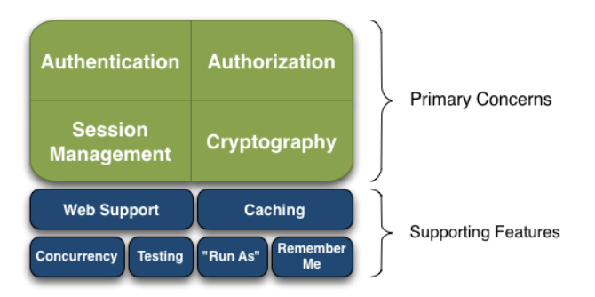
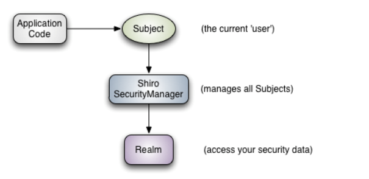
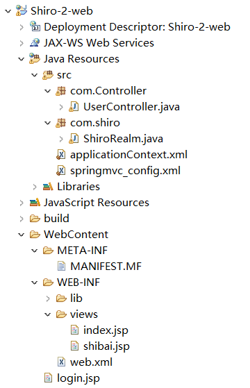
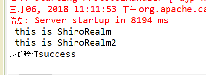
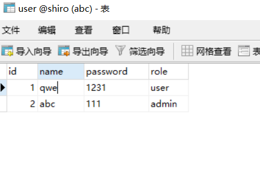

# Shiro基础

Shiro是一个强大的简单易用的**Java安全框架**，主要用来更便捷的认证，授权，加密，会话管理。

## 1.简介：

Shiro 可以帮助我们完成：认证、授权、加密、会话管理、与 Web 集成、缓存等。

<font color="red">其基本功能点:</font>



1. Authentication：身份认证 / 登录，验证用户是不是拥有相应的身份；
2. Authorization：授权，即权限验证，验证某个已认证的用户是否拥有某个权限；即判断用户是否能做事情，常见的如：验证某个用户是否拥有某个角色。或者细粒度的验证某个用户对某个资源是否具有某个权限；
3. Session Manager：会话管理，即用户登录后就是一次会话，在没有退出之前，它的所有信息都在会话中；会话可以是普通 JavaSE 环境的，也可以是如 Web 环境的；
4. Cryptography：加密，保护数据的安全性，如密码加密存储到数据库，而不是明文存储；
5. Web Support：Web 支持，可以非常容易的集成到 Web 环境；
6. Caching：缓存，比如用户登录后，其用户信息、拥有的角色 / 权限不必每次去查，这样可以提高效率；
7. Concurrency：shiro 支持多线程应用的并发验证，即如在一个线程中开启另一个线程，能把权限自动传播过去；
8. Testing：提供测试支持；
9. Run As：允许一个用户假装为另一个用户（如果他们允许）的身份进行访问；
10. Remember Me：记住我，这个是非常常见的功能，即一次登录后，下次再来的话不用登录了。


<font color="red">Shiro的工作原理：</font>



1. Subject：主体，代表了当前 “用户”，这个用户不一定是一个具体的人，与当前应用交互的任何东西都是 Subject，如网络爬虫，机器人等；所有 Subject 都绑定到 SecurityManager，与 Subject 的所有交互都会委托给 SecurityManager；可以把 Subject 认为是一个门面；SecurityManager 才是实际的执行者；
2. SecurityManager：安全管理器；即所有与安全有关的操作都会与 SecurityManager 交互；且它管理着所有 Subject；可以看出它是 Shiro 的核心，它负责与后边介绍的其他组件进行交互，如果学习过 SpringMVC，你可以把它看成 DispatcherServlet 前端控制器；
3. Realm：域，Shiro 从 Realm 中获取安全数据（如用户User、角色Role、权限），就是说 SecurityManager 要验证用户身份，那么它需要从 Realm 中获取相应的用户信息进行比较以确定用户身份是否合法；也需要从 Realm 得到用户相应的角色 / 权限进行验证用户是否能进行权限操作；可以把 Realm 看成 DataSource，即安全数据源。


<font color="red">总结：</font>

1. 应用代码通过 Subject 来进行认证和授权，而 Subject 又委托给 SecurityManager；

2. 我们需要给 Shiro 的 SecurityManager 注入 Realm，从而让 SecurityManager 能得到合法的用户及其权限进行判断。

**Shiro 不提供维护用户 / 权限，而是通过 Realm 让开发人员自己注入。**

## 2.java SE 环境下的Shiro 使用：

### 1. 准备环境依赖：

**添加 junit、common-logging 及 shiro-core 依赖即可。**

<font color="red">这里使用的是Gradle管理工具。</font>

[了解Gradle](https://baike.baidu.com/item/gradle/3066272?fr=aladdin)

> build.gradle:

```
dependencies {
    // This dependency is exported to consumers, that is to say found on their compile classpath.
    api 'org.apache.commons:commons-math3:3.6.1'

    // This dependency is used internally, and not exposed to consumers on their own compile classpath.
    implementation 'com.google.guava:guava:23.0'

    // Use JUnit test framework
    testImplementation 'junit:junit:4.12'
    
    // https://mvnrepository.com/artifact/org.apache.shiro/shiro-core
    compile group: 'org.apache.shiro', name: 'shiro-core', version: '1.4.0'
    
    // https://mvnrepository.com/artifact/commons-logging/commons-logging
    compile group: 'commons-logging', name: 'commons-logging', version: '1.2'
    
    // https://mvnrepository.com/artifact/org.slf4j/slf4j-log4j12
	testCompile group: 'org.slf4j', name: 'slf4j-log4j12', version: '1.7.21'
    
}
```

### 2.测试登录验证：

1. 编写shiro.ini配置文件：

> shiro.ini
```
[users]
# ---root为用户名，密码是 secret ,拥有admin角色----
root=secret,admin

guest = guest, guest

presidentskroob = 12345, president

darkhelmet = ludicrousspeed, darklord, schwartz

aihe=aihe,client
# -----aihe用户密码为aihe ,拥有goodguy,client角色---------------------------

[roles]

# ------admin 拥有 *代表所有的权限，  -----------------------------------------------------------------------

admin = *

client = look:*

goodguy = winnebago:drive:eagle5
```

2. 编写代码：
```java
public class test_shiro {
	 private static final transient Logger log = LoggerFactory.getLogger(test_shiro.class);
		public static void main(String[] args) {
			log.info("My First Apache Shiro Application");
			
			//1.解析ini文件, 获取SecurityManager工厂，此处使用Ini配置文件初始化SecurityManager
			Factory<SecurityManager> factory = new IniSecurityManagerFactory(
			                "classpath:shiro.ini");
			//2.得到SecurityManager实例 并绑定给SecurityUtils
			SecurityManager securityManager = factory.getInstance();
			SecurityUtils.setSecurityManager(securityManager);
			
		    //3、通过SecurityUtils 得到Subject（当前用户）
		    Subject user = SecurityUtils.getSubject();  
		   
		   if(user.isAuthenticated()==false) {       //用户是否登录过
			   //4.创建用户名/密码身份验证Token令牌,并记住令牌
			    UsernamePasswordToken token = new UsernamePasswordToken("darkhelmet", "ludicrousspeed");   //darkhelmet 为用户名，ludicrousspeed为密码
			    token.setRememberMe(true);
			    try {  
			        //4、当前用户通过令牌进行登录
			        user.login(token);  
			        System.out.println("身份验证success");
			    } catch(UnknownAccountException e) {  
			    	System.out.println("用户名错误 ");
			    } catch(IncorrectCredentialsException e ) {
			    	System.out.println("密码错误");
			    } catch(AuthenticationException e) {
			    	System.out.println("验证错误");
			    }
		   }
		   
		  // 查看用户是否有指定的角色,由于在shiro.ini配置文件中 root 没有client角色，aihe有该角色
           if ( user.hasRole( "client" ) ) {
               System.out.println("有指定的角色权限");
           } else {
        	   System.out.println("没有指定的角色权限");
           }

           //判断当前用户是否拥有指定的权限
           if(user.isPermitted("winnebago:drive:eagle5")) {
        	   System.out.println("当前用户拥有指定的权限");
           }else {
        	   System.out.println("当前用户bu拥有指定的权限");
           }
		  user.logout();  //退出登录
		}
}

```

总结：

1. 指定一个 ini 配置文件来创建一个 SecurityManager 工厂；
2. 获取 SecurityManager 并绑定到 SecurityUtils，这是一个全局设置，设置一次即可；
3. 通过 SecurityUtils 得到 Subject，其会自动绑定到当前线程；**如果在 web 环境在请求结束时需要解除绑定**；然后获取身份验证的 Token，如用户名 / 密码；
4. <font color="red">调 用 subject.login 方法进行登录，其会自动委托给 SecurityManager.login 方法进行登录；</font>
5. 如果身份验证失败请捕获 AuthenticationException 或其子类等，
6. <font color="red">调用 subject.logout 退出，其会自动委托给 SecurityManager.logout 方法退出。</font>


## 3.WEB环境下的Shiro使用：



### 1.准备环境依赖：
1. spring的所有jar包
2. java与mysql的驱动包 ：mysql-connector-java-5.1.42-bin.jar
3. shiro需要的所有jar包
   shiro-all-1.3.2.jar ， slf4j-api-1.7.25.jar  ，slf4j-log4j12-1.7.25.jar ， log4j-1.2.17.jar


### 2. spring+springmvc+jdbc+shiro的环境搭建：

1. 创建动态web工程。
2. 导入jar包。
3. 编写配置文件：

> applicationContext.xml:
spring的配置文件中需要配置shiro的相关bean

```xml
<?xml version="1.0" encoding="UTF-8"?>
<beans xmlns="http://www.springframework.org/schema/beans"
       xmlns:p="http://www.springframework.org/schema/p"
       xmlns:mybatis="http://mybatis.org/schema/mybatis-spring"
       xmlns:xsi="http://www.w3.org/2001/XMLSchema-instance" xmlns:mvc="http://www.springframework.org/schema/mvc"
       xmlns:aop="http://www.springframework.org/schema/aop"
       xmlns:context="http://www.springframework.org/schema/context" xmlns:tx="http://www.springframework.org/schema/tx"
       xsi:schemaLocation="http://www.springframework.org/schema/mvc http://www.springframework.org/schema/mvc/spring-mvc-4.3.xsd
        http://www.springframework.org/schema/beans http://www.springframework.org/schema/beans/spring-beans.xsd
        http://www.springframework.org/schema/tx http://www.springframework.org/schema/tx/spring-tx-4.3.xsd
        http://www.springframework.org/schema/context http://www.springframework.org/schema/context/spring-context-4.3.xsd
        http://mybatis.org/schema/mybatis-spring
        http://mybatis.org/schema/mybatis-spring.xsd
        http://www.springframework.org/schema/aop
        http://www.springframework.org/schema/aop/spring-aop-4.3.xsd">
<!-- id 值 必须与web.xml 中配置的 shiroFilter 这个过滤器的Filter-name 保持一致，因为过滤器的类是代理类-->
<bean id="shiroFilter" class="org.apache.shiro.spring.web.ShiroFilterFactoryBean">
	<property name="securityManager" ref="securityManager" />
	<property name="loginUrl" value="/login.jsp"/>    <!-- 无需认证可进入的页面 -->
	<!-- 代表过滤器的详细配置 -->
	<property name="filterChainDefinitions">
        <value>
        	<!-- anon 表示不需要验证，authc 表示需要认证。
        	   这里意思是除了访问login.jsp页面,/login请求,/Shiro_login请求，不需要认证登录，
        	    其他都需要认证登录，否则会一直在login页面 
        	-->
          	/login.jsp = anon
          	/login = anon  
          	/Shiro_login = anon  
            /** = authc
        </value>
    </property>
	
</bean> 

<!-- 需要注入该bean，应为shiro底层需要使用该类 -->
<bean id="securityManager" class="org.apache.shiro.web.mgt.DefaultWebSecurityManager">
    <property name="realm" ref="myRealm"/>
</bean>
<!-- 手动创建ShiroRealm 这个bean ，该bean被securityManager 引用-->
<bean id="myRealm" class="com.shiro.ShiroRealm"/>
<!-- 必须有，用来管理spring容器中常用的对象 -->
<bean id="lifecycleBeanPostProcessor" class="org.apache.shiro.spring.LifecycleBeanPostProcessor"/>
<!-- 开启shiro注解 -->
<bean class="org.springframework.aop.framework.autoproxy.DefaultAdvisorAutoProxyCreator" depends-on="lifecycleBeanPostProcessor"/>
    <bean class="org.apache.shiro.spring.security.interceptor.AuthorizationAttributeSourceAdvisor">
    <property name="securityManager" ref="securityManager"/>
</bean>

</beans>
```

> springmvc_config.xml:
springmvc的配置文件中需要指明Controller类的位置，从而通过扫描注解注入到容器中，视图解析器等。

```xml
<?xml version="1.0" encoding="UTF-8"?>  
<beans  
    xmlns="http://www.springframework.org/schema/beans"  
    xmlns:xsi="http://www.w3.org/2001/XMLSchema-instance"  
    xmlns:tx="http://www.springframework.org/schema/tx"  
    xmlns:context="http://www.springframework.org/schema/context"    
    xmlns:mvc="http://www.springframework.org/schema/mvc"    
    xsi:schemaLocation="http://www.springframework.org/schema/beans   
    http://www.springframework.org/schema/beans/spring-beans-3.2.xsd   
    http://www.springframework.org/schema/tx   
    http://www.springframework.org/schema/tx/spring-tx-3.2.xsd  
    http://www.springframework.org/schema/context  
    http://www.springframework.org/schema/context/spring-context-3.2.xsd  
    http://www.springframework.org/schema/mvc  
    http://www.springframework.org/schema/mvc/spring-mvc-3.2.xsd">  
  	 <!-- 自动扫描的包名 ， 若扫描到spring注解的类，这些类被注入到ioc容器中 -->  
    <context:component-scan base-package="com.Controller"/>  
    <mvc:annotation-driven />  
    <!-- 视图解析器， 把控制器的方法 返回的值通过   prefix + 返回值  + suffix 的形式，得到响应的jsp页面 -->  
    <bean class="org.springframework.web.servlet.view.InternalResourceViewResolver">  
        <property name="prefix" value="/WEB-INF/views/"/>  
        <property name="suffix" value=".jsp"/>  
    </bean>  
</beans> 
```

> web.xml:
该配置中给出springmvc，spring的配置文件的位置，并进行shiro的配置。

```xml
<?xml version="1.0" encoding="UTF-8"?>
<web-app xmlns:xsi="http://www.w3.org/2001/XMLSchema-instance" xmlns="http://xmlns.jcp.org/xml/ns/javaee" xsi:schemaLocation="http://xmlns.jcp.org/xml/ns/javaee http://xmlns.jcp.org/xml/ns/javaee/web-app_3_1.xsd" id="WebApp_ID" version="3.1">
  <display-name>Shiro-2-web</display-name>
  <!-- 配置DispatcherServlet  -->
<servlet>
    <servlet-name>springmvc</servlet-name>
    <servlet-class>org.springframework.web.servlet.DispatcherServlet</servlet-class>
    <init-param>
        <param-name>contextConfigLocation</param-name>
        <param-value>classpath:springmvc_config.xml</param-value>
    </init-param>
    <load-on-startup>1</load-on-startup>
</servlet>

<servlet-mapping>
    <servlet-name>springmvc</servlet-name>
    <url-pattern>/</url-pattern>
</servlet-mapping>
 <!--监听 spring的ioc容器-->
    <listener>
        <listener-class>org.springframework.web.context.ContextLoaderListener</listener-class>
    </listener>
    <context-param>
        <param-name>contextConfigLocation</param-name>
        <param-value>classpath:applicationContext.xml</param-value>
    </context-param>
     <!-- 
     shiro 配置开始：
     
     spring 与 shiro 的集成
  	DelegatingFilterProxy作用是自动到spring容器查找名字为shiroFilter（filter-name）的bean并把所有Filter的操作委托给它,类似门卫的作用。
  	然后将ShiroFilter配置到spring容器即可：
   -->
    <filter>
        <filter-name>shiroFilter</filter-name>
        <filter-class>org.springframework.web.filter.DelegatingFilterProxy</filter-class>
        <async-supported>true</async-supported>
        <init-param>
            <param-name>targetFilterLifecycle</param-name>
            <param-value>true</param-value>
        </init-param>
        <!-- targetBeanName 属性 指定 查找的bean的名字，并把过滤器的操作委托给该bean，如果不写则默认为filter-name标签的值  -->
        <init-param>
            <param-name>targetBeanName</param-name>
            <param-value>shiroFilter</param-value> 
        </init-param>
    </filter>
    <filter-mapping>
        <filter-name>shiroFilter</filter-name>
        <url-pattern>/*</url-pattern>
    </filter-mapping>
    <!-- shiro配置 结束 -->
  
</web-app>
```


4. 编写身份验证的代码：

> ①：login.jsp:

```html
<body>
Shiro-login:
<form action="Shiro_login" method="post">
username:<input type="text" name="username"/>
password:<input type="text" name="password"/>
<input type="submit" value="tijiao"/>
</form>
</body>
```

> ②：UserController.java:
```java
@Controller
public class UserController {
	@RequestMapping(value = "/Shiro_login")
	public String Shiro_login(@RequestParam(value = "username") String username,
			@RequestParam(value = "password") String password) {
		/*
		 * 0.创建SecurityManager工厂，得到SecurityManager实例 并绑定给SecurityUtils
		 *   已经在配置文件中完成。
		 * 1. 通过SecurityUtils 得到Subject（当前用户）
		 * 2. 判断用户是否登录
		 * 3. 通过传过来的用户名与密码，创建认证令牌
		 * 4. 通过令牌进行登录验证
		 * */
		Subject currentUser = SecurityUtils.getSubject();  
		if(currentUser.isAuthenticated()==false) {       //用户是否登录过
			//.创建用户名/密码身份验证Token令牌,并记住令牌
			    UsernamePasswordToken token = new UsernamePasswordToken(username,password);   
			    token.setRememberMe(true);
			    try {  
			        /*当前用户通过令牌进行登录
			         * 
			         * 调用login(token); 方法 在底层中会调用对应realm的bean类的doGetAuthenticationInfo方法
			         * 并把token 当作参数传给这个方法,在这个方法中实现与数据库信息的验证。
			         * 在login方法中 如果验证错误会抛出异常，通过抛出异常的方式，来表达验证错误，
			         * 验证正确会正常执行下一行代码，没有返回值。
			         * */
			    	currentUser.login(token);  
			        System.out.println("身份验证success");
			    } catch(AuthenticationException e) {
			    	System.out.println("验证错误");
			    	return "shibai";
			    }
		   }
		 return "index";
	}
}

```

> ③：ShiroRealm.class：
```java

//在ShiroRealm类中需要查询数据库来进行认证
public class ShiroRealm extends AuthenticatingRealm {
	/*
	 * 1. doGetAuthenticationInfo : 获取数据库数据，进行验证，若数据库没有对于数据，返回null ,若有，返回AuthenticationInfo 对象
	 * 2. AuthenticationInfo ：该对象可以使用SimpleAuthenticationInfo类（AuthenticationInfo类的子类） 封装正确的用户名与密码
	 * 3. token :里面封装了需要验证的用户名密码
	 * */
	@Override
	protected AuthenticationInfo doGetAuthenticationInfo(AuthenticationToken token) throws AuthenticationException {
		System.out.println(" this is ShiroRealm ");
		SimpleAuthenticationInfo info=null;
		//1.把token 装换为UsernamePasswordToken类对象
		UsernamePasswordToken userToken=(UsernamePasswordToken) token;
		//2.获取令牌中用户名：
		String username = userToken.getUsername();
		//3.链接数据库:
        Connection conn=null;
	    try {
		   Class.forName("com.mysql.jdbc.Driver");
		   conn=DriverManager.getConnection("jdbc:mysql://localhost:3306/Shiro","root","root");
		} catch (ClassNotFoundException e) {
			System.out.println("数据库链接失败1");
		} catch (SQLException e) {
			System.out.println("数据库链接失败2");
		}   
		
	    //4.通过用户名查询数据库：
	    try {
	    	String sql="select * from user where name=?";
			PreparedStatement pstmt = conn.prepareStatement(sql);
			pstmt.setString(1, username);
			ResultSet rs = pstmt.executeQuery();
			if(rs.next()) {
			    /*
			     * info= new SimpleAuthenticationInfo(username, rs.getString(3), this.getName());  
			     * 
			     *  username ： 传入的token中的用户名（用户输入的用户名），也可以传对象。
			     *  rs.getString(3) ： 数据库中获取的密码。
			     *  this.getName() ： 这里的this 是指的ShiroRealm类，所以是获取的类名。
			     *  
			     *  传入的password（这里是从数据库获取的）和token（filter中登录时生成的）中的password做对比，
			     *  如果相同就允许登录，不相同就抛出异常。
			     *  
			     * */
				info=new SimpleAuthenticationInfo(username, rs.getString(3), this.getName());   
			}else {
				System.out.println("查询数据不存在异常");
				throw new AuthenticationException();
			}
		} catch (SQLException e) {
			System.out.println("查询异常");
		}
		return info;
	}
}

```


## 4.多Realm数据验证两种配置：

### 1.第一种：

1. 创建多个Realm类。
2. spring的配置文件完成多个Realm类的注入。
3. 在spring的配置文件中对securityManager类中属性设置为多个Realm类。


①：创建多个不同的Realm实例，它们可以使用不同的数据库或加密方式来验证用户输入的数据。

ShiroRealm.java:  
<font color="red">查询的是 shiro 数据库。</font>

```java
package com.shiro;
//在ShiroRealm类中需要查询数据库来进行认证
public class ShiroRealm extends AuthenticatingRealm {
	@Override
	protected AuthenticationInfo doGetAuthenticationInfo(AuthenticationToken token) throws AuthenticationException {
		System.out.println(" this is ShiroRealm ");
		SimpleAuthenticationInfo info=null;
		UsernamePasswordToken userToken=(UsernamePasswordToken) token;
		String username = userToken.getUsername();
        Connection conn=null;
	    try {
		   Class.forName("com.mysql.jdbc.Driver");
		   conn=DriverManager.getConnection("jdbc:mysql://localhost:3306/Shiro","root","root");
		} catch (ClassNotFoundException e) {
			System.out.println("数据库链接失败1");
		} catch (SQLException e) {
			System.out.println("数据库链接失败2");
		}   
	    try {
	    	String sql="select * from user where name=?";
			PreparedStatement pstmt = conn.prepareStatement(sql);
			pstmt.setString(1, username);
			ResultSet rs = pstmt.executeQuery();
			if(rs.next()) {
				info=new SimpleAuthenticationInfo(username, rs.getString(3), this.getName());   
			}else {
				System.out.println("查询数据不存在异常");
				throw new AuthenticationException();
			}
		} catch (SQLException e) {
			System.out.println("查询异常");
		}
		return info;
	}
}

```

ShiroRealm2.java:
<font color="red">查询的是 shiro2 数据库。</font>

```java
package com.shiro;

//在ShiroRealm类中需要查询数据库来进行认证
public class ShiroRealm2 extends AuthenticatingRealm {
	@Override
	protected AuthenticationInfo doGetAuthenticationInfo(AuthenticationToken token) throws AuthenticationException {
		System.out.println(" this is ShiroRealm2 ");
		SimpleAuthenticationInfo info=null;
		UsernamePasswordToken userToken=(UsernamePasswordToken) token;
		String username = userToken.getUsername();
        Connection conn=null;
	    try {
		   Class.forName("com.mysql.jdbc.Driver");
		   conn=DriverManager.getConnection("jdbc:mysql://localhost:3306/Shiro2","root","root");
		} catch (ClassNotFoundException e) {
			System.out.println("数据库链接失败1");
		} catch (SQLException e) {
			System.out.println("数据库链接失败2");
		}   
	    try {
	    	String sql="select * from user where name=?";
			PreparedStatement pstmt = conn.prepareStatement(sql);
			pstmt.setString(1, username);
			ResultSet rs = pstmt.executeQuery();
			if(rs.next()) {
				info=new SimpleAuthenticationInfo(username, rs.getString(3), this.getName());   
			}else {
				System.out.println("查询数据不存在异常");
				throw new AuthenticationException();
			}
		} catch (SQLException e) {
			System.out.println("查询异常");
		}
		return info;
	}
}

```

②：修改spring的配置文件：

> applicationContext.xml:
spring的配置文件中需要配置shiro的相关bean

```xml
<?xml version="1.0" encoding="UTF-8"?>
<beans xmlns="http://www.springframework.org/schema/beans"
       xmlns:p="http://www.springframework.org/schema/p"
       xmlns:mybatis="http://mybatis.org/schema/mybatis-spring"
       xmlns:xsi="http://www.w3.org/2001/XMLSchema-instance" xmlns:mvc="http://www.springframework.org/schema/mvc"
       xmlns:aop="http://www.springframework.org/schema/aop"
       xmlns:context="http://www.springframework.org/schema/context" xmlns:tx="http://www.springframework.org/schema/tx"
       xsi:schemaLocation="http://www.springframework.org/schema/mvc http://www.springframework.org/schema/mvc/spring-mvc-4.3.xsd
        http://www.springframework.org/schema/beans http://www.springframework.org/schema/beans/spring-beans.xsd
        http://www.springframework.org/schema/tx http://www.springframework.org/schema/tx/spring-tx-4.3.xsd
        http://www.springframework.org/schema/context http://www.springframework.org/schema/context/spring-context-4.3.xsd
        http://mybatis.org/schema/mybatis-spring
        http://mybatis.org/schema/mybatis-spring.xsd
        http://www.springframework.org/schema/aop
        http://www.springframework.org/schema/aop/spring-aop-4.3.xsd">
<!--此处省略 。。。。。-->

<!-- 引用多个不同的Realm -->
<bean id="securityManager" class="org.apache.shiro.web.mgt.DefaultWebSecurityManager">
    <property name="realms">
    	<list>
    		<ref bean="myRealm"/>
    		<ref bean="myRealm2"/>
    	</list>
    </property>
</bean>
<!-- 多Realm bean实例，他们可以使用不同的数据库或加密方式-->
<bean id="myRealm" class="com.shiro.ShiroRealm"/>
<bean id="myRealm2" class="com.shiro.ShiroRealm2"/>
<!--此处省略 。。。。。-->
</beans>
```

③：登录截图：



### 2.第二种：
1. 创建多个Realm类。
2. spring的配置文件完成多个Realm类的注入。
3. 在spring的ioc容器中配置自定义认证器，该自定义认证器需实现ModularRealmAuthenticator.
4. 对自定义认证器的属性进行修改,使得该bean能够使用多Realm。

①与②的步骤与第一种方式相同
③与④：修改ModularRealmAuthenticator这个bean，可以把该bean作为自定义认证器

```xml
<?xml version="1.0" encoding="UTF-8"?>
<beans xmlns="http://www.springframework.org/schema/beans"
       xmlns:p="http://www.springframework.org/schema/p"
       xmlns:mybatis="http://mybatis.org/schema/mybatis-spring"
       xmlns:xsi="http://www.w3.org/2001/XMLSchema-instance" xmlns:mvc="http://www.springframework.org/schema/mvc"
       xmlns:aop="http://www.springframework.org/schema/aop"
       xmlns:context="http://www.springframework.org/schema/context" xmlns:tx="http://www.springframework.org/schema/tx"
       xsi:schemaLocation="http://www.springframework.org/schema/mvc http://www.springframework.org/schema/mvc/spring-mvc-4.3.xsd
        http://www.springframework.org/schema/beans http://www.springframework.org/schema/beans/spring-beans.xsd
        http://www.springframework.org/schema/tx http://www.springframework.org/schema/tx/spring-tx-4.3.xsd
        http://www.springframework.org/schema/context http://www.springframework.org/schema/context/spring-context-4.3.xsd
        http://mybatis.org/schema/mybatis-spring
        http://mybatis.org/schema/mybatis-spring.xsd
        http://www.springframework.org/schema/aop
        http://www.springframework.org/schema/aop/spring-aop-4.3.xsd">
<!--此次省略-->
<bean id="securityManager" class="org.apache.shiro.web.mgt.DefaultWebSecurityManager">
	<!--装配认证管理器  -->
	<property name="authenticator" ref="modularRealmAuthenticator"></property>
</bean>
<!-- 配置认证管理器 -->
<bean id="modularRealmAuthenticator" class="org.apache.shiro.authc.pam.ModularRealmAuthenticator">
	 <property name="realms">
    	<list>
    		<ref bean="myRealm"/>
    		<ref bean="myRealm2"/>
    	</list>
    </property>
</bean>

<!-- 多Realm bean实例，他们可以使用不同的数据库或加密方式-->
<bean id="myRealm" class="com.shiro.ShiroRealm"/>
<bean id="myRealm2" class="com.shiro.ShiroRealm2"/>
<!--此次省略-->
</beans>
```

结果截图：


## 5.加密：

### 1. MD5加密：
对用户输入的密码进行加密，并且在验证密码时，取出数据库的密码进行加密，再来对比。

1. 修改配置文件的Realm 的加密器属性：
> applicationContext.xml:
```xml
<!-- 多Realm bean实例，他们可以使用不同的数据库或加密方式-->
<bean id="myRealm2" class="com.shiro.ShiroRealm2">
		<!-- 加密器属性 -->
		<property name="credentialsMatcher">
            <bean class="org.apache.shiro.authc.credential.HashedCredentialsMatcher">
                <property name="hashAlgorithmName" value="MD5"></property> <!-- 加密算法的名称 -->
                <property name="hashIterations" value="1024"></property> <!-- 加密的次数 -->
            </bean>
        </property>
</bean>
```

2. 在对应的Realm 类中获取用户输入的密码，进行加密：
ShiroRealm2.java:
```java
//AuthorizingRealm 是拥有授权，认证的Realm类
public class ShiroRealm2 extends AuthorizingRealm{
	@Override
	protected AuthenticationInfo doGetAuthenticationInfo(AuthenticationToken token) throws AuthenticationException {
		System.out.println(" this is doGetAuthenticationInfo  认证管理 ");
		
		SimpleAuthenticationInfo info=null;
		UsernamePasswordToken userToken=(UsernamePasswordToken) token;
		String username = userToken.getUsername();
        Connection conn=null;
	    try {
		   Class.forName("com.mysql.jdbc.Driver");
		   conn=DriverManager.getConnection("jdbc:mysql://localhost:3306/Shiro","root","root");
		} catch (ClassNotFoundException e) {
			System.out.println("数据库链接失败1");
		} catch (SQLException e) {
			System.out.println("数据库链接失败2");
		}   
	    try {
	    	String sql="select * from user where name=?";
			PreparedStatement pstmt = conn.prepareStatement(sql);
			pstmt.setString(1, username);
			ResultSet rs = pstmt.executeQuery();
			if(rs.next()) {
				/*
				 * new SimpleAuthenticationInfo(username, rs.getString(3), this.getName());   
				 * 
				 * username:用户名 。
				 * rs.getString(3) ：数据库中获取的密码。 
				 * this.getName()： 类名
				 * */
				
				//获取用户输入的密码，进行md5加密：
				SimpleHash simpleHash=new SimpleHash("MD5",rs.getString(3),null,1024);
				
				//对经过md5加密的密码进行认证
				info=new SimpleAuthenticationInfo(username,simpleHash, this.getName());  
				
			}else {
				System.out.println("查询数据不存在异常");
				throw new AuthenticationException();
			}
		} catch (SQLException e) {
			System.out.println("查询异常");
		}
		return info;
	}
}
```


### 2.盐值加密：

**在原有加密的基础上，对相同的密码，进行盐值加密，使得它们变得的不同**

1. 修改ShiroRealm2.java

> ShiroRealm2.java:
```java
//AuthorizingRealm 是拥有授权，认证的Realm类
public class ShiroRealm2 extends AuthorizingRealm{
	@Override
	protected AuthenticationInfo doGetAuthenticationInfo(AuthenticationToken token) throws AuthenticationException {
		System.out.println(" this is doGetAuthenticationInfo  认证管理 ");
		SimpleAuthenticationInfo info=null;
		UsernamePasswordToken userToken=(UsernamePasswordToken) token;
		String username = userToken.getUsername();
        Connection conn=null;
	    try {
		   Class.forName("com.mysql.jdbc.Driver");
		   conn=DriverManager.getConnection("jdbc:mysql://localhost:3306/Shiro","root","root");
		} catch (ClassNotFoundException e) {
			System.out.println("数据库链接失败1");
		} catch (SQLException e) {
			System.out.println("数据库链接失败2");
		}   
	    try {
	    	String sql="select * from user where name=?";
			PreparedStatement pstmt = conn.prepareStatement(sql);
			pstmt.setString(1, username);
			ResultSet rs = pstmt.executeQuery();
			if(rs.next()) {
				/*
				 * new SimpleAuthenticationInfo(username, rs.getString(3), this.getName());   
				 * 
				 * username:用户名 。
				 * rs.getString(3) ：数据库中获取的密码。 
				 * this.getName()： 类名
				 * */
				
				//创建盐值：把用户名作为盐值
				ByteSource salt=ByteSource.Util.bytes(username); 
				
				//获取用户输入的密码，进行md5加密：
				SimpleHash simpleHash=new SimpleHash("MD5",rs.getString(3),null,1024);
				
				//对经过 md5加密+盐值加密 的密码进行认证
				info=new SimpleAuthenticationInfo(username,simpleHash,salt,this.getName());  
				
			}else {
				System.out.println("查询数据不存在异常");
				throw new AuthenticationException();
			}
		} catch (SQLException e) {
			System.out.println("查询异常");
		}
		return info;
	}
}
```


## 6.认证策略：
当两个Realm时，怎么才能知道认证通过了？是一个Realm通过了就通过，还是全部Realm通过了才通过，还是其它？这就牵扯到了认证策略。

认证策略实际上是AuthenticationStrategy这个接口，它有三个实现：
①：FirstSuccessfulStrategy:只要有一个Realm验证成功即可，只返回第一个Realm身份验证成功的认证信息，其他的忽略。
②： AtLeatOneSuccessfulStrategy:只要有一个Realm验证成功即可，和FirstSuccessfulStrategy不同，将返回所有Realm身份校验成功的认证信息。
③：AllSuccessfulStrategy:所有Realm验证成功才算成功，且返回所有Realm身份认证成功的认证信息，如果有一个失败就失败了。

我们之前使用的ModularRealmAuthenticator默认是AtLeatOneSuccessfulStrategy。


<font color="red">想要更换认证策略，则需要在IOC容器的配置文件applicationContext.xml中为之前配置的认证器添加一个authenticationStrategy参数.</font>

applicationContext.xml:
```xml
<?xml version="1.0" encoding="UTF-8"?>
<beans xmlns="http://www.springframework.org/schema/beans"
       xmlns:p="http://www.springframework.org/schema/p"
       xmlns:mybatis="http://mybatis.org/schema/mybatis-spring"
       xmlns:xsi="http://www.w3.org/2001/XMLSchema-instance" xmlns:mvc="http://www.springframework.org/schema/mvc"
       xmlns:aop="http://www.springframework.org/schema/aop"
       xmlns:context="http://www.springframework.org/schema/context" xmlns:tx="http://www.springframework.org/schema/tx"
       xsi:schemaLocation="http://www.springframework.org/schema/mvc http://www.springframework.org/schema/mvc/spring-mvc-4.3.xsd
        http://www.springframework.org/schema/beans http://www.springframework.org/schema/beans/spring-beans.xsd
        http://www.springframework.org/schema/tx http://www.springframework.org/schema/tx/spring-tx-4.3.xsd
        http://www.springframework.org/schema/context http://www.springframework.org/schema/context/spring-context-4.3.xsd
        http://mybatis.org/schema/mybatis-spring
        http://mybatis.org/schema/mybatis-spring.xsd
        http://www.springframework.org/schema/aop
        http://www.springframework.org/schema/aop/spring-aop-4.3.xsd">
<!--此次省略-->
<bean id="securityManager" class="org.apache.shiro.web.mgt.DefaultWebSecurityManager">
	<!--装配认证管理器  -->
	<property name="authenticator" ref="modularRealmAuthenticator"></property>
</bean>
<!-- 配置认证管理器 -->
<bean id="modularRealmAuthenticator" class="org.apache.shiro.authc.pam.ModularRealmAuthenticator">
	 <property name="realms">
    	<list>
    		<ref bean="myRealm"/>
    		<ref bean="myRealm2"/>
    	</list>
    </property>
    <!-- 修改认证器的认证策略为 AllSuccessfulStrategy -->
    <property name="authenticationStrategy">  
        <bean class="org.apache.shiro.authc.pam.AllSuccessfulStrategy"></bean>  
    </property> 
</bean>
<!-- 多Realm bean实例，他们可以使用不同的数据库或加密方式-->
<bean id="myRealm" class="com.shiro.ShiroRealm"/>
<bean id="myRealm2" class="com.shiro.ShiroRealm2"/>
<!--此次省略-->
</beans>
```


## 7.角色拦截器与授权：
授权，也叫访问控制，<font color="red">即在应用中控制谁能访问哪些资源（如访问页面/编辑数据/页面操作等）。</font>

**主体**
主体，即访问应用的用户，在Shiro中使用Subject代表该用户。用户只有授权后才允许访问相应的资源。

**资源**
在应用中用户可以访问的任何东西，比如访问JSP页面等都是资源。用户只要授权后才能访问。

**权限**
通过权限我们可以表示在应用中用户有没有操作某个资源的权力。即权限表示在应用中用户能不能访问某个资源.

**角色**
角色代表了操作集合，可以理解为权限的集合，一般情况下我们会赋予用户角色而不是权限，即这样用户可以拥有一组权限，赋予权限时比较方便。典型的如：项目经理等都是角色，不同的角色拥有一组不同的权限。


### 1.Shiro支持三种方式的授权：

> ①：编程式：通过写if/else授权代码块完成： 
```java
Subject subject = SecurityUtils.getSubject();  
if(subject.hasRole(“admin”)) {  
    //有权限  
} else {  
    //无权限  
}   
```

> ②：注解式：通过在执行的Java方法上放置相应的注解完成： 
```java
@RequiresRoles("admin")  
public void hello() {  
    //有权限  
}   
```
没有权限将抛出相应的异常；

 
> ③：JSP/GSP标签：在JSP页面通过相应的标签完成： 
```xml
<shiro:hasRole name="admin">  
<!— 有权限 —>  
</shiro:hasRole>
```   

   
### 2.代码（在之前的例子上修改）：



> index.jsp:
```html
<body>
this is index.jsp
<br/>
<a href="go_admin">进入admin.jsp页面需要有admin的权限</a>
<br/>
<a href="go_user">进入user.jsp页面需要有user的权限</a>
<br/>
<a href="logout">退出登录</a>
</body>
```

> UserController.java
```java
//此处省略。。。
    @RequestMapping(value="/go_user")
	public String go_user() {
		System.out.println("this is go_user();");
		return "user";
	}
	
	@RequestMapping(value="/go_admin")
	public String go_admin() {
		System.out.println("this is go_admin();");
		return "admin";
	}
```

> applicationContext.xml
1. 配置授权管理器（org.apache.shiro.authz.ModularRealmAuthorizer),并把授权管理器交给securityManager管理。

2. 设置什么映射需要什么角色才能许可。

```xml
<?xml version="1.0" encoding="UTF-8"?>
<beans xmlns="http://www.springframework.org/schema/beans"
       xmlns:p="http://www.springframework.org/schema/p"
       xmlns:mybatis="http://mybatis.org/schema/mybatis-spring"
       xmlns:xsi="http://www.w3.org/2001/XMLSchema-instance" xmlns:mvc="http://www.springframework.org/schema/mvc"
       xmlns:aop="http://www.springframework.org/schema/aop"
       xmlns:context="http://www.springframework.org/schema/context" xmlns:tx="http://www.springframework.org/schema/tx"
       xsi:schemaLocation="http://www.springframework.org/schema/mvc http://www.springframework.org/schema/mvc/spring-mvc-4.3.xsd
        http://www.springframework.org/schema/beans http://www.springframework.org/schema/beans/spring-beans.xsd
        http://www.springframework.org/schema/tx http://www.springframework.org/schema/tx/spring-tx-4.3.xsd
        http://www.springframework.org/schema/context http://www.springframework.org/schema/context/spring-context-4.3.xsd
        http://mybatis.org/schema/mybatis-spring
        http://mybatis.org/schema/mybatis-spring.xsd
        http://www.springframework.org/schema/aop
        http://www.springframework.org/schema/aop/spring-aop-4.3.xsd">
  
<bean id="shiroFilter" class="org.apache.shiro.spring.web.ShiroFilterFactoryBean">
	<property name="securityManager" ref="securityManager" />
	<property name="loginUrl" value="/login.jsp"/>    <!-- 无需认证可进入的页面 -->
	<property name="filterChainDefinitions">
        <value>
            <!-- 如果想进行/go_user映射，需要user的角色，。。。 -->

        	/go_admin = roles[admin]   
        	/go_user = roles[user]
        	
          	/Shiro_login = anon  
          	/logout = logout  
            /** = authc
           
        </value>
    </property>
	
</bean> 


<bean id="securityManager" class="org.apache.shiro.web.mgt.DefaultWebSecurityManager">
	<!--配置认证管理器  -->
	<property name="authenticator" ref="modularRealmAuthenticator"></property>
	
	<!-- 配置授权管理器 -->
	<property name="authorizer" ref="modularRealmAuthorizer"></property>
</bean>

<!-- 配置认证管理器 -->
<bean id="modularRealmAuthenticator" class="org.apache.shiro.authc.pam.ModularRealmAuthenticator">
	 <property name="realms">
    	<list>
    		<ref bean="myRealm2"/>
    	</list>
    </property>
</bean>


<!-- 配置授权管理器 -->
<bean id="modularRealmAuthorizer" class="org.apache.shiro.authz.ModularRealmAuthorizer">
	<property name="realms">
    	<list>
    		<ref bean="myRealm2"/>
    	</list>
    </property>
</bean>

<!--此处省略-->

</beans>
```


> ShiroRealm2.java
1. 继承AuthorizingRealm类，实现两个方法（认证，授权）
2. 认证的方法可以仿照之前的例子。
3. 授权的方法也是从数据库查询相关数据，来判断是否有相应的权限。


```java
//AuthorizingRealm 是拥有授权，认证的Realm类
public class ShiroRealm2 extends AuthorizingRealm{
	// 这个方法是认证
	@Override
	protected AuthenticationInfo doGetAuthenticationInfo(AuthenticationToken token) throws AuthenticationException {
		System.out.println(" this is doGetAuthenticationInfo  认证管理 ");
		
		SimpleAuthenticationInfo info=null;
		UsernamePasswordToken userToken=(UsernamePasswordToken) token;
		String username = userToken.getUsername();
        Connection conn=null;
	    try {
		   Class.forName("com.mysql.jdbc.Driver");
		   conn=DriverManager.getConnection("jdbc:mysql://localhost:3306/Shiro","root","root");
		} catch (ClassNotFoundException e) {
			System.out.println("数据库链接失败1");
		} catch (SQLException e) {
			System.out.println("数据库链接失败2");
		}   
	    try {
	    	String sql="select * from user where name=?";
			PreparedStatement pstmt = conn.prepareStatement(sql);
			pstmt.setString(1, username);
			ResultSet rs = pstmt.executeQuery();
			if(rs.next()) {
				info=new SimpleAuthenticationInfo(username, rs.getString(3), this.getName());   
			}else {
				System.out.println("查询数据不存在异常");
				throw new AuthenticationException();
			}
		} catch (SQLException e) {
			System.out.println("查询异常");
		}
		return info;
	}
	
	// 这个方法是授权
	@Override
	protected AuthorizationInfo doGetAuthorizationInfo(PrincipalCollection principal) {
		System.out.println("this is doGetAuthorizationInfo 授权管理");
		/*
		 * AuthorizationInfo接口: 封装用户拥有的角色数据。 SimpleAuthenticationInfo 是它的实现类
		 * PrincipalCollection ： 封装了登录的用户名。
		 * */
		SimpleAuthorizationInfo info=null;      //封装用户的角色信息
		Connection conn=null;
		
		String username=principal.toString();   //把封装的用户名转换为String类型
		 try {
			   Class.forName("com.mysql.jdbc.Driver");
			   conn=DriverManager.getConnection("jdbc:mysql://localhost:3306/Shiro","root","root");
			} catch (ClassNotFoundException e) {
				System.out.println("数据库链接失败1");
			} catch (SQLException e) {
				System.out.println("数据库链接失败2");
			}   
		    try {
		    	String sql="select * from user where name=?";
				PreparedStatement pstmt = conn.prepareStatement(sql);
				pstmt.setString(1, username);
				ResultSet rs = pstmt.executeQuery();
				if(rs.next()) {
					Set<String> roles =new HashSet<String>();    //set集合
					roles.add(rs.getString(4));                  //把从数据库中查询到的用户的所有角色信息添加到集合中
					info= new SimpleAuthorizationInfo(roles);   
				}else {
					System.out.println("查询数据不存在异常");
					throw new AuthenticationException();
				}
			} catch (SQLException e) {
				System.out.println("查询异常");
			}
			return info;
	}
}

```