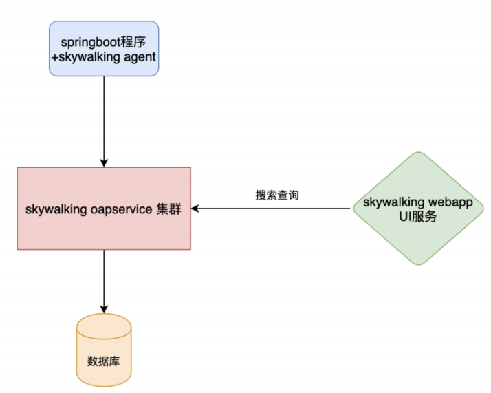
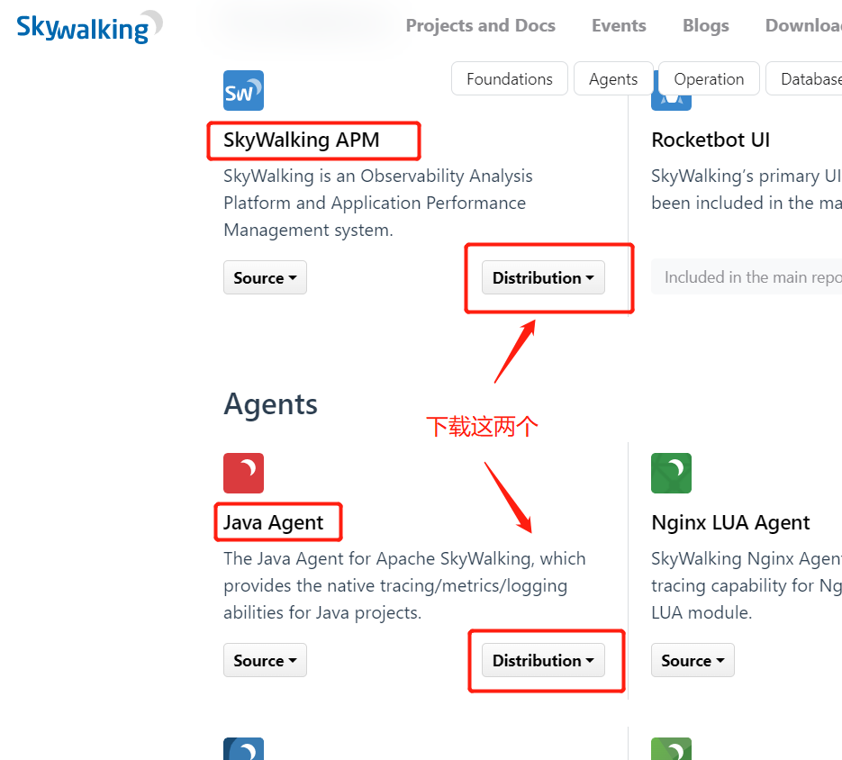
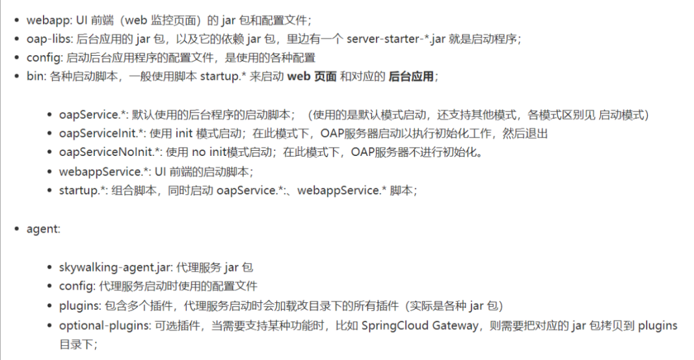
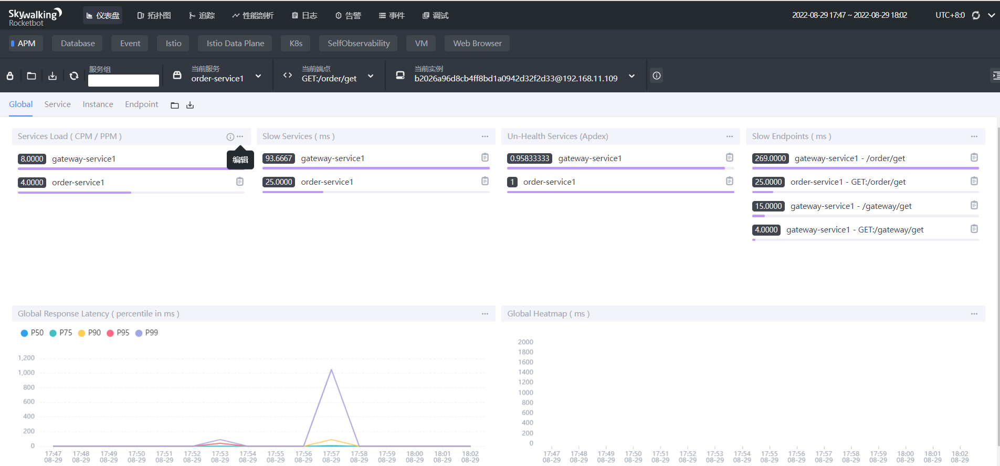
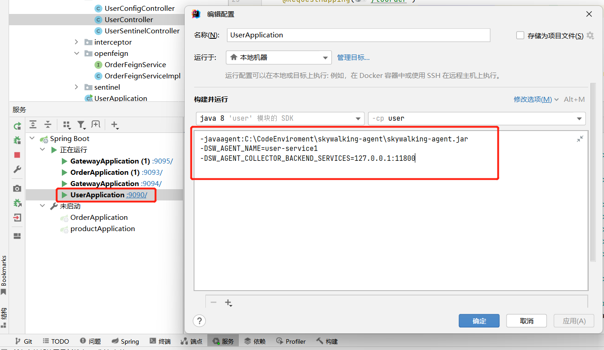
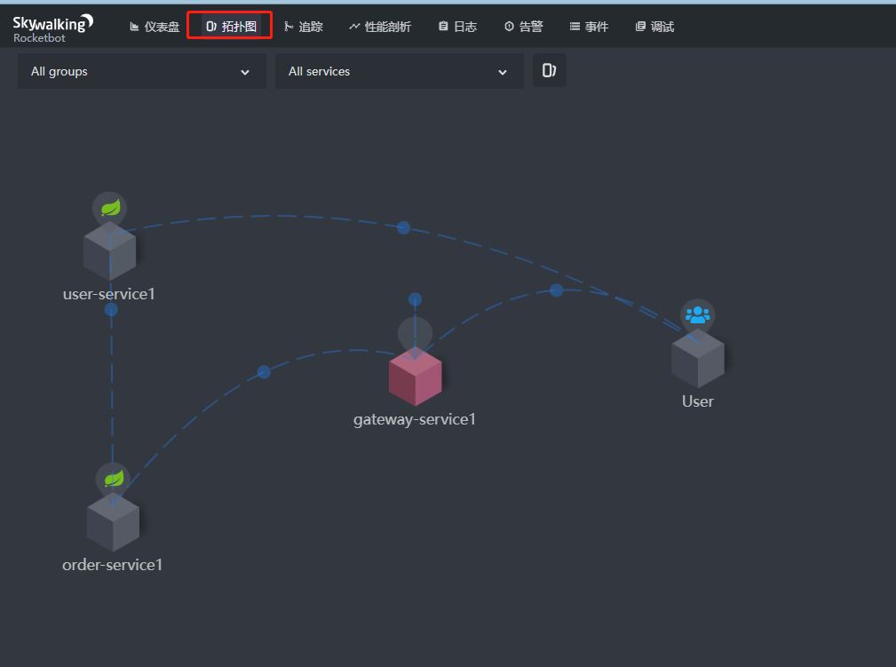
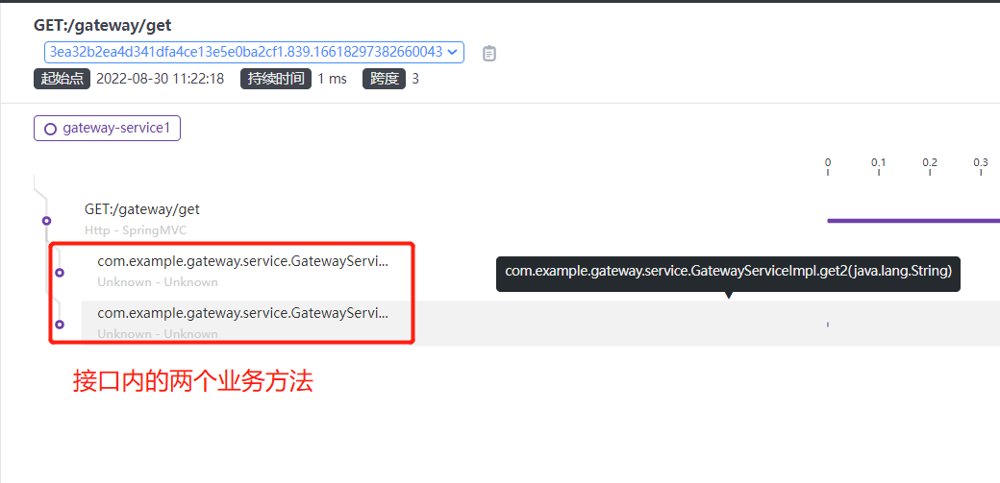
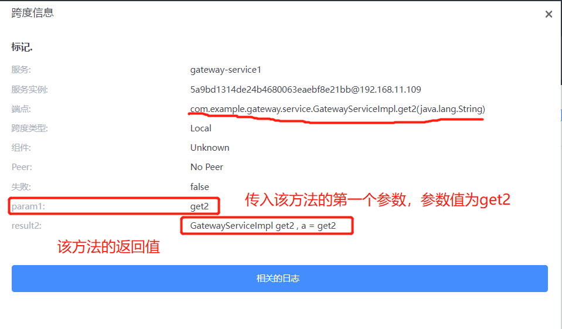

[toc]

# 微服务链路追踪组件SkyWalking

## SkyWalking介绍

当前使用版本：
apache-skywalking-apm-8.9.1
apache-skywalking-java-agent-8.9.0

> 什么是链路追踪？

对于一个大型的几十个、几百个微服务构成的微服务架构系统，通常会遇到下面一些问题，比如：
1. 如何快速定位问题？
2. 如何缕清各个微服务之间的调用关系？
3. 如何对各个微服务接口的进行性能分折？
4. 如何跟踪整个业务流程的调用顺序？

> 什么是skywalking？

skywalking是分布式系统的应用程序性能监视工具，专为微服务、云原生架构和基于容器（Docker、K8s、Mesos）架构而设计。它是一款优秀的APM应用性能管理工具，包括了分布式追踪、性能指标分析、应用和服务依赖分析等。

> Skywalking主要的功能特性

1、多种监控手段，可以通过语言探针和service mesh获得监控的数据；
2、支持多种语言自动探针，包括 Java，.NET Core 和 Node.JS；
3、轻量高效，无需大数据平台和大量的服务器资源；
4、模块化，UI、存储、集群管理都有多种机制可选；
5、支持告警；
6、优秀的可视化解决方案；

> Skywalking的架构



* skywalking agent和业务系统绑定在一起，负责收集各种监控数据
* skywalking oapservice是负责收集处理监控数据的，比如接受skywalking agent的监控数据，并存储在数据库中;接受skywalking webapp的前端请求，从数据库查询数据，并返回数据给前端。Skywalking oapservice通常以集群的形式存在。
* skywalking webapp 前端界面，用于展示数据。用于存储监控数据的数据库，比如mysql、elasticsearch等

## SkyWalking快速开始

### 下载SkyWalking

下载地址：http://skywalking.apache.org/downloads/



<font color="red">最新的SkyWalking将agent从安装包中抽离出来。单独变成了Java Agent。</font>

下载的安装包分别是：
* apache-skywalking-apm-8.9.1.tar.gz
* apache-skywalking-java-agent-8.9.0.tgz

安装包解压的目录结构：



### 部署Skywalking oapservice服务

<font color="red">Skywalking oapservice服务分为两部分：展示数据的界面功能和服务端功能。</font>

① 先修改skywalking webapp UI界面服务的启动端口。默认端口为8080。该端口容易被占用。编辑/apache-skywalking-apm-bin/webapp/webapp.yml 配置文件。修改启动端口为8899.

② 点击运行/apache-skywalking-apm-bin/bin/startup.bat 文件。该文件会一起运行同目录下的oapService.bat（Skywalking oapservice服务端）和webappService.bat（skywalking webapp 前端界面）。

③ 访问http://localhost:8899/ 地址。查看skywalking webapp 前端界面

注意：
1. Skywalking oapservice服务端启动后，会暴露11800和12800 两个端口，分别为收集监控数据的端口11800和接受前端请求的端口12800。可以在/config/applicaiton.yml配置文件中修改这两个端口。
2. skywalking-web-ui界面服务会占用 8080 端口（该端口容易被占用），可以在/apache-skywalking-apm-bin/webapp/webapp.yml配置文件中修改端口。建议修改端口为8899。

下图为skywalking-web-ui界面


### 部署skywalking agent服务

<font color="red">skywalking agent服务主要用于收集应用服务的各种数据，并发送给服务端（Skywalking oapservice服务）。它对接到应用服务的方法是完全无侵入式的。</font>

#### windows环境下,通过IDEA把skywalking agent服务接入到目标服务中

① 对服务配置jvm参数。


复制粘贴的时候，去掉注释
```
# skywalking‐agent.jar的本地磁盘的路径
-javaagent:C:\CodeEnviroment\skywalking-agent\skywalking-agent.jar
# 在skywalking上显示的服务名
-DSW_AGENT_NAME=user-service1
# Skywalking oapservice的收集数据服务的IP及端口
-DSW_AGENT_COLLECTOR_BACKEND_SERVICES=127.0.0.1:11800
```
* -DSW_AGENT_COLLECTOR_BACKEND_SERVICES可以指定远程地址， 
* -javaagent必须绑定你本机服务器上的skywalking-agent.jar

<font color="red">注意：1. jvm参数不需要注释，因此上面的注释要去掉。2. 复制上面的代码的时候，注意检查。特别是"-"符号，容易出现中文格式的。否则会导致服务启动失败。</font>

② 多次调用该服务接口。

③ 刷新界面，ui界面中的拓扑图可以展示服务与服务之间的调用关系。




#### 命令行的方式，把skywalking agent服务接入到目标服务中

将目标应用服务打成jar包后，通过命令行方式运行jar包。其中添加jvm参数。
```
java ‐javaagent:C:\CodeEnviroment\skywalking-agent\skywalking-agent.jar
‐DSW_AGENT_NAME=aaa-service ‐DSW_AGENT_COLLECTOR_BACKEND_SERVICES=127.0.0.1:11800
‐jar springboot‐aaa‐demo‐0.0.1‐SNAPSHOT.jar
```

#### linux环境下，编写启动脚本把skywalking agent服务接入到目标服务中

```
#!/bin/sh
# SkyWalking Agent配置

export SW_AGENT_NAME=springboot‐aaa‐demo                     #Agent名字,一般使用`spring.application.name`
export SW_AGENT_COLLECTOR_BACKEND_SERVICES=127.0.0.1:11800   #配置 Collector 地址。
export SW_AGENT_SPAN_LIMIT=2000                              #配置链路的最大Span数量，默认为 300。
export JAVA_AGENT=‐javaagent:/usr/local/soft/apache‐skywalking‐apm‐bin‐es7/agent/skywalking‐agent.jar
java $JAVA_AGENT ‐jar springboot‐aaa‐demo‐0.0.1‐SNAPSHOT.jar #jar启动
```

#### 问题：跟踪链路不显示gateway服务的接口路径？

解决方法：拷贝/skywalking-agent/agent/optional-plugins目录下的apm-spring-cloud-gateway-2.1.x-plugin-8.9.0.jar到/skywalking-agent/agent/plugins目录中

注意：根据使用gateway的版本不同来选择不同的gateway jar包。

### Skywalking oapservice服务端进行mysql持久化

Skywalking oapservice服务端默认是通过H2数据库存储。

① 修改/apache-skywalking-apm-bin/config/application.yml，使用mysql作为持久化存储的仓库

```yml
storage:
    # 修改存储仓库为mysql
  selector: ${SW_STORAGE:mysql}
  mysql:
    properties:
        # 修改mysql的连接地址，账户，密码
      jdbcUrl: ${SW_JDBC_URL:"jdbc:mysql://localhost:3306/skywalking-swtest?rewriteBatchedStatements=true"}
      dataSource.user: ${SW_DATA_SOURCE_USER:root}
      dataSource.password: ${SW_DATA_SOURCE_PASSWORD:root}
```

② 创建skywalking-swtest数据库，表由Skywalking oapservice服务自动创建。

③ 添加mysql数据驱动包，因为在oap-libs目录下是没有mysql数据驱动包的，所以修改完配置直接启动是会报错，可以下载mysql-connector-java-8.0.25.jar驱动包，将其移动到/apache-skywalking-apm-bin/oap-libs目录中

④ 启动Skywalking oapservice服务。查看数据库中表。查看UI界面。

此时就算重新启动Skywalking oapservice。数据也会保存在数据库中。


### 自定义SkyWalking链路追踪（将业务方法显示在链路追踪上）

① 导入SkyWalking链路追踪依赖
```xml
<!-- SkyWalking链路追踪依赖。因为本地启动的SkyWalking oapservice服务是8.9.1版本的，所以这里的依赖版本也最好依赖8.9版本-->
<dependency>
    <groupId>org.apache.skywalking</groupId>
    <artifactId>apm-toolkit-trace</artifactId>
    <version>8.9.0</version>
</dependency>
```

② 将@Trace，@Tags，@Tag注解加到业务方法上

```java
@RequestMapping("/gateway")
public class GatewayController {
    @Autowired
    private GatewayService gatewayService;

    @GetMapping("/get")
    public String get(){
        System.out.println("1111:"+gatewayService.get());
        System.out.println("2222:"+gatewayService.get2("get2"));
        return "gateway";
    }
}

/////////////////////////////////

@Service
public class GatewayServiceImpl implements GatewayService{
    @Trace
    @Tag(key = "result1", value = "returnedObj")
    public String get() {
        return "GatewayServiceImpl get1";
    }

    @Trace
    @Tags({
      @Tag(key = "param1", value = "arg[0]"), 
      @Tag(key = "result2", value = "returnedObj")})
    public String get2(String a) {
        return "GatewayServiceImpl get2 , a = "+a;
    }
}
```

③ 重启服务，调用接口。查看接口的链路追踪




注意：
* 如果要用@tag或@tags注解，前提是必须要使用@Trace注解，不然仅仅给业务方法加@Tag注解的话，SkyWalking也不会显示该业务方法的追踪路径。
* @Tag注解中key我们可以自定义，而value的写法就固定了，如果要查看返回值就只能写returnedObj，如果要查看请求参数就只能用arg[i]，下标代表第几个请求参数
* 若返回值是对象类型，注意重写对象的toString()方法，不然在SkyWalking的界面中显示的只是一个对象的内存地址


### Skywalking集成logback日志框架

由于springboot默认集成了logback日志框架，因此Skywalking集成logback日志框架更方便。

场景：
1. 控制台输出日志信息的时候，包含SkyWalking的追踪ID
2. 将服务产生的日志信息，上传到Skywalking oap服务中。

① 引入依赖

```xml
<!-- SkyWalking的logback日志依赖。因为本地启动的SkyWalking oapservice服务是8.9.1版本的，所以这里的依赖版本也最好依赖8.9版本-->
<dependency>
    <groupId>org.apache.skywalking</groupId>
    <artifactId>apm-toolkit-logback-1.x</artifactId>
    <version>8.9.0</version>
</dependency>
```

② 在resources目录中创建logback-spring.xml文件，并在日志输出格式中添加 %tid 占位符

```xml
<?xml version="1.0" encoding="UTF-8"?>
<configuration>
    <!-- 控制台日志插件：输出全部日志到控制台 -->
    <appender name="STDOUT" class="ch.qos.logback.core.ConsoleAppender">
        <encoder class="ch.qos.logback.core.encoder.LayoutWrappingEncoder">
            <layout class="org.apache.skywalking.apm.toolkit.log.logback.v1.x.TraceIdPatternLogbackLayout">
                <Pattern>%d{yyyy-MM-dd HH:mm:ss.SSS} [%tid] [%thread] %-5level %logger{36} -%msg%n</Pattern>
            </layout>
        </encoder>
    </appender>
    <!-- grpc日志插件：将应用服务的日志上传到skywalking oap服务中，日志数据会在ui界面上展示 -->
    <appender name="grpc-log" class="org.apache.skywalking.apm.toolkit.log.logback.v1.x.log.GRPCLogClientAppender">
        <encoder class="ch.qos.logback.core.encoder.LayoutWrappingEncoder">
            <layout class="org.apache.skywalking.apm.toolkit.log.logback.v1.x.mdc.TraceIdMDCPatternLogbackLayout">
                <Pattern>%d{yyyy-MM-dd HH:mm:ss.SSS} [%X{tid}] [%thread] %-5level %logger{36} -%msg%n</Pattern>
            </layout>
        </encoder>
    </appender>
    <!--必填标签，添加插件，用来指定最基础的日志输出级别，并将控制台插件添加进来-->
    <root level="INFO">
        <appender-ref ref="STDOUT" />
        <appender-ref ref="grpc-log" />
    </root>
</configuration>
```

注意：
* %tid 占位符用于显示追踪ID。可通过追踪ID，来查询对应的追踪路径。
* grpc日志插件可以将收集到的服务日志转发到SkyWalking OAP服务器上。然后展示在ui界面上。

③ 业务方法中使用logback输出日志

```java
@RestController
@RequestMapping("/gateway")
public class GatewayController {
    private Logger logger = LoggerFactory.getLogger(GatewayController.class);
    @Autowired
    private GatewayService gatewayService;
    @GetMapping("/get")
    public String get() throws InterruptedException {
        Thread.sleep(2000);
        logger.info("1111:"+gatewayService.get());         //输出日志
        logger.info("2222:"+gatewayService.get2("get2"));  //输出日志   
        return "gateway";
    }
}
```

> 若应用服务所用的agent与Skywalking oap服务不在一个服务器上?

此时需要在/skywalking-agent/config/agent.config配置文件中新增如下配置：

```
## 指定要向其报告日志数据的grpc服务器的主机。默认值：127.0.0.1
plugin.toolkit.log.grpc.reporter.server_host=${SW_GRPC_LOG_SERVER_HOST:192.168.3.100}
## 指定要向其报告日志数据的grpc服务器的端口。默认值：11800
plugin.toolkit.log.grpc.reporter.server_port=${SW_GRPC_LOG_SERVER_PORT:11800}
## 指定grpc客户端要报告的日志数据的最大大小。默认值：10485760
plugin.toolkit.log.grpc.reporter.max_message_size=${SW_GRPC_LOG_MAX_MESSAGE_SIZE:10485760}
## 客户端向上游发送数据时将超时多长时间。单位是秒。默认值：30
plugin.toolkit.log.grpc.reporter.upstream_timeout=${SW_GRPC_LOG_GRPC_UPSTREAM_TIMEOUT:30}
```

### SkyWalking oap服务的高可用

Skywalking集群是将多个skywalking oap作为一个服务注册到nacos上，只要skywalking oap服务没有全部宕机，保证有一个skywalking oap在运行，就能进行跟踪。

搭建一个skywalking oap集群需要：
（1）至少一个Nacos（也可以是nacos集群）
（2）至少一个ElasticSearch/mysql（也可以是集群）
（3）至少2个skywalking oap服务；
（4）至少1个UI（UI也可以集群多个，用Nginx代理统一入口）

场景：有两个skywalking oap服务。一个oap服务的收集数据端口和接受前端请求端口分别为11800，12800。另一个oap服务的两个端口为11900，12900。同时两个webapp前端服务的端口分别为8899和8900。

① 修改每一个oap服务的/config/application.yml配置文件，设置nacos集群模式和数据库配置

```yml
cluster:
  ## 设置nacos集群模式
  selector: ${SW_CLUSTER:nacos}
  nacos:
    serviceName: ${SW_SERVICE_NAME:"SkyWalking_OAP_Cluster"}
    # 设置nacos的地址
    hostPort: ${SW_CLUSTER_NACOS_HOST_PORT:localhost:7070/nacos}
    namespace: ${SW_CLUSTER_NACOS_NAMESPACE:"public"}
    username: ${SW_CLUSTER_NACOS_USERNAME:""}
    password: ${SW_CLUSTER_NACOS_PASSWORD:""}
    accessKey: ${SW_CLUSTER_NACOS_ACCESSKEY:""}
    secretKey: ${SW_CLUSTER_NACOS_SECRETKEY:""}
storage:
  # 设置存储为mysql
  selector: ${SW_STORAGE:mysql}
  mysql:
    properties:
      jdbcUrl: ${SW_JDBC_URL:"jdbc:mysql://localhost:3306/skywalking-swtest?rewriteBatchedStatements=true"}
      dataSource.user: ${SW_DATA_SOURCE_USER:root}
      dataSource.password: ${SW_DATA_SOURCE_PASSWORD:root}
```


② 修改每一个oap服务中收集监控数据的端口11800和接受前端请求的端口12800。

<font color="red">注意：若多个oap服务是部署在不同的服务器上，则不必修改端口。
若是一个服务器上，则多个oap服务的两个端口就要互不相同，防止端口被占而启动失败。</font>

```yml
core:
  selector: ${SW_CORE:default}
  default:
    restHost: ${SW_CORE_REST_HOST:0.0.0.0}
    # 收集数据的端口，默认为12800
    restPort: ${SW_CORE_REST_PORT:12900}

    gRPCHost: ${SW_CORE_GRPC_HOST:0.0.0.0}
    # 接受前端请求的端口，默认为11800
    gRPCPort: ${SW_CORE_GRPC_PORT:11900}
```

③ 修改每一个webapp前端服务，修改其配置文件/webapp/webapp.yml。增加多个oap服务地址，并配置端口

<font color="red">注意：若多个webapp前端服务是部署在不同的服务器上，则不必修改端口。
若是一个服务器上，则多个webapp前端服务的端口就要互不相同，防止端口被占而启动失败。</font>

```yml
server:
  # webapp服务启动端口
  port: 8899
spring:
  cloud:
    discovery:
      client:
        simple:
          instances:
          # 每个oap服务地址以及其收集数据端口
            oap-service:
              - uri: http://127.0.0.1:12800
              - uri: http://127.0.0.1:12900
              # - uri: http://<oap-host-2>:<oap-port2>
```

④ 对于每个需要被监控的应用。重新编辑jvm启动参数

```
-javaagent:C:\CodeEnviroment\skywalking-agent\skywalking-agent.jar
-DSW_AGENT_NAME=user-service1
# 添加多个oap服务地址及其接受界面请求的端口
-DSW_AGENT_COLLECTOR_BACKEND_SERVICES=127.0.0.1:11800,127.0.0.1:11900
```

⑤ 通过nginx来负载多个skywalking webapp 前端界面。
```
upstream skywalking-cluster {
    server 127.0.0.1:8899;
    server 127.0.0.1:8900;
}
server {
    listen       5050;
    server_name  localhost;
    location / {
        proxy_pass http://skywalking-cluster;
    }
}
```


