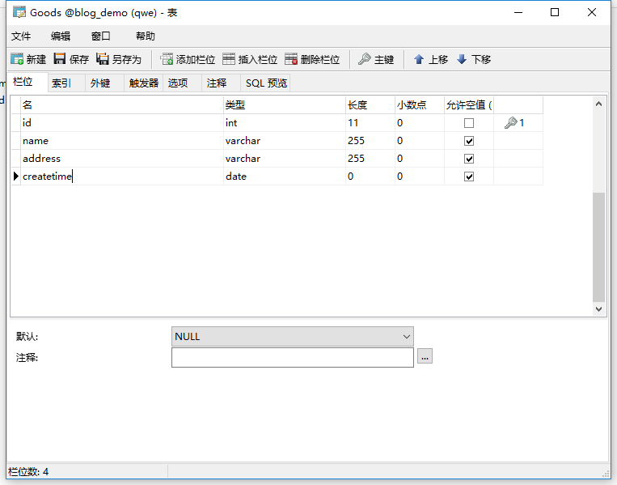
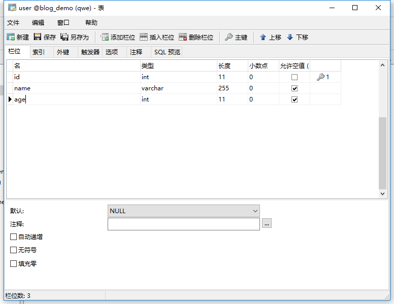
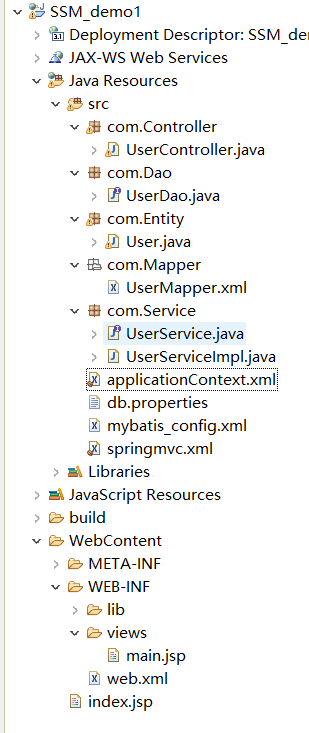
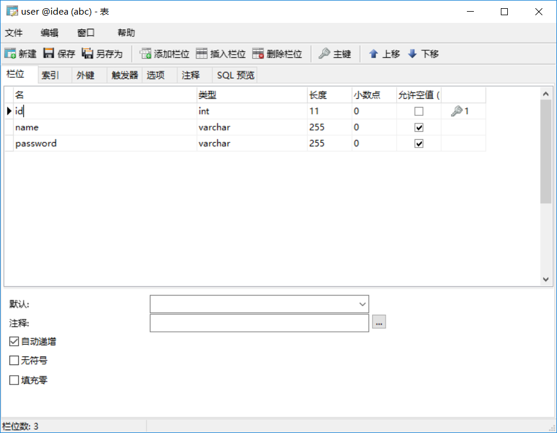

[toc]

# Spring基础

## 概述：

参考链接：
[Spring](http://spring.io/) 
[Spring百度百科](https://baike.baidu.com/item/spring/85061?fr=aladdin) 
[Rod Johnson](https://baike.baidu.com/item/Rod%20Johnson/1423612?fr=aladdin)

&emsp;&emsp;spring是一个开放源代码的设计层面框架，他解决的是业务逻辑层和其他各层的松耦合问题，因此它将<font color="red">面向接口的编程思想贯穿整个系统应用。</font>Spring是于2003 年兴起的一个轻量级的Java 开发框架，由Rod Johnson 创建。简单来说，Spring是一个分层的JavaSE/EEfull-stack(一站式)轻量级开源框架。

Spring是独特的，因为若干个原因：
&emsp;&emsp;它定位的领域是许多其他流行的framework没有的。Spring致力于提供一种方法管理你的业务对象。
&emsp;&emsp;Spring是全面的和模块化的。Spring有分层的体系结构，这意味着你能选择使用它孤立的任何部分，它的架构仍然是内在稳定的。因此从你的学习中，你可得到最大的价值。例如，你可能选择仅仅使用Spring来简单化JDBC的使用，或用来管理所有的业务对象。
&emsp;&emsp;它的设计从底部帮助你编写易于测试的代码。Spring是用于测试驱动工程的理想的framework。
&emsp;&emsp;Spring对你的工程来说，它不需要一个以上的framework。Spring是潜在地一站式解决方案，定位于与典型应用相关的大部分基础结构。它也涉及到其他framework没有考虑到的内容。

## spring的使用前提（spring的基础环境搭建）：
使用spring前，需要导入spring的jar包，你可以去官网下载。
spring最基础的几个jar包：
&emsp;&emsp;spring必须依赖的日志包，需要外部导入：commons-logging-1.2.jar
&emsp;&emsp;spring-aop-4.3.8.RELEASE.jar
&emsp;&emsp;spring-beans-4.3.8.RELEASE.jar
&emsp;&emsp;spring-context-4.3.8.RELEASE.jar
&emsp;&emsp;spring-core-4.3.8.RELEASE.jar
&emsp;&emsp;spring-expression-4.3.8.RELEASE.jar

把这些jar包，添加到类路径中（Add Build Path）。


## Spring的组成：
spring主要有7大模块组成。<font color="red">每个模块既可以单独使用，又可以与其他模块组合使用。</font>

1. core模块：
spring的core 模块是spring的核心容器。它实现了IOC 模式，提供了spring框架的基础功能。<font color="red">模块中包含的BeanFactory 类是spring的核心类，负责对bean的管理与配置。</font>

2. Context模块：
spring的Context模块 继承了BeanFactory 类，并添加了事件处理，国际化，数据校验等功能。

3. AOP模块：
spring 集成了所有的AOP功能。通过事务管理可以使任意的spring 管理的对象AOP化。

4. DAO模块：
DAO模块提供了jdbc的抽象层，大幅减少代码的编写，并且提供了对声明式事务和编程式事务的支持。

5. ORM映射模块：
ORM映射模块提供了对现有的ORM框架的支持。

6. WEB模块：
WEB模块建立在context 模块的基础上，它提供了Servlet 监听器的Context 和 WEB 应用的上下文。它对现有的WEB框架 如struts ,jsf 等提供了集成。

7. MVC模块：
其建立在spring的核心功能上，实现了控制逻辑与业务逻辑清晰的分离。


## Spring的XML使用方式：

### 1.例子：编写spring方式的 Hello world:
1. 编写一个JavaBean：
User.java:
```java
package com.entity;

import org.springframework.stereotype.Component;

public class Student {
	private String name;
	public Student(){
		System.out.println("this is student 无参构造函数");
	}
	public Student(String name){
		this.name=name;
		System.out.println(" this is student 有参构造函数");
	}
	public String getName() {
		return name;
	}
	public void setName(String name) {
		this.name = name;
	}
	public void sayHelloWorld(Student stu){
		System.out.println(stu+"  say hello world");
	}
	@Override
	public String toString() {
		return "Student [name=" + name + "]";
	}
	
}

```

2. 在src目录，创建applicationContext.xml
```xml
<?xml version="1.0" encoding="UTF-8"?>
<beans xmlns="http://www.springframework.org/schema/beans"
	xmlns:p="http://www.springframework.org/schema/p"
	xmlns:mybatis="http://mybatis.org/schema/mybatis-spring"
    xmlns:xsi="http://www.w3.org/2001/XMLSchema-instance" xmlns:mvc="http://www.springframework.org/schema/mvc"
    xmlns:context="http://www.springframework.org/schema/context" xmlns:tx="http://www.springframework.org/schema/tx"
    xsi:schemaLocation="http://www.springframework.org/schema/mvc http://www.springframework.org/schema/mvc/spring-mvc-4.3.xsd
        http://www.springframework.org/schema/beans http://www.springframework.org/schema/beans/spring-beans.xsd
        http://www.springframework.org/schema/tx http://www.springframework.org/schema/tx/spring-tx-4.3.xsd
        http://www.springframework.org/schema/context http://www.springframework.org/schema/context/spring-context-4.3.xsd
        http://mybatis.org/schema/mybatis-spring
        http://mybatis.org/schema/mybatis-spring.xsd">
   <!-- 
   为spring的ioc 容器（applicationContext ）添加java bean 对象，通过<bean>标签,
   当创建applicationContext 容器时，spring框架 会执行中存在的bean对象的无参构造函数 实例化bean对象  给开发者使用。
    -->   
<bean id="student" class="com.entity.Student">
	<!-- 属性注入，通过bean对象的set 方法注入 属性值 -->
	<property name="name" value="xiaobing"></property>
	<!-- 构造器注入（使用对象的构造函数来注入属性值） ,index="0" ，表示构造函数的第一个参数,type表示该属性的类型
  		<constructor-arg value="xiaohei" index="0" type="java.lang.String"/>
  	-->
</bean>
</beans>
```

3. 测试方法：
```java
public class test {
	/*
	 * 这是使用普通的方法。
	 * 1.先创建Student对象。
	 * 2.给对象赋值。
	 * 3.调用对象的方法。
	 * */
	@Test
	public void test1(){
		Student stu=new Student();
		stu.setName("xiaoming");
		stu.sayHelloWorld(stu);
	}
	/*
	 * 使用spring：
	 * 之前的1，2两个步骤可以交给spring框架来完成
	 * */

	@Test
	public void test2(){
		//Student stu=new Student();
		//stu.setName("xiaoming");
		
		/*
		 * 0.创建spring的配置文件（名字随意取）在src目录下，我这个叫applicationContext.xml
		 * 2.根据spring的配置文件，创建spring的容器对象，
		 * 3.从spring的容器对象中获取想要的实例对象。
		 * 4.调用实例对象的方法。

		 * */
	ApplicationContext app=new ClassPathXmlApplicationContext("applicationContext.xml");
	Student stu=(Student) app.getBean("student");	
	stu.sayHelloWorld(stu);
	}
}

```

4. 运行结果(一个普通方法，一个使用spring的)：

**普通方法：**
>this is student 无参构造函数
>User [name=xiaoming]  say hello world

**使用spring的方法：**
>this is student 无参构造函数
>User [name=xiaobing]  say hello world

### 2.分析上面的实例（★★★★★）：

①：spring框架会 通过spring的配置文件（applicationContext.xml）来创建 spring的ioc 容器（applicationContext)

```java
ApplicationContext app=new ClassPathXmlApplicationContext("applicationContext.xml");
```
		
②：当spring的ioc 容器创建时，spring框架会根据 配置文件的信息来创建java bean对象，并存放在容器中。（<font color="red">ioc 容器创建时，会执行配置文件中bean标签对象的Javabean对象的无参构造函数</font>），其中被创建的java bean对象，必须符合 java bean的格式 （get/set方法, 无参构造函数，private属性）。

```xml
<bean id="student" class="com.entity.Student">
  	<property name="name" value="xiaobing"></property>
</bean>
```

③：此时，当容器创建完成后，容器中就存在已经实例化的bean对象，可以通过ioc 容器的getBean（） 方法来获取这些bean对象。
`	Student stu=(Student) app.getBean("student");	`

④：直接调用从容器获取的bean对象的方法。
`	stu.sayHelloWorld(stu); `


## Spring的控制反转（Inverse of Control，IoC）或 依赖注入（Dependency Injection）：
<font color="blue">注意：控制反转与依赖注入是一个意思。</font>

Spring框架的核心功能有两个：
>Spring容器作为超级大工厂，负责创建、管理所有的Java对象，这些Java对象被称为Bean。
>Spring容器管理容器中Bean之间的依赖关系，Spring使用一种被称为"依赖注入（控制反转）"的方式来管理Bean之间的依赖关系。

**使用依赖注入（控制反转），不仅可以为Bean注入普通的属性值，还可以注入其他Bean的引用。依赖注入（控制反转）是一种优秀的解耦方式，其可以让Bean以配置文件组织在一起，而不是以硬编码的方式耦合在一起。**

### 1.概念：

&emsp;&emsp;当某个Java对象（调用者）需要调用另一个Java对象（被依赖对象）的方法时，在传统模式下通常有两种做法：

1. 原始做法: 调用者主动创建被依赖对象，然后再调用被依赖对象的方法
2. 简单工厂模式: 调用者先找到被依赖对象的工厂，然后主动通过工厂去获取被依赖对象，最后再调用被依赖对象的方法。

注意上面的<font color="red">主动</font>二字，**这必然会导致调用者与被依赖对象实现类的硬编码耦合，非常不利于项目升级的维护。**(<font color="red">可以理解为牵一发而动全身，或者对象与对象之间的关系太紧密，耦合度太高。</font>)

使用Spring框架之后，调用者无需主动获取，创建被依赖对象，<font color="red">调用者只要被动接受Spring容器为调用者的成员变量赋值即可</font>，由此可见，**使用Spring后，调用者获取被依赖对象的方式由原来的主动获取，变成了被动接受——所以称之为控制反转。**

**另外从Spring容器的角度来看，Spring容器负责将被依赖对象赋值给调用者要使用的成员变量——相当于为调用者注入它依赖的实例，因此被称之为依赖注入。**

### 2.spring容器的实现（BeanFactory，ApplicationContext）：
**spring容器实现方式有两种：**

BeanFactory :ioc容器的基本实现,是spring框架的基础设施，面向spring本身。

ApplicationContext : 是BeanFactory的子接口，提供更多的功能，面向开发者,<font color="blue">几乎所有的场合都使用ApplicationContext，而不是更底层的BeanFactory。</font>

```java
ApplicationContext app=new ClassPathXmlApplicationContext("applicationContext.xml");
```
ApplicationContext是Spring容器最常用的接口，该接口有如下两个实现类：
&emsp;&emsp; ClassPathXmlApplicationContext: 从类加载路径下搜索配置文件，并根据配置文件来创建Spring容器。

&emsp;&emsp; FileSystemXmlApplicationContext: 从文件系统的相对路径或绝对路径下去搜索配置文件，并根据配置文件来创建Spring容器。


### 3.通过applicationContext来进行bean的配置：
applicationContext.xml
```xml
<bean id="student" class="com.entity.Student">
  	<property name="name" value="xiaobing"></property>
</bean>
```

test.java
```java
ApplicationContext app=new ClassPathXmlApplicationContext("applicationContext.xml");

Student stu=(Student) app.getBean("student");
stu.sayHelloWorld(stu); 
```

id : ioc容器可以用getBean方法，通过该标识符来获取bean对象。
class : javabean对象的全类名。通过反射的方式,来寻找javaBean对象，并在容器中创建该bean对象。
<font color="red">注意：ioc容器创建时，会调用bean标签对应的对象的无参构造函数，来创建该bean对象。所以对象必须有无参构造函数。</font>


### 4.通过工厂方法配置bean（不推荐使用）：
**请自行百度**

### 5.依赖注入的方式（主要有2种）：

#### 1.属性注入：
&emsp;&emsp;属性注入通过setter方法注入Bean的属性值或依赖的对象。<font color="red">其通过&lt;property&gt; 标签，使用name 属性指定Bean对象中的某个属性，value 指定其属性值。</font>

```xml
<bean id="student" class="com.entity.Student">
  	<property name="name" value="xiaobing"></property>
</bean>
```

#### 2.构造方法注入：
```xml
<bean id="student" class="com.entity.Student">
 	
  	 <!--构造器注入 ,index="0" ，表示构造函数的第一个参数-->
  	<constructor-arg value="xiaohei" index="0" type="java.lang.String"/>
  	
</bean>
        
```

```java
...
public Student(){
	System.out.println("this is student 无参构造函数");
}
	
public Student(String name){
	this.name=name;
	System.out.println(" this is student 有参构造函数");
}
	
...
```
&emsp;&emsp;构造方法注入通过对象的有参构造方法，注入Bean的属性值或依赖的对象。<font color="red">其通过&lt;constructor-arg&gt; 标签，使用index属性指定有参构造方法中的那个参数，value 指定其属性值。type指定属性的类型</font>

**注意：当有多个有参构造方法时，可以使用index , type来区别不同的构造方法**

### 6.bean的详解：

#### 1.bean与bean之间的注入（引用）：

1. 创建学生证类 Schoolcard
```java
package com.entity;

public class Schoolcard {
	private Integer id;
	private String name;
	
	public Schoolcard(){
		System.out.println("this is Schoolcard 无参构造函数");
		
	}
	
	public Schoolcard(Integer id,String name){
		this.id=id;
		this.name=name;
		System.out.println("this is Schoolcard 有参构造函数");
	}

	public Integer getId() {
		return id;
	}

	public void setId(Integer id) {
		this.id = id;
	}

	public String getName() {
		return name;
	}

	public void setName(String name) {
		this.name = name;
	}

	@Override
	public String toString() {
		return "Schoolcard [id=" + id + ", name=" + name + "]";
	};

}

```

2. 修改学生类：
Student.java
```java
private Schoolcard scard;

public Schoolcard getScard() {
		return scard;
}

public void setScard(Schoolcard scard) {
		this.scard = scard;
}

@Override
public String toString() {
		return "Student [name=" + name + ", scard=" + scard + "]";
}

```

3. 创建Schoolcard的bean标签，修改student的bean标签：
applicationContext.xml
```xml
<bean id="school_card" class="com.entity.Schoolcard">
	<property name="id" value="1"></property>
	<property name="name" value="xiaohuang"></property>
</bean>
 
 
<bean id="student" class="com.entity.Student">
 
	<!-- 属性注入，通过bean对象的set 方法注入 属性值 -->
  	<property name="name" value="xiaoming"></property>
  	
  	<!-- 引用其他的bean标签, ref 属性表示被引用的bean-->
  	<property name="scard" ref="school_card"></property>
  	
</bean>
```

4. 测试：
```java
@Test
public void test3(){
		ApplicationContext app=new ClassPathXmlApplicationContext("applicationContext.xml");
		Student stu=(Student) app.getBean("student");	
		System.out.println(stu);
}
```
5. 结果：
>this is Schoolcard 无参构造函数
>this is student 无参构造函数
>Student [name=xiaoming, scard=Schoolcard [id=1, name=xiaohuang]]


**其中：**
```xml
<bean id="student" class="com.entity.Student">
	<!-- 属性注入，通过bean对象的set 方法注入 属性值 -->
  	<property name="name" value="xiaoming"></property>
  	
  	<!-- 引用其他的bean标签, ref 属性表示被引用的bean-->
  	<property name="scard" ref="school_card"></property>	
</bean>
```
<font color="red">ref 属性表示被引用的bean </font>


#### 2.内部bean（内部bean不能被外部引用）：
applicationContext.xml
```xml
 
<bean id="student2" class="com.entity.Student">
 
	<!-- 属性注入，通过bean对象的set 方法注入 属性值 -->
  	<property name="name" value="xiaoming"></property>
  	
  	<!--使用内部bean ,内部beam有没有id，无所谓-->
  	<property name="scard">
  		<bean id="schoolcard2" class="com.entity.Schoolcard">
  			<property name="id" value="2"></property>
  			<property name="name" value="hehe"></property>
  		</bean>
  	</property>
  	
</bean>
       

```

test.java
```java

//内部bean
	@Test
	public void test4(){
		ApplicationContext app=new ClassPathXmlApplicationContext("applicationContext.xml");
		
		Student stu=(Student) app.getBean("student2");	
		System.out.println(stu);
	}
	
```

运行结果：
>this is Schoolcard 无参构造函数
>this is student 无参构造函数
>Student [name=xiaoming, scard=Schoolcard [id=2, name=hehe]]


#### 3.为bean中的集合属性赋值：
若一名学生有多个学生证(小学学生证，~)。

1. 修改Student.java
```java
private List<Schoolcard> cards;

public List<Schoolcard> getCards() {
		return cards;
}
public void setCards(List<Schoolcard> cards) {
		this.cards = cards;
}

@Override
public String toString() {
		return "Student [name=" + name + ", cards=" + cards + "]";
}
```

2. 修改bean
```xml

<bean id="school_card" class="com.entity.Schoolcard">
	<property name="id" value="1"></property>
	<property name="name" value="xiaohuang"></property>
</bean>
 
<bean id="school_card2" class="com.entity.Schoolcard">
	<property name="id" value="3"></property>
	<property name="name" value="mingming"></property>
</bean>


<bean id="student3" class="com.entity.Student">
 
	<!-- 属性注入，通过bean对象的set 方法注入 属性值 -->
  	<property name="name" value="xiaoming"></property>
  	
  	<!-- 为bean中的集合（list）属性赋值,可以使用list元素，或者使用内部bean的方式-->
  	<property name="cards">
  		<list>
  			<ref bean="school_card"/>
  			<ref bean="school_card2"/>
			<bean  class="com.entity.Schoolcard">
				<property name="id" value="4"></property>
				<property name="name" value="digid"></property>
			</bean>
  
  		</list>
  	</property>
  	
</bean>

```

3.结果：
>this is Schoolcard 无参构造函数
>this is Schoolcard 无参构造函数
>this is student 无参构造函数
>Student [name=xiaoming, cards=[Schoolcard [id=1, name=xiaohuang], Schoolcard [id=3, name=mingming]]]

**<font color="red">总结：使用list元素或内部bean的方式，给集合属性赋值。</font>**


#### 4.自动装配（不推荐使用）：
Spring的ioc容器可以自动装配Bean，需要做的是在<font color="red">&lt;bean&gt;的autowire属性中指定自动装配的模式。</font>

**模式有两种：**
1. byType:根据类型自动装配，<font color="red">注意：若ioc容器中有多个与目标bean类型一致的bean，在这种情况下，spring无法判定，不能执行自动装配。</font>

2. byName: 根据名称自动装配：必须把目标的名称与对象中的对应的属性名设置的相同。

```xml
<bean id="student4" class="com.entity.Student" autowire="byName">
	<property name="name" value="xiaoming"></property>
</bean>
```

#### 5.bean与bean的关系：
Spring允许继承bean的配置，被继承的bean 称为父bean。
>①：子bean从父bean中继承配置，包括属性配置。
>②：子bean 也可以覆盖从父bean哪里继承过来的配置。
>③：父bean 可以作为配置模板（抽象bean），也可以作为普通bean。若想作为配置模板，设置&lt;bean&gt;的abstract属性 为true(相当于抽象bean)，这样spring 不会实例化该bean.该bean只能被继承。

```xml

<bean id="school_card" class="com.entity.Schoolcard">
	<property name="id" value="1"></property>
	<property name="name" value="xiaohuang"></property>
</bean>


<!--abstract="true" , 表示该bean 是一个抽象bean，无法被实例化，只能被继承-->
<bean id="school_card2" class="com.entity.Schoolcard" abstract="true">
	<property name="id" value="2"></property>
	<property name="name" value="xiaohehe"></property>
</bean>


 
<!--school_card3 这个bean 继承school_card这个bean  -->
<bean id="school_card3" class="com.entity.Schoolcard" parent="school_card">
</bean>

<!--school_card4 这个bean 继承school_card这个bean ，但有些属性的值覆盖了父bean的属性 -->
<bean id="school_card4" class="com.entity.Schoolcard" parent="school_card">
	<property name="name" value="yiyi"></property>
</bean>

```

#### 6.bean的作用域：

##### 1.Singleton 作用域（默认的作用域）：
当spring中的一个bean的作用域为 singleton 时，IOC的容器中只会存在一个共享的该bean的实例，并且所有对该bean的引用，只要id 与该bean的id 相符合，就只会返回bean的单一实例。
```xml
<bean id="school_card" class="com.entity.Schoolcard" scope="singleton">
	<property name="id" value="1"></property>
	<property name="name" value="xiaohuang"></property>
</bean>
```

```java
					
	Schoolcard scard=(Schoolcard) app.getBean("school_card");	
	Schoolcard scard2=(Schoolcard) app.getBean("school_card");	
	System.out.println(scard==scard2);
	
```
<font color="red">例如：上面代码的运行结果为 true。</font>


##### 2..prototype 作用域：
prototype 作用域的bean 会导致每次对该bean的请求时 ，会创建一个新的bean实例，<font color="blue">但是,当bean创建完毕并将实例对象返回给使用者时，容器不在拥有该实例对象的引用，因此，必须使用bean的后置处理器清除prototype的bean。</font>

**scope="prototype"，表示每次向容器获取同一个bean，容器会创建新的bean对象给使用者使用。**

<font color="red">例如：上面代码的运行结果为 false。</font>


***

#### 7.IOC容器管理bean 的生命周期：
管理过程:
1. 容器通过构造器或工厂方法创建 Bean的实例。
2. 通过bean的配置，容器为bean设置属性，以及bean 与 bean 之间的关系。
3. 调用bean的初始化方法。
4. 使用者使用bean。
5. 当容器关闭时，调用bean的销毁方法。

Schoolcard.java
```java
public void create(){
		System.out.println("Schoolcard create ");
	}
	
	public void destory(){
		System.out.println("Schoolcard destory");
	}
```

```xml
<!--
	在bean 中声明并设置init-method ，destroy-method。
	为bean指定创建 和 销毁的方法
-->
<bean id="school_card" class="com.entity.Schoolcard" 
    init-method="create" destroy-method="destory">
	<property name="id" value="1"></property>
	<property name="name" value="xiaohuang"></property>
</bean>
```


### 7.Spring 配置c3p0数据源，使用外部属性文件（properties文件）：
1. 添加c3p0 的jar包，mysql的驱动包。

2. 创建外部属性文件，db.properties

```
jdbc.driverClass=com.mysql.jdbc.Driver
jdbc.jdbcUrl=jdbc:mysql://localhost:3306/blog_demo
jdbc.user=root
jdbc.password=123456
```

<h2>注意：</h2>

**不同的数据源，它们的外部属性文件就不一样。**


> <font color="red">C3P0数据源 有这些属性:  driverClass , jdbcUrl , user , password </font>


>  <font color="red">dbcp数据源 有这些属性:  driver , url, username , password </font>


3. 增加配置在applicationContext.xml

```xml
<!-- 导入外部属性文件 -->
<context:property-placeholder location="classpath:db.properties/>
 
<bean id="dataSource" class="com.mchange.v2.c3p0.ComboPooledDataSource">

	
	

	<!--
	如果使用dbcp数据源 ，就使用这些

	<property name="driver" value="${jdbc.driver}"/>
	<property name="url" value="${jdbc.url}"/>   
	<property name="username" value="${jdbc.username}"/>
	<property name="password" value="${jdbc.password}"/>
	
	
	-->

	<!-- 使用外部属性文件的属性 -->
	<bean id="dataSource" class="${jdbc.driverClass}">
			<property name="driverClass" value="com.mysql.jdbc.Driver"/>
			<property name="jdbcUrl" value="${jdbc.jdbcUrl}"/>   
			<property name="user" value="${jdbc.user}"/>
			<property name="password" value="${jdbc.password}"/>
	</bean>

</bean>


```

### 8.SpEL：
&emsp;&emsp;Spring的表达式语言（SpEL），是一个支持运行时查询，操作的表达式语言。语法类似EL。其使用 #{}作为定界符。#{xxx}中的字符都被认为是 SpEL表达式。


```xml
<bean id="school_card" class="com.entity.Schoolcard">
	<property name="id" value="1"></property>
	<property name="name" value="xiaohuang"></property>
</bean>
 

<bean id="student3" class="com.entity.Student">

  	<property name="name" value="xiaoming"></property>
  	
 	<!-- 使用SpEL表达式，使得该bean，引用其他bean，类似于<ref>标签 -->
  	<property name="scard" value="#{school_card}"></property>
  	
  	<!-- 使用SpEL表达式，使得该bean，使用其他bean的属性 -->
  	<property name="xxx" value="#{school_card.id}"></property>
  	
  	<!-- 使用SpEL表达式，在bean中使用三目运算符 -->
  	<property name="xxx" value="#{school_card.id > 2 ? '5':'7'}"></property>
</bean>

```


## Spring的注解使用方式：

1. 组件扫描：
spring能够从classpath 下 自动扫描，检查，实例化具有特定注解的组件。

**特定注解：**
>@Component :基本注解，用于标识一个组件，该组件将被spring管理。
>@Respository :标识持久层组件。
>@Service: 标识服务层，业务层组件。
>@Controller ：标识表现层组件。

<font color="red">Spring 对于扫描的到的组件。spring 有默认的命名方法，一般是第一个字母小写，也可以在注解中通过value 属性来给组件命名。</font>

当在组件上加上注解时，还需在配置文件中添加扫描配置：
```xml
 
   <!-- 扫描指定包，及其子包的指定注解，@Repository @Autowired，@Service，@Controller
    ,....,对有注解标记的类或组件，自动注入（通过执行无参构造函数）到ioc 容器中-->
   
   <context:component-scan base-package="com.entity"/>
   <context:component-scan base-package="com.dao,com.Controller"/>
    	
    <!-- 可以通过 resource-pattern ，过滤，指定需要扫描的资源-->	
	<context:component-scan base-package="com.service"
		resource-pattern="**/*.class"
		
	/>


	<context:component-scan base-package="com.entity">
		
		<!-- context:include-filter 子节点，表示要包含的目标组件
			xxx 为注解的全类名
		-->
		<context:include-filter type="annotation" expression="xxx"/>
		
		 <context:exclude-filter type="annotation" expression="xxx"/>
			<!--context:exclude-filter 子节点，表示要排除在外的目标组件 
			xxx 为注解的全类名
			-->
	</context:component-scan> 
       

```
base-package ：指定需要扫描的基类包及其子包。**当需要扫描多个包时，用逗号隔开。**
resource-pattern ：过滤，指定需要扫描的资源 ,<font color="red">默认值是： **/*.class 表示为基类包的所有类。</font>


### 1.通过注解的方式配置Bean:

#### 1.配置过程：
> 1. @Component , 当spring的ioc 容器启动并扫描到该注解时，会自动把该类实例化（执行bean的无参构造函数），注入到ioc 容器中（相当于在applicationContext.xml 配置文件中用xml的方式配置bean）

> 2. @Component注解可以对所有的组件进行自动注入到ioc 容器中。
> 3. @Component是所有受Spring管理组件的通用形式；而@Repository、@Service和 @Controller则是@Component的细化，用来表示更具体的用例(例如，分别对应了持久化层、服务层和表现层)。
> 4. 也就是说，你能用@Component来注解你的组件类，
> 5. 但如果用@Repository、@Service 或@Controller来注解它们，
> 6. 你的类也许能更好地被工具处理，或与切面进行关联。 

#### 2.代码：
com.entity.User
```java

@Component(value="User")
public class User {
	
	private String name;
	public User(){
		System.out.println("this is user 无参构造函数");
	}
	
	public User(String name){
		this.name=name;
		System.out.println(" this is user 有参构造函数");
	}
	
	public String getName() {
		return name;
	}
	public void setName(String name) {
		this.name = name;
	}
	
	public void sayHelloWorld(User us){
		System.out.println(us+"  say hello world");
	}
	
	@Override
	public String toString() {
		return "User [name=" + name + "]";
	}
	
	
}
```

com.Controller.UserController
```java

@Controller(value="UserController")
public class UserController {
	public void  add(){
		System.out.println(" UserController ");
	}
}

```

applicationContext.xml
```xml
<context:component-scan base-package="com.service"/>
<context:component-scan base-package="com.dao,com.Controller"/>
<context:component-scan base-package="com.entity"/>
```


test.java:
```java
ApplicationContext app=new ClassPathXmlApplicationContext("applicationContext.xml");
			
User us = (User) app.getBean("User");
System.out.println(us);
			
UserController uscontroller=(UserController) app.getBean("UserController");
System.out.println(uscontroller);

```

运行结果：
this  is  Student 无参构造函数
this is user 无参构造函数
User [name=null]
com.Controller.UserController@3869f4


### 2.通过注解的方式装配Bean到另一个bean中（使一个bean 使用另一个bean ，在省去get/set 方法时）:
参考链接：
[@Autowired注解、@Resource注解和@Service注解](https://www.cnblogs.com/szlbm/p/5512931.html)


1. @Autowired 注解 ：
&emsp;&emsp;该注解可以自动装配具有兼容类型的单个bean属性（构造器，字段，方法都可以使用该注解）到另一个bean中,前提是bean存在ioc容器中。

```java
@Controller(value="UserController")
public class UserController {
	/**
		
		把UserServiceImpl 这个bean，从ioc容器中取出，装配到 UserController这个bean中，供 UserController 这个bean使用。
		否则程序报错。相当于 UserController 这个bean 引用了 UserServiceImpl 这个bean

	**/
	@Autowired
	private UserServiceImpl usimpl;
	
	public void  add(){
		System.out.println(" UserController ");
		usimpl.addUser();
	}
}
```
<font color="red">把UserServiceImpl 这个bean，从ioc容器中取出，装配到 UserController这个bean中，供 UserController 这个bean使用。否则程序报错.</font>

<font color="blue">@Autowired,相当于 UserController 这个bean 引用了 UserServiceImpl 这个bean,同时省去了在 UserController 类中 get/set UserServiceImpl属性的方法</font>

applicationContext.xml
```xml
<bean id="UserImpl" class="com.service.UserServiceImpl"></bean>
	
<bean id="ucontroller" class="com.Controller.UserController" >   
    <property name="usimpl" ref="UserImpl" />
</bean>
```


## Spring的AOP(面向切面编程)：
&emsp;&emsp;AOP(Aspect-Oriented Programming), 即 面向切面编程, 它与 OOP( Object-Oriented Programming, 面向对象编程) 相辅相成, 提供了与 OOP 不同的抽象软件结构的视角.
&emsp;&emsp;在 OOP 中, 我们以类(class)作为我们的基本单元, 而 AOP 中的基本单元是 Aspect(切面)

```java
public int add(int i,int j){
	System.out.println(" this is  "+i+" + "+j);
	return i+j;
}

public int sub(int i,int j){
	System.out.println(" this is  "+i+" - "+j);
	return i-j;
}

public int mul(int i,int j){
	System.out.println(" this is  "+i+" * "+j);
	return i*j;
}

public int div(int i,int j){
	System.out.println(" this is  "+i+" / "+j);
	return i/j;
}
```

<font color="red">上面是对两个参数之加减乘除的方法，里面有对该方法的日志输出。试想一想，如果对这四个方法的日志输出都修改，一次修改需要改四个地方，N次修改就需要修改4n次，并且这四个方法的日志，都差不多，是否可以抽象出来。</font>
**AOP可以分离与业务无关的代码出来,使得方法保持纯洁。日志输入与方法的逻辑是无关的。**


### 1.Spring的AOP术语：

1. 切面（Aspect）：
&emsp;&emsp;本质上为一段程序代码，这些代码将通过 切入点<font color="red">" 切入到 "</font> 程序流程中。
 
2. 连接点（Joinpoint）:
&emsp;&emsp;程序执行过程中的任意一点，都可以是连接点。如方法的调用或特定的异常被抛出。
 
3. 切入点（Pointcut）: 
&emsp;&emsp;连接点的集合。切面与程序流程的交叉点。
 
4. 通知（Advice）: 
&emsp;&emsp;某个切入点被横切后，所采取的措施。<font color="red">也就是在切入点处拦截程序。通过 “通知” 来执行切面。</font>各种类型的通知包括“after”、“before”和“throws”通知。

> 前置通知：在目标方法执行前，执行。
> 后置通知：在目标方法执行后（无论是否发生异常），再执行。
> 异常通知： 在目标方法出现异常时，执行的代码，可以在出现特定异常时，执行的通知代码。
> 返回通知，在方法正常结束执行的代码,可以访问到方法的返回值
> ....

5. 引入（Introduction）: 
&emsp;&emsp;对一个已经写好的类，在运行期间，动态的向这个类添加属性与方法。
 
6. 目标对象（Target Object）: 
&emsp;&emsp;包含连接点的对象。也被称作被通知或被代理对象。AOP 会注意 “ 目标对象” 的变动（属性变化，方法调用），随时准备向目标 “ 注入切面”。 
 
7. AOP代理（AOP Proxy）:
&emsp;&emsp; 向目标对象应用通知后创建的对象。  在Spring中，AOP代理可以是JDK动态代理或者CGLIB代理。
 
8. 织入（Weaving）: 
&emsp;&emsp;把切面功能引用到目标对象的过程。


### 2.基于XML方式 使用AOP：
0. 注意：
&emsp;&emsp;①：spring AOP是用aspectj来实现的，是依赖关系.AspectJ是动态代理的一种实现,而spring默认使用的就是AspectJ来实现的动态代理。
<font color="red">
因此，要导入AspectJ的jar包：com.springsource.net.sf.cglib-2.2.0.jar |com.springsource.org.aopalliance-1.0.0.jar |com.springsource.org.aspectj.weaver-1.6.8.RELEASE.jar |
同时还要spring的 基础jar 包 与 spring-aop-4.3.8.RELEASE.jar | ， spring-aspects-4.3.8.RELEASE.jar 。
</font>

&emsp;&emsp;②：若在xml 配置文件中 打不出来&lt;aop:config&gt;标签，则在配置文件上加上。
参考链接：
[找不到&lt;aop:config&gt;标签](https://zhidao.baidu.com/question/129219319.html)

```xml
 xmlns:aop="http://www.springframework.org/schema/aop"

  http://www.springframework.org/schema/aop
  http://www.springframework.org/schema/aop/spring-aop-4.3.xsd

```


1. 创建目标类 mathCaculate （被要求做日志输出的类）：
```java

public class mathCaculate {
	public mathCaculate(){
		System.out.println("this is wucan mathCaculate");
	}
	
	public void add(int i,int j){
	
		System.out.println(i+j);
	}

	public void sub(int i,int j){
	
		System.out.println(i-j);
	}

	public void mul(int i,int j){
		
		System.out.println(i*j);
	}

	public void div(int i,int j){
		
		System.out.println(i/j);
	}
}

```

2. 创建切面类（什么样的日志类）：
```java
//定义一个切面类
public class Aspect {
	
	public Aspect(){
		System.out.println("this is wucan Aspect");
	}
	
	public void before(){
		System.out.println("this is  前置通知");
	}
	
	public void after(){
		System.out.println("this is  后置通知");
	}
	
}
```

3. 编写Aop的配置文件：
applicationContext.xml
```xml
   
    <!-- 注入目标类 -->   
  	<bean id="math" class="com.aop.mathCaculate"></bean>

    <!-- 注入切面类  -->
    <bean id="Aspect" class="com.aop.Aspect"></bean>	

 <!-- AOP 进行 配置 -->
 	<aop:config>
 		<!-- 详细 配置切面 -->
 		<aop:aspect id="ap" ref="Aspect">
 			<!-- 详细 配置切面上的切入点 -->
 			<aop:pointcut expression="execution(public * *(..))" id="ptt"/>
 			
 			<!-- 切面上的前置通知 -->
 			<aop:before method="before" pointcut-ref="ptt"/>
 			<aop:after method="after" pointcut-ref="ptt"/>
 		
 		</aop:aspect>
 		
 	</aop:config>
```

4. test.java:
```java
ApplicationContext app=new ClassPathXmlApplicationContext("applicationContext.xml");
mathCaculate mc=(mathCaculate) app.getBean("math");
    mc.add(4, 3);
	mc.sub(4, 3);
	mc.mul(4, 3);
	mc.div(4, 3);
```

5. 运行结果：

this is  前置通知
7
this is  后置通知

this is  前置通知
1
this is  后置通知

this is  前置通知
12
this is  后置通知

this is  前置通知
1
this is  后置通知

6. 分析：
```xml
<!-- AOP 进行 配置 -->
 	<aop:config>
 		<!-- 详细 配置切面，切面为 Aspect 类-->
 		<aop:aspect id="ap" ref="Aspect">
 			<!-- 详细 配置切面上的切入点 
			 	切入点为切面上的特定的代码。
				expression 属性表示 切面上的所有public 方法。

				表示：切面上的所有public 方法，都为切入点。
			 -->
 			<aop:pointcut expression="execution(public * *(..))" id="ptt"/>
 			
 			<!-- 切面上的前置通知 
			 	前置通知引用的对象为ptt，即为切入点（切面上特定的代码）。
				前置通知执行的方法为 所引用的对象上的 before 方法。
			 
			 -->
 			<aop:before method="before" pointcut-ref="ptt"/>
 			<aop:after method="after" pointcut-ref="ptt"/>
 		
 		</aop:aspect>
 		
 	</aop:config>
```


> 在使用spring框架配置AOP的时候，不管是通过XML配置文件还是注解的方式都需要定义pointcut”切入点”
> 例如定义切入点表达式 execution (* com.sample.service.impl..*. *(..))
> execution()是最常用的切点函数，其语法如下所示：
> 整个表达式可以分为五个部分：
> 1、execution(): 表达式主体。
> 2、第一个*号：表示返回类型， *号表示所有的类型。
> 3、包名：表示需要拦截的包名，后面的两个句点表示当前包和当前包的所有子包，com.sample.service.impl包、子孙包下所有类的方法。
> 4、第二个*号：表示类名，*号表示所有的类。
> 5、*(..):最后这个星号表示方法名，*号表示所有的方法，后面括弧里面表示方法的参数，两个句点表示任何参数


**流程：**
&emsp;&emsp;<font color="red">当程序流程运行到切入点时，会查看该切入点在那个切面上，并且该切面的前置或后置等通知是否与该切入点进行了绑定。若绑定，则根据通知的类型，若是前置通知，则先执行前置通知，再执行原本的程序流程。</font>


### 3.基于注解方式 使用AOP：
1. 修改目标类：
```java
@Component(value="mathCaculate")
public class mathCaculate {
	public mathCaculate(){
		System.out.println("this is wucan mathCaculate");
	}
	
	
	public void add(int i,int j){
	
		System.out.println(i+j);
	}

	public void sub(int i,int j){
	
		System.out.println(i-j);
	}

	public void mul(int i,int j){
		
		System.out.println(i*j);
	}

	public void div(int i,int j){
		
		System.out.println(i/j);
	}
}

```
2. 修改切面类：
```java
//声明一个切面类，1.把该类注入到容器中，2.在声明为切面
/*
 在切面类中，设置通知

*/

//声明一个切面类，1.把该类注入到容器中，2.在声明为切面
// @Order(1) 制定切面的优先级，值越小，优先级越高。当有多个切面中使用
@Order(1)
@Component(value="Aspect")
@org.aspectj.lang.annotation.Aspect
public class Aspect {
	
	public Aspect(){
		System.out.println("this is wucan Aspect");
	}
	
	//声明该方法是一个前置通知，在目标处之前执行
	@Before(value="execution(public void com.aop.mathCaculate.*(int,int))")
	public void before(){
		
		System.out.println("this is  前置通知");
	}
	
	//声明该方法是一个后置通知，在目标方法之后（无论是否发生异常）执行
	@After(value="execution(public void com.aop.mathCaculate.*(int,int))")
	public void after(){
		System.out.println("this is  后置通知");
	}
	
	/*
	 * 返回通知，在方法正常结束执行的代码
	 * 返回通知，可以访问到方法的返回值
	 * returning="result"  表示返回值叫result
	 * */
	@AfterReturning(value="execution(* com.aop.mathCaculate.*(int,int))",
			returning="result")
	public void returning(Object result){
		System.out.println(" this is 返回通知  ,  返回值是"+result);
	}
	
	/*
	 * 异常通知
	 * 在目标方法出现异常时，执行的代码，可以在出现特定异常时，执行的通知代码
	 * */
	@AfterThrowing(value="execution(public void com.aop.mathCaculate.*(int,int))"
			,throwing="exception")
	public void throwException(NullPointerException exception){
		System.out.println(" this is 异常通知  ,  返回值是"+exception);
		
	}
	
	/*
	 * 环绕通知,
	 * 其需要携带 ProceedingJoinPoint 的类型的参数
	 * */
	@Around(value="execution(public void com.aop.mathCaculate.*(int,int))")
	public void around(ProceedingJoinPoint pjp){
		System.out.println(" this is 环绕通知  ");
	}
}

```

3. 修改配置文件：
```xml
 	<!-- 扫包，注入bean -->
    <context:component-scan base-package="com.aop"/>
 	
 	<!-- 使Aspectj 注解 生效 -->
 	<aop:aspectj-autoproxy></aop:aspectj-autoproxy>
 
```

<font color="red">使Aspectj 注解 生效：</font>
 `<aop:aspectj-autoproxy></aop:aspectj-autoproxy>`

4. test:
```java
ApplicationContext app=new ClassPathXmlApplicationContext("applicationContext.xml");
mathCaculate mc=(mathCaculate) app.getBean("mathCaculate");
		mc.add(4, 3);
		mc.sub(4, 3);
		mc.mul(4, 3);
		mc.div(4, 3);
```

5. 运行结果：

```
this is  前置通知
this is  后置通知
 this is 返回通知  ,  返回值是7
7
this is  前置通知
this is  后置通知
 this is 返回通知  ,  返回值是1
1
this is  前置通知
this is  后置通知
 this is 返回通知  ,  返回值是12
12
this is  前置通知
this is  后置通知
 this is 返回通知  ,  返回值是1
1

```


### 4.补充：

1. @Order注解：
@Order(1) ：制定切面的优先级，值越小，优先级越高。当有多个切面中使用

2. @Pointcut注解：

Aspect.java
```java
	/*
	 * 定义一个方法，专门表示切点表达式，其他使用该切点表达式时，直接使用该方法即可。
	 * */
	@Pointcut("execution(* com.aop.mathCaculate.*(int,int))")
	public void pointcut_execution(){}
	
	//声明该方法是一个前置通知，在目标处之前执行
	@Before(value="pointcut_execution()")
	public void before(){
		System.out.println("this is  前置通知");
	}
```

## Spring的事务管理：

&emsp;&emsp;**事务是一系列的动作，事务是一个最小的逻辑执行单元，整个事务不能分开执行，要么同时执行，要么同时不执行，绝不能执行一部分（比如：当你从银行转账，如果你的账户钱少了，那别人的账户钱多了。一定不能出现你的钱少了，别人的钱不变。）。**
&emsp;&emsp;<font color="red">Spring 通过spring aop 来支持事务管理，它把事务代码从业务方法中分离出来。</font>


**spring 事务的属性：传播行为，隔离级别，只读，超时属性。**

参考链接：
[spring事务属性—1](https://www.cnblogs.com/of-fanruice/p/7460441.html)
[spring事务属性—2](http://blog.csdn.net/zmx729618/article/details/51084321)

### 1.注解方式配置事务：
0. <font color="red">由于要使用spring的事务。因此要导入spring的事务jar包，spring-tx-4.3.8.RELEASE.jar</font>
1. 在配置文件中添加事务（配置事务管理器，添加注解驱动）：
applicatinContext.xml
```xml
	<!-- 配置 jdbc的事务管理 -->
 	<bean id="transactionManager" class="org.springframework.jdbc.datasource.DataSourceTransactionManager">
 		<property name="datasource" ref="dataSource"></property>
 	</bean>
 	
 	<!-- 启动事务注解 -->
 	<tx:annotation-driven transaction-manager="transactionManager"/>
```

2. 添加事务注解
```java
/*
	 * 这段代码：把购物车的商品添加到订单中。
	 * 1.添加购物车的商品到订单中
	 * 2.删除购物车的商品。
	 * */
	@Transactional
	public void addOrders(Goods goods){
		//1.
		int a=orderController.insertOrder(goods);
		//2.
		int b=goodsController.deletegoods(goods);
		
	}
```

<font color="red">当该方法内发生异常时，被事务注解标记的方法，会产生回滚。形成没有执行该方法的效果。</font>


### 2.XML方式配置事务（参考）：

参考链接：
[xml方式](https://www.cnblogs.com/longronglang/p/6298200.html)


## Spring 与 Mybatis 整合（Mybatis使用接口式编程）：
&emsp;&emsp;在实际的项目开发中，我们需要把Spring 和 Mybatis 整合在一起。使用Spring的依赖注入来减少代码的耦合，使得mybatis 更加便捷的完成数据库操作。

### 1.jar包的准备：
> Spring框架的jar 包。
> Mybatis框架的 jar 包。
> Mybatis 整合 Spring 中间件的 jar 包（版本最好要1.3.1 或更高版本，低版本有问题）。
> aspectj 的jar 包（spring的aop 是基于aspectj）。
> 数据库驱动 jar包，
> 数据源c3p0 或 dbcp 的jar包。
> jstl 标签库的jar 包（选要）。


### 2.数据库的建立：




### 3.编写持久化类（实体类）：
Goods.java:
```java
package com.entity;
public class Goods {
	private Integer id;
	private String name;
	private String address;
	private String createtime;
	
	public Goods(){}

	public Integer getId() {
		return id;
	}

	public void setId(Integer id) {
		this.id = id;
	}

	public String getName() {
		return name;
	}

	public void setName(String name) {
		this.name = name;
	}

	public String getAddress() {
		return address;
	}

	public void setAddress(String address) {
		this.address = address;
	}

	public String getCreatetime() {
		return createtime;
	}

	public void setCreatetime(String string) {
		this.createtime = string;
	}

	@Override
	public String toString() {
		return "Goods [id=" + id + ", name=" + name + ", address=" + address
				+ ", createtime=" + createtime + "]";
	}
	
}

```

User.java:
```java
package com.entity;

public class User {
		private Integer id;
		private String name;
		private Integer age;
		
		public User(){}

		public Integer getId() {
			return id;
		}

		public void setId(Integer id) {
			this.id = id;
		}

		public String getName() {
			return name;
		}

		public void setName(String name) {
			this.name = name;
		}

		public Integer getAge() {
			return age;
		}

		public void setAge(Integer age) {
			this.age = age;
		}

		@Override
		public String toString() {
			return "User [id=" + id + ", name=" + name + ", age=" + age + "]";
		}
		
		
		
}

```


### 4.编写持久化类的代理接口与其对应的Mapper映射文件：
```java

// Goods 类的代理接口Goodsdao:
public interface Goodsdao {
	
	public int insertGoods(Goods goods);
	
	public int deleteGoods(Goods goods);
	
	public int updateGoods(Goods goods);
	
	public Goods selectByidorname(Goods goods);
	
}

//User类的代理接口 Userdao：
public interface Userdao {
	
	public int insert(User user);
	public int delete(User user);
	public int update(User user);
	public User select(User user);
	public List<User> selectAll();
	
}


```

GoodsMapper.xml:

```xml
<?xml version="1.0" encoding="UTF-8"?>
<!DOCTYPE mapper
 PUBLIC "-//mybatis.org//DTD Mapper 3.0//EN"
 "http://mybatis.org/dtd/mybatis-3-mapper.dtd">

<!-- 为mapper指定唯一的命名空间，在不用接口式编程的情况下，随便取名 -->
<mapper namespace="com.dao.Goodsdao">

<!--#{id}:从传递过来的参数取出id值-->

<select id="selectByidorname" resultType="com.entity.Goods" parameterType="com.entity.Goods">
	SELECT * from goods where 1=1
	
	<if test="id !=null">and id=#{id}</if>
	 <if test="name !=null">and name=#{name}</if>
</select>

<insert id="insertGoods" parameterType="com.entity.Goods">         
insert into goods
	<trim prefix="(" suffix=")" suffixOverrides="," >	
	<if test='name != null and name != "" '>
             name,
    </if>
    <if test='address != null and address != "" '>
             address,
    </if>
    <if test='createtime != null and createtime != "" '>
             createtime,
    </if>
    </trim>
	<trim prefix="values (" suffix=")" suffixOverrides="," >
		    <if test='name != null and name != "" '>
            		 #{name},
		    </if>
		    <if test='address != null and address != "" '>
		              #{address},
		    </if>
		    <if test='createtime != null and createtime != "" '>
		              #{createtime},
		    </if>
	</trim>
</insert>
<delete id="deleteGoods" parameterType="com.entity.Goods">
	delete from goods where 1=1
	<if test="id !=null">and id=#{id}</if>
	<if test="name !=null">and name=#{name}</if>
</delete>
<update id="updateGoods" parameterType="com.entity.Goods">
update goods
	<trim prefix="set" suffixOverrides=",">
		<if test="name !=null">name=#{name},</if>
		<if test="address !=null">address=#{address},</if>
		<if test="createtime !=null">createtime=#{createtime},</if>
	</trim>
	where id=#{id}
</update>
</mapper>

```

UserMapper.xml:
```xml
<?xml version="1.0" encoding="UTF-8"?>
<!DOCTYPE mapper
 PUBLIC "-//mybatis.org//DTD Mapper 3.0//EN"
 "http://mybatis.org/dtd/mybatis-3-mapper.dtd">

<!-- 为mapper指定唯一的命名空间，在不用接口式编程的情况下，随便取名 -->
<mapper namespace="com.dao.Userdao">

<!--#{id}:从传递过来的参数取出id值-->

<select id="select" resultType="com.entity.User" parameterType="com.entity.User">
	SELECT * from user where 1=1
	
	<if test="id !=null">and id=#{id}</if>
	 <if test="name !=null">and name=#{name}</if>
</select>
<insert id="insert" parameterType="com.entity.User">         
insert into user
	<trim prefix="(" suffix=")" suffixOverrides="," >	
	<if test='name != null and name != "" '>
             name,
    </if>
    <if test='age != null and age != "" '>
             age,
    </if>
    </trim>
	
	<trim prefix="values (" suffix=")" suffixOverrides="," >
		
		    <if test='name != null and name != "" '>
            		 #{name},
		    </if>
		    <if test='age != null and age != "" '>
		              #{age},
		    </if>
	
	</trim>

</insert>


<delete id="delete" parameterType="com.entity.User">
	delete from user where 1=1
	<if test="id !=null">and id=#{id}</if>
	<if test="name !=null">and name=#{name}</if>
	
</delete>

<update id="update" parameterType="com.entity.User">
update user
	<trim prefix="set" suffixOverrides=",">
		<if test="name !=null">name=#{name},</if>
		<if test="age !=null">age=#{age},</if>
	
	</trim>
	where id=#{id}
</update>

<select id="selectAll" parameterType="com.entity.User">
	select * from user
</select>

</mapper>

```


### 5.编写spring与Mybatis 整合后的spring，myabtis的配置文件：
Mybatis_config:
```xml
<?xml version="1.0" encoding="UTF-8"?>
<!DOCTYPE configuration
 PUBLIC "-//mybatis.org//DTD Config 3.0//EN"
 "http://mybatis.org/dtd/mybatis-3-config.dtd">
<configuration>
		<!-- mappers标签告诉mybatis去哪里找sql（持久化类的）映射文件 -->
		 <mappers>	
		 		<mapper resource="com/dao/GoodsMapper.xml"/>
		 		<mapper resource="com/dao/UserMapper.xml"/>		 		 
		 </mappers>
		 
</configuration>
```

applicationContext.xml:
```xml
<?xml version="1.0" encoding="UTF-8"?>
<beans xmlns="http://www.springframework.org/schema/beans"
	xmlns:p="http://www.springframework.org/schema/p"
	xmlns:mybatis="http://mybatis.org/schema/mybatis-spring"
    xmlns:xsi="http://www.w3.org/2001/XMLSchema-instance" xmlns:mvc="http://www.springframework.org/schema/mvc"
    xmlns:aop="http://www.springframework.org/schema/aop"
    xmlns:context="http://www.springframework.org/schema/context" xmlns:tx="http://www.springframework.org/schema/tx"
    xsi:schemaLocation="http://www.springframework.org/schema/mvc http://www.springframework.org/schema/mvc/spring-mvc-4.3.xsd
        http://www.springframework.org/schema/beans http://www.springframework.org/schema/beans/spring-beans.xsd
        http://www.springframework.org/schema/tx http://www.springframework.org/schema/tx/spring-tx-4.3.xsd
        http://www.springframework.org/schema/context http://www.springframework.org/schema/context/spring-context-4.3.xsd
        http://mybatis.org/schema/mybatis-spring
        http://mybatis.org/schema/mybatis-spring.xsd
        http://www.springframework.org/schema/aop
        http://www.springframework.org/schema/aop/spring-aop-4.3.xsd">
    
    

       <!-- 配置dbcp数据库连接池,
		从原本的mybatis的配置文件，移到spring中来，
		当ioc 容器 启动，通过dbcp 数据源，连接数据库。
  
  		-->
      <bean id="dataSource" class="org.apache.commons.dbcp.BasicDataSource">  
        <property name="driverClassName" value="com.mysql.jdbc.Driver" />  
        <property name="url" value="jdbc:mysql://localhost:3306/blog_demo?useUnicode=true&amp; characterEncoding=utf8"/>  
        <property name="username" value="root" />  
        <property name="password" value="123456" />  
      </bean> 
       
 	

 <!-- ioc容器启动，通过加载mybatis的配置文件，数据源连接池，创建SqlSessionFactory ,
	
	 这段配置代码相当于整合之前mybatis的测试方法：
 			
 			//通过这句来读取xml 配置文件的信息
			InputStream inputs=Resources.getResourceAsStream("mybatis_config2.xml");
			//初始化mybatis ， 创建SqlSessionFactory，通过xml配置文件信息
			  SqlSessionFactory ssf=new SqlSessionFactoryBuilder().build(inputs);
		
 		
 	 -->
 	<bean id="sqlSessionFactory" class="org.mybatis.spring.SqlSessionFactoryBean">
 		<!-- 加载mybatis的配置文件 -->
 		<property name="configLocation" value="classpath:Mybatis_config.xml"></property>
 		
 		<!-- 加载数据源连接池 -->
    	<property name="dataSource" ref="dataSource" />
 	</bean>
 	
 	
 	
 	
	<!-- 通过注入sqlSessionFactory ，代理接口 ，相当于创建代理接口的实例化对象，通过该对象对数据库进行CRUD操作。
	 
	 		相当于之前测试方法的：
 		
 			//实例化session 对象，通过SqlSessionFactory
			SqlSession session=ssf.openSession();
			//通过session对象，用反射的方式，获取代理接口的实例化对象，这段代码，相当于实例化接口对象
			studentdao_dynamicSQL mapper =session.getMapper(studentdao_dynamicSQL.class);
			
 	 -->
	<bean id="goodsdao" class="org.mybatis.spring.mapper.MapperFactoryBean">
		<!-- 注入 sqlSessionFactory -->
		<property name="sqlSessionFactory" ref="sqlSessionFactory" />	
    	
    	<!-- 注入代理接口，从而实例化所有的代理接口对象-->
    	<property name="mapperInterface" value="com.dao.Goodsdao" />
	</bean>
 
 	<bean id="userdao" class="org.mybatis.spring.mapper.MapperFactoryBean">
		<!-- 注入 sqlSessionFactory -->
		<property name="sqlSessionFactory" ref="sqlSessionFactory" />	
    	
    	<!-- 注入代理接口，从而实例化所有的代理接口对象-->
    	<property name="mapperInterface" value="com.dao.Userdao" />
	</bean>
               

</beans>
```

### 6.test:
```java
@Test
	public void test1(){
	ApplicationContext app = new ClassPathXmlApplicationContext("applicationContext.xml");
	
	/*
	 * 从容器中获取bean，可以通过id 获取，也可以通过 目标bean 的反射获取。
	 * Goodsdao goodsdao = (Goodsdao) app.getBean("goodsdao");
	 * Userdao udao=(Userdao) app.getBean("userdao");
	 * */
	Userdao udao=(Userdao) app.getBean(Userdao.class);
	Goodsdao goodsdao=app.getBean(Goodsdao.class);
	
	
	User u=new User();
	u.setName("aa");

	
	User a=udao.select(u);
	System.out.println(a);
	
	}
```

### 7.分析：

1. Mybatis 没有与spring整合之前的配置文件：
```xml
<?xml version="1.0" encoding="UTF-8"?>
<!DOCTYPE configuration
 PUBLIC "-//mybatis.org//DTD Config 3.0//EN"
 "http://mybatis.org/dtd/mybatis-3-config.dtd">
<configuration>

<!--环境配置： 指定要连接的数据库-->
 <environments default="mysql">
 	<environment id="mysql">
 		<transactionManager type="JDBC"/>    <!-- 事务管理 -->
		 <dataSource type="POOLED">   <!-- datasource 数据源配置-->
		 		<property name="driver" value="com.mysql.jdbc.Driver"/>
		 		<property name="url" value="jdbc:mysql://localhost:3306/blog_demo?useUnicode=true&amp;characterEncoding=utf8"/>   
		 		<property name="username" value="root"/>
		 		<property name="password" value="123456"/>
		 </dataSource>
	</environment>
</environments>
 		
 		
 		
 		
		<!-- mappers标签告诉mybatis去哪里找sql（持久化类的）映射文件 -->
		 <mappers>
		 		<mapper resource="com/dao/UserMapper.xml"/> 
		 		<mapper resource="com/dao/GoodsMapper.xml"/> 
		 </mappers>
		 
</configuration>
```

整合之后：
```xml
<?xml version="1.0" encoding="UTF-8"?>
<!DOCTYPE configuration
 PUBLIC "-//mybatis.org//DTD Config 3.0//EN"
 "http://mybatis.org/dtd/mybatis-3-config.dtd">
<configuration>
	
		<!-- mappers标签告诉mybatis去哪里找sql（持久化类的）映射文件 -->
		 <mappers>
		 		<mapper resource="com/dao/GoodsMapper.xml"/>
		 		<mapper resource="com/dao/UserMapper.xml"/>		 		 
		 </mappers>
		
</configuration>
```

<font color="red">整合之前的数据源配置移到spring的配置文件 applicationContext.xml 中</font>


2. spring的配置文件（applicationContext.xml）的变化（<font color="red">注释非常重要</font>）：
**①：第一种变化**

```xml
  <!-- 配置dbcp数据库连接池,
		从原本的mybatis的配置文件，移到spring中来，
		当ioc 容器 启动，通过dbcp 数据源，连接数据库。
  
  -->
      <bean id="dataSource" class="org.apache.commons.dbcp.BasicDataSource">  
        <property name="driverClassName" value="com.mysql.jdbc.Driver" />  
        <property name="url" value="jdbc:mysql://localhost:3306/blog_demo?useUnicode=true&amp; characterEncoding=utf8"/>  
        <property name="username" value="root" />  
        <property name="password" value="123456" />  
      </bean> 
       
 	
 	<!-- ioc容器启动，通过加载mybatis的配置文件，数据源连接池，创建SqlSessionFactory ,
	
	 这段配置代码相当于整合之前mybatis的测试方法：
 			
 			//通过这句来读取xml 配置文件的信息
			InputStream inputs=Resources.getResourceAsStream("mybatis_config2.xml");
			//初始化mybatis ， 创建SqlSessionFactory，通过xml配置文件信息
			  SqlSessionFactory ssf=new SqlSessionFactoryBuilder().build(inputs);
		
 		
 	 -->
 	<bean id="sqlSessionFactory" class="org.mybatis.spring.SqlSessionFactoryBean">
 		<!-- 加载mybatis的配置文件 -->
 		<property name="configLocation" value="classpath:Mybatis_config.xml"></property>
 		
 		<!-- 加载数据源连接池 -->
    	<property name="dataSource" ref="dataSource" />
 	</bean>
 	
 	

 	<!-- 通过注入sqlSessionFactory ，代理接口 ，相当于创建代理接口的实例化对象，通过该对象对数据库进行CRUD操作。
	 
	 		相当于之前测试方法的：
 		
 			//实例化session 对象，通过SqlSessionFactory
			SqlSession session=ssf.openSession();
			//通过session对象，用反射的方式，获取代理接口的实例化对象，这段代码，相当于实例化接口对象
			studentdao_dynamicSQL mapper =session.getMapper(studentdao_dynamicSQL.class);
			
 	 -->
	<bean id="goodsdao" class="org.mybatis.spring.mapper.MapperFactoryBean">
		<!-- 注入 sqlSessionFactory -->
		<property name="sqlSessionFactory" ref="sqlSessionFactory" />	
    	
    	<!-- 注入代理接口，从而实例化所有的代理接口对象-->
    	<property name="mapperInterface" value="com.dao.Goodsdao" />
	</bean>
 
 	<bean id="userdao" class="org.mybatis.spring.mapper.MapperFactoryBean">
		<!-- 注入 sqlSessionFactory -->
		<property name="sqlSessionFactory" ref="sqlSessionFactory" />	
    	
    	<!-- 注入代理接口，从而实例化所有的代理接口对象-->
    	<property name="mapperInterface" value="com.dao.Userdao" />
	</bean>
```

<font color="red">注意：由于有多个代理接口，所以需要如上所示，注入多个代理接口</font>

**②：第二种变化**
<font color="blue">由于有多个代理接口，可以用扫描的方式，一次扫描代理接口的包，从而注入多个代理接口，但在获取bean时，需要通过代理接口类的反射的方式，从容器获取不同的代理接口bean。</font>
```xml
	~~~
	~~~
	~~~
	<!-- 通过注入sqlSessionFactory ，代理接口 ，相当于创建代理接口的实例化对象，通过该对象对数据库进行CRUD操作。
	 
	 		相当于之前测试方法的：
 		
 			//实例化session 对象，通过SqlSessionFactory
			SqlSession session=ssf.openSession();
			//通过session对象，用反射的方式，获取代理接口的实例化对象，这段代码，相当于实例化接口对象
			studentdao_dynamicSQL mapper =session.getMapper(studentdao_dynamicSQL.class);
			
 	 -->

 	<!-- 用扫描的方式,扫描代理接口包及其子包，注入多个代理接口，没有id值 -->
	<bean class="org.mybatis.spring.mapper.MapperScannerConfigurer">
		<property name="basePackage" value="com.dao"></property>
	</bean>
 
```

**由于通过扫描的方式注入代理接口，没有id值，所以在获取bean时，需要通过代理接口类的反射的方式，从容器获取不同的代理接口bean。**

```java
Userdao udao=(Userdao) app.getBean(Userdao.class);
Goodsdao goodsdao=app.getBean(Goodsdao.class);
```

**③：第三种变化：**
```xml
	~~~~
<!-- 用扫描的方式,扫描代理接口包及其子包，注入多个代理接口，没有id值
	<bean class="org.mybatis.spring.mapper.MapperScannerConfigurer">
		<property name="basePackage" value="com.dao"></property>
	</bean>
 -->
	 
	 
<!--  mybatis:scan 会将 扫描的包的所有接口当作mapper 配置，之后使用者可以自动通过反射的方式，从ioc容器中获取代理接口对象-->
	 <mybatis:scan base-package="com.dao"/>
```


### 8.补充：
**如果Mybatis 不使用接口式编程的方式，使用注解的方式。则不需要创建~Mapper映射文件，配置文件不发生变化。但是Mybatis—config 配置文件需要修改。**
例如：
```java
public interface Userdao {
	
	@Insert("insert into user(name,age) values(#{name},#{age})")
	public int insert(User user);
	
	@Delete("delete from user where id=#{id}")
	public int delete(User user);
	
	@Update("update user set name=#{name},age={age} where id=#{id}")
	public int update(User user);
	
	@Select("select * from user where id=#{id}")
	public User select(User user);
	
	@Select("select * from user")
	public List<User> selectAll();
	
}

```


## SSM( Spring + SpringMvc + Mybatis + Bootstrap 4):

该例子实现了对用户User的登录，注册，CRUD,以及分页查询的功能


<font color="red">注意：该例子使用了 [MyBatis分页插件PageHelper](https://pagehelper.github.io/)</font>





### 1.jar包的准备：
> Spring框架的jar 包。
> Mybatis框架的 jar 包。
> Mybatis 整合 Spring 中间件的 jar 包（版本最好要1.3.1 或更高版本，低版本会产生不兼容问题）。
> aspectj 的jar 包（spring的aop 是基于aspectj）。
> 数据库驱动 jar包，
> 数据源c3p0 或 dbcp 的jar包。
> jstl 标签库的jar 包。
> MyBatis分页插件PageHelper 的jar包；pagehelper-5.0.4.jar , jsqlparser-0.9.5.jar。
> jackson的jar包（用于ajax使用）：jackson-annotations-2.9.0.jar，jackson-core-2.9.0.jar，jackson-databind-2.9.0.jar


### 2.持久化类：

```java
package com.Entity;

import java.util.Date;

public class User {
    private Integer id;
    private String name;
    private String password;

    public User(){}

   //省略get/set/toString()方法
}

```


### 3.Dao层接口与其对应的Mapper映射文件：

UserMapper.xml:
```xml
<?xml version="1.0" encoding="UTF-8"?>
<!DOCTYPE mapper PUBLIC "-//mybatis.org//DTD Mapper 3.0//EN" "http://mybatis.org/dtd/mybatis-3-mapper.dtd">
<mapper namespace="com.Dao.UserDao">
    <!--配置mybatis的mapper映射文件， insert ，delete， update， select, selectAll-->
    <select id="selectUser" resultType="com.Entity.User" parameterType="com.Entity.User">
        select * from user where 1=1
        <if test="id !=null">and id=#{id}</if>
        <if test="name !=null">and name=#{name}</if>
    </select>

	<select id="selectLikeUser" resultType="com.Entity.User" parameterType="com.Entity.User">
        select * from user where 1=1
        <if test="name !=null">and name like #{name}</if>
    </select>

    <insert id="insertUser" parameterType="com.Entity.User">
        insert into user
        <trim prefix="(" suffix=")" suffixOverrides="," >
            <if test='name != null'>
                name,
            </if>
            <if test='password != null'>
                password,
            </if>
        </trim>
        <trim prefix="values (" suffix=")" suffixOverrides="," >
            <if test='name != null'>
                #{name},
            </if>
             <if test='password != null'>
                #{password},
            </if>
        </trim>
    </insert>

    <delete id="deleteUser" parameterType="com.Entity.User">
        delete from user where 1=1
        <if test="id !=null">and id=#{id}</if>
    </delete>

    <update id="updateUser" parameterType="com.Entity.User">
        update user
        <trim prefix="set" suffixOverrides=",">
            <if test="name !=null">name=#{name},</if>
            <if test="password !=null">password=#{password},</if>
        </trim>
        where id=#{id}
    </update>

    <select id="selectAll" parameterType="com.Entity.User" resultType="com.Entity.User">
        select * from user
    </select>
</mapper>
```

UserDao.java:
```java
package com.Dao;
import com.Entity.User;
import java.util.List;
public interface UserDao {
    public int insertUser(User user);
    public int deleteUser(User user);
    public int updateUser(User user);
    public User selectUser(User user);
    public List<User> selectAll();
    public List<User> selectLikeUser(User user);
}
```


### 4.Service层接口及其实现类(对Dao层的功能封装)：
UserService.java:
```java
package com.Service;

import java.util.List;

import com.Entity.User;

public interface UserService {
	
	public Boolean login(User user);
	
	public Boolean Register(User user);
	
	public List<User> selectAll();
	
	public User select(User user);
	
	public int delete(User user);
	
	public int update(User user);
	
	public int insert(User user);
	
	public List<User> selectLikeUser(User user);

}
```

UserServiceImpl.java:
```java
package com.Service;

import com.Dao.UserDao;
import com.Entity.User;
import org.springframework.beans.factory.annotation.Autowired;
import org.springframework.stereotype.Service;

import java.util.List;

@Service
public class UserServiceImpl implements UserService {
    @Autowired      //该注解用于把IOC容器中的bean，拿出来给UserServiceImpl类使用，相当于实例化该bean
    private UserDao userDao;

    public int insert(User user){
        return userDao.insertUser(user);
    }
    public int delete(User user){
        return userDao.deleteUser(user);
    }
    public int update(User user){
        return userDao.updateUser(user);
    }
    public User select(User user){
        return userDao.selectUser(user);
    }
    public List<User> selectAll(){
        return userDao.selectAll();
    }
    // 通过用户名模糊查询
    public List<User> selectLikeUser(User user){    
        return userDao.selectLikeUser(user);
    }
	/* 
	 * 登录
	 */
	@Override
	public Boolean login(User user) {
		User u = userDao.selectUser(user);
		
		if(u!=null) {
			if(u.getPassword().equals(user.getPassword())) {
				return true;
			}
		}
		return false;
	}

	/* 
	 * 注册
	 */
	@Override
	public Boolean Register(User user) {
		User u = userDao.selectUser(user);
		
		if(u==null) {
			userDao.insertUser(user);
			return true;
		}
		return false;
	}
}

```

### 5.Controller层(对Service层的功能封装)：
UserController.java:
```java
package com.Controller;

import com.Entity.User;
import com.Service.UserServiceImpl;
import com.fasterxml.jackson.core.JsonProcessingException;
import com.fasterxml.jackson.databind.ObjectMapper;
import com.github.pagehelper.PageHelper;
import com.github.pagehelper.PageInfo;

import org.springframework.beans.factory.annotation.Autowired;
import org.springframework.stereotype.Controller;
import org.springframework.ui.Model;
import org.springframework.web.bind.annotation.RequestMapping;
import org.springframework.web.bind.annotation.RequestParam;
import org.springframework.web.bind.annotation.ResponseBody;

import java.util.List;

@RequestMapping(value="/user")
@Controller
public class UserController {
    @Autowired           //该注解用于把IOC容器中的bean，拿出来给UserController类使用，相当于实例化该bean
    private UserServiceImpl userService;
   
    /**登录 
     * @param user
     * @param model
     * @return
     */
    @RequestMapping(value="/login")
    public String login(User user,Model model) {
    	Boolean status = userService.login(user);               //true为登录成功

    	if(status==true) {
    		model.addAttribute("username",user.getName());      //把用户名放到model中
        	return "redirect:/user/PageselectAll";              // 重定向到  分页查询方法
    	}else {
    		return "redirect:/index.jsp";                       //重定向到index.jsp
    	}
    }
    
    /**注册
     * @param user
     * @param model
     * @return
     */
    @RequestMapping(value="/Register")
    public String Register(User user,Model model) {
    	Boolean status = userService.Register(user);
    	
    	if(status==true) {
    		model.addAttribute("username",user.getName());
    		return "redirect:/user/PageselectAll";                       // 重定向到  分页查询方法
    	}else {
    		return "redirect:/index.jsp";                                //重定向到index.jsp
    	}
    }
    
    
   
    /**分页查询全部信息，使用pageHelper插件
     * 
     *  PageHelper的startPage方法 只对紧跟着的第一个SQL语句起作用
     *  
     *  用PageInfo类型对查询结果进行包装
     *  
     *  startPage(pn, 5);    pn是 传入到查询的页码数  ，     5 ：表示一页最多显示5条数据
     *  
     * @param pageNum  查询的页码数
     * @return
     */
    @RequestMapping(value="/PageselectAll")
    public String PageSelectAll(@RequestParam(value="pn",defaultValue="1") int pn,Model model){
    	PageHelper.startPage(pn, 5);                   
    	List<User> listUser = userService.selectAll();
    	PageInfo page = new PageInfo(listUser,5);      // listUser 查询结果  ，  5：表示页面 连续显示的页数最多为5个
    	model.addAttribute("pageInfo", page);          //把分页信息（查询结果，页码数等信息），放到model中
		return "main";
    }
    
    
    /** 编辑用户
     * @param user
     * @return
     * @throws JsonProcessingException 
     */
    @RequestMapping(value="/edit")
    @ResponseBody
    public String edit(User user) throws JsonProcessingException {
    	User U = userService.select(user);     //获取user 的 id
    	user.setId(U.getId());  			   // 把id 赋值给参数user
    	
    	int a = userService.update(user);
    	
    	ObjectMapper mapper = new ObjectMapper();     
    	String mapJakcson = mapper.writeValueAsString(a);   //把返回值转换为json，否则ajax始终执行error函数
		return mapJakcson;
    }
    
    /**删除用户
     * @param user
     * @return
     * @throws JsonProcessingException
     */
    @RequestMapping(value="/delete")
    @ResponseBody
    public String delete(User user) throws JsonProcessingException {
        User U = userService.select(user);     //获取user 的 id
    	user.setId(U.getId());  			   // 把id 赋值给参数user
    	int a = userService.delete(user);
    	
    	ObjectMapper mapper = new ObjectMapper();     
    	String mapJakcson = mapper.writeValueAsString(a);  //把返回值转换为json，否则ajax始终执行error函数
		return mapJakcson;
    }
    
    
    /** 增加用户
     * @param user
     * @return
     * @throws JsonProcessingException
     */
    @RequestMapping(value="/add")
    @ResponseBody
    public String add(User user) throws JsonProcessingException {
    	int a = userService.insert(user);
    	ObjectMapper mapper = new ObjectMapper();     
    	String mapJakcson = mapper.writeValueAsString(a);    //把返回值转换为json，否则ajax始终执行error函数
		return mapJakcson;
    }
    
    
    /** 模糊搜索
     * @param pn
     * @param user
     * @param model
     * @return
     */
    @RequestMapping(value="/selectLike")
    public String selectLike(@RequestParam(value="pn",defaultValue="1") int pn,User user,Model model) {
    	user.setName("%"+user.getName()+"%");        //给查询条件加上通配符%
    	List<User> selectLikeUser = userService.selectLikeUser(user);
    	/*
    	 * 对模糊查询的结果进行分页封装
    	 * */
    	PageHelper.startPage(pn, 5);                   
    	PageInfo page = new PageInfo(selectLikeUser,5);    // listUser 查询结果  ，  5：表示页面 连续显示的页数最多为5个
    	model.addAttribute("pageInfo", page);        //把分页信息（查询结果，页码数等信息），放到model中
		return "main";
    }
}

```


### 6.配置文件与属性文件 ：

<font color="red">

db.properties ：数据库的配置属性。
web.xml : 项目启动配置文件
application.xml : spring配置文件
springmvc.xml : springmvc的配置文件
mybatis_config.xml : mybatis的配置文件

</font>


db.properties 
```
jdbc.driverClass=com.mysql.jdbc.Driver
jdbc.jdbcUrl=jdbc:mysql://localhost:3306/idea
jdbc.user=root
jdbc.password=root
```

web.xml
```xml
<?xml version="1.0" encoding="UTF-8"?>
<web-app xmlns:xsi="http://www.w3.org/2001/XMLSchema-instance" xmlns="http://xmlns.jcp.org/xml/ns/javaee" xsi:schemaLocation="http://xmlns.jcp.org/xml/ns/javaee http://xmlns.jcp.org/xml/ns/javaee/web-app_3_1.xsd" id="WebApp_ID" version="3.1">
  <display-name>shopping_ssm</display-name>
  <welcome-file-list>
    <welcome-file>index.html</welcome-file>
    <welcome-file>index.htm</welcome-file>
    <welcome-file>index.jsp</welcome-file>
    <welcome-file>default.html</welcome-file>
    <welcome-file>default.htm</welcome-file>
    <welcome-file>default.jsp</welcome-file>
  </welcome-file-list>

  <!-- 配置filter过滤器，解决post中文乱码问题 -->
  <filter>
    <filter-name>CharacterEncodingFilter</filter-name>
    <filter-class>org.springframework.web.filter.CharacterEncodingFilter</filter-class>
    <init-param>
      <param-name>encoding</param-name>
      <param-value>utf-8</param-value>
    </init-param>
  </filter>
  <filter-mapping>
    <filter-name>CharacterEncodingFilter</filter-name>
    <url-pattern>/*</url-pattern>      <!-- /*  表示过滤任何请求 -->
  </filter-mapping>

	<!-- 配置监听器加载spring ，当tomcat启动时，开启spring的IOC容器-->
   <listener>
    <listener-class>org.springframework.web.context.ContextLoaderListener</listener-class>
   </listener>
  
  <!-- 配置spring的配置文件-->
  <context-param>
    <param-name>contextConfigLocation</param-name>
    <param-value>classpath:applicationContext.xml</param-value>
  </context-param>
  
  <!-- 放行静态资源 -->
  <servlet-mapping>
    <servlet-name>default</servlet-name>
    <url-pattern>*.css</url-pattern>
  </servlet-mapping>
  <servlet-mapping>
    <servlet-name>default</servlet-name>
    <url-pattern>*.js</url-pattern>
  </servlet-mapping>
  <servlet-mapping>
    <servlet-name>default</servlet-name>
    <url-pattern>*.jpg</url-pattern>
  </servlet-mapping>
  <servlet-mapping>
    <servlet-name>default</servlet-name>
    <url-pattern>*.html</url-pattern>
  </servlet-mapping>
  
  <!-- 配置springmvc的前端控制器 -->
  <servlet>
    <servlet-name>springDispatcherServlet</servlet-name>
    <servlet-class>
				org.springframework.web.servlet.DispatcherServlet
	</servlet-class>
    <init-param>
      <param-name>contextConfigLocation</param-name>
      <param-value>classpath*:springmvc.xml</param-value> <!--     加载springmvc的配置文件 -->
    </init-param>
    <load-on-startup>1</load-on-startup>  <!-- 1   表示tomcat容器开启时就加载 前端控制器 -->
  </servlet>
  <servlet-mapping>
    <servlet-name>springDispatcherServlet</servlet-name>
    <url-pattern>/</url-pattern>           <!-- /  表示拦截任何请求 -->
  </servlet-mapping>
</web-app>
```

application.xml
```xml
<?xml version="1.0" encoding="UTF-8"?>
<beans xmlns="http://www.springframework.org/schema/beans"
       xmlns:p="http://www.springframework.org/schema/p"
       xmlns:mybatis="http://mybatis.org/schema/mybatis-spring"
       xmlns:xsi="http://www.w3.org/2001/XMLSchema-instance" xmlns:mvc="http://www.springframework.org/schema/mvc"
       xmlns:aop="http://www.springframework.org/schema/aop"
       xmlns:context="http://www.springframework.org/schema/context" xmlns:tx="http://www.springframework.org/schema/tx"
       xsi:schemaLocation="http://www.springframework.org/schema/mvc http://www.springframework.org/schema/mvc/spring-mvc-4.3.xsd
        http://www.springframework.org/schema/beans http://www.springframework.org/schema/beans/spring-beans.xsd
        http://www.springframework.org/schema/tx http://www.springframework.org/schema/tx/spring-tx-4.3.xsd
        http://www.springframework.org/schema/context http://www.springframework.org/schema/context/spring-context-4.3.xsd
        http://mybatis.org/schema/mybatis-spring
        http://mybatis.org/schema/mybatis-spring.xsd
        http://www.springframework.org/schema/aop
        http://www.springframework.org/schema/aop/spring-aop-4.3.xsd">
    <!--扫描com及其子包的所有spring注解，并注入ioc容器中-->
    <context:component-scan base-package="com"/>
    
    <!--导入外部配置文件-->
    <context:property-placeholder location="classpath:db.properties"/>
    
    <!--配置dbcp数据源-->
    <bean id="dataSource" class="org.apache.commons.dbcp.BasicDataSource">  
        <property name="driverClassName" value="com.mysql.jdbc.Driver" />  
        <property name="url" value="jdbc:mysql://localhost:3306/idea"/>  
        <property name="username" value="root" />  
        <property name="password" value="root" />  
      </bean> 
        <!-- 通过dbcp数据源，mybatis_config.xml 配置文件，配置SqlsessionFactory -->
   	 	<bean id="sqlSessionFactoryBean" class="org.mybatis.spring.SqlSessionFactoryBean">  
	        <!-- 设置数据源, 在该bean中引用id 为 dataSource 的bean -->
	        <property name="dataSource" ref="dataSource" />  
	        <!--配置mybatis的核心配置文件-->  
	        <property name="configLocation" value="classpath:mybatis_config.xml"/>  
    	</bean>  
    	<!-- 配置dao层的扫描 -->
    	<bean class="org.mybatis.spring.mapper.MapperScannerConfigurer">
    		<!-- MapperScannerConfigurer 把 Mapper 接口(dao层),并且注入到Ioc容器中 -->
    		<property name="basePackage" value="com.Dao" />
    	</bean>
    
    <!-- 配置 jdbc的事务管理 -->
    <bean id="transactionManager" class="org.springframework.jdbc.datasource.DataSourceTransactionManager">
        <property name="dataSource" ref="dataSource"></property>
    </bean>
    <!-- 启动事务注解 -->
    <tx:annotation-driven transaction-manager="transactionManager"/>
</beans>
```


springmvc.xml 
```xml
<?xml version="1.0" encoding="UTF-8"?>  
<beans  
    xmlns="http://www.springframework.org/schema/beans"  
    xmlns:xsi="http://www.w3.org/2001/XMLSchema-instance"  
    xmlns:tx="http://www.springframework.org/schema/tx"  
    xmlns:context="http://www.springframework.org/schema/context"    
    xmlns:mvc="http://www.springframework.org/schema/mvc"    
    xsi:schemaLocation="http://www.springframework.org/schema/beans   
    http://www.springframework.org/schema/beans/spring-beans-3.2.xsd   
    http://www.springframework.org/schema/tx   
    http://www.springframework.org/schema/tx/spring-tx-3.2.xsd  
    http://www.springframework.org/schema/context  
    http://www.springframework.org/schema/context/spring-context-3.2.xsd  
    http://www.springframework.org/schema/mvc  
    http://www.springframework.org/schema/mvc/spring-mvc-3.2.xsd">  
  
    <!-- 自动扫描的包名 ， 若扫描到spring注解的类，这些类被注入到ioc容器中 -->  
    <context:component-scan base-package="com.Controller"/>  
  
    <!-- 默认的注解映射的支持，自动注册DefaultAnnotationHandlerMapping和AnnotationMethodHandlerAdapter 
       	 该配置的的作用： Spring MVC为@Controller分发请求所必需的。 并且提供了数据绑定支持，读写JSON的支持（默认Jackson）等功能。.
    -->  
    <mvc:annotation-driven />  
  
    <!-- 视图解析器， 把控制器的方法 返回的值通过   prefix + 返回值  + suffix 的形式，得到响应的jsp页面 -->  
    <bean class="org.springframework.web.servlet.view.InternalResourceViewResolver">  
        <property name="prefix" value="/WEB-INF/views/"/>  
        <property name="suffix" value=".jsp"/>  
    </bean>  
</beans> 
```


mybatis_config.xml
```xml
<?xml version="1.0" encoding="UTF-8"?>
<!DOCTYPE configuration
        PUBLIC "-//mybatis.org//DTD Config 3.0//EN"
        "http://mybatis.org/dtd/mybatis-3-config.dtd">
<configuration>
   <!-- 实现 pagehelper 分页插件 -->
  <plugins>
    <plugin interceptor="com.github.pagehelper.PageInterceptor">
        <property name="param1" value="value1"/>
	</plugin>
 </plugins>
    <!-- mappers标签告诉mybatis去哪里找sql（持久化类的）映射文件 -->
    <mappers>
        <mapper resource="com\Mapper\UserMapper.xml"/>
    </mappers>
</configuration>
```


### 7.jsp页面(使用Bootstrap 4 框架,ajax 异步交互方式) ：

index.jsp :登录/注册 页面

```html
<%@ page contentType="text/html;charset=UTF-8" language="java" %>
<html>
<head>
<meta http-equiv="Content-Type" content="text/html; charset=UTF-8">
<!-- 新 Bootstrap4 核心 CSS 文件 -->
    <link rel="stylesheet" href="https://cdn.bootcss.com/bootstrap/4.0.0-beta/css/bootstrap.min.css">
    <!-- jQuery文件。务必在bootstrap.min.js 之前引入 -->
    <script src="https://cdn.bootcss.com/jquery/3.2.1/jquery.min.js"></script>
    <!-- popper.min.js 用于弹窗、提示、下拉菜单 -->
    <script src="https://cdn.bootcss.com/popper.js/1.12.5/umd/popper.min.js"></script>
    <!-- 最新的 Bootstrap4 核心 JavaScript 文件 -->
    <script src="https://cdn.bootcss.com/bootstrap/4.0.0-beta/js/bootstrap.min.js"></script>
    <title>index.jsp</title>
</head>
<body>
<nav class="navbar navbar-expand-sm bg-info navbar-dark">
  <ul class="navbar-nav">
    <li class="nav-item active">
      <a class="nav-link" href="#">LOGO</a>
    </li>
    <li class="nav-item">
      <a class="nav-link" href="#" data-toggle="modal" data-target="#myModal">Register</a>
    </li>
  </ul>
</nav>

<div class="container">
  <h2>登录</h2>
  <form action="user/login" method="post">
    <div class="form-group">
      <label for="email">username</label>
      <input type="text" class="form-control" id="name1" name="name" placeholder="Username" required/>
      <div class="invalid-feedback">格式不正确(/^[a-z0-9_-]{3,16}$/)</div>  
    </div>
    <div class="form-group">
      <label for="pwd">Password</label>
      <input type="password" class="form-control" id="pwd1" name="password" placeholder="Password" required/>
      <div class="invalid-feedback">格式不正确(/^[a-z0-9_-]{6,18}$/;)</div>  
    </div>
    <button type="submit" class="btn btn-primary">Submit</button>
  </form>
</div>

<!-- 注册模态框 -->
<div class="modal fade" id="myModal">
  <div class="modal-dialog">
    <div class="modal-content">
      <!-- 模态框头部 -->
      <div class="modal-header">
        <h4 class="modal-title">注册</h4>
      </div>
      <!-- 模态框主体 -->
      <div class="modal-body">
			<form action="user/Register" method="post">
				<div class="form-group">
					<label for="email">username</label>
					<input type="text" class="form-control" id="name" name="name" placeholder="Username" required/>
				</div>
				<div class="form-group">
					<label for="pwd">Password</label>
				    <input type="password" class="form-control" id="pwd" name="password" placeholder="Password" required/>
				</div>
				<button type="submit" class="btn btn-primary">Submit</button>
			</form>
	  </div>
      <!-- 模态框底部 -->
      <div class="modal-footer">
        <button type="button" class="btn btn-secondary" data-dismiss="modal">关闭</button>
      </div>
    </div>
  </div>
</div>
</body>
</html>

```

main.jsp(CRUD,分页查询功能页面):
```html
<%@ page language="java" contentType="text/html; charset=UTF-8"
    pageEncoding="UTF-8"%>
<%@ taglib uri="http://java.sun.com/jsp/jstl/core" prefix="c" %>
<!DOCTYPE html PUBLIC "-//W3C//DTD HTML 4.01 Transitional//EN" "http://www.w3.org/TR/html4/loose.dtd">
<html>
<head>
<meta http-equiv="Content-Type" content="text/html; charset=UTF-8">
<!-- 新 Bootstrap4 核心 CSS 文件 -->
    <link rel="stylesheet" href="https://cdn.bootcss.com/bootstrap/4.0.0-beta/css/bootstrap.min.css">
    <!-- jQuery文件。务必在bootstrap.min.js 之前引入 -->
    <script src="https://cdn.bootcss.com/jquery/3.2.1/jquery.min.js"></script>
    <!-- popper.min.js 用于弹窗、提示、下拉菜单 -->
    <script src="https://cdn.bootcss.com/popper.js/1.12.5/umd/popper.min.js"></script>
    <!-- 最新的 Bootstrap4 核心 JavaScript 文件 -->
    <script src="https://cdn.bootcss.com/bootstrap/4.0.0-beta/js/bootstrap.min.js"></script>
<title>main2.jsp</title>
<%
pageContext.setAttribute("projectRootPath", request.getContextPath());   //获取项目根路径，以/开始，不以/结束
%>

<script>
//填充edit模态框
function fillmodel(obj){
	var uname=$(obj).parents().children("td").eq(1).text(); 
	var pwd=$(obj).parents().children("td").eq(2).text(); 
	document.getElementById("username").value=uname;		
	document.getElementById("pwd").value=pwd;

}

//edit用户 
function editUser(){
	 var uname=document.getElementById("username").value;	
	 var pwd=document.getElementById("pwd").value;
	 
	$.ajax({
		type:"post",
		dataType:"json",  
		data:{"name":uname,"password":pwd},
		url:"${projectRootPath}/user/edit",		                                                   
		success: function(result){
			location.reload();   //刷新页面
			 
			if(result != 1){
				alert("Edit shibai")
			}
		},
		error: function(){				
			alert("edit ajax error");
		}
	});
}

function deleteUser(obj){
	var uname=$(obj).parents().children("td").eq(1).text(); 
	
	$.ajax({
		type:"post",
		dataType:"json",  
		data:{"name":uname},
		url:"${projectRootPath}/user/delete",		                                                   
		success:function(result){  
			location.reload();   //刷新页面
			if(result != 1){
				alert("delete shibai")
			}
		},
		error: function(){				
			alert("delete ajax error");
		}
	});
}

function addUser(){
	 var uname=document.getElementById("username2").value;	
	 var pwd=document.getElementById("pwd2").value;
	 
	$.ajax({
		type:"post",
		dataType:"json",  
		data:{"name":uname,"password":pwd},
		url:"${projectRootPath}/user/add",		                                                   
		success: function(result){
			location.reload();   //刷新页面
			 
			if(result != 1){
				alert("add shibai")
			}
		},
		error: function(){				
			alert("add ajax error");
		}
	});
}

//退出
function exit(){
 var a=confirm("是否退出！！！");
    if(a){
   	window.location.href="http://localhost:8080/SSM_demo1/index.jsp"; 	
    }
}
</script>
</head>
<body>

<div class="container">
<form class="form-inline" action="${projectRootPath}/user/selectLike" method="get">
  <label for="Username">Username:</label>
  <input type="text" class="form-control" id="Username" name="name">
  <button type="submit" class="btn btn-primary" style="margin-right:100px;">查询用户</button>
  <button type="button" class="btn btn-primary" style="margin-right:100px;" data-toggle="modal" data-target="#myModal_add">增加用户</button>
  <button type="button" class="btn btn-primary" onclick="exit();">退出</button>
</form>
</div>

<div class="container">
  <table class="table table-hover table-bordered" id="user_table">
    <tr>
        <th>id</th>
        <th>name</th>
        <th>password</th>
        <th>Edit</th>
        <th>Delete</th>
    </tr>
    <!-- ${pageInfo.list} 分页信息中的查询结果集 -->
    <c:forEach items="${pageInfo.list}" var="plist">
    	<tr>
    	<td>${plist.id }</td>
    	<td>${plist.name }</td>
	    <td>${plist.password}</td>
	    <td><a href='#' onclick='fillmodel(this)' data-toggle='modal' data-target='#editModal'>编辑</a></td>
		<td><a href='#' onclick='deleteUser(this)'>删除</a></td></tr>
    </c:forEach>
  </table>
</div>

<div class="container">
<div class="row">
  <div class="col-sm-4">
  		当前页数：${pageInfo.pageNum } 页 , 总页数 ${pageInfo.pages} 页, 总记录数 ${pageInfo.total} 条
  </div>
  <div class="col-sm-8">
  	<ul class="pagination">
  	<!-- 连续显示的页数 -->
  	<li class="page-item"><a class="page-link" href="${projectRootPath}/user/PageselectAll?pn=1">首页</a></li>
  	
  	<!-- 
  	   pageInfo.pageNum ：获取当前页数
                  上一页 ：就是   当前页数 - 1 。
                   当 当前页为第一页时（没有上一页），上一页不显示
  	 -->
  	<c:if test="${pageInfo.hasPreviousPage}">
  		<li class="page-item"><a class="page-link" href="${projectRootPath}/user/PageselectAll?pn=${pageInfo.pageNum-1 }">上一页</a></li>
  	</c:if>
  	 
  	<c:forEach items="${pageInfo.navigatepageNums }" var="page_Num">
  		<!-- 
  			pageInfo.pageNum :当前页码。
  			page_Num : 循环输出的页码数。
  			  判断是否是当前页码，是，页码数高亮显示	
  		 -->
  		<c:if test="${pageInfo.pageNum == page_Num  }">
  			<li class="page-item active"><a class="page-link" href="#">${page_Num }</a></li>
  		</c:if>
  		<c:if test="${pageInfo.pageNum != page_Num  }">
  			<li class="page-item"><a class="page-link" href="${projectRootPath}/user/PageselectAll?pn=${page_Num }">${page_Num }</a></li>
  		</c:if>
  	</c:forEach>
    
	<!-- 
	  pageInfo.pageNum ：获取当前页数
                  上一页 ：就是   当前页数  + 1 。
      	
            如果当前页数为最后一页(没有下一页)，则下一页不显示
	 -->    
	<c:if test="${pageInfo.hasNextPage}">
	    <li class="page-item"><a class="page-link" href="${projectRootPath}/user/PageselectAll?pn=${pageInfo.pageNum+1 }">下一页</a></li>
	</c:if>
	 
	<!-- 
	  pageInfo.pages : pages属性为总页码数
	 -->
    <li class="page-item"><a class="page-link" href="${projectRootPath}/user/PageselectAll?pn=${pageInfo.pages}">尾页</a></li>
    </ul>
  </div>
</div>
</div>

<!-- 编辑用户模态框 -->
<div class="modal fade" id="editModal">
  <div class="modal-dialog">
    <div class="modal-content">
      <!-- 模态框头部 -->
      <div class="modal-header">
        <h4 class="modal-title">Edit</h4>
        <button type="button" class="close" data-dismiss="modal">&times;</button>
      </div>
      <!-- 模态框主体 -->
      <div class="modal-body">
		<div class="form-group">
			<label for="email">username</label> 
			<input type="text" class="form-control" id="username" name="name" placeholder="Username" required/>
		</div>
		<div class="form-group">
			<label for="pwd">Password</label>
			<input type="password" class="form-control" id="pwd" name="password" placeholder="Password" required/>
		</div>
	  </div>
      <!-- 模态框底部 -->
      <div class="modal-footer">
        <button type="button" class="btn btn-secondary" data-dismiss="modal">取消</button>
        <button type="button" onclick="editUser()"  class="btn btn-secondary" data-dismiss="modal">Submit</button>
      </div>
    </div>
  </div>
</div>


<!-- 增加用户模态框 -->
<div class="modal fade" id="myModal_add">
  <div class="modal-dialog">
    <div class="modal-content">
      <!-- 模态框头部 -->
      <div class="modal-header">
        <h4 class="modal-title">ADD</h4>
        <button type="button" class="close" data-dismiss="modal">&times;</button>
      </div>
      <!-- 模态框主体 -->
      <div class="modal-body">
		<div class="form-group">
			<label for="email">username</label>
			<input type="text" class="form-control" id="username2" name="name" placeholder="Username" required/>
		</div>
		<div class="form-group">
			<label for="pwd">Password</label>
			<input type="password" class="form-control" id="pwd2" name="password" placeholder="Password" required/>
		</div>
	  </div>
      <!-- 模态框底部 -->
      <div class="modal-footer">
        <button type="button" class="btn btn-secondary" data-dismiss="modal">取消</button>
        <button type="button" onclick="addUser()"  class="btn btn-secondary" data-dismiss="modal">Submit</button>
      </div>
    </div>
  </div>
</div>

</body>
</html>
```