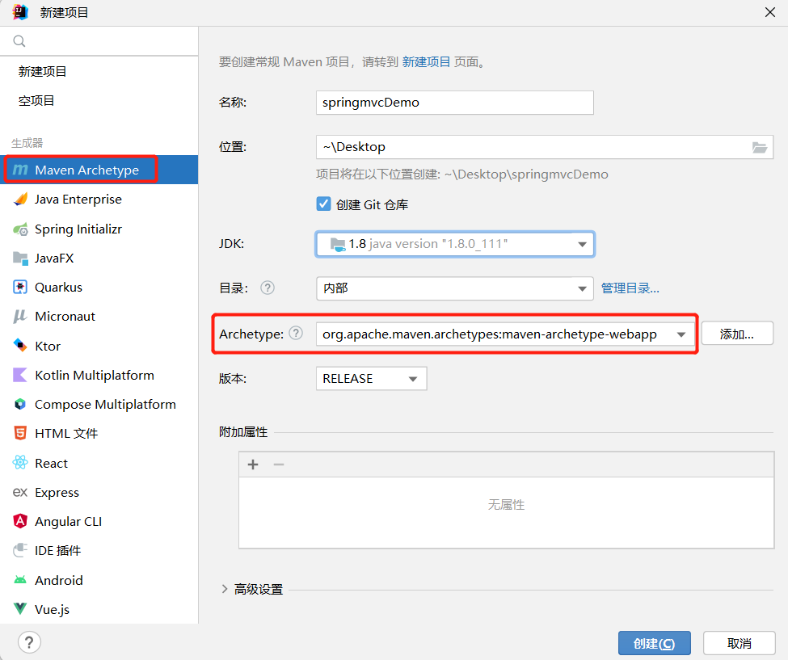
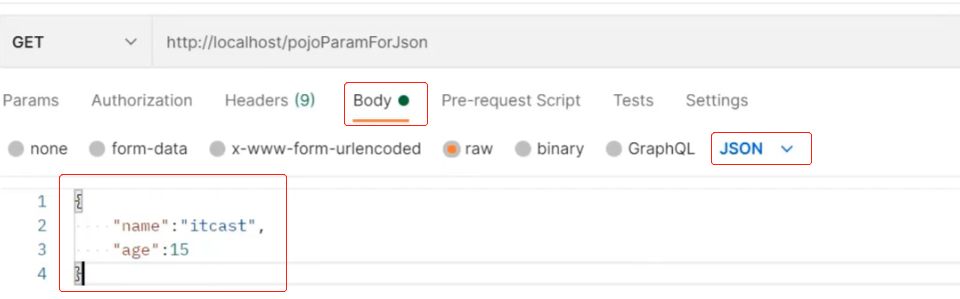
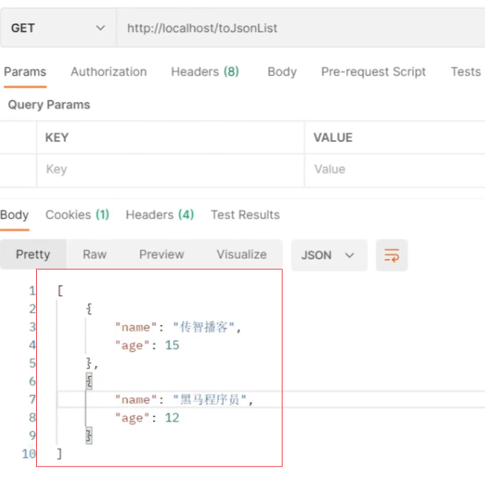
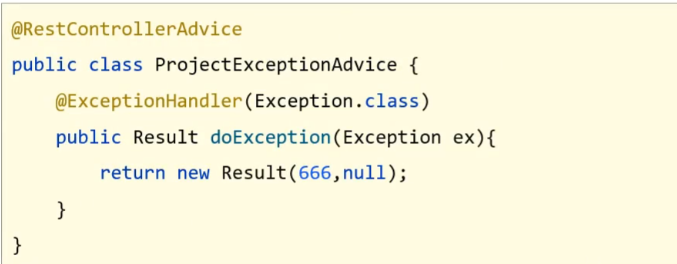
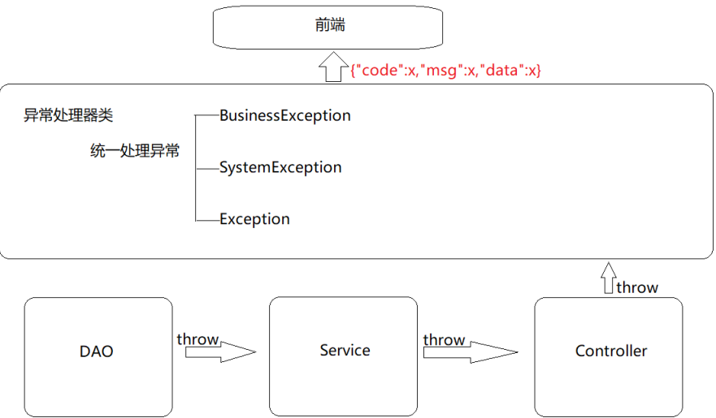
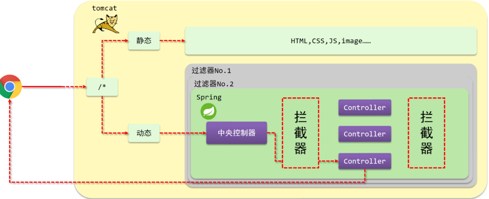
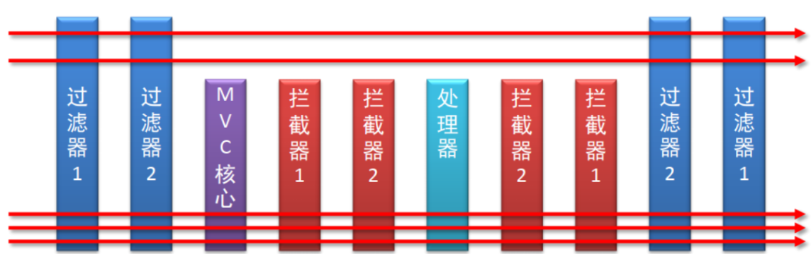
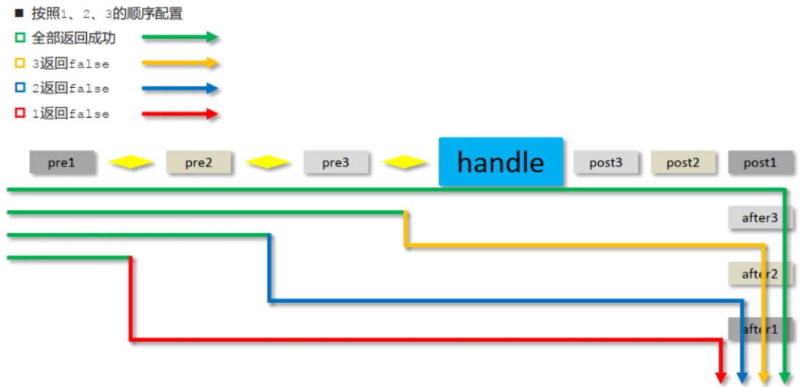

[toc]

# SpringMVC笔记 版本5.3.22

该笔记有一部分来自于黑马程序员SpringMVC课程视频中的课件资料。

## 1. SpringMVC介绍

* SpringMVC是隶属于Spring框架的一部分，主要是用来进行Web开发，对Servlet进行了封装。
* SpringMVC主要作用就是用来接收前端请求和数据，经过处理并将处理的结果响应给前端。

## 2. SpringMVC入门案例（注解和配置类的形式）

① 创建maven web工程

1. 使用IDEA创建maven web工程。
2. maven模板选择org.apache.maven.archetypes:maven-archetype-webapp。



PS: 由于maven-archetype-webapp模板目录不完整，缺少java和resources目录，所以需要手动创建目录。


② 在pom.xml中添加springmvc依赖和tomcat插件

```xml
<!-- springmvc的两个依赖 -->
<dependency>
      <groupId>org.springframework</groupId>
      <artifactId>spring-webmvc</artifactId>
      <version>5.2.1.RELEASE</version>
</dependency>
<dependency>
    <groupId>javax.servlet</groupId>
    <artifactId>javax.servlet-api</artifactId>
    <version>4.0.1</version>
    <!-- 
        设置该依赖只在编译和测试的时候使用 
        运行的时候直接用tomcat7-maven-plugin插件的javax.servlet-api。避免冲突
    -->
    <scope>provided</scope>
</dependency>


<!-- tomcat-maven插件：在maven工程中内嵌tomcat -->
<build>
    <plugins>
        <plugin>
        <groupId>org.apache.tomcat.maven</groupId>
        <artifactId>tomcat7-maven-plugin</artifactId>
        <version>2.1</version>
        <!-- 设置tomcat的启动端口号为8080,上下文映射路径为/ -->
        <configuration>
            <port>8080</port>
            <path>/</path>
            <uriEncoding>UTF-8</uriEncoding><!--设置编解码字符集-->
        </configuration>
        </plugin>
    </plugins>
</build>
```

* SpringMVC是基于Spring的，在pom.xml只导入了`spring-webmvc`jar包的原因是它会自动依赖spring相关坐标。
* tomcat7-maven-plugin：在maven工程中内嵌tomcat。让项目在内嵌tomcat中运行。
* `<scope>provided</scope>` : 1.默认是compile,在编译、测试、运行时均有效。2.设置provided表示该依赖只在编译和测试的时候有效。3.运行的时候直接用tomcat7-maven-plugin插件中的servlet-api包。避免依赖和插件的servlet-api包发生冲突。

<font color="red">注意：目前IDEA只对tomcat7插件进行了适配。</font>

③ 创建springMVC配置类,扫描com.example.controller包下的所有类

* PS: springmvc相关的bean，大都在controller包下。
* @Controller注解类，@RequestMapping注解方法都是springmvc相关的bean。

```java
@Configuration
@ComponentScan("com.example.controller")
public class SpringMVCConfig {
    //SpringMVC配置类
}
```

④ 创建servlet web容器配置类,用于代替web.xml

1. 将webapp/WEB-INF/web.xml删除
2. 创建自定义servlet web容器配置类.该类继承AbstractDispatcherServletInitializer类,重写其中几个方法。
3. AbstractDispatcherServletInitializer类用于创建Servlet容器时，并加载springmvc相关的bean到servlet容器中。

```java
import org.springframework.web.context.WebApplicationContext;
import org.springframework.web.context.support.AnnotationConfigWebApplicationContext;
import org.springframework.web.servlet.support.AbstractDispatcherServletInitializer;
//自定义servlet web容器配置类
public class ServletContainersInitConfig extends AbstractDispatcherServletInitializer {
    //初始化servlet web容器。并且容器加载SpringMVC配置类
    protected WebApplicationContext createServletApplicationContext() {
        //初始化servlet web容器
        AnnotationConfigWebApplicationContext ctx = new AnnotationConfigWebApplicationContext();
        //加载SpringMvcConfig配置类
        ctx.register(SpringMVCConfig.class);
        return ctx;
    }

    //拦截所有请求，并将所有请求交给spring mvc处理
    // "/" 表示所有，但不包括.jsp/.html等文件; "/*" 表示所有，包括.jsp/.html等文件
    protected String[] getServletMappings() {
        return new String[]{"/"};
    }

    protected WebApplicationContext createRootApplicationContext() {
        return null;
    }
}
```

⑤ 创建Controller类
```java
@Controller
@RequestMapping("/user")
public class UserController {
    @RequestMapping("/save")
    @ResponseBody
    public String save(){
        System.out.println("user save ...");
        return "user save ...";
    }
}
```

⑥ 配置tomcat运行环境


maven运行命令：`tomcat7:run`,意思是启动maven工程内嵌的tomcat服务器。把项目放在内嵌tomcat中运行。

⑦ 启动运行项目，浏览器访问地址 localhost:8080/user/save


### 1. AbstractDispatcherServletInitializer类描述

* AbstractDispatcherServletInitializer类是SpringMVC提供的快速初始化Web3.0容器的抽象类
* AbstractDispatcherServletInitializer提供了三个接口方法供用户实现
  * createServletApplicationContext方法：创建Servlet容器时，加载SpringMVC对应的bean并放入WebApplicationContext对象范围中，而WebApplicationContext的作用范围为ServletContext范围，即整个web容器范围
  * getServletMappings方法，设定SpringMVC对应的请求映射路径，即SpringMVC拦截哪些请求
  * createRootApplicationContext方法，如果创建Servlet容器时需要加载非SpringMVC对应的bean,使用当前方法进行，使用方式和createServletApplicationContext相同。
  * createRootApplicationContext用来加载Spring环境

### 2. @Controller @RequestMapping @ResponseBody注解

@Controller
位置：SpringMVC控制器类上方定义
作用：设定为SpringMVC的控制器bean

@RequestMapping
位置：SpringMVC控制器类或方法上方定义
作用：设置当前控制器方法的请求访问路径

@ResponseBody
位置：SpringMVC控制器类或方法定义上方
作用：设置当前控制器方法响应内容为当前返回值，无需解析

PS: 
* springmvc默认会解析方法返回值。并把返回值当成页面名称在项目中进行查找并返回页面给前端。
* @ResponseBody注解会让springmvc不解析方法返回值，直接把方法返回值给前端。


## 3. SpringMVC工作流程

SpringMVC的工作流程总共分两个阶段来分析，分别是启动web服务器初始化过程和单次请求过程。


### 1 启动web服务器初始化过程

1. 服务器启动，执行ServletContainersInitConfig类，初始化web容器
    * 功能类似于以前的web.xml

2. 执行createServletApplicationContext方法，创建了WebApplicationContext对象
    * 该方法加载SpringMVC的配置类来初始化SpringMVC的容器

3. 加载Spring配置类
```java
@Configuration
@ComponentScan("com.example.controller")
public class SpringMVCConfig {
    //SpringMVC配置类
}
```

4. 执行@ComponentScan加载对应的bean
   * 扫描指定包及其子包下所有类上的注解，如Controller类上的@Controller，@RequestMapping注解等。
5. 加载UserController，每个@RequestMapping的名称对应一个具体的方法。例如下面方法中就建立了`/user/save`映射路径和save方法的对应关系
```java
@Controller
@RequestMapping("/user")
public class UserController {
    @RequestMapping("/save")
    @ResponseBody
    public String save(){
        System.out.println("user save ...");
        return "user save ...";
    }
}
```

6. 执行getServletMappings方法，设定SpringMVC拦截请求的路径规则
```java
//  /代表所拦截请求的路径规则，只有被拦截后才能交给SpringMVC来处理请求
protected String[] getServletMappings() {
    return new String[]{"/"};
}
```

### 2 单次请求过程

1. 发送请求`http://localhost/user/save`
2. web容器发现该请求满足SpringMVC拦截规则，将请求交给SpringMVC处理
3. 解析请求路径/user/save
4. 由/user/saveq匹配执行对应的方法save()
   * 上面的第五步已经将请求路径和方法建立了对应关系，通过/user/save就能找到对应的save方法
5. 执行save()方法
6. 检测到方法有@ResponseBody注解。则直接将save()方法的返回值作为响应体返回给请求方。

## 4. SpringMVC的请求与响应

* SpringMVC是web层的框架，主要的作用是接收请求、接收数据、响应结果。
* 接收请求：设置请求映射路径,用于匹配前端的请求。
* 接收数据：设置请求参数，来接受请求传递的数据。
* 响应结果：请求方法处理后的返回值包装成响应结果，返回给前端。

### 1 设置请求映射路径

设置请求映射路径,用于匹配前端的请求。

如下例：
```java
@Controller
@RequestMapping("/user")
public class UserController {
    @RequestMapping("/save")
    @ResponseBody
    public String save(){
        System.out.println("user save ...");
        return "user save ...";
    }
    
    @RequestMapping("/delete")
    @ResponseBody
    public String save(){
        System.out.println("user delete ...");
        return "user delete ...";
    }
}
```

注意:
* 当类上和方法上都添加了`@RequestMapping`注解，前端发送请求的时候，要和两个注解的value值相加匹配才能访问到。
* @RequestMapping注解value属性前面加不加`/`都可以

### 2 设置请求参数

设置请求参数，来接受请求传递的数据。目前比较常见的两种请求方式为GET和POST方式。

#### 1 GET方式设置请求参数

请求路径：`http://localhost/commonParam?name=xiaoming&age=15`

```java
@Controller
public class UserController {

    @RequestMapping("/commonParam")
    @ResponseBody
    public String commonParam(String name,int age){
        System.out.println("普通参数传递 name ==> "+name);
        System.out.println("普通参数传递 age ==> "+age);
        return "{'module':'commonParam'}";
    }
}
```

#### 2 POST方式设置请求参数

请求路径：`http://localhost/commonParam`
POST请求的参数通过表单传递，不直接写在请求路径上。


```java
@Controller
public class UserController {
    @RequestMapping("/commonParam")
    @ResponseBody
    public String commonParam(String name,int age){
        System.out.println("普通参数传递 name ==> "+name);
        System.out.println("普通参数传递 age ==> "+age);
        return "{'module':'commonParam'}";
    }
}
```  

若请求方法参数接受中文数据，出现乱码问题?

* 解决方法：在自定义servlet配置类中设置过滤器。进行编码处理
```java
public class ServletContainersInitConfig extends AbstractDispatcherServletInitializer {
    //..............省略

    //编码设置为UTF-8。中文乱码处理
    @Override
    protected Filter[] getServletFilters() {
        CharacterEncodingFilter filter = new CharacterEncodingFilter();
        filter.setEncoding("UTF-8");
        return new Filter[]{filter};
    }
}
```

###  3 接收五种类型请求参数

常见的请求参数种类有：
* 普通参数
* POJO类型参数
* 嵌套POJO类型参数
* 数组类型参数
* 集合类型参数

#### 1. 接收普通参数与@RequestParam注解

```
请求路径
http://localhost/common?name=张三&age=18
```

后台接收参数:

```java
@RequestMapping("/common")
@ResponseBody
public String common(String userName , int age){
    System.out.println("普通参数传递 userName ==> "+userName);
    System.out.println("普通参数传递 age ==> "+age);
    return "{'module':'common'}";
}
```

上面例子中的请求参数和方法形参名称一致，会导致形参无法接收到请求参数值。该如何解决？

解决方案:使用@RequestParam注解

```java
@RequestMapping("/common")
    @ResponseBody
    public String common(@RequestParam("name") String userName , int age){
        System.out.println("普通参数传递 userName ==> "+userName);
        System.out.println("普通参数传递 age ==> "+age);
        return "{'module':'common'}";
    }
```

@RequestParam注解：
位置：方法形参前面定义。
作用：绑定请求参数与方法形参间的关系


#### 2. 接收POJO类型参数

* POJO参数：只要请求参数名与形参对象中的属性名一一对应，定义POJO类型形参即可接收参数

```java
// User类
public class User {
    private String name;
    private int age;
}
```

请求路径：`http://localhost/pojoParam?name=张三&age=18`

后台接收参数:
```java
//POJO参数：请求参数与形参对象中的属性一一对应即可完成参数传递
@RequestMapping("/pojoParam")
@ResponseBody
public String pojoParam(User user){
    System.out.println("pojo参数传递 user ==> "+user);
    return "{'module':'pojo param'}";
}
```

**注意:**
* 请求参数属性的名称要和POJO对象中属性的名称一致，否则无法封装。

#### 3 接收嵌套POJO类型参数

如果POJO对象中嵌套了其他的POJO类，如

```java
public class Address {
    private String province;
    private String city;
}
// User类嵌套了Address类
public class User {
    private String name;
    private int age;
    private Address address;
}
```

* 嵌套POJO参数：请求参数名与形参对象属性名相同，按照对象层次结构关系即可接收嵌套POJO属性参数

发送请求和参数:


后台接收参数:
```java
//POJO参数：请求参数与形参对象中的属性对应即可完成参数传递
@RequestMapping("/pojoContainPojoParam")
@ResponseBody
public String pojoParam(User user){
    System.out.println("pojo参数传递 user ==> "+user);
    return "{'module':'pojo param'}";
}
```

**注意:**
请求参数key的名称要和POJO中属性的名称一致，否则无法封装。

#### 4 接收数组类型参数

* 数组参数：请求参数名与形参对象属性名相同且请求参数为多个，定义数组类型即可接收参数

发送请求和参数:

```
http://localhost/arrayParam?likes=游戏&likes=电影&likes=音乐
```

后台接收参数:

```java
//数组参数：同名请求参数可以直接映射到对应名称的形参数组对象中
//上面请求路径中的3个请求参数key都是likes
@RequestMapping("/arrayParam")
@ResponseBody
public String arrayParam(String[] likes){
    System.out.println("数组参数传递 likes ==> "+ Arrays.toString(likes));
    return "{'module':'array param'}";
}
```

#### 5 接收集合类型参数

发送请求和参数:

```
http://localhost/arrayParam?likes=游戏&likes=电影&likes=音乐
```

后台接收参数:

```java
//集合参数：多个同名请求参数可以使用@RequestParam注解映射到对应名称的集合对象中作为数据
@RequestMapping("/listParam")
@ResponseBody
public String listParam(@RequestParam List<String> likes){
    System.out.println("集合参数传递 likes ==> "+ likes);
    return "{'module':'list param'}";
}
```

**注意**
* 集合保存普通参数：请求参数名与形参集合对象名相同且请求参数为多个，@RequestParam绑定参数关系。
* 对于简单数据类型使用数组会比集合更简单些。


### 4 接收JSON类型请求参数

对于JSON数据类型，我们常见的有三种:
- json普通数组 ["value1","value2","value3"] 
- json对象     {key1:value1,key2:value2}
- json对象数组 [{key1:value1,...},{key2:value2,...}]

#### 1 接收json数组数据

① 步骤1:pom.xml添加json处理依赖

SpringMVC默认使用的是jackson来处理json的转换，所以需要在pom.xml添加jackson依赖
```xml
<dependency>
    <groupId>com.fasterxml.jackson.core</groupId>
    <artifactId>jackson-databind</artifactId>
    <version>2.9.0</version>
</dependency>
```

② 步骤2:开启SpringMVC注解支持
在SpringMVC的配置类中开启SpringMVC的注解支持，该注解包含了将JSON转换成对象的功能。

```java
@Configuration
@ComponentScan("com.example.controller")
//开启json数据类型自动转换
@EnableWebMvc
public class SpringMvcConfig {
}
```

③ 步骤3:设置请求参数，参数格式JSON数组


④ 步骤4:在方法形参前添加@RequestBody
```java
//使用@RequestBody注解将外部传递的json数组数据映射到形参的集合对象中作为数据
@RequestMapping("/listParamForJson")
@ResponseBody
public String listParamForJson(@RequestBody List<String> likes){
    System.out.println("list common(json)参数传递 list ==> "+likes);
    return "{'module':'list common for json param'}";
}
```

⑤ 步骤5:启动运行程序，请求测试。

#### 2 接收JSON对象数据

请求和数据的发送:
```json
//json对象数据
{
	"name":"itcast",
	"age":15
}
```



后端接收数据：

```java
@RequestMapping("/pojoParamForJson")
@ResponseBody
// 注意User对象中有name和age属性
public String pojoParamForJson(@RequestBody User user){
    System.out.println("pojo(json)参数传递 user ==> "+user);
    return "{'module':'pojo for json param'}";
}
```

启动程序访问测试

由于User对象中有name和age属性。因此json对象中的name和age属性会转换为User对象中的name和age属性。


#### 3 接收JSON对象数组

请求和数据的发送:
```json
[
    {"name":"itcast","age":15},
    {"name":"itheima","age":12}
]
```

后端接收数据:
```java
@RequestMapping("/listPojoParamForJson")
@ResponseBody
// 注意User对象中有name和age属性
public String listPojoParamForJson(@RequestBody List<User> list){
    System.out.println("list pojo(json)参数传递 list ==> "+list);
    return "{'module':'list pojo for json param'}";
}
```

启动程序访问测试

#### 小结：@EnableWebMvc，@RequestBody注解

@EnableWebMvc注解
位置：SpringMVC配置类上方定义
作用：开启SpringMVC多项辅助功能，包含json对象转换，日期字符串转换等

@RequestBody注解
位置：方法形参前面定义
作用：将请求中请求体所包含的数据传递给请求参数，此注解一个方法只能使用一次

@RequestBody与@RequestParam区别
* @RequestParam注解用于接收url地址传参，表单传参【application/x-www-form-urlencoded】
* @RequestBody注解用于接收json数据【application/json】
* 如果发送json格式数据，则用@RequestBody接收请求参数
* 如果发送非json格式数据，则用@RequestParam接收请求参数

<font color="red">
注意:SpringMVC的配置类把@EnableWebMvc当做标配配置上去，不要省略。
</font>

### 5 接受日期类型请求参数与@DateTimeFormat注解

① 请求路径：
```
http://localhost/dataParam?date1=2088/08/08&date2=2088-08-08&date3=2088/08/08 8:08:08
```

② 方法接受日期参数
```java
@RequestMapping("/dataParam")
@ResponseBody
public String dataParam(Date date1,
    @DateTimeFormat(pattern="yyyy-MM-dd") Date date2,
    @DateTimeFormat(pattern="yyyy/MM/dd HH:mm:ss") Date date3){

    System.out.println("参数传递 date ==> "+date);
	System.out.println("参数传递 date1(yyyy-MM-dd) ==> "+date1);
	System.out.println("参数传递 date2(yyyy/MM/dd HH:mm:ss) ==> "+date2);
    return "{'module':'data param'}";
}
```

* Date类型形参可以接收 'yyyy/MM/dd' 格式日期参数。
* SpringMVC默认支持的字符串转日期的格式为yyyy/MM/dd。其他日期格式字符串，Date类型形参无法接受。
* @DateTimeFormat注解通过设置日期格式，可以给Date类型形参传递请求参数。

@DateTimeFormat注解：
位置：方法形参前面
作用：设定日期时间型数据格式
相关属性：pattern：指定日期时间格式字符串


### 6 SpringMVC的响应

SpringMVC的响应，主要就包含两部分内容：
* 响应页面
* 响应数据（文本数据，json数据）


#### 响应页面

```java
@Controller
public class UserController {
    @RequestMapping("/toJumpPage")
    //注意
    //1.此处不能添加@ResponseBody注解,如果加了会解析page.jsp,找到同名页面返回前端。
    //2.方法需要返回String
    public String toJumpPage(){
        System.out.println("跳转页面");
        return "page.jsp";
    }
}
```

#### 响应文本数据

```java
@Controller
public class UserController {
   	@RequestMapping("/toText")
	//注意@ResponseBody注解不能省略，如果省略了,会把response text作为页面名称去查找
    //如果没有对应名称的页面，会返回404错误
    @ResponseBody
    public String toText(){
        System.out.println("返回纯文本数据");
        return "response text";
    }
}
```

#### 响应JSON对象数据

```java
@Controller
public class UserController {
    @RequestMapping("/toJsonPOJO")
    //@ResponseBody注解会把User类对象，转换为json数据格式响应
    //需要提前开启@EnableWebMvc注解
    @ResponseBody
    public User toJsonPOJO(){
        System.out.println("返回json对象数据");
        User user = new User();
        user.setName("itcast");
        user.setAge(15);
        return user;
    }
}
```

* 若返回值为实体类对象，可实现返回实体对象的json数据，需要依赖@ResponseBody注解和@EnableWebMvc注解。


#### 响应JSON对象数组

```java
@Controller
public class UserController {
    @RequestMapping("/toJsonList")
    @ResponseBody
    public List<User> toJsonList(){
        User user1 = new User();
        user1.setName("传智播客");
        user1.setAge(15);
        User user2 = new User();
        user2.setName("黑马程序员");
        user2.setAge(12);
        List<User> userList = new ArrayList<User>();
        userList.add(user1);
        userList.add(user2);
        return userList;
    }
}
```



#### 小结：@ResponseBody注解

@ResponseBody注解：
* 该注解可以写在类上或者方法上
* 写在类上就是该类中的所有方法都有@ReponseBody功能
* 当方法上有@ReponseBody注解后
  * 方法的返回值为字符串，会将其作为文本内容直接响应给前端
  * 方法的返回值为对象，会将对象转换成JSON响应给前端


## 5 RESTful风格

### 1 RESTful介绍

RESTful是一种新的请求方式风格。

RESTful风格与传统风格的区别:
  * 传统风格请求资源描述形式
    * `http://localhost/user/getById?id=1` 查询id为1的用户信息
    * `http://localhost/user/saveUser` 保存用户信息
  * RESTful风格请求资源描述形式
    * `http://localhost/user/1` 
    * `http://localhost/user`

RESTful风格特点:
* 传统方式一般是一个请求url对应一种操作，这样做不仅麻烦，也不安全，因为光看请求URL就能猜出具体操作。
* RESTful风格形式，请求地址简单化，并且光看请求URL很难猜出来该URL的具体功能。隐藏资源的访问行为，无法通过地址得知对资源是何种操作

RESTful风格请求分类:
* RESTful风格下请求的方式不同，代表不同的具体操作。
* `http://localhost/users`	  查询全部用户信息 GET（查询）
* `http://localhost/users/1`  查询指定用户信息 GET（查询）
* `http://localhost/users`    添加用户信息    POST（新增/保存）
* `http://localhost/users`    修改用户信息    PUT（修改/更新）
* `http://localhost/users/1`  删除用户信息    DELETE（删除）
* 发送GET请求是用来做查询
* 发送POST请求是用来做新增
* 发送PUT请求是用来做修改
* 发送DELETE请求是用来做删除

<font color="red">注意：RESTful风格是约定方式，约定不是规范，可以打破，所以称RESTful风格，而不是RESTful规范。</font>

### 2 RESTful案例及其改进

```java
@Controller
public class BookController {
    //新增
    @RequestMapping(value = "/books",method = RequestMethod.POST)
    @ResponseBody
    public String save(@RequestBody Book book){
        System.out.println("book save..." + book);
        return "{'module':'book save'}";
    }

    //删除
    @RequestMapping(value = "/books/{id}",method = RequestMethod.DELETE)
    @ResponseBody
    public String delete(@PathVariable Integer id){
        System.out.println("book delete..." + id);
        return "{'module':'book delete'}";
    }

    //修改
    @RequestMapping(value = "/books",method = RequestMethod.PUT)
    @ResponseBody
    public String update(@RequestBody Book book){
        System.out.println("book update..." + book);
        return "{'module':'book update'}";
    }

    //查询
    @RequestMapping(value = "/books/{id}",method = RequestMethod.GET)
    @ResponseBody
    public String getById(@PathVariable Integer id){
        System.out.println("book getById..." + id);
        return "{'module':'book getById'}";
    }

    //查询全部
    @RequestMapping(value = "/books",method = RequestMethod.GET)
    @ResponseBody
    public String getAll(){
        System.out.println("book getAll...");
        return "{'module':'book getAll'}";
    }
}
```

上面案例中，有些代码的重复性太高。下面是改进后的案例

```java
@RestController   //@Controller + ReponseBody
@RequestMapping("/books")
public class BookController {
    //新增
	//@RequestMapping(method = RequestMethod.POST)
    @PostMapping
    public String save(@RequestBody Book book){
        System.out.println("book save..." + book);
        return "{'module':'book save'}";
    }
    //删除
    //@RequestMapping(value = "/{id}",method = RequestMethod.DELETE)
    @DeleteMapping("/{id}")
    public String delete(@PathVariable Integer id){
        System.out.println("book delete..." + id);
        return "{'module':'book delete'}";
    }
    //修改
    //@RequestMapping(method = RequestMethod.PUT)
    @PutMapping
    public String update(@RequestBody Book book){
        System.out.println("book update..." + book);
        return "{'module':'book update'}";
    }
    //查询
    //@RequestMapping(value = "/{id}",method = RequestMethod.GET)
    @GetMapping("/{id}")
    public String getById(@PathVariable Integer id){
        System.out.println("book getById..." + id);
        return "{'module':'book getById'}";
    }
    //查询全部
    //@RequestMapping(method = RequestMethod.GET)
    @GetMapping
    public String getAll(){
        System.out.println("book getAll...");
        return "{'module':'book getAll'}";
    }
    
}
```

#### @RestController @GetMapping @PostMapping @PutMapping @DeleteMapping注解

@RestController注解
类型: 类注解。
位置: 定义类上方。
作用: 等同于@Controller与@ResponseBody两个注解组合功能。

@GetMapping @PostMapping @PutMapping @DeleteMapping注解
类型: 方法注解。
位置: 定义方法上方。
作用: 每种对应一个请求动作，例如@GetMapping对应GET请求。


### 3 @PathVariable注解，接收请求路径参数

@PathVariable注解
类型: 形参注解。
位置: 定义形参前面。
作用: 绑定路径参数与处理器方法形参间的关系，要求路径参数名与形参名一一对应。

请求路径：`http://localhost/users/1`
请求路径：`http://localhost/users/1/tom`

后台方法：
```java
@Controller
public class UserController {
    //单个请求路径参数
	@RequestMapping(value = "/users/{id}",method=RequestMethod.DELETE)
    @ResponseBody
    public String delete(@PathVariable Integer id) {
        System.out.println("user delete..." + id);
        return "{'module':'user delete'}";
    }
    //多个请求路径参数
	@RequestMapping(value = "/users/{id}/{name}",method=RequestMethod.DELETE)
    @ResponseBody
    public String delete(@PathVariable Integer id,@PathVariable String name) {
        System.out.println("user delete..." + id+","+name);
        return "{'module':'user delete'}";
    }
}
```

<font color="red">@PathVariable注解可以把请求路径上的参数赋值到方法形参上。</font>

> 若请求路径参数与方法形参不同名？

```java
@Controller
public class UserController {
    //此时请求路径参数名称为id,方法形参名称为userId
    //可以通过@PathVariable注解设置表达式来匹配请求路径参数和方法形参
	@RequestMapping(value = "/users/{id}",method=RequestMethod.DELETE)
    @ResponseBody
    public String delete(@PathVariable("id") Integer userId) {
        System.out.println("user delete..." + id);
        return "{'module':'user delete'}";
    }
}
```

* 可以通过@PathVariable注解设置表达式来匹配请求路径参数和方法形参

#### @RequestBody、@RequestParam、@PathVariable注解的区别？

* 区别
  * @RequestParam用于接收url地址传参或表单传参。
  * @RequestBody用于接收json数据。
  * @PathVariable用于接收路径参数，使用{参数名称}描述路径参数。
* 用法
  * 后期开发中，发送请求参数超过1个时，以json格式为主，@RequestBody应用较广。
  * 如果发送非json格式数据，选用@RequestParam接收请求参数。
  * 采用RESTful进行开发，当参数数量较少时，例如1个，可以采用@PathVariable接收请求路径变量，通常用于传递id值。

## 6. SpringMVC设置静态资源放行

请求路径：`http://localhost/pages/books.html`

当访问上面的路径的时候，SpringMVC根据/pages/books.html请求路径去controller找对应的方法，找不到会报404的错误。

> SpringMVC为什么会拦截静态资源呢?

之前在自定义servlet web容器配置类中，设置了拦截所有请求
```java
//自定义servlet web容器配置类
public class ServletContainersInitConfig extends AbstractDispatcherServletInitializer {
    //.......................省略
    
    //拦截所有请求，并将所有请求交给spring mvc处理
    // "/" 满足/pages/books.html规则
    protected String[] getServletMappings() {
        return new String[]{"/"};
    }
}
```

> SpringMVC如何设置静态资源放行?

新建SpringMvcSupport配置类，继承WebMvcConfigurationSupport类。设置静态资源放行
```java
@Configuration
public class SpringMvcSupport extends WebMvcConfigurationSupport {
    //设置静态资源访问过滤，当前类需要设置为配置类，并被扫描加载
    @Override
    protected void addResourceHandlers(ResourceHandlerRegistry registry) {
        //当访问/pages/????时候，从/pages目录下查找内容
        registry.addResourceHandler("/pages/**").addResourceLocations("/pages/");
        registry.addResourceHandler("/js/**").addResourceLocations("/js/");
        registry.addResourceHandler("/css/**").addResourceLocations("/css/");
        registry.addResourceHandler("/plugins/**").addResourceLocations("/plugins/");
    }
}
```

* 该配置类是在config目录下，SpringMvcConfig配置类扫描的是controller包，所以该配置类还未生效，要想生效需要对SpringMvcConfig配置类进行修改。

```java
@Configuration
@ComponentScan({"com.itheima.controller","com.itheima.config"})
@EnableWebMvc
public class SpringMvcConfig {
}
```


## 7. SpringMVC 设置统一响应结果

随着业务的增长，我们需要返回的数据类型会越来越多。对于前端开发人员在解析数据的时候就比较凌乱了，所以对于前端来说，如果后台能够返回一个统一的数据结果，前端在解析的时候就可以按照一种方式进行解析。开发就会变得更加简单。

统一响应结果封装思路分析为:
* 为了封装返回的结果数据:创建响应结果类，封装响应数据到data属性中
* 为了封装返回的数据是何种操作及是否操作成功:封装操作结果到code属性中
* 操作失败后为了封装返回的错误信息:封装特殊消息到message(msg)属性中


① 步骤1:创建Result统一响应结果类

```java
public class Result {
    //响应内容数据
    private Object data;
    //响应结果编码，用于区分操作。可以用简化配置0或1表示成功失败
    private Integer code;
    //响应结果消息消息，可选属性
    private String msg;

    public Result() {
    }
    public Result(Integer code,Object data) {
        this.data = data;
        this.code = code;
    }
    public Result(Integer code, Object data, String msg) {
        this.data = data;
        this.code = code;
        this.msg = msg;
    }
	//setter...getter...省略
}
```

② 步骤2:定义返回码Code类

```java
//状态码
public class Code {
    public static final Integer SAVE_OK = 20011;
    public static final Integer DELETE_OK = 20021;
    public static final Integer UPDATE_OK = 20031;
    public static final Integer GET_OK = 20041;
    public static final Integer SAVE_ERR = 20010;
    public static final Integer DELETE_ERR = 20020;
    public static final Integer UPDATE_ERR = 20030;
    public static final Integer GET_ERR = 20040;
}
```

③ 步骤3:修改Controller类的返回值

```java
//统一每个方法的响应结果
@RestController
@RequestMapping("/books")
public class BookController {
    @Autowired
    private BookService bookService;

    @PostMapping
    public Result save(@RequestBody Book book) {
        boolean flag = bookService.save(book);
        return new Result(flag ? Code.SAVE_OK:Code.SAVE_ERR,flag);
    }

    @PutMapping
    public Result update(@RequestBody Book book) {
        boolean flag = bookService.update(book);
        return new Result(flag ? Code.UPDATE_OK:Code.UPDATE_ERR,flag);
    }

    @DeleteMapping("/{id}")
    public Result delete(@PathVariable Integer id) {
        boolean flag = bookService.delete(id);
        return new Result(flag ? Code.DELETE_OK:Code.DELETE_ERR,flag);
    }

    @GetMapping("/{id}")
    public Result getById(@PathVariable Integer id) {
        Book book = bookService.getById(id);
        Integer code = book != null ? Code.GET_OK : Code.GET_ERR;
        String msg = book != null ? "" : "数据查询失败，请重试！";
        return new Result(code,book,msg);
    }
}
```

④ 步骤4:启动服务测试

此时前端可以根据返回的结果，先从中获取code,根据code判断，如果成功则取data属性的值，如果失败，则取msg中的值做提示。

## 8. SpringMVC 设置统一异常处理

异常的种类及出现异常的原因:
- 框架内部抛出的异常：因使用不合规导致
- 数据层抛出的异常：因外部服务器故障导致（例如：服务器访问超时）
- 业务层抛出的异常：因业务逻辑书写错误导致（例如：遍历业务书写操作，导致索引异常等）
- 表现层抛出的异常：因数据收集、校验等规则导致（例如：不匹配的数据类型间导致异常）
- 工具类抛出的异常：因工具类书写不严谨不够健壮导致（例如：必要释放的连接长期未释放等）

SpringMVC对于异常的统一处理已经提供了一套解决方案:
* 自定义异常处理器: 集中的、统一的处理项目中出现的异常。
* 自定义异常处理器需要添加@RestControllerAdvice注解修饰



### 1 自定义异常处理器的使用

① 步骤1:创建自定义异常处理器类，并将异常内容封装为统一响应结果

```java
//@RestControllerAdvice用于标识当前类为REST风格对应的异常处理器
@RestControllerAdvice
public class ProjectExceptionAdvice {
    //除了自定义的异常处理器，保留对Exception类型的异常处理，用于处理非预期的异常
    //可以针对其他特殊异常进行专门异常处理。这个方法是针对Exception的异常处理
    @ExceptionHandler(Exception.class)
    public Result doException(Exception ex){
      	System.out.println("已发生异常");
        return new Result(666,null,"已发生异常");
    }
}
```

<font color="red">确保SpringMvcConfig能够扫描到异常处理器类</font>

② 步骤2：修改SpringMVC配置类，让其能扫描到异常处理类

```java
@Configuration
@ComponentScan({"com.example.controller","com.example.util"})
@EnableWebMvc
public class SpringMVCConfig {
    //SpringMVC配置类
}
```

③ 步骤3:让程序抛出异常

```java
@GetMapping("/{id}")
public Result getById(@PathVariable Integer id) {
    //抛出异常
  	int i = 1/0;
    Book book = bookService.getById(id);
    Integer code = book != null ? Code.GET_OK : Code.GET_ERR;
    String msg = book != null ? "" : "数据查询失败，请重试！";
    return new Result(code,book,msg);
}
```

④ 步骤4:运行程序，测试

至此，就算后台执行的过程中抛出异常，最终也能按照统一响结果格式返回给前端。

### 2 @RestControllerAdvice，@ExceptionHandler注解

@RestControllerAdvice注解（@ControllerAdvice + @ResponseBody + @Component）
类型: 类注解。
位置: 定义类上方。
作用: 为类做增强功能。

@ExceptionHandler 注解
类型: 方法注解。
位置: 专用于异常处理的控制器方法上方。
作用: 设置指定异常的处理方案，功能等同于控制器方法，出现异常后终止原始控制器执行,并转入当前方法执行。

**说明：** 此类方法可以根据处理的异常不同，制作多个方法分别处理对应的异常

### 3 自定义异常类 + 异常处理器

① 步骤1:自定义异常类

```java
//自定义异常处理器，用于封装异常信息，对异常进行分类
public class BusinessException extends RuntimeException{
    private Integer code;
    // message 和 cause 继承自RuntimeException类
    public Integer getCode() {
        return code;
    }
    public void setCode(Integer code) {
        this.code = code;
    }
    public BusinessException(Integer code, String message) {
        super(message);
        this.code = code;
    }
    public BusinessException(Integer code, String message, Throwable cause) {
        super(message, cause);
        this.code = code;
    }
}
```

**说明:**
* 让自定义异常类继承RuntimeException类的好处是，后期在抛出这两个异常的时候，就不用在try...catch...或throws了
* 自定义异常类中添加code属性的原因是为了更好的区分异常是来自哪个业务的

② 步骤2:将其他异常包成自定义异常

```java
public Book getById(Integer id) {
    //将可能出现的异常进行包装，转换成自定义异常并抛出
    try{
        int i = 1/0;
    }catch (Exception e){
        //抛出自定义异常
        throw new BusinessException(500,"服务器访问超时，请重试!",e);
    }
    return bookDao.getById(id);
}
```

具体的包装方式有：
* 方式一:`try{}catch(){}`在catch中重新throw我们自定义异常即可。
* 方式二:直接throw自定义异常即可

③ 步骤3:自定义异常处理器类中处理自定义异常

```java
//@RestControllerAdvice用于标识当前类为REST风格对应的异常处理器
@RestControllerAdvice
public class ProjectExceptionAdvice {
    //针对自定义异常BusinessException的异常处理
    @ExceptionHandler(BusinessException.class)
    public Result doBusinessException(BusinessException ex){
        //记录日志
        //发送消息给运维
        //发送邮件给开发人员,ex对象发送给开发人员
        return new Result(ex.getCode(),null,ex.getMessage());
    }

    //除了自定义的异常处理器，保留对Exception类型的异常处理，用于处理非预期的异常
    @ExceptionHandler(Exception.class)
    public Result doOtherException(Exception ex){
        //记录日志
        //发送消息给运维
        //发送邮件给开发人员,ex对象发送给开发人员
        return new Result(Code.SYSTEM_UNKNOW_ERR,null,"系统繁忙，请稍后再试！");
    }
}
```

④ 步骤4:运行程序

不管后台哪一层抛出异常，都会以我们与前端约定好的方式进行返回，前端只需要把信息获取到，根据返回的正确与否来展示不同的内容即可。

**小结**
上面例子的异常处理方式为:



## 9 SpringMVC拦截器

### 1 拦截器介绍

讲解拦截器之前，先看一张图:


(1)浏览器发送一个请求会先到Tomcat的web服务器
(2)Tomcat服务器接收到请求以后，会去判断请求的是静态资源还是动态资源
(3)如果是静态资源，会直接到Tomcat的项目部署目录下去直接访问
(4)如果是动态资源，就需要交给项目的后台代码进行处理
(5)在找到具体的方法之前，我们可以去配置过滤器(可以配置多个)，按照顺序进行执行
(6)然后进入到到中央处理器(SpringMVC中的内容)，SpringMVC会根据配置的规则进行拦截
(7)如果满足规则，则进行处理，找到其对应的controller类中的方法进行执行,完成后返回结果
(8)如果不满足规则，则不进行处理
(9)这个时候，如果我们需要在每个Controller方法执行的前后添加业务，具体该如何来实现?

这个就是拦截器要做的事。
* 拦截器（Interceptor）是一种动态拦截方法调用的机制，在SpringMVC中动态拦截控制器方法的执行。
* 作用:
  * 在指定的方法调用前后执行预先设定的代码
  * 阻止原始方法的执行
  * 总结：拦截器就是用来做增强控制器方法

> 拦截器和过滤器在作用和执行顺序上很相似,那么拦截器和过滤器之间的区别是什么?

* 归属不同：过滤器Filter属于Servlet技术，拦截器Interceptor属于SpringMVC技术
* 拦截内容不同：Filter对所有访问进行增强，Interceptor仅针对SpringMVC的访问进行增强



### 2 拦截器案例

① 步骤1:创建自定义拦截器类

自定义拦截器类实现HandlerInterceptor接口，重写HandlerInterceptor接口中的三个方法。

```java
@Component
//自定义拦截器类，实现HandlerInterceptor接口
//注意当前类必须受Spring容器控制
public class ProjectInterceptor implements HandlerInterceptor {
    @Override
    //原始方法调用前执行的内容
    public boolean preHandle(HttpServletRequest request, HttpServletResponse response, Object handler) throws Exception {
        System.out.println("preHandle...");
        return true;
    }

    @Override
    //原始方法调用后执行的内容
    public void postHandle(HttpServletRequest request, HttpServletResponse response, Object handler, ModelAndView modelAndView) throws Exception {
        System.out.println("postHandle...");
    }

    @Override
    //原始方法调用完成后执行的内容
    public void afterCompletion(HttpServletRequest request, HttpServletResponse response, Object handler, Exception ex) throws Exception {
        System.out.println("afterCompletion...");
    }
}
```

**注意:** 自定义拦截器类要被SpringMVC容器扫描到。

② 步骤2:把自定义拦截器类加入到SpringMvcSupport配置类中

```java
@Configuration
public class SpringMvcSupport extends WebMvcConfigurationSupport {
    @Autowired
    private ProjectInterceptor projectInterceptor;

    //springmvc对静态资源放行
    @Override
    protected void addResourceHandlers(ResourceHandlerRegistry registry) {
        //当访问/pages/????时候，从/pages目录下查找内容
        registry.addResourceHandler("/pages/**").addResourceLocations("/pages/");
        registry.addResourceHandler("/js/**").addResourceLocations("/js/");
        registry.addResourceHandler("/css/**").addResourceLocations("/css/");
        registry.addResourceHandler("/plugins/**").addResourceLocations("/plugins/");
    }

    //将自定义拦截器注册到SpringMvc配置类中
    @Override
    protected void addInterceptors(InterceptorRegistry registry) {
        //配置拦截器的拦截路径
        // 下面只会对/books路径及其子路径进行拦截
        registry.addInterceptor(projectInterceptor).addPathPatterns("/books","/books/*");
    }
}
```

③ 步骤3:SpringMVC添加SpringMvcSupport包扫描

```java
@Configuration
@ComponentScan({"com.itheima.controller","com.itheima.config"})
@EnableWebMvc
public class SpringMvcConfig{
}
```

④ 步骤4:运行程序测试

⑤ 可以简化SpringMvcSupport配置类的编写

SpringMvcConfig配置类可以代替SpringMvcSupport配置类。之后就不用再写SpringMvcSupport类了。
```java
@Configuration
@ComponentScan({"com.itheima.controller"})
@EnableWebMvc
//实现WebMvcConfigurer接口可以简化开发，但具有一定的侵入性
public class SpringMvcConfig implements WebMvcConfigurer {
    @Autowired
    private ProjectInterceptor projectInterceptor;

    @Override
    public void addInterceptors(InterceptorRegistry registry) {
        //配置拦截器的拦截路径
        registry.addInterceptor(projectInterceptor).addPathPatterns("/books","/books/*");
    }
}
```

### 3 拦截器的执行流程


* 当有拦截器后，请求会先进入preHandle方法
    * 如果方法返回true，则放行继续执行后面的处理方法和后面的方法
    * 如果返回false，则直接跳过后面方法的执行。


### 4 拦截器的处理方法

#### 前置处理方法

前置处理方法：原始方法之前运行preHandle

```java
//request:请求对象
//response:响应对象
//handler:被调用的处理器对象，本质上是一个方法对象，对反射中的Method对象进行了再包装
public boolean preHandle(HttpServletRequest request, HttpServletResponse response, Object handler) throws Exception {
    //使用request对象可以获取请求数据中的内容，如获取请求头的`Content-Type`
    String contentType = request.getHeader("Content-Type");
    System.out.println("preHandle..."+contentType);
    //使用handler参数，可以获取方法的相关信息
    HandlerMethod hm = (HandlerMethod)handler;
    String methodName = hm.getMethod().getName();
    System.out.println("preHandle..."+methodName);
    return true;
}
```

#### 后置处理方法

后置处理方法：原始方法运行后运行，如果原始方法被拦截，则不执行  

```java
public void postHandle(HttpServletRequest request,HttpServletResponse response,
    Object handler,ModelAndView modelAndView) throws Exception {
    System.out.println("postHandle");
}
```

* modelAndView:如果处理器执行完成具有返回结果，可以读取到对应数据与页面信息，并进行调整。由于现在都是返回json数据，所以该参数的使用率不高。

#### 完成处理方法

完成处理方法：拦截器最后执行的方法，无论原始方法是否执行

```java
public void afterCompletion(HttpServletRequest request,HttpServletResponse response,
    Object handler,Exception ex) throws Exception {
    System.out.println("afterCompletion");
}
```


这三个方法中，最常用的是preHandle前置处理方法,在这个方法中可以通过返回值来决定是否要进行放行，可以把业务逻辑放在该方法中，如果满足业务则返回true放行，不满足则返回false拦截。


### 5  拦截器链配置（多个拦截器配置）

多个拦截器如何配置?执行顺序是什么?

① 步骤1:创建多个拦截器类，实现HandlerInterceptor接口，并重写接口中的方法

```java
@Component
public class ProjectInterceptor implements HandlerInterceptor {
    @Override
    public boolean preHandle(HttpServletRequest request, HttpServletResponse response, Object handler) throws Exception {
        System.out.println("preHandle...");
        return true;
    }

    @Override
    public void postHandle(HttpServletRequest request, HttpServletResponse response, Object handler, ModelAndView modelAndView) throws Exception {
        System.out.println("postHandle...");
    }

    @Override
    public void afterCompletion(HttpServletRequest request, HttpServletResponse response, Object handler, Exception ex) throws Exception {
        System.out.println("afterCompletion...");
    }
}
@Component
public class ProjectInterceptor2 implements HandlerInterceptor {
    @Override
    public boolean preHandle(HttpServletRequest request, HttpServletResponse response, Object handler) throws Exception {
        System.out.println("preHandle...222");
        return false;
    }
    @Override
    public void postHandle(HttpServletRequest request, HttpServletResponse response, Object handler, ModelAndView modelAndView) throws Exception {
        System.out.println("postHandle...222");
    }

    @Override
    public void afterCompletion(HttpServletRequest request, HttpServletResponse response, Object handler, Exception ex) throws Exception {
        System.out.println("afterCompletion...222");
    }
}
```

② 步骤2:配置SpringMvcConfig类，将多个拦截器类注册其中

```java
@Configuration
@ComponentScan({"com.itheima.controller"})
@EnableWebMvc
public class SpringMvcConfig implements WebMvcConfigurer {
    //依赖多个拦截器
    @Autowired
    private ProjectInterceptor projectInterceptor;
    @Autowired
    private ProjectInterceptor2 projectInterceptor2;
    @Override
    public void addInterceptors(InterceptorRegistry registry) {
        //配置多个拦截器
        registry.addInterceptor(projectInterceptor).addPathPatterns("/books","/books/*");
        registry.addInterceptor(projectInterceptor2).addPathPatterns("/books","/books/*");
    }
}
```

③ :运行程序

拦截器执行的顺序是和配置顺序有关。先进后出。
* 当配置多个拦截器时，形成拦截器链
* 拦截器链的运行顺序参照拦截器添加顺序为准
* 当拦截器中出现对原始处理器的拦截，后面的拦截器均终止运行
* 当拦截器运行中断，仅运行配置在前面的拦截器的afterCompletion操作


