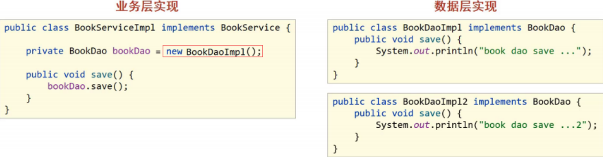
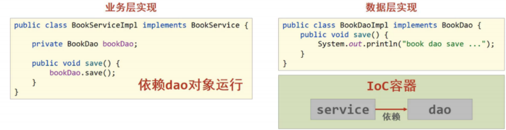
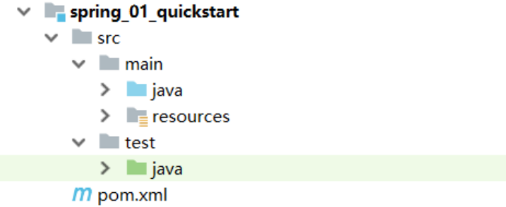
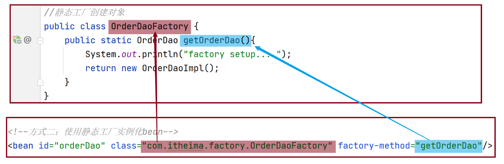
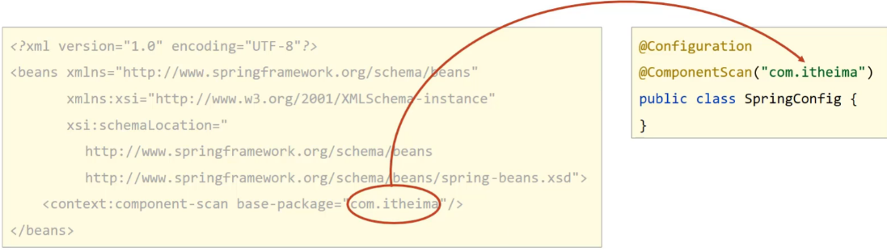
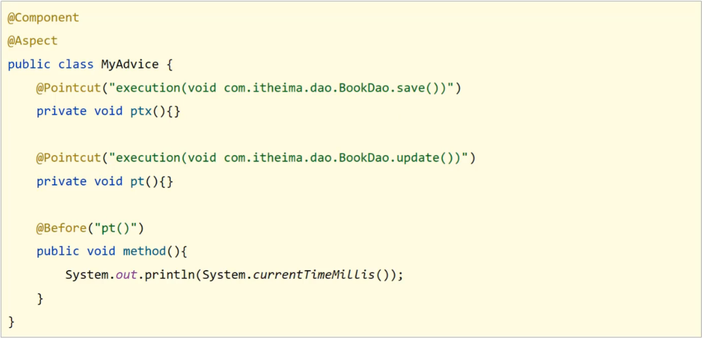
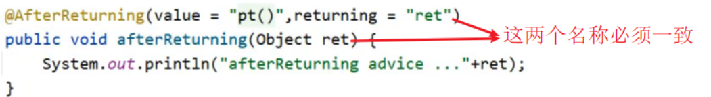
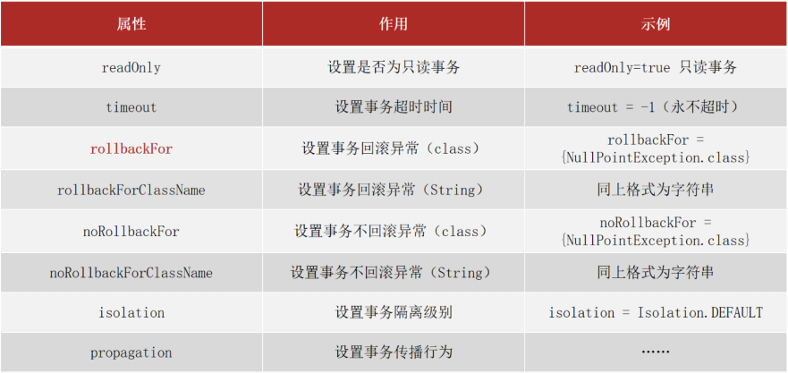

[toc]

# Spring笔记 版本5.3.22

该笔记有一部分来自于黑马程序员Spring课程视频中的课件资料。

## 1. 介绍

### 1. Spring家族介绍

Spring发展到今天已经形成了完整的生态圈,Spring提供了若干个项目,每个项目用于完成特定的功能。我们可以根据需要自行选择，把这些个项目组合起来使用。用于完成整个大项目工程的构建、设计与开发。


下面是需要重点关注的
* Spring Framework: 是Spring中最早最核心的技术框架，也是所有其他技术的基础。
* SpringBoot: SpringBoot是来帮助Spring在简化的基础上能更快速进行开发。
* SpringCloud: 是用来做分布式之微服务架构的相关开发。

<font color="red">我们学习的Spring其实指的是Spring家族中的Spring Framework框架。</font>

### 2. Spring Framework框架介绍

① Spring Framework发展史：目前最新的是Spring5
* Spring1.0是纯配置文件开发。
* Spring2.0为了简化开发引入了注解开发，此时是配置文件加注解的开发方式。
* Spring3.0已经可以进行纯注解开发，使开发效率大幅提升。
* Spring4.0根据JDK的版本升级对个别API进行了调整。
* Spring5.0已经全面支持JDK8。

② Spring Framework5的架构图


* Core Container核心容器模块：这个模块是Spring最核心的模块，其他的都需要依赖该模块
* AOP: 面向切面编程，它依赖核心层容器，目的是在不改变原有代码的前提下对其进行功能增强
* Aspects: AOP是思想,Aspects是对AOP思想的具体实现
* Data Access: 数据访问，Spring全家桶中有对数据访问的具体实现技术
* Data Integration: 数据集成，Spring支持整合其他的数据层解决方案，比如Mybatis
* Transactions: 事务，Spring中事务管理是Spring AOP的一个具体实现。
* TEST模块：Spring主要整合了Junit来完成单元测试和集成测试

### 3 Spring主要解决的问题是什么？



(1)之前业务层需要调用数据层的方法，就需要在业务层new数据层的对象
(2)如果数据层的实现类发生变化，那么业务层的代码也需要跟着改变，发生变更后，都需要进行编译，打包和重部署
(3)这种方式存在的问题是：代码耦合度偏高

针对这个问题，Spring就提出了一个解决方案:


* 使用对象时，在程序中不使用new产生对象，由Spring容器来提供对象。
* 在Spring容器中维护对象与对象之间的依赖关系。

上面解决方案就是Spring的核心概念IOC和DI。

### 4. Spring Framework 核心概念

* IOC（控制反转）：使用对象时，程序不主动new对象，由Spring容器来提供对象。
* DI（依赖注入）：在Spring容器中维护对象与对象之间的依赖关系。

#### IOC控制反转

1. Spring提供了一个容器，称为IOC容器。
2. IOC容器负责对象的创建、初始化等一系列工作。让程序不主动new对象。由IOC容器来提供对象。
3. 被创建或被管理的对象在IOC容器中统称为Bean对象。
4. IOC容器中的bean对象之间是没有依赖关系的，因此无法互相调用。
5. DI依赖注入就是用于在IOC容器中维护对象与对象之间的依赖关系。

#### DI依赖注入



1. 在IOC容器中建立bean对象之间的依赖关系的整个过程，称为依赖注入。


#### 核心概念实现的目标

<font color="red">

IOC和DI的最终目标就是:充分解耦
1. 使用IOC容器管理bean对象（IOC)
2. 在IOC容器内将需要依赖的bean对象之间进行关系绑定（DI）
3. 最终目标：使用对象时不仅可以直接从IOC容器中获取，并且获取到的bean已经绑定了所有的依赖关系。

</font>

## 2. Spring Framework 快速开始

Spring到底是如何来实现IOC和DI的，那接下来就通过一些简单的入门案例，来演示下具体实现过程。

### 1 IOC控制反转入门案例

IOC控制反转入门案例思路分析：
1. 如何引入Spring依赖？
2. 如何将被管理的对象告知给IOC容器？
3. 如何从程序中获取到IOC容器?
4. 如何从容器中获取bean对象?

IOC控制反转入门案例思路实现：
1. 创建Maven项目
2. pom.xml添加Spring的依赖jar包
3. 创建BookService,BookServiceImpl，BookDao和BookDaoImpl四个类
4. resources目录下添加spring配置文件，并完成bean的配置
5. 使用Spring提供的接口完成IOC容器的创建
6. 从容器中获取对象进行方法调用

> 步骤1：创建Maven项目



> 步骤2:pom.xml文件中添加Spring的依赖jar包

```xml
<dependencies>
    <dependency>
        <groupId>org.springframework</groupId>
        <artifactId>spring-context</artifactId>
        <version>5.2.10.RELEASE</version>
    </dependency>
</dependencies>
```

<font color="red">spring-context是Spring Framework框架的核心模块</font>

> 步骤3:添加案例中需要的类

创建BookService,BookServiceImpl，BookDao和BookDaoImpl四个类

```java
public interface BookDao {
    public void save();
}
public class BookDaoImpl implements BookDao {
    public void save() {
        System.out.println("book dao save ...");
    }
}
public interface BookService {
    public void save();
}
public class BookServiceImpl implements BookService {
    private BookDao bookDao = new BookDaoImpl();
    public void save() {
        System.out.println("book service save ...");
        bookDao.save();
    }
}
```

> 步骤4:添加spring配置文件，并完成bean对象的配置

resources目录下添加spring配置文件applicationContext.xml，并完成bean的配置。

```xml
<?xml version="1.0" encoding="UTF-8"?>
<beans xmlns="http://www.springframework.org/schema/beans"
       xmlns:xsi="http://www.w3.org/2001/XMLSchema-instance"
       xsi:schemaLocation="http://www.springframework.org/schema/beans http://www.springframework.org/schema/beans/spring-beans.xsd">
    <!--bean标签标示配置bean
        id属性标示给bean起名字
    	class属性表示给bean定义类型
	-->
	<bean id="bookDao" class="com.itheima.dao.impl.BookDaoImpl"/>
    <bean id="bookService" class="com.itheima.service.impl.BookServiceImpl"/>
</beans>
```

<font color="red">bean标签中的id属性在同一个上下文中(配置文件)不能重复。applicationContext.xml配置文件主要是对IOC容器的配置。</font>

> 步骤5:获取IOC容器

根据applicationContext.xml配置文件来完成IOC容器的创建，创建App启动类，编写main方法

```java
public class App {
    public static void main(String[] args) {
        //获取IOC容器
		ApplicationContext ctx = new ClassPathXmlApplicationContext("applicationContext.xml"); 
    }
}
```

> 步骤6:从容器中获取对象进行方法调用

```java
public class App {
    public static void main(String[] args) {
        //获取IOC容器
	    ApplicationContext ctx = new ClassPathXmlApplicationContext("applicationContext.xml");
        // 从ioc容器中获取 bookService bean对象，并调用方法
        BookService bookService = (BookService) ctx.getBean("bookService");
        bookService.save();
    }
}
```

> 步骤7:运行程序

```
测试结果为：
book service save ...
book dao save ...
```

Spring的IOC入门案例已经完成，但是在BookServiceImpl的类中依然存在BookDaoImpl对象的new操作，它们之间的耦合度还是比较高，这块该如何解决，就需要用到下面的DI:依赖注入。

### 2 DI依赖注入 入门案例

DI依赖注入入门案例思路分析：
1. 实现依赖注入，必须要基于IOC管理Bean。
2. new形式创建的Dao对象是否保留?
3. Service中需要的Dao对象如何进入到Service中?
4. Service与Dao间的依赖关系如何描述?

DI依赖注入入门案例思路实现：
1. 删除业务层中使用new的方式创建的dao对象
2. 在业务层提供BookDao的setter方法
3. 在配置文件中添加依赖注入的配置，来维护Service与Dao的依赖关系
4. 运行程序调用方法

> 步骤1: 去除代码中的new

在BookServiceImpl类中，删除业务层中使用new的方式创建的dao对象
```java
public class BookServiceImpl implements BookService {
    //删除业务层中使用new的方式创建的dao对象
    private BookDao bookDao;
    public void save() {
        System.out.println("book service save ...");
        bookDao.save();
    }
}
```

> 步骤2:为属性提供setter方法

在BookServiceImpl类中,为BookDao提供setter方法
```java
public class BookServiceImpl implements BookService {
    //删除业务层中使用new的方式创建的dao对象
    private BookDao bookDao;
    public void save() {
        System.out.println("book service save ...");
        bookDao.save();
    }
    //提供对应的set方法
    public void setBookDao(BookDao bookDao) {
        this.bookDao = bookDao;
    }
}
```

> 步骤3:修改applicationContext.xml配置文件完成注入

在applicationContext.xml配置文件中添加依赖注入的配置
```xml
<?xml version="1.0" encoding="UTF-8"?>
<beans xmlns="http://www.springframework.org/schema/beans"
       xmlns:xsi="http://www.w3.org/2001/XMLSchema-instance"
       xsi:schemaLocation="http://www.springframework.org/schema/beans http://www.springframework.org/schema/beans/spring-beans.xsd">
    <bean id="bookDao" class="com.itheima.dao.impl.BookDaoImpl"/>

    <bean id="bookService" class="com.itheima.service.impl.BookServiceImpl">
        <!--配置server与dao的关系-->
        <!--property标签表示配置当前bean的属性
        		name属性表示配置哪一个具体的属性
        		ref属性表示参照哪一个bean
		-->
        <property name="bookDao" ref="bookDao"/>
    </bean>

</beans>
```


<font color="red">

注意:配置文件中的两个bookDao的含义是不一样的:
1. name="bookDao"中bookDao的作用是让Spring的IOC容器在获取到名称后，将首字母大写，前面加set找对应的setBookDao()方法进行对象注入
2. ref="bookDao"中bookDao的作用是让Spring能在IOC容器中找到id为bookDao的Bean对象注入到bookService对象中。

</font>

> 步骤4:运行程序

```
测试结果为：
book service save ...
book dao save ...
```

## 3. IOC容器中配置

<font color="red">

1. 在IOC容器中不能指定接口作为bean对象。因为接口不能创建对象。
2. bean标签的id属性值在IOC容器中是唯一的。

</font>


### 1. bean的别名配置

```xml
<bean id="bookDao" name="dao" class="com.itheima.dao.impl.BookDaoImpl"/>

<!--name:为bean指定别名，别名可以有多个，使用逗号，分号，空格进行分隔-->
<bean id="bookService" name="service service1" class="com.itheima.service.impl.BookServiceImpl">
    <property name="bookDao" ref="bookDao"/> 
</bean>
```

* bean标签的name属性：为bean指定别名，别名可以有多个，使用逗号，分号，空格进行分隔。
* property标签的ref属性：指定某个对象并依赖注入。该属性值既可以是bean标签的id值也可是name值。

### 2. bean的作用范围scope配置

```xml
<bean id="bookDao" class="com.itheima.dao.impl.BookDaoImpl" scope="singleton"/>
<bean id="bookService" class="com.itheima.dao.impl.BookDaoImpl" scope="prototype"/>
```

* scope属性：默认为singleton(单例)，可选prototype(非单例)。可以控制IOC容器创建bean对象时是否为单例的。


singleton(单例)的优点：
1. bean为单例的意思是在Spring的IOC容器中只会有该类的一个对象
2. bean对象只有一个就避免了对象的频繁创建与销毁，达到了bean对象的复用，性能高。

singleton(单例)的缺点：
1. 因为所有请求线程共用一个bean对象，所以会存在线程安全问题。

### 3. bean的实例化

IOC容器实例化bean的三种方式，构造方法,静态工厂和实例工厂

#### 1 构造方法实例化bean

(1)步骤1:准备需要被创建的类，并给bean对象中添加无参构造方法

```java
public interface BookDao {
    public void save();
}
public class BookDaoImpl implements BookDao {
    public BookDaoImpl() {
        System.out.println("book dao constructor is running ....");
    }
    public void save() {
        System.out.println("book dao save ...");
    }
}
```

(2)步骤2:修改applicationContext.xml配置文件，将类配置到IOC容器中

```xml
<?xml version="1.0" encoding="UTF-8"?>
<beans xmlns="http://www.springframework.org/schema/beans"
       xmlns:xsi="http://www.w3.org/2001/XMLSchema-instance"
       xsi:schemaLocation="http://www.springframework.org/schema/beans http://www.springframework.org/schema/beans/spring-beans.xsd">

	<bean id="bookDao" class="com.itheima.dao.impl.BookDaoImpl"/>
</beans>
```

(3)步骤3:编写运行程序

```java
public class AppForInstanceBook {
    public static void main(String[] args) {
        ApplicationContext ctx = new ClassPathXmlApplicationContext("applicationContext.xml");
        BookDao bookDao = (BookDao) ctx.getBean("bookDao");
        bookDao.save();
    }
}
```

(4)步骤4:运行测试

```
运行结果：
book dao constructor is running ....
book dao save ...
```

结论
1. IOC容器实例化bean对象默认使用的是bean的无参构造方法。当bean对象没有无参构造方法时，IOC容器实例化bean会报错。

#### 2 静态工厂实例化bean

(1)准备一个OrderDao和OrderDaoImpl类

```java
public interface OrderDao {
    public void save();
}
public class OrderDaoImpl implements OrderDao {
    public void save() {
        System.out.println("order dao save ...");
    }
}
```

(2)创建一个工厂类OrderDaoFactory并提供一个静态方法,该方法用于new对象。

```java
//静态工厂创建对象
public class OrderDaoFactory {
    public static OrderDao getOrderDao(){
        System.out.println("factory setup....");//模拟一些必要的业务操作
        return new OrderDaoImpl();
    }
}
```

(3)修改配置文件application.xml

```xml
<bean id="orderDao" class="com.itheima.factory.OrderDaoFactory" factory-method="getOrderDao"/>
```
class:工厂类的类全名
factory-mehod:工厂类中创建对象的方法名

对应关系如下图:



(4)编写启动类并运行测试
```java
public class AppForInstanceOrder {
    public static void main(String[] args) {
        ApplicationContext ctx = new ClassPathXmlApplicationContext("applicationContext.xml");
        OrderDao orderDao = (OrderDao) ctx.getBean("orderDao");
        orderDao.save();
    }
}
```

(5)运行后，可以查看到结果

```
order dao save ...
```

静态工厂实例化bean的优点：
1. 在工厂的静态方法中，除了new对象还可以做其他的一些业务操作，这些操作必不可少,如:
```java
public class OrderDaoFactory {
    public static OrderDao getOrderDao(){
        System.out.println("factory setup....");//模拟一些必要的业务操作
        return new OrderDaoImpl();
    }
}
```

#### 3 实例工厂实例化bean

(1)准备一个UserDao和UserDaoImpl类

```java
public interface UserDao {
    public void save();
}
public class UserDaoImpl implements UserDao {
    public void save() {
        System.out.println("user dao save ...");
    }
}
```

(2)创建一个工厂类OrderDaoFactory并提供一个普通方法，注意此处和静态工厂的工厂类不一样的地方是方法不是静态方法

```java
public class UserDaoFactory {
    public UserDao getUserDao(){
        return new UserDaoImpl();
    }
}
```

(3)在配置文件中添加以下内容:

```xml
<bean id="userFactory" class="com.itheima.factory.UserDaoFactory"/>
<bean id="userDao" factory-method="getUserDao" factory-bean="userFactory"/>
```

* 第一行创建实例化工厂对象
* 第二行配置调用对象中的方法来创建bean，
  * factory-bean:工厂的实例对象
  * factory-method:工厂对象中的具体创建对象的方法名,对应关系如下:


(3)编写AppForInstanceUser运行类，在类中通过工厂获取对象

```java
public class AppForInstanceUser {
    public static void main(String[] args) {
        ApplicationContext ctx = new ClassPathXmlApplicationContext("applicationContext.xml");
        UserDao userDao = (UserDao) ctx.getBean("userDao");
        userDao.save();
    }
}
```

(4)运行后，可以查看到结果
```
user dao save ...
```

### 4. bean的生命周期

* bean创建之后，想要添加内容，比如用来初始化需要用到资源
* bean销毁之前，想要添加内容，比如用来释放用到的资源

(1)项目中添加BookDao、BookDaoImpl、BookService和BookServiceImpl类

```java
public interface BookDao {
    public void save();
}
public class BookDaoImpl implements BookDao {
    public void save() {
        System.out.println("book dao save ...");
    }
    //表示bean初始化对应的操作
    public void init(){
        System.out.println("init...");
    }
    //表示bean销毁前对应的操作
    public void destory(){
        System.out.println("destory...");
    }
}
```

(2)修改配置文件

```xml
<bean id="bookDao" class="com.itheima.dao.impl.BookDaoImpl" init-method="init" destroy-method="destory"/>
```
* init-method: bean初始化方法
* destroy-method：bean销毁方法

(3)编写AppForLifeCycle运行类，加载Spring的IOC容器，并从中获取对应的bean对象

```java
public class AppForLifeCycle {
    public static void main( String[] args ) {
        // ApplicationContext中没有close方法
        // ApplicationContext ctx = new ClassPathXmlApplicationContext("applicationContext.xml");
        ClassPathXmlApplicationContext ctx = new ClassPathXmlApplicationContext("applicationContext.xml");
        BookDao bookDao = (BookDao) ctx.getBean("bookDao");
        bookDao.save();
        ctx.close(); //关闭ioc容器
    }
}
```

* 此处不能使用ApplicationContext获取IOC容器，该类没有关闭容器方法。无法触发销毁容器中的bean对象。

(4)运行结果
```
init...
book dao save ...
destory...
```

(5)bean生命周期小结

bean的生命周期如下:

* 初始化容器
  * 1.创建对象(内存分配)
  * 2.执行构造方法
  * 3.执行属性注入(set操作)
  * 4.执行bean初始化方法
* 使用bean
  * 1.执行业务操作
* 关闭/销毁容器
  * 1.执行bean销毁方法


## 4 DI依赖注入各项配置

依赖注入主要为容器中bean与bean之间的建立依赖关系。

依赖注入有两种注入方式：setter注入，构造器注入

### setter注入引用数据类型

(1)项目中添加类
```java
public interface BookService {
    public void save();
}
public class BookServiceImpl implements BookService{
    private BookDao bookDao;
    public void setBookDao(BookDao bookDao) {
        this.bookDao = bookDao;
    }
    public void save() {
        System.out.println("book service save ...");
        bookDao.save();
    }
}
```

(2)修改配置文件

```xml
<bean id="bookDao" class="com.itheima.dao.impl.BookDaoImpl"/>
<bean id="bookService" class="com.itheima.service.impl.BookServiceImpl">
    <property name="bookDao" ref="bookDao"/>
</bean>
```

* name="bookDao"中bookDao的作用是让IOC容器在获取到名称后，将首字母大写，前面加set找对应的setBookDao()方法进行对象注入。
* ref="bookDao"中bookDao的作用是让Spring能在IOC容器中找到id为bookDao的Bean对象注入到bookService对象中。

### setter注入基本数据类型

```java
public class BookDaoImpl implements BookDao {
    private String databaseName;
    private int connectionNum;
    public void setConnectionNum(int connectionNum) {
        this.connectionNum = connectionNum;
    }
    public void setDatabaseName(String databaseName) {
        this.databaseName = databaseName;
    }
    public void save() {
        System.out.println("book dao save ..."+databaseName+","+connectionNum);
    }
}
```

```xml
<bean id="bookDao" class="com.itheima.dao.impl.BookDaoImpl">
    <property name="databaseName" value="mysql"/>
    <property name="connectionNum" value="10"/>
</bean>
```

value:后面跟的是简单数据类型，Spring在注入的时候会自动转换。
但是不能写为下面的样子。因为spring在将`abc`转换成int类型的时候就会报错。
```xml
<property name="connectionNum" value="abc"/>
```

### 构造方法注入引用数据类型

```java
public class BookServiceImpl implements BookService{
    private BookDao bookDao;
    private UserDao userDao;

    public BookServiceImpl(BookDao bookDao,UserDao userDao) {
        this.bookDao = bookDao;
        this.userDao = userDao;
    }
}
```

在applicationContext.xml中配置注入
```xml
<bean id="bookDao" class="com.itheima.dao.impl.BookDaoImpl"/>
<bean id="userDao" class="com.itheima.dao.impl.UserDaoImpl"/>
<bean id="bookService" class="com.itheima.service.impl.BookServiceImpl">
    <constructor-arg name="bookDao" ref="bookDao"/>
    <constructor-arg name="userDao" ref="userDao"/>
</bean>
```

标签`<constructor-arg>`中
* name属性对应的值为构造函数中方法形参的参数名，必须要保持一致。
* ref属性指向的是IOC容器中其他bean对象。

### 构造方法注入基本数据类型

```java
public class BookDaoImpl implements BookDao {
    private String databaseName;
    private int connectionNum;
    public BookDaoImpl(String databaseName, int connectionNum) {
        this.databaseName = databaseName;
        this.connectionNum = connectionNum;
    }
}
```

在applicationContext.xml中进行注入配置

```xml
<bean id="bookDao" class="com.itheima.dao.impl.BookDaoImpl">
    <constructor-arg name="databaseName" value="mysql"/>
    <constructor-arg name="connectionNum" value="666"/>
</bean>
```

标签`<constructor-arg>`中
* name属性对应的值为构造函数中方法形参的参数名，必须要保持一致。
* value属性为要注入的数值。


## 5 自动装配

IoC容器根据bean所依赖的资源在容器中自动查找并注入到bean对象中的过程称为自动装配。

自动装配方式有下面几种：
* 按类型（常用）
* 按名称
* 按构造方法

自动装配默认是不开启的。

### 按类型自动装配 byType

```java
public interface BookService {
    public void save();
}
public class BookServiceImpl implements BookService{
    private BookDao bookDao;

    public void setBookDao(BookDao bookDao) {
        this.bookDao = bookDao;
    }

    public void save() {
        System.out.println("book service save ...");
        bookDao.save();
    }
}
```

修改applicationContext.xml配置文件

```xml
<bean id="bookDao" class="com.itheima.dao.impl.BookDaoImpl"/>
<!-- <bean id="bookService" class="com.itheima.service.impl.BookServiceImpl">
    <property name="bookDao" ref="bookDao"/>
</bean> -->

<!--autowire属性：开启自动装配，通常使用按类型装配-->
<bean id="bookService" class="com.itheima.service.impl.BookServiceImpl" autowire="byType"/>
```

autowire="byType"意思是根据bean对象中的setter方法名称来查询IOC容器中是否有可注入依赖对象。

按类型装配注意事项:
* 对应属性的setter方法不能省略
* 对象必须要被IOC容器管理
* 若按照类型在IOC容器中如果找到多个对象，会报`NoUniqueBeanDefinitionException`


### 按名称自动装配 byName

```java
public interface BookService {
    public void save();
}
public class BookServiceImpl implements BookService{
    private BookDao bookDao;

    public void setBookDao(BookDao bookDao) {
        this.bookDao = bookDao;
    }

    public void save() {
        System.out.println("book service save ...");
        bookDao.save();
    }
}
```

```xml
<bean id="bookDao" class="com.itheima.dao.impl.BookDaoImpl"/>
<!--autowire属性：开启自动装配-->
<bean id="bookService" class="com.itheima.service.impl.BookServiceImpl" autowire="byName"/>
```

autowire="byName"会根据setter方法名称，来查询IOC容器中是否有可注入依赖对象

### 按构造方法自动装配

```java
public class BookServiceImpl implements BookService{
    private BookDao bookDao;
    private UserDao userDao;
    public BookServiceImpl(BookDao bookDao,UserDao userDao) {
        this.bookDao = bookDao;
        this.userDao = userDao;
    }
}
```

在applicationContext.xml中配置注入
```xml
<bean id="bookDao" class="com.itheima.dao.impl.BookDaoImpl"/>
<bean id="userDao" class="com.itheima.dao.impl.UserDaoImpl"/>
<!--autowire属性：开启constructor自动装配-->
<bean id="bookService" class="com.itheima.service.impl.BookServiceImpl" autowire="constructor">
</bean>
```

autowire="constructor" 根据构造方法的参数来从IOC容器中找到注入依赖对象。

### 自动装配总结

1. 自动装配用于引用类型依赖注入，不能对简单类型进行操作
2. 使用按类型装配时（byType）必须保障容器中相同类型的bean唯一，推荐使用
3. 使用按名称装配时（byName）必须保障容器中具有指定名称的bean，因变量名与配置耦合，不推荐使用
4. 自动装配优先级低于setter注入与构造器注入，同时出现时自动装配配置失效。


## 6. Spring读取properties文件

Spring框架如何读取properties配置文件中的数据，并用于IOC容器的创建。

①创建jdbc.properties文件
```
jdbc.driver=com.mysql.jdbc.Driver 
jdbc.url=jdbc:mysql://127.0.0.1:3306/spring_db 
jdbc.username=root 
jdbc.password=root
```

②在applicationContext.xml中开`context`命名空间，并加载jdbc.properties配置文件
```xml
<?xml version="1.0" encoding="UTF-8"?>
<beans xmlns="http://www.springframework.org/schema/beans"
       xmlns:xsi="http://www.w3.org/2001/XMLSchema-instance"
       xmlns:context="http://www.springframework.org/schema/context"
       xsi:schemaLocation="
            http://www.springframework.org/schema/beans
            http://www.springframework.org/schema/beans/spring-beans.xsd
            http://www.springframework.org/schema/context
            http://www.springframework.org/schema/context/spring-context.xsd">
    <!--使用该标签，需要提前导入context命名空间
        xmlns:context="http://www.springframework.org/schema/context"
        xsi:schemaLocation="
            http://www.springframework.org/schema/context
            http://www.springframework.org/schema/context/spring-context.xsd"
    -->        
    <!--加载jdbc.properties配置文件-->
    <context:property-placeholder location="jdbc.properties"/>
</beans>
```

③ 属性注入
使用`${key}`来读取jdbc.properties配置文件中的内容并完成属性注入
```xml
<?xml version="1.0" encoding="UTF-8"?>
<beans xmlns="http://www.springframework.org/schema/beans"
       xmlns:xsi="http://www.w3.org/2001/XMLSchema-instance"
       xmlns:context="http://www.springframework.org/schema/context"
       xsi:schemaLocation="
            http://www.springframework.org/schema/beans
            http://www.springframework.org/schema/beans/spring-beans.xsd
            http://www.springframework.org/schema/context
            http://www.springframework.org/schema/context/spring-context.xsd">
    <context:property-placeholder location="jdbc.properties"/>
    <!--此处需要先在maven导入Druid依赖,否则找不到该类-->
    <bean id="dataSource" class="com.alibaba.druid.pool.DruidDataSource">
        <property name="driverClassName" value="${jdbc.driver}"/>
        <property name="url" value="${jdbc.url}"/>
        <property name="username" value="${jdbc.username}"/>
        <property name="password" value="${jdbc.password}"/>
    </bean>
</beans>
```

④ 从IOC容器中获取对应的bean对象

```java
public class App {
    public static void main(String[] args) {
       ApplicationContext ctx = new ClassPathXmlApplicationContext("applicationContext.xml");
       DataSource dataSource = (DataSource) ctx.getBean("dataSource");
       System.out.println(dataSource);
    }
}
```

至此，读取外部properties配置文件中的内容就已经完成。

### 1. Spring加载properties文件，但是不加载系统属性

```xml
<context:property-placeholder location="jdbc.properties"/>
<bean id="bookDao" class="com.itheima.dao.impl.BookDaoImpl"> 
    <property name="name" value="${username}"/>
</bean>
```
`<context:property-placeholder/>`标签会优先加载系统环境变量。当username属性同时存在系统变量和properties文件时，会优先读取系统变量中的username属性值。

解决方法：
```xml
<!--system-properties-mode:设置为NEVER,表示不加载系统变量属性-->
<context:property-placeholder location="jdbc.properties" system-properties-mode="NEVER"/>
```

### 2. Spring如何同时加载多个properties文件？

```xml
<?xml version="1.0" encoding="UTF-8"?>
<beans xmlns="http://www.springframework.org/schema/beans"
        xmlns:xsi="http://www.w3.org/2001/XMLSchema-instance"
        xmlns:context="http://www.springframework.org/schema/context"
        xsi:schemaLocation="
            http://www.springframework.org/schema/beans
            http://www.springframework.org/schema/beans/spring-beans.xsd
            http://www.springframework.org/schema/context
            http://www.springframework.org/schema/context/spring-context.xsd">
    <!--方式一 -->
    <context:property-placeholder location="jdbc.properties,jdbc2.properties" system-properties-mode="NEVER"/>
    <!--方式二-->
    <context:property-placeholder location="*.properties" system-properties-mode="NEVER"/>
    <!--方式三 -->
    <context:property-placeholder location="classpath:*.properties" system-properties-mode="NEVER"/>
    <!--方式四-->
    <context:property-placeholder location="classpath*:*.properties" system-properties-mode="NEVER"/>
</beans>	
```

说明:
* 方式一:可以实现，如果配置文件多的话，每个都需要配置
* 方式二:`*.properties`代表所有以properties结尾的文件都会被加载，可以解决方式一的问题，但是不标准
* 方式三:标准的写法，`classpath:`代表的是从根路径下开始查找，但是只能查询当前项目的根路径
* 方式四:不仅可以加载当前项目还可以加载当前项目所依赖的所有项目的根路径下的properties配置文件


## 7. Spring中的IOC注解开发

之前都是通过xml配置文件的方式来配置IOC容器中的bean对象，并且进行bean对象之间的依赖注入。这种复杂的地方在于xml配置。但是我们可以通过注解的方式来简化xml配置文件。甚至可以做到纯注解开发（无须xml配置文件）。

Spring对注解支持的版本历程:
* 2.0版开始支持注解
* 2.5版注解功能趋于完善
* 3.0版支持纯注解开发

### 1. 纯注解开发:IOC入门案例

使用注解的方式来配置IOC容器中的bean对象。

① 创建Maven项目，并引入spring依赖

```xml
<dependencies>
    <dependency>
        <groupId>org.springframework</groupId>
        <artifactId>spring-context</artifactId>
        <version>5.2.10.RELEASE</version>
    </dependency>
</dependencies>
```

② 添加BookDao、BookDaoImpl、BookService、BookServiceImpl类，并添加@Component注解

```java
public interface BookDao {
    public void save();
}
@Component("bookDao")
public class BookDaoImpl implements BookDao {
    public void save() {
        System.out.println("book dao save ..." );
    }
}
public interface BookService {
    public void save();
}
@Component("bookService")
public class BookServiceImpl implements BookService {
    public void save() {
        System.out.println("book service save ...");
    }
}
```

<font color="red">

注意:@Component注解不可以添加在接口上，因为接口是无法创建对象的。
@Component注解如果不起名称，会有一个默认值就是当前类名首字母小写。

</font>

XML与注解配置的对应关系如下:


③ 创建配置类用于代替applicationContext.xml配置文件

```java
//这两个注解一起表示。该类代替applicationContext.xml配置文件。
//并且扫描com.example包下的所有文件。若找到@Component注解。则将其注解的类变成bean对象存放到IOC容器中。
@Configuration
@ComponentScan("org.example")
public class SpringApplicationConfig {
}
```

@Configuration注解：用于设定当前类为配置类,用于替换为applicationContext.xml配置文件
@ComponentScan注解：用于设定扫描路径。替换`<context:component-scan base-package=""/>`标签。




④创建运行类并执行

```java
public class App {
    public static void main( String[] args )
    {
        // new AnnotationConfigApplicationContext(SpringApplicationConfig.class)
        // 加载SpringApplicationConfig配置类，从配置类中读取IOC容器配置
        ApplicationContext applicationContext = new AnnotationConfigApplicationContext(SpringApplicationConfig.class);
        BookDao bookDao = applicationContext.getBean("BookDao", BookDao.class);
        BookService bookService = applicationContext.getBean("BookService",BookService.class);
        bookDao.save();
        bookService.save();
    }
}

//运行结果：
//book dao save ...
//book service save ...
```

注意：
```java
//加载配置文件初始化容器 
ApplicationContext ctx = new ClassPathXmlApplicationContext("applicationContext.xml"); 
//加载配置类初始化容器 
ApplicationContext ctx = new AnnotationConfigApplicationContext(SpringApplicationConfig.class);
```

* ClassPathXmlApplicationContext是加载XML配置文件的类
* AnnotationConfigApplicationContext是加载配置类的类

### 2. @Component/@Controller/@Service/@Repository注解

@Component @Controller @Service @Repository

作用：当spring扫描到这些注解后，设置类为IOC容器中的bean对象。

其余三个注解和@Component注解的作用是一样的，为什么要衍生出这三个呢?
方便编写类的时候能很好的区分出这个类是属于表现层、业务层还是数据层的类。

### 3. @Configuration,@ComponentScan注解

@Configuration注解：设置当前注解类为spring的配置类。通过配置类的形式来替换applicationContext.xml配置文件

@ComponentScan注解：设定扫描路径，此注解只能添加一次，多个数据请用数组格式。

```
@ComponentScan({com.itheima.service","com.itheima.dao"})
```


上图左边的applicationContext.xml配置文件与右边的配置类作用是等价的。

### 4. 注解设置bean作用范围 @Scope

```java
public interface BookDao {
    public void save();
}
@Component("bookDao")
//@Scope设置bean的作用范围 
@Scope("prototype")
public class BookDaoImpl implements BookDao {
    public void save() {
        System.out.println("book dao save ..." );
    }
}
```

@Scope注解：设置该类bean对象的作用范围。默认值singleton（单例），可选值prototype（非单例）。

### 5. 注解设置bean生命周期 @PostConstruct @PreDestroy

```java
@Repository
public class BookDaoImpl implements BookDao {
    public void save() {
        System.out.println("book dao save ...");
    }
    @PostConstruct //在构造方法之后执行，替换init-method
    public void init() {
        System.out.println("init ...");
    }
    @PreDestroy //在销毁方法之前执行,替换destroy-method
    public void destroy() {
        System.out.println("destroy ...");
    }
}
```
@PostConstruct注解：设置该方法为初始化方法。在bean对象构造之后执行
@PreDestroy注解：设置该方法为销毁方法。在bean对象销毁之前执行
注意：@PreDestroy注解只有在容器关闭的时候，才会生效。

```java
public class App {
    public static void main(String[] args) {
        //加载SpringConfig.class配置类，创建对应的IOC容器
        AnnotationConfigApplicationContext ctx = new AnnotationConfigApplicationContext(SpringConfig.class);
        BookDao bookDao1 = ctx.getBean(BookDao.class);
        System.out.println(bookDao1);
        ctx.close(); //关闭容器
    }
}
```

<font color="red">
注意:@PostConstruct和@PreDestroy注解如果显示找不到，需要导入下面的jar包。找不到的原因是，从JDK9以后jdk中的javax.annotation包被移除了，这两个注解刚好就在这个包中。
</font>

```xml
<dependency>
  <groupId>javax.annotation</groupId>
  <artifactId>javax.annotation-api</artifactId>
  <version>1.3.2</version>
</dependency>
```

### 6 小结


## 8.Spring中的DI注解开发

Spring为了使用注解简化DI依赖注入，并没有提供构造函数注入、setter注入对应的注解，只提供了自动装配的注解实现。

### 1. 纯注解开发:DI入门案例

① 创建Maven项目，并引入spring依赖
```xml
<dependencies>
    <dependency>
        <groupId>org.springframework</groupId>
        <artifactId>spring-context</artifactId>
        <version>5.2.10.RELEASE</version>
    </dependency>
</dependencies>
```

② 添加BookDao、BookDaoImpl、BookService、BookServiceImpl类，并添加@Repository,@Service,@Autowired注解

```java
public interface BookDao {
    public void save();
}
@Repository
public class BookDaoImpl implements BookDao{
    @Override
    public void save() {
        System.out.println("this is BookDaoImpl save()");
    }
}
public interface BookService {
    public void add();
}
@Service
public class BookServiceImpl implements BookService{
    @Autowired
    private BookDao bookDao;

    @Override
    public void add() {
        bookDao.save();
    }
}
```

③ 创建配置类用于代替applicationContext.xml配置文件

```java
@Configuration
@ComponentScan("org.example")
public class SpringApplicationConfig {
}
```

④创建运行类并执行

```java
public class App {
    public static void main( String[] args )
    {
        ApplicationContext applicationContext = new AnnotationConfigApplicationContext(SpringApplicationConfig.class);
        BookService bookService = applicationContext.getBean(BookService.class);
        bookService.add();
    }
}
//运行结果：
//this is BookDaoImpl save()
```

@Autowired注解作用：按照类型注入的，将该注解表示类注入到所属外部类中。

注意：@Autowired默认按照类型自动装配，如果IOC容器中多个同类型的Bean对象，但是name属性不相同，就按照变量名和Bean的名称匹配。


例如上图就无法完成注入。@Autowired注解默认按照类型自动装配，但是由于有多个BookDao类型Bean对象，此时会按照bookDao名称去找，因为IOC容器只有名称叫bookDao1和bookDao2 ,所以找不到，会报NoUniqueBeanDefinitionException。

### 2 @Autowired和@Qualifier注解 注入引用数据类型

如下图，当@Autowired注解根据类型在IOC容器中找到多个bean,并且@Autowire注解下的属性名又和IOC容器中bean对象的名称都不一致时，该如何解决这种情况？


解决方式：使用@Qualifier指定某个bean对象进行依赖注入

```java
@Service
public class BookServiceImpl implements BookService {
    @Autowired
    @Qualifier("bookDao1")
    private BookDao bookDao;
    
    public void save() {
        System.out.println("book service save ...");
        bookDao.save();
    }
}
```

@Qualifier注解值就是需要注入的bean的名称。
<font color="red">注意:@Qualifier不能独立使用，必须和@Autowired一起使用</font>


### 3 @Value注解用法

#### @Value注解注入基本数据类型

```java
@Repository("bookDao")
public class BookDaoImpl implements BookDao {
    @Value("xiaoming")
    private String name;
    public void save() {
        System.out.println("book dao save ..." + name);
    }
}
```

@Value注解：将值直接复制给对应属性。注意数据格式要匹配，如将"abc"注入给int类型属性，这样程序就会报错。

#### @Value，@PropertySource 读取properties配置文件，

@PropertySource注解用于加载properties配置文件
@Value注解一般用在从properties配置文件中读取内容进行使用。

①步骤1：resource下准备jdbc.properties文件

```properties
name=小明
```

②步骤2: 使用注解加载properties配置文件

在配置类上添加`@PropertySource`注解

```java
@Configuration
@ComponentScan("com.itheima")
@PropertySource("jdbc.properties")
public class SpringConfig {
}
```

③步骤3：使用@Value读取配置文件中的内容

```java
@Repository("bookDao")
public class BookDaoImpl implements BookDao {
    @Value("${name}")
    private String name;
    public void save() {
        System.out.println("book dao save ..." + name);
    }
}
```

注意: @PropertySource注解用于加载properties配置文件

```java
//加载多个properties配置文件
//方式1
@PropertySource({"jdbc.properties","xxx.properties"})
//方式2
@PropertySource({"*.properties"})
//方式3 classpath表示当前项目根路径
@PropertySource({"classpath:jdbc.properties"})
```

### 4 @Autowired，@Qualifier，@Value，@PropertySource注解小结

@Autowired注解：
1. 位置：属性注解 或 方法注解 或 方法形参注解
2. 作用：为引用类型属性设置值

@Qualifier注解：
1. 位置：属性定义上方 或 标准set方法上方 或 类set方法上方
2. 作用：为引用类型属性指定注入的beanId

@Value注解：
1. 位置：属性定义上方 或 标准set方法上方 或 类set方法上方
2. 作用：为 基本数据类型 或 字符串类型 属性设置值

@PropertySource注解：
1. 位置：类定义上方
2. 作用：加载properties文件
3. value（默认）设置加载的properties文件对应的文件名或文件名组成的数组。


## 9 注解开发管理第三方bean

如何将第三方类（其他jar包中的类）作为bean对象注入到自己的IOC容器中?
答案：使用Bean注解可将第三方类注入到IOC容器中。

①创建一个Maven项目

②pom.xml添加Spring的依赖和第三方Druid依赖
```xml
<dependencies>
    <dependency>
        <groupId>org.springframework</groupId>
        <artifactId>spring-context</artifactId>
        <version>5.2.10.RELEASE</version>
    </dependency>
    <dependency>
        <groupId>com.alibaba</groupId>
        <artifactId>druid</artifactId>
        <version>1.1.16</version>
    </dependency>
</dependencies>
```

③添加一个配置类SpringConfig，并创建返回第三方类的方法

@Bean注解的作用是将方法的返回值制作为IOC容器的一个bean对象

```java
@Configuration
public class SpringConfig {
    // @Bean注解作用是将返回值作为bean对象注入到IOC容器中
	@Bean
    public DataSource dataSource(){
        DruidDataSource ds = new DruidDataSource();
        ds.setDriverClassName("com.mysql.jdbc.Driver");
        ds.setUrl("jdbc:mysql://localhost:3306/spring_db");
        ds.setUsername("root");
        ds.setPassword("root");
        return ds;
    }
}
```

④创建启动类App,并打印第三方bean对象
```java
public class App {
    public static void main(String[] args) {
        AnnotationConfigApplicationContext ctx = new AnnotationConfigApplicationContext(SpringConfig.class);
        DataSource dataSource = ctx.getBean(DataSource.class);
        System.out.println(dataSource);
    }
}
```

<font color="red">注意：如果有多个第三方bean要被IOC容器管理，直接在配置类中多些几个方法，方法上添加@Bean注解。然后spring能够扫描到这些配置类即可</font>


### 1.小结 @Bean @Import注解

@Bean注解:
1. 位置 方法注解.定义方法上方
2. 作用 设置该方法的返回值作为IOC容器管理的bean。

@Import注解:
1. 位置 类注解.定义类上方
2. 作用 导入配置类。可将其他多个配置类注入到一个总配置类上
3. 当配置类有多个时使用数组格式一次性导入多个配置类

```java
@Configuration
//@ComponentScan("com.itheima.config")
@Import(JdbcConfig.class)
@Import(xxx.xxx.class)
public class SpringConfig {

}
```

## 10 xml配置文件开发和注解开发总结


## 11 AOP简介

* AOP(Aspect Oriented Programming)面向切面编程。
* OOP(Object Oriented Programming)面向对象编程。
* AOP作用：在不改原有代码的前提下对其进行功能增强。

AOP核心概念：
* 连接点：程序执行过程中的任意位置。可为执行方法、抛出异常、设置变量等
* 切入点：需要被增强的方法。切入点一定是连接点。但是连接点不一定是被增强的方法，而切入点一定是被增强的方法。
* 通知：在切入点处执行的代码，也就是公共方法。
* 通知类：通知所在的类。由于通知是方法，一定属于某个类。该类就是通知类。
* 切面: 描述通知与切入点的对应关系。


(1)上图中BookServiceImpl中有save , update , delete和select方法,这些方法我们给起了一个名字叫连接点。
(2)save方法有计算万次执行消耗时间的功能。假如想对update和delete方法增强这个功能。我们可以对于需要增强的方法我们给起了一个名字叫切入点。
(3)将计算万次执行消耗时间这个功能抽取到另外一个方法中，换句话说就是存放公共功能的方法，起了个名字叫通知。
(4)通知是要增强的内容，可以有多个；切入点是需要被增强的方法，可以有多个；那哪个切入点需要添加哪个通知，就需要提前将它们之间的关系描述清楚，那么对于通知和切入点之间的关系描述，我们给起了个名字叫切面。
(5)通知是一个方法，方法不能独立存在需要被写在一个类中，这个类我们也给起了个名字叫通知类。


### 1 AOP入门案例

案例：使用SpringAOP的注解方式完成在方法执行的前打印出当前系统时间。

思路分析
```
1.导入依赖(pom.xml)
2.制作连接点(原始操作，Dao接口与实现类)
3.制作共性功能(通知类与通知)
4.定义切入点
5.绑定切入点与通知关系(切面)
```


① 步骤1：创建一个Maven项目，添加依赖

```xml
<dependencies>
    <dependency>
        <groupId>org.springframework</groupId>
        <artifactId>spring-context</artifactId>
        <version>5.2.10.RELEASE</version>
    </dependency>
    <dependency>
        <groupId>org.aspectj</groupId>
        <artifactId>aspectjweaver</artifactId>
        <version>1.9.4</version>
    </dependency>
</dependencies>
```

* spring-context中已经包含了spring-aop依赖,所以不需要再单独导入spring-aop依赖。
* 导入AspectJ的jar包,AspectJ是AOP思想的一个具体实现，Spring有自己的AOP实现，但是相比于AspectJ来说比较麻烦，所以直接采用Spring整合ApsectJ的方式进行AOP开发。


② 步骤2：创建BookDao和BookDaoImpl类

现在使用SpringAOP的方式在不改变update方法的前提下让其具有打印系统时间的功能。

```java
public interface BookDao {
    public void save();
    public void update();
}
@Repository
public class BookDaoImpl implements BookDao {
    public void save() {
        //打印系统时间
        System.out.println(System.currentTimeMillis());
        System.out.println("book dao save ...");
    }
    public void update(){
        System.out.println("book dao update ...");
    }
}
```

③ 步骤3：定义通知类和通知，并在通知类中定义切入点,切面。用@Aspect将通知类标识为切面类

通知类：通知所在的类。
通知：就是需要增强的代码方法。
切入点：需要运行增强代码的位置点。
切面: 用来描述通知和切入点之间的绑定关系，并指定通知的具体执行位置。
说明: @Before注解作用：通知会在切入点方法执行之前执行，除此之前还有其他四种类型。

```java
@Component
@Aspect
//MyAdvice是通知类
public class MyAdvice {
    //这是切入点
    @Pointcut("execution(void com.itheima.dao.BookDao.update())")
    private void pt(){}

    //method方法是通知
    //@Before("pt()")用于绑定切入点和切面
    @Before("pt()")
    public void method(){
        System.out.println(System.currentTimeMillis());
    }
}
```

* 切入点注解@Pointcut需要定义在一个不具有实际意义的方法上，即无参数、无返回值、方法体无实际逻辑方法。


③ 步骤3：创建配置类，并开启AOP功能

```java
@Configuration
@ComponentScan("com.itheima")
@EnableAspectJAutoProxy  //开启aop功能
public class SpringConfig {
}
```

④ 步骤4：编写启动类

```java
public class App {
    public static void main(String[] args) {
        ApplicationContext ctx = new AnnotationConfigApplicationContext(SpringConfig.class);
        BookDao bookDao = ctx.getBean(BookDao.class);
        bookDao.save();
        bookDao.update();
    }
}
//运行结果
1662709232005
book dao save ...
1662709256925
book dao update ...
```

可以看到在执行update方法之前打印了系统时间戳，说明对update方法进行了增强，AOP成功。


### 2 @EnableAspectJAutoProxy,@Aspect,@Pointcut,@Before注解

@EnableAspectJAutoProxy
类型：配置类注解
位置：配置类定义上方
作用：开启注解格式AOP功能

@Aspect
类型：类注解
位置：切面类定义上方
作用：设置当前类为AOP切面类

@Pointcut
类型：方法注解
位置：切入点方法上方
作用：设置切入点方法
属性：value（默认）：切入点表达式

@Before
类型：方法注解
位置：通知方法上方
作用：设置通知方法与切入点之间的绑定关系，通知方法在切入点方法前运行。

### 3 AOP工作流程

由于AOP是基于Spring容器管理的bean做的增强，所以AOP工作流程需要从Spring加载bean说起。

① 流程1:Spring IOC容器启动

* 注意IOC容器启动后，此时bean对象还没有创建成功

② 流程2:读取切面类配置中的切入点



③ 流程3:初始化IOC容器中的bean对象

先判定bean对象类中的方法是否能匹配到任意切入点


* 若匹配失败，说明不需要增强，直接调用原始对象的方法即可。
* 若匹配成功
    * 因为要对目标对象进行功能增强，而采用的技术是动态代理，所以会为其创建一个代理对象。
    * 最终运行的是代理对象的方法，在该方法中会对原始方法进行功能增强。

④ 流程4:获取bean执行方法

* 若匹配失败，则获取的bean是原始对象，调用方法并执行，完成操作
* 若匹配成功，则获取的bean是代理对象，根据代理对象的运行模式运行原始方法与增强的内容，完成操作

<font color="red">

总结：
SpringAOP是在不改变原有代码的前提下对其进行增强的，它的底层采用的是代理模式实现的，所以要对原始对象进行增强，就需要对原始对象创建代理对象，在代理对象中的方法把通知内容加进去，就实现了增强,这就是我们所说的代理(Proxy)模式。

</font>


## 12 AOP配置

### AOP切入点表达式

切入点表达式作用是要找到需要增强的方法位置。

```java
//@Pointcut切入点注解
@Pointcut("execution(void com.itheima.dao.BookDao.update(int))")
//表达式
execution(void com.itheima.dao.BookDao.update(int))
```
* execution：动作关键字，描述切入点的行为动作，例如execution表示执行到指定切入点
* public:访问修饰符,还可以是public，private等，可以省略
* void：返回值，写返回值类型
* com.itheima.dao：包名，多级包使用点连接
* BookDao:类/接口名称
* update：方法名
* int:参数，直接写参数的类型，多个类型用逗号隔开

> 表达式中使用通配符*和..

```java
execution(public * com.itheima.*.UserService.find*(*))
//匹配com.itheima包下的任意包中的UserService类或接口中所有find开头的至少带有一个参数的方法,并且返回值类型不限。

execution(public User com..UserService.findById(..))
//.. 常用于简化包名与参数的书写
```

### AOP通知类型

AOP通知：描述了抽取的共性功能，根据共性功能抽取的位置不同，最终运行代码时要将其加入到合理的位置。

AOP提供了5种通知类型:
- 前置通知
- 后置通知
- 环绕通知(重点)
- 返回后通知(了解)
- 抛出异常后通知(了解)

下图帮助理解这几种通知类型：


(1)前置通知,追加功能到方法执行前,类似于在代码1或者代码2添加内容
(2)后置通知,追加功能到方法执行后,不管方法执行的过程中有没有抛出异常都会执行，类似于在代码5添加内容
(3)返回后通知,追加功能到方法执行后，只有方法正常执行结束后才进行,类似于在代码3添加内容，如果方法执行抛出异常，返回后通知将不会被添加
(4)抛出异常后通知,追加功能到方法抛出异常后，只有方法执行出异常才进行,类似于在代码4添加内容，只有方法抛出异常后才会被添加
(5)环绕通知,环绕通知功能比较强大，它可以追加功能到方法执行的前后，这也是比较常用的方式，它可以实现其他四种通知类型的功能。

```java
@Component
@Aspect
public class MyAdvice {
    //切入点
    @Pointcut("execution(void com.itheima.dao.BookDao.update())")
    private void pt(){}

    //前置通知
    @Before("pt()")
    public void before() {
        System.out.println("before advice ...");
    }
    //后置通知
    @After("pt()")
    public void after() {
        System.out.println("after advice ...");
    }
    //返回后通知
    @AfterReturning("pt()")
    public void afterReturning() {
        System.out.println("afterReturning advice ...");
    }
    //异常后通知
    @AfterReturning("pt()")
    public void afterThrowing() {
        System.out.println("afterThrowing advice ...");
    }
}

```
环绕通知案例：
* 因为环绕通知需要在原始方法的前后进行增强，所以环绕通知就必须需要对原始操作进行手动调用。
* 若原始方法有具体的返回值类型。则环绕通知要根据原始方法的返回值类型来设置环绕通知的返回值类型。

```java
@Component
@Aspect
public class MyAdvice {
    //切入点
    @Pointcut("execution(void com.itheima.dao.BookDao.update())")
    private void pt(){}
    //环绕通知
    @Around("pt()")
    public void around(ProceedingJoinPoint pjp) throws Throwable{
        System.out.println("around before advice ...");
        //表示对原始操作的调用
        pjp.proceed();
        System.out.println("around after advice ...");
    }

    @Pointcut("execution(int com.itheima.dao.BookDao.select())")
    private void pt2(){}
    
    @Around("pt2()")
    public Object aroundSelect(ProceedingJoinPoint pjp) throws Throwable {
        System.out.println("around before advice ...");
        //表示对原始操作的调用，需要设置与原始方法相同的返回值类型
        //Object类型更通用
        Object ret = pjp.proceed();
        System.out.println("around after advice ...");
        return ret;
    }
}
```

### AOP通知类型小结

@After
类型：方法注解 
位置：通知方法定义上方
作用：当前通知方法在原始切入点方法后运行。

@AfterReturning
类型：方法注解 
位置：通知方法定义上方
作用：当前通知方法在原始切入点方法正常执行完毕后执行。

@AfterThrowing
类型：方法注解 
位置：通知方法定义上方
作用：当前通知方法在原始切入点方法运行抛出异常后执行

@Around
类型：方法注解 
位置：通知方法定义上方
作用：当前通知方法在原始切入点方法前后运行

**环绕通知注意事项**
1. 环绕通知必须依赖形参ProceedingJoinPoint才能实现对原始方法的调用，进而实现原始方法调用前后同时添加通知。
2. 通知中如果未使用ProceedingJoinPoint对原始方法进行调用将跳过原始方法的执行。
3. 对原始方法的调用可以不接收返回值，通知方法设置成void即可，如果接收返回值，最好设定为Object类型
4. 原始方法的返回值如果是void类型，通知方法的返回值类型可以设置成void,也可以设置成Object
5. 由于无法预知原始方法运行后是否会抛出异常，因此环绕通知方法必须要处理Throwable异常

## 12 AOP中获取切入点方法数据

### 获取切入点方法的参数

* 获取切入点方法的参数，所有的通知类型都可以获取参数
  * JoinPoint：适用于前置、后置、返回后、抛出异常后通知
  * ProceedingJoinPoint：适用于环绕通知

> 前置、后置、返回后、抛出异常后通知获取切入点方法参数，用JoinPoint对象获取

```java
@Component
@Aspect
public class MyAdvice {
    @Pointcut("execution(* com.itheima.dao.BookDao.findName(..))")
    private void pt(){}

    //JoinPoint对象用于获取切入点方法参数
    //以数组的形式获取参数
    @Before("pt()")
    public void before(JoinPoint jp) {
        Object[] args = jp.getArgs();
        System.out.println(Arrays.toString(args));
        System.out.println("before advice ..." );
    }
    //。。。。其他通知省略
}
```

<font color="red">使用JoinPoint的方式获取参数适用于前置、后置、返回后、抛出异常后通知。</font>

>  @Around环绕通知获取切入点方法参数，用ProceedingJoinPoint对象获取
```java
@Component
@Aspect
public class MyAdvice {
    @Pointcut("execution(* com.itheima.dao.BookDao.findName(..))")
    private void pt(){}

    //ProceedingJoinPoint对象用于获取切入点方法参数
    //以数组的形式获取参数
    @Around("pt()")
    public Object around(ProceedingJoinPoint pjp)throws Throwable {
        Object[] args = pjp.getArgs();
        System.out.println(Arrays.toString(args));
        Object ret = pjp.proceed();
        return ret;
    }
}
```

### 获取切入点方法的返回值

* 只有返回后通知@AfterReturing和环绕通知@Around可以获取返回值。

> 环绕通知获取返回值

```java
@Component
@Aspect
public class MyAdvice {
    @Pointcut("execution(* com.itheima.dao.BookDao.findName(..))")
    private void pt(){}

    @Around("pt()")
    public Object around(ProceedingJoinPoint pjp) throws Throwable{
        Object[] args = pjp.getArgs();
        //打印参数
        System.out.println(Arrays.toString(args));
        args[0] = 666;
        Object ret = pjp.proceed(args);
        return ret;
    }
	//其他的略
}
```

ret就是方法的返回值，不但可以获取，如果需要还可以进行修改。

> 返回后通知获取返回值

```java
@Component
@Aspect
public class MyAdvice {
    @Pointcut("execution(* com.itheima.dao.BookDao.findName(..))")
    private void pt(){}

    @AfterReturning(value = "pt()",returning = "ret")
    public void afterReturning(Object ret) {
        System.out.println("afterReturning advice ..."+ret);
    }
}
```

注意:
(1)参数名的问题


(2)afterReturning方法参数类型的问题
参数类型可以写成String，但是为了能匹配更多的参数类型，建议写成Object类型

(3)afterReturning方法参数的顺序问题


### 获取切入点方法抛出的异常信息

对于切入点方法抛出的异常，只有抛出异常后通知@AfterThrowing和环绕通知@Around可以获取。

> 环绕通知获取异常

```java
@Component
@Aspect
public class MyAdvice {
    @Pointcut("execution(* com.itheima.dao.BookDao.findName(..))")
    private void pt(){}

    @Around("pt()")
    public Object around(ProceedingJoinPoint pjp){
        //获取方法参数
        Object[] args = pjp.getArgs();
        System.out.println(Arrays.toString(args));
        args[0] = 666;
        Object ret = null;
        //获取切入点方法抛出的参数
        try{
            ret = pjp.proceed(args);
        }catch(Throwable throwable){
            t.printStackTrace();
        }
        return ret;
    }
}
```

在try...catch方法中就可以获取到异常。

> 抛出异常后通知获取异常,用Throwable对象接受异常信息

```java
@Component
@Aspect
public class MyAdvice {
    @Pointcut("execution(* com.itheima.dao.BookDao.findName(..))")
    private void pt(){}

    @AfterThrowing(value = "pt()",throwing = "t")
    public void afterThrowing(Throwable t) {
        System.out.println("afterThrowing advice ..."+t);
    }
}
```

注意:


## 13 AOP总结

### AOP的核心概念总结

* 概念：AOP(Aspect Oriented Programming)面向切面编程，一种编程范式
* 作用：在不惊动原始设计的基础上为方法进行功能增强
* 核心概念
    * 代理（Proxy）：SpringAOP的核心本质是采用代理模式实现的
    * 连接点（JoinPoint）：在SpringAOP中，理解为任意方法的执行
    * 切入点（Pointcut）：匹配连接点的式子，也是具有共性功能的方法描述
    * 通知（Advice）：若干个方法的共性功能，在切入点处执行，最终体现为一个方法
    * 切面（Aspect）：描述通知与切入点的对应关系
    * 目标对象（Target）：被代理的原始对象成为目标对象

### 切入点表达式总结

* 切入点表达式标准格式：动作关键字(访问修饰符  返回值  包名.类/接口名.方法名（参数）异常名)

```
execution(* com.itheima.service.*Service.*(..))
```

* 切入点表达式描述通配符：
```
作用：用于快速描述，范围描述
*  ：匹配任意符号（常用）
.. ：匹配多个连续的任意符号（常用）
+  ：匹配子类类型
```

* 切入点表达式书写技巧
```
1.按==标准规范==开发
2.查询操作的返回值建议使用\*匹配
3.减少使用..的形式描述包
4.==对接口进行描述==，使用\*表示模块名，例如UserService的匹配描述为*Service
5.方法名书写保留动词，例如get，使用\*表示名词，例如getById匹配描述为getBy\*
6.参数根据实际情况灵活调整
```

### 五种通知类型总结

- 前置通知
- 后置通知
- 环绕通知（重点）
  - 环绕通知依赖形参ProceedingJoinPoint才能实现对原始方法的调用
  - 环绕通知可以隔离原始方法的调用执行
  - 环绕通知返回值设置为Object类型
  - 环绕通知中可以对原始方法调用过程中出现的异常进行处理
- 返回后通知
- 抛出异常后通知

### 通知中获取参数总结

- 获取切入点方法的参数，所有的通知类型都可以获取参数
  - JoinPoint：适用于前置、后置、返回后、抛出异常后通知
  - ProceedingJoinPoint：适用于环绕通知
- 获取切入点方法返回值，前置和抛出异常后通知是没有返回值，后置通知可有可无，所以不做研究
  - 返回后通知
  - 环绕通知
- 获取切入点方法运行异常信息，前置和返回后通知是不会有，后置通知可有可无，所以不做研究
  - 抛出异常后通知
  - 环绕通知

## 14 Spring事务管理

* 事务作用：在数据层保障一系列的数据库操作同成功同失败
* Spring事务作用：在数据层或业务层保障一系列的数据库操作同成功同失败

### @Transactional事务注解

① 对需要事务的方法上添加@Transactional事务注解
```java
public interface AccountService {
    /**
     * 转账操作
     * @param out 传出方
     * @param in 转入方
     * @param money 金额
     */
    //配置当前接口方法具有事务
    public void transfer(String out,String in ,Double money) ;
}

@Service
public class AccountServiceImpl implements AccountService {
    @Autowired
    private AccountDao accountDao;

    //添加事务注解@Transactional
	@Transactional
    public void transfer(String out,String in ,Double money) {
        accountDao.outMoney(out,money);
        //设置异常，测试事务
        int i = 1/0;
        accountDao.inMoney(in,money);
    }
}
```

注意:
@Transactional可以写在接口类上、接口方法上、实现类上和实现类方法上
* 写在接口类上，该接口的所有实现类的所有方法都会有事务
* 写在接口方法上，该接口的所有实现类的该方法都会有事务
* 写在实现类上，该类中的所有方法都会有事务
* 写在实现类方法上，该方法上有事务
* 建议写在实现类或实现类的方法上。

② 在SpringConfig的配置类中开启事务

```java
@Configuration
@ComponentScan("com.itheima")
//开启注解式事务驱动
@EnableTransactionManagement
public class SpringConfig {
}
```

小结：

@EnableTransactionManagement
类型：配置类注解
位置：配置类定义上方
作用：设置当前Spring环境中开启注解式事务支持

@Transactional
类型：接口注解  类注解  方法注解 
位置：业务层接口上方  业务层实现类上方  业务方法上方
作用：为当前业务层方法添加事务（如果设置在类或接口上方则类或接口中所有方法均添加事务）

### @Transactional事务注解配置属性



上面这些属性都可以在@Transactional注解的参数上进行设置。

* readOnly：true只读事务，false读写事务，增删改要设为false,查询设为true。
* timeout:设置超时时间单位秒，在多长时间之内事务没有提交成功就自动回滚，-1表示不设置超时时间。
* rollbackFor:当出现指定异常进行事务回滚
* noRollbackFor:当出现指定异常不进行事务回滚
* rollbackForClassName等同于rollbackFor,只不过属性为异常的类全名字符串
* noRollbackForClassName等同于noRollbackFor，只不过属性为异常的类全名字符串
* isolation设置事务的隔离级别
  * DEFAULT :默认隔离级别, 会采用数据库的隔离级别
  * READ_UNCOMMITTED : 读未提交
  * READ_COMMITTED : 读已提交
  * REPEATABLE_READ : 重复读取
  * SERIALIZABLE: 串行化
* propagation 设置事务传播行为

<font color="red">Spring的事务只会对Error异常和RuntimeException异常及其子类进行事务回顾，其他的异常类型是不会回滚的。此时可以使用rollbackFor属性来设置出现IOException异常不回滚</font>

### 事务传播行为

@Transactional事务注解有一个propagation属性，该属性用于设置事务传播行为。

什么是事务传播行为?
事务传播行为用来描述由某一个事务方法被嵌套进另一个事务方法时,事务是如何传播的。


Spring中定义了七种事务的传播行为,如下图：


* REQUIRED（默认）：如果当前没有事务，就新建一个事务，如果已经存在一个事务中，加入到这个事务中。
* REQUIRES_NEW：新建事务，如果当前存在事务，把当前事务挂起。
* SUPPORTS：支持当前事务，如果当前没有事务，就以非事务方式执行。
* NOT_SUPPORTED：始终以非事务方式执行。
* MANDATORY：使用当前的事务，如果当前没有事务，就抛出异常。
* NEVER：以非事务方式执行，如果当前存在事务，则抛出异常。
* NESTED：如果当前存在事务，则创建一个嵌套事务（子事务）内执行。如果当前没有事务，则执行与REQUIRED类似的操作。


#### REQUIRED（默认）

REQUIRED（默认）：如果当前没有事务，就新建一个事务，如果已经存在一个事务中，加入到这个事务中。

```java
//Propagation.REQUIRED为默认事务传播行为
@Transactional(propagation = Propagation.REQUIRED)
public void testMain(){
    testB();
}

@Transactional(propagation = Propagation.REQUIRED)
public void testB(){
    //发生异常
    throw Exception;
}
```

1. testMain方法有一个事务A。由于testB方法在testMain方法里面。所以testB的事务合并到事务A中。即两个方法用的都是事务A
2. 当执行testB方法抛出异常后事务会发生回滚。又因为testMain和testB使用的同一个事务，所以事务回滚后testMain和testB中的操作都会回滚。


#### REQUIRES_NEW

REQUIRES_NEW：新建事务，如果当前存在事务，把当前事务挂起。

```java
@Transactional
public void testMain(){
    testB();             //调用testB
    throw Exception;     //发生异常抛出
}
@Transactional(propagation = Propagation.REQUIRES_NEW)
public void testB(){
    //业务操作
}
```

1. testMain方法有一个事务A,testB的事务传播设置为REQUIRES_NEW,所以在执行到testB时会开启一个新的事务B。
2. 当testMain方法发生异常而事务A回滚时，由于两个方法事务不同。事务B没有影响。testB方法正常运行。

#### SUPPORTS

SUPPORTS：支持当前事务，如果当前没有事务，就以非事务方式执行。

```java
public void testMain(){
    testB();    //调用testB
}

@Transactional(propagation = Propagation.SUPPORTS)
public void testB(){
    throw Exception;     //发生异常抛出
}
```

1. testMain方法没有事务，testB的事务传播设置为SUPPORTS。因此testB方法也是没有事务的。
2. 当testB方法发生异常时，也不会回滚。
3. 若testMain方法有事务，则两个方法共用一个事务。

#### NOT_SUPPORTED

NOT_SUPPORTED：始终以非事务方式执行

```java
@Transactional
public void testMain(){
    testB();    //调用testB
    throw Exception;     //发生异常抛出
}

@Transactional(propagation = Propagation.NOT_SUPPORTED)
public void testB(){
    throw Exception;     //发生异常抛出
}
```

1. testMain方法有事务。testB的事务传播设置为NOT_SUPPORTED。因此testB方法没有事务。
2. 若testMain方法发生异常，则testMain方法会回滚。testB方法没有事务不会回滚。

#### MANDATORY

MANDATORY：使用当前的事务，如果当前没有事务，就抛出异常。

```java
public void testMain(){
    testB();    //调用testB
}
@Transactional(propagation = Propagation.MANDATORY)
public void testB(){
    throw Exception;     //发生异常抛出
}
```

1. testMain没有事务，testB的事务传播设置为MANDATORY。
2. 当执行testB方法时就直接抛出事务要求的异常（如果当前事务不存在，则抛出异常）。直接回滚


#### NEVER

NEVER：以非事务方式执行，如果当前存在事务，则抛出异常。

```java
@Transactional
public void testMain(){
    testB();    //调用testB
}
@Transactional(propagation = Propagation.NEVER)
public void testB(){
    //业务操作
}
```

1. testMain有事务，testB的事务传播设置为NEVER
2. 当执行testB方法时就直接抛出事务异常（如果当前事务存在，则抛出异常）。直接回滚

#### NESTED

NESTED：如果当前存在事务，则创建一个嵌套事务(子事务)。如果当前没有事务，则执行与REQUIRED类似的操作。

```java
@Transactional
public void testMain(){
    testB();    //调用testB
    throw Exception;     //发生异常抛出
}
@Transactional(propagation = Propagation.NESTED)
public void testB(){
    //业务操作
}
```

1. testMain有事务，testB的事务传播设置为NESTED。则testB有一个事务B，B是事务A的子事务。
2. testMain发生异常时，父事务A回滚则子事务B也跟着回滚。


## 15 Spring事务角色

Spring事务角色有两个，分别是事务管理员和事务协调员。

1. 未开启Spring事务之前:


* AccountDao的outMoney因为是修改操作，会开启一个事务T1
* AccountDao的inMoney因为是修改操作，会开启一个事务T2
* AccountService的transfer没有事务，
  * 运行过程中如果没有抛出异常，则T1和T2都正常提交，数据正确
  * 如果在两个方法中间抛出异常，T1因为执行成功提交事务，T2因为抛异常不会被执行
  * 就会导致数据出现错误

2. 开启Spring的事务管理后


* transfer上添加了@Transactional注解，在该方法上就会有一个事务T
* AccountDao的outMoney方法的事务T1加入到transfer的事务T中
* AccountDao的inMoney方法的事务T2加入到transfer的事务T中
* 这样就保证他们在同一个事务中，当业务层中出现异常，整个事务就会回滚，保证数据的准确性。

通过上面例子的分析，可以得到如下概念:
- 事务管理员：发起事务方，在Spring中通常指代业务层开启事务的方法
- 事务协调员：加入事务方，在Spring中通常指代数据层方法，也可以是业务层方法


